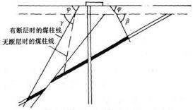
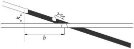
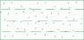
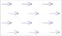
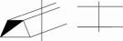
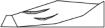

ICS 73 . 020 CCSD 09

中华人民共和国矿山安全行业标准

KA/T 22 . 3—2024

矿山隐蔽致灾因素普查规范

第 3 部分 : 金属非金属矿山及尾矿库

Spec,f,cat,0n f0r general 5urvey 0f h,dden d,5a5ter-cau5,ng fact0r5 ,n m,ne5

part 3: Metal  & n0nmetal m,ne5 and ta,l,ng5 p0nd5

2024-10-12 发布                                                                           2024-1 1-01  实施

国家矿山安全监察局      发  布

KA/T 22. 3—2024

目       次

[前言  	   Ⅱ](#bookmark1)

[1    范围  	  1](#bookmark2)

[2    规范性引用文件  	  1](#bookmark3)

[3    术语和定义  	  1](#bookmark4)

[4    资料收集与分析  	  2](#bookmark5)

[5    采空区  	  2](#bookmark6)

[6    地下矿山地质构造  	  5](#bookmark7)

[7    地下矿山水源与通道  	  6](#bookmark8)

[8    地下矿山地压活动区域  	  9](#bookmark9)

[9    地下矿山火区/高温异常区  	  11](#bookmark10)

[10    露天边坡  	  12](#bookmark11)

[11    排土场  	  14](#bookmark12)

[12    尾矿库  	  16](#bookmark13)

[13    成果提交  	  21](#bookmark14)

[附录 A(资料性)    金属非金属矿山及尾矿库隐蔽致灾因素普查资料收集清单  	  22](#bookmark15)

[附录 B(资料性)    金属非金属矿山及尾矿库隐蔽致灾因素普查成果表  	  26](#bookmark16)

[附录 C(资料性)    金属非金属矿山及尾矿库隐蔽致灾因素普查成果附图  	  51](#bookmark17)

[附录 D(规范性)    矿山隐蔽致灾因素普查成果附图图例  	  54](#bookmark18)

[参考文献  	  58](#bookmark19)

KA/T 22. 3—2024

前       言

本文件按照 GB/T 1 . 1—2020《标准化工作导则第 1 部分:标准化文件的结构和起草规则》的规定 起草 。

KA/T 22—2024《矿山隐蔽致灾因素普查规范》包括如下部分:

**— **矿山隐蔽致灾因素普查规范    第 1 部分:总则 ;

**— **矿山隐蔽致灾因素普查规范    第 2 部分:煤矿 ;

**— **矿山隐蔽致灾因素普查规范   第 3 部分:金属非金属矿山及尾矿库 。

本文件是 KA/T 22—2024《矿山隐蔽致灾因素普查规范》的第 3 部分 。

请注意本文件的某些内容可能涉及专利 。本文件的发布机构不承担识别专利的责任 。

本文件由国家矿山安全监察局安全基础司提出 。

本文件由矿山安全行业标准化技术委员会地质勘探分技术委员会归口 。

本文件起草单位:矿冶科技集团有限公司 、煤炭科学技术研究院有限公司 、华北有色工程勘察院有 限公司 、中国安全生产科学研究院 、江西钨业控股集团有限公司 。

本文件主要起草人:杨小聪 、于世波 、李宏艳 、韩贵雷 、付士根 、陈何 、马西员 、王莎 、秦秀山 、何斌斌 、 史建松、李健、王中伟、申宝宏、刘大金、牟义、王辉、刘强、陈璐、霍天宏、孙文杰、蒋鹏飞、原野、王贺、付搏涛、 袁胜超 、李宏杰 、甄智鑫 、刘光义 。

本文件为首次发布 。

矿山隐蔽致灾因素普查规范

第 3 部分:金属非金属矿山及尾矿库

1    范围

本文件规定了金属非金属矿山及尾矿库隐蔽致灾因素普查的术语和定义 , 资料收集与分析 , 采空 区 、地下矿山地质构造 、地下矿山水源与通道 、地下矿山地压活动区域 、地下矿山火区/高温异常区 、露天 边坡 、排土场 、尾矿库等隐蔽致灾因素普查工作以及成果提交等内容 。

本文件适用于金属非金属矿山及尾矿库隐蔽致灾因素普查工作以及地方政府组织的区域性金属非 金属矿山及尾矿库隐蔽致灾因素普查工作 。

本文件普查的矿山类型不包括:小型露天采石场;水文地质条件和工程地质条件均为简单型的小型 金属非金属露天矿山;地热 、温泉 、卤水 、砖瓦用粘土等非金属矿山;矿泉水等其他水气矿山 。

2    规范性引用文件

下列文件中的内容通过文中的规范性引用而构成本文件必不可少的条款 。其中 , 注 日期的引用文 件 , 仅该日期对应的版本适用于本文件;不注日期的引用文件 , 其最新版本(包括所有的修改单)适用于 本文件 。

GB50021    岩土工程勘察规范

GB51060    有色金属矿山水文地质勘探规范

GB/T 12719    矿区水文地质工程地质勘查规范

GB/T 2462    硫铁矿和硫精矿中有效硫含量的测定    燃烧中和法

GB/T 32864    滑坡防治工程勘查规范

GB/T 50123    土工试验方法标准

GB/T 50218    工程岩体分级标准

GB/T 50266    工程岩体试验方法标准

GB/T 50547    尾矿堆积坝岩土工程技术标准

GB/T 6730. 61    铁矿石    碳和硫含量的测定    高频燃烧红外吸收法

AQ 2061    金属非金属地下矿山防治水安全技术规范

DB/T 14    原地应力测量水压致裂法和套芯解除法技术规范

3    术语和定义

KA/T 22. 1 界定的以及下列术语和定义适用于本文件 。

3 . 1

金属非金属矿山    metal  &  nonmetal m,nes

直接从事金属非金属矿产资源生产或建设的业务单元 , 包含金属非金属地下矿山和金属非金属露 天矿山 。

3 . 2

尾矿库    ta,l,ngs pond

用以贮存金属 、非金属矿山进行矿石选别后排出尾矿的场所。 3 .  3

采空区顶板极限安全厚度    l,m,t safety th,ckness of goaf roof

保证上部露天采剥作业设备和人员安全所需的地下采空区最小上覆岩体厚度。 3 .  4

高寒地区    alp,ne reg,on

单月出现 10 天以上日最低气温低于 —25 ℃的地区。 3 . 5

尾矿库库区    ta,l,ngs reservo,r area

设计最终状态时坝顶标高水平面与尾矿坝体外坡面以下 、库底面以上所围成的空间区域(不含非尾 矿构筑的坝体) 。

3 .  6

尾矿堆积坝软弱层    weak layer ,n ta,l,ngs embankment

尾矿堆积坝内部的较大范围低强度堆积层 、软弱夹层或冰夹层。

4    资料收集与分析

4 . 1    收集金属非金属矿山及尾矿库以往勘查资料 、开采历史 、现状 , 以及生产区 、规划区的相关报告 、图 纸 、台账等资料 , 掌握金属非金属矿山及尾矿库的基本情况 、生产建设现状 、以往灾害(事故)情况等 , 资 料收集清单参见附录 A。

4 . 2    通过调查走访 , 掌握金属非金属矿山的开采历史 、开采工艺 、地面及井下现状等情况 , 以及尾矿库 的建设历史 、堆存工艺 、日常运行等情况 , 对收集的资料进行补充完善。

4 . 3    结合金属非金属矿山及尾矿库 3~5 年生产规划 , 分析以往地质勘查 、隐蔽致灾因素普查资料的完 整性及可靠性 , 确定隐蔽致灾因素普查的内容 、目标和方法 , 按照 KA/T22. 1 编制隐蔽致灾因素普查工 作方案。

5    采空区

5 .  1    一般规定

5 . 1 . 1    普查范围主要包括矿山采矿权范围内可能引发坍塌 、透水等灾害事故的本矿山开采形成的采空 区(空场法开采的遗留采空区 、崩落法开采的悬顶采空区 、充填法开采未接顶的采空区) 、历史开采遗留 的采空区(老空区) 、废弃的井巷等。

5 .  1 . 2    主要普查内容如下:

a )    采空区形成的时间 、原因 、位置 、空间形态及处理方式(封堵 、崩落 、充填或者隔离)等 ;

b )    废弃井巷的位置 、范围 、周边水体分布情况等 ;

c )    采空区内的积水面积 、积水量等 ;

d )    采空区周边岩土体和构造分布等 ;

e )    采空区地表的沉降变形 、塌陷范围和裂缝分布等。

5 . 1 . 3    采空区普查应收集矿山采矿权范围内及采矿权范围外 50 m 范围内的采空区资料 , 并掌握以下 主要内容:

a )    矿山开采历史 、现状 、规划等 ;

b )    采空区的大致位置 、处理方式 、积水情况 、周边岩土体和构造分布 、采空区周边岩土体和内部 填充物物理力学性质 、地表沉降和塌陷情况 、地表建(构)筑物位置及其变形破坏情况 、采空区 内部充填情况等 ;

c )    废弃井巷的大致位置 、可能分布范围 、周边水体情况等 ;

d )    历史遗留松散物堆场(排土场 、废石堆场 、尾砂堆场等) 、滑坡 、泥石流 、历史洪水等资料 。

5 . 1 . 4    采空区现场调查测绘的主要内容 :

a )    矿山地形地貌等地表特征 、地表沉降和塌陷分布范围 、裂缝位置及分布 、地表建(构)筑物位 置等 ;

b )    可安全靠近的采空区以及废弃井巷的位置 、岩性和构造大致分布情况 、出水情况 、处理方 式等 ;

c )    已实施的采空区专项治理工程的接顶情况等 。

5 . 1 . 5    采空区普查应在分析已有资料和现场调查测绘的基础上,针对实际工程量支撑的实测资料以及 收集到的采空区相关要素资料,评估其完整性和可靠性 。相关资料完整可靠的,可编制采空区普查章节 报告;否则应开展现场探查 、测试与试验等工作 。

5 . 2    现场探查

5 . 2 . 1    对生产区和规划区安全生产有影响的采空区,应采用物探 、钻探的方式进行探查 。

5 . 2 . 2    采空区探查采用物探方法时,物探范围应包含初步推断的采空区和外延区 。初步推断的采空区 根据收集的资料和现场调查结果综合圈定,外延区的范围为初步推断的采空区边界基础上向外延展不 少于 100 m 。物探方法的数量应符合下列要求 :

a )    对于影响生产区的分布不明的采空区,应采用不少于 2 种物探方法探测;对于影响生产区的 位置已知但要素掌握不全的采空区,应采用不少于 1 种物探方法探测 。

b )    对于规划区内的不明采空区,应采用不少于 1 种物探方法探测 。

5 . 2 . 3    具备地面物探条件的,应结合地质 、地形地貌条件 、采空区和地层物性特征 、干扰源特征等信息 综合确定物探方法 :

a )    埋深小于或者等于 50 m 的采空区,应选用探地雷达法 、地震勘探法 、微动法 、高密度电阻率 法 、瞬变电磁法或者微重力法等物探方法 ;

b )    埋深大于 50  m且小于或者等于 150 m 的采空区,应选用微动法 、地震勘探法 、瞬变电磁法或 者高密度电阻率法等物探方法 ;

c )    埋深大于 150  m 的采空区,应选用微动法 、地震勘探法 、瞬变电磁法 、可控源音频大地电磁法 或者直流电法等物探方法 。

5 . 2 . 4    具备矿井物探条件的,应根据探测 目的 、探测距离和地质条件等综合确定物探方法,并应符合以 下要求 :

a )    矿井物探应选用瞬变电磁法 、直流电法 、探地雷达法 、弹性波法(单点地震反射波法 、地震波反 射共偏移法 、瑞利面波法)或者超声波探测法等物探方法 ;

b )    矿井物探应对地面物探解译的物探异常区进行重点跟踪 。

5 . 2 . 5    物探测网布置及其测网密度应符合以下要求 :

a )    物探测线应垂直或者大角度相交于初步推断的采空区,测线长度应覆盖外延区 。

b )    地面物探方法的测网线距在初步推断的采空区范围内应不大于 10  m,在外延区应不大于 20 m;测网的点距在初步推断的采空区范围内应不大于基于采空区稳定性经验方法分析获得 的采空区极限暴露尺寸,原则上不大于 10 m,对于可能存在的窄小采空区应适当缩小测网的 线距和点距 。

c )    矿井物探方法的测网密度一般应符合下列要求 :

**— **探地雷达法:应进行高精度连续测量,巷道探测应不少于 3 条测线,点距应不大于 2 m;掘 进迎头工作面应不少于 2 条测线,角度应不大于 45。。

**— **直流电法 、瞬变电磁法:巷道探测应不少于 3 条测线,点距应不大于 10 m;在进行直流电 法电测深时,点距应不大于 5 m,应选用单极—偶极 、温纳装置或者偶极装置等,无穷远应 不小于 300 m,供电极距应不大于 200 m 。

**— **单点地震反射波法:应选用锤击或者机械震源,炮间距应小于 20cm,每炮应不少于 2 道 接收,超前探应不少于 3 炮 。

**— **地震波反射共偏移法:采用锤击震源时,应不少于 2 道,应不少于 12 炮,炮间距 、道间距 和炮检距应不小于 1 m;采用炸药震源时,应不少于 2 炮,应不少于 12 道,源间距和道间 距应不小于 1 m,炮检距应不小于 2 m 。

**— **瑞利面波法:应选用锤击或者机械震源,应不小于 6 道,应不小于 5 次叠加,道间距应不 小于 20cm,炮间距应不小于 50cm 。

5 . 2 . 6    物探圈定的疑似采空区应通过地面钻探 、井下钻探等方式进行验证,根据钻探或者采掘揭露情 况对物探成果进行验证 。验证钻孔应符合以下要求 :

a )    验证钻孔的布设应根据已有资料及物探成果综合确定,验证钻孔应布置在初步推断的采空区 范围之内 。

b )    验证钻孔的数量应根据疑似采空区的范围 、地质条件 、矿体产状和立体空间分布综合确定,每 个典型的疑似采空区应布置不少于 1 个验证钻孔,对于上部有建(构)筑物的物探异常区,应 增加验证钻孔数量 。

c )    验证钻孔应钻进至采空区或者穿过疑似采空区不少于 5 m 。

d )    采用井下钻探验证时,应在掘进巷道朝向疑似采空区方向布置验证钻孔,钻孔还应满足 AQ 2061 关于超前探放水的安全规定和要求 。

e )    露天矿山采空区验证钻孔的施工平台,应在疑似采空区上部不少于 2 个露天台阶设计高度, 且应大于 2 倍的采空区顶板极限安全厚度 。

5 . 2 . 7    采空区验证钻孔的钻探以及通过钻探发现的采空区,应符合以下要求 :

a )    应通过分析钻进深度 、岩芯采取率 、掉钻 、卡钻 、埋钻 、吸风 、漏水量 、水位变化 、起火(冒烟 、冒 气)等数据,验证采空区边界 、悬顶或者垮落等情况 ;

b )    应选用钻孔三维激光扫描 、声呐 、钻孔地震波 CT、钻孔电磁波 CT、钻孔地质雷达或者钻孔电 视等方法探测采空区边界及形状 ;

c )    应选用钻孔水文观测 、钻孔电阻率 CT、钻孔瞬变电磁法或者钻孔激发极化法等方法探测采空 区积水情况 ;

d )    对于有稳定性分析需求的采空区,应开展取芯 、测斜 、钻探编录 、RQD、结构面粗糙和风化程度 统计等工作 。

5 . 3    普查程度及危险性分析

5 . 3 . 1    对于影响生产区安全生产的采空区,应查明以下要素,并分析其危险性 :

a )    采空区形成的时间 、原因 、位置 、空间形态 、处理方式,掌握采空区的基本情况 ;

b )    废弃井巷的位置 、范围 、周边水体分布,掌握废弃井巷的基本情况 ;

c )    采空区内的积水面积 、积水量,分析采空区透水的可能性 ;

d )    采空区周边岩性和构造分布,分析采空区 自 身的稳定性及采空区坍塌 、边坡失稳 、滑坡等 风险 ;

e )    采空区地表的沉降变形 、塌陷范围和裂缝分布,分析地表水体对采空区的补给情况以及采空 区自身坍塌 、淹井 、边坡失稳 、滑坡等风险 。

5 . 3 . 2    对于影响规划区安全生产的采空区,应基本查明以下要素,并分析其危险性 :

a )    采空区的位置 、大致空间状态,掌握采空区的基础情况 ;

b )    废弃井巷的位置 、范围 、可能存在的周边水体,掌握废弃井巷的基础情况 ;

c )    采空区内是否存在积水,分析其对规划区安全生产的影响。

5 . 4    普查结论

5 . 4 . 1    采空区普查结论应包括资料收集分析 、现场探查等工作量,普查成果 、普查程度 、危险性分析及 防治措施建议等内容,并在附录 B 中表 B. 1 和表 B. 2 体现。

5 . 4 . 2    编制采空区普查成果统计表和废弃井巷普查成果统计表(见附录 B 中表 B. 3 、B. 4) 。

5 . 4 . 3    应按附录 C及附录 D 的要求,绘制采空区普查成果图。

6    地下矿山地质构造

6 .  1     一般规定

6 . 1 . 1    普查范围主要包括地下矿山采矿权范围内可能引发突水 、透水 、坍塌 、岩爆或矿震等灾害事故的 褶皱 、断层 、主要节理和层理等。

6 .  1 . 2    主要普查内容如下 :

a )    褶皱的位置 、类型 、两翼产状 、空间形态 、轴部破碎情况及富水性 、导水性等 ;

b )    断层的位置 、类型 、宽度 、产状 、空间形态 、充填及胶结情况 、富水性 、导水性等 ;

c )    主要节理和层理的产状 、发育密度 、粗糙度 、张开度 、充填及胶结情况等。

6 . 1 . 3    地质构造普查应收集资料,并掌握以下主要内容 :

a )    以往勘查报告等 ;

b )    区域地质构造与地震灾害等 ;

c )    地质构造出水 、治水记录等 ;

d )    因地质构造引发的采掘空间变形 、坍塌等相关资料 ;

e )    相邻矿区的上述资料。

6 . 1 . 4    地质构造地表现场调查测绘的主要内容包括 :

a )    褶皱的地表出露情况 、平面分布 、类型 、产状 、地层岩性等 ;

b )    断层的地表出露情况 、类型 、产状 、地层岩性及破碎程度等 ;

c )    主要节理和层理的地表出露情况及相关要素。

6 . 1 . 5    地质构造井下调查测绘的主要内容包括 :

a )    断层的类型 、产状 、宽度 、充填物成分 、胶结程度以及断层出水点的位置 、流量等 ;

b )    对采掘工程稳定性有影响的主要节理和层理及其相关要素。

6 . 1 . 6    地下矿山地质构造应在分析已有资料和现场调查测绘的基础上,针对实际工程量支撑的实测资 料以及收集到的地质构造相关要素资料,评估其完整性和可靠性。 相关资料完整可靠的,可编制地下矿 山地质构造章节内容;否则应开展现场探查 、测试与试验等工作。

6 . 2    现场探查

6 . 2 . 1    对地下矿山生产区和规划区安全生产可能产生影响的地质构造,应采用物探 、钻探 、测试与试验 的方式进行探查。

6 . 2 . 2    采用物探与钻探相结合的方式探查地质构造时,应符合下列要求 :

a )    对于影响生产区的地质构造,应选用不少于 2 种物探方法;对于影响规划区的地质构造,应选 用不少于 1 种物探方法 ;

b )    地面物探应选用直流电法 、瞬变电磁或者可控源音频大地电磁等方法 , 测线间距应不大于 200 m , 点距应不大于 50 m ;

c )    矿井物探应选用反射波法 、槽波法或者瞬变电磁法等方法 ;

d )    物探推断的疑似褶皱或者断层应布设验证钻孔 , 钻孔应穿过疑似褶皱或者断层不少于 5  m ;

e )    钻孔施工技术要求应参照 GB/T 12719 、GB51060 和 AQ 2061  的相关规定执行 。

6 . 2 . 3    采用钻探的方式探查地质构造时 , 应符合下列要求:

a )    钻孔布置应控制推测褶皱或者断层的空间分布 , 控制性钻孔应不少于 3 个 ;

b )    钻孔方位应垂直或者大角度斜交推测褶皱或者断层的延伸方向 , 深度应穿过推测褶皱或者断 层不少于 5 m ;

c )    钻孔施工技术要求应参照 GB/T 12719 、GB51060 和 AQ 2061  的相关规定执行 。

6 . 2 . 4    褶皱和断层的含水特征 、破碎程度以及富水性 、导水性的现场测试 , 应符合下列要求:

a )    褶皱和断层的含水特征探查应选用视电阻率或者自然电位等测试方法 ;

b )    褶皱和断层的破碎程度探查应采用波速测试等测试方法 ;

c )    褶皱和断层的富水性 、导水性探查应采用抽(压)水试验等方法 。

6 . 3    普查程度与危险性分析

6 . 3 . 1    对于影响生产区安全生产的地质构造 , 应查明以下要素 , 并分析其危险性:

a )    褶皱的位置 、类型 、两翼产状 、空间形态 、轴部破碎情况及富水性 、导水性 , 分析引发突水等的 风险 ;

b )    断层的位置 、类型 、宽度 、产状 、空间形态 、充填及胶结情况 、富水性 、导水性 , 分析引发突水 、透 水 、坍塌 、岩爆或矿震等的风险 ;

c )    主要节理和层理的产状 、发育密度 、粗糙度 、张开度 、充填及胶结情况 , 分析对采掘工程稳定性 的影响 。

6 . 3 . 2    对于影响规划区安全生产的褶皱和断层 , 应基本查明褶皱和断层的位置 、类型 、空间形态 , 掌握 褶皱和断层的基础情况并分析对规划区安全生产的影响 。

6 . 4    普查结论

6 . 4 . 1    地下矿山地质构造普查结论应包括资料收集分析 、现场探查等工作量 , 普查成果 、普查程度 、危 险性分析及防治措施建议等内容 , 并在附录 B 中表 B. 1 和表 B. 2 体现 。

6 . 4 . 2    编制地下矿山地质构造普查成果统计表(见附录 B 中表 B. 5) 。

6 . 4 . 3    应按附录 C及附录 D 的要求 , 绘制地下矿山地质构造普查成果图 。

7    地下矿山水源与通道

7 .  1     一般规定

7 . 1 . 1    普查范围主要包括地下矿山采矿权范围内及周边影响矿山安全生产的地表水体 , 以及可能引发 突水 、透水等灾害事故的含水层(含流砂层) 、积水采空区 、导水构造带 、强岩溶带(含暗河) 、垮落带 、封闭 不良钻孔 、地表塌陷区等 。

7 .  1 . 2    主要普查内容如下 :

a )    地表水体名称 、类型 、水位 、流量(水量)及季节变化规律 , 以及地表水体的渗漏地段和充水方 式等 ;

b )    采空区内的积水面积 、积水量等(见第 5 章) ;

c )    主要充水含水层位置 、厚度 、岩性 、富水性 、导水性等 ;

d )    直接顶(底)板隔水层的岩性 、厚度 、分布 、连续性等 ;

e )    导水构造带或者强岩溶带的发育位置 、空间形态 、富水性 、导水性等 ;

f )    邻近地表水体或者强含水层的垮落带位置 、高度以及沟通水源的情况等 ;

g )    封闭不良钻孔孔口坐标 、孔深 、揭露矿体和含水层情况等 ;

h)    地表塌陷区的位置 、面积 、积水情况 、裂缝发育情况 、防排水措施等 。

7 . 1 . 3    水源与通道普查应收集资料,并掌握以下主要内容 :

a )    区域气象 、地表水体动态观测资料等 ;

b )    矿区历年排水量 、突水 、透水 、突泥溃砂记录等 ;

c )    矿区地下水动态观测资料,包括观测孔的地下水水位 、水压及出水点的位置 、流量等 ;

d )    含(隔)水层的类型 、渗透系数 、导水系数 、钻孔单位涌水量等水文地质参数 ;

e )    导水构造带 、强岩溶带 、垮落带等相关资料 ;

f )    已实施的防治水工程的位置 、方法与治水效果评估等资料 ;

g )    矿山以往钻孔资料 ;

h)    地表塌陷区位置 、分布范围 、积水情况 、裂缝发育情况及防排水措施等资料 。

7 . 1 . 4    水源与通道地表现场调查测绘的主要内容包括 :

a )    矿区地形地貌 、第四系松散层分布 、基岩出露及岩溶发育情况 ;

b )    井 、泉的水量及季节变化规律 ;

c )    地表水体的分布 、水位 、水深 、流量(容量) 、最大洪水淹没范围及其与地下水的水力联系 ;

d )    地表塌陷区位置 、分布范围 、积水深度 、裂缝发育情况及防排水措施 。

7 . 1 . 5    水源与通道井下调查的主要内容包括 :

a )    含水层产状 、厚度 、岩性等 ;

b )    出水裂隙的产状 、宽度 、密度 、充填程度及充填物 、地下水活动痕迹等 ;

c )    岩溶形态 、分布 、充填状态 、充填物成分 、充水状况等 ;

d )    出水点的位置及标高 、出水时间 、出水层位 、出水形式 、初始和稳定涌水量及水头压力 、含泥 (砂)量 、围岩破坏情况等 。

7 . 1 . 6    地下矿山水源与通道普查应在分析已有资料和现场调查测绘的基础上,针对实际工程量支撑的 实测资料以及收集到的水源与通道相关要素资料,评估其完整性和可靠性 。相关资料完整可靠的,可编 制地下矿山水源与通道章节内容;否则应开展现场探查 、测试与试验等工作 。

7 . 2    现场探查

7 . 2 . 1    对地下矿山生产区和规划区安全生产可能产生影响的水源与通道,应采用物探 、钻探 、测试与试 验的方式进行探查 。

7 . 2 . 2    地表水体渗漏地段的探查,应符合以下要求 :

a )    采用物探与钻探相结合的方式进行探查时,主要要求包括 :

**— **物探应选用直流电法 、电磁法或者地震法等方法,物探范围应涵盖可能的渗漏区域,测线 数量应不少于 3 条,测线方向应垂直于推断的渗漏方向 ;

**— **物探推断的疑似渗漏地段应布设验证钻孔,钻孔应穿过物探异常的下限不少于 5  m 。

b )    采用钻探的方式进行探查时,主要要求包括 :

**— **钻孔布置应构成剖面,剖面应能控制推测的渗漏地段且总数不应少于 2 条 ;

**— **每条剖面应布设不少于 2 个钻孔,钻孔深度应能查明推测渗漏地段的水文地质特征 。

c )    渗漏地段地表水体与矿井水水力联系 、渗漏地段水文地质参数的现场测试,主要要求包括 :

**— **应选用示踪试验或者同位素测试等方法探查渗漏地段地表水体与矿井水的水力联系 ;

**— **应采用抽(压)水试验等方法探查渗漏地段的水文地质参数 。

7 . 2 . 3    主要充水含水层或者直接顶(底)板隔水层的探查 , 应符合以下要求:

a )    采用物探与钻探相结合的方式进行探查时 , 主要要求包括:

**— **物探应选用瞬变电磁法 、高密度电法或者激发极化法等方法 , 物探范围应涵盖可能对生 产区和规划区安全生产有影响的主要充水含水层及直接顶(底)板隔水层 , 测线应垂直于 推测的含(隔)水层主要走向 ;

**— **物探推断的主要充水含水层及直接顶(底)板隔水层应布设验证钻孔 , 钻孔应穿过推断主 要充水含水层 、进入推断直接底板隔水层不少于 10 m 。

b )    采用钻探的方式进行探查时 , 主要要求包括:

**— **钻孔布设应能控制推测的主要充水含水层及直接顶(底)板隔水层 ;

**— **钻孔数量应不少于 3 个 , 钻孔应穿过推断主要充水含水层 、进入推断直接底板隔水层不 少于 10 m 。

c )    主要充水含水层及直接顶(底)板隔水层水文地质参数的现场测试 , 主要要求包括:

**— **应采用抽(压)水试验等方法探查主要充水含水层及直接顶(底)板隔水层的水文地质 参数 ;

**— **揭露多个含(隔)水层时 , 可采用分层试验查明各含(隔)水层的水文地质参数 。

7 . 2 . 4    导水构造带或者强岩溶带的探查 , 应符合以下要求:

a )    采用物探与钻探相结合的方式进行探查时 , 主要要求包括:

**— **物探应选用直流电法类 、电磁类或者地震类等方法 , 物探范围应能控制可能对生产区和 规划区安全生产有影响的导水构造带或者强岩溶带 , 推测的导水构造带或者强岩溶带内 应不少于 3 个有效物探点 。

**— **物探推断的疑似导水构造带或者强岩溶带应布设验证钻孔 , 每处疑似导水构造带或者强 岩溶带的钻孔数量应不少于 1 个 , 钻孔应穿过疑似导水构造带不少于 5  m 、应钻进至强岩 溶带或者穿过疑似强岩溶带不少于 5 m 。

b )    采用钻探的方式进行探查时 , 主要要求包括:

**— **钻孔布置应能控制推测的导水构造带或者强岩溶带 。

**— **推测的单个导水构造带或者强岩溶带应布置不少于 2 个钻孔 , 钻孔应穿过疑似导水构造 带不少于 5 m 、应钻进至强岩溶带或者穿过疑似强岩溶带不少于 5 m 。

c )    导水构造带或者强岩溶带水文地质参数和补给强度的现场测试 , 主要要求包括:

**— **应采用抽(放)水试验等方法探查导水构造带或者强岩溶带的水文地质参数和补给强度 。 **— **补给源不清的 , 应选用示踪试验或者环境同位素等测试方法进行测试 。

7 . 2 . 5    邻近地表水体或者强含水层的垮落带探查 , 应符合以下要求:

a )    物探应选用直流电法类 、电磁类或者地震类等方法 , 物探范围应涵盖可能的垮落带边界 , 推测 垮落带边界内应不少于 3 个有效物探点 ;

b )    应在具备安全作业条件的位置布设验证钻孔 , 钻孔应钻进至垮落带边界或者穿过疑似垮落带 不少于 5 m ;

c )    应采用抽水试验和示踪试验等方法探查垮落带与邻近地表水体或者强含水层的联系 。

7 . 2 . 6    钻孔施工技术要求应参照 GB/T 12719 、GB51060 和 AQ 2061  的相关规定执行 。

7 . 3    普查程度与危险性分析

7 . 3 . 1    对于影响生产区安全生产的水源与通道 , 应查明以下要素 , 并分析其危险性:

a )    地表水体名称 、类型 、水位 、流量(水量)及季节变化规律 、渗漏地段 , 掌握地表水体基本情况并 分析发生透水的可能性 ;

b )    主要充水含水层位置 、厚度 、富水性 、导水性及直接顶(底)板隔水层特征 , 掌握主要充水含水

层的基本情况 ;

c )    导水构造带或者强岩溶带的发育位置 、空间形态 、富水性 、导水性,分析可能的突水风险 ;

d )    邻近地表水体或者强含水层的垮落带位置 、高度 、导水性 、沟通水源的程度,分析引发透水的 风险 ;

e )    封闭不良钻孔孔口坐标 、孔深及其揭露矿体和强含水层状态,分析引发的透水风险 ;

f )    地表塌陷区的位置 、面积 、积水情况 、裂缝发育程度 、防排水措施,分析发生透水的可能性。

7 . 3 . 2    对于影响规划区安全生产的水源与通道,应基本查明以下要素,并分析其危险性 :

a )    地表水体名称 、类型 、渗漏地段,掌握地表水体基础情况并分析对规划区安全生产的影响 ;

b )    主要充水含水层位置 、岩性 、富水性及直接顶(底)板隔水层的特征,掌握主要充水含水层基础 情况 ;

c )    导水构造带或者强岩溶带的发育位置 、空间形态,分析导水构造带或者强岩溶带对规划区安 全生产的影响 ;

d )    封闭不良钻孔的分布情况,分析封闭不良钻孔对规划区安全生产的影响 ;

e )    地表塌陷区的位置 、面积及防排水措施,分析地表塌陷区对规划区安全生产的影响。

7 . 4    普查结论

7 . 4 . 1    地下矿山水源与通道普查结论应包括资料收集分析 、现场探查等工作量,普查成果 、普查程度 、 危险性分析及防治措施建议等内容,并在附录 B 中表 B. 1 和表 B. 2 体现。

7 . 4 . 2    编制地下矿山充水水源普查成果统计表和地下矿山充水通道普查成果统计表(见附录 B 中表 B. 6 、B. 7) 。

7 . 4 . 3    应按附录 C及附录 D 的要求,绘制地下矿山水源与通道普查成果图。

8    地下矿山地压活动区域

8 .  1     一般规定

8 . 1 . 1    普查范围主要包括地下矿山采矿权范围内可能引发生产区和规划区发生坍塌 、岩爆 、矿震等灾 害事故的原岩应力 、岩爆倾向性 、地质构造等。

8 .  1 . 2    主要普查内容如下 :

a )    矿山原岩应力的大小 、方向及分布规律 ;

b )    矿体和围岩的岩爆倾向性 ;

c )    地质构造分布特征(见第 6 章)与岩体质量 ;

d )    因采掘引起的地压活动影响范围。

8 . 1 . 3    地压活动区域普查应收集资料,并掌握以下主要内容 :

a )    矿山工程地质与水文地质资料,以及矿体的大小 、数量 、位置 、空间形态等 ;

b )    原岩应力测试数据 、矿体和围岩岩爆倾向性测试数据等 ;

c )    采掘工程设计资料 、采掘过程记录 、日常充填记录等 ;

d )    地压活动的历史记录 、地压监测数据(微震 、应力 、变形等) 、地表沉降变形监测数据等 ;

e )    采矿方法与采场布置 、回采顺序 、矿柱留设 、采空区分布情况等 ;

f )    充填类型 、充填灰砂比 、充填体强度 、充填接顶程度等 ;

g )    井巷和采场支护等资料。

8 . 1 . 4    地压活动区域现场调查测绘的主要内容 :

a )    矿体 、上盘和下盘岩体以及其他地压显现区域的岩体结构面特征与岩体质量等 ;

b )    巷道 、采场 、矿柱变形的破坏方式 、程度 、范围等 ;

c )    巷道和采场的支护方式 、支护破坏类型 、破坏程度和破坏范围等 ;

d )    地表沉降变形 、开裂 、塌陷范围及程度等 。

8 . 1 . 5    地下矿山地压活动区域普查应在分析已有资料和现场调查测绘的基础上 , 针对实际工程量支撑 的实测资料以及收集到的地压活动区域相关要素资料 , 评估其完整性和可靠性 。相关资料完整可靠时 , 可编制地下矿山地压活动区域章节内容;否则应开展现场探查 、测试与试验等工作 。

8 . 2    现场探查

8 . 2 . 1    矿山原岩应力的现场测试 , 应符合下列要求:

a )    矿山的原岩应力可根据 GB/T 50218  中的附录 C进行初步评估 。

b )    存在以下情况之一的 , 应采用原岩应力现场测量方法查明矿山原岩应力的分布规律:

**— **工程地质条件复杂的矿山 ;

**— **开采深度超过 800 m(井巷工程最高标高至最低开采中段运输水平标高间的垂直距离)的 矿山 ;

**— **设计生产能力 300 万吨/年以上矿山 ;

**— **露天转地下的矿山以及露天和地下同时生产的矿山 。

c )    矿山原岩应力现场测量方法可采用 GB/T 50266 和 DB/T 14 推荐方法 。

d )    矿山原岩应力现场测量的测点数量应不少于 3 个 , 且各个测点应处于不同标高 。

8 . 2 . 2    矿山岩爆倾向性的测试 , 应符合下列要求:

a )    存在以下情况之一的 , 应查明矿岩的岩爆倾向性:

**— **有强烈震动 、瞬间底鼓 、矿岩弹射等现象 ;

**— **相邻矿山开采同一深度发生过岩爆 ;

**— **开采深度超过 1000 m(井巷工程最高标高至最低开采中段运输水平标高间的垂直距离) 。

b )    应在矿体 、上盘和下盘岩体分别采取岩样 , 取样方法应符合 GB 50021  的相关规定;应进行单 轴压缩变形试验或者循环加卸载试验 , 每种岩性有效试件数量不少于 3 个 , 试验方法可参照 GB/T 50266 等的相关规定执行 。

8 . 2 . 3    因采掘活动已导致明显的地压显现现象(矿柱折损与开裂 、巷道持续变形 、岩爆 、矿震等)时 , 应 采用钻孔应力监测或者微震监测等方法查明地压活动影响范围 。

8 . 3    普查程度及危险性分析

8 . 3 . 1    对于生产区内的地压活动区域 , 应查明以下要素 , 并分析其危险性:

a )    矿山原岩应力大小 、方向以及分布规律 , 掌握矿山原岩应力的基本情况 ;

b )    矿体和围岩的岩爆倾向性 , 分析生产区受到岩爆动力灾害的影响程度 ;

c )    地质构造分布特征与岩体质量 , 分析可能造成的灾害类型及其危险性 ;

d )    因采掘活动引起的地压活动影响范围 , 分析生产区地压显现的危险性 。

8 . 3 . 2    对于规划区内的潜在地压活动区域 , 应基本查明以下要素 , 并分析其危险性:

a )    矿山原岩应力大小 、方向以及分布规律 , 掌握矿山原岩应力的基本情况 ;

b )    矿岩的岩爆倾向性 , 分析规划区受到岩爆动力灾害的潜在影响程度 ;

c )    地质构造分布特征 , 分析可能造成的灾害类型及其对规划区安全生产的潜在影响 。

8 . 4    普查结论

8 . 4 . 1    地下矿山地压活动区域普查结论应包括资料收集分析 、现场探查等工作量 , 普查成果 、普查程 度 、危险性分析及防治措施建议等内容 , 并在附录 B 中表 B. 1 和表 B. 2 体现 。

8 . 4 . 2    编制地下矿山地压活动区域普查成果统计表(见附录 B 中表 B. 8) 。

8 . 4 . 3    应按附录 C及附录 D 的要求 , 绘制地压活动区域普查成果图。

9    地下矿山火区/高温异常区

9 .  1    一般规定

9 . 1 . 1    普查范围主要包括地下矿山采矿权范围内可能引发火灾 、中毒窒息等灾害事故的高含硫矿岩 、 自燃倾向性 、有毒有害气体等。

9 .  1 . 2    主要普查内容如下 :

a )    矿石及相邻围岩的硫含量 ;

b )    矿石及相邻围岩的自燃倾向性 、最短自然发火期 ;

c )    高温异常区和未封闭火区的位置 、分布范围 、温度 、有毒有害气体成分和含量以及实施的防火 措施等 ;

d )    已封闭火区的位置 、发火时间 、封闭时间 、密闭墙参数 、相邻中段防火矿柱的预留情况以及实 施的防火措施等。

9 . 1 . 3    火区/高温异常区普查应收集资料 , 并掌握以下主要内容:

a )    矿石及相邻围岩的硫含量 ;

b )    硫含量大于 15%矿石及相邻围岩的自燃倾向性和最短自然发火期 ;

c )    矿山通风系统等相关资料 ;

d )    火区/高温异常区等相关统计资料 ;

e )    防火工程设计及施工等资料。

9 . 1 . 4    火区/高温异常区现场调查测绘的主要内容:

a )    未封闭火区/高温异常区的位置 、范围 、温度等 ;

b )    已封闭火区的位置 、范围 、密闭墙参数以及相邻中段防火矿柱的位置 、形态和完好程度。

9 . 1 . 5    地下矿山火区/高温异常区普查应在分析已有资料和现场调研的基础上 , 针对实际工程量支撑 的实测资料以及收集到的火区/高温异常区相关要素资料 , 评估其完整性和可靠性。 相关资料完整可靠 的 , 可编制地下矿山火区/高温异常区普查章节内容;否则应开展现场探查 、测试与试验等工作。

9 . 2    现场探查

9 . 2 . 1    矿石及相邻围岩硫含量的测试 , 应符合以下要求:

a )    对揭露的矿体和相邻围岩分别取样 ;

b )    应选用刻槽法 、刻线法 、打眼法 、方格法 、拣块法 、剥层法或者全巷法等方法进行取样 ;

c )    硫含量测试应选用红外吸收法 、发射光谱分析法 、原子吸收光谱分析法 、滴定法或者硫酸钡重 量法等方法。 具体测试方法可参照 GB/T 2462 、GB/T 6730. 61 等的相关规定执行。

9 . 2 . 2     自燃倾向性 、最短自然发火期的测试 , 应符合以下要求:

a )    对于硫含量大于 15%的矿岩 , 应开展自燃倾向性和最短自然发火期的测定 ;

b )    自燃倾向性的测定应选用吸氧速度常数法或者程序升温氧化法等方法 ;

c )    最短自然发火期的测定应采用低温氧化实验法等方法。

9 . 2 . 3    有毒有害气体的采样与成分测试 , 应符合以下要求:

a )    有毒有害气体应至少采集 3 次 , 每次采集应至少间隔一天 ;

b )    气样采集应选用化学吸收采样法或者气袋采样法等方法 ;

c )    采样前应确保通风设施保持正常状态 , 避免炮烟或者其他因素对气体试样浓度的影响 , 并检 查采样袋的气密性 , 然后将采样袋原有气体全部挤出 , 被采样的气体充满采样袋 , 再压挤 、排 尽 , 反复三次 ;

d )    有毒有害气体的成分测试应选用气相色谱法或者化学吸收法等方法 。

9 . 3    普查程度与危险性分析

9 . 3 . 1    对于影响生产区的火区/高温异常区 , 应查明以下要素 , 并分析其危险性:

a )    矿石及相邻围岩的硫含量 , 分析潜在自燃发火风险的区域分布 ;

b )    对于硫含量大于 15%的矿岩 , 应查明矿石及相邻围岩的自燃倾向性 、最短自然发火期 , 分析发 生火灾的可能性及危险程度 ;

c )    高温异常区和未封闭火区的位置 、分布范围 、温度 、有毒有害气体成分和含量 , 分析高温异常 区和未封闭火区的影响范围及其对通风系统的影响 ;

d )    已封闭火区的位置 、范围 、发火时间 、封闭时间 、密闭墙参数以及相邻中段防火矿柱的位置 、形 态和完好程度 , 分析封闭火区的安全程度 。

9 . 3 . 2    对于影响规划区的高温异常区 , 应基本查明高温异常区的位置 、范围 , 分析高温异常区的可能影 响范围 。

9 . 4    普查结论

9 . 4 . 1    地下矿山火区/高温异常区普查结论应包括资料收集分析 、现场探查等工作量 , 普查成果 、普查 程度 、危险性分析及防治措施建议等内容 , 并在附录 B 中表 B. 1  和表 B. 2 体现 。

9 . 4 . 2    编制地下矿山火区/高温异常区普查成果统计表(见附录 B 中表 B. 9) 。

9 . 4 . 3    应按附录 C及附录 D 的要求 , 绘制地下矿山火区/高温异常区普查成果图 。

10    露天边坡

10.  1    一般规定

10. 1 . 1    普查范围主要包括可能导致露天矿山采矿权范围内发生滑坡 、坍塌等灾害事故的地质构造 、边 坡岩体 、水文地质特征 、采空区(含溶洞)等 。

10.  1 . 2    主要普查内容如下 :

a )    地质构造 , 包括断层 、破碎带 、节理的类型 、产状及其分布等 ;

b )    边坡岩体 , 包括地层 、岩性 、岩土物理力学性质 、结构面抗剪强度指标 、高寒地区岩体冻融深度 和岩石的冻融系数等 ;

c )    水文地质特征 , 包括含(隔)水层分布 、地下水位 、岩土体渗透性以及补给 、径流 、排泄条件等 ;

d )    采空区(见第 5 章) 。

10. 1 . 3    露天边坡普查应收集露天矿山采矿权范围内及采矿权范围外宽 1/2~2/3 边坡高度范围内的 露天边坡资料 , 并掌握以下主要内容:

a )    矿山工程地质资料 , 包括地质构造 、地层和岩性分布 、岩体结构面调查与岩体质量评价数据 , 岩石物理力学性质 、结构面抗剪强度指标 、高寒地区岩体冻融深度和岩石冻融系数等 ;

b )    水文地质资料 , 包括地表水体分布 、含(隔)水层的类型 、渗透系数 、钻孔单位涌水量等 ;

c )    露天采场设计及采剥工程现状等资料 ;

d )    边坡稳定性研究等相关资料 ;

e )    边坡监测等相关资料 ;

f )    边坡以往滑坡 、专项治理工程等资料 ;

g )    采空区(溶洞)等相关资料 ;

h)    松散物堆场(排土场 、废石堆场 、尾砂堆场等)的相关资料 。

10. 1 . 4    露天边坡现场调查测绘的主要内容:

a )    断层的地表出露情况 、平面分布 、类型 、产状 、地层岩性 、构造破碎带特征等 ;

b )    主要节理和层理的地表出露情况与相关要素等 ;

c )    矿区地形地貌 、第四系松散层的分布及岩溶发育情况等 ;

d )    边坡出水点的水量及其变化特征等 。

10. 1 . 5    露天边坡普查应在分析已有资料和现场调查测绘的基础上 , 针对实际工程量支撑的实测资料 以及收集到的露天边坡相关要素资料 , 评估其完整性和可靠性 。相关资料完整可靠时 , 可编制露天边坡 章节内容;否则应开展现场探查 、测试与试验等工作 。

10. 2    现场探查

10. 2 . 1    露天边坡地质构造 、地层 、岩性探查 , 应符合以下要求:

a )    露天采场生产区和规划区内对露天边坡稳定性可能产生影响的地质构造 、地层 、岩性 、高寒地 区岩体冻融深度应采用物探 、钻探等方式进行探查 。

b )    采用物探与钻探相结合的方式进行探查时 , 物探应选用地震勘探法 、探地雷达法 、高密度电阻 率法或者瞬变电磁法等方法 , 物探测线间距应不大于 50 m , 并布设物探的验证钻孔 , 钻孔数量 应不少于 2 个 。

c )    采用钻探方式时 , 钻探的勘探线应垂直边坡走向布置 , 勘探线和勘探孔的布置应根据勘探对 象预估规模 、空间位置确定 , 勘探孔应穿过潜在滑动面并深入稳定地层不少于 5 m 。

d )    主要岩土层 、软弱层(断层 、破碎带 、高寒地区冻融岩体)应采取试样 , 单个土层应不少于 6 件 、 单个主要岩层应不少于 9 件 。取样设备 、取样方法和取样间距应符合 GB50021  的相关规定 。

10. 2 . 2    露天边坡岩土体物理力学性质测试主要包括:

a )    土的容重试验 、含水率试验 、直接剪切试验等 。

b )    岩石的块体密度试验 、(天然/饱和)单轴抗压强度试验 、单轴压缩变形试验 、抗拉强度试验 、三 轴压缩强度试验等 。

c )    露天边坡分布有特殊力学性质的岩石时 , 应开展相关试验:

**— **膨胀特性岩石的膨胀性试验 ;

**— **高寒地区岩石的冻融试验 ;

**— **蠕变特性岩石的蠕变试验 。

d )    岩体结构面应开展结构面直剪试验 。

e )    对控制边坡稳定的断层破碎带应开展直接剪切试验 。

f )    土的物理力学性质测试应按照 GB/T 50123  的相关规定执行 , 岩石和岩体结构面的物理力学 性质测试应按照 GB/T50266 的相关规定执行 , 断层破碎带的直接剪切试验应按照 GB50021 的相关规定执行 。

10. 2 . 3    露天边坡水文地质特征的探查 , 应符合以下要求:

a )    应选用钻孔 、探井或者测压管等方法测试露天边坡地下水位 , 测试方法应按照 GB50021  的规 定执行 。

b )    应选用抽水试验 、注水试验 、压水试验或者室内渗透试验等方法测试岩层渗透系数 , 试验方法 应按照 GB50021  的相关规定执行 。

c )    存在以下情况之一的 , 应进行水文地质补充勘探 。水文地质补充勘探的布置原则和工程量参 照 GB/T 12719  的相关规定执行 。

**— **矿山主要勘探目的层未开展过水文地质勘探工作 ;

**— **矿山原勘探工程量不足 , 水文地质条件未查清 ;

**— **经采剥揭露 , 水文地质条件比原勘探报告复杂 ;

**— **矿山水文地质条件因长期开采已发生较大变化 , 原勘探报告不能满足安全生产要求 。

10. 3    普查程度与危险性分析

10. 3 . 1    对于生产区内的露天边坡,应查明以下要素,并分析其危险性 :

a )    地质构造特征,包括断层 、破碎带 、节理的类型 、产状 、分布等,分析地质构造对露天边坡稳定 性的影响。

b )    边坡岩体结构和力学特征,包括地层 、岩性的分布和结构状态,岩土物理力学性质和结构面抗 剪强度指标,以及高寒地区边坡的冻融深度和岩石的冻融系数等,分析边坡岩体对露天边坡 稳定性的影响。

c )    水文地质特征,包括地表水体 、含(隔)水层 、地下水位 、岩土渗透性及补给 、径流 、排泄条件等, 分析水文地质特征对露天边坡稳定性的影响。

d )    采空区,掌握采空区的基本情况并分析采空区对露天边坡稳定性的影响。

10. 3 . 2    对于规划区内的露天边坡,应基本查明以下要素,并分析其危险性 :

a )    地质构造特征,包括断层 、破碎带的类型和分布等,分析地质构造对规划区边坡稳定性的潜在 影响。

b )    边坡岩体结构和力学特征,包括地层 、岩性分布以及主要岩土体的物理力学性质等,分析边坡 岩体对规划区边坡稳定性的潜在影响。

c )    水文地质特征,包括含(隔)水层 、地下水位等,分析水文地质特征对规划区边坡稳定性的潜在 影响。

d )    采空区,掌握采空区的基础情况并分析采空区对规划区边坡稳定性的潜在影响。

10. 4    普查结论

10. 4 . 1    露天边坡普查结论应包括资料收集分析 、现场探查等工作量,普查成果 、普查程度 、危险性分析 及防治措施建议等内容,并在附录 B 中表 B. 1 和表 B. 2 体现。

10. 4 . 2    编制露天边坡普查成果统计表(见附录 B 中表 B. 10) 。

10. 4 . 3    应按附录 C及附录 D 的要求,绘制露天边坡普查成果图。

1 1    排土场

1 1 . 1    一般规定

1 1 .  1 . 1    普查范围主要包括可能导致排土场设计边界范围内发生滑坡 、泥石流等灾害事故的排土场地 基 、排弃物料 、地表水体 、地下水等。

1 1 .  1 . 2     主要普查内容如下 :

a )    排土场地基参数,包括断层发育特征和持力层及以上岩土分布范围 、岩土物理力学性质 、地基 承载力等 ;

b )    排弃物料的岩性组成 、颗粒级配及抗剪强度指标等 ;

c )    地表水体的类型及其与排土场的位置关系 ;

d )    排土场地下水的补给 、径流 、排泄条件等。

1 1 .  1 . 3    排土场普查应收集资料,并掌握以下主要内容 :

a )    以往勘察报告 、排土场稳定性分析报告等资料 ;

b )    排土场区域气象 、地表水体 、地下水等相关资料 ;

c )    排土场设计及现状等资料 ;

d )    排土场监测等资料 ;

e )    排土场总堆置高度 2 倍范围内的人员密集场所以及滑坡 、泥石流 、历史洪水等资料 ;

f )    排土场以往滑坡记录及专项治理工程等资料 。

1 1 . 1 . 4    排土场现场调查测绘的主要内容:

a )    具备观测条件的排土场地基断层发育特征和排弃物料的主要岩性组成 ;

b )    排土场周边地表水体的类型 、水量和水位季节变化情况 、汇水区面积等信息 。

1 1 . 1 . 5    排土场普查应在分析已有资料和现场调查测绘的基础上 , 针对实际工程量支撑的实测资料以 及收集到的排土场相关要素资料 , 评估其完整性和可靠性 。相关资料完整可靠时 , 可编制排土场章节内 容;否则应开展现场探查 、测试与试验等工作 。

1 1 . 2    现场探查

1 1 . 2 .  1    排土场地基断层发育特征的探查 , 应符合以下要求:

a )    排土场地基断层发育特征应采用物探或者钻探等方式进行探查 ;

b )    物探应选用直流电法 、电磁法或者弹性波法等方法 , 根据场地条件 、地形条件 、勘探深度 、地球 物理特征等因素 , 参考 GB/T 32864 的相关规定执行 , 物探测线间距应不大于 50  m ;

c )    通过物探方法初步判断排土场地基内的疑似断层 , 并在未压覆区域布置验证钻孔 , 验证钻孔 数量应不少于 2 个 。

1 1 . 2 . 2    排土场地基持力层及以上岩土分布的探查 , 应符合以下要求:

a )    排土场地基持力层及以上岩土分布应采用物探与钻探相结合的方式进行探查 ;

b )    物探应选用直流电法 、电磁法或者弹性波法等方法 , 根据场地条件 、地形条件 、勘探深度 、地球 物理特征等因素 , 参考 GB/T 32864 的相关规定执行 , 物探测线间距应不大于 50  m ;

c )    通过物探方法初步判断排土场地基持力层及以上岩土分布 , 并在未压覆区域布设验证钻孔 , 钻孔数量应不少于 2 个 , 钻孔应控制坚硬土层或者进入基岩层不小于 5  m ;

d )    钻探取样时 , 单个土层取样数量应不少于 6 件 , 单个岩层取样数量应不少于 9 件 , 取样设备 、 取样方法和取样间距应符合 GB50021 的相关规定 。

1 1 . 2 . 3    排土场地基岩土体物理力学性质测试主要包括:

a )    土的容重试验 、含水率试验 、直接剪切试验等 。

b )    岩石的块体密度试验 、(天然/饱和)单轴抗压强度试验 、单轴压缩变形试验 、抗拉强度试验 、三 轴压缩强度试验等 。

c )    地基岩土层载荷试验等 。

d )    土的物理力学性质测试应按照 GB/T 50123  的相关规定执行 , 岩石的物理力学性质测试应按 照 GB/T 50266  的相关规定执行 , 地基岩土层载荷试验应按照 GB50021  的相关规定执行 。

1 1 . 2 . 4    排土场排弃物料的物理力学性质测试主要包括:

a )    应采用筛分试验等方法测试排弃物料的颗粒级配 ;

b )    应采用直剪试验等方法测试排弃物料的抗剪强度指标 ;

c )    排弃物料的物理力学性质测试应参照 GB/T 50123 、GB/T 50266 等的相关规定执行 。

1 1 . 2 . 5    排土场地下水的探查 , 应符合以下要求:

a )    应选用钻孔 、探井或者测压管等方法测试地下水位 , 测试方法应按照 GB50021  的规定执行 。

b )    应选用抽水试验 、注水试验 、压水试验或者室内渗透试验等方法测试岩层渗透系数 , 试验方法 应按照 GB50021  的相关规定执行 。

1 1 . 3    普查程度与危险性分析

对于正常排土阶段的排土场 , 应查明以下要素 , 分析其危险性:

a )    排土场地基参数 , 包括断层发育特征和持力层及以上岩土分布范围 、岩土物理力学性质 、地基 承载力等 , 分析排土场地基对排土场稳定性的影响 ;

b )    排弃物料的岩性组成 、颗粒级配及抗剪强度指标等,分析排弃物料对排土场边坡稳定性的 影响 ;

c )    排土场地下水的补给 、径流 、排泄条件等,分析地下水对排土场稳定性的影响。

1 1 . 4    普查结论

1 1 . 4 .  1    排土场普查结论应包括资料收集分析 、现场探查等工作量,普查成果 、普查程度 、危险性分析及 防治措施建议等内容,并在附录 B 中表 B. 1 和表 B. 2 体现。

1 1 . 4 . 2    编制排土场普查成果统计表(见附录 B 中表 B. 11) 。

1 1 . 4 . 3    应按附录 C及附录 D 的要求,绘制排土场普查成果图。

12    尾矿库

12.  1    一般规定

12. 1 . 1    普查范围包括引发尾矿库溃坝 、漫顶 、漏砂等灾害事故的断层破碎带 、地表水体 、潜在不稳定岸 坡 、泥石流 、溶洞(含土洞) 、采空区 、特殊性岩土 、尾矿堆积坝软弱层 、地下排洪构筑物缺陷等。

12.  1 . 2    主要普查内容如下 :

a )    坝基 、尾矿库库区及周边对尾矿库有影响的断层破碎带,包括断层破碎带的位置 、性质 、产状 、 规模 、充填和胶结状态 、渗透性及物理力学性质等。

b )    尾矿库库区上游及周边对尾矿库有影响的河流 、湖泊 、水库等地表水系和有关水利工程的汇 水 、疏水 、渗漏情况。

c )    坝肩 、尾矿库库区及周边 200  m 范围内的潜在不稳定岸坡,包括潜在不稳定岸坡的类型 、形 态 、分布范围 、地层岩性 、物理力学性质 、地下水特征等。

d )    坝脚上游流域内的泥石流,包括泥石流的水源及汇水条件 、可能形成泥石流的固体物质组成 、 分布范围 、储量及地形地貌特征等。

e )    坝基 、尾矿库库区及周边 200 m 、深度不少于总坝高范围内的溶洞(土洞),包括溶洞(土洞)的 位置 、类型 、规模 、充填情况 、已有塌陷发育特征 、地下水特征 、形成的地质环境条件等。

f )    坝基 、尾矿库库区及周边 200  m 、深度不少于总坝高范围内的采空区,包括采空区的位置 、形 态 、规模 、形成时间等。

g )    尾矿坝坝基 、排洪设施基础的特殊性岩土类型 、成因 、位置 、分布 、构造特性 、物理力学性质等。

h)    湿式尾矿库正常生产水位水边线至坝脚范围内(或者影响坝体稳定的区域) 、干式尾矿库设计 确定的影响堆积坝最终外边坡稳定的区域内的尾矿堆积坝软弱层,包括尾矿堆积坝软弱层的 深度 、厚度 、分布情况 、渗透性及物理力学性质,以及高寒地区冰夹层的融沉性和冻胀特性等。

i  )    排水井 、斜槽 、排水管 、竖井 、排水隧洞等地下排洪构筑物的缺陷类型 、位置 、尺寸等信息。

12. 1 . 3    尾矿库普查应收集资料,并掌握以下主要内容 :

a )    尾矿的原矿类别 、尾矿的矿物成分和化学成分 、尾矿的颗粒组成 、物理力学参数等。

b )    尾矿库设计参数,初期坝 、尾矿堆积坝 、排洪设施的结构形式,尾矿排放堆积方式 、逐年堆积高 度 、排洪设施运行情况等。

c )    尾矿堆积坝 、排洪设施分布情况,以及 3~5 年内计划堆积范围及排洪设施封闭计划等。

d )    尾矿库的工程地质 、水文地质和地震资料,水文气象资料,前期勘察等资料。

e )    尾矿坝的变形 、浸润线 、排渗及排洪的监测设施的设置情况及观测数据等。

f )    尾矿库的历史险情及治理情况等。

g )    尾矿库安全评价报告 、稳定性分析报告 、年度调洪演算报告 、溃坝或者三维渗流分析报告等相 关资料。

12. 1 . 4    尾矿库现场调查的主要内容:

a )    坝体 、地基及库岸的纵 、横向裂缝和滑坡迹象 , 坝体外坡及下游 、坝肩有无渗漏出逸点 , 出逸点 的位置 、形态 、流量及含砂量情况 , 坝体的轮廓尺寸 、变形 、裂缝 、滑坡和渗漏情况等 。

b )    排洪构筑物有无裂缝 、坍塌 、损毁 、淤堵 、变形等情况 , 排洪系统封堵位置及封堵情况等 。

c )    尾矿库两侧山体滑坡 、塌方和泥石流等情况 , 山体有无开裂 、下沉和松动情况等 。

d )    尾矿库上游区域的排土场 、尾矿库或者其他废弃物堆场 、水库等工程设施情况等 。

12. 1 . 5    尾矿库的现场测绘工作 , 应符合以下要求:

a )    地表水体 、潜在不稳定岸坡 、泥石流的调查测绘可利用地面摄影或者航空(卫星)摄影相片进 行解译 , 并在相片上选择若干点和路线 , 实地校对修正 。 当实地校对存在困难时 , 可采用无人 机倾斜摄影等辅助手段进行现场校对 。

b )    地表水体 、坝肩和坝基地质构造破碎带的渗水量可采用流量计等进行现场测量 , 水深等可采 用压力表等进行现场测量 。

c )    断层破碎带 、潜在不稳定岸坡 、泥石流物料区 、特殊性岩土的地表出露范围 、产状等可采用罗 盘仪 、测距测高仪等测量仪器现场测量 。

12. 1 . 6    尾矿库普查应在分析已有资料和现场调研的基础上 , 针对实际工程量支撑的实测资料以及收 集到的尾矿库相关要素资料 , 评估其完整性和可靠性 。相关资料完整可靠时 , 可编制尾矿库章节内容 ; 否则应开展现场探查 、测试与试验等工作 。

12. 2    现场探查

12. 2 . 1    断层破碎带的探查 , 应符合以下要求:

a )    断层破碎带应采用物探 、钻探 、测试与试验的方式进行探查 。

b )    采用物探与钻探相结合的方式进行探查时 , 主要要求包括:

**— **物探应选用直流电法(高密度电阻率法 、电阻率测深法 、电阻率剖面法)或者地震波法等 , 当断层破碎带中富集地下水时 , 可采用激发极化法 。 物探成果应结合已有钻探成果或者 其他勘探手段综合解译 。

**— **应垂直断层走向布置多条物探测线 , 线距应不大于 50 m , 点距应不大于 20 m 。

**— **通过物探方法初步判断的疑似断层 , 应布置验证钻孔 , 钻孔的数量应根据疑似断层的宽

度 、产状综合确定 , 且钻孔数量不少于 2 个 , 钻孔应穿过疑似断层不少于 5 m 。

c )    采用钻探方式进行探查时 , 主要要求包括:

**— **勘探线及钻孔布设应能查明断层破碎带的分布 、规模;每条勘探线上的钻孔数量应不少 于 3 个 , 钻孔间距应不大于 100 m;对于新建工程 , 排水管 、排水井及排水管转弯等位置处 应布设勘探钻孔 , 并适当加密 。

**— **钻孔应穿过推断的断层破碎带不少于 5 m;当其上部存在防渗层或者其他设施时 , 应在邻 近区域选择合适位置进行钻进;回次进尺应不大于 0. 5  m , 断层破碎带应连续取芯 , 钻孔 直径应符合岩芯鉴定的要求 。

d )    断层破碎带的测试与试验 , 主要要求包括:

**— **断层破碎带的取样应在探井中刻取或者采用双重管 、三重管取样器;当取样代表性差时 , 应考虑采用原位试验与室内试验相结合的方式 , 并以原位测试为主 , 取样数量应不少于 6 件 。

**— **断层破碎带的承载能力和变形系数测试应选用固结试验或者载荷试验等方法 。

**— **固结试验 、载荷试验的方法应符合 GB/T 50123  的相关规定 。

12. 2 . 2    潜在不稳定岸坡 、泥石流的探查 , 应符合以下要求:

a )    潜在不稳定岸坡 、泥石流应采用物探 、钻探 、测试与试验的方式进行探查 。

b )    采用物探与钻探相结合的方式进行探查时 , 主要要求包括:

**— **潜在不稳定岸坡 、泥石流物料区的物探应选用充电法 、自然电场法 、电磁法(瞬变电磁法 、 可控源音频大地电磁法) 、探地雷达或者瑞利波法等方法 。 物探成果应结合已有钻探成  果或者其他勘探手段综合解译 。

**— **物探应沿潜在主滑方向布置一条主纵测线 , 并在主测线两侧布置多条纵测线和横测线 ,

测线应延伸至潜在滑坡体外一定范围 , 线距应不大于 50 m , 点距应不大于 20 m 。

**— **物探的验证钻孔应不少于 2 个 , 钻孔应穿过预计滑动面不少于 3  m 。

c )    采用钻探方式进行探查时 , 主要要求包括:

**— **应布置沿主滑方向的勘探线 , 勘探线间距应不大于 40 m , 每条勘探线应不少于 3 个勘探 孔 , 在潜在滑坡体转折处和拟采取工程措施的地段 , 也应布设勘探孔 , 勘探孔间距应不大 于 50 m 。

**— **钻孔应穿过预计滑动面不少于 3  m 。 回次进尺应不大于 1  m , 且应满足鉴别厚度不大于 20cm土层的要求;第四系边坡钻孔直径不得小于 36  mm , 岩质边坡钻孔直径不得小于 59 mm 。

**— **钻进方法应选用干钻 、双层岩芯钻或者无泵孔底反循环等方法 。钻进过程中应随时注意 地层的破碎 、密度和湿度变化情况 , 当钻进至预计滑动面附近时 , 回次进尺应不大于 0. 30  m 。

d )    潜在不稳定岸坡 、泥石流的测试与试验 , 主要要求包括:

**— **潜在不稳定岸坡 、泥石流物料区的滑动带 、软弱夹层及滑动面上下土层应逐层取样 , 每层 取样数量应不少于 6 件 。取土试样的数量和孔内原位测试的竖向间距 , 应按地层特点和 土的均匀程度确定 。

**— **潜在不稳定岸坡岩土体 、泥石流固体物质的抗剪强度指标应选用室内直接剪切试验 、三 轴试验或者原位直剪试验等方法 。

**— **室内直剪试验的剪切速率 、固结条件 、垂向应力应与隐蔽致灾因素普查现场条件符合 , 试 验方法应符合 GB/T 50123 的相关规定;三轴剪切试验应根据固结和排水条件选定试验 类型 , 并应符合 GB/T 50123 的相关规定;原位直剪试验方法应符合 GB/T 50123  的相关 规定 。

12. 2 . 3    溶洞(土洞) 、采空区的探查 , 应符合以下要求:

a )    溶洞(土洞) 、采空区应采用物探 、钻探的方式进行探查 。

b )    采用物探与钻探相结合的方式进行探查时 , 主要要求包括:

**— **物探应选用自然电场法或者瞬变电磁法等方法 。

**— **物探测点应布置成测网 , 物探线距 、点距及物探的验证钻孔等的要求参考第 5 章采空区 部分 。

c )    采用钻探方式进行探查时 , 主要要求包括:

**— **勘探孔应在推断的溶洞(土洞) 、采空区中线外侧 6 m~8 m交叉布置 , 勘探孔间距应不大 于 50 m 。

**— **钻孔应钻进至溶洞(土洞) 、采空区或者穿过推断的溶洞(土洞) 、采空区不少于 5  m , 并满 足稳定性评价的要求;当其上部存在防渗层 、其他排渗设施或者钻孔产生库区渗漏时 , 应 在邻近区域选择其他位置进行钻进;采样和原位测试勘探孔总数应不少于勘探孔总数的 2/3 , 岩样钻孔直径应不小于 75 mm 。

**— **溶洞(土洞) 、采空区的钻探可采用下导向管或者接长岩芯管等方法 。钻进过程应采用低 压慢速旋转 , 钻进过程中需注意掉钻 、漏水或者倾斜等情况 。

12. 2 . 4    特殊性岩土的探查 , 应符合以下要求:

a )    特殊性岩土应采用物探 、钻探 、测试与试验的方式进行探查 。

b )    采用物探与钻探相结合的方式进行探查时 , 主要要求包括:

**— **物探应选用直流电法(高密度电阻率法 、电阻率测深法 、电阻率剖面法) 、电磁法(瞬变电 磁法 、可控源音频大地电磁法) 、探地雷达法或者地震勘探法等方法 。

**— **物探成果应结合已有钻探或者其他勘探手段综合解译 。

**— **物探线距应不大于 50 m , 点距应不大于 10 m 。

**— **物探的验证钻孔应不少于 2 个 , 钻孔能穿透特殊性岩土地层 。

c )    采用钻探方式进行探查时 , 主要要求包括:

**— **钻孔间距应按相关规范的一般规定取小值 , 分布不均匀的区域应加密 。分布均匀区域钻 孔间距应不大于 24 m , 不均匀区域应不大于 12 m 。

**— **钻孔应能穿透特殊性岩土地层;特殊性岩土之上存在防渗层或者其他设施时 , 应在邻近 区域选择其他位置进行钻进;当在规定深度内遇见稳定的弱透水坚实土层或者基岩时 , 可在进入该层不小于 5 m后终孔;回次进尺应不大于 0. 5  m;I 、Ⅱ级土样取样钻孔直径应 不小于 91 mm , 冻土地层中应不小于 130 mm , 湿陷性黄土地层中应不小于 150 mm 。

**— **在软塑或者流动状态的红黏土 、软土层钻进 , 可使用低角度的长螺旋钻 , 或者采用带阀管 钻进冲击;湿陷性土应选用回转钻进或者冲击钻进;多年冻土应采用大口径低速钻进 , 必 要时可采用低温泥浆 , 并避免在钻孔周围造成人工融区或者孔内冻结 。

d )    特殊性岩土的现场取样 , 主要要求包括:

**— **特殊性岩土的取样可根据土样特征选用薄壁取土器 、双管单动取土器 、取砂器或者三重 管回转取土器等方式 , 其中湿陷性土和软土试样应采用快速静力连续压入法 , 其他土可 采用快速静力连续压入法进行取样 。

**— **每层土均应采取土试样 , 数量应不少于 6 件 。

**— **对可能产生滑动的夹层及软弱夹层 , 应进行不扰动试样取样 。

e )    特殊性岩土的物理力学性质试验 , 主要要求包括:

**— **湿陷性土的湿陷系数应采用湿陷试验等方法测定 , 湿陷试验方法应符合 GB/T 50123 的 相关规定 。

**— **红黏土 、膨胀性土的膨胀 、收缩率应根据承载情况应选用有荷载膨胀率试验或者有荷载 收缩试验等方法测定 , 有荷载膨胀率试验 、有荷载收缩的荷载条件应与现场条件一致 , 且 试验方法应符合 GB/T 50123  的相关规定 。

**— **软土的压缩系数应选用固结试验等方法测定 , 固结试验方法应符合 GB/T 50123  的相关 规定 。

**— **冻土及坝内冰夹层的融化压缩变形系数应选用冻土室内融化压缩试验或者原位冻土融 化压缩试验等方法测定 , 冻土及坝内冰夹层的膨胀变形系数应采用原位冻胀率试验等方 法测定 , 冻土室内融化压缩试验 、原位融化压缩试验 、原位冻胀率试验的试验方法应符合 GB/T 50123 的相关规定 。

**— **特殊性岩土抗剪强度指标应选用室内直剪试验 、三轴剪切试验 、原位直剪试验或者十字 板剪切试验等方法测定 , 试验方法应符合 GB/T 50123 的相关规定 。

12. 2 . 5    尾矿堆积坝软弱层的探查 , 应符合以下要求:

a )    尾矿堆积坝软弱层应采用物探 、钻探 、测试与试验的方式进行探查 。

b )    采用物探与钻探相结合的方式进行探查时 , 主要要求包括:

**— **尾矿堆积坝软弱层的物探应选用地震反射波法或者地球物理测井法等方法 。

**— **物探成果应结合已有钻探或者其他勘查手段综合解译 。

**— **物探的验证钻孔应不少于 2 个 , 钻孔深度应能查明尾矿堆积坝软弱层的分布 。

c )    采用钻探方式进行探查时 , 主要要求包括:

**— **对于 I ~Ⅲ等尾矿库 , 粉性 、黏性堆积坝钻孔勘探线间距应不大于 200 m , 砂性堆积坝勘 探线间距应不大于 250 m , 勘探孔间距应不大于 60 m;对于 Ⅳ 、V等尾矿库 , 粉性 、黏性堆 积坝勘探线间距应不大于 100 m , 砂性堆积坝勘探线间距应不大于 150 m , 勘探孔间距应 不大于 50 m , 软弱层附近应适当加密 。

**— **勘探线范围及数量应符合 GB/T 50547 的相关要求 。

**— **在坝体上钻孔时 , 钻孔深度应进入天然地面下不小于 3. 0 m(无防渗层时) , 控制性钻孔深 度应符合 GB/T 50547 的相关规定 。在尾矿和土层中回次进尺应不大于 1 . 0  m , 在软弱 层地段回次进尺应不大于 0. 5  m 。坝体沉陷与变形部位 、滑动面 、渗漏带应连续取芯 。

**— **当坝基和尾矿库库区设有防渗层时 , 钻孔深度不应穿透防渗层 , 宜采用物探方法或者收 集已有资料查明防渗层以下的地层分布 。

d )    坝体的钻进方法和钻进工艺应符合 GB/T 50547  的相关规定 , 主要要求包括:

**— **钻进过程中 , 不应对尾矿库的防渗层 、反滤层 、排水棱体 、排水褥垫 、水平排渗管沟 、垂直 排渗井等设施和自然环境造成破坏 。

**— **水上钻进时 , 应根据现场地形 、水情和现有水上设备能力 , 制定专门的施工措施 。

**— **钻孔应进行取样及原位测试 , 取样及原位测试应符合相关规范要求;钻芯应进行编录 , 厚 度超过 300 mm 的软弱层应单独编录;应详细描述孔内温度 、取芯完整性情况 、钻孔初见 水位和稳定水位等 。

e )    尾矿堆积坝软弱层的测试与试验 , 主要要求包括:

**— **尾矿堆积坝软弱层 、尾砂的取样可根据土样特征选用薄壁取土器 、双管单动取土器 、取砂 器或者三重管回转取土器等方式 。每层土均应采取土试样 , 其数量应不少于 6 件 。对可 能产生滑动的夹层及软弱夹层 , 应进行不扰动试样取样或者进行原位测试 。

**— **尾矿堆积坝软弱层 、尾砂的测试与试验应符合 GB/T 50547 、GB/T 50123 及其他相关规 范的要求 。

12. 2 . 6    地下排洪构筑物缺陷的探查 , 应符合以下要求:

a )    地下排洪构筑物缺陷应采用物探方法进行现场探查 , 物探测线应沿构筑物轴向平行布置 , 且 应不少于 3 条 , 对异常段应加密布置测线或者增加环向测线 , 天线的测线间距应不大于 5 m 。

b )    地下排洪构筑物裂缝深度采用物探方式进行探查时 , 主要要求包括:

**— **地下排洪构筑物裂缝深度的探查应选用表面声波法 、穿透声波法 、超声横波反射三维成 像法 、钻孔全景数字成像或者超声成像法等方法 。

**— **物探测线 、测点布置应根据裂缝尺寸 、预估深度 、探查方法等因素综合确定 。

c )    地下排洪构筑物内部空洞 、不密实 、低强区域或者破坏区域采用物探方式进行探查时 , 主要要 求包括:

**— **物探应选用探地雷达法 、超声横波反射三维成像法 、脉冲回波法 、单孔声波法 、穿透声波 法或者声波 CT法等方法 。

**— **物探测线 、测点布置应根据缺陷类型 、缺陷区域预估尺寸 、探查方法 、仪器精度等因素综 合确定 , 存在缺陷的部分应适当加密测点 。

d )    地下排洪构筑物缺陷探查时 , 如不具备人员进入条件 , 可借助机器人等进行探查;当排洪构筑 物位于水下时 , 应选用水下摄像或者声呐等方法 。

12. 3    普查程度及危险性分析

对于尾矿库 , 应查明以下要素 , 并分析其危险性:

a )    断层破碎带的位置 、产状 、破碎带宽度 、充填物类型 、性质 、强度和变形参数 , 分析断层破碎带

对坝基 、库岸边坡 、排洪构筑物安全的影响 ;

b )    地表水体的位置 、水量 、渗漏量 , 分析地表水体对尾矿库防洪库容的影响以及尾矿库漫顶溃坝 风险 ;

c )    潜在不稳定岸坡 、泥石流固体物质的分布范围 、深度 、规模 、强度 、变形参数 , 分析潜在不稳定 岸坡 、泥石流对尾矿库库区 、坝体 、排洪构筑物安全的影响 ;

d )    地下溶洞(土洞) 、采空区的平面位置 、深度 、范围 、地表塌陷范围 , 分析溶洞(土洞) 、采空区对 坝体 、库岸边坡 、排洪构筑物安全的影响 ;

e )    特殊性岩土的位置 、类型 、分布范围 、力学强度和变形参数 , 分析特殊性岩土对坝体 、排洪构筑 物安全的影响 ;

f )    尾矿堆积坝软弱层的类型 、成分 、分布 、物理力学参数等情况 , 分析尾矿堆积坝软弱层对坝体 安全的影响 ;

g )    地下排洪构筑物缺陷的类型 、位置 、尺寸 、变形 、强度等情况 , 分析缺陷对排洪构筑物结构安全 的影响 。

12. 4    普查结论

12. 4 . 1    尾矿库普查结论应包括资料收集分析 、现场探查等工作量 , 普查成果 、普查程度 、危险性分析及 防治措施建议等内容 , 并在附录 B 中表 B. 1  和表 B. 2 体现 。

12. 4 . 2    编制尾矿库普查成果汇总表(见附录 B 中表 B. 12) 、尾矿库相关的普查成果统计表(见附录 B 中表 B. 12. 1~B. 12. 7) 。

12. 4 . 3    应按附录 C及附录 D 的要求 , 绘制尾矿库普查成果图 。

13    成果提交

13.  1   一般规定

13. 1 . 1    金属非金属矿山及尾矿库隐蔽致因素普查成果包括:报告 、附图和附表 。

13. 1 . 2    报告应结合金属非金属矿山及尾矿库隐蔽致灾因素特点编写 , 分析金属非金属矿山及尾矿库 存在的灾害风险 , 文字简明扼要 、依据充分 、措施可行 , 结论明确 。

13. 2    报告

13. 2 . 1    成果报告应在各隐蔽致灾因素普查成果的基础上 , 经过综合分析 , 编制成稿 。

13. 2 . 2    成果报告章节应按 KA/T 22. 1 进行编制 。

13. 3    附图

13. 3 . 1    附图主要包含金属非金属地下矿山和露天矿山各隐蔽致灾因素普查结果在内的隐蔽致灾因素 普查综合成果图 , 以及分项的采空区普查成果图 、地下矿山地质构造普查成果图 、地下矿山水源与通道 普查成果图 、地下矿山地压活动区域普查成果图 、地下矿山火区/高温异常区普查成果图 、露天边坡普查 成果图 、排土场普查成果图;另外包括尾矿库各隐蔽致灾因素普查结果在内的尾矿库普查成果图 。

13. 3 . 2    图件内容 、图例应根据附录 C、附录 D 的相关规定绘制 。

13. 4    附表

13. 4 . 1    按照附录 B 编制金属非金属矿山及尾矿库隐蔽致灾因素普查成果汇总表 、金属非金属矿山及 尾矿库隐蔽致灾因素普查实际工程量汇总表以及分章的普查成果表 。

13. 4 . 2    附表应内容全面 、数据真实可靠 。

附    录    A

(资料性)

金属非金属矿山及尾矿库隐蔽致灾因素普查资料收集清单

表 A. 1 列出了金属非金属矿山及尾矿库隐蔽致灾因素普查时需要收集的资料 , 内容可不局限 于此 。

表 A. 1    金属非金属矿山及尾矿库资料收集表

| 序号 | 类别 | 类型 | 名称 |
| --- | --- | --- | --- |
| 1 | 报告 | 金属非金属地下矿山 | 隐蔽致灾因素普查报告 |
| 2 | 地质勘探报告 |
| 3 | 储量核实报告 |
| 4 | 初步设计报告 |
| 5 | 安全设施设计(含重大变更设计)报告 |
| 6 | 安全评价报告(含预评价 、现状评价及验收评价) |
| 7 | 矿山水文地质工程地质勘探报告 |
| 8 | 矿山专项水文地质补勘报告 |
| 9 | 地表岩移观测成果报告 |
| 10 | 地压监测报告 |
| 11 | 地压专项研究报告 |
| 12 | 防治水勘查及施工总结报告 |
| 13 | 火区/高温异常区专项研究报告 |
| 14 | 岩石力学专项研究报告 |
| 15 | 物探报告 |
| 16 | 金属非金属露天矿山 | 隐蔽致灾因素普查报告 |
| 17 | 边坡稳定性研究报告 |
| 18 | 地质勘探报告 |
| 19 | 储量核实报告 |
| 20 | 初步设计报告 |
| 21 | 安全设施设计(含重大变更设计)报告 |
| 22 | 安全评价报告(含预评价 、现状评价及验收评价) |
| 23 | 矿山水文地质工程地质勘探报告 |
| 24 | 矿山防治水勘查报告 |
| 25 | 矿山防治水施工总结报告 |
| 26 | 排土场工程勘察报告 |
| 27 | 排弃物料物理力学性质试验报告 |
| 28 | 排土场设计报告 |

表 A.  1  (续)

| 序号 | 类别 | 类型 | 名称 |
| --- | --- | --- | --- |
| 29 |  | 金属非金属露天矿山 | 排土场稳定性分析报告 |
| 30 | 报告 | 尾矿库 | 隐蔽致灾因素普查报告 |
| 31 | 初步设计报告 |
| 32 | 安全设施设计(含重大变更设计)报告 |
| 33 | 各个阶段的岩土工程勘察报告 |
| 34 | 安全评价报告(含预评价 、现状评价及验收评价) |
| 35 | 排洪系统质量检测报告 |
| 36 | 尾矿库地质灾害评估报告 |
| 37 | 调洪演算报告(近 3 年) |
| 38 | 其他专项报告 |
| 39 | 图纸 | 金属非金属地下矿山 | 矿山开拓系统纵投影图(应包含相邻矿山与本矿山的空间位置关系) |
| 40 | 井上井下对照图 |
| 41 | 采掘工程中段平面图 |
| 42 | 地形地质图 |
| 43 | 矿山和区域综合水文地质平面图 |
| 44 | 中段水文地质平面图 |
| 45 | 勘探线水文地质剖面图 |
| 46 | 矿坑涌水量与各种相关因素动态曲线图 |
| 47 | 不同时期地下水等水位线图 |
| 48 | 钻孔综合水文地质柱状图 |
| 49 | 防治水工程实施图 |
| 50 | 今后 3~5 年生产规划图纸 |
| 51 | 金属非金属露天矿山 | 采剥工程现状平面图 |
| 52 | 采剥工程年末图 |
| 53 | 典型边坡剖面图 |
| 54 | 矿山和区域综合水文地质平面图 |
| 55 | 工程地质平面图 |
| 56 | 工程地质剖面图 |
| 57 | 各勘探线水文地质剖面图 |
| 58 | 防治水工程实施图 |
| 59 | 不同时期地下水等水位线图 |
| 60 | 钻孔综合水文地质柱状图 |
| 61 | 露天边坡专项治理图纸 |
| 62 | 排土场现状平面图 |

表 A.  1  (续)

| 序号 | 类别 | 类型 | 名称 |
| --- | --- | --- | --- |
| 63 | 图纸 | 金属非金属露天矿山 | 排土场现状纵剖面图 |
| 64 | 尾矿库 | 施工图 、竣工图(含平面布置图和剖面图) |
| 65 | 工程地质及水文地质图 |
| 66 | 现状地形图 |
| 67 | 其他相关图纸 |
| 68 | 台账 | 金属非金属地下矿山 | 矿体 、地层 、构造等的三维地质模型 |
| 69 | 采空区专项探查 、评价及治理工程资料 |
| 70 | 矿坑涌水量和排水量资料 |
| 71 | 降雨量资料 |
| 72 | 地表变形沉降发展趋势观测资料 |
| 73 | 地表塌陷 、裂缝观测资料 |
| 74 | 地表水文观测成果 |
| 75 | 水文地质钻孔(含探放水孔)抽(放)水试验成果 |
| 76 | 钻孔封孔资料 |
| 77 | 突水点台账 |
| 78 | 注浆堵水记录和有关资料 |
| 79 | 工程地质资料 |
| 80 | 地质钻孔综合成果 |
| 81 | 地压日常管理台账 |
| 82 | 采掘工程记录 |
| 83 | 充填试验及充填过程记录 |
| 84 | 金属非金属露天矿山 | 矿体 、地层 、构造等三维地质模型 |
| 85 | 边坡日常监测记录 |
| 86 | 滑坡 、崩塌 、泥石流观测资料 |
| 87 | 边坡塌陷 、裂缝观测资料 |
| 88 | 采空区专项探查 、评价及治理工程资料 |
| 89 | 降雨量资料 |
| 90 | 矿坑涌水量和排水量统计 |
| 91 | 钻孔封孔资料 |
| 92 | 地表水体统计资料 |
| 93 | 水文地质钻孔(含探放水孔)抽(放)水试验成果 |
| 94 | 专项防治水工程资料 |
| 95 | 排土场日常监测资料 |
| 96 | 尾矿库 | 历史排尾记录 |

表 A.  1  (续)

| 序号 | 类别 | 类型 | 名称 |
| --- | --- | --- | --- |
| 97 | 台账 | 尾矿库 | 尾矿库隐患(含重大隐患)排查及整改台账 |
| 98 | 风险分析资料 |
| 99 | 隐蔽工程施工记录 |
| 100 | 安全检查记录 |
| 101 | 尾矿库事故(事件)及处理记录 |
| 102 | 尾矿库安全监测及分析资料 |

KA/T 2 2           3 — 2  0  2  4

2

6

附    录    B

(资料性)

金属非金属矿山及尾矿库隐蔽致灾因素普查成果表

表 B. 1 给出了金属非金属矿山及尾矿库条款中隐蔽致灾因素普查成果内容 , 用于普查成果汇总 , 内容可不局限于此 。

表 B. 1    金属非金属矿山及尾矿库隐蔽致灾因素普查成果汇总表

矿山名称 :                                                      生产能力 :        Mt/a                                                          开采方式 :                                                      矿山状态 :

| 序 号 | 隐蔽致灾因素 | 普查成果数据 | 基本情况描述 | 位置关系 | 危险性评价结论 | 补充探查及防治规划 |
| --- | --- | --- | --- | --- | --- | --- |
| 种类 | 对象 | 普查成果 | 单位 |
| 1 | 采空区 | 本矿山开采形成的 采空区 |  | m3 | 采空区 形 成 的 时 间 、原 因 、位 置 、暴 露 面 积 、体 积 、处 理 方 式等 | 重点 描 述 致 灾 性 采 空 区与生产区 、规划区的 位置关系 | 明确是否为矿山 3 ~ 5 年开 采 的 隐 蔽 致 灾 因 素 , 简 述 可 能 造 成 的 灾害 | 简述已采取的防治措施 , 明确是否可达到防治要 求 ; 或 者 计 划 采 取 的 探 查 、防 治 规 划 , 明 确 完 成 时限及要求 |
| 历史开采遗留采空区 (包括邻近矿山开采 形成的采空区) |  | m3 | 采空区 形 成 的 时 间 、原 因 、位 置 、暴 露 面 积 、体 积 、处 理 方 式等 |  |  |  |
| 废弃井巷 |  | 处 | 废弃井 筒 和 废 弃 巷 道 的 形 成 时间 、连通中段 、处理方式等 |  |  |  |
| 2 | 地下矿山 地质构造 | 褶皱 | 主要褶皱 | 条 | 描述构 造 的 位 置 、产 状 、富 水 性 、导水性等 |  |  |  |
| 断层 |  | 条 |  |  |  |

表 B. 1  (续)

27

KA/T 2 2           3 — 2  0  2  4

| 序 号 | 隐蔽致灾因素 | 普查成果数据 | 基本情况描述 | 位置关系 | 危险性评价结论 | 补充探查及防治规划 |
| --- | --- | --- | --- | --- | --- | --- |
| 种类 | 对象 | 普查成果 | 单位 |
| 3 | 地下矿山 水源与 通道 | 地表水体 |  | 个 | 充水水源的类型 、富水性及补 给来源 、充 水 方 式 等 , 描 述 充 水通道的类型 、导水性及沟通 水源情况 |  |  |  |
| 含水层(含流砂层) |  | 个 |  |  |  |
| 导水构造带 |  | 条 |  |  |  |
| 强岩溶带(含暗河) |  | 条 |  |  |  |
| 垮落带 |  | 处 |  |  |  |
| 封闭不良钻孔 |  | 个 |  |  |  |
| 地表塌陷区 |  | 处 |  |  |  |
| 4 | 地下矿山 地压活动 区域 | 原岩应力 |  | 点 | 矿山原岩应力大小 、方向以及 分布规律 |  |  |  |
| 岩爆倾向性 |  | 个 | 矿 岩 的 岩 爆 倾 向 性 及 分 布 区域 |  |  |  |
| 明显的地压活动 影响范围 |  | 处 | 采 掘 活 动 引 起 的 地 压 显 现 情况 |  |  |  |
| 5 | 地下矿山 火区/ 高温异 常区 | 高含硫矿岩 |  | 类 | 矿山高 含 硫 矿 岩 位 置 、数 量 、 含量等 |  |  |  |
| 自燃倾向性 |  | 项 | 矿石及围岩的 自燃倾向性 |  |  |  |
| 有毒有害气体 |  | 种 | 火区/高温异常区有毒有害气 体的成分和含量等 |  |  |  |

28

KA/T 2 2           3 — 2  0  2  4

表 B. 1  (续)

| 序 号 | 隐蔽致灾因素 | 普查成果数据 | 基本情况描述 | 位置关系 | 危险性评价结论 | 补充探查及防治规划 |
| --- | --- | --- | --- | --- | --- | --- |
| 种类 | 对象 | 普查成果 | 单位 |
| 5 | 地下矿山 火区/ 高温异 常区 | 火区 |  | km2 | 矿岩硫 含 量 、自 燃 倾 向 性 , 火 区现状 , 已 封 闭 火 区 的 位 置 、 发火时 间 、封 闭时 间 , 未 封 闭 火区的 位 置 、分 布 范 围 、有 毒 有害气体成分和含量等 |  |  |  |
| 高温异常区 |  | km2 | 高温异 常 区 位 置 、分 布 范 围 、 温度 、实 施 的 防 火 措 施 、有 毒 有害气体成分和含量等 |  |  |  |
| 6 | 露天边坡 | 断层破碎带 |  | 条 | 露天边坡断层产状 、主要岩性 类型 、岩 层 渗 透 系 数 , 局 部 滑 坡规模和影响 |  |  |  |
| 主要岩性数量 |  | 种 |  |  |  |
| 地下水位标高 |  | m |  |  |  |
| 7 | 排土场 | 断层 |  | 条 | 排土场主要持力层断层 、岩土 类型和 排 弃 物 料 岩 性 组 成 与 颗粒级配 、地下水补径排条件 |  |  |  |
| 持力层以上岩土类型 |  | 种 |  |  |  |
| 排弃物料岩性 |  | 种 |  |  |  |
| 地下水位标高 |  | m |  |  |  |
| 8 | 尾矿库 | 断层破碎带 |  | 条 | 长度 、宽度 、走向 、倾向 、倾角 | 重点描述与初期坝 、排 洪构筑物的位置关系 |  |  |
| 地表水体 |  | 个 | 地 表 水 体 位 置 、面 积 、体 积 情况 | 重点 描 述 与 尾 矿 库 库 区的位置关系 |  |  |

表 B. 1  (续)

| 序 号 | 隐蔽致灾因素 | 普查成果数据 | 基本情况描述 | 位置关系 | 危险性评价结论 | 补充探查及防治规划 |
| --- | --- | --- | --- | --- | --- | --- |
| 种类 | 对象 | 普查成果 | 单位 |
| 8 | 尾矿库 | 潜在不稳定岸坡 |  | m3 | 潜在不稳定岸坡的类型 、范围 和规模 | 重点描述与坝基 、尾矿 库库区 、排洪构筑物的 位置关系 |  |  |
| 泥石流 |  | m3 | 泥石流 、可能形成泥石流的固 体物质的组成 、范围 、储量 | 重点描述与坝体 、排洪 构筑物的位置关系 |  |  |
| 溶洞(土洞) 、采空区 |  | m3 | 位置 、类型 、规模 | 重点描述与坝体 、库岸 边坡 、排洪构筑物的位 置关系 |  |  |
| 特殊性岩土 |  | m3 | 特 殊 性 岩 土 的 类 型 、范 围 、 深度 | 重点描述与坝体 、排洪 构筑物的位置关系 |  |  |
| 尾矿堆积坝软弱层 |  | m2 | 尾矿堆积坝软弱层的类型 、位 置 、深度 |  |  |  |
| 地下排洪构筑物缺陷 |  | 个 | 地下排洪构筑物缺陷的类型 、 位置 |  |  |  |

责任单位:                                                                                                       责任人:                                                                                                       统计时间:        年       月

注 :  1 .  本表中的隐蔽致灾因素普查成果指普查实物工作获得的成果 , 不包含通过资料获得的已知信息 。

KA/T 2 2           3 — 2  0  2

2 .  无相关致灾因素时 , 填“/”。

3 .  开采方式为:地下开采 、露天开采或者露天地下开采;矿山状态为:正常 、建设 、停工停产等 。

4 .  如矿山存在本规范未涉及的 、其他需要普查的因素 , 按照本表格式 , 在后面添加 。

5 .  责任单位为矿山 , 责任人为矿山总工程师(技术负责人) 。

2

9

KA/T 2 2           3 — 2  0  2  4

表 B. 2 给出了条款中金属非金属矿山及尾矿库隐蔽致灾因素普查实际工作量汇总 , 用于普查实际工作量汇总 , 内容可不局限于此。

30

表 B. 2    金属非金属矿山及尾矿库隐蔽致灾因素普查实际工程量汇总表

| 序号 | 隐蔽致灾因素 | 普查手段 | 普查 目 的 | 方法名称 | 工程量 | 单位 | 普查单位名称 | 备注 |
| --- | --- | --- | --- | --- | --- | --- | --- | --- |
| 1 | 采空区 | 现场调查测绘 |  |  |  | 根据实际工作确定 |  |  |
| 地面物探 |  |  |  | km2 |  |  |
| 矿井物探 |  |  |  | 点 |  |  |
| 地面钻探 |  |  |  | 孔/m |  |  |
| 井下钻探 |  |  |  | 孔/m |  |  |
| 现场测试 |  |  |  | 根据实际工作确定 |  |  |
| 实验室测试 |  |  |  | 组 |  |  |
| 其他 |  |  |  | 根据实际工作确定 |  |  |
| 2 | 地下矿山地质构造 | 现场调查测绘 |  |  |  | 根据实际工作确定 |  |  |
| 地面物探 |  |  |  | km2 |  |  |
| 矿井物探 |  |  |  | 点 |  |  |
| 地面钻探 |  |  |  | 孔/m |  |  |
| 井下钻探 |  |  |  | 孔/m |  |  |
| 现场测试 |  |  |  | 根据实际工作确定 |  |  |
| 实验室测试 |  |  |  | 组 |  |  |
| 其他 |  |  |  | 根据实际工作确定 |  |  |
| 3 | 地下矿山水源与通道 | 现场调查测绘 |  |  |  | 根据实际工作确定 |  |  |

表 B. 2  (续)

31

KA/T 2 2           3 — 2  0  2  4

| 序号 | 隐蔽致灾因素 | 普查手段 | 普查 目 的 | 方法名称 | 工程量 | 单位 | 普查单位名称 | 备注 |
| --- | --- | --- | --- | --- | --- | --- | --- | --- |
| 3 | 地下矿山水源与通道 | 地面物探 |  |  |  | km2 |  |  |
| 矿井物探 |  |  |  | 点 |  |  |
| 地面钻探 |  |  |  | 孔/m |  |  |
| 井下钻探 |  |  |  | 孔/m |  |  |
| 现场测试 |  |  |  | 根据实际工作确定 |  |  |
| 实验室测试 |  |  |  | 组 |  |  |
| 其他 |  |  |  | 根据实际工作确定 |  |  |
| 4 | 地下矿山地压 活动区域 | 现场调查测绘 |  |  |  | 根据实际工作确定 |  |  |
| 地面物探 |  |  |  | km2 |  |  |
| 矿井物探 |  |  |  | 点 |  |  |
| 地面钻探 |  |  |  | 孔/m |  |  |
| 井下钻探 |  |  |  | 孔/m |  |  |
| 现场测试 |  |  |  | 根据实际工作确定 |  |  |
| 实验室测试 |  |  |  | 组 |  |  |
| 其他 |  |  |  | 根据实际工作确定 |  |  |
| 5 | 地下矿山火区/ 高温异常区 | 现场调查测绘 |  |  |  | 根据实际工作确定 |  |  |
| 地面物探 |  |  |  | km2 |  |  |
| 矿井物探 |  |  |  | 点 |  |  |

32

KA/T 2 2           3 — 2  0  2  4

表 B. 2  (续)

| 序号 | 隐蔽致灾因素 | 普查手段 | 普查 目 的 | 方法名称 | 工程量 | 单位 | 普查单位名称 | 备注 |
| --- | --- | --- | --- | --- | --- | --- | --- | --- |
| 5 | 地下矿山火区/ 高温异常区 | 地面钻探 |  |  |  | 孔/m |  |  |
| 井下钻探 |  |  |  | 孔/m |  |  |
| 现场测试 |  |  |  | 根据实际工作确定 |  |  |
| 实验室测试 |  |  |  | 组 |  |  |
| 其他 |  |  |  | 根据实际工作确定 |  |  |
| 6 | 露天边坡 | 现场调查测绘 |  |  |  | 根据实际工作确定 |  |  |
| 地面物探 |  |  |  | km2 |  |  |
| 矿井物探 |  |  |  | 点 |  |  |
| 地面钻探 |  |  |  | 孔/m |  |  |
| 井下钻探 |  |  |  | 孔/m |  |  |
| 现场测试 |  |  |  | 根据实际工作确定 |  |  |
| 实验室测试 |  |  |  | 组 |  |  |
| 其他 |  |  |  | 根据实际工作确定 |  |  |
| 7 | 排土场 | 现场调查测绘 |  |  |  | 根据实际工作确定 |  |  |
| 地面物探 |  |  |  | km2 |  |  |
| 矿井物探 |  |  |  | 点 |  |  |
| 地面钻探 |  |  |  | 孔/m |  |  |
| 井下钻探 |  |  |  | 孔/m |  |  |

表 B. 2  (续)

| 序号 | 隐蔽致灾因素 | 普查手段 | 普查 目 的 | 方法名称 | 工程量 | 单位 | 普查单位名称 | 备注 |
| --- | --- | --- | --- | --- | --- | --- | --- | --- |
| 7 | 排土场 | 现场测试 |  |  |  | 根据实际工作确定 |  |  |
| 实验室测试 |  |  |  | 组 |  |  |
| 其他 |  |  |  | 根据实际工作确定 |  |  |
| 8 | 尾矿库 | 现场调查测绘 |  |  |  | 根据实际工作确定 |  |  |
| 地面物探 |  |  |  | km2 |  |  |
| 矿井物探 |  |  |  | 点 |  |  |
| 地面钻探 |  |  |  | 孔/m |  |  |
| 井下钻探 |  |  |  | 孔/m |  |  |
| 现场测试 |  |  |  | 根据实际工作确定 |  |  |
| 实验室测试 |  |  |  | 组 |  |  |
| 其他 |  |  |  | 根据实际工作确定 |  |  |

责任单位:                                                                                                       责任人:                                                                                                       统计时间:        年       月

注 :  1 .  无相关致灾因素或者未采取实物普查工作时 , 填“/”。

2 .  现场测试主要指金属非金属矿山及尾矿库地面或者生产现场开展的测试工作 , 如:抽水试验 、示踪试验 、气体采样 、温度测试等 。

3 .  实验室测试主要指在实验室进行的测试工作 , 如:水质化验 、气体成分分析 、岩土体物理力学性质试验等 。

4.  其他主要指数值模拟 、相似模拟等前述未包含的普查方法 。

5 .  如金属非金属矿山及尾矿库存在本规范未涉及的 、其他需要普查的因素 , 按照本表格式 , 在后面添加 。

KA/T 2 2           3 — 2  0  2

6 .  责任单位为矿山 , 责任人为矿山总工程师(技术负责人) 。

33

KA/T 2 2           3 — 2  0  2  4

表 B. 3 给出了条款中采空区普查成果内容 , 用于采空区普查成果统计 , 内容可不局限于此。

34

表 B. 3    采空区普查成果统计表

| 编号 | 所处 位置 | 体积/ m3 | 形成时间 | 采矿 方法 | 垮塌情况 | 积水情况 | 处理方式及情况 | 地表沉降 、 塌陷 、裂缝情况 | 备注 |
| --- | --- | --- | --- | --- | --- | --- | --- | --- | --- |
| 垮落高度/m | 体积/m3 | 积水面积/m2 | 积水量/m3 |
|  |  |  | 至少具体到年 |  |  |  |  |  | 封堵 、崩落 、 充填或者隔离 |  |  |
|  |  |  |  |  |  |  |  |  |  |  |  |
|  |  |  |  |  |  |  |  |  |  |  |  |
|  |  |  |  |  |  |  |  |  |  |  |  |

责任单位:                                                                                                       责任人:                                                                                                       统计时间:        年       月

注 :  1 .  无相关致灾因素时 , 填“/”。

2 .  采矿方法分为空场法 、崩落法 、充填法。

3 .  责任单位/部门为矿山相关隐蔽致灾因素归属管理单位或者部门 , 责任人为矿山相关隐蔽致灾因素归属管理人。

表 B. 4 给出了条款中废弃井巷隐蔽致灾因素普查成果内容 , 用于废弃井巷隐蔽致灾因素普查成果统计 , 内容可不局限于此。

表 B. 4    废弃井巷普查成果统计表

KA/T 2 2           3 — 2  0  2  4

| 编号 | 井巷开口坐标 | 井巷延伸方向 | 位置 | 尺寸/m | 支护方式 | 废弃井巷处理情况 | 积水状况 | 周边水体情况及 补给关系 | 备注 |
| --- | --- | --- | --- | --- | --- | --- | --- | --- | --- |
| X | Y | Z | 处理时间 | 处理方式及状态 |
|  |  |  |  |  |  |  |  |  | 封堵 、崩落 、 充填或者隔离 |  |
|  |  |  |  |  |  |  |  |  |  |  |
|  |  |  |  |  |  |  |  |  |  |  |
|  |  |  |  |  |  |  |  |  |  |  |
|  |  |  |  |  |  |  |  |  |  |  |
|  |  |  |  |  |  |  |  |  |  |  |
|  |  |  |  |  |  |  |  |  |  |  |
|  |  |  |  |  |  |  |  |  |  |  |

责任单位:                                                                                                       责任人:                                                                                                       统计时间:        年       月

注 :  1 .  无相关致灾因素时 , 填“/”。

2 .  类型分为平碉 、斜井 、竖井 、巷道。

3 .  井口坐标填写 2000  国家大地坐标 , 高程填写 1985 国家高程。

35

4 .  责任单位/部门为矿山相关隐蔽致灾因素归属管理单位或者部门 , 责任人为矿山相关隐蔽致灾因素归属管理人。

KA/T 2 2           3 — 2  0  2  4

表 B. 5 给出了条款中地下矿山地质构造普查成果内容 , 用于地下矿山地质构造普查成果统计 , 内容可不局限于此。

36

表 B. 5    地下矿山地质构造普查成果统计表

| 序号 | 褶皱 | 断层 | 主要节理与层理 | 备注 |
| --- | --- | --- | --- | --- |
| 名称 | 位置 | 空间形态 | 名称 | 位置 | 性质 | 宽度/m | 产状 | 充填及 胶结情况 | 富水性 、 导水性 | 位置 | 产状 | 发育密度 |
|  | 主要褶皱 |  |  | Ⅲ级及以上 结构面 |  |  |  |  |  |  |  |  |  |  |
|  |  |  |  |  |  |  |  |  |  |  |  |  |  |  |
|  |  |  |  |  |  |  |  |  |  |  |  |  |  |  |
|  |  |  |  |  |  |  |  |  |  |  |  |  |  |  |
|  |  |  |  |  |  |  |  |  |  |  |  |  |  |  |
|  |  |  |  |  |  |  |  |  |  |  |  |  |  |  |

责任单位:                                                                                                       责任人:                                                                                                       统计时间:        年       月

注 :  1 .  无相关致灾因素时 , 填“/”。

2 .  主要节理及层理是指对采掘工程稳定性有影响的节理和层理。

3 .  责任单位/部门为矿山相关隐蔽致灾因素归属管理单位或者部门 , 责任人为矿山相关隐蔽致灾因素归属管理人。

表 B. 6 给出了条款中地下矿山充水水源隐蔽致灾因素普查成果内容 , 用于地下矿山充水水源隐蔽致灾因素普查成果统计 , 内容可不局限于此。

表 B. 6    地下矿山充水水源普查成果统计表

KA/T 2 2           3 — 2  0  2

| 序号 | 名称 | 类型 | 位置 | 补给来源 | 出水量/(m3 ● d—1 ) | 单位涌水量/ (L ● s— 1 ● m—1 ) | 对应的充水通道 | 备注 |
| --- | --- | --- | --- | --- | --- | --- | --- | --- |
|  |  |  |  |  |  |  |  |  |
|  |  |  |  |  |  |  |  |  |
|  |  |  |  |  |  |  |  |  |
|  |  |  |  |  |  |  |  |  |
|  |  |  |  |  |  |  |  |  |
|  |  |  |  |  |  |  |  |  |
|  |  |  |  |  |  |  |  |  |

责任单位:                                                                                                       责任人:                                                                                                       统计时间:        年       月

注 :  1 .  无相关致灾因素时 , 填“/”。

2 .  责任单位/部门为矿山相关隐蔽致灾因素归属管理单位或者部门 , 责任人为矿山相关隐蔽致灾因素归属管理人。

37

KA/T 2 2           3 — 2  0  2  4

表 B. 7 给出了条款中地下矿山充水通道隐蔽致灾因素普查成果内容 , 用于地下矿山充水通道隐蔽致灾因素普查成果统计 , 内容可不局限于此。

38

表 B. 7    地下矿山充水通道普查成果统计表

| 序号 | 名称 | 类型 | 位置 | 宽度/m | 产状 | 补给来源 | 渗透系数/ (m ● S—1 ) | 出水量及变化 | 以往水害情况 | 防治水工程情况 | 备注 |
| --- | --- | --- | --- | --- | --- | --- | --- | --- | --- | --- | --- |
|  |  |  |  |  |  |  |  |  |  |  |  |
|  |  |  |  |  |  |  |  |  |  |  |  |
|  |  |  |  |  |  |  |  |  |  |  |  |
|  |  |  |  |  |  |  |  |  |  |  |  |
|  |  |  |  |  |  |  |  |  |  |  |  |
|  |  |  |  |  |  |  |  |  |  |  |  |
|  |  |  |  |  |  |  |  |  |  |  |  |

责任单位:                                                                                                       责任人:                                                                                                       统计时间:        年       月

注 :  1 .  无相关致灾因素时 , 填“/”。

2 .  责任单位/部门为矿山相关隐蔽致灾因素归属管理单位或者部门 , 责任人为矿山相关隐蔽致灾因素归属管理人。

表 B. 8 给出了条款中地下矿山地压活动区域普查成果内容 , 用于地压活动区域普查成果统计 , 内容可不局限于此。

表 B. 8    地下矿山地压活动区域普查成果统计表

KA/T 2 2           3 — 2  0  2

| 编号 | 原岩应力状态 | 岩爆倾向性特征 | 岩体质量 | 明显地压显现情况 | 备注 |
| --- | --- | --- | --- | --- | --- |
| 垂直深度/ m | 主应力大小/ Mpa | 方向 | 矿体 | 上盘岩体 | 下盘岩体 | 矿体 | 上盘岩体 | 下盘岩体 | 类型 | 位置 |
|  |  |  |  |  |  |  |  |  |  | 矿柱折损与开裂/ 巷道持续变形/ 岩爆/矿震 |  |  |
|  |  |  |  |  |  |  |  |  |  |  |  |  |
|  |  |  |  |  |  |  |  |  |  |  |  |  |
|  |  |  |  |  |  |  |  |  |  |  |  |  |
|  |  |  |  |  |  |  |  |  |  |  |  |  |

责任单位:                                                                                                       责任人:                                                                                                       统计时间:        年       月

注 :  1 .  无相关致灾因素时 , 填“/”。

2 .  责任单位/部门为矿山相关隐蔽致灾因素归属管理单位或者部门 , 责任人为矿山相关隐蔽致灾因素归属管理人。

3

9

KA/T 2 2           3 — 2  0  2  4

表 B. 9 给出了条款中地下矿山火区/高温异常区普查成果内容 , 用于地下矿山火区/高温异常区普查成果统计 , 内容可不局限于此 。

40

表 B. 9    地下矿山火区/高温异常区普查成果统计表

| 序 号 | 矿石及围岩的 自燃特性 | 未封闭火区/高温异常区基本信息 | 已封闭火区基本信息 |
| --- | --- | --- | --- |
| 位置 | 矿石硫含 量/% | 自燃倾向 性/自然 发火期 | 围岩硫 含量/ % | 自燃倾向 性/自然 发火期 | 名称 | 位置 | 是否含有有毒 有害气体/主 要成分和含量 | 相邻中段 是否留设 防火矿柱 | 是否实施 防火措施 | 名称 | 位置 | 相邻中段 是否留设 防火矿柱 | 火区内是 否注砂注 浆及方量 | 密闭墙位置 |
| 厚度/ m | X | Y | H |
| 1 |  |  |  |  |  |  |  |  |  |  |  |  |  |  |  |  |  |  |
| 2 |  |  |  |  |  |  |  |  |  |  |  |  |  |  |  |  |  |  |
| 3 |  |  |  |  |  |  |  |  |  |  |  |  |  |  |  |  |  |  |
| 4 |  |  |  |  |  |  |  |  |  |  |  |  |  |  |  |  |  |  |
| 5 |  |  |  |  |  |  |  |  |  |  |  |  |  |  |  |  |  |  |

责任单位:                                                                                                       责任人:                                                                                                       统计时间:        年       月

注 :  1 .  无相关致灾因素时 , 填“/”。

2.  主要成分和含量填两种及以上的有毒有害气体成分和含量 。

3.  责任单位/部门为矿山相关隐蔽致灾因素归属管理单位或者部门 , 责任人为矿山相关隐蔽致灾因素归属管理人 。

表 B. 10 给出了条款中露天边坡普查成果内容 , 用于露天边坡普查成果统计 , 内容可不局限于此。

表 B. 10    露天边坡普查成果统计表

KA/T 2 2           3 — 2  0  2

| 编号 | 地质构造 | 边坡岩体 | 水文地质特征 |
| --- | --- | --- | --- |
| 断层名称 | 断层产状 | 主要岩性 | 岩石主要物理力学参数 | 含(隔) 水层类别 | 渗透系数/ (m ● s—1 ) | 地下水位 标高/m |
| 倾向/( o ) | 倾角/( o ) | 密度/ (g ● cm—3 ) | 单轴抗压 强度/Mpa | 黏聚力/ Mpa | 内摩擦角/ ( o ) | 其他参数 |
|  | Ⅲ级及以上结构面 |  |  |  |  |  |  |  |  |  |  |  |
|  |  |  |  |  |  |  |  |  |  |  |  |  |
|  |  |  |  |  |  |  |  |  |  |  |  |  |
|  |  |  |  |  |  |  |  |  |  |  |  |  |
|  |  |  |  |  |  |  |  |  |  |  |  |  |
|  |  |  |  |  |  |  |  |  |  |  |  |  |

责任单位:                                                                                                       责任人:                                                                                                       统计时间:        年       月

注 :  1 .  无相关致灾因素时 , 填“/”。

2.  责任单位/部门为矿山相关隐蔽致灾因素归属管理单位或者部门 , 责任人为矿山相关隐蔽致灾因素归属管理人。

41

KA/T 2 2           3 — 2  0  2  4

表 B. 11 给出了条款中排土场普查成果内容 , 用于排土场普查成果统计 , 内容可不局限于此 。

42

表 B. 1 1    排土场普查成果统计表

| 编号 | 排土场地基参数 | 排弃物料 | 地下水 |
| --- | --- | --- | --- |
| 断层名称 | 断层产状 | 持力层及以上岩土层 | 岩性组成 | 颗粒级配 | 抗剪强度指标 | 地下水位标高/m |
| 倾向/( 0 ) | 倾角/( 0 ) | 岩性 | 地基承载力/kpa | 黏聚力/kpa | 内摩擦角/( 0 ) |
|  |  |  |  |  |  |  |  |  |  |  |
|  |  |  |  |  |  |  |  |  |  |  |
|  |  |  |  |  |  |  |  |  |  |  |
|  |  |  |  |  |  |  |  |  |  |  |
|  |  |  |  |  |  |  |  |  |  |  |
|  |  |  |  |  |  |  |  |  |  |  |
|  |  |  |  |  |  |  |  |  |  |  |

责任单位:                                                                                                       责任人:                                                                                                       统计时间:        年       月

注 :  1 .  无相关致灾因素时 , 填“/”。

2 .  责任单位/部门为矿山相关隐蔽致灾因素归属管理单位或者部门 , 责任人为矿山相关隐蔽致灾因素归属管理人 。

表 B. 12 给出了条款中尾矿库普查成果内容 , 用于尾矿库普查成果统计 , 内容可不局限于此 。

表 B. 12    尾矿库普查成果汇总表

KA/T 2 2           3 — 2  0  2

| 序号 | 隐蔽致灾因素 | 数量 | 位置 | 规模 | 探查手段 | 备注 |
| --- | --- | --- | --- | --- | --- | --- |
| 1 | 断层破碎带 |  |  |  |  |  |
| 2 | 地表水体 |  |  |  |  |  |
| 3 | 潜在不稳定岸坡 |  |  |  |  |  |
| 4 | 泥石流 |  |  |  |  |  |
| 5 | 溶洞(土洞) |  |  |  |  |  |
| 6 | 采空区 |  |  |  |  |  |
| 7 | 特殊性岩土 |  |  |  |  |  |
| 8 | 尾矿堆积坝软弱层 |  |  |  |  |  |
| 9 | 地下排洪构筑物缺陷 |  |  |  |  |  |

责任单位:                                                                                                       责任人:                                                                                                       统计时间:        年       月

注 :  1 .  无相关致灾因素时 , 填“/”。

2 .  责任单位/部门为尾矿库相关隐蔽致灾因素归属管理单位或者部门 , 责任人为尾矿库相关隐蔽致灾因素归属管理人 。

43

KA/T 2 2           3 — 2  0  2  4

表 B● 12● 1 给出了条款中尾矿库断层破碎带隐蔽致灾因素普查成果内容 , 用于尾矿库断层破碎带隐蔽致灾因素普查成果统计 , 内容可不局限 于此。

44

表 B. 12. 1    尾矿库断层破碎带统计表

| 序号 | 断层类型 | 位置 | 走向 | 倾向/倾角 | 破碎带宽度/m | 胶结状态 | 充填体类型 | 威胁对象 | 备注 |
| --- | --- | --- | --- | --- | --- | --- | --- | --- | --- |
|  |  |  |  |  |  |  |  |  |  |
|  |  |  |  |  |  |  |  |  |  |
|  |  |  |  |  |  |  |  |  |  |
|  |  |  |  |  |  |  |  |  |  |
|  |  |  |  |  |  |  |  |  |  |
|  |  |  |  |  |  |  |  |  |  |
|  |  |  |  |  |  |  |  |  |  |

责任单位:                                                                                                       责任人:                                                                                                       统计时间:        年       月

注 :  1●  无相关致灾因素时 , 填“/”。

2●  责任单位/部门为尾矿库相关隐蔽致灾因素归属管理单位或者部门 , 责任人为尾矿库相关隐蔽致灾因素归属管理人。

KA/T 22 . 3—2024

表 B. 12. 2 给出了条款中尾矿库地表水体隐蔽致灾因素普查成果内容 , 用于尾矿库地表水体隐蔽致灾因素普查成果 统计 , 内容可不局限于此。

表 B. 12 . 2    尾矿库地表水体统计表

| 编号 | 地表水点 统一编号 |  | 地表水点名称 |  |
| --- | --- | --- | --- | --- |
| 地表水点 野外编号 |  | 图幅名称 |  |
| 经度 |  | 纬度 |  | 水面高程 |  |
| 地理位置 | 省 市(县) 镇(乡) 村 |
| 所属水系 |  | 地表水类型 |  |
| 水体特征 | 样品类型 |  | 色 |  |
| PH值 |  | 味 |  |
| 气温/℃ |  | 嗅 |  |
| 水温/℃ |  | 浊度 |  |
| 流速/(m ● s—1 ) |  | 透明度 |  |
| 流量/(m3 ● h—1 ) |  | 地表水对建筑材料的腐蚀性等级 |  |
| 历史最高洪水位 |  |  |  |
| 补给条件 |  |  |  |
| 流量季节变化特征 |  |  |  |
| 取样情况 |  |
| 地质地貌含水层剖面素描图 | 调查点平面位置示意图(1 : 500~1 : 1000) |

责任单位 :                                                        责任人 :                                                        统计时间 :        年       月

注 :  1 .  无相关致灾因素时 , 填“/”。

2.  责任单位/部门为尾矿库相关隐蔽致灾因素归属管理单位或者部门 , 责任人为尾矿库的相关隐蔽致灾因素归属管 理人。

KA/T 2 2           3 — 2  0  2  4

表 B. 12 . 3 给出了条款中尾矿库潜在不稳定岸坡 、泥石流隐蔽致灾因素普查成果内容 , 用于尾矿库潜在不稳定岸坡 、泥石流隐蔽致灾因素普查成 果统计 , 内容可不局限于此。

46

表 B. 12. 3    尾矿库潜在不稳定岸坡 、泥石流统计表

| 序号 | 类型 | 位置 | 深度/m | 土方量/m3 | 岩土类型 | 威胁对象 | 防治情况 | 备注 |
| --- | --- | --- | --- | --- | --- | --- | --- | --- |
|  | 潜在不稳定岸坡/ 泥石流 |  |  |  |  |  |  |  |
|  |  |  |  |  |  |  |  |  |
|  |  |  |  |  |  |  |  |  |
|  |  |  |  |  |  |  |  |  |
|  |  |  |  |  |  |  |  |  |
|  |  |  |  |  |  |  |  |  |
|  |  |  |  |  |  |  |  |  |
|  |  |  |  |  |  |  |  |  |

责任单位:                                                                                                       责任人:                                                                                                       统计时间:        年       月

注 :  1 .  无相关致灾因素时 , 填“/”。

2 .  责任单位/部门为尾矿库相关隐蔽致灾因素归属管理单位或者部门 , 责任人为尾矿库相关隐蔽致灾因素归属管理人。

表 B. 12 . 4 给出了条款中尾矿库溶洞(土洞) 、采空区普查成果内容 , 用于尾矿库溶洞(土洞) 、采空区普查成果统计 , 内容可不局限于此 。

表 B. 12. 4    尾矿库溶洞(土洞) 、采空区统计表

KA/T 2 2           3 — 2  0  2

| 序号 | 类型 | 位置 | 范围面积/m2 | 形成时间 | 岩性特征 | 地表塌陷范围 | 充填情况 | 积水高程/m | 威胁对象 | 备注 |
| --- | --- | --- | --- | --- | --- | --- | --- | --- | --- | --- |
|  |  |  |  |  |  |  |  |  |  |  |
|  |  |  |  |  |  |  |  |  |  |  |
|  |  |  |  |  |  |  |  |  |  |  |
|  |  |  |  |  |  |  |  |  |  |  |
|  |  |  |  |  |  |  |  |  |  |  |
|  |  |  |  |  |  |  |  |  |  |  |
|  |  |  |  |  |  |  |  |  |  |  |

责任单位:                                                                                                       责任人:                                                                                                       统计时间:        年       月

注 :  1 .  无相关致灾因素时 , 填“/”。

2 .  责任单位/部门为尾矿库相关隐蔽致灾因素归属管理单位或者部门 , 责任人为尾矿库相关隐蔽致灾因素归属管理人 。

47

KA/T 2 2           3 — 2  0  2  4

表 B. 12. 5 给出了条款中尾矿库特殊性岩土隐蔽致灾因素普查成果内容 , 用于尾矿库特殊性岩土隐蔽致灾因素普查成果统计 , 内容可不局限 于此 。

48

表 B. 12. 5    尾矿库特殊性岩土统计表

| 序号 | 类型 | 分布范围 | 高程/m | 厚度/m | 湿陷等级 (湿陷性土) | 特殊物理 力学性质 | 承载力/KN | 裂缝发育情况 (膨胀土及 红黏土) | 含水率/% | 威胁对象 | 防治情况 |
| --- | --- | --- | --- | --- | --- | --- | --- | --- | --- | --- | --- |
|  |  |  |  |  |  |  |  |  |  |  |  |
|  |  |  |  |  |  |  |  |  |  |  |  |
|  |  |  |  |  |  |  |  |  |  |  |  |
|  |  |  |  |  |  |  |  |  |  |  |  |
|  |  |  |  |  |  |  |  |  |  |  |  |

责任单位:                                                                                                       责任人:                                                                                                       统计时间:        年       月

注 :  1 .  无相关致灾因素时 , 填“/”。

2.  责任单位/部门为尾矿库相关隐蔽致灾因素归属管理单位或者部门 , 责任人为尾矿库相关隐蔽致灾因素归属管理人 。

表 B. 12. 6 给出了条款中尾矿库中尾矿堆积坝软弱层隐蔽致灾因素普查成果内容 , 用于尾矿库中尾矿堆积坝软弱层隐蔽致灾因素普查成果统计 , 内容可不局限于此。

表 B. 12. 6    尾矿堆积坝软弱层统计表

KA/T 2 2           3 — 2  0  2  4

| 序号 | 软弱层类型 | 高程/m | 厚度/m | 黏聚力/ Kpa | 内摩擦角/ ( o ) | 容重/ (KN ● m—3 ) | 粒径范围/ mm | 含水率/% | 渗透系数/ ( cm ● s—1 ) | 备注 |
| --- | --- | --- | --- | --- | --- | --- | --- | --- | --- | --- |
|  | 软弱层/冰夹层 |  |  |  |  |  |  |  |  |  |
|  |  |  |  |  |  |  |  |  |  |  |
|  |  |  |  |  |  |  |  |  |  |  |
|  |  |  |  |  |  |  |  |  |  |  |
|  |  |  |  |  |  |  |  |  |  |  |
|  |  |  |  |  |  |  |  |  |  |  |
|  |  |  |  |  |  |  |  |  |  |  |
|  |  |  |  |  |  |  |  |  |  |  |

责任单位:                                                                                                       责任人:                                                                                                       统计时间:        年       月

注 :  1 .  无相关致灾因素时 , 填“/”。

49

2.  责任单位/部门为尾矿库相关隐蔽致灾因素归属管理单位或者部门 , 责任人为尾矿库相关隐蔽致灾因素归属管理人。

KA/T 2 2           3 — 2  0  2  4

表 B. 12 . 7 给出了条款中尾矿库中地下排洪构筑物缺陷隐蔽致灾因素普查成果内容 , 用于尾矿库中地下排洪构筑物缺陷隐蔽致灾因素普查成果 统计 , 内容可不局限于此 。

50

表 B. 12. 7    地下排洪构筑物缺陷统计表

| 序号 | 缺陷类型 | 平面坐标 | 高程/m | 位置 | 尺寸/m | 漏水(尾砂)情况 | 防治情况 | 备注 |
| --- | --- | --- | --- | --- | --- | --- | --- | --- |
| X | Y |
|  | 断裂/破碎/坍塌/ 大变形/堵塞 |  |  |  | 斜槽/排水井/ 排水(涵)管/隧洞 |  |  |  |  |
|  |  |  |  |  |  |  |  |  |  |
|  |  |  |  |  |  |  |  |  |  |
|  |  |  |  |  |  |  |  |  |  |
|  |  |  |  |  |  |  |  |  |  |
|  |  |  |  |  |  |  |  |  |  |
|  |  |  |  |  |  |  |  |  |  |
|  |  |  |  |  |  |  |  |  |  |

责任单位:                                                                                                       责任人:                                                                                                       统计时间:        年       月

注 :  1 .  无相关致灾因素时 , 填“/”。

2 .  平面坐标填写 2000  国家大地坐标 , 高程填写 1985 国家高程 。

3 .  责任单位/部门为尾矿库相关隐蔽致灾因素归属管理单位或者部门 , 责任人为尾矿库相关隐蔽致灾因素归属管理人 。

KA/T 22 . 3—2024

附    录    C

(资料性)

金属非金属矿山及尾矿库隐蔽致灾因素普查成果附图

C. 1     隐蔽致灾因素普查成果图

隐蔽致灾因素普查综合成果图是以地下矿山采掘工程中段平面图 、露天矿山采剥工程平面图以及 典型剖面图作底图 , 反映金属非金属矿山隐蔽致灾因素综合普查成果的图件 。 图中绘制的主要内容应 包含采空区 、地下矿山地质构造 、地下矿山水源与通道 、地下矿山地压活动区域 、地下矿山火区/高温异 常区以及露天边坡等隐蔽致灾因素普查成果信息以及未来 3~5 年规划区范围 。

C. 2    采空区普查成果图

采空区普查成果图是以地下矿山采掘工程中段平面图 、露天矿山采剥工程平面图以及典型剖面图 作为底图 , 反映金属非金属矿山范围内各矿体采空区普查成果的综合性图件 。 图中应绘制的主要隐蔽 致灾因素内容有:

a )    采空区的编号 、类型 、形成时间 、位置 、边界 、顶底板标高等 ;

b )    废弃井巷的编号 、类型 、形成时间 、位置 、尺寸 、开口坐标 、延伸方向 、封闭时间 、封闭方法 、封闭 质量 、周边水体连通情况等 ;

c )    采空区的处理方式(封堵 、崩落 、充填或者隔离)以及内部充填物料 、接顶情况等 ;

d )    采空区内的积水范围 、积水量 、出水状态 、出水量等 ;

e )    采空区周边岩性和构造分布等 ;

f )    采空区地表的沉降变形 、塌陷范围和裂缝分布等 。

C. 3    地下矿山地质构造普查成果图

地下矿山地质构造普查成果图是以采掘工程中段平面图以及典型剖面图作为底图 , 反映地下矿山 地质构造分布情况及其特征的综合性图件 。 图中应绘制的主要隐蔽致灾因素内容有:

a )    褶皱名称 、类型 、两翼产状 ;

b )    断层编号 、性质 、产状 、宽度 ;

c )    主要节理和层理的产状 、发育密度 。

C. 4    地下矿山水源与通道普查成果图

地下矿山水源与通道普查成果图是以地下矿山采掘工程中段平面图以及典型剖面图作为底图 , 反 映地下矿山水源与通道普查成果的综合性图件 。 图中应绘制的主要隐蔽致灾因素内容有:

a )    地表水体名称 、水位 、流量(水量) 、渗漏地段 、渗漏量 ;

b )    采空区编号 、位置 、积水范围及积水量 。

c )    主要充水含水层的位置 、单位涌水量(泉流量) 、水位埋深和标高 、等水位线 ;

d )    直接顶(底)板隔水层的分布 ;

e )    导水构造带 、强岩溶带的发育位置 、宽度 、渗透系数 ;

f )    邻近地表水体或者强含水层的垮落带位置 、高度 ;

g )    封闭不良钻孔孔号 、方位角 、倾角 、孔深 ;

h)    地表塌陷区的边界 、面积 。

KA/T 22 . 3—2024

C. 5    地下矿山地压活动区域普查成果图

地下矿山地压活动区域普查成果图是以地下矿山采掘工程中段平面图以及典型剖面图作为底图 , 反映金属非金属矿山范围内地压活动区域普查成果的综合性图件 。 图中应绘制的主要隐蔽致灾因素内 容有:

a )    原岩应力测试地点的位置 、主应力大小和方向 ;

b )    矿体 、上下盘围岩取样地点位置 、岩性 、岩爆倾向性 ;

c )    断层名称 、性质 、产状 、长度 、规模 ;

d )    矿体 、上盘和下盘岩体的岩体质量 ;

e )    因采掘活动引起明显的地压活动影响范围 、已显现的地压类型与显现程度 ;

f )    以往已造成灾害性事件的岩爆 、矿震等发生的时间 、位置 、类型 、震级 。

C. 6    地下矿山火区/高温异常区普查成果图

地下矿山火区/高温异常区普查成果图是以地下矿山采掘工程中段平面图以及典型剖面图作为底 图 , 反映金属非金属地下矿山火区/高温异常区普查成果的综合性图件 。 图中应绘制的主要隐蔽致灾因 素内容有:

a )    高含硫矿岩的类型 、硫含量 、自然发火期 、自燃倾向性 ;

b )    火区/高温异常区的编号 、边界 、内部温度 ;

c )    火区/高温异常区的密闭墙编号 、材料 、厚度 、完好程度 ;

d )    火区/高温异常区的有毒有害气体成分 ;

e )    火区/高温异常区周边的防火矿柱编号 、形态及完好程度 。

C. 7    露天边坡普查成果图

露天边坡普查成果图是以露天矿山采剥工程平面图以及典型剖面图作为底图 , 反映金属非金属露 天矿山范围内露天边坡隐蔽致灾因素普查成果的综合性图件 。 图中应绘制的主要隐蔽致灾因素内 容有:

a )    断层 、破碎带的产状及其分布 ;

b )    边坡各分区优势节理组数及产状 ;

c )    边坡的地层 、岩性及其分布 ;

d )    采场边坡的采空区(溶洞)分布位置 、范围 ;

e )    地表水体位置 、范围 、水位等 ;

f )    含水层岩性 、厚度 、产状 、分布范围 、埋藏深度等 ;

g )    地下水的水位线 、岩层渗透系数 。

C. 8    排土场普查成果图

排土场普查成果图是以排土场平面图以及典型剖面图作为底图 , 反映排土场各隐蔽致灾因素普查 成果的综合性图件 。 图中应绘制的主要隐蔽致灾因素内容有:

a )    排土场地基断层位置 、产状 、分布范围 , 以及持力层及以上岩土分布范围及特征 ;

b )    典型排弃物料的岩性组成 、颗粒级配 ;

c )    补充勘探钻孔 、测试和试验钻孔的位置 、水位等信息 ;

d )    排土场周边地表水体的类型 、水量和汇水区面积等信息 。

C. 9    尾矿库普查成果图

尾矿库普查成果图是以尾矿库平面布置图 、典型剖面图和排洪构筑物竣工图(平面图或者剖面图)

等作为底图,反映尾矿库各隐蔽致灾因素普查成果的综合性图件。 图中应绘制的主要隐蔽致灾因素内 容有 :

a )    断层破碎带的位置 、产状 、分布范围 、充填物名称等信息 ;

b )    地表水体的类型 、位置 、范围 、水量 、渗漏量 、渗漏位置等信息 ;

c )    潜在不稳定岸坡 、泥石流物料区的平面位置 、范围 、边坡形态 、地层岩性 、地下水位线等信息 ;

d )    溶洞(土洞) 、采空区的类型 、位置 、形态 、范围 、积水水位线 、充填物名称等信息 ;

e )    特殊性岩土的类型 、位置 、范围 、厚度 、地下水位线等信息 ;

f )    尾矿堆积坝软弱层的名称 、类型 、位置 、范围 、概化分区等信息 ;

g )    地下排洪构筑物缺陷的类型 、位置 、尺寸等信息。

附    录    D

(规范性)

矿山隐蔽致灾因素普查成果附图图例

表 D. 1 给出了条款中金属非金属矿山及尾矿库隐蔽致灾因素普查成果附图图例内容,用于金属非 金属矿山及尾矿库隐蔽致灾因素普查成果附图图例使用,内容可不局限于此。

表 D. 1    矿山隐蔽致灾因素普查成果附图图例

| 序号 | 名称 | 图例 | 备注 |
| --- | --- | --- | --- |
| 1 | 空场采空区 |  |  |
| 2 | 崩落悬顶采空区 |  |  |
| 3 | 充填未接顶采空区 |  |  |
| 4 | 采空积水区 |  |  |
| 5 | 废弃竖井 |  |  |
| 6 | 废弃斜井 |  |  |
| 7 | 废弃斜坡道 |  |  |
| 8 | 废弃平碉和巷道 |  |  |
| 9 | 封闭不良钻孔 |  |  |

表 D.  1  (续)

| 序号 | 名称 | 图例 | 备注 |
| --- | --- | --- | --- |
| 10 | 地表塌陷区 |  |  |
| 11 | 地表裂缝 |  |  |
| 12 | 尾砂 、水砂充填料 |  |  |
| 13 | 干式充填料 |  |  |
| 14 | 胶结充填料 |  |  |
| 15 | 充填井 |  | 上图两个为下口 下图两个为上口 |
| 16 | 正断层 |  |  |
| 17 | 逆断层 |  |  |
| 18 | 背斜 |  |  |
| 19 | 向斜 |  |  |
| 20 | 导水构造带 、强岩溶带 |  |  |

表 D.  1  (续)

| 序号 | 名称 | 图例 | 备注 |
| --- | --- | --- | --- |
| 21 | 导水断层 |  |  |
| 22 | 阻水断层 |  |  |
| 23 | 河床渗漏段 |  |  |
| 24 | 地应力测试成果 |  |  |
| 25 | 矿柱折损与开裂区 |  |  |
| 26 | 巷道变形区 |  |  |
| 27 | 岩爆/矿震位置 |  |  |
| 28 | 密闭墙 |  |  |
| 29 | 火区 |  | 实线表示实测部分 虚线表示推测部分 |
| 30 | 高温异常区 |  | 实线表示实测部分 虚线表示推测部分 |
| 31 | 滑坡平面区 |  |  |

表 D.  1  (续)

| 序号 | 名称 | 图例 | 备注 |
| --- | --- | --- | --- |
| 32 | 河流 |  |  |
| 33 | 湖泊 、水库 |  |  |
| 34 | 溶洞 |  |  |
| 35 | 土洞 |  |  |
| 36 | 滑坡 |  |  |
| 37 | 不稳定岸坡 |  |  |
| 38 | 泥石流 |  |  |
| 39 | 尾矿堆积坝软弱层 |  |  |
| 40 | 排洪构筑物缺陷 |  | 包括断裂 、破损 、坍塌等 |

参    考    文    献

[1]    GB/T 14912     1  :  500     1  :  1000    1  :  2000 外业数字测图规程

[2]    GB/T 20257. 1      国家基本比例尺地图图式第 1 部分 : 1  :  500     1  :  1000     1  :  2000  地形图 图示

[3]    GB/T 50564    金属非金属矿山采矿制图标准