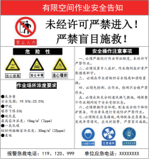
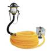
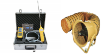
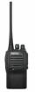
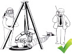

YOUXIANKONGJIAN ZUOYE ANQUAN JICHU ZHISHI

**有限空间作业安全** **基础知识**

有限空间作业有哪些安全风险？

**有限空间作业安全基础知识**

什么是有限空间？

有限空间是指封闭或部分封闭、进出口受限但人 员可以进入、未被设计为固定工作场所，通风不良， 易造成有毒有害、易燃易爆物质积聚或氧含量不足的 空间。

有限空间有哪些特点？

1. 有限空间是一个有形的，与外界相对隔离的空 间，既可以是全部封闭的，也可以是部分封闭的。

2. 有限空间限于本身体积、形状和构造，进出口 大多较为狭小，或进出口的设置不便于人员进出，但 人员可以进入开展工作。

3. 有限空间在设计上未按照固定工作场所考虑采 光、照明、通风和新风量等要求，人员只是在必要时 进入进行临时性工作。

4. 有限空间通风不良，易造成有毒有害、易燃易 爆物质积聚或氧含量不足。

有限空间有几种类型？

有限空间分为地下有限空间、地上有限空间和密 闭设备三大类。

1. 地下有限空间，如地下室、地下仓库、地下工程、 地下管沟、暗沟、隧道、涵洞、地坑、深基坑、废井、   地窖、检查井室、沼气池、化粪池、污水处理池等。

化粪池

地窖

污水井

深基坑和地下管沟

电力电缆井

污水处理池

2. 地上有限空间：如酒糟池、发酵池、腌渍池、 纸浆池、粮仓、料仓等。

发酵池                              料仓                              粮仓

3. 密闭设备：如船舱、贮（槽）罐、车载槽罐、 反应塔（釜）、窑炉、炉膛、烟道、管道及锅炉等。

反应塔

贮罐

锅炉

有限空间作业指什么？

有限空间作业是指人员进入有限空间实施作业。 常见的有限空间作业主要有清除、清理作业，设备安 装、更换、维修作业，  涂装、防腐、防水、焊接作业， 巡查、检修作业等。例如， 进入污水井进行疏通作业， 进入发酵池进行清理作业，进入污水调节池更换设备， 在储罐内进行防腐作业，进入检查井、热力管沟进行 巡检作业等，都属于有限空间作业。

烟道清理作业

管道修复作业

进入储罐作业

**中毒**

有限空间中有毒气体可能的来源包括：有限空间内   存储的有毒物质的挥发；有机物分解产生有毒气体；进  行焊接、涂装等作业时产生有毒气体；相连或相近设备、 管道中有毒物质的泄漏等。当有毒气体浓度超过《工作  场所有害因素职业接触限值 第 1 部分：化学有害因素》  （GBZ 2.1-2019）时，就可能存在中毒的风险。

可能导致中毒的典型物质

| 物质 名称 | 主要来源 | 危害特性 | 职业接触限值 |
| --- | --- | --- | --- |
| mg/ m3 | ppm （20℃) |
| 硫化氢 | 污水井、化粪池、纸浆池、 发酵池、酱腌菜池等有机 物发酵腐败场所可能产生 硫化氢。 | 剧毒，低浓度时有明显臭鸡蛋气味，浓度增 高时，人会产生嗅觉疲劳或嗅神经麻痹而闻 不到臭味；浓度超过 1000mg/m3时，数 秒内即可致人闪电型死亡。 | 10 | 7 |
| 一氧 化碳 | 含碳燃料的不完全燃烧和 焊接作业可能产生一氧化 碳。 | 俗称“煤气”，极易与血红蛋白结合，造成 组织缺氧，从而引发中毒。 | 30 | 25 |
| 苯 甲苯 二甲苯 | 涂装、除锈和防腐等作业 可能产生苯、甲苯和二甲 苯。 | 苯是确认的人类致癌物，甲苯、二甲苯具有 一定毒性。短时间内吸入较高浓度苯、甲苯 和二甲苯，会出现头晕、头痛、恶心、呕吐、 胸闷、四肢无力、步态蹒跚和意识模糊，严 重者出现烦躁、抽搐、昏迷症状。 | 10 100 100 | 3 26 22 |
| 氰化氢 | 酱腌菜池等有限空间可能 产生氰化氢。 | 剧毒，短时间内吸入高浓度氰化氢气体可导 致立即呼吸停止而死亡。 | 1 | 0.8 |
| 磷化氢 | 污水井和使用磷化氢为熏 蒸剂的粮仓、料仓等有限 空间可能产生磷化氢。 | 剧毒，10mg/m3 接触 6h，有中毒症状。 | 0.3 | 0.2 |

**缺氧**

空气中氧含量的体积分数约为 20.9%，氧含量的 合格范围应在 19.5%~23.5%，氧含量低于 19.5% 时 就是缺氧。缺氧会对人体多个系统及脏器造成影响，  当氧含量低于 6%，40s 内即可致人死亡。有限空间内 因积聚单纯性窒息气体或发生耗氧性化学反应，可能 造成缺氧。

**燃爆**

当有限空间中积聚的甲烷、氢气等可燃性气体，以 及铝粉、玉米淀粉、煤粉等可燃性粉尘与空气混合形成 爆炸性混合物，浓度若达到爆炸极限，遇明火、化学反 应放热、撞击或摩擦火花、电气火花、静电火花等点火 源时，就会发生燃爆。因此，有限空间内可燃气体浓度 应低于爆炸下限的 10%。

**其他风险**

有限空间内还可能存在淹溺、高处坠落、触电、 物体打击、机械伤害、灼烫、坍塌、掩埋和高温高湿 等安全风险。

YOUXIANKONGJIAN ZUOYE ANQUAN GUANLI

**有限空间作业**

**安全管理**

**有限空间作业安全管理**

安全管理制度

存在有限空间作业的单位应建立健全有限空间作 业安全管理制度和安全操作规程，管理制度主要包括 责任制、作业审批制度、现场管理制度、安全教育培 训制度、应急管理制度等。

管理台账

存在有限空间的单位应根据有限空间定义，辨识 本单位所辖范围内的有限空间，确定有限空间的数量、 位置、名称、主要危险有害因素、可能的事故及后果、 防护要求，作业主体等基本情况，建立有限空间管理 台账，并及时更新。

有限空间管理台账示例

| 序号 | 所在区域 | 有限空间 名称或编号 | 主要危险 有害因素 | 事故及后果 | 防护要求 | 作业主体 |
| --- | --- | --- | --- | --- | --- | --- |
|  |  |  |  |  |  |  |
|  |  |  |  |  |  |  |
|  |  |  |  |  |  |  |

安全警示

对辨识出的有限空间作业场所，应在显著位置设 置安全警示标志或安全告知牌， 以提醒人员增强风险 防控意识并采取相应的防护措施。

安全专项培训

单位应对有限空间作业分管负责人、安全管理人员、 作业现场负责人、监护人员、作业人员、应急救援人  员进行专项安全培训。参加培训的人员应在培训记录  上签字确认，单位应妥善保存培训相关材料。

培训内容主要包括：有限空间作业安全基础知识， 有限空间作业安全管理，有限空间作业危险有害因素 和安全防范措施，有限空间作业安全操作规程，安全 防护设备、个体防护用品及应急救援装备的正确使用，  紧急情况下的应急处置措施等。

安全防护设备设施

作业单位应配置安全防护设备、个体防护用品和 应急救援装备，加强管理和维护保养，确保处于完好 状态，发现影响安全使用时，应及时修复或更换。

气体检测报警仪

通风设备

照明工具

通讯设备

送风式长管呼吸器        正压式空气呼吸器                  紧急逃生呼吸器

安全帽          全身式安全带              安全绳                     三脚架

应急预案及演练

单位应根据有限空间作业的特点，按照《生产安 全事故应急预案管理办法》（应急管理部令第 2 号） 和《生产经营单位生产安全事故应急预案编制导则》 （GB/T 29639-2020）的要求， 制定有限空间作业安 全事故专项应急预案或现场处置方案，并定期组织演 练。

发包管理

单位不具备有限空间作业安全生产条件的，不能作 业，应将作业发包给具备安全生产条件的承包单位实 施。

发包单位对作业安全承担主体责任。发包单位应 与承包单位签订安全生产管理协议， 明确双方的安全 管理职责，或在合同中明确约定各自的安全生产管理 职责。发包单位应对承包单位作业方案、内部审批手 续等事宜进行审批，对承包单位的安全生产工作统一 协调、管理，定期进行安全检查，发现安全问题的， 应当及时督促整改。

承包单位对其承包的有限空间作业安全承担直接 责任，应严格按照有限空间作业安全要求开展作业。

作业实施阶段

**1** **安全作业**

在确认作业环境、作业程序、安全防护设备和个 体防护用品等符合要求后，作业现场负责人方可许可 作业人员进入有限空间作业。作业过程中，作业人员 应正确使用安全防护设备和个体防护用品，并与监护 人员进行有效的信息沟通。

**2** **实时监测与持续通风**

作业过程中，应根据实际情况采取适当的方式对 有限空间作业面进行实时监测，一种是监护人员在有 限空间外使用泵吸式气体检测报警仪对作业面进行监 护检测； 另一种是作业人员自行佩戴便携式气体检测 报警仪对作业面进行个体检测。除实时监测外，作业 过程中还应持续进行通风。当有限空间内进行涂装、 防水、防腐，以及焊接等动火作业时，应持续进行机 械通风。

**3** **作业监护**

进行有限空间作业时，监护人员应在有限空间外 全程持续监护，不得擅离职守。 一方面，跟踪作业人 员的作业过程，与其保持信息沟通，发现异常时发出 撤离警报，并协助作业人员安全撤离；另一方面，防 止无关人员进入作业区域。

**4** **异常情况撤离有限空间**

作业期间，作业人员应保持高度警觉， 一旦出现 身体不适、安全防护设备和个体防护用品失效、气体 检测报警仪报警、监护人员或作业现场负责人下达撤 离命令，以及其他可能危及作业人员生命安全的情况， 应立即中断作业，撤离有限空间，切忌犹疑不决。

YOUXIANKONGJIAN ZUOYE FENGXIAN FANGKONG

**有限空间作业** **风险防控**

作业结束阶段

有限空间作业完成后，作业人员应将全部设备和 工具带离有限空间。清点人员和设备，确保有限空间 内无人员和设备遗留后，关闭进出口。解除本次作业 前采取的隔离、封闭措施，恢复现场环境后安全撤离 作业现场。

**有限空间作业风险防控**

作业审批阶段

**1** **制定作业方案**

作业前应对作业环境进行安全风险辨识，分析存 在的危险有害因素，提出消除、控制危害的措施，编 制作业方案，并经本单位相关人员审核和批准。

**2** **明确人员职责**

根据有限空间作业方案，确定作业现场负责人、 监护人员、作业人员，并明确其安全职责。根据实际 情况，现场负责人和监护人员可为同一人。

**3** **作业审批**

应严格执行有限空间作业审批制度。作业前对作 业方案、人员、设备等方面进行审批，并签字确认， 未经审批不得擅自开展有限空间作业。

有限空间作业审批单示例

| 审批单编号 |  | 有限空间名称 |  |
| --- | --- | --- | --- |
| 作业单位 |  |
| 作业内容 |  | 作业时间 |  |
| 可能存在的 危险有害因素 |  |
| 作业负责人 |  | 监护人员 |  |
| 作业人员 |  | 其他人员 |  |
| 主要安全 防护措施 | 1. 制定有限空间作业方案并经审核、批准 □ 2. 参加作业人员经有限空间作业安全相关培训合格 □ 3. 安全防护设备、个体防护用品、作业设备和工具齐全有效，满足要求 □ 4. 应急救援装备满足要求 □ |
| 作业现场负责人 意见 | 作业现场负责人确认以上安全防护措施是否符合要求 是□ 否□ 作业现场负责人（签字）： 年 月 日 |
| 审批负责人 意见 | 审批负责人是否批准作业 批准□ 不批准□ 审批负责人（签字）： 年 月 日 |

作业前准备阶段

**1** **安全交底**

作业现场负责人应对实施作业的全体人员进行安  全交底，告知作业内容、作业现场可能存在的安全风险、 作业安全要求及应急处置措施等，并履行签字确认手续。

**2** **设备检查**

应对安全防护设备、个体防护用品、应急救援装备、 作业设备和用具的齐备性和安全性进行检查，发现问  题应立即修复或更换。当有限空间可能为易燃易爆环  境时，设备和用具应符合防爆安全要求。

**3** **封闭作业区域及安全警示**

设置围挡，封闭作业区域，并在进出口周边显著 位置设置安全警示标志或安全告知牌。占道作业的， 应设置相应的交通安全设施。夜间作业的，应设置警 示灯，地面人员应穿着高可视警示服。

**4** **打开进出口**

作业人员站在有限空间外上风侧，打开进出口进 行自然通风。可能存在爆炸危险的，开启时应采取防 爆措施。

**5** **安全隔离**

存在可能危及有限空间作业安全的设备设施、物料 及能源时，应采取封闭、封堵、切断能源等可靠的隔离（隔 断）措施，并上锁挂牌或设专人看管，防止无关人员意 外开启或移除隔离设施。

**6** **清除置换**

有限空间内盛装或残留的物料对作业存在危害时， 应在作业前对物料进行清洗、清空或者置换。

**7** **气体检测**

作业前应在有限空间外上风侧，使用泵吸式气体 检测报警仪对有限空间内气体进行检测。垂直方向的 检测由上至下，至少进行上、中、下三点检测；水平 方向的检测由近至远，至少进行进出口近端点和远端 点两点检测。

应根据有限空间内可能存在的气体种类进行针对 性检测，但应至少检测氧气、可燃气、硫化氢和一氧 化碳。当有限空间内气体环境复杂，作业单位不具备 检测能力时，应委托具有相应检测能力的单位进行检 测。气体检测结果应如实记录。气体浓度检测合格， 方可作业。

**8** **强制通风**

经检测，有限空间内气体浓度不合格的，必须对 有限空间进行强制通风。通风时，应输送清洁空气， 严禁使用纯氧。单开口的有限空间，通风设备出风口

应置于作业区底部进 行送风，多开口的有限 空间，应采用送、排风 相结合的通风方式，确 保有效通风。通风后，  应对有限空间内气体 再次进行检测。检测结

果合格，方可作业；检测结果不合格，还应继续进行 强制通风，直到检测结果合格为止。

**9** **人员防护**

检测结果合格后，作业人员在进入前还应根据作  业环境选择并佩戴符合要求的  个体防护用品与安全防护设备， 主要有：安全帽、全身式安全带、 安全绳、呼吸防护用品、便携  式气体检测报警仪、照明灯和  对讲机等。

YOUXIANKONGJIAN ZUOYE

SHIGU YINGJI JIUYUAN

**有限空间作业**

**事故应急救援**

**有限空间作业事故应急救援**

通过对近年来有限空间作业事故进行分析发现： 盲目施救问题非常突出，近 80% 的事故由于盲目施救 导致伤亡人数增多，在有限空间作业事故致死人员中 超过 50% 的为救援人员。因此，必须**杜绝盲目施救**， 避免伤亡扩大。

应急预案

应按照《生产安全事故应急预案管理办法》（应急 管理部令第 2 号）和《生产经营单位生产安全事故应急 预案编制导则》（GB/T 29639-2020）的要求，结合有 限空间作业事故风险，制定科学、合理、可行、有效的 有限空间作业事故专项应急预案或现场处置方案。

应急演练

应定期组织有限空间作业事故应急演练。演练结 束后应对演练效果进行评估。有限空间作业事故专项 应急预案应每年至少组织 1 次演练，现场处置方案应 至少每半年组织 1 次演练。

应急救援装备

应急救援装备是开展救援工作的重要基础。有限 空间作业事故应急救援装备主要包括便携式气体检测 报警仪、大功率机械通风设备 、照明工具 、通讯设备 、正压式空气呼吸器或高压送风式长管呼吸器、安全 帽 、全身式安全带 、安全绳 、有限空间进出及救援 系统等。发生事故后，作业配置的安全防护设备设施 符合应急救援装备配置要求时，可用于应急救援。

大功率机械通风设备

气体检测报警仪

照明工具

正压式空气呼吸器             高压送风式长管呼吸器

通讯设备

全身式安全带                      安全绳

安全帽

便携式吊杆系统

侧边进入系统

（水平方向）

三脚架救援系统

（垂直方向）

（水平 / 垂直方向）

科学施救

一旦发生有限空间作业事故，作业现场负责人应 及时向本单位报告事故情况，在分析事发有限空间环 境危害控制情况、应急救援装备配置情况以及现场救 援能力等因素的基础上，判断可否采取自主救援以及 采取何种救援方式。

若现场具备自主救援条件，应根据实际情况采取 非进入式或进入式救援，并确保救援人员人身安全。

**1** **非进入式救援**

非进入式救援是指救援人员在有限空间外，借助 相关设备与器材，安全快速地将有限空间内受困人员 移出有限空间的一种救援方式。非进入式救援是一种 相对安全的救援方式，但需至少同时满足以下 2 个条 件：

1. 有限空间内受困人员佩戴了全身式安全带，且 通过安全绳索与有限空间外的

挂点可靠连接。

2. 有限空间内受困人员所 处位置与有限空间进出口之间 通畅、无障碍物阻挡。

**2** **进入式救援**

当受困人员未佩戴全身式安全带，也无安全绳与  有限空间外部挂点连接，或因受困人员所处位置无法  实施非进入式救援时，就需要救援人员进入有限空间   内实施救援。进入式救援风险很大，一旦救援人员防  护不当，极易出现伤亡扩大。因此，实施进入式救援时， 救援人员必须采取科学的防护措施，确保自身防护安  全、有效。例如， 救援人员应佩戴正压式空气呼吸器、  全身式安全带、安全帽等个体防护用品，才能进入救援。

**严禁无防护开展进入式救援** **!**

若现场不具备自主救援条件，应及时拨打 119 和 120，借助专业救援力量开展救援工作，**决不允许强** **行施救**。

受困人员脱离有限空间后，应迅速将其转移至安 全、空气新鲜处，进行正确、有效的现场救护，以挽 救人员生命，减轻伤害。

