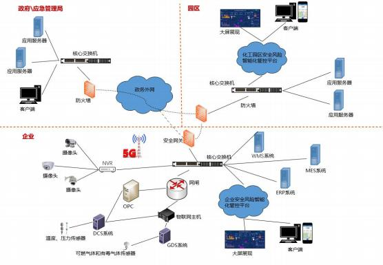

# **危险化学品企业安全风险智能化管控平台建设指南（试行）**

目   录

[一、总则 	1](#bookmark1)

[二、编制依据 	2](#bookmark2)

[三、总体架构 	3](#bookmark3)

[（一）平台建设基本要求 	 3](#bookmark4)

[（二）系统和网络架构 	 4](#bookmark5)

[（三）数据体系 	 8](#bookmark6)

[（四）系统安全体系 	 9](#bookmark7)

[四、系统功能 	10](#bookmark8)

[（一）安全管理基础信息 	 10](#bookmark9)

[1.安全生产许可相关证照和有关报告信息 	 10](#bookmark10)

[2.生产过程基础信息 	 10](#bookmark11)

[3.设备设施基础信息 	 10](#bookmark12)

[4.企业人员基础信息 	 11](#bookmark13)

[5.第三方人员基础信息 	 11](#bookmark14)

[（二）重大危险源安全管理 	 11](#bookmark15)

[1.重大危险源安全包保责任落实 	 11](#bookmark16)

[2.在线监测预警 	 11](#bookmark17)

[3.风险管控 	 12](#bookmark18)

[4.评价/评估报告及隐患管理 	 12](#bookmark19)

[（三）双重预防机制 	 12](#bookmark20)

[（四）特殊作业许可与作业过程管理 	 13](#bookmark21)

[（五）智能巡检 	 13](#bookmark22)

[（六）人员定位 	 14](#bookmark23)

[（七）其他 	 14](#bookmark24)

[五、基础设施 	15](#bookmark25)

[（一）气体泄漏探测系统 	 15](#bookmark26)

[（二）视频监控与智能分析 	 15](#bookmark27)

[（三）网络改造 	 15](#bookmark28)

[（四）电子地图与数字建模 	 16](#bookmark29)

[（五）标识解析企业节点 	 16](#bookmark30)

[六、数据交换与传输 	17](#bookmark31)

[七、平台信息系统安全 	18](#bookmark32)

[八、量化指标 	19](#bookmark33)

[（一）网络延迟 	 19](#bookmark34)

[（二）安全等级 	 19](#bookmark35)

[（三）响应时间 	 19](#bookmark36)

[（四）稳定性 	 20](#bookmark37)

[九、系统集成 	20](#bookmark38)

[（一）硬件系统集成 	 21](#bookmark39)

[（二）软件系统集成 	 21](#bookmark40)

**一、总则**

当前我国已成为世界化工第一大国，主要化工产品产量居 世界第一位，化工总产值占世界总量的40%，预计 2030 年将达 到 50%。化工生产过程复杂多样，涉及的物料易燃易爆、有毒有 害，生产条件多高温高压、低温负压，现场危险化学品储存量 大、危险源集中，化工（危险化学品）企业（ 以下简称危险化 学品企业）重特大事故多发，暴露出传统安全风险管控手段“看 不住、管不全、管不好 ”等问题突出。

依靠物联网、大数据、云计算、人工智能（AI）、5G 等新 一代信息技术，建设危险化学品企业安全风险智能化管控平台， 加强在感知、监测、预警、处置、评估等方面赋能危险化学品 企业，破解企业安全生产的痛点、难点、堵点问题，是实现危 险化学品企业转型升级的必由之路。

为认真贯彻习近平总书记关于危险化学品安全和工业互联  网发展应用的重要指示精神和党中央、国务院有关决策部署， 落实《“工业互联网+安全生产 ”行动计划（2021—2023 年）》 和《“工业互联网+危化安全生产 ”试点建设方案》工作安排， 有效指导全国危险化学品企业安全风险管控数字化转型智能化  升级，编制本指南。

危险化学品企业安全风险智能化管控平台建设坚持以有效 防范化解重大安全风险为目标，突出安全基础管理、重大危险 源安全管理、安全风险分级管控和隐患排查治理双重预防机制 （ 以下简称双重预防机制）、特殊作业许可与作业过程管理、 智能巡检、人员定位等基本功能，打造企业“工业互联网+危化

安全生产 ”新基础设施建设，推动企业安全基础管理数字化、 风险预警精准化、风险管控系统化、危险作业无人化、运维辅 助远程化，为实现危险化学品企业安全风险管控数字化转型智 能化升级注入新动能。

本指南适用于全国范围内危险化学品企业安全风险智能化 管控平台的设计、建设与应用。

**二、编制依据**

《关于全面加强危险化学品安全生产工作的意见》 《危险化学品安全管理条例》

《危险化学品安全专项整治三年行动实施方案》 （安委 〔2020〕3 号）

《全国危险化学品安全风险集中治理方案》（安委〔2021〕 12 号）

《“工业互联网+安全生产 ”行动计划（2021—2023 年）》 （工信部联信发〔2020〕157 号）

《工业互联网创新发展行动计划（2021—2023 年）》（工 信部信管〔2020〕197 号）

《工业互联网综合标准化体系建设指南（2021版）》（工 信部联科〔2021〕291 号）

《“工业互联网+危化安全生产 ”试点建设方案》（应急厅 〔2021〕27 号）

《危险化学品企业重大危险源安全包保责任制办法（试 行）》（应急厅〔2021〕12 号）

《 “工业互联网+危化安全生产 ”试点建设实施指南（试

行）》

《危险化学品企业双重预防机制数字化建设工作指南（试 行）》

《 “工业互联网+危化安全生产 ”特殊作业许可与作业过 程管理系统建设应用指南（试行）》

《 “工业互联网+危化安全生产 ”智能巡检系统建设应用 指南（试行）》

《 “工业互联网+危化安全生产 ”人员定位系统建设应用 指南（试行）》

《危险化学品重大危险源标识》（GB 18218—2018）

《工业互联网标识解析 二级节点技术要求》 （AII/001— 2021）

**三、总体架构**

危险化学品企业安全风险智能化管控平台应按照工业互联 网平台架构进行设计，建立统一的标准与规范体系和安全运维 保障体系，保证平台规范、安全、稳定运行。

平台依托企业现有系统数据，通过接入企业实时监测、视 频监控、人员定位、设备状态、特殊作业等数据，实现安全管 理基础信息、重大危险源安全管理、双重预防机制、特殊作业 许可与作业过程管理、智能巡检、人员定位等基础功能的信息 化、数字化、网络化、智能化。

**（一）平台建设基本要求**

危险化学品企业安全风险智能化管控平台主体采用B/S 架 构，以及主流、开放的平台应用框架，满足可靠、集成、兼容、

可扩展、可维护、安全等性能要求，支撑企业安全风险管控的 信息化数字化应用需求，符合但不限于以下要求：

. 业务流程覆盖，支持实现本指南要求的基本功能；

. 功能模块化设计、中台化建设，各模块可单独使用；

. 集成性，提供开放接 口，便于与企业现有其他信息系统对 接集成；

. 兼容性，注重融合企业现有系统，实现功能互补，数据互 联互通；

. 可扩展性，企业根据自身建设要求，可以扩展创新应用和 场景；

. 支持跨平台、跨系统运行，支持电脑端和移动设备；

. 数据标准化，规范各类信息资源元数据和编码规则，统一 数据处理机制。

**（二）系统和网络架构**

危险化学品企业安全风险智能化管控平台总体构架划分为 边缘层、网络层、IaaS 层、DaaS 层、PaaS 层、SaaS 层六个层 次， 以工业互联网标准为引领、工业互联网安全体系为保障， 依托数据流、信息流、业务流，实现企业安全生产全过程、全 要素的连接和优化，提升企业安全风险管控能力。

1.边缘层。边缘层通过对企业生产现场设备、移动终端设 备等网络化改造，或者加装网络化智能化监控设备，通过协议 转换、边缘计算等构建精准、实时、高效的海量工业数据采集 与分析体系，接入、转换、预处理、存储、分析数据，配置边 缘计算设备，合理布置算力和模型，可通过边缘容器支持快速

便捷迭代，实时获知设备的运行状况和环境的准确变化，就近 提供边缘智能服务，掌握安全态势。

2.网络层。通过 F5G、5G、NB—IoT、LoRa、IPv6、WiFi6、 TSN 等新一代通信技术在设备端和控制器端的应用，在保障安全 的前提下改造打通企业工业控制网、管理信息网和无线网，建 设 IT—OT 融合网络，以地理空间为参考系，帮助企业建立覆盖 范围更广、连接更多、带宽更大的基础网络，应用 IPv6 等新一

代通信协议，实现对海量过程数据的采集、传输、分析。

3.IaaS 层。IaaS 层作为危险化学品企业安全风险智能化管 控平台的低层，通过计算、网络、存储等资源的虚拟化，实现 信息基础设施的资源池化。IaaS 层提供所有计算需要的基础设 施，包括处理 CPU、内存、存储、网络和其它基本的计算硬件资 源，根据 PaaS 层的运算需要部署和运行相应的软件，包括操作 系统和应用程序等。

4.DaaS 层。DaaS 层通过对各类数据信息进一步加工形成信 息组合应用，通过汇聚、整合、清洗和处理等进一步盘活数据， 提高数据质量，提升数据价值。通过数据中台建设数据资源池， 对基础数据信息块以不同的方式进行组装，满足各类应用的需 要。通过对数据聚合抽象，把数据转换成通用信息，对外提供 数据服务。

5.PaaS 层。PaaS 层以“搭积木 ”的方式提供工业 APP 创建、 测试和部署的开发环境， 向下调用设备、业务系统等软硬件资 源， 向上承载工业 APP 等应用服务。危险化学品企业安全风险 智能化管控平台的 PaaS 层利用 IaaS 层和 DaaS 层的数据处理能 力，对通过边缘层采集和网络层传输与汇聚的各类安全相关的 数据，如设备数据、工艺与作业数据、异常环境数据、安全管 理数据、人员位置数据、物料数据、标识数据等，进行统一调 度和应用。PaaS 层对边缘层、IaaS 层产生的海量数据进行高质 量存储与管理，通过数据建模、分析、可视化等技术，结合生 产、运输、销售、使用过程中的实际数据与工业生产实践经验， 构建行业机理模型和数据驱动模型，支撑 SaaS 层各种分析应用

的实现。PaaS 层通过构建AI 能力引擎和机器学习模型，提供 AI 服务。

6.SaaS 层。SaaS 层是通过调用和封装 PaaS 层平台上的开 发工具、行业机理模型、数据驱动模型等服务开发形成的应用 服务。SaaS 层利用PaaS 层积累沉淀的各类型数据模型，以工业 微服务为基础，对危险化学品企业全流程各环节打造定制化、 高可靠、可扩展的应用。

危险化学品企业安全风险智能化管控平台采集设备数据、 传感器数据、视频数据等，结合 ERP、MES 等业务系统的生产、 运输、储存各环节实际业务数据和业务流程，实现企业安全生 产全过程管理，并开放接 口，与化工园区平台对接集成，提升 跨层级的安全生产联动联控能力，如下图所示：

危险化学品企业安全风险智能化管控平台与部署于车间或 工厂侧的边缘平台通过专网的方式互联，实现云边协同；车间 或工厂侧接入设备或传感器的方式可分为 5G 和非 5G 两种组网 方式。危险化学品企业安全风险智能化管控平台网络拓扑如下

图所示：

**（三）数据体系**

搭建危险化学品企业安全风险智能化管控平台数据体系， 制定企业数据采集以及工业互联网标识标准，持续开展数据治 理工作，确保数据的完整性和一致性。数据治理体系建设应符 合但不限于以下要求：

. 完善数据标准规范体系，编制应用数据采集标准；

. 统一数据交换共享规则，编辑数据交换接口规范；

. 支持以数据服务的形式封装数据，提供统一的数据开发共 享能力；

. 结合国家工业互联网标识标准和企业实际情况，制定企业 互联网标识解析规范；

. 提高数据挖掘和分析功能，以物联网数据为依托，为企业 安全生产管理提供决策辅助；

. 使用专业的数据抽取、清洗、整合工具，开展数据清洗处 理、补充完善、质量检查等数据治理工作，确保数据的完整性 和一致性；

. 统一资源目录管理，支持统一的元数据管理，包括元数据 的模型设计、模型审核、模型发布、模型变更， 以及模型版本 管理、关系管理等。

**（** **四）系统安全体系**

系统安全体系是危险化学品企业安全风险智能化管控平台 安全可信运行的基本保障。全面考虑物理环境安全、网络和通 信安全、边界安全、终端安全、云安全、应用系统安全、数据 安全、装置及设备安全、处置恢复安全等重点安全防护对象及 场景，提供安全保障软硬件配套设施及服务。

通过固件安全增强、漏洞修复加固、补丁升级管理、安全 监测审计、加强认证授权、部署分布式拒绝服务（DDoS）防御 体系、工业应用程序安全、主机入侵监测防护、漏洞扫描、资 源访问控制、信息完整性保护等安全措施，保障核心数据的安 全流转和平台的正常运行，对物理、网络、系统、应用、数据 及用户安全等实现可管可控，打造满足企业安全管理需求的安 全技术体系和安全管理机制，实现网络安全与物理安全的真正 融合。

加强工控系统安全防护，清晰划分网络安全区域边界，建 立健全隔离措施，采用深度解析工控通讯协议的异常监测、网 络审计等手段，实现工控系统通讯网络安全，加固工控主机安 全，全面提高工控系统的综合安全防护能力。

**四、系统功能**

**（一）安全管理基础信息**

企业的安全管理基础信息包括但不限于以下内容：安全生 产许可相关证照和有关报告信息、生产过程基础信息、设备设 施基础信息、企业人员基础信息、第三方人员基础信息管理等。 企业平台的安全管理基础信息一方面作为园区平台的数据来 源，另一方面也是以信息化促进企业数字化、智能化升级。

**1.安全生产许可相关证照和有关报告信息**

实现危险化学品安全生产许可证、危险化学品登记证、安 全生产标准化证书、安全评价报告、安全“ 三同时 ”等相关材 料按统一格式录入信息和定期更新。支持相关证照到期自动提 醒、安全材料关键信息缺失自动核验， 以及与园区平台互通。

**2.生产过程基础信息**

建立生产过程基础信息电子档案及线上管理流程，包括但 不限于危险工艺名称、反应类型、涉及的危险化学品 MSDS、重 大危险源、重点监控单元、工艺简介、工艺危险特点、重点监 控工艺参数指标、现有安全控制手段、开停车信息等。支持与 危险化学品登记信息管理系统、化学品安全信息检索系统数据 对接， 以及与园区平台互通。

**3.设备设施基础信息**

建立特种设备和安全设施电子档案及线上管理流程， 包括 但不限于特种设备清单及定期检测记录、登记注册表、安全阀 清单及定期校验记录、爆破片清单及更换记录、安全仪表联锁 清单等。支持安全阀临期校验、爆破片临期更换等提醒。

**4.企业人员基础信息**

建立企业人员基础信息电子档案及线上管理流程，包括但 不限于主要负责人、分管安全负责人、企业在册从业人数、专 职安全人员人数、注册安全工程师人数、姓名及证号、特种作 业人数、值班值守等，支持相关人员从业证书、安全培训临期 提示。支持从业人员学历、专职安全人员人数、注册安全工程 师人数的合规性自诊断，与园区平台数据对接。

**5.第三方人员基础信息**

建立企业第三方人员基础信息电子档案及线上管理流程， 包括但不限于承包商、供应商、临时访客等第三方外来人员； 具备作业人员证书、外来人员证书管理等功能。支持与特殊作 业模块、人员定位模块功能联动。

**（二）重大危险源安全管理**

主要用于危险化学品重大危险源安全包保责任落实、在线 监测预警、风险管控、评价/评估报告管理及隐患管理等。功能 实现应与全国危险化学品安全生产风险监测预警系统进行数据 对接融合。

**1.重大危险源安全包保责任落实**

实现重大危险源主要负责人、技术负责人、操作负责人的 安全包保履职结构化电子记录，做到可查询、可追溯。支持企 业的安全管理机构对包保责任人履职情况进行在线考核，定期 自动生成考核报告。

**2.在线监测预警**

（1）实时监测

汇聚现有储罐、装置、危险化学品库等的液位、温度、压 力和可燃有毒气体浓度的实时监测数据、报警数据，支持信息 查询、历史数据查询、多维度对比、统计分析，实现报警监控、 报警管理、运行监控、报警处置、报警分析、实时（短信）通 知、设备管理、预警管理等功能。

（2）视频监控数据智能分析

汇聚企业内视频监控画面信息，实现重点场所（如硝酸铵 仓库、中控室）、关键部位（如重大危险源现场）的监控视频 智能分析，支持对火灾、烟雾、人员违章（ 中控室脱岗）等进 行全方位的识别和预警。

**3.风险管控**

基于风险预警模型，分为重大风险（红）、较大风险（橙）、 一般风险（黄）、低风险（蓝）四个级别，实现重大危险源安 全风险的实时评估分析和展示、预警信息及时有效处置和闭环 管理，支持消警后上报处置结果、原因分析及整改措施。

**4.评价/评估报告及隐患管理**

支持上传重大危险源的安全评价报告、SIL 等级评估报告和 重大危险源专项督导检查问题隐患相关数据，实现重大危险源 的安全评价报告电子化存档、查阅和问题隐患“ 三录入 ”及整 改反馈功能。

**（三）双重预防机制**

主要用于推动企业有效运行双重预防机制，对企业风险分 析清单、排查任务及隐患治理情况进行管理，实现风险分级动 态管控、隐患排查治理闭环管理、机制运行成效监督预警等功

能，全面提升安全风险防控水平。

按照《危险化学品企业双重预防机制数字化建设工作指南》 和《危险化学品企业双重预防机制数字化建设数据交换规范》  开展建设。

**（** **四）特殊作业许可与作业过程管理**

建设特殊作业许可与作业过程管理系统，将特殊作业审批 许可条件条目化、电子化、流程化，并通过信息化手段对作业 全流程进行过程痕迹管理，从而实现特殊作业申请、预约、审 查、安全条件确认、许可、监护、验收全流程信息化、规范化、 程序化管理，支持同园区及上级监管部门的数据互通。

按照《“工业互联网+危化安全生产 ”特殊作业许可与作业 过程管理系统建设应用指南（试行）》建设。

**（五）智能巡检**

建设智能巡检系统，实现巡检、巡查全过程数字化管理， 管理人员根据 PID 工艺流程图、数字化交付资料、风险分析单 元划分、隐患排查清单、 岗位安全风险责任清单等，分角色制 定巡检任务、规划巡检路线，匹配巡检清单及制度规范。巡检 人员通过移动终端自动获取巡检任务要求。支持巡检人员按规 定时间、规定位置、规定要求完成数据采集，并将设备设施运 行状态、设备设施故障以及各类安全生产隐患等信息实时传输 回管理后台，从而实现内外操作人员、管理人员、企业各个信 息化系统间共享巡检数据。应有专人对智能巡检系统进行管理， 并将智能巡检系统接入企业中控室，确保及时处置巡检过程中 的预警信息和隐患情况，实现闭环管理。智能巡检系统建设应

与双重预防机制系统、设备完整性管理系统等有机结合、互联 互通。

按照《“工业互联网+危化安全生产 ”智能巡检系统建设应 用指南（试行）》建设。

**（六）人员定位**

通过布设多个定位基站与人员携带的信号标签进行通信的 方式，结合人员定位算法，计算出信号标签位置进行人员定位。 根据企业实际应用场景建设基站布局合理、定位精度准确的人 员定位系统，实现接受与发送报警信息、可视化展示、人员数 量统计分析、人员活动轨迹分析、存储和查询等功能。支持与 报警信息、智能巡检、特殊作业管理、应急疏散撤离、应急演 练联动，与化工园区安全风险智能化管控平台对接。

按照《“工业互联网+危化安全生产 ”人员定位系统建设应 用指南（试行）》建设。

**（七）其他**

鼓励有条件的企业在全部完成上述基本功能建设的基础 上，可结合本企业实际需要及属地监管要求，参照《 “工业互 联网+危化安全生产 ”试点建设方案》有关内容，拓展建设功能 模块及功能内容，如全员安全生产责任体系运行管理及考核、 数字交付及数字孪生、培训管理、设备完整性管理与预测性维 修、 自动化过程控制优化、工艺生产报警优化、人员不安全行 为管控、作业环境及异常状态监控、敏捷应急、知识图谱、无 人巡检、危险化学品运输车辆管理、事故事件管理等，丰富完 善企业平台功能，提升安全风险智能化管控水平。

**五、基础设施**

**（一）气体泄漏探测系统**

**1.基本内容**

企业应部署气体泄漏探测系统，用于实时监测厂区危险气 体浓度。危险气体的探测技术包括单点式气体传感器检测与速 扫气体探测。

**2.提升内容**

鼓励有条件的企业可以部署基于 TDLAS 技术与CT 算法的水 平场分布测量系统、光谱成像气体检测系统及由空基探测系统、 地基探测系统所构成的空地一体化危险气体探测网。

**（二）视频监控与智能分析**

**1.基本内容**

建设视频监控及智能分析系统，实现重大危险源、中控室 等重点区域视频监控全覆盖，应实现中控室人员脱岗、硝酸铵 仓库早期烟火等的自动识别与报警，提升企业安全管理效能。

**2.提升内容**

鼓励有条件的企业升级完善视频智能分析系统，汇集固定 视频、移动视频、无人机视频、红外成像等，及时发现人的不 安全行为、物的不安全状态，如个人防护装备不正确佩戴、人 员倒地、检修作业未放置灭火器等。

**（三）** **网络改造**

**1.基本内容**

企业应基于现有网络条件，针对安全风险智能化管控平台 建设需要，进行工业生产装备和仪器仪表的数字化、网络化改

造，建设 IT—OT 融合的企业内部网络，向“体系化互联 ”转变； 企业应接入高质量外网，与园区、上级主管单位及各级监管部 门实现互联互通。

**2.提升内容**

鼓励有条件的企业采用 TSN、5G 等网络传输技术，实现数 据低延时、高可靠实时通讯。

**（** **四）** **电子地图与数字建模**

**1.基本内容**

企业应配置厂区电子地图，支持平台基本应用。

**2.提升内容**

鼓励有条件的企业开展厂区及重要设备设施数字建模，将 整个厂区的全流程各环节全要素以可视化和虚拟现实的形式呈 现，将人员定位数据、视频图像等数据接入数字孪生系统平台， 实现面向企业生产作业过程的全程三维可视化集中统一管控， 加强企业信息管理和服务。

**（五）标识解析企业节点**

**1.基本内容**

参照国家或行业相关标准规范，结合企业管理实践，完成 安全生产相关要素的统一标识。

**2.提升内容**

企业应建立工业互联网标识解析企业节点，为企业内部提 供标识编码注册和标识解析服务，并与园区、 区域、集团公司 或行业节点对接，建立企业内部数据与外部数据互联互通机制。

**六、数据交换与传输**

危险化学品企业安全风险智能化管控平台提供数据交换系 统，支持平台对内、对外数据交互，从而形成数据上下贯通、 互联共享的数据交换与传输体系。通过使用标准化的接口协议， 约定应用和服务进行交互的规范，包括数据传输的格式、传输 协议等。数据交换接口应遵循技术中立的原则，选用 XML、JCA、 Web Service、XPDL 等主流技术。

数据交换与传输应满足以下技术要求：

. 支持数据双向同步；

. 支持各种主流操作系统；

. 支持国内外主流数据库；

. 支持结构化及非结构化的数据；

. 支持 [HTTP](HTTP)、[HTTPS](HTTPS)、TCP、TCPS、JMS、SOAP、FTP、MQTT 等多种协议；

. 提供增量数据自动识别功能。在不修改数据库结构的情况 下，系统应能自动识别出需要交换的信息，包括新增、被修改 或被删除的信息；

. 提供管理与监控接 口，支持远程管理功能；

. 提供消息确认和消息选择性重发机制以实现安全可靠的 消息传递功能；

. 提供消息差错处理功能；

. 提供消息寻址功能，支持信息路由功能；

. 提供数据交换流程监控功能；

. 具备良好的可扩展性，可根据交换与共享需求的变化实现

系统的扩展部署；

. 具备与安全等级相应的安全防护措施，具备符合安全等级 要求的快速恢复能力；

. 支持视频流传输技术；

. 提供数据格式转换、数据填充，数据加密/解密、数据过 滤、数据传输、校验和路由等数据交换必需的功能；

. 支持边缘物联设备接入。

**七、平台信息系统安全**

支持从安全技术体系和安全管理体系两个维度来构建平台 的安全体系。

安全防护对象应覆盖企业的网络基础设施、信息系统、大 数据、物联网、云平台、工控系统、智能设备等，安全保障框 架所有安全控制都应以安全方针、策略作为安全工作的指导与 依据，落实安全管理和安全技术两大维度的具体实施与维护， 以业务系统的安全运营为信息安全保障建设的核心，并辅以安

全运维与安全培训贯穿信息安全保障体系的全过程，形成风险 可控的安全保障框架体系。其中，安全技术体系应覆盖物理环 境安全、终端安全、 区域边界安全、通信网络安全、云平台安 全、数据安全、应用安全、安全管理中心等要素。

按照《 “工业互联网+危化安全生产 ”试点建设实施指南 （试行）》相关内容建设。

**八、量化指标**

危险化学品企业安全风险智能化管控平台在网络延迟、安 全等级、响应时间和稳定性等方面应满足以下要求。

**（一）** **网络延迟**

静态数据（基础数据、第三方、特殊作业、双重预防机制 等）传输网络延迟不超过 1s。视频监控数据传输网络延迟不超 过 0.5s。实时动态数据（传感器感知数据）传输网络延迟不超 过 0.5s，数据更新频次不低于 2s。

**（二）安全等级**

依据《GB/T 22240—2020 信息安全技术 网络安全等级保护 定级指南》，确定所需达到的安全等保 2.0 等级，建议规模以 上企业按照安全等保 2.0 三级加强安全管理。

**（三）响应时间**

**1.交互类**

交互类是指平时工作中在系统中进行的业务处理，如录入， 修改或删除一条记录、发布一条信息等操作。平均响应时间：

0.2—0.8s，峰值响应时间：0.5—1s，视频点播平均响应时间： 5—10s。

**2.查询类**

查询业务由于受到查询的复杂程度、数据量大小等因素影 响，需要根据具体情况而定，在此给出一个参考范围。简单查 询平均响应时间：1—3s，复杂查询平均响应时间：3—5s，地

理信息查询平均响应时间：5—10s。

**3.在线分析类**

在线分析类因需要调用多维数据集，性能受维度多少影响 比较明显，在此给出一个参考范围。平均响应时间：0.3—1s， 峰值响应时间：0.5—3s。

**4.统计报表类**

统计报表类因需要在线实时汇总数据，受数据量多少、汇 总层次影响较大，在此给出一个参考范围。平均响应时间： 1—3s，峰值响应时间：3—8s。

**5.事务处理能力**

每秒支持 5000 个事务处理。

**（** **四）稳定性**

要求 7*24h 运行，通过性能监测、系统巡检等方式，及时 发现并避免系统故障。

. 每年意外死机不超过 2 次。

. 因平台问题导致的操作失败率不超过 0.3％。

. 服务器系统时间与标准时间应实时同步。

**九、系统集成**

支持将危险化学品企业内“工业互联网+危化安全生产 ” 相关的软件、硬件系统进行有机融合，实现数据互通互联及业

务集成。确保集成后整体及各子系统之间可以有机协调地工作。

实现系统及服务可对接、可迁移，企业各个系统之间能完 成各类数据的安全、稳定传输，同时可以与上级企业、所在园 区及其他监管部门等进行数据的交换、汇聚和共享。

**（一）硬件系统集成**

部署各类信号的隔离、复制、传输、转换等硬件设备，完 成协议转换，支持感知类传感监测设备、工业控制设备、边缘 计算设备、监控摄像机、数据网关及其他硬件设备间数据通讯。

**（二）软件系统集成**

统一规划管理各相关软件系统，协调迭代优化，确保互操 作性，实现数据“一次性输入、多处调用 ”。