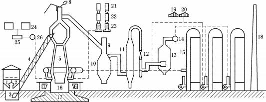
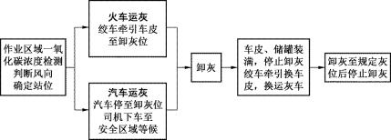
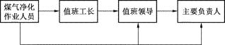

高危行业一线岗位安全生产指导手册

**金属冶炼高炉煤气净化岗**

**目**    **录**

[1  安全生产应知应会	 1](#bookmark1)

[1.1 安全生产风险基础知识 	 1](#bookmark2)

[1.2 安全生产有关法律法规要求 	 3](#bookmark3)

[1.2.1  岗位安全生产准入	 3](#bookmark4)

[1.2.2  从业人员安全生产权利	 4](#bookmark5)

[1.2.3  从业人员安全生产义务	 4](#bookmark6)

[1.2.4  法律责任	 5](#bookmark7)

[2  岗位主要安全风险和事故隐患	 6](#bookmark8)

[2.1  岗位主要安全风险 	 6](#bookmark9)

[2.1.1  中毒、窒息	 6](#bookmark10)

[2.1.2  火灾、爆炸	 6](#bookmark11)

[2.1.3  高处坠落	 6](#bookmark12)

[2.1.4  触电、物体打击与机械伤害	 7](#bookmark13)

[2.2  岗位常见事故隐患 	 7](#bookmark14)

[2.2.1  事故隐患排查	 7](#bookmark15)

[2.2.2  事故隐患示例	 8](#bookmark16)

[2.3 典型事故案例 	 10](#bookmark17)

[2.3.1  某钢铁公司 2 号高炉重大煤气泄漏事故 	 10](#bookmark18)

[2.3.2  某公司炼铁厂煤气中毒事故	 10](#bookmark19)

[3  岗位安全风险控制	 12](#bookmark20)

[3.1  岗位操作流程 	 12](#bookmark21)

[3.1.1  煤气净化	 12](#bookmark22)

[3.1.2  除尘器卸灰	 12](#bookmark23)

[3.1.3  除尘系统检维修	 12](#bookmark24)

[3.2  岗位安全操作要点 	 13](#bookmark25)

[3.2.1  煤气净化	 13](#bookmark26)

[3.2.2  除尘器卸灰	 13](#bookmark27)

[3.2.3  除尘系统检维修	 13](#bookmark28)

[3.3  岗位操作风险管控 	 14](#bookmark29)

[4  岗位应急管理	 16](#bookmark30)

[4.1 应急报告 	 16](#bookmark31)

[4.1.1  岗位人员应急报告	 16](#bookmark32)

[4.1.2  企业应急报告	 16](#bookmark33)

[4.2 现场应急处置 	 16](#bookmark34)

[4.2.1  煤气泄漏应急处置	 16](#bookmark35)

[4.2.2  煤气中毒应急处置	 17](#bookmark36)

[4.2.3  窒息应急处置	 17](#bookmark37)

[4.2.4  触电应急处置	 17](#bookmark38)

[附录	](#bookmark39)[18](#bookmark40)

[附录 1   运行、检维修作业安全检查确认表	](#bookmark41)[18](#bookmark42)

[附录 2   空气呼吸器的正确佩戴与使用	](#bookmark43)[19](#bookmark44)

[附录 3   有限空间与有限空间作业	](#bookmark45)[20](#bookmark46)

[附录 4   有关法律法规和国家、行业标准	](#bookmark47)[22](#bookmark48)

[附录 5   岗位常用安全警示标志	](#bookmark49)[23](#bookmark50)

[附录 6   岗位安全知识和技能练习题	](#bookmark51)[26](#bookmark52)

1  **安全生产应知应会**

1.1  安全生产风险基础知识

钢铁工业是我国国民经济的重要基础产业。经过多年的发展，我国已形成了包括采 矿、冶炼、压延及相应配套专业和辅助生产系统的完整的冶金工业体系。特别是改革开 放以来，冶金工业的建设和发展取得了举世瞩目的成就，为我国经济社会做出了重要贡 献。同时， 技术装备水平取得了重大进展，冶金生产实现了大型化、高速化， 控制手段 实现了精确化、数字化，设备运行的可靠性和安全性极大提高。

冶金生产工艺复杂，危险有害因素众多，生产过程大量使用高温炉窑、压力容器和 管道、起重机械及运输车辆等设备设施， 产出大量铁水、钢水、钢坯等高温物质，同时 伴有煤气等有毒有害、易燃易爆气体，极易发生火灾、爆炸、灼烫、中毒、高处坠落、 触电和机械伤害等事故。特别是高温液体喷溅、钢水（铁水）包倾覆、炉体爆炸、煤气 中毒、起重伤害等事故，容易引发群死群伤。

为改善冶金行业的安全生产状况，国家制定颁布了一系列安全生产政策和措施。近 年来，原国家安全生产监督管理总局先后发布了《冶金行业较大危险因素辨识与防范指 导手册》《工贸行业重大生产安全事故隐患判定标准（2017 版）》《冶金企业和有色金属 企业安全生产规定》等规章和指导文件， 强化了对冶金行业的安全生产监督管理。做好 冶金安全生产工作，还需要采取综合安全措施，并应把全面提高从业人员的安全技术素 质作为一项长期的基础性工作来抓。

自高炉炼铁技术发明以来，原始古老的炼铁方法被淘汰，炼铁生产获得巨大发展， 炼铁技术取得不断进步。至今， 世界上绝大多数炼铁厂一直沿用高炉炼铁工艺，虽然作 为现代技术的直接还原、熔融还原等冶炼新工艺也在不断进步，但高炉炼铁技术仍未被 取代。现代高炉炼铁生产系统包括高炉本体、上料设备系统、装料设备系统、送风设备 系统、煤气净化设备系统、渣铁处理系统、喷吹燃料系统等，工艺流程如图 1-1 所示。

1—贮矿槽；2—焦仓；3—料车；4—斜桥；5—高炉本体；6—铁水罐；7—渣罐；8—放散阀；

9—切断阀；10—除尘器；11—洗涤塔；12—文氏管；13—脱水器；14—净煤气总管；

15—热风炉；16—炉基基墩；17—炉基基座；18—烟囱；19—蒸汽透平；20—鼓风机；

21—煤粉收集罐；22—贮煤罐；23—喷吹罐；24—贮油罐；25—过滤器；26—加油泵

图 1-1    高炉炼铁生产工艺流程示意图

目前高炉上料系统有料车上料和皮带上料两种方式。料车上料方式多见于在运行的 老高炉；近年来，随着高炉大型化，料车上料设备已不能满足要求，新建高炉都采用皮 带上料方式。

高炉冶炼过程是一系列复杂的物理化学变化过程的总和，其基本过程是燃料在炉缸 风口前燃烧形成高温还原煤气，煤气不停地向上运动，与不断下降的炉料相互作用，其 温度、数量和化学成分逐渐发生变化，最后从炉顶逸出炉外。炉料在不断下降的过程中， 由于受到高温还原煤气的加热和化学作用，其物理形态和化学成分逐渐发生变化，最后 在炉缸里形成液态渣铁，从渣铁口排出炉外。

高炉煤气中含有 CO 、H2 、CH4 等可燃气体，但不能直接由高炉送往用户，因为高 炉煤气中含有 10～30g/m3的炉尘，这些炉尘会堵塞管道，渣化设备的耐火材料，降低设 备的使用寿命和传热效率等。所以高炉煤气必须经过清洗炉尘后，才能达到用户的使用 要求。

高炉煤气清洗采用能量消耗少、费用低的三段式除尘，即粗除尘、半精细除尘和精 细除尘。按照上述三段式除尘组合成的高炉煤气除尘系统主要分为湿法和干法两大类， 常用的高炉煤气除尘系统主要有双文氏管系统（湿法）、塔后文氏管系统（湿法）、塔后 文氏管加电除尘器系统（湿法）和滤袋除尘器系统（干法）、电除尘系统（干法）等。 目前各冶金企业高炉煤气除尘系统现状是湿法除尘设备和干法除尘设备都有所采用，湿 法除尘方式多见于在运行的老高炉，因其能耗大、不利于环保，近年来新建高炉普遍采 用重力除尘+布袋除尘的干法除尘净化方式。

高炉煤气除尘净化作业中往往存在煤气中毒、机械伤害、物体打击等安全风险， 除 尘净化设备检维修过程中还涉及有限空间作业、高处作业等危险作业，因此掌握高炉煤 气除尘净化作业安全知识与安全技术是保障作业人员自身安全的重要措施之一。

1.2  安全生产有关法律法规要求

1.2.1  岗位安全生产准入

**1.安全生产培训合格**

《安全生产法》第二十五条规定，生产经营单位应当对从业人员进行安全生产教育 和培训，保证从业人员具备必要的安全生产知识，熟悉有关的安全生产规章制度和安全 操作规程，掌握本岗位的安全操作技能，了解事故应急处理措施，知悉自身在安全生产 方面的权利和义务。未经安全生产教育和培训合格的从业人员，不得上岗作业。

【说明】

培训时间：根据《生产经营单位安全培训规定》，金属冶炼等生产经营单位新上岗的从业人员安 全培训时间不得少于 72 学时，每年再培训的时间不得少于 20 学时。

岗位调换培训：根据《生产经营单位安全培训规定》，从业人员在本生产经营单位内调整工作岗 位或离岗一年以上重新上岗时，应当重新接受车间（工段、区、队）和班组级的安全培训。

“四新培训”：根据《安全生产法》第二十六条，生产经营单位采用新工艺、新技术、新材料或者 使用新设备，必须了解、掌握其安全技术特性，采取有效的安全防护措施，并对从业人员进行专门的 安全生产教育和培训。

**2.特种作业人员持证上岗**

《安全生产法》第二十七条规定，生产经营单位的特种作业人员必须按照国家有关 规定经专门的安全作业培训，取得相应资格，方可上岗作业。

【说明】

依据《特种作业人员安全技术培训考核管理规定》，冶金企业煤气作业人员列入特种作业目录， 需持证上岗。

复审时间和离岗考试：依据《特种作业人员安全技术培训考核管理规定》，特种作业操作证每 3 年复审 1 次；离开特种作业岗位 6 个月以上的特种作业人员，应当重新进行实际操作考试，经确认 合格后方可上岗作业。

煤气作业人员培训内容：依据《特种作业人员安全技术培训大纲和考核标准（试行）》煤气作业

人员安全技术培训大纲和考核标准。

国家实行特种作业操作证全国统一查询，可登录应急管理部网站（[http://www.mem.gov.cn](http://www.mem.gov.cn)），通 过“查询服务”栏进入“特种作业操作证及安全生产知识和管理能力考核合格信息查询”系统，或登录 官方微信公众号（国家安全生产考试），按要求进行身份认证后，下载打印电子证书。

1.2.2  从业人员安全生产权利

（1）劳动保护权。《安全生产法》第四十九条规定， 劳动合同应当载明有关保障从 业人员劳动安全、防止职业危害的事项，以及依法为从业人员办理工伤保险的事项。

（2）知情权、建议权。《安全生产法》第五十条规定，从业人员有权了解其作业场 所和工作岗位存在的危险因素、防范措施及事故应急措施，有权对本单位的安全生产工 作提出建议。

（3）批评、检举、控告权和依法拒绝权。《安全生产法》第五十一条规定，从业人 员有权对本单位安全生产工作中存在的问题提出批评、检举、控告； 有权拒绝违章指挥 和强令冒险作业。

（4）紧急避险权。《安全生产法》第五十二条规定， 从业人员发现直接危及人身安 全的紧急情况时，有权停止作业或者在采取可能的应急措施后撤离作业场所。

（5）工伤保险和民事索赔权。《安全生产法》第五十三条规定， 因生产安全事故受 到损害的从业人员，除依法享有工伤保险外，依照有关民事法律尚有获得赔偿的权利的， 有权向本单位提出赔偿要求。

【说明】

认定工伤、视为工伤、不得认定为工伤或者视同工伤的情形：分别依据《工伤保险条例》第十四 条至第十六条。

提出工伤认定申请的人、时间及申请地点：《工伤保险条例》第十七条规定，所在单位应当自事 故伤害发生之日或者被诊断、鉴定为职业病之日起 30  日内，向统筹地区社会保险行政部门提出工伤 认定申请。用人单位未提出工伤认定申请的，工伤职工或者其近亲属、工会组织在事故伤害发生之日 或者被诊断、鉴定为职业病之日起 1 年内，可以直接向用人单位所在地统筹地区社会保险行政部门提 出工伤认定申请。

1.2.3  从业人员安全生产义务

（1）遵章守纪，正确佩戴和使用劳动防护用品。《安全生产法》第五十四条规定，

从业人员在作业过程中，应当严格遵守本单位的安全生产规章制度和操作规程，服从管 理，正确佩戴和使用劳动防护用品。

（2）接受安全生产教育和培训。《安全生产法》第五十五条规定， 从业人员应当接 受安全生产教育和培训，掌握本职工作所需的安全生产知识，提高安全生产技能，增强 事故预防和应急处理能力。

（3）报告危险。《安全生产法》第五十六条规定， 从业人员发现事故隐患或者其他 不安全因素，应当立即向现场安全生产管理人员或者本单位负责人报告。

1.2.4  法律责任

《安全生产法》第一百零四条规定，生产经营单位的从业人员不服从管理，违反安 全生产规章制度或者操作规程的，由生产经营单位给予批评教育，依照有关规章制度给 予处分；构成犯罪的，依照刑法有关规定追究刑事责任。

【说明】

构成犯罪，主要是指构成刑法规定的重大责任事故罪，即在生产作业中违反有关安全管理的规 定，导致发生重大伤亡事故或者造成其他严重后果的，处三年以下有期徒刑或者拘役；情节特别恶 劣的，处三年以上七年以下有期徒刑。

2  **岗位主要安全风险和事故隐患**

2.1  岗位主要安全风险

高炉煤气净化作业过程中，主要存在如下风险：中毒、窒息、火灾、爆炸、高处坠 落、触电、物体打击、机械伤害等。

2.1.1  中毒、窒息

高炉煤气是一种无色、无味、高毒、易燃易爆的气体，不易察觉，若泄漏则极易造 成作业人员中毒。煤气管道阀门密封不严、煤气管道及除尘器本体结构缺陷、除尘器卸 灰阀关闭不严都会导致煤气泄漏，造成作业中的人员或途经除尘器区域的人员中毒。作 业人员在除尘器箱体内作业时，氮气赶完煤气后未进行强制通风、吹扫完后未脱开氮气 管或堵盲板、氮气泄漏，都可能导致有限空间氧含量不足，进而导致作业人员窒息。

中毒、窒息防控措施：为防止煤气中毒，应在煤气区域设置煤气警示标志，安装固 定式煤气报警器。作业人员应严格执行岗位安全操作规程，进入煤气区域必须佩戴便携 式煤气报警器。相关人员应熟练掌握空气呼吸器的使用方法。 用氮气赶完煤气，应先脱 开氮气管或堵盲板后，再采取强制通风措施，直到除尘器内的一氧化碳浓度和氧含量符 合要求后，方可进入除尘器内作业。

2.1.2  火灾、爆炸

煤气管道、阀门、除尘器箱体泄漏煤气， 遇点火源后将引发火灾。除尘器内部煤气 压力超过设计压力标准将导致除尘器箱体发生物理爆炸；空气混入煤气管道和除尘器内 部，与煤气混合达到爆炸极限，遇点火源后将发生着火爆炸。

火灾、爆炸防控措施：作业人员严格执行安全操作规程。作业现场可能发生煤气泄 漏的区域设置固定式煤气报警器。严格执行设备点巡检制度，确保现场温度、压力等各 类监测设备工作正常，发现异常立即处置。

2.1.3  高处坠落

除尘器的卸灰平台和检维修作业面均高于地面 2m 以上，存在作业人员高处坠落的 风险。

高处坠落防控措施：卸灰平台、走梯、护栏应符合《固定式钢梯及平台安全要求》 （GB4053—2009）的要求。作业人员应严格执行安全操作规程。检维修作业中，作业 人员应严格落实检维修作业安全措施。

2.1.4  触电、物体打击与机械伤害

除尘器卸灰和检维修过程中，因设备缺陷、作业方案不完善或作业人员操作不当等 原因，造成作业人员触电、遭受物体打击或机械伤害。

触电防控措施：非专职电气人员不得擅自改动、检维修电气设备及线路， 电气设备 应设置保护接地、漏电保护等安全防护装置； 非岗位人员严禁操作相关设备设施。作业 人员应严格按照安全操作规程作业并熟练掌握触电应急处置技能。

物体打击与机械伤害防控措施：提高设备设施的本质安全水平。加强现场管理，限 定人员活动范围，在危险区域设置警示标识，相关设备设施设置声光报警装置；非岗位 人员严禁操作相关设备设施，作业人员应严格按照安全操作规程作业，在作业前和作业 过程中进行安全确认。

2.2  岗位常见事故隐患

2.2.1  事故隐患排查

事故隐患排查见表 2-1。

表 2-1    事故隐患排查

| 序号 | 隐患 | 依据 |
| --- | --- | --- |
| 1 | 作业人员未经安全教育培训、未取得相应资 格，就上岗作业 | 《中华人民共和国安全生产法》第二十七 条 |
| 2 | 与岗位安全风险相适应的个体防护装备与用 品配备不到位。作业人员未正确佩戴、使用、 维护、保养和检查个体防护装备和用品。 作业人员不遵守安全生产规章制度、操作规 程，违章作业 | 《企业安全生产标准化基本规范》（GB/T 33000—2016）[5.4.2.2](5.4.2.2) |
| 3 | 擅自挪动、拆除设备设施的安全装置和防护 设施或移作他用 | 《炼铁安全规程》（AQ 2002—2018）4.15 |

| 序号 | 隐患 | 依据 |
| --- | --- | --- |
| 4 | 作业人员对炉体烧穿、铁水跑漏、煤气中毒 以及火灾、爆炸等重大事故的应急救援预案或 现场处置方案内容不熟悉，岗位无应急器材与 设施，未定期进行演练 | 《企业安全生产标准化基本规范》（GB/T 33000—2016）5.6 《炼铁安全规程》（AQ 2002—2018）4.16 |
| 5 | 现场坑、沟、池、井未设置安全盖板或安全 护栏。钢平台、通道、走梯、走台等未按《固 定式钢梯及平台安全要求》（GB4053—2009） 的规定设置防护栏杆 | 《炼铁安全规程》（AQ 2002—2018）6.2 |
| 6 | 煤气区域未设置醒目的警示标志，未设置固 定式一氧化碳监测报警装置。在煤气区域工作 的作业人员，未携带一氧化碳检测报警仪 | 《炼铁安全规程》（AQ 2002—2018）6.9 |
| 7 | 除尘器、煤气管道闸板泄漏煤气，未及时处 理 | 《炼铁安全规程》（AQ 2002 —2018） 12.2.2 ，12.2.4 |
| 8 | 除尘器未设带旋塞的蒸汽或氮气管头，管头 堵塞或冻结 | 《炼铁安全规程》（AQ 2002 —2018） 12.2.2 ，12.2.6 |
| 9 | 用氮气赶完煤气，未先脱开氮气管或堵盲板， 未采取强制通风措施，直接进入除尘器内作业 | 《炼铁安全规程》（AQ 2002 —2018） 12.2.2 ，12.2.6 |
| 10 | 未经工长同意进行除尘器清灰作业 | 《炼铁安全规程》（AQ 2002 —2018） 12.2.2 ，12.2.8 |
| 11 | 进入除尘器作业前，未制定有限空间作业方 案，作业前未采取可靠的隔断（隔离）措施将 可能危及作业安全的设施设备、存在有毒有害 物质的空间与作业地点隔开，未严格遵守“先通 风、再检测、后作业”的原则进入除尘器作业 | 《工贸企业有限空间作业安全管理与监 督暂行规定》 《工贸行业重大生产安全事故隐患判定 标准（2017 版）》 |

2.2.2  事故隐患示例

（1）用氮气赶完煤气未脱开氮气管或堵盲板，如图 2-1 所示。

（2）煤气区域设置的固定式一氧化碳监测报警装置损坏，如图2-2 所示。

（3）除尘器、煤气管道闸板泄漏煤气，现场一氧化碳浓度超标，如图 2-3 所示。

（4）除尘器、煤气管道闸板泄漏煤气，未及时处理，引发除尘器着火、爆炸，如 图 2-4 所示。

图 2-1    用氮气赶完煤气未脱开氮气管或堵盲板

图 2-2    固定式一氧化碳监测报警装置损坏

图 2-3    便携式一氧化碳检测仪检测现场一氧化碳浓度超标

图 2-4    除尘器着火、爆炸

2.3  典型事故案例

2.3.1  某钢铁公司 2 号高炉重大煤气泄漏事故

**1.事故经过**

2008 年 12 月 24  日 8 时 30 分左右，某钢铁公司2 号高炉因运行操作不当，炉顶超 压，重力除尘器泄爆板爆裂，致使煤气大量泄漏，导致作业现场多人煤气中毒。事故共 造成伤亡 44 人，其中死亡 17 人、中毒 27 人。

**2.事故原因**

1）直接原因

除尘器泄爆板爆裂后应急处置不及时，处置方式不当。

2）间接原因

高炉运行操作不当，导致炉顶超压。未落实建设项目安全设施“三同时”监督管理 要求，违规改造设计，导致炉顶超压未能及时放散泄压。

**3.防范措施**

（1）规范建设项目安全设施“三同时”监督管理。

（2）加强煤气监测设备设施管理。

（3）强化应急演练，提高作业人员现场应急处置能力。

2.3.2  某公司炼铁厂煤气中毒事故

**1.事故经过**

2017 年 1 月 2  日 12 时许，某公司炼铁厂停产检修布袋除尘器箱体灰斗时，作业人 员未佩戴长管呼吸器进入箱体作业导致煤气中毒，并因盲目施救造成事故扩大，事故共

造成 2 人死亡、1 人受伤。

**2.事故原因**

1）直接原因

作业人员未按有限空间作业规定佩戴防护用具进行违章作业是事故的直接原因。监 护人员未按有限空间作业规定佩戴防护用具进行盲目施救是导致事故扩大的直接原因。

2）间接原因

未落实有限空间作业审批制度，风险分析不到位，有限空间作业安全培训不到位。

**3.防范措施**

（1）落实企业主体责任，完善各项安全管理制度并执行到位。

（2）加强有限空间管理和有限空间作业安全管理。

（3）开展有限空间作业安全专项培训，提高作业人员安全意识。

3  **岗位安全风险控制**

3.1  岗位操作流程

3.1.1  煤气净化

煤气净化操作流程如图 3-1 所示。

图 3-1    煤气净化操作流程

3.1.2  除尘器卸灰

除尘器卸灰操作流程如图 3-2 所示。

图 3-2    除尘器卸灰操作流程

3.1.3  除尘系统检维修

除尘系统检维修操作流程如图 3-3 所示。

图 3-3    除尘系统检维修操作流程

3.2  岗位安全操作要点

3.2.1  煤气净化

（1）作业人员应正确穿戴劳动防护用品，佩戴一氧化碳检测报警仪后方可上岗作业。

（2）严格按照操作规程和上级指令操作。

（3）除尘器、高炉煤气管道、阀门如有泄漏，应及时向相关负责人报告，同时按 应急预案疏散相关区域人员、设立警戒隔带， 必要时，报告相关负责人进行减风降压或 休风处理。

（4）除尘器设备设施应定期进行点巡检，主要检查：①煤气压力是否正常；②干 法除尘煤气温度是否正常；③湿法除尘除尘器水位是否正常；④除尘器箱体、煤气管道、 阀门是否有泄漏。

3.2.2  除尘器卸灰

（1）除尘器应及时清灰，清灰应经工长同意。

（2）现场检测一氧化碳浓度是否在规定允许作业范围内，判断好上风向。如一氧化 碳浓度超出规定允许作业范围，应立即停止作业，撤离现场，报告相关负责人查明原因。

（3）火车运灰，应检查牵引绞车钢丝绳是否符合钢丝绳使用标准，如不符合，应 停止作业，报告相关负责人更换钢丝绳。

（4）汽车运灰，在汽车停至卸灰位后，应提醒监督汽车司机离开驾驶位至安全区 域等候。

（5）上下操作位作业人员应配合做好应答确认，卸灰过程中，应观察灰位在安全 范围内；如一氧化碳浓度超出规定允许作业范围，应立即关闭卸灰阀停止作业，朝上风 向撤离。

（6）上下卸灰平台和在平台上作业时，应手扶扶手，尽可能远离平台栏杆，以防 滑跌和高处坠落。

3.2.3  除尘系统检维修

（1）除尘系统检维修作业应严格执行有限空间作业、高处作业等危险作业审批手 续，落实各项安全措施；未经审批，作业人员有权拒绝作业。作业至少由 2 人（含）以

上进行，应有煤气防护人员现场监护。

（2）煤气管道应可靠隔断。用氮气赶完煤气，应先脱开氮气管或堵盲板，再采取 强制通风措施，直到除尘器内的一氧化碳浓度在 24ppm 以下、氧含量在 19.5%~23%之 间后，方可进入除尘器内部作业。作业过程中，除尘器内应通风良好，并每 2h 分析一 次气体成分。

（3）除尘器内部清灰时，应固定好检修平台和吊盘。清灰作业应自上而下进行， 不应从下向上捅料。

（4）检修清灰阀时，应用盲板隔断灰口，切断电源，并应有煤气防护人员现场监护。

（5）重力除尘器清灰阀关闭不严时，应减风后处理，必要时休风。

3.3  岗位操作风险管控

高炉煤气净化岗操作风险管控见表 3-1。

表 3-1    高炉煤气净化岗操作风险管控

| 岗位操作 | 安全风险 | 可能造成的事故 | 控制措施 |
| --- | --- | --- | --- |
| 岗前准备 | 作业人员未正确穿戴劳 动防护用品 | 物体打击 机械伤害 中毒 | 相关负责人进行岗前确认，作业人 员正确穿戴劳动防护用品后方可上岗 作业 |
| 作业人员身心状态不具 备上岗条件（饮酒、疾病等） | 物体打击 机械伤害 中毒 高处坠落 | 相关负责人岗前观察、询问、确认 作业人员状态，状态不佳人员禁止上 岗作业 |
| 未进行设备巡检，设备带 病运行 | 物体打击 机械伤害 中毒 火灾 爆炸 | 按照“五定”（定检查部位、定检查 方法、定检查标准、定检查人员、定 检查周期）原则进行设备巡检 |
| 煤气净化 | 煤气压力超限，设备结构 件老化、破损，泄漏煤气 | 中毒 火灾 | 制定煤气泄漏应急预案。 作业人员携带便携式煤气报警器。 定期进行点巡检 |

| 岗位操作 | 安全风险 | 可能造成的事故 | 控制措施 |
| --- | --- | --- | --- |
|  | 作业人员携带火种进入 现场，现场有煤气泄漏 | 中毒 火灾 | 严禁携带火种进入现场。 现场入口处设警示牌 |
| 布袋除尘器内煤气温度 超限 | 中毒 火灾 | 保持温度检测，发现异常立即按应 急预案处置 |
| 湿法除尘器水封水位过 低 | 中毒 | 保持水位检测，发现异常立即按应 急预案处置 |
| 除尘器卸 灰 | 牵引绞车钢丝绳断裂 | 物体打击 | 建立钢丝绳报废制度，定期检查、 更换钢丝绳 |
| 卸灰站位不当 | 中毒 | 作业前判定风向，选择上风站位 |
| 灰位计失灵或违章作业 导致卸灰过量，灰位过低， 煤气击穿余灰 | 中毒 | 加强灰位计点巡检，严格按规程操 作，卸灰过程中密切注意灰位 |
| 作业人员麻痹大意 | 高处坠落 | 上下楼梯手扶扶手，在卸灰平台作 业进行安全确认 |
| 除尘系统 检维修 | 未落实有限空间作业审 批制度，未落实各项安全管 控措施，擅自进入有限空间 作业 | 中毒、窒息 高处坠落 | 严格落实有限空间作业审批制度， 制定有限空间作业方案，作业前采取 可靠的隔断（隔离）措施将可能危及 作业安全的设施设备、存在有毒有害 物质的空间与作业地点隔开，严格遵 守“先通风、再检测、后作业”的原则 进行作业 |
| 煤气置换完毕后，未断开 氮气吹扫软连接或未堵盲 板 | 窒息 | 煤气置换完毕后，应断开氮气吹扫 软连接或堵盲板 |
| 煤气管道阀门密封不严 | 中毒 火灾 爆炸 | 在线检测，发现煤气泄漏立即处理 |
| 内部清灰时从下向上捅 料 | 物体打击 窒息 灼烫 | 内部清灰时严禁从下向上捅料 |

4  **岗位应急管理**

4.1  应急报告

4.1.1  岗位人员应急报告

**1.应急反应**

迅速切断伤害源→判断事故情况→做好自身防护→ 脱离险境→施救自救→ 发出求 救信号（报告）。

**2.报告流程**

岗位人员应急报告流程如图 4-1 所示。

图 4-1    岗位人员应急报告流程

**3.报告内容**

（1）报告人姓名、部门。

（2）突发情况或事故发生的时间、地点。

（3）事故简要经过、人员伤亡情况。

（4）已采取的措施。

事故报告人向单位报告事故情况后，按指令撤离或实施现场应急处置。

4.1.2  企业应急报告

（1）单位负责人接到报告后，应当于 1h 内向所在地县级以上人民政府应急管理部 门报告。

（2）情况紧急时，事故现场有关人员可以直接向所在地县级以上人民政府应急管 理部门报告。

4.2  现场应急处置

4.2.1  煤气泄漏应急处置

（1）作业人员发现煤气泄漏应立即朝泄漏区域上风向撤离。

（2）立即按应急报告流程向上级领导或相关负责人报告煤气泄漏地点、泄漏的设 备设施及现场大致情况。

（3）按应急预案疏散相关区域人员，设立警戒隔带，布置岗哨，阻止非抢救人员 进入。进入煤气危险区的抢救人员应佩戴空气呼吸器。

（4）未查明事故原因和采取必要安全措施前，不应向煤气设施恢复送气。

4.2.2  煤气中毒应急处置

（1）除尘器煤气泄漏导致人员中毒时，施救人员在佩戴空气呼吸器并确保自身安 全的前提下，将中毒者迅速救出至煤气危险区域上风侧空气新鲜处，解除一切阻碍呼吸 的衣物并注意保暖。严禁盲目施救。

（2）中毒轻微者，如出现头痛、恶心、呕吐等症状，可直接送往附近急救、医疗 机构。

（3）中毒较重者，如出现失去知觉，口吐白沫等症状，应立即通知煤气防护员或 拨打急救电话，并实施现场急救。如中毒者已停止呼吸，立即对中毒者进行心肺复苏。

（4）中毒者未恢复知觉，专业救援人员未赶到现场前，施救人员不应停止施救。

4.2.3  窒息应急处置

（1）施救人员在佩戴空气呼吸器并确保自身安全的前提下，将窒息者迅速救出至 有限空间外，解除一切阻碍呼吸的衣物并注意保暖。严禁盲目施救。

（2）拨打急救电话通知专业救援人员赶到现场，并实施现场急救。如窒息者已停 止呼吸，立即对窒息者进行心肺复苏。

（3）窒息者未恢复知觉，专业救援人员未赶到现场前，施救人员不应停止施救。

4.2.4  触电应急处置

（1）立即切断电源。

（2）采用绝缘劳动防护用品或绝缘物体使触电者脱离带电体。

（3）将触电者转移至安全、通风处。

（4）向相关负责人报告事故情况。

（5）如触电者停止心跳、呼吸，立即对触电者进行心肺复苏。

（6）触电者未恢复知觉，专业救援人员未赶到现场前，施救人员不应停止施救。

**附**    **录**

附录 1    运行、检维修作业安全检查确认表

| 序号 | 检查内容 | 检查确认方法或工具 |
| --- | --- | --- |
| 一 | 个人防护 |  |
| 1 | 个人劳动防护用品是否穿戴齐备、正确 | 对照配备标准逐项检查 |
| 2 | 便携式煤气报警器是否开机，是否工作正常 | 设备开机自检 |
| 二 | 运行 |  |
| 3 | 各项压力、温度监测仪表是否工作正常 | 观察 |
| 4 | 各类阀门是否有泄漏；设备设施运转是否正常，有无异响 | 外表观测，仪表检测 |
| 5 | 现场一氧化碳浓度、风向 | 仪表检测 |
| 6 | 钢丝绳磨损情况，卡口固定情况 | 外表观测 |
| 三 | 检维修作业 |  |
| 7 | 作业方案是否经过审批，是否制定安全措施 | 查阅相关记录 |
| 8 | 是否向现场作业人员进行安全交底，是否进行必要的作业 前培训 | 现场查问，查阅相关记录 |
| 9 | 现场作业安全防护设备设施是否配备到位，是否工作正常 | 现场逐项检查确认 |
| 10 | 有限空间作业前是否按相关规定进行有害物质隔离、置 换、通风、检测合格 | 现场逐项检查确认 |
| 11 | 有限空间作业现场是否设有监护人，作业过程中是否定期 检测有限空间作业环境有害物质浓度 | 现场逐项检查确认 |
| 12 | 有限空间作业完毕，在关闭有限空间前，清点人数，确认 有限空间内无异物 | 现场逐项检查确认 |

附录 2    空气呼吸器的正确佩戴与使用

**1.空气呼吸器使用前检查**

空气呼吸器应定期检查，佩戴使用前应先对呼吸器进行检查确认，同时要掌握空气 呼吸器使用的注意事项，避免误操作导致意外的发生。

（1）检查压力表是否回零。

（2）检查气瓶压力：开启瓶阀，如压力低于规定的最低压力值则禁止使用。

（3）检查报警哨：按空气呼吸器操作说明检查低压报警哨能否正常鸣响，如不能 正常鸣响则禁止使用。

**2.空气呼吸器佩戴步骤**

空气呼吸器佩戴步骤：一看压力，二听哨，三背气瓶，四戴罩。瓶阀朝下底朝上， 面罩松紧要正好。开总阀、插气管，呼吸顺畅抢分秒。

1）调整背架

佩戴时，双手抓住空气呼吸器背托将呼吸器举过头顶，双手松开背托并快速上举， 使背托落在人体背部（气瓶开关位于下方），双手扣住身体两侧肩带 D 型环，身体前倾， 向后下方拉紧，直到肩带及背架与身体充分贴合，扣紧腰带并拉紧。

2）佩戴面罩

将面罩长系带带好，一只手托住面罩将其与脸部完全贴合，另一只手将头带后拉罩 住头部，收紧头带，在保证面罩气密性的同时应感觉舒适且无明显的压迫感。

注意：必须正确佩戴面罩，确保气密性。蓄须、戴眼镜及面部有明显疤痕等导致无 法保证面罩气密性的作业人员不得使用空气呼吸器。

检查面罩气密性的方法：用手掌盖住供气阀快速接头并吸气，如果感到无法呼吸则 表明面罩气密性良好。

3）连接供需阀

将气瓶阀开到底，报警哨应有一次短暂的发声。同时观察呼吸器压力表，检查充气 压力，压力正常即可将供需阀接口与面罩连接，投入正常使用。

4）脱卸空气呼吸器

使用过程中应时刻关注空气呼吸器压力表变化，当报警哨开始鸣叫必须马上撤离至 安全区域，否则将有生命危险。

到达指定安全区域后，拨开快速接头，关闭气瓶开关，摘下面罩，先松腰带、再松 肩带，将空气呼吸器从身上卸下，排空管路内的空气，压力表指针回零。

附录 3    有限空间与有限空间作业

**1.有限空间与有限空间作业的定义**

有限空间是指封闭或者部分封闭，与外界相对隔离，出入口较为狭窄，作业人员不 能长时间在其内部工作，自然通风不良，易造成有毒有害、易燃易爆物质积聚或者氧含 量不足的空间。煤气除尘器属于有限空间。

有限空间作业是指作业人员进入有限空间实施的作业活动，作业包括施工、维修、 保养、清理等。进入煤气除尘器内部作业属于有限空间作业。

**2.有限空间涉及的危害因素**

（1）窒息（缺氧）：二氧化碳、氮气、氩气、甲烷和水蒸气等。

（2）中毒：煤气、硫化氢、苯、甲苯、二甲苯等。

（3）爆燃/爆炸：煤气、甲烷、氢气、挥发性有机化合物、可燃性粉尘等。

（4）其他危害：如中暑、淹溺、高处坠落、物体打击、机械伤害、触电、噪声、 粉尘等。

**3.煤气除尘器涉及的危害因素**

（1）窒息：吹扫用氮气。

（2）中毒：高炉煤气。

（3）爆燃/爆炸：高炉煤气。

（4）其他危害：高处坠落、物体打击、机械伤害、触电等。

**4.有限空间作业岗前培训**

《工贸企业有限空间作业安全管理与监督暂行规定》（原国家安全监管总局令第 80 号）第六条规定，工贸企业应当对从事有限空间作业的现场负责人、监护人员、作业人 员、应急救援人员进行专项安全培训。专项安全培训应当包括下列内容：

（1）有限空间作业的危险有害因素和安全防范措施。

（2）有限空间作业的安全操作规程。

（3）检测仪器、劳动防护用品的正确使用。

（4）紧急情况下的应急处置措施。

未经培训合格，上述从事有限空间作业的人员不得开展有限空间作业。企业未组织 有限空间作业人员参加有限空间作业安全培训，有限空间作业人员有权拒绝执行有限空 间作业。

**5.有限空间作业审批**

（1）有限空间作业开工前，企业应当对作业环境进行评估，分析存在的危险有害 因素，提出相应的控制消除措施，防止事故发生，并据此制定可靠的作业方案，报企业 负责人审批。

（2）有限空间作业方案未经企业负责人审查批准，有关人员不得开展有限空间作 业。有限空间作业方案未经审查批准，有限空间作业人员有权拒绝执行有限空间作业。

**6.有限空间作业注意事项**

（1）作业人员应严格按照作业方案进行有限空间作业。

（2）作业前应确认已采取可靠隔断将有毒有害物质与有限空间隔离。

（3）作业时应严格遵守“先通风、再检测、后作业”的原则，未经通风和检测合格， 任何人员不得进入有限空间作业。检测时间不得早于作业开始前 30min。

附录 4    有关法律法规和国家、行业标准

**1.法律、法规和部门规章**

（1）《中华人民共和国安全生产法》

（2）《中华人民共和国职业病防治法》

（3）《中华人民共和国劳动合同法》

（4）《中华人民共和国消防法》

（5）《中华人民共和国突发事件应对法》

（6）《中华人民共和国特种设备安全法》

（7）《生产安全事故应急条例》

（8）《生产安全事故应急预案管理办法》

（9）《生产经营单位安全培训规定》

（10）《冶金企业和有色金属企业安全生产规定》

（11）《工贸企业有限空间作业安全管理与监督暂行规定》

**2.规范性文件**

（1）《工贸行业重大生产安全事故隐患判定标准（2017 版）》

（2）《金属冶炼企业禁止使用的设备和工艺目录（第一批）》

**3.国家、行业标准**

（1）《企业安全生产标准化基本规范》（GB/T 33000—2016）

（2）《安全色》（GB 2893—2008）

（3）《安全标志及其使用导则》（GB2894—2008）

（4）《企业职工伤亡事故分类》（GB 6441—1986）

（5）《工业企业煤气安全规程》（GB 6222—2005）

（6）《固定式钢梯及平台安全要求》（GB4053—2009）

（7）《个体防护装备选用规范》（GB/T 11651—2008）

（8）《炼铁安全规程》（AQ 2002—2018）

（9）《煤气排水器安全技术规程》（AQ7012—2018）

附录 5    岗位常用安全警示标志

| 编号 | 图形 | 名称 | 设置范围和地点 |
| --- | --- | --- | --- |
| 1 |  | 非相关人员禁止入内 | 作业场所入口处 |
| 2 |  | 禁止烟火 | 作业场所入口处 |
| 3 |  | 警告：注意安全 | 作业场所入口处 |
| 4 |  | 警告：当心煤气中毒 | 作业场所入口处 |
| 5 |  | 警告：危险区域 | 作业场所入口处 |

| 编号 | 图形 | 名称 | 设置范围和地点 |
| --- | --- | --- | --- |
| 6 |  | 警告：当心触电 | 电气设备区域 |
| 7 |  | 警告：当心滑跌 | 上下楼梯口 |
| 8 |  | 警告：当心坠落 | 据坠落面 2m（含） 以上的临边区 域 |
| 9 |  | 警告：当心机械伤人 | 运转设备设施区域 |
| 10 |  | 提示：必须穿工作服 | 作业场所入口处 |

| 编号 | 图形 | 名称 | 设置范围和地点 |
| --- | --- | --- | --- |
| 11 |  | 提示：必须戴安全帽 | 作业场所入口处 |
| 12 |  | 提示：必须穿防护鞋 | 作业场所入口处 |
| 13 |  | 提示：必须戴防护手套 | 作业场所入口处 |
| 14 |  | 提示：必须戴防尘口罩 | 作业场所入口处 |
| 15 |  | 有限空间作业安全告知 | 有限空间作业场所 |

附录 6    岗位安全知识和技能练习题

一、单选题

1.《安全生产法》规定，未经（  ）合格的从业人员，不得上岗作业。

A.基础知识教育      B.安全生产教育和培训      C.技术培训     D.理论培训

2.从业人员有权对本单位安全生产工作中存在的问题提出批评、（  ）、控告； 有权 拒绝违章指挥和强令冒险作业。

A.起诉              B.检举            C.仲裁         D.罢工

3.因生产安全事故受到损害的从业人员，除依法享有（  ）外，依照有关民事法律 尚有获得赔偿权利的，有权向本单位提出赔偿要求。

A.工伤社会保险     B.医疗保险        C.失业保险     D.养老保险

4.依据《工伤保险条例》的规定， 职工发生事故伤害或者按照《职业病防治法》规 定被诊断、鉴定为职业病的，所在单位应当自事故伤害发生之日或者被诊断、鉴定为职 业病之日起（  ）日内，向统筹地区社会保险行政部门提出工伤认定申请。

A.10                              B.15                            C.30                       D.60

5.《安全生产法》规定，企业未按有关规定对职工进行安全教育、培训并取得特种作 业人员操作资格证书而安排上岗作业的，责令限期改正，可以处（ ）万元以下的罚款。

A.5                                  B.2.5                        C.2                        D.1

6.根据《劳动合同法》，下列关于解除劳动合同的说法中，正确的是（  ）。

A.用人单位未按照劳动合同约定提供劳动保护或劳动条件的，劳动者提前 3 日以书 面形式通知用人单位，可以解除劳动合同

B.用人单位的规章制度违反法律、法规的规定， 损害劳动者权益的，劳动者在试用 期内提前 30 日通知用人单位，可以解除劳动合同

C.用人单位以暴力、威胁手段强迫劳动者劳动的， 或者用人单位违章指挥，强令冒 险作业危及劳动者人身安全的，劳动者可以立即解除劳动合同，不必事先告知用人单位

D.劳动者非因工负伤，在规定的医疗期满后不能从事原工作，也不能从事由用人单 位另行安排的工作的，用人单位提前 3 日以书面形式通知劳动者本人后，可以解除劳动 合同

7.根据《劳动合同法》，用人单位自用工之日起超过 1 个月不满 1 年未与劳动者订 立书面劳动合同的，应当向劳动者每月支付 （  ）。

A.1 倍工资          B.2 倍工资          C.3 倍工资        D.4 倍工资

8.《劳动法》规定， 用人单位必须为劳动者提供符合国家规定的劳动安全卫生条件 和必要的（  ）。

A.劳动防护费用          B.劳动安全补贴

C.劳动防护用品          D.劳动安全保障

9.依据《生产经营单位安全培训规定》，金属冶炼等生产经营单位新上岗的从业人 员安全培训时间不得少于 72 学时，每年再培训的时间不得少于（  ）学时。

A.20                                  B.24                            C.36                          D.48

10.三级安全教育指（  ）三级。

A.企业法定代表人、项目负责人、班组长

B.公司、车间、班组

C.总包单位、分包单位、工程项目

D.车间、班组、岗位

11.事故的直接原因是指机械、物质或环境的不安全状态和（  ）。

A.没有安全操作规程或不健全

B.人的不安全行为

C.劳动组织不合理

D.对现场工作缺乏检查或指导错误

12.劳动防护用品使用前应首先做一次（  ）检查。

A.质量         B.数量         C.外观         D.合格

13.根据《安全色》（GB 2893—2008），我国目前用安全色中的（ ）表示警告、注意。

A.黄色         B.蓝色         C.绿色         D.红色

14.在高气温伴有高气湿（  ）以上的条件下所从事的工作称为高温作业。

A.70%                    B.80%                C.90%                    D. 95%

15.隐患排查的形式可分为日常性检查、定期检查、专业性检查、专题性检查、季 节性检查、节假日前后的检查和（   ）。

A.不定期检查    B.设备检查    C.仪器检查      D.操作规程检查

16.根据《生产经营单位安全培训规定》，从业人员在本生产经营单位内调整工作岗 位或离岗（  ）以上重新上岗时，应当重新接受车间（工段、区、队） 和班组级的安全 培训。

A.一个月         B.三个月        C.六个月        D.一年

17.除尘器的下部和上部，应至少各有一个直径不小于（  ）m 的人孔。

A.0.5                          B.0.6                      C.0.7                      D.0.8

18.有限空间作业应当严格遵守（  ）的原则。

A.先通风、再检测、后作业

B.先检测、再通风、后作业

C.先检测、边通风、边作业

D.先通风、边作业、边检测

19.卸灰作业前，作业人员应判断风向，卸灰作业时应（  ）站位。

A.上风向       B.下风向       C.与风向呈 90°角      D.上风向 45°角

20.有限空间作业前检测的时间不得早于作业开始前（  ）min。

A.10                      B.20                      C.30                                   D.60

21.作业中断超过（  ）min ，作业人员再次进入有限空间作业前，应当重新通风、 检测合格后方可进入。

A.10                      B.20                      C.30                                   D.60

22.凡在坠落高度基准面（ ）m（含）以上有可能坠落的高处进行的作业属于高处作业。

A.1                        B.2                        C.3                                    D.4

二、判断题

1.从业人员应当接受安全生产教育和培训，掌握本职工作所需的安全生产知识，提 高安全生产技能，增强事故预防和应急处理能力。(  )

2.从业人员在作业过程中，应当严格遵守本单位的安全生产规章制度和操作规程， 服从管理，自行选择佩戴和使用劳动防护用品。(  )

3.从业人员发现事故隐患或者其他不安全因素，应当立即撤离现场，非必须向现场 安全生产管理人员或者本单位负责人报告。(  )

4.从业人员的安全生产权力至少包括：劳动保护权，知情权、建议权， 批评、检举、 控告权和依法拒绝权，紧急避险权，工伤保险和民事索赔权。(  )

5.从业人员的安全生产义务至少包括：遵章守纪，正确佩戴和使用劳动防护用品， 接受安全生产教育和培训，报告危险。(  )

6.高炉煤气管道应维持负压，煤气闸板不应泄漏煤气。(  )

7.高炉煤气管道的最低处，应设煤气放散管及阀门。(  )

8.煤气管道放散管阀门的开关应能在地面或有关的操作室控制。(  )

9.除尘器和高炉煤气管道，如有泄漏，应及时处理。(  )

10.除尘器应设带旋塞的蒸汽或氮气管头。(  )

11.除尘器运行时，蒸汽或氮气管应保持紧密连接，且不应堵塞或冻结。(  )

12.用氮气赶完煤气，应先脱开氮气管或堵盲板，再采取强制通风措施，直到除尘 器内的一氧化碳浓度和氧含量符合要求后，方可进入除尘器内作业。(  )

13.除尘器应及时清灰，清灰应经工长同意。(  )

14.煤气是一种无色、有味的剧毒气体。(  )

15.使用空气呼吸器时，应先开气瓶阀通气，再将供需阀与面罩连接。(  )

16.佩戴空气呼吸器时应测试面罩的气密性。(  )

17.经通风后，检测人员应进入有限空间内部进行检测以测定准确数据。(  )

18.卸灰作业前，作业人员应检查倒车皮用绞车钢丝绳的磨损情况。(  )

19.卸灰作业前，作业人员应用便携式煤气报警器检测作业环境中的煤气浓度。(  )

20.有限空间检测人员应当采取相应的安全防护措施，防止中毒窒息等事故发生。 (  )

21.有限空间作业过程中，应当采取通风措施，保持空气流通，禁止采用纯氧通风 换气。(  )

22.除尘器内部检维修时，现场监护人员应与作业人员一同进入有限空间内部，随 时监测环境变化。(  )

|  | 参考答案 |
| --- | --- |
| **一、单选题** 1~5 BBACA | 6~10 CBCAB 11~15 BCABA |
| 16~20 DBAAC | 21~22 CB |
| **二、判断题** 1 ~ 5$\sqrt$ $\times$$\times$$\sqrt$$\sqrt$ | 6~10$\times$$\times$$\sqrt$$\sqrt$$\sqrt$ 11~15$\times$$\sqrt$$\sqrt$ $\times$$\sqrt$ |
| 16~20$\sqrt$ $\times$$\sqrt$$\sqrt$$\sqrt$ | 21~22$\sqrt$ $\times$ |