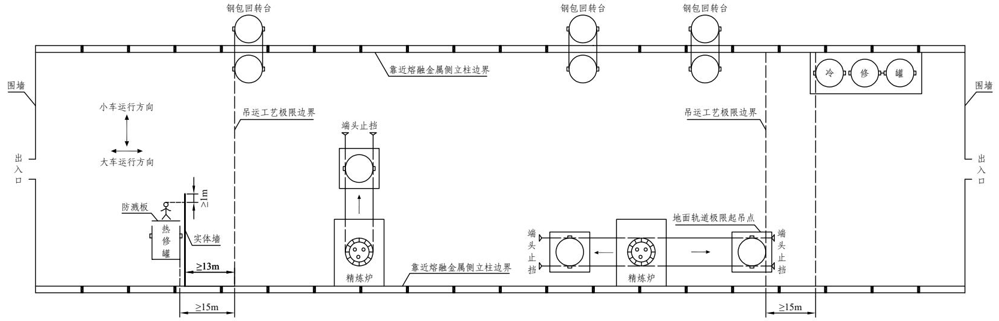

# 《工贸企业重大事故隐患判定标准》解读

时效性：    现行有效

发文机关：  应急管理部安全生产执法和工贸安全监督管理局

发文日期：  2023年05月13日

施行日期：  2023年05月13日

效力级别：  部门规范性文件

为准确判定、及时消除工贸企业重大事故隐患，根据《安全生产法》等法律、行政法规，结合近年来工贸企业典型事故教训，应急管理部制定印发了《工贸企业重大事故隐患判定标准》（应急管理部令第10号，以下简称《判定标准》），列举了64项应当判定为重大事故隐患的情形。为进一步明确具体的判定情形，便于各级应急管理部门和工贸企业应用，规范《判定标准》有效执行，现对《判定标准》中重点条款含义进行解释说明。

第一条　 为了准确判定、及时消除工贸企业重大事故隐患（以下简称重大事故隐患），根据《中华人民共和国安全生产法》等法律、行政法规，制定本标准。

第二条　 本标准适用于判定冶金、有色、建材、机械、轻工、纺织、烟草、商贸等工贸企业重大事故隐患。工贸企业内涉及危险化学品、消防（火灾）、燃气、特种设备等方面的重大事故隐患判定另有规定的，适用其规定。

【解读】

（1）本《判定标准》中第三条“管理类”重大事故隐患判定标准适用于所有相关工贸企业；第四条至第十条“行业类”重大事故隐患判定标准分别适用于冶金、有色、建材、机械、轻工、纺织、烟草7个行业的工贸企业；第十一条至第十三条“专项类”重大事故隐患判定标准分别适用于存在粉尘爆炸危险、使用液氨制冷和存在硫化氢、一氧化碳等中毒风险有限空间作业3个领域的相关工贸企业。

（2）冶金、有色以外的工贸企业中存在炼铁高炉，30吨以上的炼钢转炉、炼钢电弧炉、钢水精炼炉的，相关要求按照第四条冶金企业（一）、（二）、（四）、（五）、（六）、（七）、（八）项执行。

（3）有色以外的工贸企业中存在深井铸造工艺的，相关要求按照第五条有色企业（三）、（六）、（七）、（八）、（九）、（十）项执行。

第三条　 工贸企业有下列情形之一的，应当判定为重大事故隐患：

（一）未对承包单位、承租单位的安全生产工作统一协调、管理，或者未定期进行安全检查的。

【解读】

判定情形：

（1）生产经营项目、场所发包或者出租给其他单位的，企业未与承包单位、承租单位签订专门的安全生产管理协议，或者未在承包合同、承租合同中约定各自的安全生产管理职责。

（2）生产经营项目、场所发包或者出租给其他单位的，企业与承包单位、承租单位签订的安全生产管理协议、承包合同、承租合同中，免除或者转嫁企业安全生产工作统一协调、管理义务。

（3）生产经营项目、场所发包或者出租给其他单位的，企业未按照安全生产规章制度或者协议、合同中的要求，定期对承包单位、承租单位进行安全检查，或者发现安全问题未督促整改。

（二）特种作业人员未按照规定经专门的安全作业培训并取得相应资格，上岗作业的。

【解读】

判定情形：

（1）企业使用未取得相应特种作业操作证的特种作业人员上岗作业。

（2）企业使用伪造特种作业操作证的特种作业人员上岗作业。

（3）企业使用特种作业操作证已过有效期或者到期未复审的特种作业人员上岗作业。

（三）金属冶炼企业主要负责人、安全生产管理人员未按照规定经考核合格的。

【解读】

判定情形：

金属冶炼企业主要负责人、安全生产管理人员任职之日起6个月后，未经相应的应急管理部门考核合格。

第四条　 冶金企业有下列情形之一的，应当判定为重大事故隐患：

（一）会议室、活动室、休息室、操作室、交接班室、更衣室（含澡堂）等6类人员聚集场所,以及钢铁水罐冷（热）修工位设置在铁水、钢水、液渣吊运跨的地坪区域内的。

【解读】

1.说明：

（1）“地坪区域”是指横向以铁水、钢水、液渣（以下简称“熔融金属”，冶金企业下同）吊运跨两侧立柱靠近熔融金属吊运侧的立柱边线为界，纵向以吊运跨两侧围墙为界的车间内零米地面区域。其中，横向是指吊运熔融金属起重机的小车运行方向；纵向是指吊运熔融金属起重机的大车运行方向（图4-1）。

“车间内零米地面区域”不包括架空层平台正下方被遮挡的区域，如转炉炉下钢水罐车、渣罐车行走区域。

（2）“操作室”包括控制室、检验室、化验室（冶金企业下同）。

图4-1 地坪区域示意图

2.判定情形：

（1）炼钢厂、铁合金厂的会议室、活动室、休息室、操作室、交接班室、更衣室（含澡堂），设置在熔融金属吊运行走区域的正下方地坪区域。

注：“正下方地坪区域”是指横向以吊运跨两侧立柱靠近熔融金属吊运侧的立柱边线为界，纵向以吊运跨最两端的铁水、钢水、液渣吊运工艺极限边界为界的车间地坪区域（图4-2）。

“吊运工艺极限边界”是指因生产工艺需要，铁水罐、钢水罐、液渣罐（包、盆）位于兑装位、倒罐位、钢包回转台、浇铸位或者地面轨道极限起吊点时，吊运跨纵向靠近最两端方向的罐（包、盆）外壁到达的垂直边界位置（冶金企业下同）。

炼钢连铸的铸余渣罐（包、盆）位于起吊点时的外壁不视为熔融金属吊运工艺极限边界。

图4-2 正下方地坪区域示意图

（2）炼钢厂、铁合金厂的会议室、活动室、休息室、操作室、交接班室、更衣室（含澡堂），设置在熔融金属吊运跨距离吊运工艺极限边界50米以内的地坪区域（纵向两端方向，图4-3）。

图4-3 距离吊运工艺极限边界50米以内的地坪区域示意图

（3）炼钢厂位于车间架空层平台的转炉操作室，其面向铁水吊运侧未采用实体墙完全封闭。

注：“实体墙”是指砖墙、混凝土墙或者采用耐火材料砌（浇）筑的墙体（冶金企业下同）；“未采用实体墙完全封闭”是指操作室面向熔融金属吊运侧的出入门、观察窗未采用实体墙完全封闭（冶金企业下同）。

（4）炼钢厂架空层平台的AOD炉、VD炉、VOD炉的操作室，其面向铁水、钢水吊运侧未采用实体墙完全封闭的外墙，在铁水罐、钢水罐吊运跨靠近熔融金属吊运侧的立柱边线以内。

（5）炼钢厂连铸流程采用钢水罐水平连浇车或者钢包回转台单跨布置的连铸平台操作室，其面向钢水、液渣吊运侧未采用实体墙完全封闭的外墙，在连铸平台靠近熔融金属吊运侧的立柱边线以内。

注：面向钢水、液渣吊运侧包括正对连铸跨和面向钢水罐行走路线两个方向。

（6）炼钢厂钢水罐冷（热）修工位、铁水罐冷修工位设置在铁水、钢水、液渣吊运行走区域的正下方地坪区域内，或者设置在吊运跨纵向最两端时，未满足安全防护要求。

注：“安全防护要求”是指钢水罐冷（热）修工位、铁水罐冷修工位的罐体外壁（靠近罐体吊运工艺极限边界一侧），与熔融金属吊运工艺极限边界间距大于等于15米；钢水罐热修工位靠近熔融金属吊运侧还需设置高度大于等于2米,宽度超出热修操作工位1米以上的实体墙（图4-4）；实体墙与吊运工艺极限边界的距离应大于等于13米。

图4-4 钢水罐冷（热）修工位和铁水罐冷修工位示意图

（二）生产期间冶炼、精炼和铸造生产区域的事故坑、炉下渣坑，以及熔融金属泄漏和喷溅影响范围内的炉前平台、炉基区域、厂房内吊运和地面运输通道等6类区域存在积水的。

【解读】

1.判定情形：

（1）生产期间炉前出铁场内距离高炉主沟、铁沟边沿3米以内区域，存在积水。

（2）生产期间炼钢渣跨、铁水预处理、转炉、电弧炉、感应炉、精炼炉、连铸、矿热炉的炉前作业平台和炉下事故坑、渣坑，以及厂房内的熔融金属吊运通道和厂房内的地面运输通道，存在积水。

（3）生产期间炼钢钢锭浇注坑内、浇注车运行轨道区域内，存在积水。

2.除外情形：

（1）生产期间炉前出铁场内距离高炉主沟、铁沟边沿3米以内区域潮湿。

（2）生产期间炼钢渣跨、铁水预处理、转炉、电弧炉、感应炉、精炼炉、连铸、矿热炉的炉前作业平台和炉下事故坑、渣坑，以及厂房内的熔融金属吊运通道和厂房内的地面运输通道潮湿。

（3）生产期间用于收集（外排）检修和设备故障漏水以及工艺冷却水的排水沟（槽）内积水保持流动状态。

（4）生产期间炼钢渣跨闷渣和电弧炉炉下热泼渣的排水沟（井）内积水保持流动状态。

（三）炼钢连铸流程未设置事故钢水罐、中间罐漏钢坑（槽）、中间罐溢流坑（槽）、漏钢回转溜槽，或者模铸流程未设置事故钢水罐（坑、槽）的。

【解读】

1.判定情形：

（1）连铸流程未设置事故钢水罐、中间罐漏钢坑（槽）、中间罐溢流坑（槽）、漏钢回转溜槽。

（2）漏钢回转溜槽未按要求设置或者维护。

注：回转溜槽设置要求包括溜槽本体使用钢板焊接，内部使用耐火砖或者耐火材料砌筑，溜槽一端延伸至事故钢水罐上方，另一端应在不影响中间罐车正常行走情况下尽量靠近中间罐车本体一侧，且端头封闭；维护要求包括内部无堵塞、无积水。连铸机设置单侧漏钢回转溜槽即可。

（3）中间罐漏钢坑（槽）的应急储存容量小于中间罐满罐容量。

（4）钢锭模铸流程未设置事故钢水罐（槽、坑）。

注：钢锭浇注坑不得作为事故坑。

（5）连铸事故钢水罐或者钢锭模铸事故钢水罐（坑、槽）的应急储存容量小于钢水罐满罐容量。

2.除外情形：

（1）使用钢水罐水平连浇车的连铸工艺，未设置漏钢回转溜槽。

（2）使用钢水罐水平连浇车的连铸工艺，其事故钢水罐设置在连铸平台下方的车间内零米地面。

（四）转炉、电弧炉、AOD炉、LF炉、RH炉、VOD炉等炼钢炉的水冷元件未设置出水温度、进出水流量差等监测报警装置，或者监测报警装置未与炉体倾动、氧（副）枪自动提升、电极自动断电和升起装置联锁的。

【解读】

1.判定情形：

（1）转炉、AOD炉的氧枪自动升起未与氧枪氧气压力、冷却水进水流量、出水温度、进出水流量差联锁；水冷副枪自动升起未与副枪冷却水进水流量、出水温度、进出水流量差联锁；炉体倾动未与水冷氧枪或者副枪的进出水流量差联锁。

（2）LF炉的水冷钢包盖，电弧炉水冷炉壁、水冷炉盖、水冷氧气顶枪、竖井水冷件，Consteel炉连接小车水套，未设置出水温度与进出水流量差监测报警装置，或者报警装置未与电极自动断电和升起联锁。

（3）电弧炉水冷氧气顶枪的出水温度与进出水流量差监测报警装置，未与顶枪自动提升和停止供氧联锁。

（4）VOD、CAS-OB、IR-UT、RH-KTB等精炼炉的水冷氧枪未设置进出水流量差监测报警装置，或者报警装置未与氧枪自动提升和停止供氧联锁。

2.除外情形：

使用雾化水（压缩空气和水的混合物）冷却工艺，且设有雾化水循环供水水箱和实时监测水箱内水位差的电弧炉，未设置进出水流量差监测报警装置。

（五）高炉生产期间炉顶工作压力设定值超过设计文件规定的最高工作压力，或者炉顶工作压力监测装置未与炉顶放散阀联锁，或者炉顶放散阀的联锁放散压力设定值超过设备设计压力值的。

【解读】

1.说明：

“设备设计压力值”是指设计文件规定的炉顶放散阀联锁自动放散的最大压力值。

2.判定情形：

（1）生产期间炉顶工作压力设定值超过设计文件规定的最高工作压力设计值。

（2）生产期间炉顶放散阀未与炉顶工作压力联锁。

（3）生产期间炉顶放散阀的联锁放散压力设定值，超过设备设计压力值。

（4）炉顶放散阀阀盖拴拉固定。

3.除外情形：

单座高炉的炉顶放散阀数量大于等于3个，生产期间至少有2个炉顶放散阀与炉顶工作压力联锁。

（六）煤气生产、回收净化、加压混合、储存、使用设施附近的会议室、活动室、休息室、操作室、交接班室、更衣室等6类人员聚集场所，以及可能发生煤气泄漏、积聚的场所和部位未设置固定式一氧化碳浓度监测报警装置，或者监测数据未接入24小时有人值守场所的。

【解读】

1.说明：

（1）“煤气生产、回收净化、加压混合、储存、使用设施”是指高炉、转炉、焦炉、竖炉、竖窑、连铸、矿热炉、煤气除尘器、煤气柜、加压机、抽气机、混合装置和煤气加热炉、退火炉、预热炉、点火炉、干燥炉、热风炉、回转窑、发电设施。

（2）“可能发生煤气泄漏、积聚的场所和部位”是指焦炉地下室、加热炉地下室、退火炉地下室、煤气柜进出口管道地下室、煤气柜活塞上部、加压机房、抽气机房、排水器房、烘烤器、预热器、高炉风口及以上各层平台（炉顶大方孔以上各层平台除外）、高炉炉顶液压站（含封闭式油泵间、封闭式工具间）、热风炉煤气自动切断阀操作平台、喷煤干燥炉、煤粉制备间、煤气发电设施间（含TRT透平机隔音罩）、煤气除尘器卸灰平台、转炉炉口以上各层平台、真空精炼装置的水封池、机械真空泵房、煤气加热炉、煤气预热炉、煤气热处理炉、烧结球团主抽风机室、烧结点火炉、球团竖炉（回转窑）点火器、白灰竖窑（回转窑）点火器。

2.判定情形：

（1）煤气生产、回收净化、加压混合、储存、使用设施附近的会议室、活动室、休息室、操作室、交接班室、更衣室未设置固定式一氧化碳浓度监测报警装置。

注：本项不适用厂区煤气输配管道旁侧设置的6类人员聚集场所。

（2）可能发生煤气泄漏、积聚的场所和部位，未设置固定式一氧化碳浓度监测报警装置。

（3）在本项明确的6类人员聚集场所、可能发生煤气泄漏积聚的场所和部位，设置的固定式一氧化碳浓度监测报警装置实时数据，未接入24小时有人值守场所。

3.除外情形：

（1）会议室、活动室、休息室、操作室、交接班室、更衣室内部设置的无其他出入口、窗户的6类人员聚集场所，未设置固定式一氧化碳浓度监测报警装置。

（2）本项判定情形（1）明确的设施现场采取无人值守操作时，无人值守区域的会议室、活动室、休息室、操作室、交接班室、更衣室，未设置固定式一氧化碳浓度监测报警装置。

（3）煤气生产、回收净化、加压混合、储存、使用设施24小时有人值守操作室内的报警装置实时数据，未接入24小时有人值守场所。

（七）加热炉、煤气柜、除尘器、加压机、烘烤器等设施，以及进入车间前的煤气管道未安装隔断装置的。

【解读】

1.说明：

“隔断装置”是指配置在煤气管道上，用于隔断煤气，具有可靠保持煤气不泄漏到隔离区域功能的装置统称。具有此功能的装置，可以是独立式或者组合式的。独立式隔断装置包括全封闭式眼镜阀、阀腔注水型双闸板切断阀、阀腔注水型NK阀；组合式隔断装置由蝶阀、闸阀、球阀等切断装置和眼镜阀、盲板、U/V型水封等共同组成。

2.判定情形：

（1）加热炉、煤气柜、除尘器、加压机、烘烤器等煤气设施的煤气管道未设置隔断装置。

注：采用切断装置和盲板组合式隔断装置时应在堵盲板处设置撑铁。

高炉、转炉煤气净化系统涉及的重力除尘器、旋风除尘器、冷却器、喷淋塔、洗涤塔、环缝清洗塔、文氏管、脱水器的进出口煤气管道，按工艺特性不设隔断装置。

（2）进入车间前的入口煤气管道，未设置隔断装置。

3.除外情形：

（1）转炉煤气净化系统负压工况的电除尘器进出口煤气管道未设置隔断装置。

（2）直径小于100毫米的煤气管道采用切断装置和盲板组合式隔断装置时，未在堵盲板处设置撑铁。

（八）正压煤气输配管线水封式排水器的最高封堵煤气压力小于30kPa，或者同一煤气管道隔断装置的两侧共用一个排水器，或者不同煤气管道排水器上部的排水管连通，或者不同介质的煤气管道共用一个排水器的。

【解读】

1.说明：

（1）“水封式排水器”，是指利用水柱高度克服煤气压力，将煤气管道中的冷凝水、积水等通过溢流方式自动排出的装置。根据排水器本体结构不同分为立式水封式排水器、卧式水封式排水器。

（2）“最高封堵煤气压力”，是指水封式排水器自身结构决定的能够封住管道中煤气的最高压力，一般用kPa（国际单位）表示，也可用mmH2O(水柱高度)表示。

2.判定情形：

（1）正压煤气输配管道水封式排水器的最高封堵煤气压力小于30kPa（3060mmH2O）。

（2）同一煤气输配管道隔断装置的两侧共用一个排水器。

（3）不同煤气管道排水器上部的排水管连通。

（4）不同介质的煤气管道共用一个排水器。

3.除外情形：

（1）煤气柜柜底、柜体和转炉煤气柜后电除尘器底部的水封式排水器最高封堵煤气压力小于30kPa（3060mmH2O）。

（2）煤气抽气机进出口管道隔断装置两侧的正负压工况排液管共用水封井(罐)。

第五条　 有色企业有下列情形之一的，应当判定为重大事故隐患：

（一）会议室、活动室、休息室、操作室、交接班室、更衣室（含澡堂）等6类人员聚集场所设置在熔融金属吊运跨的地坪区域内的。

【解读】

1.说明：

（1）“熔融金属”是熔融态、液态有色金属和熔渣、液渣的统称。

（2）“地坪区域”是指横向以熔融金属吊运跨两侧立柱靠近熔融金属吊运侧的立柱边线为界，纵向以吊运跨两侧围墙为界的车间内零米地面区域。其中，横向是指吊运熔融金属起重机的小车运行方向；纵向是指吊运熔融金属起重机的大车运行方向。

（3）“操作室”包括控制室、检验室、化验室（有色企业下同）。

2.判定情形：

（1）会议室、活动室、休息室、操作室、交接班室、更衣室（含澡堂）设置在吊运跨正下方地坪区域内。

注：“正下方地坪区域”是指横向以吊运跨两侧立柱靠近熔融金属吊运侧的立柱边线为界，纵向以吊运跨最两端的熔融金属吊运工艺极限边界为界的车间地坪区域；“吊运工艺极限边界”是指因生产工艺需要，熔融金属罐（包、盆）位于兑装位、倒罐位、浇铸位或者地面轨道极限起吊点时，吊运跨纵向靠近最两端方向的罐（包、盆）外壁到达的垂直边界位置（有色企业下同，图5-1）。

图5-1 正下方地坪区域示意图

（2）会议室、活动室、休息室、操作室、交接班室、更衣室（含澡堂）6类人员聚集场所设置在吊运跨地坪区域纵向最两端时未满足安全防护要求。

注：“安全防护要求”是指会议室、活动室、休息室、操作室、交接班室、更衣室（含澡堂）6类人员聚集场所的外墙（靠近罐体吊运工艺极限边界一侧，有色企业下同），与熔融金属吊运工艺极限边界大于等于15米（图5-2）。

图5-2 人员聚集场所示意图

（3）生产工艺需要熔融金属罐（包、盆）进入厂房架空层平台时，平台上操作室面向熔融金属吊运侧未采用实体墙完全封闭的外墙，在吊运跨靠近熔融金属吊运侧的立柱边线以内。

注：“实体墙”是指砖墙、混凝土墙或者采用耐火材料砌（浇）筑的墙体；“未采用实体墙完全封闭”是指操作室面向熔融金属吊运侧的出入门、观察窗未采用实体墙完全封闭。

（二）生产期间冶炼、精炼、铸造生产区域的事故坑、炉下渣坑，以及熔融金属泄漏、喷溅影响范围内的炉前平台、炉基区域、厂房内吊运和地面运输通道等6类区域存在非生产性积水的。

【解读】

1.说明：

“生产性积水”是指必须与生产设备同步存在、同步运行，且暴露在生产现场的生产工艺操作必须性水源，如开路冷却水系统的收集水槽、水箱，深井铸造工艺的深井内部冷却水等。

2.判定情形：

（1）生产期间冶炼、精炼、铸造生产区域的事故坑、炉下渣坑、炉前作业平台、炉基区域存在非生产性积水。

（2）生产期间厂房内熔融金属吊运通道和厂房内地面运输通道存在积水。

3.除外情形：

（1）生产期间事故坑、炉下渣坑、炉前作业平台、炉基区域潮湿。

（2）生产期间设置在冶炼、精炼、铸造生产区域，用于收集（外排）检修和设备故障漏水以及工艺冷却水的排水沟（槽）内积水保持流动状态。

（3）生产期间厂房内的熔渣、液渣缓冷场地存在积水。

（三）熔融金属铸造环节未设置紧急排放和应急储存设施的（倾动式熔炼炉、倾动式保温炉、倾动式熔保一体炉、带保温炉的固定式熔炼炉除外）；

【解读】

1.判定情形：

（1）熔融金属深井铸造工艺的熔炼炉、保温炉、浇铸炉，未设置紧急排放和应急储存设施。

注：“浇铸炉”是指与铸造深井通过流槽、分配流槽直接相连的浇铸炉组，包括保温炉（静置炉）、熔保一体炉，不包括单独具备熔炼功能的熔炼炉（有色企业下同）。

（2）熔融金属深井铸造工艺的固定式浇铸炉应急储存设施容量小于炉体额定装料量；多台固定式浇铸炉共用应急储存设施时，应急储存设施容量小于最大单炉炉体额定装料量。

2.除外情形：

倾动式熔炼炉、倾动式保温炉、倾动式熔保一体炉，以及带保温炉的固定式熔炼炉，未设置紧急排放和应急储存设施。

（四）采用水冷冷却的冶炼炉窑、铸造机（铝加工深井铸造工艺的结晶器除外）、加热炉未设置应急水源的。

【解读】

1.判定情形：

（1）采用水冷冷却的熔融金属冶炼炉窑、加热炉、铸造机未设置高位水塔（箱、池）、事故供水泵等应急供水设施。

（2）应急供水设施未设置应急电源。

注：“应急电源”是指双回路供电、UPS电源、可自动转换的柴油发电机，或者其他具有同等级应急功能的动力源；高位水塔（箱、池）等通过重力自流作用实现应急供水的设施，不涉及应急电源（有色企业下同）。

2.除外情形：

铝加工深井铸造工艺的结晶器未设置应急供水设施，或者应急供水设施未设置应急电源。

（五）熔融金属冶炼炉窑的闭路循环水冷元件未设置出水温度、进出水流量差监测报警装置，或者开路水冷元件未设置进水流量、压力监测报警装置，或者未监测开路水冷元件出水温度的。

【解读】

判定情形：

（1）熔融金属冶炼、熔炼、精炼炉窑的闭路循环水冷元件未设置出水温度、进出水流量差监测报警装置。

（2）熔融金属冶炼、熔炼、精炼炉窑的开路水冷元件未设置进水流量、压力监测报警装置。

注：出水温度、进水流量、进出水流量差、压力监测报警装置的设置，可以按熔融金属炉窑不同水冷元件的供水特点分区域、分类别设置，即不是每个水冷元件必须单独设置对应的监测报警装置。

（3）未对熔融金属冶炼、熔炼、精炼炉窑的开路水冷元件出水温度进行检测。

注：检测方式包括定期手动检测、在线实时监测。企业采取手动方式检测开路水冷元件出水温度时，应按管理制度或操作规程的要求进行检测，检测结果应有书面记录。

（六）铝加工深井铸造工艺的结晶器冷却水系统未设置进水压力、进水流量监测报警装置，或者监测报警装置未与快速切断阀、紧急排放阀、流槽断开装置联锁，或者监测报警装置未与倾动式浇铸炉控制系统联锁的。

【解读】

判定情形：

（1）结晶器冷却水系统未设置进水压力、进水流量监测报警装置。

（2）结晶器冷却水进水压力、进水流量监测报警信号，未与快速切断阀或者紧急排放阀联锁。

（3）结晶器冷却水进水压力、进水流量监测报警信号，未与流槽断开装置联锁。

（4）结晶器冷却水进水压力、进水流量监测报警信号，未与倾动式浇铸炉的倾动控制系统联锁。

（七）铝加工深井铸造工艺的浇铸炉铝液出口流槽、流槽与模盘（分配流槽）入口连接处未设置液位监测报警装置，或者固定式浇铸炉的铝液出口未设置机械锁紧装置的。

【解读】

判定情形：

（1）浇铸炉铝液出口流槽或者流槽与模盘（分配流槽）入口连接处，未设置液位监测报警装置。

注：铸造深井的每个结晶器（如扁锭生产，有色企业下同）或者模盘的每一个流道均设有液位监测报警装置，视同该浇铸炉的流槽与模盘（分配流槽）入口连接处，设置有液位监测报警装置。

（2）固定式浇铸炉的铝液出口，未设置机械锁紧装置。

（八）铝加工深井铸造工艺的固定式浇铸炉的铝液流槽未设置紧急排放阀，或者流槽与模盘（分配流槽）入口连接处未设置快速切断阀（断开装置），或者流槽与模盘（分配流槽）入口连接处的液位监测报警装置未与快速切断阀（断开装置）、紧急排放阀联锁的。

【解读】

判定情形：

（1）固定式浇铸炉的铝液流槽未设置紧急排放阀。

注：流槽与模盘（分配流槽）入口连接处设置断开装置的固定式浇铸炉，其铝液流槽可不设置紧急排放阀。

（2）固定式浇铸炉的流槽与模盘（分配流槽）入口连接处，未设置快速切断阀或者断开装置。

（3）固定式浇铸炉流槽与模盘（分配流槽）入口连接处的液位监测报警信号，未与快速切断阀、断开装置、紧急排放阀联锁。

注：铸造深井的每个结晶器或者模盘的每个流道均设有液位监测报警装置，且每个监测报警装置均与紧急排放阀、快速切断阀（断开装置）联锁的，视同固定式浇铸炉流槽与模盘（分配流槽）入口连接处设置有液位监测报警装置，且与快速切断阀、断开装置、紧急排放阀联锁。

（九）铝加工深井铸造工艺的倾动式浇铸炉流槽与模盘（分配流槽）入口连接处未设置快速切断阀（断开装置），或者流槽与模盘（分配流槽）入口连接处的液位监测报警装置未与浇铸炉倾动控制系统、快速切断阀（断开装置）联锁的。

【解读】

判定情形：

（1）倾动式浇铸炉的流槽与模盘（分配流槽）入口连接处，未设置快速切断阀或者断开装置。

（2）倾动式浇铸炉流槽与模盘（分配流槽）入口连接处的液位监测报警信号，未与快速切断阀或者断开装置联锁。

（3）倾动式浇铸炉流槽与模盘（分配流槽）入口连接处的液位监测报警信号，未与倾动控制系统联锁。

注：铸造深井的每个结晶器或者模盘的每个流道均设有液位监测报警装置，且每个报警装置均与快速切断阀（断开装置）、倾动控制系统联锁的，视同倾动式浇铸炉流槽与模盘（分配流槽）入口连接处设置有液位监测报警装置，且与快速切断阀（断开装置）、浇铸炉倾动控制系统联锁。

（4）液位监测报警装置、紧急排放阀、快速切断阀、断开装置，未设置应急电源。

（十）铝加工深井铸造机钢丝卷扬系统选用非钢芯钢丝绳，或者未落实钢丝绳定期检查、更换制度的。

【解读】

判定情形：

（1）钢丝卷扬系统选用非钢芯钢丝绳。

（2）未按照钢丝绳定期检查和更换制度要求，对钢丝绳进行定期检查。

注：定期检查周期至少每月1次。

（3）钢丝绳应报废的仍然继续使用。

（十一）可能发生一氧化碳、砷化氢、氯气、硫化氢等4种有毒气体泄漏、积聚的场所和部位未设置固定式气体浓度监测报警装置，或者监测数据未接入24小时有人值守场所，或者未对可能有砷化氢气体的场所和部位采取同等效果的检测措施的。

【解读】

1.说明：

（1）“可能发生一氧化碳气体泄漏、积聚的场所和部位”是指各种煤气发生设施附近；涉及煤气的各类地下室、加压站；使用煤气的热风炉、焙烧炉、干燥炉等；以焦碳（碳粉、煤粉）为燃料或还原剂的生产环节，如烟化炉、阳极炉等；高钛渣冶炼、镍火法冶炼、硅冶炼用的电炉、全密闭矿热炉的煤气净化、回收、储存、输配与使用区域。

（2）“可能发生砷化氢气体泄漏、积聚的场所和部位”是指铅锌冶炼中的酸浸工序、净液工序、海绵镉工序、铟置换工序等；铜冶炼中的电解液净化工序、烟尘回收的铜电积工序；锡冶炼中的除杂工序等。

（3）“可能发生氯气泄漏、积聚的场所和部位”是指贵金属生产的液氯储存、汽化间；氯化分金工序（分金釜、一次还原釜、二次还原釜等）及沉钯等工序；锗生产的液氯储存、汽化间；氯化工序、精馏（复蒸）等工序；铅铋精炼工序中的液氯氯化精炼工艺（如铋氯化精炼锅）。

（4）“可能发生硫化氢气体泄漏、积聚的场所和部位”是指采用硫化石膏法脱砷工艺污水处理系统（如在废酸中加入硫化钠或硫氢化钠产生硫化氢、用水电解制氢并与硫磺反应生产硫化氢、甲醇裂解制氢并与硫磺反应生产硫化氢等）；硫化钠、硫氢化钠储存地点（如硫化钠、硫氢化钠与酸同库储存或受潮产生硫化氢）。

2.判定情形：

（1）可能发生一氧化碳、砷化氢、氯气、硫化氢气体泄漏、积聚的场所和部位，未设置固定式气体浓度监测报警装置。

（2）本项明确的可能发生一氧化碳、砷化氢、氯气、硫化氢4种气体泄漏、积聚场所和部位的固定式气体浓度监测报警装置实时数据，未接入24小时有人值守场所。

注：非24小时连续生产的企业，现场固定式气体浓度监测报警装置的实时数据，应当接入生产期间有人值守的场所。

（3）可能出现砷化氢气体泄漏、积聚且未设置固定式气体浓度监测报警装置的场所和部位，未使用溴化汞（氯化汞）试纸检测砷化氢气体浓度。

3.除外情形：

可能发生砷化氢气体泄漏、积聚的场所和部位使用溴化汞（氯化汞）试纸检测砷化氢气体浓度。

（十二）使用煤气（天然气）并强制送风的燃烧装置的燃气总管未设置压力监测报警装置，或者监测报警装置未与紧急自动切断装置联锁的。

【解读】

1.说明：

“使用煤气（天然气）并强制送风的燃烧装置”，是指采用风机供给助燃空气的点火炉、回转窑、竖炉、竖窑、干燥窑、烟气炉，以及熔融金属罐（包、盆）烘烤器、冶炼炉、熔炼炉、精炼炉、保温炉、熔保炉，加热炉、退火炉、热处理炉等煤气（天然气）单体燃气设备。

2.判定情形：

（1）使用煤气（天然气）并采用强制送风燃烧装置的煤气（天然气）入口总管道，未设置止回装置或者紧急自动切断装置。

（2）使用煤气（天然气）单体燃气设备的入口总管道紧急自动切断装置，未与燃气入口总管道低压监测装置联锁。

（十三）正压煤气输配管线水封式排水器的最高封堵煤气压力小于30kPa，或者同一煤气管道隔断装置的两侧共用一个排水器，或者不同煤气管道排水器上部的排水管连通，或者不同介质的煤气管道共用一个排水器的。

【解读】

1.说明：

“最高封堵煤气压力”是指水封式排水器自身结构决定的能够封住管道中煤气的最高压力，一般用kPa（国际单位）表示，也可用mmH2O(水柱高度)表示。

2.判定情形：

（1）正压煤气输配管道水封式排水器的最高封堵煤气压力小于30kPa（3060mmH2O）。

（2）同一煤气输配管道隔断装置的两侧共用一个排水器。

（3）不同煤气管道排水器上部的排水管连通。

3.除外情形：

（1）煤气柜柜底水封式排水器最高封堵煤气压力小于30kPa（3060mmH2O）。

（2）煤气抽气机进出口管道隔断装置两侧的正负压工况排液管共用水封井(罐)。

第六条　 建材企业有下列情形之一的，应当判定为重大事故隐患：

（一）煤磨袋式收尘器、煤粉仓未设置温度和固定式一氧化碳浓度监测报警装置，或者未设置气体灭火装置的。

【解读】

判定情形：

（1）煤磨袋式收尘器的灰斗或者进、出风口未设置温度监测报警装置。

（2）煤粉仓锥体未设置温度监测报警装置。

（3）煤磨袋式收尘器出风口未设置固定式一氧化碳浓度监测报警装置。

（4）煤粉仓未设置固定式一氧化碳浓度监测报警装置。

（5）煤磨袋式收尘器或者煤粉仓未设置气体灭火装置，或者气体灭火装置未同时设有自动控制、手动控制和机械应急操作三种启动方式。

（二）筒型储库人工清库作业未落实清库方案中防止高处坠落、坍塌等安全措施的。

【解读】

判定情形：

（1）筒型储存库人工清库作业未制定清库方案。

（2）筒型储存库人工清库方案缺少防止高处坠落、坍塌、掩埋窒息等事故的安全措施。

（3）筒型储存库人工清库作业时未落实防止高处坠落、坍塌、掩埋窒息等事故的安全措施。

（三）水泥企业电石渣原料筒型储库未设置固定式可燃气体浓度监测报警装置，或者监测报警装置未与事故通风装置联锁的。

【解读】

判定情形：

（1）水泥企业电石渣原料筒型库库顶最高处未设置能够监测乙炔气体浓度的固定式可燃气体浓度监测报警装置。

（2）水泥企业电石渣原料筒型库未设置事故通风装置。

（3）水泥企业电石渣原料筒型库固定式可燃气体监测报警装置未与事故通风装置联锁。

（四）进入筒型储库、焙烧窑、预热器旋风筒、分解炉、竖炉、篦冷机、磨机、破碎机前，未对可能意外启动的设备和涌入的物料、高温气体、有毒有害气体等采取隔离措施，或者未落实防止高处坠落、坍塌等安全措施的。

【解读】

判定情形：

（1）进入筒型储库、篦冷机、磨机、破碎机内作业时，未在配电室切断设备电源并上锁、挂牌。

（2）进入筒型储库、焙烧窑、预热器旋风筒、分解炉、竖炉、篦冷机、磨机等作业时，未关闭防止物料涌入、高温或有毒有害气体进入的阀门、闸板，并断电、上锁、挂牌。

（3）筒型储库、焙烧窑、预热器旋风筒、分解炉、竖炉、篦冷机内作业时，未采取防止作业面上方物料坍塌伤人措施，或者未落实防止高处坠落措施。

（五）采用预混燃烧方式的燃气窑炉（热发生炉煤气窑炉除外）的燃气总管未设置管道压力监测报警装置，或者监测报警装置未与紧急自动切断装置联锁的。

【解读】

1.说明：

“燃气总管”是指供应单台燃气窑炉全部燃气的管道。

2.判定情形：

（1）采用预混、部分预混燃烧方式的燃气窑炉的燃气总管未设置压力监测报警装置。

（2）采用预混、部分预混燃烧方式的燃气窑炉的燃气总管未设置紧急自动切断阀。

（3）采用预混、部分预混燃烧方式的燃气窑炉燃气总管的紧急自动切断阀未与压力监测报警装置联锁。

3.除外情形：

采用扩散燃烧方式的燃气窑炉；热发生炉煤气窑炉。

（六)制氢站、氮氢保护气体配气间、燃气配气间等3类场所未设置固定式可燃气体浓度监测报警装置的。

【解读】

判定情形：

（1）制氢站、氮氢保护气体配气间未设置能够监测氢气浓度的固定式可燃气体浓度监测报警装置。

（2）燃气配气间未设置固定式可燃气体浓度监测报警装置。

（七）电熔制品电炉的水冷设备失效的。

【解读】

判定情形：

电熔制品电炉的水冷设备漏水。

（八）玻璃窑炉、玻璃锡槽等设备未设置水冷和风冷保护系统的监测报警装置的。

【解读】

判定情形：

（1）玻璃窑炉、玻璃锡槽的水冷设备进水总管未设置水流量监测报警装置，也未设置压力监测报警装置。

（2）玻璃窑炉的前脸水包，玻璃锡槽的锡液冷却水包、唇砖水包等水冷设备未设置出水温度监测报警。

（3）玻璃窑炉的池壁风机、钢碹碴风机、L吊墙风机、玻璃锡槽的槽底风机等风冷保护设备未设置停机报警装置。

第七条　 机械企业有下列情形之一的，应当判定为重大事故隐患：

（一）会议室、活动室、休息室、更衣室、交接班室等5类人员聚集场所设置在熔融金属吊运跨或者浇注跨的地坪区域内的。

【解读】

1.说明：

（1）“吊运跨”是指熔炼作业区所属的熔融金属吊运行走途经的厂房两端柱距（围墙）及跨度区域（图7-1）。

（2）“浇注跨”是指在浇注作业区所属的熔融金属吊运行走途经的厂房两端柱距（围墙）及跨度区域（图7-1）。

图7-1 吊运跨、浇注跨示意图

（3）“地坪区域”是指横向以熔融金属吊运跨或者浇注跨两侧立柱靠近熔融金属吊运侧的立柱边线为界，纵向以吊运跨或者浇注跨两端围墙为界的车间内正负零面区域。其中，“横向”是指吊运熔融金属起重机的小车运行方向；“纵向”是指吊运熔融金属起重机的大车运行方向（图7-2）；“正负零面区域”不包括架空层平台正下方被遮挡的区域。

图7-2 吊运跨、浇注跨地坪区域示意图

2.判定情形：

（1）会议室、活动室、休息室、更衣室、交接班室，设置在熔融金属吊运跨的正下方地坪区域内。

注：“正下方地坪区域”是指横向以吊运行走跨度两侧立柱靠近熔融金属吊运侧的立柱边线为界，纵向以熔融金属吊运工艺极限边界为界的地坪区域（图7-3）。

图7-3 吊运跨、浇注跨正下方地坪区域示意图

（2）会议室、活动室、休息室、更衣室、交接班室，设置在熔融金属浇注跨的正下方地坪区域内。

（3）位于熔融金属吊运架空层平台下方，在吊运跨或者浇注跨两侧立柱边界以内的会议室、活动室、休息室、更衣室、交接班室，面向熔融金属吊运一侧，未采取实体墙完全封闭的。

注：“实体墙”是指砖墙、混凝土墙或者采用耐火材料砌（浇）筑的墙体。

（二）铸造用熔炼炉、精炼炉、保温炉未设置紧急排放和应急储存设施的。

【解读】

1.判定情形：

（1）铸造用熔炼炉、精炼炉、保温炉，未设置紧急排放和应急储存设施。

（2）铸造用熔炼炉、精炼炉、保温炉的应急储存设施容积小于炉体最大容量。

（3）两台或者两台以上熔炼炉、精炼炉、保温炉共用应急储存设施，其容量小于各熔炼炉、精炼炉、保温炉炉体容量之和。

2.除外情形：

有色合金铸造用机边炉未设置紧急排放和应急储存设施。

（三）生产期间铸造用熔炼炉、精炼炉、保温炉的炉底、炉坑和事故坑，以及熔融金属泄漏、喷溅影响范围内的炉前平台、炉基区域、造型地坑、浇注作业坑和熔融金属转运通道等8类区域存在积水的。

【解读】

1.判定情形：

（1）生产期间铸造用熔炼炉、精炼炉、保温炉的炉底、炉坑，事故坑内部，以及熔融金属泄漏、喷溅影响范围内的炉前平台、炉基区域存在积水。

（2）生产期间造型地坑、浇注作业坑存在积水。

（3）生产期间熔融金属转运通道正下方平面及其周边3米区域内存在积水。

（4）在架空层通过固定轨道转运熔融金属时，架空层表面存在积水。

2.除外情形：

（1）生产期间事故坑以及熔融金属泄漏、喷溅影响范围内的炉前平台、造型地坑、浇注作业坑和熔融金属转运通道潮湿。

（2）生产期间设置在熔炼、精炼、铸造生产区域，用于收集、外排检修和设备故障漏水以及工艺冷却水的排水沟 （槽）内积水保持流动状态。

（四）铸造用熔炼炉、精炼炉、压铸机、氧枪的冷却水系统未设置出水温度、进出水流量差监测报警装置，或者监测报警装置未与熔融金属加热、输送控制系统联锁的。

【解读】

1.判定情形：

（1）铸造用熔炼炉、精炼炉冷却水系统未设置出水温度监测报警装置，或者出水温度监测报警装置未与熔融金属加热系统联锁。

（2）铸造用熔炼炉、精炼炉冷却水系统未设置进出水流量差监测报警装置，或者进出水流量差监测报警装置未与熔融金属加热系统联锁。

（3）用于压铸机模温控制的冷却水系统未设置出水温度监测报警装置，或者出水温度监测报警装置未与熔融金属输送控制系统联锁。

（4）用于压铸机模温控制的冷却水系统未设置进出水流量差监测报警装置（或者等效的测漏报警装置，如水压监测报警装置），或者进出水流量差监测报警装置（或者等效的测漏报警装置，如水压监测报警装置）未与熔融金属输送控制系统联锁。

（5）氧枪的冷却水系统未设置出水温度监测报警装置，或者出水温度监测报警装置未与氧气输送控制系统联锁。

（6）氧枪的冷却水系统未设置进出水流量差监测报警装置，或者进出水流量差监测报警装置未与氧气输送控制系统联锁。

2.除外情形：

（1）有色合金铸造用机边熔保一体炉，未设置出水温度、进出水流量差监测报警装置，或者监测报警装置未与熔融金属加热、输送控制系统联锁；

（2）用于非镁合金压铸且锁模力小于2000吨（含）、开合模区域设有安全门或者安全挡板的压铸机，用于模温控制的冷却水系统未设置出水温度、进出水流量差监测报警装置，或者监测报警装置未与熔融金属输送控制系统联锁。

（五）使用煤气（天然气）的燃烧装置的燃气总管未设置管道压力监测报警装置，或者监测报警装置未与紧急自动切断装置联锁，或者燃烧装置未设置火焰监测和熄火保护系统的。

【解读】

1.说明：

“燃烧装置的燃气总管”是指以煤气（天然气）为燃料的烘烤器、熔炼炉、精炼炉、保温炉、加热炉、退火炉、热处理炉等单台设备的煤气（天然气）入口总管道。

2.判定情形：

（1）使用煤气（天然气）的燃烧装置的燃气总管未设置管道压力监测报警装置。

（2）使用煤气（天然气）的燃烧装置的燃气总管的压力监测报警装置未与紧急自动切断装置联锁。

（3）使用煤气（天然气）的燃烧装置未设置火焰监测和熄火保护系统。

（六）使用可燃性有机溶剂清洗设备设施、工装器具、地面时，未采取防止可燃气体在周边密闭或者半密闭空间内积聚措施的。

【解读】

判定情形：

（1）使用可燃性有机溶剂清洗设备设施、工装器具、地面时，未采取机械通风等措施防止可燃气体在密闭空间或者半密闭空间内积聚。

（2）使用可燃性有机溶剂清洗设备设施、工装器具、地面时，未采取隔离、封堵等措施防止可燃气体逸散到周边密闭或者半密闭空间内。

（七）使用非水性漆的调漆间、喷漆室未设置固定式可燃气体浓度监测报警装置或者通风设施的。

【解读】

1.说明：

“水性漆”即水性涂料，是指挥发物的主要成分为水的一类涂料。

2.判定情形：

（1）使用非水性漆的调漆间、喷漆室未设置固定式可燃气体浓度监测报警。

（2）使用非水性漆的调漆间、喷漆室未设置通风设施。

（3）使用非水性漆的调漆间、喷漆室的通风换气次数小于15次/小时。

注：“换气次数”是指单位时间内室内空气的更换次数，即通风量与房间容积的比值。

第八条　 轻工企业有下列情形之一的，应当判定为重大事故隐患：

（一）食品制造企业烘制、油炸设备未设置防过热自动切断装置的。

【解读】

1.说明：

“防过热自动切断装置”是指当加热温度超过要求时,可以自动切断电源或者燃气等供热源的装置。

2.判定情形：

（1）食品制造企业烘制设备未设置防过热自动切断装置。

（2）食品制造企业油炸设备未设置防过热自动切断装置。

（二）白酒勾兑、灌装场所和酒库未设置固定式乙醇蒸气浓度监测报警装置，或者监测报警装置未与通风设施联锁的。

【解读】

1.说明：

“酒库”是指采用陶坛、橡木桶或者金属储罐等容器存放白酒的室内场所，包括人工洞酒库。

2.判定情形：

（1）白酒生产企业的白酒勾兑、灌装场所和酒库未设置固定式乙醇蒸气浓度监测报警装置。

（2）白酒生产企业的白酒勾兑、灌装场所和酒库未设置机械通风设施。

（3）白酒生产企业的白酒勾兑、灌装场所和酒库固定式乙醇蒸气浓度监测报警装置未与通风设施联锁。

3.除外情形：

制（酿）酒车间用于临时储存或者中转的酒库；半敞开式酒库。

（三）纸浆制造、造纸企业使用蒸气、明火直接加热钢瓶汽化液氯的。

【解读】

判定情形：

（1）纸浆制造、造纸企业使用蒸气直接加热钢瓶汽化液氯。

（2）纸浆制造、造纸企业使用明火直接加热钢瓶汽化液氯。

（四）日用玻璃、陶瓷制造企业采用预混燃烧方式的燃气窑炉（热发生炉煤气窑炉除外）的燃气总管未设置管道压力监测报警装置，或者监测报警装置未与紧急自动切断装置联锁的。

【解读】

1.说明：

“燃气总管”是指供应单体燃气窑炉全部燃气的管道。

2.判定情形：

（1）日用玻璃、陶瓷制造企业采用预混、部分预混燃烧方式的燃气窑炉的燃气总管未设置管道压力监测报警装置。

（2）燃气窑炉的燃气总管未设置紧急自动切断装置。

（3）燃气总管的管道压力监测报警装置未与紧急自动切断装置联锁。

3.除外情形：

采用扩散燃烧方式的燃气窑炉；热发生炉煤气窑炉。

（五）日用玻璃制造企业玻璃窑炉的冷却保护系统未设置监测报警装置的。

【解读】

判定情形：

（1）日用玻璃制造企业玻璃窑炉未设置冷却保护系统。

（2）日用玻璃制造企业玻璃窑炉使用水冷保护系统的，进水总管未设置水流量监测报警装置，也未设置压力监测报警装置。

（3）日用玻璃制造企业玻璃窑炉使用风冷保护系统的，未设置风机停机监测报警装置。

（六）使用非水性漆的调漆间、喷漆室未设置固定式可燃气体浓度监测报警装置或者通风设施的。

【解读】

1.说明：

“水性漆”即水性涂料，是指挥发物的主要成分为水的一类涂料。

2.判定情形：

（1）使用非水性漆的调漆间、喷漆室未设置固定式可燃气体浓度监测报警。

（2）使用非水性漆的调漆间、喷漆室未设置通风设施。

（3）使用非水性漆的调漆间、喷漆室的通风换气次数小于15次/小时。

注：“换气次数”是指单位时间内室内空气的更换次数，即通风量与房间容积的比值。

（七）锂离子电池储存仓库未对故障电池采取有效物理隔离措施的。

【解读】

1.说明：

（1）“故障电池”是指单体电池电压大于3伏特，存在胀气、短路、破损、过充电等安全缺陷的电池，不包括持续浸泡在水中的电池。

（2）“物理隔离措施”是指通过实体墙、防爆柜、铁皮柜、单独集装箱、防火卷帘等方式，将故障电池与非故障电池隔离的措施。

2.判定情形：

锂离子电池储存仓库存放故障电池时，未对故障电池采取物理隔离措施。

第九条　 纺织企业有下列情形之一的，应当判定为重大事故隐患：

（一）纱、线、织物加工的烧毛、开幅、烘干等热定型工艺的汽化室、燃气贮罐、储油罐、热媒炉，未与生产加工等人员聚集场所隔开或者单独设置的。

【解读】

1.说明：

（1）“隔开”是指汽化室、燃气贮罐、储油罐、热媒炉等安全风险较高的设备设施设置在生产厂房内的独立房间内，与人员聚集场所分开。

（2）“单独设置”是指汽化室、燃气贮罐、储油罐、热媒炉等安全风险较高的设备设施设置在生产厂房外，与生产厂房内的人员聚集场所分开。

2.判定情形：

纱、线、织物加工的烧毛、开幅、烘干等热定型工艺的汽化室、燃气贮罐、储油罐、热媒炉，未与生产加工等人员聚集场所隔开或者单独设置。

（二）保险粉、双氧水、次氯酸钠、亚氯酸钠、雕白粉（吊白块）与禁忌物料混合储存，或者保险粉储存场所未采取防水防潮措施的。

【解读】

1.说明：

“禁忌物料”是指容易发生化学反应或者灭火方法不同的物品。保险粉（连二亚硫酸钠）、雕白粉（吊白块，次硫酸氢钠甲醛）与酸类物质、氧化剂接触，或者双氧水（过氧化氢水溶液）、次氯酸钠、亚氯酸钠与还原剂接触，易发生强烈的氧化还原反应，释放热量和有毒物质。

2.判定情形：

（1）保险粉、双氧水、次氯酸钠、亚氯酸钠、雕白粉（吊白块）与禁忌物料混合储存。

（2）保险粉露天堆放。

（3）储存保险粉的室内场所未采取防水防潮措施。

第十条　 烟草企业有下列情形之一的，应当判定为重大事故隐患：

（一）熏蒸作业场所未配备磷化氢气体浓度监测报警仪器，或者未配备防毒面具，或者熏蒸杀虫作业前未确认无关人员全部撤离熏蒸作业场所的。

【解读】

1.说明：

“熏蒸作业场所”是指使用磷化铝（镁）杀虫剂，运用熏蒸方式对烟草虫害进行治理的作业场所。

2.判定情形：

（1）熏蒸作业时，未配备和使用磷化氢气体浓度监测报警仪器。

（2）熏蒸施药、检查、散气作业时，未配备和使用与磷化氢气体性质相匹配的防毒面具。

（3）熏蒸施药作业前，未确认无关人员全部撤离熏蒸作业场所。

（二）使用液态二氧化碳制造膨胀烟丝的生产线和场所未设置固定式二氧化碳浓度监测报警装置，或者监测报警装置未与事故通风设施联锁的。

【解读】

1.说明：

“生产线和场所”是指使用液态二氧化碳制造膨胀烟丝的浸渍器、压缩机，以及储存液态二氧化碳的储罐、工艺罐、回收罐的所在区域。

2.判定情形：

（1）使用液态二氧化碳制造膨胀烟丝的生产线和场所，未设置固定式二氧化碳浓度监测报警装置。

（2）使用液态二氧化碳制造膨胀烟丝的生产线和场所，未设置事故通风设施。

（3）固定式二氧化碳浓度监测报警装置未与事故通风设施联锁。

第十一条　 存在粉尘爆炸危险的工贸企业有下列情形之一的，应当判定为重大事故隐患：

（一）粉尘爆炸危险场所设置在非框架结构的多层建(构)筑物内，或者粉尘爆炸危险场所内设有员工宿舍、会议室、办公室、休息室等人员聚集场所的。

【解读】

1.说明：

“粉尘爆炸危险场所”是指存在可燃性粉尘和气态氧化剂（主要是空气）的场所。

2.判定情形：

（1）粉尘爆炸危险场所设置在砖混、砖木、砖拱等非框架结构的多层建（构）筑物内。

（2）粉尘爆炸危险场所内设置了可能存在人员聚集的员工宿舍、会议室、办公室、休息室等。

（二）不同类别的可燃性粉尘、可燃性粉尘与可燃气体等易加剧爆炸危险的介质共用一套除尘系统，或者不同建（构）筑物、不同防火分区共用一套除尘系统、除尘系统互联互通的。

【解读】

1.说明：

“防火分区”是指在建筑内部采用防火墙、楼板及其他防火分隔设施分隔而成，能在一定时间内防止火灾向同一建筑的其余部分蔓延的局部空间。

2.判定情形：

（1）混合后可能发生加剧爆炸危险反应的不同类别粉尘共用一套除尘系统。

（2）可燃性粉尘与可燃气体（含蒸气）共用一套除尘系统。

（3）两栋或者两栋以上独立的建（构）筑物内产尘点共用一套除尘系统。

（4）同一建（构）筑物不同防火分区的产尘点共用一套除尘系统。

（5）不同建构筑物、不同防火分区的除尘系统通过除尘管道、出风管、风机相联通。

注：木制品加工企业用于除尘，带有刮板功能的方形管道视为除尘风管。

3.除外情形：

（1）因生产工艺原因，同一部位可燃性粉尘与可燃性气体共生、伴生。

（2）工贸企业中因谷物磨制、淀粉和饲料加工等生产工艺需要，除尘系统纵向跨越不同防火分区但按工艺流程独立设置的。

（3）两个或者两个以上防火分区的除尘系统设置了锁气卸灰装置通过输灰管道互相联通的。

（4）两个或者两个以上防火分区的除尘系统风机后共用一个排气烟囱的。

（三）干式除尘系统未采取泄爆、惰化、抑爆等任一种爆炸防控措施的。

【解读】

1.说明：

“干式除尘系统”是指采用袋式除尘器或者旋风除尘器的干式除尘系统。

2.判定情形

（1）干式除尘系统除尘器箱体未采取泄爆、惰化、抑爆等任一种控爆措施。

（2）干式除尘系统仅采用观察窗、清扫孔、检修孔作为泄爆措施。

（3）干式除尘系统采取气体惰化措施时，未采取氧含量在线监测报警措施。

（4）干式除尘系统采取抑爆措施时，抑爆装置所使用的抑爆剂不适用于所处理的粉尘。

3.除外情形：

（1）设置在生产设备设施本体上的除尘装置。

（2）喷砂机、抛丸机、静电喷涂工艺专门用于固、气分离，收集喷砂、钢丸、静电喷涂粉的旋风除尘器。

（3）已采取控爆措施的两级及以上干式除尘系统，用于收集较大颗粒粉尘的一级旋风除尘器。

（四）铝镁等金属粉尘除尘系统采用正压除尘方式，或者其他可燃性粉尘除尘系统采用正压吹送粉尘时，未采取火花探测消除等防范点燃源措施的。

【解读】

判定情形

（1）铝、镁、锌、钛等金属或者金属合金产生的可燃性粉尘除尘系统采用正压除尘方式。

（2）其他可燃性粉尘除尘系统采用正压吹送粉尘时，未在风机与除尘器箱体之间采取火花探测及消除等防范点燃源措施。

（五）除尘系统采用重力沉降室除尘，或者采用干式巷道式构筑物作为除尘风道的。

【解读】

1.说明：

“重力沉降室”是指粉尘在重力作用下沉降而被分离的一种惯性除尘器。

2.判定情形：

（1）除尘系统采用重力沉降室除尘。

（2）除尘系统采用砖混或者混凝土砌筑的干式巷道作为除尘风道。

3.除外情形：

纺织企业采用的除尘地沟。

（六）铝镁等金属粉尘、木质粉尘的干式除尘系统未设置锁气卸灰装置的。

【解读】

1.说明：

“锁气卸灰装置”是指安装在除尘器的灰仓底部,给除尘器排灰的设备。应用较多的锁气卸灰装置有星型卸灰阀、双层闸板阀等。

2.判定情形：

（1）铝、镁、锌、钛等金属或者金属合金产生的可燃性粉尘干式除尘系统未设置锁气卸灰装置。

（2）木质粉尘干式除尘系统未设置锁气卸灰装置。

（七）除尘器、收尘仓等划分为20区的粉尘爆炸危险场所电气设备不符合防爆要求的。

【解读】

1.说明：

“20区”是指爆炸性粉尘环境持续、长期或者频繁出现的区域。

2.判定情形：

（1）被划分为20区的除尘器、收尘仓等粉尘爆炸危险场所内未采用适用的粉尘防爆型电气设备。

（2）20区防爆电气线路安装不符合防爆要求。

（八）粉碎、研磨、造粒等易产生机械点燃源的工艺设备前，未设置铁、石等杂物去除装置，或者木制品加工企业与砂光机连接的风管未设置火花探测消除装置的。

【解读】

1.说明：

杂物去除装置主要有永磁铁、永磁筒、电磁铁、筛网、气动分离器、去石机、去石筛、风选机等。

2.判定情形：

（1）粉碎、研磨、造粒等易产生机械点燃源的工艺设备前，未设置铁、石等杂物去除装置。

（2）木制品加工企业与砂光机连接的风管未设置火花探测消除装置。

注：火花探测消除装置应安装在与砂光机连接的除尘器主进风管，或者安装在与每台砂光机连接的支风管。

（九）遇湿自燃金属粉尘收集、堆放、储存场所未采取通风等防止氢气积聚措施，或者干式收集、堆放、储存场所未采取防水、防潮措施的。

【解读】

判定情形：

（1）铝粉、镁粉、铝镁合金粉等遇湿自燃金属粉尘收集、堆放、储存场所未采取通风等防止氢气积聚措施。

（2）铝粉、镁粉、铝镁合金粉等遇湿自燃金属粉尘收集、堆放、储存场所未采取防水、防潮措施。

（十）未落实粉尘清理制度，造成作业现场积尘严重的。

【解读】

判定情形：

未制定粉尘清理制度，或者未按照清理制度要求及时清理粉尘，造成作业现场积尘严重。

第十二条　 使用液氨制冷的工贸企业有下列情形之一的，应当判定为重大事故隐患：

（一）包装、分割、产品整理场所的空调系统采用氨直接蒸发制冷的。

【解读】

判定情形：

（1）包装间、分割间、产品整理间的空调系统采用氨直接蒸发制冷。

（2）氨直接蒸发制冷的冷藏库、穿堂、封闭站台，作为加工、分拣、包装作业场所进行使用。

（二）快速冻结装置未设置在单独的作业间内，或者快速冻结装置作业间内作业人员数量超过9人的。

【解读】

1.说明：

“单独的作业间”是指仅设置快速冻结装置和物料输送装置，采用有效隔离措施防止氨气扩散的独立作业区域。

2.判定情形：

（1）快速冻结装置未设置在单独的作业间内。

（2）快速冻结装置设置在单独的作业间内，但是单独作业间内作业人员数量超过9人。

第十三条　 存在硫化氢、一氧化碳等中毒风险的有限空间作业的工贸企业有下列情形之一的，应当判定为重大事故隐患：

（一）未对有限空间进行辨识、建立安全管理台账，并且未设置明显的安全警示标志的。

【解读】

1.说明：

“存在硫化氢、一氧化碳等中毒风险的有限空间”是指可能存在硫化氢、一氧化碳、磷化氢、氰化氢等有毒气体，容易发生中毒事故的污水处理设施、纸浆池、腌制池、发酵池等有限空间。

2.判定情形：

未对存在硫化氢、一氧化碳等中毒风险的有限空间进行辨识、建立安全管理台账，也未在有限空间设置明显的安全警示标志。

（二）未落实有限空间作业审批，或者未执行“先通风、再检测、后作业”要求，或者作业现场未设置监护人员的。

【解读】

判定情形：

（1）有限空间作业前，未进行有限空间作业审批。

（2）有限空间作业前，未进行通风和气体浓度检测，或者在有毒气体浓度检测不合格的情况下开展有限空间作业。

（3）有限空间作业现场未设置专门的监护人员，或者监护人员进入有限空间参与有限空间作业，或者监护人员未全程监护。

第十四条　 本标准所列情形中直接关系生产安全的监控、报警、防护等设施、设备、装置，应当保证正常运行、使用，失效或者无效均判定为重大事故隐患。

【解读】

由于检测、维护、保养不到位，或者通过关闭、破坏、篡改等方式，造成本标准所列情形中直接关系生产安全的监控、报警、防护等设施、设备、装置，处于未通电、未启用、未联锁、数据失真等不能正常运行、使用的状态，均判定为重大事故隐患。

第十五条　 本标准自2023年5月15日起施行。《工贸行业重大生产安全事故隐患判定标准（2017版）》（安监总管四〔2017〕129号）同时废止。