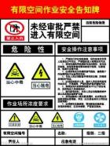
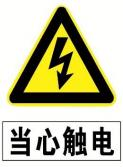
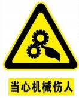

# 应急管理部办公厅关于印发金属冶炼一线岗位安全生产指导手册的通知

时效性：    现行有效

发文机关：  应急管理部办公厅

文号：      应急厅函〔2020〕236号

发文日期：  2020年09月11日

施行日期：  2020年09月11日

效力级别：  部门规范性文件

各省、自治区、直辖市应急管理厅（局）,新疆生产建设兵团应急管理局，有关中央企业：

为贯彻落实《应急管理部人力资源和社会保障部教育部财政部国家煤矿安全监察局关于高危行业领域安全技能提升行动计划的实施意见》（应急〔2019〕107号），加强对高危行业企业一线岗位从业人员的安全指导和服务，应急管理部安全基础司组织有关中央企业，针对金属冶炼高炉炉前岗和高炉煤气净化岗编制了安全生产指导手册（见附件），现予印发，供有关金属冶炼企业选用。

使用中如有问题建议，请及时与应急管理部安全基础司联系（联系人及电话：汪文广、赵德，010-64464067）。

附件1.高危行业一线岗位安全生产指导手册（金属冶炼高炉炉前岗）.pdf

附件2.高危行业一线岗位安全生产指导手册（金属冶炼高炉煤气净化岗）.pdf

# 高危行业一线岗位安全生产指导手册

**金属冶炼高炉炉前岗**

**目**    **录**

[1  安全生产应知应会	 1](#bookmark1)

[1.1 安全生产风险基础知识 	 1](#bookmark2)

[1.2 安全生产有关法律法规要求 	 3](#bookmark3)

[1.2.1  岗位安全生产准入	 3](#bookmark4)

[1.2.2  从业人员安全生产权利	 4](#bookmark5)

[1.2.3  从业人员安全生产义务	 5](#bookmark6)

[1.2.4  法律责任	 5](#bookmark7)

[2  岗位主要安全风险和事故隐患	 6](#bookmark8)

[2.1  岗位主要安全风险 	 6](#bookmark9)

[2.1.1  灼烫	 6](#bookmark10)

[2.1.2  火灾、爆炸	 7](#bookmark11)

[2.1.3  中毒	 7](#bookmark12)

[2.1.4  触电、物体打击与机械伤害	 7](#bookmark13)

[2.2  岗位常见事故隐患 	 8](#bookmark14)

[2.2.1  事故隐患排查	 8](#bookmark15)

[2.2.2  事故隐患示例	 10](#bookmark16)

[2.3 典型事故案例 	 13](#bookmark17)

[2.3.1  某炼铁厂 5 号高炉铁水外流重大事故 	 13](#bookmark18)

[2.3.2  某炼铁厂 3 号高炉渣铁灼烫事故 	 13](#bookmark19)

[3  岗位安全风险控制	 15](#bookmark20)

[3.1  岗位操作流程 	 15](#bookmark21)

[3.1.1  出铁准备	 15](#bookmark22)

[3.1.2  出渣铁	 15](#bookmark23)

[3.1.3  堵铁口、整理	 15](#bookmark24)

[3.2  岗位安全操作要点 	 16](#bookmark25)

[3.2.1  安全操作通则	 16](#bookmark26)

[3.2.2  出铁准备	 16](#bookmark27)

[3.2.3  出铁作业	 17](#bookmark28)

[3.2.4  堵铁口作业	 17](#bookmark29)

[3.2.5  清理作业	 18](#bookmark30)

[3.3  岗位操作风险管控 	 18](#bookmark31)

[4  岗位应急管理	 22](#bookmark32)

[4.1 应急报告 	 22](#bookmark33)

[4.1.1  岗位人员应急报告	 22](#bookmark34)

[4.1.2  企业应急报告	 22](#bookmark35)

[4.2 现场应急处置 	 22](#bookmark36)

[4.2.1  主沟、渣铁沟、摆动溜嘴烧穿应急处置 	 22](#bookmark37)

[4.2.2  摆动流嘴不动作应急处置	 23](#bookmark38)

[4.2.3  炉缸烧穿应急处置	 23](#bookmark39)

[4.2.4  潮铁口应急处置	 23](#bookmark40)

[4.2.5  煤气中毒应急处置	 23](#bookmark41)

[4.2.6  触电应急处置	 24](#bookmark42)

[附录	](#bookmark43)[25](#bookmark44)

[附录 1   作业安全检查确认表	](#bookmark45)[25](#bookmark46)

[附录 2   空气呼吸器的正确佩戴与使用	](#bookmark47)[27](#bookmark48)

[附录 3   有关法律法规和国家、行业标准	](#bookmark49)[28](#bookmark50)

[附录 4   岗位常用安全警示标志	](#bookmark51)[29](#bookmark52)

[附录 5   岗位安全知识和技能练习题	](#bookmark53)[33](#bookmark54)

1  **安全生产应知应会**

1.1  安全生产风险基础知识

钢铁工业是我国国民经济的重要基础产业。经过多年的发展，我国已形成了包括采 矿、冶炼、压延及相应配套专业和辅助生产系统的完整的冶金工业体系。特别是改革开 放以来，冶金工业的建设和发展取得了举世瞩目的成就，为我国经济社会做出了重要贡 献。同时， 技术装备水平取得了重大进展，冶金生产实现了大型化、高速化， 控制手段 实现了精确化、数字化，设备运行的可靠性和安全性极大提高。

冶金生产工艺复杂，危险有害因素众多，生产过程大量使用高温炉窑、压力容器和 管道、起重机械及运输车辆等设备设施，产出大量铁水、钢水、钢坯等高温物质，同时 伴有煤气等有毒有害、易燃易爆气体，极易发生火灾、爆炸、灼烫、中毒、高处坠落、 触电和机械伤害等事故。特别是高温液体喷溅、钢水（铁水）包倾覆、炉体爆炸、煤气 中毒、起重伤害等事故，容易引发群死群伤。

为改善冶金行业的安全生产状况，国家制定颁布了一系列安全生产政策和措施。近 年来，原国家安全生产监督管理总局先后发布了《冶金行业较大危险因素辨识与防范指 导手册》《工贸行业重大生产安全事故隐患判定标准（2017 版）》《冶金企业和有色金属 企业安全生产规定》等规章和指导文件， 强化了对冶金行业的安全生产监督管理。做好 冶金安全生产工作，还需要采取综合安全措施，并应把全面提高从业人员的安全技术素 质作为一项长期的基础性工作来抓。

自高炉炼铁技术发明以来，原始古老的炼铁方法被淘汰，炼铁生产获得巨大发展， 炼铁技术取得不断进步。至今， 世界上绝大多数炼铁厂一直沿用高炉炼铁工艺，虽然作 为现代技术的直接还原、熔融还原等冶炼新工艺也在不断进步，但高炉炼铁技术仍未被 取代。现代高炉炼铁生产系统包括高炉本体、上料设备系统、装料设备系统、送风设备 系统、煤气净化设备系统、渣铁处理系统、喷吹燃料系统等，工艺流程如图 1-1 所示。

1—贮矿槽；2—焦仓；3—料车；4—斜桥；5—高炉本体；6—铁水罐；7—渣罐；8—放散阀；

9—切断阀；10—除尘器；11—洗涤塔；12—文氏管；13—脱水器；14—净煤气总管；

15—热风炉；16—炉基基墩；17—炉基基座；18—烟囱；19—蒸汽透平；20—鼓风机；

21—煤粉收集罐；22—贮煤罐；23—喷吹罐；24—贮油罐；25—过滤器；26—加油泵

图 1-1    高炉炼铁生产工艺流程示意图

目前高炉上料系统有料车上料和皮带上料两种方式。料车上料方式多见于在运行的 老高炉；近年来，随着高炉大型化，料车上料设备已不能满足要求，新建高炉都采用皮 带上料方式。高炉煤气净化系统有湿法除尘和干法除尘两种方式，湿法除尘方式多见于 在运行的老高炉，因其能耗大、不利于环保，近年来新建高炉普遍采用重力除尘+布袋 除尘的干法除尘净化方式。

高炉冶炼过程是一系列复杂的物理化学变化过程的总和，其基本过程是燃料在炉缸 风口前燃烧形成高温还原煤气，煤气不停地向上运动，与不断下降的炉料相互作用，其 温度、数量和化学成分逐渐发生变化，最后从炉顶逸出炉外。炉料在不断下降的过程中， 由于受到高温还原煤气的加热和化学作用，其物理形态和化学成分逐渐发生变化，最后 在炉缸里形成液态渣铁，从渣铁口排出炉外。

高炉炉前操作是在高炉出铁场及风口平台进行的以出铁、出渣为主要内容的一系列 作业，包括出渣、出铁以及维修铁口、撇渣器（砂口）、主沟、渣沟、铁沟、炉前设备、 渣罐、铁罐及更换风口等。 高炉炉前作业的主要任务是完成出渣、出铁以保证高炉的正 常生产。高炉出铁场平面布置如图 1-2 所示。

1—高炉；2—主沟；3—铁沟；4—渣沟；5—摆动流嘴；6—残铁罐；7—残铁罐倾翻台；

8—泥炮；9—开铁口机；10—换钎机；11—铁口前悬臂吊；12—出铁场间悬臂吊；13—摆渡悬臂吊； 14—主跨吊车；15—副跨吊车；16—主沟、摆动流嘴修补场；17—泥炮操作室；18—泥炮液压站；

19—电磁流量计室；20—干渣坑；21—水渣粗粒分离槽；22—鱼雷罐车停放线

图 1-2    高炉出铁场平面布置示意图

高炉炉前操作，直接影响高炉的安全生产。如不能准时出铁，炉缸中积存过多铁水， 可能导致烧坏风口小套；如出铁口维护不善，铁口长期过浅，可能导致出铁跑大流事故。 因此，高炉炉前操作在高炉生产中占有十分重要的地位。同时， 高炉炉前作业中往往存 在高温熔融金属灼烫、煤气中毒等安全风险， 因此掌握高炉炉前作业安全知识与安全技 术是保障作业人员自身安全的重要措施之一。

1.2  安全生产有关法律法规要求

1.2.1  岗位安全生产准入

《安全生产法》第二十五条规定，生产经营单位应当对从业人员进行安全生产教育 和培训，保证从业人员具备必要的安全生产知识，熟悉有关的安全生产规章制度和安全 操作规程，掌握本岗位的安全操作技能，了解事故应急处理措施，知悉自身在安全生产 方面的权利和义务。未经安全生产教育和培训合格的从业人员，不得上岗作业。

【说明】

培训时间：根据《生产经营单位安全培训规定》，金属冶炼等生产经营单位新上岗的从业人员安 全培训时间不得少于 72 学时，每年再培训的时间不得少于 20 学时。

岗位调换培训：根据《生产经营单位安全培训规定》，从业人员在本生产经营单位内调整工作岗 位或离岗一年以上重新上岗时，应当重新接受车间（工段、区、队）和班组级的安全培训。

“四新培训”：根据《安全生产法》第二十六条，生产经营单位采用新工艺、新技术、新材料或者 使用新设备，必须了解、掌握其安全技术特性，采取有效的安全防护措施，并对从业人员进行专门的 安全生产教育和培训。

1.2.2  从业人员安全生产权利

（1）劳动保护权。《安全生产法》第四十九条规定， 劳动合同应当载明有关保障从 业人员劳动安全、防止职业危害的事项，以及依法为从业人员办理工伤保险的事项。

（2）知情权、建议权。《安全生产法》第五十条规定，从业人员有权了解其作业场 所和工作岗位存在的危险因素、防范措施及事故应急措施，有权对本单位的安全生产工 作提出建议。

（3）批评、检举、控告权和依法拒绝权。《安全生产法》第五十一条规定，从业人 员有权对本单位安全生产工作中存在的问题提出批评、检举、控告； 有权拒绝违章指挥 和强令冒险作业。

（4）紧急避险权。《安全生产法》第五十二条规定， 从业人员发现直接危及人身安 全的紧急情况时，有权停止作业或者在采取可能的应急措施后撤离作业场所。

（5）工伤保险和民事索赔权。《安全生产法》第五十三条规定， 因生产安全事故受 到损害的从业人员，除依法享有工伤保险外，依照有关民事法律尚有获得赔偿的权利的， 有权向本单位提出赔偿要求。

【说明】

认定工伤、视为工伤、不得认定为工伤或者视同工伤的情形：分别依据《工伤保险条例》第十四 条至第十六条。

提出工伤认定申请的人、时间及申请地点：《工伤保险条例》第十七条规定，所在单位应当自事 故伤害发生之日或者被诊断、鉴定为职业病之日起 30  日内，向统筹地区社会保险行政部门提出工伤 认定申请。用人单位未提出工伤认定申请的，工伤职工或者其近亲属、工会组织在事故伤害发生之日 或者被诊断、鉴定为职业病之日起 1 年内，可以直接向用人单位所在地统筹地区社会保险行政部门提

出工伤认定申请。

1.2.3  从业人员安全生产义务

（1）遵章守纪，正确佩戴和使用劳动防护用品。《安全生产法》第五十四条规定， 从业人员在作业过程中，应当严格遵守本单位的安全生产规章制度和操作规程，服从管 理，正确佩戴和使用劳动防护用品。

（2）接受安全生产教育和培训。《安全生产法》第五十五条规定， 从业人员应当接 受安全生产教育和培训，掌握本职工作所需的安全生产知识，提高安全生产技能，增强 事故预防和应急处理能力。

（3）报告危险。《安全生产法》第五十六条规定， 从业人员发现事故隐患或者其他 不安全因素，应当立即向现场安全生产管理人员或者本单位负责人报告。

1.2.4  法律责任

《安全生产法》第一百零四条规定，生产经营单位的从业人员不服从管理，违反安 全生产规章制度或者操作规程的，由生产经营单位给予批评教育，依照有关规章制度给 予处分；构成犯罪的，依照刑法有关规定追究刑事责任。

【说明】

构成犯罪，主要是指构成刑法规定的重大责任事故罪，即在生产作业中违反有关安全管理的规 定，导致发生重大伤亡事故或者造成其他严重后果的，处三年以下有期徒刑或者拘役；情节特别恶 劣的，处三年以上七年以下有期徒刑。

2  **岗位主要安全风险和事故隐患**

2.1  岗位主要安全风险

高炉炉前作业过程中，主要存在如下风险：灼烫、火灾、爆炸、中毒、触电、物体 打击、机械伤害等。

2.1.1  灼烫

开铁口、铁水引流、铁口吹扫等作业过程中，铁口飞溅的高温熔融渣铁造成作业人 员灼烫；铁口打潮（如炮泥含水、冷却壁漏水），导致高温熔融渣铁遇水喷溅（爆），造 成作业人员灼烫；开口机液压油路泄漏喷溅，遇火燃烧，造成作业人员灼烫。铁口吹氧 作业过程中，氧气回火导致作业人员灼烫。

出铁过程中，取样时，潮、冷样勺未经预热， 样模潮湿或周围有水导致高温熔融渣 铁遇水喷溅，造成作业人员灼烫；向铁水主沟投入旧铁器化铁时，旧铁器受潮或存在密 闭容器，遇高温熔融渣铁发生喷溅、爆炸，造成作业人员灼烫。

冲排渣作业过程中，瞬间渣量超出正常范围，导致高温水蒸气急剧增多，造成作业 人员灼烫；渣中带铁，导致高温熔融渣铁遇水喷溅（爆），造成作业人员灼烫。

堵铁口作业过程中或拔泥炮时，铁口正对面有人，铁口高温渣铁飞溅造成作业人员 灼烫；泥炮机液压油路泄漏喷溅，遇火燃烧，造成作业人员灼烫。

主沟、渣铁沟清理作业过程中， 作业人员跌入沟内，接触高温渣铁导致灼烫；作业 人员向沟中打水或投入潮物，高温熔融渣铁遇水喷溅造成作业人员灼烫。

从上述风险描述可以看出，可能导致作业人员灼烫的主要原因，一是高温熔融渣铁 因高炉内高压引起喷溅，二是高温熔融渣铁遇水发生喷溅或爆炸。熔融金属温度极高， 液态铁水的温度为 1500℃左右。水接触高温熔融金属后瞬间汽化，体积急剧膨胀，形 成物理爆炸。如水在高温熔融金属表面爆炸， 会导致高温熔融金属喷溅；如水在高温熔 融金属内部爆炸，会导致高温熔融金属喷爆。高温熔融金属喷溅（爆）轻则造成灼烫事 故，重则造成群死群伤事故。

灼烫防控措施：加强现场作业管理。一是铁口相关作业过程中，铁口正对面不应有 人，通氧管路设置防氧气回火装置；二是作业现场不应有非生产性积水，与高温熔融渣 铁接触的设备、设施和工具应保持干燥；三是作业人员在作业过程中应正确穿戴劳动防

护用品，严格按照相关安全规程作业，严禁违章作业。

2.1.2  火灾、爆炸

铁口开口机、泥炮机的液压油路泄漏喷溅，遇火燃烧，导致火灾。

烘烤用煤气未点燃或管路泄漏，泄漏煤气与空气混合达到爆炸条件发生爆炸。

焊接与热切割及烧铁口、主沟、渣铁沟、摆动流嘴清理等使用的氧气管路泄漏，遇 易燃物引发火灾或遇明火发生爆炸。使用带油脂的工器具接触氧气导致油脂自燃进而引 发着火、爆炸。

火灾、爆炸防控措施：更换阻燃液压油，增设防喷溅安全设施；在作业现场可能发 生可燃气体泄漏的区域设置可燃气体检测、报警装置。

2.1.3  中毒

煤气是一种高毒、易燃易爆的气体，烘烤用焦炉煤气无色、有臭味，高炉煤气无色、 无味，不易察觉，若泄漏极易造成作业人员中毒。烘烤作业过程中，烘烤用煤气未点燃或 管路泄漏造成作业人员中毒。铁口附近煤气未点燃，造成铁口附近作业人员中毒。

中毒防范措施：为防止煤气中毒，应在煤气区域设置煤气警示标志，安装固定式煤 气报警器。作业人员应严格执行岗位安全操作规程， 进入煤气区域，必须佩戴便携式煤 气报警器。相关人员应熟练掌握空气呼吸器的使用方法。

2.1.4  触电、物体打击与机械伤害

高炉炉前作业过程中，作业人员将接触开铁口机、堵铁口泥炮、换风口机、炉前吊 车、链式起重机（手拉葫芦或电葫芦）、手钻等大型或手持式的电动、液压、气动设备 设施，操作使用这些设备设施时，可能导致作业人员触电、遭受物体打击或机械伤害。 线路破损或设备接地失效导致作业人员触电；开铁口机、泥炮运转过程中， 有作业人员 在其运转影响范围内，导致作业人员遭受物体打击或机械伤害；风口平台更换吹管或风 口套时，使用大锤、拉钩、链式起重机、换风口机等，导致作业人员遭受物体打击或机 械伤害。

触电防控措施：非专职电气人员不得擅自改动、检维修电气设备及线路， 电气设备 应设置保护接地、漏电保护等安全防护装置； 非岗位人员严禁操作相关设备设施。作业 人员应严格按照安全操作规程作业并熟练掌握触电应急处置技能。

物体打击与机械伤害防控措施：提高设备设施的本质安全水平。加强现场管理，限 定人员活动范围，在危险区域设置警示标识，相关设备设施设置声光报警装置；非岗位 人员严禁操作相关设备设施，作业人员应严格按照安全操作规程作业，在作业前和作业 过程中进行安全确认。

2.2  岗位常见事故隐患

2.2.1  事故隐患排查

事故隐患排查见表 2-1。

表 2-1    事故隐患排查

| 序号 | 事故隐患                                                     | 依据                                                         |
| ---- | ------------------------------------------------------------ | ------------------------------------------------------------ |
| 1    | 作业人员未经安全教育培训合格就上岗作业                       | 《企业安全生产标准化基本规范》（GB/T 33000—2016）[5.3.2.2](5.3.2.2) |
| 2    | 与岗位安全风险相适应的个体防护装备与用 品配备不到位。作业人员未正确佩戴、使用、 维护、保养和检查个体防护装备和用品。 作业人员不遵守安全生产规章制度、操作规 程，违章作业 | 《企业安全生产标准化基本规范》（GB/T 33000—2016）[5.4.2.2](5.4.2.2) |
| 3    | 擅自挪动、拆除设备设施的安全装置和防护 设施或移作他用        | 《炼铁安全规程》（AQ 2002—2018）4.15                         |
| 4    | 作业人员对炉体烧穿、铁水跑漏、煤气中毒 以及火灾、爆炸等重大事故的应急救援预案或 现场处置方案内容不熟悉，岗位无应急器材与 设施，未定期进行演练 | 《企业安全生产标准化基本规范》（GB/T 33000—2016）5.6 《炼铁安全规程》（AQ 2002—2018）4.16 |
| 5    | 现场坑、沟、池、井未设置安全盖板或安全 护栏。钢平台、通道、走梯、走台等未按《固 定式钢梯及平台安全要求》（GB4053—2009） 的规定设防护栏杆 | 《炼铁安全规程》（AQ 2002—2018）6.2                          |
| 6    | 煤气区域未设置醒目的警示标志，未设置固 定式一氧化碳监测报警装置。在煤气区域工作 的作业人员，未携带一氧化碳检测报警仪 | 《炼铁安全规程》（AQ 2002—2018）6.9                          |

| 序号 | 事故隐患                                                     | 依据                                               |
| ---- | ------------------------------------------------------------ | -------------------------------------------------- |
| 7    | 渣、铁沟无供横跨用的活动小桥或盖板。撇 渣器上未设防护罩，渣口正前方未设挡渣墙。 人员跨越主沟。直接跨越渣、铁沟（未从横 跨小桥或沟上设置的盖板上通过） | 《炼铁安全规程》（AQ 2002—2018）10.3               |
| 8    | 出铁场平台未经常清除铁瘤和清扫灰尘                           | 《炼铁安全规程》（AQ 2002—2018）10.4               |
| 9    | 人工方式运输炉前辅助材料及铁块                               | 《炼铁安全规程》（AQ 2002—2018）10.5               |
| 10   | 泥炮和开口机操作室不能清楚地观察到泥炮 和开口机的工作情况和铁口的状况。操作室安 全撤离通道不合理或不畅通 | 《炼铁安全规程》（AQ 2002—2018）10.7               |
| 11   | 泥炮无量泥标记和声光信号，炮头不完整，非 专人操作。作业人员清理泥炮炮头时，未侧身站 位。泥炮装泥或推进活塞时，作业人员将手放入 装泥口。启动泥炮时其活动半径内有人。泥炮液 压设备及管路漏油，无防高温烘烤的措施 | 《炼铁安全规程》（AQ 2002 —2018 ） 11.1.3 ，11.1.4 |
| 12   | 泥炮装泥时，往泥膛内打水，使用冻泥、稀 泥和有杂物的炮泥      | 《炼铁安全规程》（AQ 2002—2018）11.1.5             |
| 13   | 潮铁口出铁。处理铁口及出铁时，铁口正对 面站人，炉前起重机在铁口附近。出铁、出渣 时，清扫渣铁罐轨道或在渣铁罐上工作 | 《炼铁安全规程》（AQ 2002—2018）11.1.6             |
| 14   | 开口机非专人操作。开口机移动时无声光报 警，移动回转半径内有人。更换开口机钻头或 钻杆时，未切断动力源 | 《炼铁安全规程》（AQ 2002 —2018 ） 11.1.7 ，11.1.9 |
| 15   | 通氧气用的耐高压胶管未脱脂。炉前使用的 氧气胶管长度小于 30m ，10m 内有接头。吹氧 钢管长度小于 6m。氧气胶管与钢管未严密、牢 固连接。 氧气瓶放置地点正对渣口、铁口或靠近明火。 氧气瓶表面有油污，瓶帽、防震胶圈和安全阀 缺损或缺失 | 《炼铁安全规程》（AQ 2002 —2018 ） 11.1.10         |
| 16   | 炉前工具接触铁水之前未进行烘干预热                           | 《炼铁安全规程》（AQ 2002 —2018 ） 11.1.11         |

| 序号 | 事故隐患                                                     | 依据                                                        |
| ---- | ------------------------------------------------------------ | ----------------------------------------------------------- |
| 17   | 渣、铁沟未定期铺垫，未定期点检、维护， 出现裂缝或严重侵蚀。 用煤气烘烤渣、铁沟时无明火伴烧，未采取 防止煤气中毒的措施 | 《炼铁安全规程》（AQ 2002 —2018 ） 11.1.12                  |
| 18   | 处理铁口、渣口前，未将煤气点火燃烧                           | 《炼铁安全规程》（AQ 2002 —2018 ） 11.1.14                  |
| 19   | 摆动流嘴机械传动部分、极限、工作层异常。 未及时处理铁沟流嘴底部与摆动流嘴之间的 铁瘤，铁水流经通道不畅。 在停电情况下手动操作摆动流嘴作业，未先 断开操作电源 | 《炼铁安全规程》（AQ 2002 —2018 ） 11.2.1 ，11.2.2 ，11.2.8 |
| 20   | 铁水罐未烘干。渣罐未喷灰浆或用干渣垫底。 渣罐内有积水、潮湿杂物和易燃易爆物 | 《炼铁安全规程》（AQ 2002 —2018 ） 11.3.1 ，11.3.3          |
| 21   | 向铁水运输线路上乱丢杂物，未及时清除挂 在墙、柱和线路上的残渣 | 《炼铁安全规程》（AQ 2002—2018）11.3.6                      |
| 22   | 水渣池周围无栏杆或栏杆缺损，内壁无扶梯 或扶梯缺损            | 《炼铁安全规程》（AQ 2002—2018）11.4.2                      |
| 23   | 水冲渣启动水泵前未确认水冲渣沟内无人。 水冲渣时，粒化器附近有人 | 《炼铁安全规程》（AQ 2002 —2018 ） 11.4.6 ，11.4.7          |
| 24   | 翻渣罐时，罐车未先采取止轮措施，人员未 远离罐车，未进行远距离翻罐操作 | 《炼铁安全规程》（AQ 2002—2018）11.6.1                      |

2.2.2  事故隐患示例

（1）渣、铁沟无供横跨用的活动小桥或盖板，如图 2-1 所示。

图 2-1    渣、铁沟无横跨用的活动小桥或盖板

（2）撇渣器上未设防护罩，渣口正前方未设挡渣墙，如图 2-2 所示。

图 2-2    撇渣器上未设防护罩，渣口正前方未设挡渣墙

（3）泥炮无声光信号或声光信号故障，如图 2-3 所示。

图 2-3    泥炮声光信号故障

（4）炮头不完整，如图 2-4 所示。

图 2-4    炮头损坏

（5）泥炮装泥或推进活塞时，作业人员将手放入装泥口，如图2-5 所示。

图 2-5    作业人员将手放入装泥口

（6）作业人员清理泥炮炮头时，未侧身站位，未正确佩戴劳动防护用品，如图 2-6 所示。

图 2-6    作业人员未侧身站位，未正确佩戴防护用品

（7）作业人员直接跨越渣、铁沟（未从横跨小桥或沟上设置的盖板上通过），如图 2-7 所示。

图 2-7    作业人员直接跨越渣、铁沟

2.3  典型事故案例

2.3.1  某炼铁厂 5 号高炉铁水外流重大事故

**1.事故经过**

2011 年 10 月 5  日 11 时 45 分左右，某炼铁厂 5 号高炉在停炉放残铁过程中，因作 业人员开残铁口操作不当，加之安全管理存在缺陷，导致在复风过程中残铁口碳砖瞬时 塌落，炉内高温铁水大量涌出，造成 12 人死亡、1 人重伤。

**2.事故原因**

1）直接原因

作业人员在预休风阶段就将炉皮开口处的冷却壁取下，使碳砖长时间处于失去冷却  壁支撑保护的状态；同时作业人员用水冷却取下的冷却壁和扑灭碳素填充料上的明火时， 将水喷到残铁口处高温发红状态的碳砖，致碳砖温度骤降、体积收缩， 使得原本紧密砌  筑的碳砖之间产生松动和裂缝，降低了碳砖承受高炉内部压力的能力。进行复风降料线  作业过程中，随着热风压力加大，原承压能力已处于临界状态的碳砖无法继续承受高炉  内部铁水产生的静压以及复风的热风压力而瞬时塌落，炉内高温铁水大量涌出。

2）间接原因

该厂对停炉、放残铁工作中存在的安全问题研究不深、预判不足， 指挥人员违规指 挥，操作人员违章作业，安全管理不到位。

**3.防范措施**

（1）应加强安全管理，严格落实风险评估、隐患排查、作业管理和反“三违 ”等 各项安全管理工作。

（2）应加强安全教育培训，提高企业主要负责人、安全生产管理人员、一线岗位 人员的安全生产责任意识、安全生产管理能力和安全生产专业技术水平。

2.3.2  某炼铁厂 3 号高炉渣铁灼烫事故

**1.事故经过**

2019 年 7 月 9  日 8 时 30 分，某炼铁厂 3 号高炉出铁过程中，泥炮操作人员在未得 到当班小班长指令的情况下，转动开口机转臂，导致开口机突然横向移动，开口机的转 臂撞倒准备去清理泥炮炮嘴的炉前作业人员王某，导致王某坠入大沟内，高温灼烫死亡。

**2.事故原因**

1）直接原因

作业人员违章作业是事故的直接原因。泥炮操作人员在未得到指挥人员（当班小班 长）指令的情况下擅自操作开口机；炉前作业人员王某在开口机运行和泥炮声光报警未 解除时进入开口机运行影响范围内。

2）间接原因

现场安全管理不到位，风险管控不到位，作业制度不完善，安全教育培训不到位。

**3.防范措施**

（1）在落实风险管控的基础上完善作业制度，加强现场安全管理。

（2）加强岗位安全教育培训，提高作业人员安全生产责任意识和反“三违 ”意识。

3  **岗位安全风险控制**

3.1  岗位操作流程

3.1.1  出铁准备

出铁准备操作流程如图 3-1 所示。

图 3-1    出铁准备操作流程

3.1.2  出渣铁

出渣铁操作流程如图 3-2 所示。

图 3-2    出渣铁操作流程

3.1.3  堵铁口、整理

堵铁口、整理操作流程如图 3-3 所示。

图 3-3    堵铁口、整理操作流程

3.2  岗位安全操作要点

3.2.1  安全操作通则

（1）作业人员应正确穿戴劳动防护用品、佩戴一氧化碳检测报警仪后方可上岗作业。

（2）处理铁口及出铁时，铁口正对面不应站人。

（3）禁止跨越主沟；人员不应跨越渣铁沟，必要时应从横跨小桥或渣铁沟上设置 的盖板上通过。

（4）出铁场平台应经常清除铁瘤和清扫灰尘，禁止使用氧气进行清扫作业。

（5）安全装置和防护措施不得擅自挪用、拆除或移作他用。

（6）发现异常或事故先兆，应立即停止作业或采取现场应急处置措施并向当班负 责人报告。

3.2.2  出铁准备

（1）开口机、泥炮应专人操作，未经授权人员禁止操作。

（2）按照点检标准对开口机、泥炮等相关设备进行点检；开闭动力源前应进行安 全确认，确认周围环境符合、具备作业条件时，方可进行作业。开口机、泥炮检查确认：

①油压、油温是否在正常范围，管路有无泄漏。

②水压是否在正常范围，管路有无泄漏。

③风压是否在正常范围，管路有无泄漏。

④电压、电流是否在正常范围。

⑤各操作按钮、开关试运转动作是否正常， 仪表显示是否正常，急停装置动作是否 正常。

⑥各机械结构是否正常，有无松脱、位移、变形、缺损、异响等现象。

（3）摆动流嘴试运转，检查确认倾动方向切换是否正常、限位是否正常。

（4）主沟、渣铁沟、摆动流嘴检查确认：

①主沟和渣铁沟接头有无龟裂。

②主沟沟壁有无龟裂。

③渣铁沟的龟裂、侵蚀、沟嘴是否正常。

④摆动流嘴的龟裂、侵蚀、沟嘴是否正常，摆动流嘴边附着的渣铁是否妨碍流嘴摆动。

⑤主沟内保温剂处渣铁是否凝固。

（5）出铁口周围检查确认：

①铁口处和主沟接头处有无龟裂。

②铁口周围有无漏水，是否有水向主沟流入。

③铁口泥套是否完好。

④主沟内有无大渣块。

3.2.3  出铁作业

（1）出渣铁时保证主沟、渣铁沟畅通。

（2）开铁口时确认开口机旋转半径内无人员停留，运行前打开声光报警。作业人 员不应站在铁口正对面，站位应与铁口保持安全角度。

（3）钻铁口过程中，不应接触旋转的钻头、钻杆和夹具；更换开口机钻头或钻杆 时，应切断动力源。

（4）使用氧气时应确切地进行信号应答，必须缓慢打开氧气阀门，不应使用带有 油污的工具、手套等接触氧气阀门等氧气设备设施。

（5）不应将未加热的金属投入沟内。

（6）出铁监视中应注意飞溅的铁水，应佩戴好防护面罩等个人劳动防护用品。

（7）取铁样时应充分预热样勺，应佩戴好防护面罩等个人劳动防护用品。

（8）推沙坝、向撇渣器投保温剂时应注意火焰，应佩戴好防护面罩等个人劳动防 护用品。

（9）不得将大块渣块和沟料清入主沟内。

（10）应确保撇渣器沙坝高度符合规定要求，防止下渣过铁。出铁时液渣不得高出 铁口泥套下沿，确保铁口框架、保护板不直接与渣铁接触。

3.2.4  堵铁口作业

（1）堵铁口前应确认铁口正对面无人员行走或逗留，泥炮运转时活动半径范围内 不应有人。

（2）堵铁口时应提前进行铁口两边的清理工作，吹扫铁口，清除出铁口周围黏着 的渣铁块（难以清除时，使用氧气烧除）， 同时注意渣铁喷出。如有妨碍转炮、压炮的 障碍物应清除。

（3）堵铁口时作业人员不应站在铁口正对面，站位应与铁口保持安全角度。拔炮

时，应确认泥炮影响范围内无人员作业。不应立即走近刚堵上的铁口。

3.2.5  清理作业

（1）清理泥炮炮头前应确认活塞已退至装泥位，打开投泥口盖，排出气体后再进 行炮头清理作业。

（2）清理炮头应侧身站立。

（3）泥炮装泥或推进活塞时，不得将手放入装泥口。

（4）清理出铁口前端时，严禁进入沟内。

（5）煤气烘烤渣铁沟时，应有明火伴烧，煤气报警器、防煤气熄火切断装置应工 作正常，防止煤气中毒。

（6）烧摆动流嘴铁瘤时，摆动流嘴下应有受铁罐，避免铁水外溢落地。

（7）通氧气用的耐高压胶管应脱脂。炉前使用的氧气胶管，长度不应小于 30m， 10m 内不应有接头。吹氧钢管长度不应小于 6m。氧气胶管与钢管连接应严密、牢固。 氧气瓶放置地点应远离明火，且不得正对渣口、铁口，严防油脂污染。

3.3  岗位操作风险管控

高炉炉前岗操作风险管控见表 3-1。

表 3-1    高炉炉前岗操作风险管控

| 岗位操作                                        | 安全风险                        | 可能造成的事故                                               | 控制措施                                                     |
| ----------------------------------------------- | ------------------------------- | ------------------------------------------------------------ | ------------------------------------------------------------ |
| 岗前准备                                        | 作业人员未正确穿戴劳动防 护用品 | 物体打击 机械伤害 灼烫                                       | 实行值班工长负责制，进行岗前确 认，作业人员正确穿戴劳动防护用品 后方可上岗作业 |
| 作业人员身心状态不具备上 岗条件（饮酒、疾病等） | 物体打击 机械伤害 灼烫 高处坠落 | 实行值班工长负责制，岗前观察、 询问、确认作业人员状态，状态不佳 人员禁止上岗作业 |                                                              |
| 未进行设备巡检，设备带病 运行                   | 物体打击 机械伤害 灼烫 火灾     | 按照“五定”（定检查部位、定检 查方法、定检查标准、定检查人员、 定检查周期）原则进行设备巡检 |                                                              |

| 岗位操作                                        | 安全风险                            | 可能造成的事故                                               | 控制措施                   |
| ----------------------------------------------- | ----------------------------------- | ------------------------------------------------------------ | -------------------------- |
| 出渣铁                                          | 渣、铁沟无供横跨用的活动 小桥或盖板 | 灼烫                                                         | 班前巡检，如有缺失立即整改 |
| 现场人员跨越主沟，直接跨 越渣、铁沟             | 灼烫                                | 岗前安全教育培训，加强现场作业 管理                          |                            |
| 铁口潮湿                                        | 爆炸 灼烫                           | 烤干铁口再出铁                                               |                            |
| 处理铁口及出铁时炉前起重 机靠近铁口             | 灼烫                                | 安全管理制度中明确规定出铁时 炉前起重机应远离铁口，并加强现场 作业管理 |                            |
| 处理铁口及出铁时，铁口正 对面站人               | 灼烫                                | 安全管理制度中明确规定处理铁 口及出铁时，铁口正对面不应站人， 并加强现场作业管理 |                            |
| 出铁、出渣时，清扫渣铁罐 轨道或在渣铁罐上工作   | 灼烫 高处坠落                       | 安全管理制度中明确规定出铁、出 渣时，不应清扫渣铁罐轨道或在渣铁 罐上工作，并强现场作业管理 |                            |
| 开口机非专人操作                                | 物体打击 机械伤害                   | 安全管理制度中明确规定专人操 作开口机                        |                            |
| 更换开口机钻头或钻杆时， 未切断动力源           | 物体打击 机械伤害                   | 更换开口机钻头或钻杆前进行安 全确认                          |                            |
| 开口机移动前，无声光报警， 移动时回转半径内有人 | 机械伤害                            | 严格按照操作规程操作设备，移动 设备前开启声光报警，进行安全确 认，并加强作业现场管理 |                            |
| 泥炮非专人操作                                  | 物体打击 机械伤害                   | 泥炮操作实行操作牌制度                                       |                            |
| 泥炮炮头不完整，堵铁口前 未烤热                 | 灼烫                                | 严格按照规程及时更换不完整的 炮头，堵铁口前将炮头烤热，并加强 现场作业管理 |                            |
| 清理炮头时未侧身站位                            | 物体打击 灼烫                       | 岗前安全教育培训，严格按照规程 作业，并加强现场作业管理      |                            |
| 泥炮装泥或推进活塞时，将 手放入装泥口           | 机械伤害                            | 岗前安全教育培训，严格按照规程 作业，并加强现场作业管理      |                            |

| 岗位操作                                                     | 安全风险                        | 可能造成的事故                                               | 控制措施                                                     |
| ------------------------------------------------------------ | ------------------------------- | ------------------------------------------------------------ | ------------------------------------------------------------ |
|                                                              | 启动泥炮时其活动半径范围 内有人 | 机械伤害                                                     | 严格按照操作规程操作设备，移动 设备前进行安全确认，并加强作业现 场管理 |
| 泥炮液压设备及管路漏油， 无防高温烘烤的措施                  | 火灾 灼烫                       | 按“五定”（定检查部位、定检查 方法、定检查标准、定检查人员、定 检查周期）原则进行点巡检，发现隐 患立即整改 |                                                              |
| 装泥时往泥膛内打水，使用 冻泥、稀泥和有杂物的炮泥            | 爆炸 灼烫                       | 严格按照操作规程作业，使用炮泥 前应进行检查确认              |                                                              |
| 炉前工具接触铁水之前，未 烘干预热                            | 爆炸 灼烫                       | 严格按照操作规程作业，作业前进 行安全确认                    |                                                              |
| 撇渣器沙坝高度不符合规定 要求，下渣过铁                      | 爆炸 灼烫                       | 严格按照工艺规定要求筑沙坝                                   |                                                              |
| 用煤气烘烤渣、铁沟时未采 用明火伴烧，铁口、渣口处理 时未点燃煤气，未采取防煤气 中毒的措施 | 中毒                            | 严格按照操作规程，在烘烤前对明 火伴烧进行确认，现场安装固定式煤 气报警器，作业人员佩戴便携式煤气 报警器 |                                                              |
| 使用的铁水罐未烘干                                           | 爆炸                            | 铁水罐使用前应烘干                                           |                                                              |
| 摆动流嘴 操作                                                | 驱动设备部件带病运转，极 限失效 | 爆炸 灼烫                                                    | 接班时认真检查：操作开关是否灵 活，摆动机械传动部分有无异响，电 机、减速机有无异响，极限是否可靠。 发现异常应及时处理 |
| 摆动流嘴工作层缺损、有空 洞                                  | 爆炸 灼烫                       | 接班时认真检查摆动流嘴工作层， 发现异常应及时处理            |                                                              |
| 铁沟流嘴底部与摆动流嘴之 间有铁瘤，撇渣器、铁沟流嘴、 摆动流嘴不畅通，摆动流嘴摆 动不正常 | 爆炸 灼烫                       | 严格按照安全规程，出铁前 30min 认真检查摆动流嘴的运行情况，及时 处理铁沟流嘴底部与摆动流嘴之间 的铁瘤，保证摆动流嘴摆动正常以及 撇渣器、铁沟流嘴、摆动流嘴畅通 |                                                              |
| 出铁前未确认铁罐对位情 况、配备方式和配罐数量                | 爆炸 灼烫                       | 严格按照安全规程，出铁前 10min 确认铁罐对位情况、配备方式和配罐 数量 |                                                              |

| 岗位操作                                                     | 安全风险                                                     | 可能造成的事故                                               | 控制措施                                            |
| ------------------------------------------------------------ | ------------------------------------------------------------ | ------------------------------------------------------------ | --------------------------------------------------- |
| 渣处理                                                       | 渣罐使用前，未喷灰浆或未 用干渣垫底。渣罐内有积水、 潮湿杂物和易燃易爆物 | 爆炸 灼烫                                                    | 严格按照安全规程，发现渣罐异常 应禁止使用并及时处理 |
| 水渣沟架空部分无带栏杆的 走台；水渣池周围无栏杆，内 壁无扶梯。栏杆和扶梯缺损、 不牢固或不符合相关标准要求 | 高处坠落 灼烫 淹溺                                           | 开展隐患排查，发现隐患立即整 改。加强设备设施管理，定期维护检 修 |                                                     |
| 启动水泵前未确认水冲渣沟 内是否有人                          | 淹溺                                                         | 严格按照安全规程，作业前进行安 全确认                        |                                                     |
| 水冲渣时，粒化器附近有人                                     | 物体打击 机械伤害                                            | 加强现场管理，作业前进行安全确 认                            |                                                     |
| 翻罐时，罐车未采取止轮措 施，未进行远距离操作，人员 未远离罐车 | 物体打击 机械伤害                                            | 严格按照安全规程作业，罐车应先 采取止轮措施，再远距离操作翻罐； 翻罐时，人员应远离罐车 |                                                     |
| 使用氧气                                                     | 通氧气用的耐高压胶管未脱 脂                                  | 火灾 爆炸                                                    | 加强设备管理，使用胶管前进行脱 脂确认               |
| 炉前使用的氧气胶管长度小 于 30m ，10m 内有接头               | 火灾 爆炸                                                    | 加强设备管理，使用胶管前进行长 度和接头确认                  |                                                     |
| 氧气瓶放置地点靠近明火或 正对渣口、铁口                      | 火灾 爆炸                                                    | 现场实行定置管理，确定氧气瓶放 置位置远离热源                |                                                     |
| 氧气瓶的瓶帽、防震胶圈和 安全阀缺失、缺损，瓶体被油 脂污染   | 火灾 爆炸                                                    | 加强氧气瓶管理，明确采购、验收、 存放、使用的具体要求        |                                                     |

4  **岗位应急管理**

4.1  应急报告

4.1.1  岗位人员应急报告

**1.应急反应**

迅速切断伤害源→判断事故情况→做好自身防护→ 脱离险境→施救自救→ 发出求 救信号（报告）。

**2.报告流程**

岗位人员应急报告流程如图 4-1 所示。

图 4-1    岗位人员应急报告流程

**3.报告内容**

（1）报告人姓名、部门。

（2）突发情况或事故发生的时间、地点。

（3）事故简要经过、人员伤亡情况。

（4）已采取的措施。

事故报告人向单位报告事故情况后，按指令撤离或实施现场应急处置。

4.1.2  企业应急报告

（1）单位负责人接到报告后，应当于 1h 内向所在地县级以上人民政府应急管理部 门报告。

（2）情况紧急时，事故现场有关人员可以直接向所在地县级以上人民政府应急管 理部门报告。

4.2  现场应急处置

4.2.1  主沟、渣铁沟、摆动溜嘴烧穿应急处置

（1）立即向值班工长报告。

（2）按企业应急预案做好已漏渣铁的防喷溅、防爆炸、防灼烫应急处置措施。

（3）做好堵铁口准备，按值班工长指令紧急堵铁口。

（4）做出铁准备，确认其他出铁口受铁罐车已对位，各项出铁条件具备。

（5）出铁准备工作就绪后，按值班工长指令打开铁口出铁。

4.2.2  摆动流嘴不动作应急处置

（1）立即向值班工长报告。

（2）确认受铁罐中受铁量及液面高度，如预测极限受铁时间内不足以处理故障恢 复正常工作状态，立即紧急堵口。

4.2.3  炉缸烧穿应急处置

（1）炉前作业人员发现炉缸烧穿、铁口冷却壁烧穿，应立即向值班工长报告。

（2）立即向出铁平台作业人员发出撤离警报，按逃生路线紧急撤离至安全地带，清 点人数。

4.2.4  潮铁口应急处置

（1）发现铁口有潮时，应立即停止向前钻动。

（2）退出钻杆。

（3）烘烤铁口，烤干后再出铁。

（4）如铁口连续有潮，应暂停作业，立即向值班工长报告，尽快查明原因，并采 取措施。

4.2.5  煤气中毒应急处置

（1）施救人员在佩戴空气呼吸器的前提下将中毒者迅速救出至煤气危险区域上风 侧空气新鲜处，解除一切阻碍呼吸的衣物并注意保暖。严禁盲目施救。

（2）中毒轻微者，如出现头痛、恶心、呕吐等症状，可直接送往附近急救、医疗机构。

（3）中毒较重者，如出现失去知觉， 口吐白沫等症状，应立即通知煤气防护员 或拨打急救电话，并实施现场急救。如中毒者已停止呼吸，立即对中毒者进行心肺 复苏。

（4）中毒者未恢复知觉，专业救援人员未赶到现场前，施救人员不应停止施救。

4.2.6  触电应急处置

（1）立即切断电源。

（2）采用绝缘劳动防护用品或绝缘物体使触电者脱离带电体。

（3）将触电者移至安全、通风处。

（4）向相关负责人报告事故情况。

（5）如触电者停止心跳、呼吸，立即对触电者进行心肺复苏。

（6）触电者未恢复知觉，专业救援人员未赶到现场前，施救人员不应停止施救。

**附**    **录**

附录 1    作业安全检查确认表

| 序号 | 检查内容                                                     | 检查确认方法或工具   |
| ---- | ------------------------------------------------------------ | -------------------- |
| 一   | 个人防护                                                     |                      |
| 1    | 个人劳动防护用品是否穿戴齐备、正确                           | 对照配备标准逐项检查 |
| 2    | 便携式煤气报警器是否开机，是否工作正常                       | 设备开机自检         |
| 二   | 开口机                                                       |                      |
| 3    | 液压系统压力是否正常，是否漏油                               | 外表观测             |
| 4    | 抱闸是否熔损，抱闸系统液压管道是否漏油                       | 外表观测             |
| 5    | 中心钩座是否变形、松动，螺栓是否紧固                         | 外表观测             |
| 6    | 前小挡板、前大挡板熔损是否过大，变形量是否过大               | 外表观测，现场测量   |
| 7    | 排链是否过松，是否存在压板掉落、断裂                         | 外表观测             |
| 8    | 管道是否漏水、漏气                                           | 外表观测             |
| 9    | 开口机是否挂上固定钩，旋转机构、给进机构、锤击机构是否 工作正常 | 开口机试运转         |
| 三   | 泥炮                                                         |                      |
| 10   | 液压系统压力是否正常，是否漏油                               | 外表观测             |
| 11   | 推泥活塞运行机构是否正常，泥炮运行机构是否正常               | 泥炮试运转           |
| 四   | 悬臂吊                                                       |                      |
| 12   | 旋转机构是否正常，上卷、下卷机构是否正常                     | 悬臂吊试运转         |
| 13   | 钩头是否完好，钢丝绳是否符合使用标准                         | 外表观测             |
| 五   | 摆动流嘴                                                     |                      |
| 14   | 液压系统压力是否正常，是否漏油                               | 外表观测             |
| 15   | 倾动是否正常，极限位动作是否正常                             | 摆动流嘴试运转       |
| 16   | 摆动流嘴工作面是否正常，铁沟沟嘴与摆动流嘴的间隙是否正 常、是否有铁瘤妨碍摆动 | 外表观测             |
| 六   | 沟盖                                                         |                      |
| 17   | 沟盖是否在指定位置、是否落稳，有无烧红、烧损；盖与盖之 间有无间隙 | 现场观测             |
| 七   | 主沟、铁沟、渣沟                                             |                      |
| 18   | 主沟和铁沟以及渣沟的接头处有无龟裂                           | 现场观测             |

| 序号 | 检查内容                                   | 检查确认方法或工具 |
| ---- | ------------------------------------------ | ------------------ |
| 19   | 主沟、铁沟、渣沟的龟裂、侵蚀、沟嘴是否正常 | 现场观测           |
| 八   | 出铁口                                     |                    |
| 20   | 铁口周围有无漏水，是否有水流入主沟         | 现场观测           |
| 21   | 铁口泥套有无异常                           | 现场观测           |
| 22   | 开口机固定钩座有无变形，钩座孔内有无残渣铁 | 现场观测           |
| 23   | 炮柱、机座上及旋转臂下有无超高残余渣铁     | 现场观测           |
| 24   | 主沟内有无大渣块                           | 现场观测           |
| 25   | 铁口区域煤气是否点燃                       | 现场观测、检测     |
| 九   | 出铁前联络                                 |                    |
| 26   | 中控、渣处理联络                           | 对讲联络           |
| 27   | 渣处理系统是否正常工作确认                 | 对讲联络，仪表观测 |
| 28   | 配罐是否到位确认                           | 对将联络，现场观测 |

附录 2    空气呼吸器的正确佩戴与使用

**1.空气呼吸器使用前检查**

空气呼吸器应定期检查，佩戴使用前应先对呼吸器进行检查确认，同时要掌握空气 呼吸器使用的注意事项，避免误操作导致意外的发生。

（1）检查压力表是否回零。

（2）检查气瓶压力：开启瓶阀，如压力低于规定的最低压力值则禁止使用。

（3）检查报警哨：按空气呼吸器操作说明检查低压报警哨能否正常鸣响，如不能 正常鸣响则禁止使用。

**2.空气呼吸器佩戴步骤**

空气呼吸器佩戴步骤：一看压力，二听哨，三背气瓶，四戴罩。瓶阀朝下底朝上， 面罩松紧要正好。开总阀、插气管，呼吸顺畅抢分秒。

1）调整背架

佩戴时，双手抓住空气呼吸器背托将呼吸器举过头顶，双手松开背托并快速上举， 使背托落在人体背部（气瓶开关位于下方），双手扣住身体两侧肩带 D 型环，身体前倾， 向后下方拉紧，直到肩带及背架与身体充分贴合，扣紧腰带并拉紧。

2）佩戴面罩

将面罩长系带带好，一只手托住面罩将其与脸部完全贴合，另一只手将头带后拉罩 住头部，收紧头带，在保证面罩气密性的同时应感觉舒适且无明显的压迫感。

注意：必须正确佩戴面罩，确保气密性。蓄须、戴眼镜及面部有明显疤痕等导致无 法保证面罩气密性的作业人员不得使用空气呼吸器。

检查面罩气密性的方法：用手掌盖住供气阀快速接头并吸气，如果感到无法呼吸则 表明面罩气密性良好。

3）连接供需阀

将气瓶阀开到底，报警哨应有一次短暂的发声。同时观察呼吸器压力表，检查充气 压力，压力正常即可将供需阀接口与面罩连接，投入正常使用。

4）脱卸空气呼吸器

使用过程中应时刻关注空气呼吸器压力表变化，当报警哨开始鸣叫必须马上撤离至 安全区域，否则将有生命危险。

到达指定安全区域后，拨开快速接头，关闭气瓶开关，摘下面罩，先松腰带、再松 肩带，将空气呼吸器从身上卸下，排空管路内的空气，压力表指针回零。

附录 3    有关法律法规和国家、行业标准

**1.法律、法规和部门规章**

（1）《中华人民共和国安全生产法》

（2）《中华人民共和国职业病防治法》

（3）《中华人民共和国劳动合同法》

（4）《中华人民共和国消防法》

（5）《中华人民共和国突发事件应对法》

（6）《中华人民共和国特种设备安全法》

（7）《生产安全事故应急条例》

（8）《生产安全事故应急预案管理办法》

（9）《生产经营单位安全培训规定》

（10）《冶金企业和有色金属企业安全生产规定》

**2.规范性文件**

（1）《工贸行业重大生产安全事故隐患判定标准（2017 版）》

（2）《金属冶炼企业禁止使用的设备和工艺目录（第一批）》

**3.国家、行业标准**

（1）《企业安全生产标准化基本规范》（GB/T 33000—2016）

（2）《安全色》（GB 2893—2008）

（3）《安全标志及其使用导则》（GB2894—2008）

（4）《企业职工伤亡事故分类》（GB 6441—1986）

（5）《工业企业煤气安全规程》（GB 6222—2005）

（6）《固定式钢梯及平台安全要求》（GB4053—2009）

（7）《个体防护装备选用规范》（GB/T 11651—2008）

（8）《炼铁安全规程》（AQ 2002—2018）

附录 4    岗位常用安全警示标志

| 编号 | 图形                          | 名称               | 设置范围和地点 |
| ---- | ----------------------------- | ------------------ | -------------- |
| 1    |  | 非相关人员禁止入内 | 作业场所入口处 |
| 2    |  | 禁止跨越           | 主沟区域       |
| 3    |  | 禁止烟火           | 氧气瓶存储区域 |
| 4    |  | 警告：注意安全     | 作业场所入口处 |
| 5    |  | 警告：当心烫伤     | 作业场所入口处 |

| 编号 | 图形                          | 名称               | 设置范围和地点             |
| ---- | ----------------------------- | ------------------ | -------------------------- |
| 6    |  | 警告：当心煤气中毒 | 作业场所入口处             |
| 7    |  | 警告：危险区域     | 作业场所入口处             |
| 8    |  | 警告：当心触电     | 电气设备附近               |
| 9    |  | 警告：当心滑跌     | 主沟区域                   |
| 10   |  | 警告：当心机械伤人 | 开口机、泥炮等运行设备附近 |

| 编号 | 图形                          | 名称                 | 设置范围和地点 |
| ---- | ----------------------------- | -------------------- | -------------- |
| 11   |  | 提示：必须穿工作服   | 作业场所入口处 |
| 12   |  | 提示：必须戴安全帽   | 作业场所入口处 |
| 13   |  | 提示：必须穿防护鞋   | 作业场所入口处 |
| 14   |  | 提示：必须戴防护手套 | 作业场所入口处 |
| 15   |  | 提示：必须戴防尘口罩 | 作业场所入口处 |

| 编号 | 图形 | 名称                          | 设置范围和地点       |
| ---- | ---- | ----------------------------- | -------------------- |
| 16   |      |  | 提示：必须戴防护面罩 |

附录 5    岗位安全知识和技能练习题

一、单选题

1.《安全生产法》规定，未经（  ）合格的从业人员，不得上岗作业。

A.基础知识教育    B.安全生产教育和培训    C.技术培训    D.理论培训

2.从业人员有权对本单位安全生产工作中存在的问题提出批评、（  ）、控告； 有权 拒绝违章指挥和强令冒险作业。

A.起诉            B.检举                  C.仲裁        D.罢工

3.因生产安全事故受到损害的从业人员，除依法享有（  ）外，依照有关民事法律 尚有获得赔偿权利的，有权向本单位提出赔偿要求。

A.工伤社会保险    B.医疗保险              C.失业保险    D.养老保险

4.依据《工伤保险条例》的规定， 职工发生事故伤害或者按照《职业病防治法》规 定被诊断、鉴定为职业病的，所在单位应当自事故伤害发生之日或者被诊断、鉴定为职 业病之日起（  ）日内，向统筹地区社会保险行政部门提出工伤认定申请。

A.10            B.15            C.30            D.60

5.《安全生产法》规定，企业未按有关规定对职工进行安全教育、培训并取得特种作 业人员操作资格证书而安排上岗作业的，责令限期改正，可以处（ ）万元以下的罚款。

A.5              B.2.5          C.2              D.1

6.根据《劳动合同法》，下列关于解除劳动合同的说法中，正确的是（  ）。

A.用人单位未按照劳动合同约定提供劳动保护或劳动条件的，劳动者提前 3 日以书 面形式通知用人单位，可以解除劳动合同

B.用人单位的规章制度违反法律、法规的规定，损害劳动者权益的，劳动者在试用 期内提前 30 日通知用人单位，可以解除劳动合同

C.用人单位以暴力、威胁手段强迫劳动者劳动的， 或者用人单位违章指挥，强令冒 险作业危及劳动者人身安全的，劳动者可以立即解除劳动合同，不必事先告知用人单位

D.劳动者非因工负伤，在规定的医疗期满后不能从事原工作，也不能从事由用人单 位另行安排的工作的，用人单位提前 3 日以书面形式通知劳动者本人后，可以解除劳动 合同

7.根据《劳动合同法》，用人单位自用工之日起超过 1 个月不满 1 年未与劳动者订 立书面劳动合同的，应当向劳动者每月支付（  ）。

A.1 倍工资       B.2 倍工资       C.3 倍工资      D.4 倍工资

8.《劳动法》规定， 用人单位必须为劳动者提供符合国家规定的劳动安全卫生条件 和必要的（  ）。

A.劳动防护费用        B.劳动安全补贴

C.劳动防护用品        D.劳动安全保障

9.依据《生产经营单位安全培训规定》，金属冶炼等生产经营单位新上岗的从业人 员安全培训时间不得少于 72 学时，每年再培训的时间不得少于（  ）学时。

A.20                          B.24                          C.36                       D.48

10.三级安全教育指（  ）三级。

A.企业法定代表人、项目负责人、班组长

B.公司、车间、班组

C.总包单位、分包单位、工程项目

D.车间、班组、岗位

11.事故的直接原因是指机械、物质或环境的不安全状态和（  ）。

A.没有安全操作规程或不健全

B.人的不安全行为

C.劳动组织不合理

D.对现场工作缺乏检查或指导错误

12.劳动防护用品使用前应首先做一次（  ）检查。

A.质量       B.数量        C.外观       D.合格

13.根据《安全色》（GB 2893—2008），我国目前用安全色中的（ ）表示警告、注意。

A.黄色       B.蓝色        C.绿色       D.红色

14.在高气温伴有高气湿（  ）以上的条件下所从事的工作称为高温作业。

A.70%                B.80%                C.90%              D. 95%

15.隐患排查的形式可分为日常性检查、定期检查、专业性检查、专题性检查、季 节性检查、节假日前后的检查和（   ）。

A.不定期检查       B.设备检查       C.仪器检查     D.操作规程检查

16.根据《生产经营单位安全培训规定》，从业人员在本生产经营单位内调整工作岗 位或离岗（  ）以上重新上岗时，应当重新接受车间（工段、区、队） 和班组级的安全 培训。

A.一个月    B.三个月    C.六个月     D.一年

17.炉前使用的氧气胶管，长度不应小于（  ）m，（  ）m 内不应有接头。

A.10 ，5          B.20 ，5          C.30 ，5            D.30 ，10

18.吹氧钢管长度不应小于（  ）m。

A.5                  B.6                  C.7                    D.8

19.出铁前（  ）min，应认真检查摆动流嘴的运行情况，及时处理铁瘤，保证畅通。

A.10                B.15                C.20                  D.30

20.出铁前（  ）min，应确认铁罐对位情况、配备方式和配罐数量。

A.10                B.15                C.20                  D.30

21.不应使用凝结盖孔口直径小于罐径（  ）的铁、渣罐。

A.1/2                B.1/3              C.1/4                D.1/5

22.靠近炉台的水渣沟，其流嘴前应有活动护栏，或网格净距不大于（ ）mm 的活 动栏网。

A.100              B.200              C.300              D.400

二、判断题

1.从业人员应当接受安全生产教育和培训，掌握本职工作所需的安全生产知识，提 高安全生产技能，增强事故预防和应急处理能力。(  )

2.从业人员在作业过程中，应当严格遵守本单位的安全生产规章制度和操作规程， 服从管理，自行选择佩戴和使用劳动防护用品。(  )

3.从业人员发现事故隐患或者其他不安全因素，应当立即撤离现场，非必须向现场 安全生产管理人员或者本单位负责人报告。(  )

4.从业人员的安全生产权力至少包括：劳动保护权，知情权、建议权， 批评、检举、 控告权和依法拒绝权，紧急避险权，工伤保险和民事索赔权。(  )

5.从业人员的安全生产义务至少包括：遵章守纪，正确佩戴和使用劳动防护用品， 接受安全生产教育和培训，报告危险。(  )

6.水冲渣的高炉，应先开铁口，有渣铁流出后再开动冲渣水泵（或打开冲渣水阀门）。 (  )

7.炉前作业人员均可操作泥炮。(  )

8.未见下渣堵铁口时，应将炮头烤热。(  )

9.泥炮应有声响信号，启动泥炮时其活动半径范围内除了现场作业人员外，不应有 其他无关人员。(  )

10.清理泥炮炮头时应侧身站位，泥炮装泥或推进活塞时，不应将手放入装泥口。(  )

11.泥炮装泥时，如炮泥太干，不应往泥膛内打水，应换用稀泥。(  )

12.铁口潮湿时，应烤干再出铁。(  )

13.站在铁口正对面处理铁口时，作业人员应穿隔热服、戴防护面罩。(  )

14.如在出铁、出渣时清扫渣铁罐轨道，应先报告值班工长同意后方可作业。(  )

15.开口机应专人操作。出铁时，开口机应移到停机位固定，不应影响泥炮工作。(  )

16.开口机移动前，应有声光报警，移动时回转半径内不应有人。(  )

17.更换开口机钻头或钻杆时，应切断动力源。(  )

18.氧气瓶应远离明火，不得正对渣口、铁口。(  )

19.用高炉煤气烘烤渣、铁沟时，应一次点燃，不应有明火伴烧。(  )

20.检查摆动流嘴时，应检查操作开关是否灵活，摆动机械传动部分有无异响，极 限是否可靠，工作层是否完好。(  )

21.摆动流嘴往两边的铁水罐受铁时，摆动角度应保证铁水流入铁水罐口的中心。 (  )

22.水冲渣时，粒化器附近应有人值守；一旦发现粒化器工作异常，立即报告。(  )

23.渣罐内不应有积水、潮湿杂物和易燃易爆物。(  )

24.炉前工具接触铁水前，应烘干预热。(  )

25.高炉上的干渣大块应弃入冲渣沟或冲渣池一并处理。(  )

26.启动冲渣水泵，应事先确认水冲渣沟内无人。(  )

# 高危行业一线岗位安全生产指导手册

**金属冶炼高炉煤气净化岗**

**目**    **录**

[1  安全生产应知应会	 1](#bookmark1)

[1.1 安全生产风险基础知识 	 1](#bookmark2)

[1.2 安全生产有关法律法规要求 	 3](#bookmark3)

[1.2.1  岗位安全生产准入	 3](#bookmark4)

[1.2.2  从业人员安全生产权利	 4](#bookmark5)

[1.2.3  从业人员安全生产义务	 4](#bookmark6)

[1.2.4  法律责任	 5](#bookmark7)

[2  岗位主要安全风险和事故隐患	 6](#bookmark8)

[2.1  岗位主要安全风险 	 6](#bookmark9)

[2.1.1  中毒、窒息	 6](#bookmark10)

[2.1.2  火灾、爆炸	 6](#bookmark11)

[2.1.3  高处坠落	 6](#bookmark12)

[2.1.4  触电、物体打击与机械伤害	 7](#bookmark13)

[2.2  岗位常见事故隐患 	 7](#bookmark14)

[2.2.1  事故隐患排查	 7](#bookmark15)

[2.2.2  事故隐患示例	 8](#bookmark16)

[2.3 典型事故案例 	 10](#bookmark17)

[2.3.1  某钢铁公司 2 号高炉重大煤气泄漏事故 	 10](#bookmark18)

[2.3.2  某公司炼铁厂煤气中毒事故	 10](#bookmark19)

[3  岗位安全风险控制	 12](#bookmark20)

[3.1  岗位操作流程 	 12](#bookmark21)

[3.1.1  煤气净化	 12](#bookmark22)

[3.1.2  除尘器卸灰	 12](#bookmark23)

[3.1.3  除尘系统检维修	 12](#bookmark24)

[3.2  岗位安全操作要点 	 13](#bookmark25)

[3.2.1  煤气净化	 13](#bookmark26)

[3.2.2  除尘器卸灰	 13](#bookmark27)

[3.2.3  除尘系统检维修	 13](#bookmark28)

[3.3  岗位操作风险管控 	 14](#bookmark29)

[4  岗位应急管理	 16](#bookmark30)

[4.1 应急报告 	 16](#bookmark31)

[4.1.1  岗位人员应急报告	 16](#bookmark32)

[4.1.2  企业应急报告	 16](#bookmark33)

[4.2 现场应急处置 	 16](#bookmark34)

[4.2.1  煤气泄漏应急处置	 16](#bookmark35)

[4.2.2  煤气中毒应急处置	 17](#bookmark36)

[4.2.3  窒息应急处置	 17](#bookmark37)

[4.2.4  触电应急处置	 17](#bookmark38)

[附录	](#bookmark39)[18](#bookmark40)

[附录 1   运行、检维修作业安全检查确认表	](#bookmark41)[18](#bookmark42)

[附录 2   空气呼吸器的正确佩戴与使用	](#bookmark43)[19](#bookmark44)

[附录 3   有限空间与有限空间作业	](#bookmark45)[20](#bookmark46)

[附录 4   有关法律法规和国家、行业标准	](#bookmark47)[22](#bookmark48)

[附录 5   岗位常用安全警示标志	](#bookmark49)[23](#bookmark50)

[附录 6   岗位安全知识和技能练习题	](#bookmark51)[26](#bookmark52)

1  **安全生产应知应会**

1.1  安全生产风险基础知识

钢铁工业是我国国民经济的重要基础产业。经过多年的发展，我国已形成了包括采 矿、冶炼、压延及相应配套专业和辅助生产系统的完整的冶金工业体系。特别是改革开 放以来，冶金工业的建设和发展取得了举世瞩目的成就，为我国经济社会做出了重要贡 献。同时， 技术装备水平取得了重大进展，冶金生产实现了大型化、高速化， 控制手段 实现了精确化、数字化，设备运行的可靠性和安全性极大提高。

冶金生产工艺复杂，危险有害因素众多，生产过程大量使用高温炉窑、压力容器和 管道、起重机械及运输车辆等设备设施， 产出大量铁水、钢水、钢坯等高温物质，同时 伴有煤气等有毒有害、易燃易爆气体，极易发生火灾、爆炸、灼烫、中毒、高处坠落、 触电和机械伤害等事故。特别是高温液体喷溅、钢水（铁水）包倾覆、炉体爆炸、煤气 中毒、起重伤害等事故，容易引发群死群伤。

为改善冶金行业的安全生产状况，国家制定颁布了一系列安全生产政策和措施。近 年来，原国家安全生产监督管理总局先后发布了《冶金行业较大危险因素辨识与防范指 导手册》《工贸行业重大生产安全事故隐患判定标准（2017 版）》《冶金企业和有色金属 企业安全生产规定》等规章和指导文件， 强化了对冶金行业的安全生产监督管理。做好 冶金安全生产工作，还需要采取综合安全措施，并应把全面提高从业人员的安全技术素 质作为一项长期的基础性工作来抓。

自高炉炼铁技术发明以来，原始古老的炼铁方法被淘汰，炼铁生产获得巨大发展， 炼铁技术取得不断进步。至今， 世界上绝大多数炼铁厂一直沿用高炉炼铁工艺，虽然作 为现代技术的直接还原、熔融还原等冶炼新工艺也在不断进步，但高炉炼铁技术仍未被 取代。现代高炉炼铁生产系统包括高炉本体、上料设备系统、装料设备系统、送风设备 系统、煤气净化设备系统、渣铁处理系统、喷吹燃料系统等，工艺流程如图 1-1 所示。

1—贮矿槽；2—焦仓；3—料车；4—斜桥；5—高炉本体；6—铁水罐；7—渣罐；8—放散阀；

9—切断阀；10—除尘器；11—洗涤塔；12—文氏管；13—脱水器；14—净煤气总管；

15—热风炉；16—炉基基墩；17—炉基基座；18—烟囱；19—蒸汽透平；20—鼓风机；

21—煤粉收集罐；22—贮煤罐；23—喷吹罐；24—贮油罐；25—过滤器；26—加油泵

图 1-1    高炉炼铁生产工艺流程示意图

目前高炉上料系统有料车上料和皮带上料两种方式。料车上料方式多见于在运行的 老高炉；近年来，随着高炉大型化，料车上料设备已不能满足要求，新建高炉都采用皮 带上料方式。

高炉冶炼过程是一系列复杂的物理化学变化过程的总和，其基本过程是燃料在炉缸 风口前燃烧形成高温还原煤气，煤气不停地向上运动，与不断下降的炉料相互作用，其 温度、数量和化学成分逐渐发生变化，最后从炉顶逸出炉外。炉料在不断下降的过程中， 由于受到高温还原煤气的加热和化学作用，其物理形态和化学成分逐渐发生变化，最后 在炉缸里形成液态渣铁，从渣铁口排出炉外。

高炉煤气中含有 CO 、H2 、CH4 等可燃气体，但不能直接由高炉送往用户，因为高 炉煤气中含有 10～30g/m3的炉尘，这些炉尘会堵塞管道，渣化设备的耐火材料，降低设 备的使用寿命和传热效率等。所以高炉煤气必须经过清洗炉尘后，才能达到用户的使用 要求。

高炉煤气清洗采用能量消耗少、费用低的三段式除尘，即粗除尘、半精细除尘和精 细除尘。按照上述三段式除尘组合成的高炉煤气除尘系统主要分为湿法和干法两大类， 常用的高炉煤气除尘系统主要有双文氏管系统（湿法）、塔后文氏管系统（湿法）、塔后 文氏管加电除尘器系统（湿法）和滤袋除尘器系统（干法）、电除尘系统（干法）等。 目前各冶金企业高炉煤气除尘系统现状是湿法除尘设备和干法除尘设备都有所采用，湿 法除尘方式多见于在运行的老高炉，因其能耗大、不利于环保，近年来新建高炉普遍采 用重力除尘+布袋除尘的干法除尘净化方式。

高炉煤气除尘净化作业中往往存在煤气中毒、机械伤害、物体打击等安全风险， 除 尘净化设备检维修过程中还涉及有限空间作业、高处作业等危险作业，因此掌握高炉煤 气除尘净化作业安全知识与安全技术是保障作业人员自身安全的重要措施之一。

1.2  安全生产有关法律法规要求

1.2.1  岗位安全生产准入

**1.安全生产培训合格**

《安全生产法》第二十五条规定，生产经营单位应当对从业人员进行安全生产教育 和培训，保证从业人员具备必要的安全生产知识，熟悉有关的安全生产规章制度和安全 操作规程，掌握本岗位的安全操作技能，了解事故应急处理措施，知悉自身在安全生产 方面的权利和义务。未经安全生产教育和培训合格的从业人员，不得上岗作业。

【说明】

培训时间：根据《生产经营单位安全培训规定》，金属冶炼等生产经营单位新上岗的从业人员安 全培训时间不得少于 72 学时，每年再培训的时间不得少于 20 学时。

岗位调换培训：根据《生产经营单位安全培训规定》，从业人员在本生产经营单位内调整工作岗 位或离岗一年以上重新上岗时，应当重新接受车间（工段、区、队）和班组级的安全培训。

“四新培训”：根据《安全生产法》第二十六条，生产经营单位采用新工艺、新技术、新材料或者 使用新设备，必须了解、掌握其安全技术特性，采取有效的安全防护措施，并对从业人员进行专门的 安全生产教育和培训。

**2.特种作业人员持证上岗**

《安全生产法》第二十七条规定，生产经营单位的特种作业人员必须按照国家有关 规定经专门的安全作业培训，取得相应资格，方可上岗作业。

【说明】

依据《特种作业人员安全技术培训考核管理规定》，冶金企业煤气作业人员列入特种作业目录， 需持证上岗。

复审时间和离岗考试：依据《特种作业人员安全技术培训考核管理规定》，特种作业操作证每 3 年复审 1 次；离开特种作业岗位 6 个月以上的特种作业人员，应当重新进行实际操作考试，经确认 合格后方可上岗作业。

煤气作业人员培训内容：依据《特种作业人员安全技术培训大纲和考核标准（试行）》煤气作业

人员安全技术培训大纲和考核标准。

国家实行特种作业操作证全国统一查询，可登录应急管理部网站（[http://www.mem.gov.cn](http://www.mem.gov.cn)），通 过“查询服务”栏进入“特种作业操作证及安全生产知识和管理能力考核合格信息查询”系统，或登录 官方微信公众号（国家安全生产考试），按要求进行身份认证后，下载打印电子证书。

1.2.2  从业人员安全生产权利

（1）劳动保护权。《安全生产法》第四十九条规定， 劳动合同应当载明有关保障从 业人员劳动安全、防止职业危害的事项，以及依法为从业人员办理工伤保险的事项。

（2）知情权、建议权。《安全生产法》第五十条规定，从业人员有权了解其作业场 所和工作岗位存在的危险因素、防范措施及事故应急措施，有权对本单位的安全生产工 作提出建议。

（3）批评、检举、控告权和依法拒绝权。《安全生产法》第五十一条规定，从业人 员有权对本单位安全生产工作中存在的问题提出批评、检举、控告； 有权拒绝违章指挥 和强令冒险作业。

（4）紧急避险权。《安全生产法》第五十二条规定， 从业人员发现直接危及人身安 全的紧急情况时，有权停止作业或者在采取可能的应急措施后撤离作业场所。

（5）工伤保险和民事索赔权。《安全生产法》第五十三条规定， 因生产安全事故受 到损害的从业人员，除依法享有工伤保险外，依照有关民事法律尚有获得赔偿的权利的， 有权向本单位提出赔偿要求。

【说明】

认定工伤、视为工伤、不得认定为工伤或者视同工伤的情形：分别依据《工伤保险条例》第十四 条至第十六条。

提出工伤认定申请的人、时间及申请地点：《工伤保险条例》第十七条规定，所在单位应当自事 故伤害发生之日或者被诊断、鉴定为职业病之日起 30  日内，向统筹地区社会保险行政部门提出工伤 认定申请。用人单位未提出工伤认定申请的，工伤职工或者其近亲属、工会组织在事故伤害发生之日 或者被诊断、鉴定为职业病之日起 1 年内，可以直接向用人单位所在地统筹地区社会保险行政部门提 出工伤认定申请。

1.2.3  从业人员安全生产义务

（1）遵章守纪，正确佩戴和使用劳动防护用品。《安全生产法》第五十四条规定，

从业人员在作业过程中，应当严格遵守本单位的安全生产规章制度和操作规程，服从管 理，正确佩戴和使用劳动防护用品。

（2）接受安全生产教育和培训。《安全生产法》第五十五条规定， 从业人员应当接 受安全生产教育和培训，掌握本职工作所需的安全生产知识，提高安全生产技能，增强 事故预防和应急处理能力。

（3）报告危险。《安全生产法》第五十六条规定， 从业人员发现事故隐患或者其他 不安全因素，应当立即向现场安全生产管理人员或者本单位负责人报告。

1.2.4  法律责任

《安全生产法》第一百零四条规定，生产经营单位的从业人员不服从管理，违反安 全生产规章制度或者操作规程的，由生产经营单位给予批评教育，依照有关规章制度给 予处分；构成犯罪的，依照刑法有关规定追究刑事责任。

【说明】

构成犯罪，主要是指构成刑法规定的重大责任事故罪，即在生产作业中违反有关安全管理的规 定，导致发生重大伤亡事故或者造成其他严重后果的，处三年以下有期徒刑或者拘役；情节特别恶 劣的，处三年以上七年以下有期徒刑。

2  **岗位主要安全风险和事故隐患**

2.1  岗位主要安全风险

高炉煤气净化作业过程中，主要存在如下风险：中毒、窒息、火灾、爆炸、高处坠 落、触电、物体打击、机械伤害等。

2.1.1  中毒、窒息

高炉煤气是一种无色、无味、高毒、易燃易爆的气体，不易察觉，若泄漏则极易造 成作业人员中毒。煤气管道阀门密封不严、煤气管道及除尘器本体结构缺陷、除尘器卸 灰阀关闭不严都会导致煤气泄漏，造成作业中的人员或途经除尘器区域的人员中毒。作 业人员在除尘器箱体内作业时，氮气赶完煤气后未进行强制通风、吹扫完后未脱开氮气 管或堵盲板、氮气泄漏，都可能导致有限空间氧含量不足，进而导致作业人员窒息。

中毒、窒息防控措施：为防止煤气中毒，应在煤气区域设置煤气警示标志，安装固 定式煤气报警器。作业人员应严格执行岗位安全操作规程，进入煤气区域必须佩戴便携 式煤气报警器。相关人员应熟练掌握空气呼吸器的使用方法。 用氮气赶完煤气，应先脱 开氮气管或堵盲板后，再采取强制通风措施，直到除尘器内的一氧化碳浓度和氧含量符 合要求后，方可进入除尘器内作业。

2.1.2  火灾、爆炸

煤气管道、阀门、除尘器箱体泄漏煤气， 遇点火源后将引发火灾。除尘器内部煤气 压力超过设计压力标准将导致除尘器箱体发生物理爆炸；空气混入煤气管道和除尘器内 部，与煤气混合达到爆炸极限，遇点火源后将发生着火爆炸。

火灾、爆炸防控措施：作业人员严格执行安全操作规程。作业现场可能发生煤气泄 漏的区域设置固定式煤气报警器。严格执行设备点巡检制度，确保现场温度、压力等各 类监测设备工作正常，发现异常立即处置。

2.1.3  高处坠落

除尘器的卸灰平台和检维修作业面均高于地面 2m 以上，存在作业人员高处坠落的 风险。

高处坠落防控措施：卸灰平台、走梯、护栏应符合《固定式钢梯及平台安全要求》 （GB4053—2009）的要求。作业人员应严格执行安全操作规程。检维修作业中，作业 人员应严格落实检维修作业安全措施。

2.1.4  触电、物体打击与机械伤害

除尘器卸灰和检维修过程中，因设备缺陷、作业方案不完善或作业人员操作不当等 原因，造成作业人员触电、遭受物体打击或机械伤害。

触电防控措施：非专职电气人员不得擅自改动、检维修电气设备及线路， 电气设备 应设置保护接地、漏电保护等安全防护装置； 非岗位人员严禁操作相关设备设施。作业 人员应严格按照安全操作规程作业并熟练掌握触电应急处置技能。

物体打击与机械伤害防控措施：提高设备设施的本质安全水平。加强现场管理，限 定人员活动范围，在危险区域设置警示标识，相关设备设施设置声光报警装置；非岗位 人员严禁操作相关设备设施，作业人员应严格按照安全操作规程作业，在作业前和作业 过程中进行安全确认。

2.2  岗位常见事故隐患

2.2.1  事故隐患排查

事故隐患排查见表 2-1。

表 2-1    事故隐患排查

| 序号 | 隐患                                                         | 依据                                                         |
| ---- | ------------------------------------------------------------ | ------------------------------------------------------------ |
| 1    | 作业人员未经安全教育培训、未取得相应资 格，就上岗作业        | 《中华人民共和国安全生产法》第二十七 条                      |
| 2    | 与岗位安全风险相适应的个体防护装备与用 品配备不到位。作业人员未正确佩戴、使用、 维护、保养和检查个体防护装备和用品。 作业人员不遵守安全生产规章制度、操作规 程，违章作业 | 《企业安全生产标准化基本规范》（GB/T 33000—2016）[5.4.2.2](5.4.2.2) |
| 3    | 擅自挪动、拆除设备设施的安全装置和防护 设施或移作他用        | 《炼铁安全规程》（AQ 2002—2018）4.15                         |

| 序号 | 隐患                                                         | 依据                                                         |
| ---- | ------------------------------------------------------------ | ------------------------------------------------------------ |
| 4    | 作业人员对炉体烧穿、铁水跑漏、煤气中毒 以及火灾、爆炸等重大事故的应急救援预案或 现场处置方案内容不熟悉，岗位无应急器材与 设施，未定期进行演练 | 《企业安全生产标准化基本规范》（GB/T 33000—2016）5.6 《炼铁安全规程》（AQ 2002—2018）4.16 |
| 5    | 现场坑、沟、池、井未设置安全盖板或安全 护栏。钢平台、通道、走梯、走台等未按《固 定式钢梯及平台安全要求》（GB4053—2009） 的规定设置防护栏杆 | 《炼铁安全规程》（AQ 2002—2018）6.2                          |
| 6    | 煤气区域未设置醒目的警示标志，未设置固 定式一氧化碳监测报警装置。在煤气区域工作 的作业人员，未携带一氧化碳检测报警仪 | 《炼铁安全规程》（AQ 2002—2018）6.9                          |
| 7    | 除尘器、煤气管道闸板泄漏煤气，未及时处 理                    | 《炼铁安全规程》（AQ 2002 —2018） 12.2.2 ，12.2.4            |
| 8    | 除尘器未设带旋塞的蒸汽或氮气管头，管头 堵塞或冻结            | 《炼铁安全规程》（AQ 2002 —2018） 12.2.2 ，12.2.6            |
| 9    | 用氮气赶完煤气，未先脱开氮气管或堵盲板， 未采取强制通风措施，直接进入除尘器内作业 | 《炼铁安全规程》（AQ 2002 —2018） 12.2.2 ，12.2.6            |
| 10   | 未经工长同意进行除尘器清灰作业                               | 《炼铁安全规程》（AQ 2002 —2018） 12.2.2 ，12.2.8            |
| 11   | 进入除尘器作业前，未制定有限空间作业方 案，作业前未采取可靠的隔断（隔离）措施将 可能危及作业安全的设施设备、存在有毒有害 物质的空间与作业地点隔开，未严格遵守“先通 风、再检测、后作业”的原则进入除尘器作业 | 《工贸企业有限空间作业安全管理与监 督暂行规定》 《工贸行业重大生产安全事故隐患判定 标准（2017 版）》 |

2.2.2  事故隐患示例

（1）用氮气赶完煤气未脱开氮气管或堵盲板，如图 2-1 所示。

（2）煤气区域设置的固定式一氧化碳监测报警装置损坏，如图2-2 所示。

（3）除尘器、煤气管道闸板泄漏煤气，现场一氧化碳浓度超标，如图 2-3 所示。

（4）除尘器、煤气管道闸板泄漏煤气，未及时处理，引发除尘器着火、爆炸，如 图 2-4 所示。

图 2-1    用氮气赶完煤气未脱开氮气管或堵盲板

图 2-2    固定式一氧化碳监测报警装置损坏

图 2-3    便携式一氧化碳检测仪检测现场一氧化碳浓度超标

图 2-4    除尘器着火、爆炸

2.3  典型事故案例

2.3.1  某钢铁公司 2 号高炉重大煤气泄漏事故

**1.事故经过**

2008 年 12 月 24  日 8 时 30 分左右，某钢铁公司2 号高炉因运行操作不当，炉顶超 压，重力除尘器泄爆板爆裂，致使煤气大量泄漏，导致作业现场多人煤气中毒。事故共 造成伤亡 44 人，其中死亡 17 人、中毒 27 人。

**2.事故原因**

1）直接原因

除尘器泄爆板爆裂后应急处置不及时，处置方式不当。

2）间接原因

高炉运行操作不当，导致炉顶超压。未落实建设项目安全设施“三同时”监督管理 要求，违规改造设计，导致炉顶超压未能及时放散泄压。

**3.防范措施**

（1）规范建设项目安全设施“三同时”监督管理。

（2）加强煤气监测设备设施管理。

（3）强化应急演练，提高作业人员现场应急处置能力。

2.3.2  某公司炼铁厂煤气中毒事故

**1.事故经过**

2017 年 1 月 2  日 12 时许，某公司炼铁厂停产检修布袋除尘器箱体灰斗时，作业人 员未佩戴长管呼吸器进入箱体作业导致煤气中毒，并因盲目施救造成事故扩大，事故共

造成 2 人死亡、1 人受伤。

**2.事故原因**

1）直接原因

作业人员未按有限空间作业规定佩戴防护用具进行违章作业是事故的直接原因。监 护人员未按有限空间作业规定佩戴防护用具进行盲目施救是导致事故扩大的直接原因。

2）间接原因

未落实有限空间作业审批制度，风险分析不到位，有限空间作业安全培训不到位。

**3.防范措施**

（1）落实企业主体责任，完善各项安全管理制度并执行到位。

（2）加强有限空间管理和有限空间作业安全管理。

（3）开展有限空间作业安全专项培训，提高作业人员安全意识。

3  **岗位安全风险控制**

3.1  岗位操作流程

3.1.1  煤气净化

煤气净化操作流程如图 3-1 所示。

图 3-1    煤气净化操作流程

3.1.2  除尘器卸灰

除尘器卸灰操作流程如图 3-2 所示。

图 3-2    除尘器卸灰操作流程

3.1.3  除尘系统检维修

除尘系统检维修操作流程如图 3-3 所示。

图 3-3    除尘系统检维修操作流程

3.2  岗位安全操作要点

3.2.1  煤气净化

（1）作业人员应正确穿戴劳动防护用品，佩戴一氧化碳检测报警仪后方可上岗作业。

（2）严格按照操作规程和上级指令操作。

（3）除尘器、高炉煤气管道、阀门如有泄漏，应及时向相关负责人报告，同时按 应急预案疏散相关区域人员、设立警戒隔带， 必要时，报告相关负责人进行减风降压或 休风处理。

（4）除尘器设备设施应定期进行点巡检，主要检查：①煤气压力是否正常；②干 法除尘煤气温度是否正常；③湿法除尘除尘器水位是否正常；④除尘器箱体、煤气管道、 阀门是否有泄漏。

3.2.2  除尘器卸灰

（1）除尘器应及时清灰，清灰应经工长同意。

（2）现场检测一氧化碳浓度是否在规定允许作业范围内，判断好上风向。如一氧化 碳浓度超出规定允许作业范围，应立即停止作业，撤离现场，报告相关负责人查明原因。

（3）火车运灰，应检查牵引绞车钢丝绳是否符合钢丝绳使用标准，如不符合，应 停止作业，报告相关负责人更换钢丝绳。

（4）汽车运灰，在汽车停至卸灰位后，应提醒监督汽车司机离开驾驶位至安全区 域等候。

（5）上下操作位作业人员应配合做好应答确认，卸灰过程中，应观察灰位在安全 范围内；如一氧化碳浓度超出规定允许作业范围，应立即关闭卸灰阀停止作业，朝上风 向撤离。

（6）上下卸灰平台和在平台上作业时，应手扶扶手，尽可能远离平台栏杆，以防 滑跌和高处坠落。

3.2.3  除尘系统检维修

（1）除尘系统检维修作业应严格执行有限空间作业、高处作业等危险作业审批手 续，落实各项安全措施；未经审批，作业人员有权拒绝作业。作业至少由 2 人（含）以

上进行，应有煤气防护人员现场监护。

（2）煤气管道应可靠隔断。用氮气赶完煤气，应先脱开氮气管或堵盲板，再采取 强制通风措施，直到除尘器内的一氧化碳浓度在 24ppm 以下、氧含量在 19.5%~23%之 间后，方可进入除尘器内部作业。作业过程中，除尘器内应通风良好，并每 2h 分析一 次气体成分。

（3）除尘器内部清灰时，应固定好检修平台和吊盘。清灰作业应自上而下进行， 不应从下向上捅料。

（4）检修清灰阀时，应用盲板隔断灰口，切断电源，并应有煤气防护人员现场监护。

（5）重力除尘器清灰阀关闭不严时，应减风后处理，必要时休风。

3.3  岗位操作风险管控

高炉煤气净化岗操作风险管控见表 3-1。

表 3-1    高炉煤气净化岗操作风险管控

| 岗位操作                                        | 安全风险                                      | 可能造成的事故                                               | 控制措施                                                     |
| ----------------------------------------------- | --------------------------------------------- | ------------------------------------------------------------ | ------------------------------------------------------------ |
| 岗前准备                                        | 作业人员未正确穿戴劳 动防护用品               | 物体打击 机械伤害 中毒                                       | 相关负责人进行岗前确认，作业人 员正确穿戴劳动防护用品后方可上岗 作业 |
| 作业人员身心状态不具 备上岗条件（饮酒、疾病等） | 物体打击 机械伤害 中毒 高处坠落               | 相关负责人岗前观察、询问、确认 作业人员状态，状态不佳人员禁止上 岗作业 |                                                              |
| 未进行设备巡检，设备带 病运行                   | 物体打击 机械伤害 中毒 火灾 爆炸              | 按照“五定”（定检查部位、定检查 方法、定检查标准、定检查人员、定 检查周期）原则进行设备巡检 |                                                              |
| 煤气净化                                        | 煤气压力超限，设备结构 件老化、破损，泄漏煤气 | 中毒 火灾                                                    | 制定煤气泄漏应急预案。 作业人员携带便携式煤气报警器。 定期进行点巡检 |

| 岗位操作                                                   | 安全风险                                                     | 可能造成的事故                                            | 控制措施                                                     |
| ---------------------------------------------------------- | ------------------------------------------------------------ | --------------------------------------------------------- | ------------------------------------------------------------ |
|                                                            | 作业人员携带火种进入 现场，现场有煤气泄漏                    | 中毒 火灾                                                 | 严禁携带火种进入现场。 现场入口处设警示牌                    |
| 布袋除尘器内煤气温度 超限                                  | 中毒 火灾                                                    | 保持温度检测，发现异常立即按应 急预案处置                 |                                                              |
| 湿法除尘器水封水位过 低                                    | 中毒                                                         | 保持水位检测，发现异常立即按应 急预案处置                 |                                                              |
| 除尘器卸 灰                                                | 牵引绞车钢丝绳断裂                                           | 物体打击                                                  | 建立钢丝绳报废制度，定期检查、 更换钢丝绳                    |
| 卸灰站位不当                                               | 中毒                                                         | 作业前判定风向，选择上风站位                              |                                                              |
| 灰位计失灵或违章作业 导致卸灰过量，灰位过低， 煤气击穿余灰 | 中毒                                                         | 加强灰位计点巡检，严格按规程操 作，卸灰过程中密切注意灰位 |                                                              |
| 作业人员麻痹大意                                           | 高处坠落                                                     | 上下楼梯手扶扶手，在卸灰平台作 业进行安全确认             |                                                              |
| 除尘系统 检维修                                            | 未落实有限空间作业审 批制度，未落实各项安全管 控措施，擅自进入有限空间 作业 | 中毒、窒息 高处坠落                                       | 严格落实有限空间作业审批制度， 制定有限空间作业方案，作业前采取 可靠的隔断（隔离）措施将可能危及 作业安全的设施设备、存在有毒有害 物质的空间与作业地点隔开，严格遵 守“先通风、再检测、后作业”的原则 进行作业 |
| 煤气置换完毕后，未断开 氮气吹扫软连接或未堵盲 板           | 窒息                                                         | 煤气置换完毕后，应断开氮气吹扫 软连接或堵盲板             |                                                              |
| 煤气管道阀门密封不严                                       | 中毒 火灾 爆炸                                               | 在线检测，发现煤气泄漏立即处理                            |                                                              |
| 内部清灰时从下向上捅 料                                    | 物体打击 窒息 灼烫                                           | 内部清灰时严禁从下向上捅料                                |                                                              |

4  **岗位应急管理**

4.1  应急报告

4.1.1  岗位人员应急报告

**1.应急反应**

迅速切断伤害源→判断事故情况→做好自身防护→ 脱离险境→施救自救→ 发出求 救信号（报告）。

**2.报告流程**

岗位人员应急报告流程如图 4-1 所示。

图 4-1    岗位人员应急报告流程

**3.报告内容**

（1）报告人姓名、部门。

（2）突发情况或事故发生的时间、地点。

（3）事故简要经过、人员伤亡情况。

（4）已采取的措施。

事故报告人向单位报告事故情况后，按指令撤离或实施现场应急处置。

4.1.2  企业应急报告

（1）单位负责人接到报告后，应当于 1h 内向所在地县级以上人民政府应急管理部 门报告。

（2）情况紧急时，事故现场有关人员可以直接向所在地县级以上人民政府应急管 理部门报告。

4.2  现场应急处置

4.2.1  煤气泄漏应急处置

（1）作业人员发现煤气泄漏应立即朝泄漏区域上风向撤离。

（2）立即按应急报告流程向上级领导或相关负责人报告煤气泄漏地点、泄漏的设 备设施及现场大致情况。

（3）按应急预案疏散相关区域人员，设立警戒隔带，布置岗哨，阻止非抢救人员 进入。进入煤气危险区的抢救人员应佩戴空气呼吸器。

（4）未查明事故原因和采取必要安全措施前，不应向煤气设施恢复送气。

4.2.2  煤气中毒应急处置

（1）除尘器煤气泄漏导致人员中毒时，施救人员在佩戴空气呼吸器并确保自身安 全的前提下，将中毒者迅速救出至煤气危险区域上风侧空气新鲜处，解除一切阻碍呼吸 的衣物并注意保暖。严禁盲目施救。

（2）中毒轻微者，如出现头痛、恶心、呕吐等症状，可直接送往附近急救、医疗 机构。

（3）中毒较重者，如出现失去知觉，口吐白沫等症状，应立即通知煤气防护员或 拨打急救电话，并实施现场急救。如中毒者已停止呼吸，立即对中毒者进行心肺复苏。

（4）中毒者未恢复知觉，专业救援人员未赶到现场前，施救人员不应停止施救。

4.2.3  窒息应急处置

（1）施救人员在佩戴空气呼吸器并确保自身安全的前提下，将窒息者迅速救出至 有限空间外，解除一切阻碍呼吸的衣物并注意保暖。严禁盲目施救。

（2）拨打急救电话通知专业救援人员赶到现场，并实施现场急救。如窒息者已停 止呼吸，立即对窒息者进行心肺复苏。

（3）窒息者未恢复知觉，专业救援人员未赶到现场前，施救人员不应停止施救。

4.2.4  触电应急处置

（1）立即切断电源。

（2）采用绝缘劳动防护用品或绝缘物体使触电者脱离带电体。

（3）将触电者转移至安全、通风处。

（4）向相关负责人报告事故情况。

（5）如触电者停止心跳、呼吸，立即对触电者进行心肺复苏。

（6）触电者未恢复知觉，专业救援人员未赶到现场前，施救人员不应停止施救。

**附**    **录**

附录 1    运行、检维修作业安全检查确认表

| 序号 | 检查内容                                                     | 检查确认方法或工具     |
| ---- | ------------------------------------------------------------ | ---------------------- |
| 一   | 个人防护                                                     |                        |
| 1    | 个人劳动防护用品是否穿戴齐备、正确                           | 对照配备标准逐项检查   |
| 2    | 便携式煤气报警器是否开机，是否工作正常                       | 设备开机自检           |
| 二   | 运行                                                         |                        |
| 3    | 各项压力、温度监测仪表是否工作正常                           | 观察                   |
| 4    | 各类阀门是否有泄漏；设备设施运转是否正常，有无异响           | 外表观测，仪表检测     |
| 5    | 现场一氧化碳浓度、风向                                       | 仪表检测               |
| 6    | 钢丝绳磨损情况，卡口固定情况                                 | 外表观测               |
| 三   | 检维修作业                                                   |                        |
| 7    | 作业方案是否经过审批，是否制定安全措施                       | 查阅相关记录           |
| 8    | 是否向现场作业人员进行安全交底，是否进行必要的作业 前培训    | 现场查问，查阅相关记录 |
| 9    | 现场作业安全防护设备设施是否配备到位，是否工作正常           | 现场逐项检查确认       |
| 10   | 有限空间作业前是否按相关规定进行有害物质隔离、置 换、通风、检测合格 | 现场逐项检查确认       |
| 11   | 有限空间作业现场是否设有监护人，作业过程中是否定期 检测有限空间作业环境有害物质浓度 | 现场逐项检查确认       |
| 12   | 有限空间作业完毕，在关闭有限空间前，清点人数，确认 有限空间内无异物 | 现场逐项检查确认       |

附录 2    空气呼吸器的正确佩戴与使用

**1.空气呼吸器使用前检查**

空气呼吸器应定期检查，佩戴使用前应先对呼吸器进行检查确认，同时要掌握空气 呼吸器使用的注意事项，避免误操作导致意外的发生。

（1）检查压力表是否回零。

（2）检查气瓶压力：开启瓶阀，如压力低于规定的最低压力值则禁止使用。

（3）检查报警哨：按空气呼吸器操作说明检查低压报警哨能否正常鸣响，如不能 正常鸣响则禁止使用。

**2.空气呼吸器佩戴步骤**

空气呼吸器佩戴步骤：一看压力，二听哨，三背气瓶，四戴罩。瓶阀朝下底朝上， 面罩松紧要正好。开总阀、插气管，呼吸顺畅抢分秒。

1）调整背架

佩戴时，双手抓住空气呼吸器背托将呼吸器举过头顶，双手松开背托并快速上举， 使背托落在人体背部（气瓶开关位于下方），双手扣住身体两侧肩带 D 型环，身体前倾， 向后下方拉紧，直到肩带及背架与身体充分贴合，扣紧腰带并拉紧。

2）佩戴面罩

将面罩长系带带好，一只手托住面罩将其与脸部完全贴合，另一只手将头带后拉罩 住头部，收紧头带，在保证面罩气密性的同时应感觉舒适且无明显的压迫感。

注意：必须正确佩戴面罩，确保气密性。蓄须、戴眼镜及面部有明显疤痕等导致无 法保证面罩气密性的作业人员不得使用空气呼吸器。

检查面罩气密性的方法：用手掌盖住供气阀快速接头并吸气，如果感到无法呼吸则 表明面罩气密性良好。

3）连接供需阀

将气瓶阀开到底，报警哨应有一次短暂的发声。同时观察呼吸器压力表，检查充气 压力，压力正常即可将供需阀接口与面罩连接，投入正常使用。

4）脱卸空气呼吸器

使用过程中应时刻关注空气呼吸器压力表变化，当报警哨开始鸣叫必须马上撤离至 安全区域，否则将有生命危险。

到达指定安全区域后，拨开快速接头，关闭气瓶开关，摘下面罩，先松腰带、再松 肩带，将空气呼吸器从身上卸下，排空管路内的空气，压力表指针回零。

附录 3    有限空间与有限空间作业

**1.有限空间与有限空间作业的定义**

有限空间是指封闭或者部分封闭，与外界相对隔离，出入口较为狭窄，作业人员不 能长时间在其内部工作，自然通风不良，易造成有毒有害、易燃易爆物质积聚或者氧含 量不足的空间。煤气除尘器属于有限空间。

有限空间作业是指作业人员进入有限空间实施的作业活动，作业包括施工、维修、 保养、清理等。进入煤气除尘器内部作业属于有限空间作业。

**2.有限空间涉及的危害因素**

（1）窒息（缺氧）：二氧化碳、氮气、氩气、甲烷和水蒸气等。

（2）中毒：煤气、硫化氢、苯、甲苯、二甲苯等。

（3）爆燃/爆炸：煤气、甲烷、氢气、挥发性有机化合物、可燃性粉尘等。

（4）其他危害：如中暑、淹溺、高处坠落、物体打击、机械伤害、触电、噪声、 粉尘等。

**3.煤气除尘器涉及的危害因素**

（1）窒息：吹扫用氮气。

（2）中毒：高炉煤气。

（3）爆燃/爆炸：高炉煤气。

（4）其他危害：高处坠落、物体打击、机械伤害、触电等。

**4.有限空间作业岗前培训**

《工贸企业有限空间作业安全管理与监督暂行规定》（原国家安全监管总局令第 80 号）第六条规定，工贸企业应当对从事有限空间作业的现场负责人、监护人员、作业人 员、应急救援人员进行专项安全培训。专项安全培训应当包括下列内容：

（1）有限空间作业的危险有害因素和安全防范措施。

（2）有限空间作业的安全操作规程。

（3）检测仪器、劳动防护用品的正确使用。

（4）紧急情况下的应急处置措施。

未经培训合格，上述从事有限空间作业的人员不得开展有限空间作业。企业未组织 有限空间作业人员参加有限空间作业安全培训，有限空间作业人员有权拒绝执行有限空 间作业。

**5.有限空间作业审批**

（1）有限空间作业开工前，企业应当对作业环境进行评估，分析存在的危险有害 因素，提出相应的控制消除措施，防止事故发生，并据此制定可靠的作业方案，报企业 负责人审批。

（2）有限空间作业方案未经企业负责人审查批准，有关人员不得开展有限空间作 业。有限空间作业方案未经审查批准，有限空间作业人员有权拒绝执行有限空间作业。

**6.有限空间作业注意事项**

（1）作业人员应严格按照作业方案进行有限空间作业。

（2）作业前应确认已采取可靠隔断将有毒有害物质与有限空间隔离。

（3）作业时应严格遵守“先通风、再检测、后作业”的原则，未经通风和检测合格， 任何人员不得进入有限空间作业。检测时间不得早于作业开始前 30min。

附录 4    有关法律法规和国家、行业标准

**1.法律、法规和部门规章**

（1）《中华人民共和国安全生产法》

（2）《中华人民共和国职业病防治法》

（3）《中华人民共和国劳动合同法》

（4）《中华人民共和国消防法》

（5）《中华人民共和国突发事件应对法》

（6）《中华人民共和国特种设备安全法》

（7）《生产安全事故应急条例》

（8）《生产安全事故应急预案管理办法》

（9）《生产经营单位安全培训规定》

（10）《冶金企业和有色金属企业安全生产规定》

（11）《工贸企业有限空间作业安全管理与监督暂行规定》

**2.规范性文件**

（1）《工贸行业重大生产安全事故隐患判定标准（2017 版）》

（2）《金属冶炼企业禁止使用的设备和工艺目录（第一批）》

**3.国家、行业标准**

（1）《企业安全生产标准化基本规范》（GB/T 33000—2016）

（2）《安全色》（GB 2893—2008）

（3）《安全标志及其使用导则》（GB2894—2008）

（4）《企业职工伤亡事故分类》（GB 6441—1986）

（5）《工业企业煤气安全规程》（GB 6222—2005）

（6）《固定式钢梯及平台安全要求》（GB4053—2009）

（7）《个体防护装备选用规范》（GB/T 11651—2008）

（8）《炼铁安全规程》（AQ 2002—2018）

（9）《煤气排水器安全技术规程》（AQ7012—2018）

附录 5    岗位常用安全警示标志

| 编号 | 图形                          | 名称               | 设置范围和地点 |
| ---- | ----------------------------- | ------------------ | -------------- |
| 1    |  | 非相关人员禁止入内 | 作业场所入口处 |
| 2    |  | 禁止烟火           | 作业场所入口处 |
| 3    |  | 警告：注意安全     | 作业场所入口处 |
| 4    |  | 警告：当心煤气中毒 | 作业场所入口处 |
| 5    |  | 警告：危险区域     | 作业场所入口处 |

| 编号 | 图形                          | 名称               | 设置范围和地点                    |
| ---- | ----------------------------- | ------------------ | --------------------------------- |
| 6    |  | 警告：当心触电     | 电气设备区域                      |
| 7    |  | 警告：当心滑跌     | 上下楼梯口                        |
| 8    |  | 警告：当心坠落     | 据坠落面 2m（含） 以上的临边区 域 |
| 9    |  | 警告：当心机械伤人 | 运转设备设施区域                  |
| 10   |  | 提示：必须穿工作服 | 作业场所入口处                    |

| 编号 | 图形                          | 名称                 | 设置范围和地点   |
| ---- | ----------------------------- | -------------------- | ---------------- |
| 11   |  | 提示：必须戴安全帽   | 作业场所入口处   |
| 12   |  | 提示：必须穿防护鞋   | 作业场所入口处   |
| 13   |  | 提示：必须戴防护手套 | 作业场所入口处   |
| 14   |  | 提示：必须戴防尘口罩 | 作业场所入口处   |
| 15   |  | 有限空间作业安全告知 | 有限空间作业场所 |

附录 6    岗位安全知识和技能练习题

一、单选题

1.《安全生产法》规定，未经（  ）合格的从业人员，不得上岗作业。

A.基础知识教育      B.安全生产教育和培训      C.技术培训     D.理论培训

2.从业人员有权对本单位安全生产工作中存在的问题提出批评、（  ）、控告； 有权 拒绝违章指挥和强令冒险作业。

A.起诉              B.检举            C.仲裁         D.罢工

3.因生产安全事故受到损害的从业人员，除依法享有（  ）外，依照有关民事法律 尚有获得赔偿权利的，有权向本单位提出赔偿要求。

A.工伤社会保险     B.医疗保险        C.失业保险     D.养老保险

4.依据《工伤保险条例》的规定， 职工发生事故伤害或者按照《职业病防治法》规 定被诊断、鉴定为职业病的，所在单位应当自事故伤害发生之日或者被诊断、鉴定为职 业病之日起（  ）日内，向统筹地区社会保险行政部门提出工伤认定申请。

A.10                              B.15                            C.30                       D.60

5.《安全生产法》规定，企业未按有关规定对职工进行安全教育、培训并取得特种作 业人员操作资格证书而安排上岗作业的，责令限期改正，可以处（ ）万元以下的罚款。

A.5                                  B.2.5                        C.2                        D.1

6.根据《劳动合同法》，下列关于解除劳动合同的说法中，正确的是（  ）。

A.用人单位未按照劳动合同约定提供劳动保护或劳动条件的，劳动者提前 3 日以书 面形式通知用人单位，可以解除劳动合同

B.用人单位的规章制度违反法律、法规的规定， 损害劳动者权益的，劳动者在试用 期内提前 30 日通知用人单位，可以解除劳动合同

C.用人单位以暴力、威胁手段强迫劳动者劳动的， 或者用人单位违章指挥，强令冒 险作业危及劳动者人身安全的，劳动者可以立即解除劳动合同，不必事先告知用人单位

D.劳动者非因工负伤，在规定的医疗期满后不能从事原工作，也不能从事由用人单 位另行安排的工作的，用人单位提前 3 日以书面形式通知劳动者本人后，可以解除劳动 合同

7.根据《劳动合同法》，用人单位自用工之日起超过 1 个月不满 1 年未与劳动者订 立书面劳动合同的，应当向劳动者每月支付 （  ）。

A.1 倍工资          B.2 倍工资          C.3 倍工资        D.4 倍工资

8.《劳动法》规定， 用人单位必须为劳动者提供符合国家规定的劳动安全卫生条件 和必要的（  ）。

A.劳动防护费用          B.劳动安全补贴

C.劳动防护用品          D.劳动安全保障

9.依据《生产经营单位安全培训规定》，金属冶炼等生产经营单位新上岗的从业人 员安全培训时间不得少于 72 学时，每年再培训的时间不得少于（  ）学时。

A.20                                  B.24                            C.36                          D.48

10.三级安全教育指（  ）三级。

A.企业法定代表人、项目负责人、班组长

B.公司、车间、班组

C.总包单位、分包单位、工程项目

D.车间、班组、岗位

11.事故的直接原因是指机械、物质或环境的不安全状态和（  ）。

A.没有安全操作规程或不健全

B.人的不安全行为

C.劳动组织不合理

D.对现场工作缺乏检查或指导错误

12.劳动防护用品使用前应首先做一次（  ）检查。

A.质量         B.数量         C.外观         D.合格

13.根据《安全色》（GB 2893—2008），我国目前用安全色中的（ ）表示警告、注意。

A.黄色         B.蓝色         C.绿色         D.红色

14.在高气温伴有高气湿（  ）以上的条件下所从事的工作称为高温作业。

A.70%                    B.80%                C.90%                    D. 95%

15.隐患排查的形式可分为日常性检查、定期检查、专业性检查、专题性检查、季 节性检查、节假日前后的检查和（   ）。

A.不定期检查    B.设备检查    C.仪器检查      D.操作规程检查

16.根据《生产经营单位安全培训规定》，从业人员在本生产经营单位内调整工作岗 位或离岗（  ）以上重新上岗时，应当重新接受车间（工段、区、队） 和班组级的安全 培训。

A.一个月         B.三个月        C.六个月        D.一年

17.除尘器的下部和上部，应至少各有一个直径不小于（  ）m 的人孔。

A.0.5                          B.0.6                      C.0.7                      D.0.8

18.有限空间作业应当严格遵守（  ）的原则。

A.先通风、再检测、后作业

B.先检测、再通风、后作业

C.先检测、边通风、边作业

D.先通风、边作业、边检测

19.卸灰作业前，作业人员应判断风向，卸灰作业时应（  ）站位。

A.上风向       B.下风向       C.与风向呈 90°角      D.上风向 45°角

20.有限空间作业前检测的时间不得早于作业开始前（  ）min。

A.10                      B.20                      C.30                                   D.60

21.作业中断超过（  ）min ，作业人员再次进入有限空间作业前，应当重新通风、 检测合格后方可进入。

A.10                      B.20                      C.30                                   D.60

22.凡在坠落高度基准面（ ）m（含）以上有可能坠落的高处进行的作业属于高处作业。

A.1                        B.2                        C.3                                    D.4

二、判断题

1.从业人员应当接受安全生产教育和培训，掌握本职工作所需的安全生产知识，提 高安全生产技能，增强事故预防和应急处理能力。(  )

2.从业人员在作业过程中，应当严格遵守本单位的安全生产规章制度和操作规程， 服从管理，自行选择佩戴和使用劳动防护用品。(  )

3.从业人员发现事故隐患或者其他不安全因素，应当立即撤离现场，非必须向现场 安全生产管理人员或者本单位负责人报告。(  )

4.从业人员的安全生产权力至少包括：劳动保护权，知情权、建议权， 批评、检举、 控告权和依法拒绝权，紧急避险权，工伤保险和民事索赔权。(  )

5.从业人员的安全生产义务至少包括：遵章守纪，正确佩戴和使用劳动防护用品， 接受安全生产教育和培训，报告危险。(  )

6.高炉煤气管道应维持负压，煤气闸板不应泄漏煤气。(  )

7.高炉煤气管道的最低处，应设煤气放散管及阀门。(  )

8.煤气管道放散管阀门的开关应能在地面或有关的操作室控制。(  )

9.除尘器和高炉煤气管道，如有泄漏，应及时处理。(  )

10.除尘器应设带旋塞的蒸汽或氮气管头。(  )

11.除尘器运行时，蒸汽或氮气管应保持紧密连接，且不应堵塞或冻结。(  )

12.用氮气赶完煤气，应先脱开氮气管或堵盲板，再采取强制通风措施，直到除尘 器内的一氧化碳浓度和氧含量符合要求后，方可进入除尘器内作业。(  )

13.除尘器应及时清灰，清灰应经工长同意。(  )

14.煤气是一种无色、有味的剧毒气体。(  )

15.使用空气呼吸器时，应先开气瓶阀通气，再将供需阀与面罩连接。(  )

16.佩戴空气呼吸器时应测试面罩的气密性。(  )

17.经通风后，检测人员应进入有限空间内部进行检测以测定准确数据。(  )

18.卸灰作业前，作业人员应检查倒车皮用绞车钢丝绳的磨损情况。(  )

19.卸灰作业前，作业人员应用便携式煤气报警器检测作业环境中的煤气浓度。(  )

20.有限空间检测人员应当采取相应的安全防护措施，防止中毒窒息等事故发生。 (  )

21.有限空间作业过程中，应当采取通风措施，保持空气流通，禁止采用纯氧通风 换气。(  )

22.除尘器内部检维修时，现场监护人员应与作业人员一同进入有限空间内部，随 时监测环境变化。(  )
