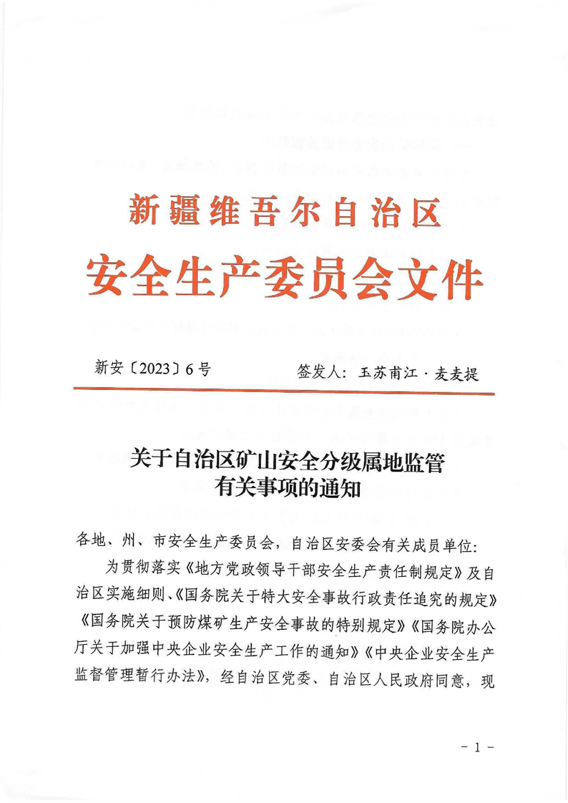
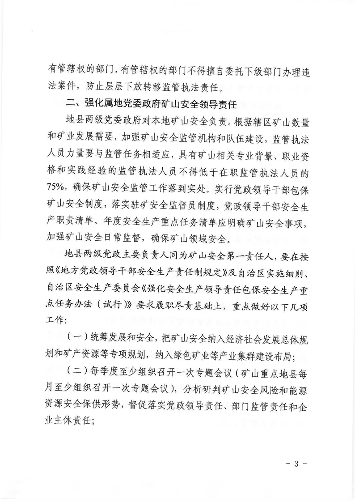
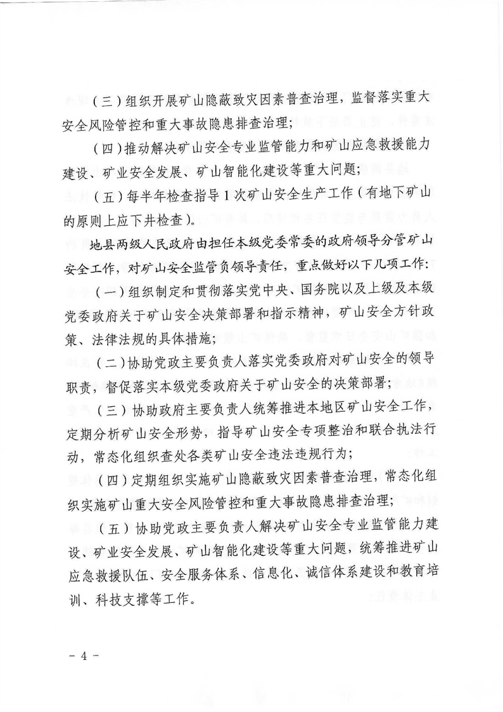

[**关于自治区矿山安全分级属地监管有关事项的通知**](https://alphalawyer.cn/ilawregu-search/api/v1/lawregu/redict/26fb398d5d45d15c186b9dc2a648b7d7)

时效性：    现行有效

发文机关：  新疆维吾尔自治区安全生产委员会

文号：      新安〔2023〕6号

发文日期：  2023年08月09日

施行日期：  2023年08月09日

效力级别：  地方规范性文件

本文件发布形式为图片

