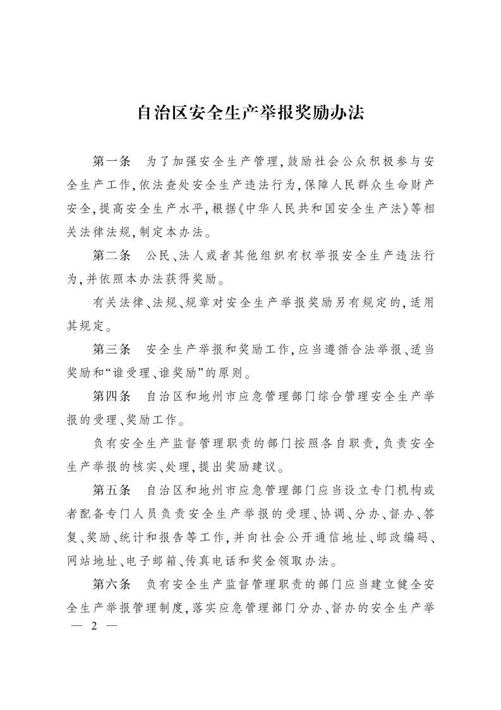

# 关于印发自治区安全生产举报奖励办法的通知

时效性：    现行有效

发文机关：  新疆维吾尔自治区人民政府

文号：      新政办发〔2019〕81号

发文日期：  2019年07月05日

施行日期：  2019年08月01日

效力级别：  地方规范性文件

伊犁哈萨克自治州，各州、市人民政府，各行政公署，自治区人民政府各部门、各直属机构：

《自治区安全生产举报奖励办法》已经自治区人民政府同意，现印发给你们，请认真贯彻执行。

# 自治区安全生产举报奖励办法

第一条　为了加强安全生产管理，鼓励社会公众积极参与安全生产工作，依法查处安全生产违法行为，保障人民群众生命财产安全，提高安全生产水平，根据《中华人民共和国安全生产法》等相关法律法规，制定本办法。

第二条　公民、法人或者其他组织有权举报安全生产违法行为，并依照本办法获得奖励。

有关法律、法规、规章对安全生产举报奖励另有规定的，适用其规定。

第三条　安全生产举报和奖励工作，应当遵循合法举报、适当奖励和“谁受理、谁奖励”的原则。

第四条　自治区和地州市应急管理部门综合管理安全生产举报的受理、奖励工作。

负有安全生产监督管理职责的部门按照各自职责，负责安全生产举报的核实、处理，提出奖励建议。

第五条　自治区和地州市应急管理部门应当设立专门机构或者配备专门人员负责安全生产举报的受理、协调、分办、督办、答复、奖励、统计和报告等工作，并向社会公开通信地址、邮政编码、网站地址、电子邮箱、传真电话和奖金领取办法。

第六条　负有安全生产监督管理职责的部门应当建立健全安全生产举报管理制度，落实应急管理部门分办、督办的安全生产举报事项。

对涉及查证属实的安全生产举报事项的安全生产违法行为人，负有安全生产监督管理职责的部门应当依照有关安全生产的法律、法规、规章从严、从重、从快予以处罚。

第七条　举报人可采用电话、传真、信函、网络或者到访等方式，向自治区或者地州市应急管理部门进行举报。应急管理部门应当按照有关规定采取措施，保护举报人的合法权益。

举报人应当对所举报事项真实性负责。对借举报之名，捏造、歪曲事实，诬告、陷害他人和企业，以及伪造举报材料骗取或者冒领奖励，浪费公共行政资源，干扰正常工作的，依法追究责任。

第八条　举报下列行为之一，经查证属实的，属于奖励范围：

(一)谎报、瞒报生产安全事故的；

(二)公民、法人或者其他组织未依法取得与安全生产相关的行政许可，擅自从事生产经营建设活动，或者与安全生产相关的行政许可已经失效，继续从事生产经营建设活动的；

(三)生产经营单位的生产经营活动危及社会公共安全未采取防范措施的；

(四)存在举报重大事故隐患的；

(五)其他安全生产违法行为。

第九条　举报人获得安全生产举报奖励应当符合下列条件：

(一)违法案件发生于自治区行政区域内；

(二)举报提供的线索事先未被负有安全生产监督管理职责的部门掌握；

(三)举报的情况经查证属实；

(四)举报的案件有处理结果；

(五)应当具备的其他条件。

第十条　有下列情形之一的，不予奖励：

(一)对正在查处的安全生产违法行为的举报；

(二)与安全监管工作有关的工作人员的举报；

(三)举报人提供的线索与负有安全生产监督管理职责的部门查处安全生产违法行为无关的；

(四)安全生产违法行为受害者的投诉(不含举报谎报、瞒报事故);

(五)发现属于负有安全生产管理或者监督管理职责的工作人员的近亲属或其授意他人举报的；

(六)法律、法规规定不予奖励的其他情形。

第十一条　依据安全生产违法行为查处结果给予举报人奖励。具体奖励标准如下：

(一)举报谎报、瞒报生产安全事故的，按照最终确定的事故等级和查实的谎报、瞒报死亡人数给予奖励，一般事故每查实谎报、瞒报1人奖励3万元，较大事故每查实谎报、瞒报1人奖励4万元，重大事故按每查实谎报、瞒报1人奖励5万元，特别重大事故每查实谎报、瞒报1人奖励6万元。最高奖励不超过30万元。

(二)举报谎报、瞒报人员受伤事故的，按照最终确定的谎报、瞒报受伤人数给予奖励，每查实谎报、瞒报重伤1人奖励1万元，每查实谎报、瞒报轻伤(最低为劳动功能障碍伤残十级)1人奖励3千元。最高奖励不超过30万元。

(三)举报重大事故隐患或者其他安全生产违法行为的，按照违法行为案件行政罚款额的15%给予奖励，最低奖励额3千元，最高不超过30万元。

举报的安全生产违法行为属实，但对安全生产违法行为人依法不予罚款处罚的，依据安全生产违法行为的危害程度，给予举报人1千元以上1万元以下的奖励。

第十二条　应受奖励的举报人按照以下方式确认：

(一)实名举报安全生产违法行为，经查证属实的；

(二)匿名举报安全生产违法行为，经查证属实并能够确定举报人真实身份的；

(三)同一线索被两个以上举报人分别举报的，以最先举报的为主，如果后举报的线索、资料比较全面，根据所提供线索或者资料具有的重要性，按比例分别进行奖励；

(四)对同一案件的举报奖励不得重复发放；

(五)新闻媒体在公开披露安全生产违法案件前，主动与负有安全生产监督管理职责的部门协作，提供案件线索或者协助调查处理，经查证属实的，视为举报人予以奖励。

第十三条　自治区和地州市应急管理部门收到安全生产举报事项后，应当登记举报人信息和举报事项，能够当场答复是否受理的，应当当场书面答复；不能当场答复的，应当自收到举报事项之日起15日内以书面或者电子方式告知举报人。但是匿名举报或者举报人联系方式不清的除外。

应急管理部门对不属于安全生产的举报事项，应当告知举报人不予受理；举报人坚持在本部门举报的，应当记录在案，在5个工作日内移送有关部门。

第十四条　应急管理部门应当按照有关法律、法规、规章和党内法规明确的部门安全生产职责分工确定承办安全生产举报事项的负有安全生产监督管理职责的部门，制作安全生产举报事项分办通知，自举报事项受理之日起5个工作日内，以书面或者电子方式送达。

对安全生产违法行为线索不明确的举报事项，不予分办。

应急管理部门分办安全生产举报事项，不得将举报人信息以任何方式传递给核实、处理举报事项的负有安全生产监督管理职责的部门及其人员，但举报人同意的除外。

第十五条　负有安全生产监督管理职责的部门接到安全生产举报事项分办通知，应当登记，进行核实；举报事项属实的，应当依照有关法律、法规、规章的规定作出处理。

负有安全生产监督管理职责的部门对不属于本部门管辖的举报事项，应当自收到安全生产举报事项分办通知之日起2个工作日内回复应急管理部门并说明理由。

第十六条　安全生产举报事项不属实的，负有安全生产监督管理职责的部门应当自收到安全生产举报事项分办通知之日起10个工作日内向应急管理部门反馈核实情况。

安全生产举报事项属实的，负有安全生产监督管理职责的部门应当自收到安全生产举报事项分办通知之日起60日内，对举报事项涉及的安全生产违法行为依法作出处理决定。情况复杂的，经本部门负责人批准，可以适当延长办理期限，但延长期限不得超过30日；特殊情况仍需延长办理期限的，报经本级人民政府批准，可以再延长90日；延长期限及理由，应当及时报告应急管理部门。

第十七条　负有安全生产监督管理职责的部门办结安全生产举报事项，应当自作出处理决定之日起10个工作日内，向应急管理部门提出奖励额度建议，同时提供查处安全生产违法行为形成的执法决定和主要证据材料。

第十八条　安全生产举报事项属实的，应急管理部门应当根据负有安全生产监督管理职责的部门提出的奖励额度建议和执法决定、证据等情况，作出奖励决定，并以适当的方式通知举报人领取奖金。

第十九条　举报人应当自接到奖励通知之日起60日内，携带有效证件领取奖金。逾期不申领的，视为自动放弃；能够说明理由的，可以延长领取时间30日。

第二十条　应急管理部门应当做好举报人领取奖金的确认、登记、保密工作。

应急管理部门未经举报人同意，不得以任何方式泄露举报人信息和奖励等情况，违者依法承担相应责任。

第二十一条　安全生产举报奖励所需资金列入自治区和地州市应急管理部门的预算，自治区和地州市财政部门根据安全生产举报奖励标准和举报情况及时核拨。

安全生产举报奖金的管理和发放，接受财政、审计部门和监察机关的监督。

第二十二条　应急管理部门和负有安全生产监督管理职责的部门不履行本办法规定的举报受理、分办、督办、奖励、保密等职责的，依照法律、法规和纪律的规定问责。

第二十三条　应急管理部门应当于每季度第二个工作周结束前，将本部门上季度安全生产举报奖励统计，报上一级应急管理部门、财政部门。

第二十四条　本办法所称负有安全生产监督管理职责的部门是指依照《中华人民共和国安全生产法》和其他有关法律、行政法规的规定，在各自的职责范围内对有关的安全生产工作实施行政许可、行政处罚、行政强制、监督检查等监督管理职责的部门。

第二十五条　本办法自2019年8月1日起施行。自治区人民政府办公厅2012年10月31日印发的《自治区安全生产举报奖励办法》(新政办发〔2012〕167号)同时废止。

