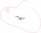

ICS 73 . 020 CCSD 09

中华人民共和国矿山安全行业标准

KA/T 22 . 2—2024

矿山隐蔽致灾因素普查规范

第 2 部分 : 煤矿

Spec,f,cat,0n f0r general 5urvey 0f h,dden d,5a5ter-cau5,ng fact0r5 ,n m,ne5

part 2: C0al m,ne

2024-10-12 发布                                                                           2024-1 1-01  实施

国家矿山安全监察局      发  布

KA/T 22. 2—2024

目       次

[前言  	   Ⅱ](#bookmark1)

[1    范围  	  1](#bookmark2)

[2    规范性引用文件  	  1](#bookmark3)

[3    术语和定义  	  2](#bookmark4)

[4    资料收集与分析  	  2](#bookmark5)

[5    采空区  	  2](#bookmark6)

[6    封闭不良钻孔  	  6](#bookmark7)

[7    地质构造  	  7](#bookmark8)

[8    水源与通道  	  9](#bookmark9)

[9    瓦斯 	  15](#bookmark10)

[10    冲击地压  	  18](#bookmark11)

[11    露天煤矿边坡  	  20](#bookmark12)

[12    成果提交  	  23](#bookmark13)

[附录 A(资料性)    煤矿隐蔽致灾因素普查资料收集清单  	  24](#bookmark14)

[附录 B(资料性)    煤矿隐蔽致灾因素普查主要物探方法现场布置  	  27](#bookmark15)

[附录 C(资料性)    煤矿隐蔽致灾因素普查成果表  	  31](#bookmark16)

[附录 D(资料性)    煤矿隐蔽致灾因素普查成果附图  	  60](#bookmark17)

[附录 E(规范性)    煤矿隐蔽致灾因素普查成果附图图例  	  63](#bookmark18)

[参考文献  	  67](#bookmark19)

KA/T 22. 2—2024

前       言

本文件按照 GB/T 1 . 1—2020《标准化工作导则    第 1 部分:标准化文件的结构和起草规则》的规 定起草 。

KA/T 22—2024《矿山隐蔽致灾因素普查规范》包括如下部分:

**— **矿山隐蔽致灾因素普查规范    第 1 部分:总则 ;

**— **矿山隐蔽致灾因素普查规范    第 2 部分:煤矿 ;

**— **矿山隐蔽致灾因素普查规范   第 3 部分:金属非金属矿山及尾矿库 。

本文件是 KA/T 22—2024《矿山隐蔽致灾因素普查规范》的第 2 部分 。

请注意本文件的某些内容可能涉及专利 。本文件的发布机构不承担识别专利的责任 。

本文件由国家矿山安全监察局安全基础司提出 。

本文件由矿山安全行业标准化技术委员会地质勘探分技术委员会归口 。

本文件起草单位:煤炭科学技术研究院有限公司 、中煤科工西安研究院(集团)有限公司 、中煤科工 集团重庆研究院有限公司 、中煤科工集团沈阳研究院有限公司 、中煤科工开采研究院有限公司 、陕西彬 长矿业集团有限公司 、国家能源集团宁夏煤业有限责任公司 、国能准能集团有限责任公司 、晋能控股装 备制造集团有限公司 、中煤资源发展集团有限公司 、中国矿山安全学会 。

本文件主要起草人:霍中刚 、李健 、牟义 、管新邦 、张俊英 、李宏艳 、李宏杰 、邓志刚 、刘善德 、王勇 、 吕贵春、唐辉、李明、徐刚、李彬刚、徐华龙、赵旭生、王刚、缪海宾、张震、刘学、贺海鸿、王占银、徐昆、贺光会、 赵忠证 、任鹏 、李阳 、马延崖 、杜明泽 、涂琦 、申宝宏 、郑行周 、舒龙勇 、赵善坤 、李文 、李建功 、李江华 。

本文件为首次发布 。

矿山隐蔽致灾因素普查规范

第 2 部分:煤矿

1    范围

本文件规定了煤矿隐蔽致灾因素普查的术语和定义 , 资料收集与分析 , 采空区 、封闭不良钻孔 、地质 构造 、水源与通道 、瓦斯 、冲击地压 、露天煤矿边坡等隐蔽致灾因素普查工作以及成果提交等内容。

本文件适用于煤矿隐蔽致灾因素普查工作以及地方政府组织的区域性煤矿隐蔽致灾因素普查 工作。

2    规范性引用文件

下列文件中的内容通过文中的规范性引用而构成本文件必不可少的条款。 其中 , 注 日期的引用文 件 , 仅该日期对应的版本适用于本文件;不注日期的引用文件 , 其最新版本(包括所有的修改单)适用于 本文件。

GB/T 212    煤的工业分析方法

GB/T 12719    矿区水文地质工程地质勘查规范

GB/T 23249    地勘时期煤层瓦斯含量测定方法

GB/T 23250    煤层瓦斯含量井下直接测定方法

GB/T 23561 . 1 ~ . 16    煤和岩石物理力学性质测定方法

GB/T 25216    煤与瓦斯突出危险性区域预测方法

GB/T 35056    煤矿巷道锚杆支护技术规范

GB/T 37807    露天煤矿井采采空区勘查技术规范

GB/T40130    煤矿专门水文地质勘查规范

GB40880    煤矿瓦斯等级鉴定规范

GB/T 50123    土工试验方法标准

GB/T 50266    工程岩体试验方法标准

MT/T 142    煤矿井下气体采样方法

MT/T 1090    煤炭资源勘查煤质评价规范

AQ 1080    煤的瓦斯放散初速度指标(△P)测定方法

KA/T 1    井下探放水技术规范

KA/T4    煤层底板采动破裂深度压水试验测试方法

KA/T 7    煤矿水化学分析方法

KA/T 9    煤矿地下水连通示踪试验方法

KA/T 1047    煤矿井下煤层瓦斯压力的直接测定方法

KA/T 22. 1    矿山隐蔽致灾因素普查规范    第 1 部分:总则

DZ/T0080    煤炭地球物理测井规范

DB/T 14    原地应力测量水压致裂法和套芯解除法技术规范

NB/T 35104    水电工程钻孔注水试验规程

《煤矿安全规程》

《建筑物 、水体 、铁路及主要井巷煤柱留设与压煤开采规范》

《防治煤矿冲击地压细则》

《煤矿防治水细则》

《防治煤与瓦斯突出细则》

《煤矿防灭火细则》

《煤矿地质工作细则》

《冲击地压矿井鉴定暂行办法》

3    术语和定义

KA/T 22. 1 界定的以及下列术语和定义适用于本文件 。

3 . 1

煤矿    coal mine

直接从事煤炭资源生产或建设的业务单元 , 包含井工煤矿和露天煤矿 。

3 . 2

物探测区    geophysical exploration area

地面物探圈定的连续封闭的探测区域 。

3 .  3

采空区极限安全厚度    goaf ultimate safe thickness

保证上部露天采矿作业设备和人员安全所需的井采采空区最小上覆岩体厚度 。

3 .  4

高瓦斯含量区    High gas content area

煤层瓦斯含量大于 6 m3 /t , 或大于区域平均煤层瓦斯含量 2 倍的区域 。

3 . 5

高瓦斯压力区    High gas pressure area

煤层瓦斯压力大于 0. 5  Mpa , 或大于区域平均煤层瓦斯压力 2 倍的区域 。

4    资料收集与分析

4 . 1    收集煤矿以往勘查 、开采历史 、生产现状 , 以及相关报告 、图纸 、台账等资料 , 掌握煤矿的基本情况 、 生产建设现状 、以往灾害(事故)情况 、地质概况等 , 资料收集清单参见附录 A。

4 . 2    通过调查走访 , 掌握煤矿的开采历史 、开采工艺 、地面及井下现状等情况 , 对收集的资料进行补充 完善 。

4 . 3    结合煤矿 3~5 年生产规划 , 分析以往地质勘查 、隐蔽致灾因素普查资料的完整性及可靠性 , 确定 隐蔽致灾因素普查的内容 、目标和方法 , 按照 KA/T 22. 1 编制隐蔽致灾因素普查工作方案 。

5    采空区

5 .  1     一般规定

5 . 1 . 1    普查范围包括可能引发煤矿灾害事故的煤矿井(境)界内的本矿开采形成的采空区 、历史遗留的 采空区(简称老窑) 、废弃井筒以及相邻矿井开采形成的采空区(巷道)等 。

5 .  1 . 2    主要普查内容如下:

a )    采空区形成的时间 、埋深 、位置 、面积 、采厚 、范围 、开采煤层等 , 开采方式 、采出率 、顶板控制方 式 、煤柱留设情况等 ;

b )    废弃井筒形式 、井口位置 、井口标高 、井筒结构 、断面尺寸 、井深/延伸方向 、封闭方法 、封闭材 料 、封闭质量等 ;

c )    采空区内积水面积 、水位标高 、水质 、积水量等 ;

d )    采空区内火区位置 、范围 、温度 、气体成分等 ;

e )    采空区内瓦斯及有毒有害气体成分等 ;

f )    采空区内顶板垮落情况等 ;

g )    采空区地表塌陷裂缝位置 、深度 、长度 、宽度 、延展方向 、导水漏风情况 、裂缝内温度 、气体成 分等 ;

h)    采空区密闭位置 、规格 、构建材料 、密闭方式 , 观测孔 、措施孔和放水孔情况 , 密闭墙内积水情 况 , 密闭墙体受压变形情况 , 密闭墙内外压差 , 密闭墙漏风情况等 。

5 . 1 . 3    应收集煤矿井(境)界内及井(境)界外 200 m范围内采空区资料 , 主要分析内容如下:

a )    采空区形成的时间 、埋深 、位置 、面积 、采厚 、范围 、开采煤层 、开采方式 、采出率 、顶板控制方 式 、积水情况 、自燃情况 、瓦斯及有毒有害气体情况 、顶板垮落情况 、地表塌陷裂缝情况 、地表 建(构)筑物情况 、采空区密闭 、露天采剥情况等 ;

b )    废弃井筒类型 、井口位置 、井口标高 、井筒结构 、断面尺寸 、井深/延展情况 、封闭方法 、封闭材 料 、积水积气情况等 。

5 . 1 . 4    采空区现场调查的主要内容如下:

a )    掌握地形地貌情况 , 标识地表建(构)筑物 、废弃井筒井口的位置等 ;

b )    掌握采煤塌陷裂缝的分布位置 、展布情况 , 调查地表浅层温度 、气体异常 , 辅助判断疑似采空 区火区位置 ;

c )    掌握井下采空区密闭 、探放水孔等流量 、水压 、温度 、瓦斯等参数 , 辅助判断采空区积水范围 、 瓦斯积聚等情况 ;

d )    结合《煤矿安全规程》、《煤矿防灭火细则》等规定 , 校对自然发火束管监测 、温度传感器 、采空 区密闭观测数据等资料 , 掌握自然发火指标性气体 、温度异常等情况 , 判断采空区自燃情况 。

5 . 1 . 5    应结合资料分析 、现场调查成果 , 按照 KA/T 1 规定划定采空区积水线 、探水线 、警戒线 。 资料 分析和现场调查未查明的采空区 , 应采用以下方法进行现场探查:

a )    采用地面物探探测 , 并对对异常区井下地面钻探验证 , 按照 KA/T 1 规定修订采空区积水线 、 探水线 、警戒线 ;

b )    地面探查未查明或不具备地面探查条件的 , 采用矿井物探及井下钻探进行探查 。

5 . 1 . 6    采空区普查应在资料分析和现场调查成果的基础上 , 评估具有实际工程量支撑的实测资料以及 收集到的采空区其他相关要素资料的完整性和可靠性 。相关资料完整可靠的 , 可编制采空区普查章节 报告;否则应开展物探 、钻探 、测试与试验等工作 。

5 . 2    地面物探探测

5 . 2 . 1    生产区和规划区及其影响范围内的未查明采空区 , 应采用地面物探方法查明几何特征 、属性特 征;其他区域应采用地面物探查明采空区位置 、范围 。

5 . 2 . 2    地面物探范围应包含初步推断的采空区和外延区 , 外延区为初步推断的采空区边界向外延展的 范围 , 外延范围应不少于 100 m 。

5 . 2 . 3    地面物探方法应结合地质 、地形地貌条件 、采空区和地层物性特征 、干扰源特征等信息综合 确定:

a )    探测深度小于或等于 150 m 的采空区可选用探地雷达法 、高密度电阻率法 、直流电测深法(电

剖面法) 、瞬变电磁法或地震勘探等 ;

b )    探测深度大于 150 m 的采空区可选用瞬变电磁法 、直流电测深法(电剖面法) 、可控源音频大 地电磁法 、大地电磁法或地震勘探等 。

5 . 2 . 4    地面物探应根据地质任务 、探测方法等确定测网密度:

a )    生产区和规划区及其影响范围内的采空区地面物探方法测网密度可参照附录 B 中表 B. 1 ;

b )    废弃井筒地面物探方法测网密度可参照附录 B 中表 B. 2 ;

c )    其他区域的采空区地面物探方法测网密度可参照附录 B 中表 B. 3 。

5 . 3    矿井物探探测

5 . 3 . 1    矿井物探探测工作应符合《煤矿防治水细则》要求 。

5 . 3 . 2    矿井物探方法应结合施工位置 、探测 目标 、采空区和地层物性特征 、干扰源特征等信息综合 确定:

a )    掘进工作面超前物探可选用瞬变电磁法 、直流电法 、地震勘探(含槽波地震勘探)或探地雷达 法等 ;

b )    巷道侧帮和回采工作面区域物探可选用瞬变电磁法 、无线电波透视法 、地震勘探(含槽波地震 勘探)或直流电法等 。

5 . 3 . 3    矿井物探工作应根据地质任务 、探测方法等确定测线测点布置 , 可参照附录 B 中表 B. 4 。

5 . 4    井工煤矿地面钻探探查

5 . 4 . 1    地面钻探钻孔数量根据物探测区及物探圈定的异常区数量 、面积综合确定 , 终孔深度应进入 目 标采空区或穿过目标煤层底板至少 5 m 。

5 . 4 . 2    地面钻探应进行编录 、测斜等工作 , 通过分析岩芯采取率 、掉钻 、卡钻 、埋钻 、吸风 、漏水量 、水位 深度 、起火(冒烟 、冒气)及埋深数据 , 判断采空区位置 、积水 、火区及有毒有害气体等情况 。

5 . 5    露天煤矿钻探探查

5 . 5 . 1    采空区钻探验证工作应结合物探测区 、物探圈定的异常区及采剥计划开展 。

5 . 5 . 2    对于物探圈定的异常区 , 每个物探测区应布置不少于 3 个验证钻孔 。

5 . 5 . 3    发现多处采空区空间关系不明确 、有外延扩大趋势或剥采过程中发生地表局部塌陷 、地层不连 续等现象 , 验证钻孔应不少于 5 个 。

5 . 5 . 4    采空区钻探应进行编录 、测斜等工作 , 通过分析岩芯采取率 、掉钻 、卡钻 、埋钻 、吸风 、漏水量 、水 位深度 、起火(冒烟 、冒气)及埋深数据 , 验证采空区位置 、范围及积水 、火区及有毒有害气体等情况 。

5 . 5 . 5    上覆岩层厚度达到已知采空区极限安全厚度前 , 应开展顶板安全探查工作 , 编制钻探方案 , 主要 内容如下:

a )    采空区极限安全厚度应按照 GB/T 37807 估算 ;

b )    应设计不少于 2 条跨越采空区勘探线 , 钻探孔间距应满足孔间测试的需要 , 且不少于 6 个 钻孔 ;

c )    应采用钻孔电视探查采空区顶板垮落裂隙情况 ;

d )    应采用钻孔三维激光扫描探查悬顶采空区范围 、空腔体积 、边界等情况 ;

e )    应采用声呐探查含水区情况 。

5 . 6    井下钻探探查

5 . 6 . 1    井下验证钻孔组数 、个数应能验证物探圈定的异常区 , 钻孔布设 、孔径 、方位 、倾角 、深度等技术 要求 , 应按照《煤矿防治水细则》井下探放水要求执行 。

5 . 6 . 2    井下钻探应通过分析卡钻 、夹钻 、吸风 、漏水量 、水位深度 、起火(冒烟 、冒气)情况及埋深数据 , 分 析和验证采空区位置 、范围 、积水 、火区 、瓦斯及有毒有害气体情况 。

5 . 6 . 3    井下钻探应根据探查目的 , 综合确定观测方法:

a )    探查采空区火区温度时 , 可采用钻孔测温法 ;

b )    探查采空区顶板局部垮落 、悬顶区域 、充填体状态时 , 可采用钻孔窥视方法 ;

c )    探查采空区密闭厚度 、保护煤柱宽度时 , 可采用钻孔窥视方法 。

5 . 7    测试与试验

5 . 7 . 1    通过钻孔 、密闭孔等现场实测采空区气体成分和温度等 。

5 . 7 . 2    通过地面钻孔简易水文观测现场实测采空区积水情况等 。

5 . 7 . 3    通过井下钻孔 、密闭孔等现场实测采空积水区的水压 、水温等 。

5 . 7 . 4    通过钻孔 、密闭孔等采集采空区积水 、气体等样品 , 测定采空区积水水质 、气体成分等相关属性 要素 。 当不具备抽取气样条件时 , 视为采空区 、废弃井筒 、密闭巷道内有瓦斯及有毒有害气体 。

5 . 7 . 5    采空区气体采样应按照 MT/T 142 执行 。

5 . 7 . 6    采空区积水应开展水化学分析 , 具体化学检测指标 、水样采集处理 、测定方法 、测定结果的整理 和校核等按照 KA/T 7 执行 。

5 . 7 . 7    应采用气相色谱仪或鉴定管等对收集的气样进行以下测定工作:

a )    测定 O2   浓度 , CO、烷烃 、烯烃和炔烃等自然发火标志性气体成分 ;

b )    测定 H2 S、NO2 、SO2 、NH3  、H2 、CH4  、CO2 、CO等有毒有害气体成分 。

5 . 8    普查程度及危险性分析

5 . 8 . 1    对于生产区和规划区及其影响范围内的采空区 , 应查明以下要素 , 并分析其危险性:

a )    查明采空区开采煤层 、开采方式 、采深 、采厚 、范围 , 掌握采空区的基本情况 ;

b )    查明采空区积水面积 、水位标高 、积水量及水质 , 确定积水线 、探水线和警戒线 , 分析透水 、淹 井风险 ;

c )    查明采空区内火区位置 、温度 、标志性气体成分 , 煤自然发火状态 、采空区 自然发火危险区域 , 分析采空区遗煤自燃 、火区爆炸等风险 ;

d )    查明采空区内瓦斯及有毒有害气体成分 、积聚情况 , 分析有毒有害气体泄漏 、瓦斯爆炸等 风险 ;

e )    查明采空区悬顶及垮落情况 , 分析瓦斯异常涌出 、工作面压架 、离层突水 、冲击地压等风险 ;

f )    查明采空区地表塌陷裂缝导水 、漏风情况 , 分析地表水体对采空区的补给情况 , 分析淹井 、溃 水 、边坡失稳 、滑坡等风险 ;

g )    查明采空区密闭分布位置 、规格情况 、墙体及周边完整程度 、漏风返水情况 , 分析采空区密闭 的防灾能力 ;

h)    查明废弃井筒类型及尺寸 、井口位置及标高 、封闭方法及质量 、导水漏风等情况 , 分析废弃井 筒可能存在的安全风险 。

5 . 8 . 2    其他区域的采空区 , 应查明其位置 、范围等情况 , 并分析其是否对生产区和规划区产生影响 。

5 . 9    普查结论

5 . 9 . 1    采空区普查结论应包括资料收集分析 、现场探查 、测试与试验等工作量 , 普查成果 、普查程度 、危 险性分析及防治措施等内容 , 并在附录 C 中表 C. 1 和表 C. 2 体现 。

5 . 9 . 2    应编制采空区综合普查成果汇总表 、采空区普查成果统计表和废弃井筒普查成果统计表(见附 录 C 中表 C. 3 、C. 3. 1 、C. 3. 2) 。

5 . 9 . 3    应按照附录 D及附录 E 的要求,绘制采空区普查成果图 。

6    封闭不良钻孔

6 .  1     一般规定

6 . 1 . 1    普查范围包括煤矿井田边界内可能引发煤矿灾害事故的地质勘查 、开发与利用过程中形成的未 封闭 、位置不清 、封孔情况不明 、封孔质量不合格 、遗留钻具的钻孔,水源井 、油气井 、煤层气井等封闭不 良钻孔分布情况 。

6 .  1 . 2    主要普查内容如下 :

a )    封闭不良钻孔类型 、施工时间 、钻孔坐标 、钻孔深度 、终孔层位 、钻遇煤层 、钻孔孔斜 、揭露情况 及与采场的空间关系 ;

b )    封闭不良钻孔的孔身及套管与固井情况,包括钻孔孔身结构 、套管及固井深度 、固井材料等 ;

c )    封闭不良钻孔的封孔情况,包括封闭层段 、封闭层位 、封孔材料 ;

d )    地质勘查遗留钻具钻孔中遗留钻具类型 、规格 、长度及遗留层段;遗留套管钻孔中套管规格 、 长度及遗留层段 ;

e )    封闭不良钻孔可能导通的含水层 、采空区或含气层情况等 ;

f )    油气井 、煤层气井和水源井的在用情况 。

6 . 1 . 3    应收集煤矿井田边界内封闭不良钻孔资料,主要分析内容如下 :

a )    封闭不良钻孔类型 、施工时间 、钻孔坐标 、钻孔深度 、终孔层位 、钻遇煤层 、钻孔孔斜 、揭露情 况 、孔身及套管与固井情况 、封孔情况,钻孔周边富水性,封闭不良钻孔与采场的空间关系,可 能导通的含水层 、采空区或含气层情况 ;

b )    地质勘查遗留钻具 、套管情况 ;

c )    油气井 、煤层气井和水源井的在用情况 。

6 . 1 . 4    封闭不良钻孔现场调查的主要内容如下 :

a )    具有自主权的封闭不良钻孔,确定资料完整性 ;

b )    煤矿井(境)界内的油气井 、煤层气井,应与油气井 、煤层气井相关方核对资料准确性 ;

c )    调查 、实测水源井孔深 、含水层层位 、在用情况等 。

6 . 1 . 5    应参照《煤矿地质工作细则》,对煤矿井田边界内的全部钻孔按照钻孔类型划分封闭良好钻孔和 封闭不良钻孔,建立封闭不良钻孔汇总表(见附录 C 中表 C. 4);应根据封闭不良钻孔类型(具有 自主权 的封闭不良钻孔 、油气井 、煤层气井 、水源井),分类建立统计表(见附录 C 中表 C. 4. 1~表 C. 4. 3) 。

6 . 1 . 6    对于煤矿井田边界内的封闭不良钻孔,应开展以下工作 :

a )    钻孔坐标清楚的,应在采掘工程平面图 、矿井充水性图和矿井瓦斯地质图等图中标注 ;

b )    钻孔坐标不清的,应预测封闭不良钻孔的疑似靶区,标出警戒范围 ;

c )    生产区 、规划区及其影响范围内资料不清的封闭不良钻孔,应采用以下方法进行现场探查 :

**— **采用矿井物探方法探测封闭不良钻孔的富水性 ;

**— **采用井下钻探方法探查封闭不良钻孔的含(导)水或积气情况 。

6 . 1 . 7    封闭不良钻孔普查应在分析已有资料和现场调查成果的基础上,对具有实际工程量支撑的实测 资料以及收集到的封闭不良钻孔其他相关要素资料,评估其完整性和可靠性 。相关资料完整可靠的,可 编制封闭不良钻孔普查章节内容;否则应开展物探 、钻探 、测试与试验等工作 。

6 . 2    矿井物探探测

6 . 2 . 1    矿井物探方法应结合施工位置 、钻孔属性和地层物性特征 、干扰源特征等信息综合确定,可选用 矿井瞬变电磁法 、直流电法或钻孔物探等探测封闭不良钻孔富水性 。

6 . 2 . 2    矿井物探工作应根据地质任务 、探测方法等确定测线测点布置 , 可参照附录 B 中表 B. 4 、B. 5 。

6 . 3    井下钻探探查

对封闭不良钻孔的富水范围异常区 , 应开展井下超前钻探验证 , 验证钻孔的布设及数量应根据封闭 不良钻孔的特点确定。

6 . 4    测试与试验

对物探异常区实施的井下探查验证钻孔 , 孔内出水时应观测水压和涌水量 , 采集水样并分析水源 ; 孔内出气时应采集气样 , 测定气体成分 , 水/气样测定应按照本文件 5. 7 执行。

6 . 5    普查程度及危险性分析

对于煤矿井田范围内的封闭不良钻孔 , 应查明以下要素 , 并分析其对开采的影响及危险性:

a )    查明封闭不良钻孔类型 、施工时间 、钻孔坐标 、钻孔深度 、终孔层位 、钻遇煤层 、钻孔孔斜 、孔身 及套管与固井情况 、封孔情况 , 钻孔周边富水性 , 封闭不良钻孔与采场的空间关系 , 可能导通 的含水层 、采空区或含气层情况以及生产揭露情况 , 分析封闭不良钻孔透水 、漏气可能性 ;

b )    查明地质勘查钻孔遗留钻具 、套管情况的层位 , 分析与开采煤层的空间关系 , 提出避免当掘进 机或割煤机误切割遗留钻具 、套管 , 产生火花 、弹射伤人或导致瓦斯爆炸等事故的安全措施 ;

c )    查明油气井 、煤层气井和水源井的在用情况 , 分析其漏气 、透水的可能性。

6 . 6    普查结论

6 . 6 . 1    封闭不良钻孔普查结论应包括资料收集分析 、现场探查 、测试与试验等工作量 , 普查成果 、普查 程度 、危险性分析及防治措施等内容 , 并在附录 C 中表 C. 1 和表 C. 2 体现。

6 . 6 . 2    应根据普查成果 , 补充完善封闭不良钻孔汇总表 、具有自主权的封闭不良钻孔普查成果统计表 、 油气井普查成果统计表以及水源井普查成果统计表(见附录 C 中表 C. 4 、C. 4. 1~C. 4. 3) 。

6 . 6 . 3    应按照附录 D及附录 E 的要求 , 绘制封闭不良钻孔普查成果图。

7    地质构造

7 .  1     一般规定

7 . 1 . 1    普查范围包括煤矿井(境)界内可能引发水 、瓦斯 、顶板 、冲击地压 、滑坡等煤矿灾害事故的断层 、 褶曲赋存情况。

7 .  1 . 2    主要普查内容如下 :

a )    落差大于 5  m 的断层的性质 、产状 、发育规模 、含(导)水性 、断层两侧含(隔)水层对接情况及 水力联系等 ;

b )    主要褶曲的类型 、产状 、展布范围等。

7 . 1 . 3    应收集煤矿井(境)界内地质构造资料 , 主要分析内容如下:

a )    断层的性质 、产状 、发育规模 、含(导)水性等情况 ;

b )    主要褶曲的位置 、类型 、延展范围等情况。

7 . 1 . 4    采剥揭露或井巷穿过的 、具备观测条件的地质构造 , 现场调查的主要内容如下:

a )    断裂构造产状 、断距 、断层带宽度 , 观测断裂带充填物成分 、胶结程度及导水性等 ;

b )    褶曲的形态 、产状及破碎情况等。

7 . 1 . 5    资料分析 、现场调查未查明的地质构造 , 应采用以下方法进行现场探查:

a )    影响生产区安全开采的地质构造探测以矿井物探为主 ;

b )    影响规划区安全开采的地质构造探测以地面物探为主;不具备地面物探条件或地面物探未查 明的 , 应采用矿井物探方法进行探测 ;

c )    对于物探发现的地质构造异常区 , 应根据异常区特征以及现场条件 , 选择合理的钻探方式进 行验证 。

7 . 1 . 6    地质构造普查应在分析已有资料和现场调研成果的基础上 , 对具有实际工程量支撑的实测资料 以及收集到的地质构造其他相关要素资料 , 评估其完整性和可靠性 。相关资料完整可靠的 , 可编制地质 构造普查章节内容;否则应开展物探 、钻探 、测试与试验等工作 。

7 . 2    地面物探探测

7 . 2 . 1    地面物探方法应结合地质 、地形地貌条件 、地质构造和地层物性特征 、干扰源特征等信息综合 确定:

a )    埋深小于或等于 150 m 的地质构造可选用电磁法 、电阻率法或地震勘探等 ;

b )    埋深大于 150  m 的地质构造可选用地震勘探或电磁法等 。

7 . 2 . 2    地面物探应根据地质构造特点和探查 目 的合理选择测网密度 , 具体测网密度可参照附录 B 中 表 B. 6 , 需确定目标体的边界或任务要求较高等特殊情况时应加密控制 。

7 . 3    矿井物探探测

7 . 3 . 1    矿井物探方法应结合施工位置 、探测 目标 、地质构造和地层物性特征 、干扰源特征等信息综合 确定:

a )    掘进工作面构造探测可选用地震勘探 、电法或钻孔物探等方法 ;

b )    回采工作面构造探测应采用槽波地震勘探或无线电波透视法等方法 , 对富水构造应采用直流 电法 、音频电透视法或瞬变电磁法等方法探测 , 应采用至少 2 种方法 。

7 . 3 . 2    矿井物探工作应根据地质任务 、探测方法等确定测线测点布置 , 可参照附录 B 中表 B. 4 、B. 5 。

7 . 4    地面钻探探查

对于生产区 、规划区内有富水异常且落差大于 30 m 的断层 , 宜采用地面钻探验证 , 并编制专项探 查设计 。

7 . 5    井下钻探探查

对物探圈定的构造富水异常区应开展井下钻探验证 , 探水钻孔沿掘进方向的正前方及含水体方向 呈扇形布置 , 钻孔不得少于 3 个 , 其中含水体方向的钻孔不得少于 2 个 。

7 . 6    测试与试验

7 . 6 . 1    地质构造钻探探查应开展以下现场试验:

a )    地面验证钻探应开展钻孔取芯 、地质编录 、测井 、分析测试 , 验证含(导)水性时 , 应开展水文地 质抽(注)水等试验工作 ;

b )    井下验证钻探应进行钻孔测斜 、探放水观测 、岩屑编录 、水头压力测试等 。

7 . 6 . 2    确定断层构造的导(含)水性 , 必要时应利用地面或井下钻孔开展抽(放)水连通(示踪)试验:

a )    抽(放)水试验应按照 GB/T 40130 进行 ;

b )    连通(示踪)试验应按照 KA/T 9 进行 。

7 . 6 . 3    含(导)水地质构造钻探探查应采集构造水样 , 并进行水质测定 , 水样测定内容见 5. 7. 6 。

7 . 7    普查程度及危险性分析

7 . 7 . 1    对于生产区 、规划区内的地质构造 , 应查明以下要素 , 并分析其危险性:

a )    查明规划区内的主要向 、背斜褶曲构造,落差大于 5  m 的断层,分析其对采区开拓布置的 影响 ;

b )    查明生产区域内回采工作面落差大于 5  m 的断层,地质构造与采掘工作面的空间关系,分析 其突水危险性 、瓦斯异常涌出以及对工作面布置和回采的影响 。

7 . 7 . 2    对于其他区域的地质构造,应查明以下要素,并分析其对安全生产的影响 :

a )    查明煤矿边界断层情况,边界断层与本矿的位置关系及延展情况,分析其对开拓准备的影响 ;

b )    查明煤矿井(境)界内的断层 、褶曲情况,分析其对生产区 、规划区安全生产的影响 。

7 . 8    普查结论

7 . 8 . 1    地质构造普查结论应包括资料收集分析 、现场探查 、测试与试验等工作量,普查成果 、普查程度 、 危险性分析及防治措施等内容,并在附录 C 中表 C. 1 和表 C. 2 体现 。

7 . 8 . 2    应编制地质构造普查成果汇总表(见附录 C 中表 C. 5) 。

7 . 8 . 3    应按照附录 D及附录 E 的要求,绘制地质构造普查成果图 。

8    水源与通道

8 .  1     一般规定

8 . 1 . 1    普查范围包括煤矿井(境)界内及周边影响煤矿安全生产的河流 、湖泊 、水库 、池塘 、冲沟 、融雪等 地表水体及水利工程,可能引发煤矿突(透)水的松散含水层 、基岩含水层 、烧变岩 、离层水 、风氧化带 、古 河床冲刷带 、剥离回填体 、采空区积水以及废弃井筒积水等地下含水体,以及可能引发煤矿水害的垮落 带 、导水裂缝带 、底板采动导水破坏带 、陷落柱 、地质构造 、封闭不良钻孔等导水通道情况 。

8 .  1 . 2    主要普查内容如下 :

a )    地表水体及水利工程主要普查内容 :

**— **河流 、湖泊 、水库 、池塘 、冲沟 、露天采坑等地表水体的位置 、流量 、水位 、水量 、水质 ;

**— **当地历年降水量和最高洪水位 ;

**— **地表防排水设施 、堤坝 、沟渠 、排水沟的位置 、汇水 、疏水情况,上游水库及其集中放水 情况 ;

**— **河流 、泄洪道的阻塞情况 ;

**— **塌陷区 、积水区 、地裂缝区分布情况及地表汇水情况 ;

**— **地表水体与地下水的补给关系,及其与煤矿连通通道 。

b )    地下含水体主要普查内容 :

**— **含水层的岩性 、厚度 、分布范围 、埋藏条件,含水层的渗透性 、水位 、水质类型及富水性分 区,地下水的补给 、径流 、排泄条件 ;

**— **隔水层的分布情况 、稳定性 、隔水性 ;

**— **富水性中等及以上的半固结或较松散砂砾含水层的厚度 、胶结程度等 ;

**— **底板高承压灰岩含水层的岩溶(裂隙)分布 、径流特征 、富水性 、水压 、隔水层厚度 、补给的 途径,以及与导水断裂构造 、陷落柱的关系 ;

**— **烧变岩的分布范围 、结构特征 、孔隙裂隙发育程度 ;

**— **顶板离层发育条件 、层位,及其与含水层 、导水构造的补给关系 ;

**— **风氧化带的发育深度 、风化特征,及其与各含水层 、地表水的连通情况 ;

**— **古河床冲刷带的位置 、深度以及富水性 ;

**— **回填区的围岩界限及底界面标高层位 ;

**— **采空区以及废弃井筒积水普查内容见本文件第 5 章 。

c )    导水通道主要普查内容 :

**— **垮落带 、导水裂缝带的发育高度 ;

**— **底板采动导水破坏带的发育深度 ;

**— **陷落柱的发育位置 、空间形态 、充填物性质 、含(导)水性等 ;

**— **地质构造普查内容见本文件第 7 章 ;

**— **封闭不良钻孔普查内容见本文件第 6 章 。

8 . 1 . 3    水源与通道普查应收集相关资料,主要分析内容如下 :

a )    地表水体及水利工程普查应通过资料收集,主要分析内容 :

**— **地表水体的历史最高洪水位 、最大流量 、积水量 、最大洪水淹没范围 ;

**— **历年降水量 ;

**— **煤矿井口和工业场地内建筑物的地面标高 ;

**— **上游水库集中放水情况 ;

**— **井(境)界内及周边江 、河 、湖 、水库等大型地表水体动态变化规律 。

b )    地下含水体普查应通过资料收集,主要分析内容 :

**— **煤矿及相邻煤矿的水文地质勘查成果,煤矿含(隔)水层的厚度 、分布范围 、岩性等情况, 含水层水位 、单位涌水量 、渗透系数等水文地质参数 ;

**— **煤矿近 3 年正常 、最大涌水量,煤矿及周边煤矿突(透)水情况 、水文观测等情况 ;

**— **煤矿及邻近煤矿历史发生的离层水害事故及相关涉险事件,生产区 、规划区内的煤层覆 岩岩性 、岩体强度及变形参数 ;

**— **相邻煤矿 200 m 范围内采掘工程情况 。

c )    导水通道普查应通过资料收集,主要分析内容 :

**— **煤层埋深 、倾角 、层间距 、开采方式 、采厚等参数 ;

**— **煤层上覆 、下伏岩层的岩性 、厚度 、单轴抗压强度等参数 ;

**— **垮落带 、导水裂缝带或底板采动导水破坏带实测成果 ;

**— **陷落柱的勘探及揭露情况 ;

**— **地质构造资料收集应掌握的内容见本文件第 7 章 ;

**— **封闭不良钻孔资料收集应掌握的内容见本文件第 6 章 。

8 . 1 . 4    水源与通道地表现场调查的主要内容及要求如下 :

a )    地表水体及水利工程地表现场调查的主要内容 :

**— **调查地表水体的位置 、范围 ;

**— **河流 、泄洪道的阻塞情况 ;

**— **塌陷区 、积水区 、地裂缝区分布及地表汇水 、疏水情况 。

b )    地表水体地表现场调查应符合以下要求 :

**— **合理选用航测遥感 、全球定位导航系统(GNSS) 、载波相位差分技术(RTK) 、无人机 、流量 仪 、流速仪等仪器设备开展现场调查与测量工作 ;

**— **地表水体调查应填写地表水体综合调查表(见附录 C 中表 C. 6. 1) 。

c )    地下含水体地表调查的主要内容 :

**— **由开采或地下水活动诱发的地貌变化及岩溶塌陷的形态 、分布范围 ;

**— **煤矿井(境)界及周边影响范围内的地下含水体的出水点分布范围 ;

**— **松散覆盖层的分布范围 、性质 ;

**— **回填区松散体的分布范围 ;

**— **水文观测孔的孔位 、观测层位 、水位 、水温 。

8 . 1 . 5    水源与通道井下现场调查的主要内容如下 :

a )    井巷穿过的 、具备观测条件的地下含水体 , 井下调查的主要内容:

**— **出水含水层岩性 、构造 、裂隙或岩溶的发育与充填情况 , 揭露点的位置及标高 、出水形式 、 涌水量和水温等 , 并采取水样进行水质分析 ;

**— **裂隙产状 、长度 、宽度 、数量 、形状 、尖灭情况 、充填物等 ;

**— **地质构造现场调查内容见本文件第 7 章 ;

**— **陷落柱内外地层岩性与产状 、裂隙与岩溶发育程度及涌水等 ;

**— **井下主要涌/出水点的位置 、水量 、水温 、水质 、出水形式 , 出水点层位 、岩性及围岩破坏情 况等 。

b )    井巷穿过的 、具备观测条件的陷落柱 , 主要调查其岩溶形态 、发育情况 、分布状况 、充填物成分 及充水状况等 。

8 . 1 . 6    存在与充水含水层有直接水力联系的地表水体连通通道的 , 应采用测试与试验的方法开展地表 水体及水利工程现场探查工作 。

8 . 1 . 7    生产区 、规划区内存在以下情形之一的 , 应开展地下含水体现场探查工作:

a )    影响煤矿生产的主要含水体未开展过水文地质勘探工作的 ;

b )    原勘探工作量不足 , 水文地质条件未查清或未查明相对富水区的 ;

c )    采掘揭露煤岩层后 , 水文地质条件比原勘探报告复杂的 ;

d )    水文地质条件发生较大变化 , 原有勘探成果难以满足生产建设需要的 ;

e )    开拓延深 、开采新煤系(组)或扩大井田范围设计需要的 ;

f )    采掘工程位于特殊地质条件部位 , 强富水松散含水层下提高煤层开采上限或强富水含水层上 带压开采 , 专门防治水工程设计 、施工需要的 ;

g )    井巷工程穿过强含水层或地质构造异常带 , 防治水工程设计 、施工需要的 。

8 . 1 . 8    地下含水体现场探查应根据探查目的及现场条件等情况 , 合理选择探查方法:

a )    含(隔)水层的水文地质参数不清的 , 应以钻探为主 , 并配合抽(放)水试验 、水质化验进行 普查 ;

b )    生产区 、规划区内含水层富水区分布不清的 , 应以电(磁)法勘探为主 , 并进行钻探验证 ;

c )    生产区 、规划区内古河床冲刷带等不清的 , 应以电(磁)法勘探和地震勘探为主 , 并进行钻探 验证 ;

d )    含水层之间或含水层与导水构造之间水力联系不清的 , 应以抽(放)水试验 、连通(示踪)试验 为主进行普查 。

8 . 1 . 9    导水通道普查应符合以下要求:

a )    垮落带 、导水裂缝带发育高度可按照《建筑物 、水体 、铁路及主要井巷煤柱留设与压煤开采规 范》中的公式计算 , 或根据实测 、类似地质条件下的经验数据 , 结合力学分析 、数值模拟 、物理 模拟等多种方法综合确定 。 生产区 、规划区内存在以下情形之一的 , 应开展导水裂缝带和 (或)垮落带实测工作:

**— **导水裂缝带可能沟通地表水体 、上覆富水性中等及以上含水体以及采空区水淹区域的 ; **— **缩小防隔水煤(岩)柱 , 提高开采上限的 。

b )    受底板水害威胁的带压开采煤层 , 底板采动导水破坏带发育深度应根据本矿区类似地质条件 的实测资料等多种方法综合确定 。底板采动导水破坏带可能沟通底板富水性中等及以上承 压含水层时 , 应实测本矿井底板采动导水破坏带发育深度 ;

c )    垮落带 、导水裂缝带及底板采动导水破坏带实测方法应以冲洗液漏失量 、钻孔压水试验 、地面 钻孔电视或井下钻孔窥视为主 , 可配合钻孔电阻率法 、测井或其他物探方法综合探查 ;

d )    生产区 、规划区内陷落柱不清的 , 应以电(磁)法勘探和地震勘探为主 , 并进行钻探验证 ;

e )    断层的现场探查应以探地雷达法 、地震勘探(含槽波地震勘探) 、电阻率法 、电磁法 、无线电波

透视法或钻孔物探为主 , 并配合钻探以及抽(放)水连通(示踪)试验 ;

f )    封闭不良钻孔现场应以矿井瞬变电磁法 、直流电法或钻孔物探等方法为主 , 并配合井下钻探 以及测试与试验 。

8 . 1 . 10    水源与通道普查应在资料分析和现场调查成果的基础上 , 对具有实际工程量支撑的实测资料 以及收集到的水源与通道其他相关要素资料 , 评估其完整性和可靠性 。相关资料完整可靠的 , 可编制水 源与通道普查章节内容;否则应开展物探 、钻探 、测试与试验等工作 。

8 . 2    地面物探探测

8 . 2 . 1    地面物探应根据探测区域的水文地质条件 、目标体的地球物理特征等信息综合确定:

a )    探测松散层 、回填体的分布范围 、深度时应采用探地雷达法或地震勘探等 ;

b )    探测烧变岩的分布范围应采用磁法或瞬变电磁法等 ;

c )    探测含水体的富水异常区应采用直流电测深法(电剖面法) 、高密度电阻率法或瞬变电磁 法等 ;

d )    探测陷落柱 、古河床冲刷带等分布及赋存形态时 , 埋深小于或等于 150  m 的应采用电磁法 、直 流电测深法(电剖面法) 、高密度电阻率法或地震勘探等;埋深大于 150 m 的采用地震勘探或 电磁法等 ;

e )    探测陷落柱 、古河床冲刷带富水性时 , 应采用电磁法 、直流电测深法(电剖面法)或高密度电阻 率法等 ;

f )    地质构造的地面物探方法选择 、测网密度及布置参数应按照本文件第 7 章要求执行 。

8 . 2 . 2    地面物探应根据目标体特点和探测 目的合理选择测网密度 , 施工参数可参照附录 B 中表 B. 3 。

8 . 3    矿井物探探测

8 . 3 . 1    不具备地面物探条件或地面物探未查明的 , 应预估地下含水体水位 、水压等 , 按照《煤矿防治水 细则》附录六以及 KA/T 1  的要求以及物探仪器能力 , 综合确定探水线 、警戒线 。在采掘工程邻近地下 含水体富水异常区时 , 开展矿井物探探测 。

8 . 3 . 2    采用矿井物探探测松散含水层 、基岩含水层 、风氧化带等层状地下含水体富水异常区时 , 应根据 现场施工条件 、探测 目标层的地球物理特征和探测 目的 , 选用瞬变电磁法或直流电法等进行探测 。

8 . 3 . 3    采用矿井物探探测陷落柱 、古河床冲刷带等富水性时 , 应根据探测位置 , 采用不同的矿井物探方 法组合确定其相关要素 、特征及富水性:

a )    掘进工作面应选用瞬变电磁法 、直流电法 、地震勘探或地质雷达等 , 探测陷落柱 、古河床冲刷 带的分布位置及富水性 , 可利用钻孔开展钻孔物探 , 应采用至少 2 种方法 ;

b )    回采工作面陷落柱 、古河床冲刷带等分布探测应选用槽波地震勘探或无线电波透视法等 , 对 陷落柱 、古河床冲刷带等含(导)水性探测应选用直流电法 、音频电透视法或瞬变电磁法等 , 应 采用至少 2 种方法 。

8 . 3 . 4    地质构造的矿井物探探测应按照本文件第 7 章要求执行 。

8 . 3 . 5    封闭不良钻孔的矿井物探探测应按照本文件第 6 章要求执行 。

8 . 3 . 6    矿井物探工作应根据地质任务 、探测方法等确定测线测点布置 , 可参照附录 B 中表 B. 4 。

8 . 4    地面钻探探查

8 . 4 . 1    地下含水体的地面钻探布设应结合勘探目的 、任务及要求等综合确定 , 以满足相应的勘查程度 要求为原则 , 按照 GB/T 12719 要求执行 , 可综合利用普查区域附近水文地质条件相似的资料及水源井 资料 。

8 . 4 . 2    地下含水体地面钻探应满足以下要求:

a )    钻孔终孔深度应穿过目标含水层 , 以煤层底板水害为主的矿井 , 其钻孔终孔深度以揭露下伏 主要含水层段为原则 ;

b )    钻孔孔径根据钻孔目的确定 , 钻孔应当取芯钻进 , 并进行岩芯描述 , 采取岩样 、水样 , 进行物理 力学性质及水质测试 。 当采用水文地球物理测井 , 能够正确划分地层和含(隔)水层位置及厚 度时 , 可以适当减少取芯 ;

c )    确定地下含水体水文地质参数时 , 应开展抽(注)水试验 , 按照 GB/T40130 执行 ;

d )    对于生产区 、规划区内有富水异常古河床冲刷带等 , 宜采用地面钻探验证 , 并编制专项探查 设计 ;

e )    除留作长期观测的钻孔以外 , 其余钻孔均应采用高标 号 水 泥 封 孔 , 其 抗 压 强 度 不 应 低 于 10 Mpa 。

8 . 4 . 3    垮落带 、导水裂缝带的地面探查钻孔应符合以下要求:

a )    实测覆岩破坏高度时 , 应至少布设 2 个钻孔 ;

b )    钻孔应进入煤层底板 , 若施工难度大 , 可进入垮落带时终孔 ;

c )    钻孔应全岩取芯 , 观测段取芯率不得低于 75% , 准确判断岩层层位 、岩性 、倾角 、破碎状态 ;

d )    施工 、观测完成后 , 应对钻孔进行封孔 。

8 . 4 . 4    对于生产区 、规划区内有富水异常的疑似陷落柱宜采用地面钻探验证 , 并编制专项探查设计 。

8 . 4 . 5    地质构造的地面钻探探查应按照本文件第 7 章要求执行 。

8 . 5    井下钻探探查

8 . 5 . 1    地下含水体井下钻探探查应符合以下要求:

a )    存在以下情形之一的 , 应进行井下钻探探查 , 并进行放水试验:

**— **采用地面水文地质勘探难以查清问题 , 需要在井下进行放水试验或连通(示踪)试验的 ; **— **受地表水体 、地形限制或开采塌陷影响 , 地面不具备施工条件的 ;

**— **孔深或地下水位埋深过大 , 地面不易进行水文地质试验的 。

b )    井下钻探的施工参数 、技术要求应参照 GB/T40130 标准执行 , 并采取岩样 、水样 。

c )    对物探圈定的古河床冲刷带等异常区开展井下钻探验证时 , 应根据其预测规模布孔 , 有异常 的应加密布孔 。

8 . 5 . 2    垮落带 、导水裂缝带井下钻探探查应符合以下要求:

a )    地面施工难度大 、不具备施工条件的 , 或埋藏深度大 , 施工经济不合理的 , 应进行井下钻探 探查 ;

b )    井下实测钻孔应至少布设 1 组 , 每组 3 个钻孔 , 每组钻孔轨迹的水平投影呈扇形分布 ;

c )    按照探查目的设计钻孔 , 终孔高度不应小于预计的垮落带 、导水裂缝带发育高度 。

8 . 5 . 3    底板采动导水破坏带井下实测钻孔应布置在可观测底板岩层充分破坏的巷道中 , 数量应不少于 3 个 , 每个钻孔水平投影呈扇形布置 , 终孔深度应大于预计的工作面底板破坏深度 。

8 . 5 . 4    对物探圈定的陷落柱异常区开展井下钻探验证时 , 应根据其预测规模布孔 , 有异常的应加密布 孔 , 底板方向钻孔不得少于 3 个 。

8 . 5 . 5    地质构造的井下钻探应按照本文件第 7 章要求执行 。

8 . 5 . 6    封闭不良钻孔的井下钻探应按照本文件第 6 章要求执行 。

8 . 6    测试与试验

8 . 6 . 1    对与充水含水层有直接水力联系的地表水体 , 应选用井上下抽(放)水试验 、示踪试验或水质对 比分析等方法 , 分析研究地表水与地下水的水力联系 , 掌握其补给 、排泄规律 , 测算补给 、排泄量 。

8 . 6 . 2    存在以下情形之一的 , 应开展地下含水体测试与试验工作:

a )    确定地下含水体水文地质参数时 , 应开展抽(放)水试验 ;

b )    存在以下情形之一的 , 应采用稳定流注水试验 , 确定含水层渗透系数:

**— **目标含水层透水性较强 、抽水试验无法获得有效降深的区域 ;

**— **目标含水层水位埋深较大 , 抽水试验难以进行的 ;

**— **目标含水层富水性弱或为透水层 、无法进行抽水试验的 。

c )    存在以下情形之一的 , 应采用连通(示踪)试验 , 查明含水体水力联系:

**— **利用抽(放)水试验资料 , 无法查明地下水 、地表水及不同含水层(组)之间水力联系的 ;

**— **利用抽(放)水试验 、水质分析 , 无法查明断层 、陷落柱等构造连通含水层情况的 ;

**— **井下存在长期不明出水点 , 现场调查分析以及水质测试无法查明出水水源的 。

8 . 6 . 3    地下含水体测试与试验应符合以下要求:

a )    抽(放)水试验应按照 GB/T 40130 进行 ;

b )    注水试验技术要求可参照 NB/T 35104 进行 。

c )    连通(示踪)试验应按照 KA/T 9 进行 ;

d )    水化学分析应按照 KA/T 7 进行 。

8 . 6 . 4    地下含水体钻探岩芯应按照 GB/T 23561 要求 , 开展以下测试和试验工作:

a )    松散层的颗粒成分 、矿物成分 、密度 、天然含水率 、孔隙度 、液塑性 ;

b )    烧变岩的结构特征 、孔隙度 ;

c )    风氧化带的发育深度 、风化特征 ;

d )    主要隔水层的厚度 、隔水性 、岩石成分 、软化系数 、膨胀性等 。

8 . 6 . 5    采用冲洗液漏失量观测 、钻孔电视以及测井等方法开展垮落带 、导水裂缝带地面测试时 , 应符合 以下要求:

a )    详细记录冲洗液漏失量 、钻孔水位以及孔深 、时间的相关信息 ;

b )    垮落带 、导水裂缝带观测结束后 , 应编制观测成果报告 , 绘制冲洗液漏失量与孔深关系曲线 图 、钻孔水位与孔深关系曲线图 、水位变化速度与孔深关系曲线图 、循环中断时注水漏失量随 时间变化关系曲线图 ;

c )    采用钻孔电视 、测井等方法时 , 可参照 DZ/T0080 规定进行 。

8 . 6 . 6    采用压水试验以及钻孔窥视方法开展垮落带 、导水裂缝带井下测试时 , 应符合以下要求:

a )    详细记录注水压力值 、流量 , 应参照 KA/T4 进行 ;

b )    采用钻孔窥视时 , 可参照 DZ/T0080 进行 。

8 . 6 . 7    采用压水试验开展底板采动导水破坏带发育深度井下测试时 , 应按照 KA/T 4 进行 , 可配合物 探方法综合探查 。

8 . 7    普查程度及危险性分析

8 . 7 . 1    对于煤矿范围内的地表水体及水利工程 , 应查明以下要素 , 并分析其危险性:

a )    查明地表水体类型 、位置 、流量 、水位 、水质 、水量等 , 掌握历年降水量和最高洪水位 , 评价地表 水体与地下水的补给关系 , 分析涌水 、地表水倒灌 、溃水溃砂的可能性 ;

b )    查明地表防排水设施 、堤坝 、沟渠 , 排水沟位置 、汇水 、疏水情况 , 上游水库及其集中放水情况 , 调查河流 、泄洪道的阻塞情况 , 分析地表排水设施对煤矿充水的影响程度 ;

c )    查明塌陷区 、积水区 、地裂缝区分布情况及地表汇水情况 , 掌握地表水体与地下水的补给关系 以及与矿井的连通通道 , 分析地表塌陷区积水对煤矿的充水影响 。

8 . 7 . 2    对于煤矿范围内的地下含水体 , 应查明以下要素 , 并分析其危险性:

a )    查明含水层的分布范围 、水文地质条件 、富水区 , 分析其对生产区 、规划区的充水强度 ;

b )    查明隔水层的稳定性 、隔水性 , 分析隔水效果 ;

c )    查明松散含水层的分布 、岩性 、厚度 、结构 、粒度 、水位及其变化,分析溃水 、溃砂的可能性 ;

d )    查明烧变岩 、古河床冲刷带等分布范围 、富水性 、富水区域,分析突水可能性 ;

e )    查明离层空间发育情况,预计离层带发育的层位,分析充水可能性和突水离层带上 、下位岩层 协同变形破断的风险 ;

f )    采空区积水 、废弃井筒积水的普查程度及危险性分析,见本文件第 5 章 。

8 . 7 . 3    对于生产区 、规划区的导水通道普查,应查明以下要素,并分析其危险性 :

a )    查明导水裂缝带的发育高度 、裂采比,分析与上覆富水性中等及以上含水体的空间关系,分析 提高开采上限的风险以及突(透)水的可能性 ;

b )    查明垮落带的发育高度 、垮采比,分析提高开采上限的风险 ;

c )   查明底板采动导水破坏带的发育深度,分析与底板富水性中等及以上承压含水层的空间 关系 ;

d )    查明直径大于 20  m 的陷落柱的分布范围 、富水性 、富水区域,分析突水可能性 ;

e )    地质构造的普查程度及危险性分析,见本文件第 7 章 ;

f )    封闭不良钻孔的普查程度及危险性分析,本文件第 6 章 。

8 . 8    普查结论

8 . 8 . 1    水源与通道普查结论应包括资料收集分析 、现场探查 、测试与试验等工作量,普查成果 、普查程 度 、危险性分析及防治措施等内容,并在附录 C 中表 C. 1 和表 C. 2 体现。

8 . 8 . 2    应编制水源与通道普查成果汇总表(见附录 C 中表 C. 6) 、地表水体普查成果统计表 、地下含水  体普查成果统计表 、近 3 年煤矿涌水量统计表 、煤矿突水点统计表 、导水通道普查成果统计表(见附录 C 中表 C. 6 、C. 6. 2~C. 6. 6) 。

8 . 8 . 3    应按照附录 D及附录 E 的要求,绘制水源与通道普查成果图。

9    瓦斯

9 .  1     一般规定

9 . 1 . 1    普查范围包括生产区 、规划区内易造成瓦斯事故的突出煤层 、突出危险区 、高瓦斯含量区(或高 瓦斯压力区) 、邻近煤(岩)层含瓦斯情况 、地质构造 、应力集中区及煤层厚度异常变化区。

9 .  1 . 2    主要普查内容如下 :

a )    煤层瓦斯含量及梯度 、瓦斯压力及梯度 、瓦斯成分 、煤的坚固性系数 、瓦斯放散初速度 、煤的工 业分析 、煤的破坏类型及突出预测敏感指标等瓦斯相关参数 ;

b )    煤层突出危险性评估 、鉴定情况及相关指标 ;

c )    开采煤层及邻近煤层的突出危险区范围 ;

d )    非突出矿井开采煤层 、突出矿井开采非突出煤层及突出煤层无突出危险区的高瓦斯含量区 (或高瓦斯压力区)位置 、范围及相关参数 ;

e )    邻近煤(岩)层的瓦斯含量情况 ;

f )    断层 、主要褶曲等地质构造及陷落柱的位置 、类型 、规模 、性质等 ;

g )    遗留煤柱 、孤岛煤柱等应力易集中区域的位置 、尺寸 ;

h)    煤层厚度 、产状等发生变化的范围,以及煤层合层 、分叉 、尖灭 、岩浆岩侵入区的范围 ;

i  )    采掘工作面瓦斯来源及成分构成。

9 . 1 . 3    瓦斯普查应收集以下资料 :

a )    地质勘探报告 、建井(矿)地质报告 、生产地质报告,煤矿(采区)开采设计 、安全专篇 、工作面采 掘作业规程,煤矿地质剖面图 、勘探钻孔柱状图 、煤厚等值线图 、井上下对照图 、采掘工程平面

图(巷道布置图) 、可采煤层底板等高线图等资料 ;

b )    矿井以及相邻矿井的煤层突出危险性评估报告 , 矿井(煤层)突出危险性鉴定报告(或认定结 果) 、区域突出危险性预测报告 、防突专项设计 、突出预测敏感指标及临界值考察报告 、防突预 测图 、突出预兆记录 、打钻喷孔与卡钻记录 、瓦斯动力现象记录 、煤与瓦斯突出记录等突出危 险相关资料 ;

c )    矿井瓦斯等级鉴定报告 、矿井瓦斯涌出量预测报告 、瓦斯参数测定报告(或记录) 、抽采(排放) 半径测定报告 、瓦斯地质图 、瓦斯抽采设计 、邻近煤(岩)层的瓦斯数据等煤矿瓦斯防治相关 资料 ;

d )    工作面生产统计台账等生产相关资料 。

9 . 1 . 4    应根据收集到的资料 , 按照 GB40880 、GB/T 25216 及《防治煤与瓦斯突出细则》等规定分析矿 井开展煤与瓦斯突出评估 、煤与瓦斯突出鉴定 、煤与瓦斯突出危险性区域预测的必要性及完成情况 。

9 . 1 . 5    瓦斯普查应在分析已有资料和现场调研成果的基础上 , 对具有实际工程量支撑的实测资料以及 收集到的瓦斯其他相关要素资料 , 评估其完整性和可靠性 。相关资料完整可靠的 , 可编制瓦斯普查章节 内容;否则应开展物探 、钻探 、测试与试验等工作 。

9 . 2    地面物探探测

对于规划区未查明的断层 、主要褶曲等地质构造及陷落柱 、岩浆岩侵入 , 应以电磁法 、电阻率法或地 震勘探等地面物探方法为主 。地面物探探测的方法选择 、测网密度及布置参数应按照本文件第 7 章 、第 8 章要求执行 。不具备地面物探条件的 , 应在采掘前采用矿井物探 、钻探等方法查明 。

9 . 3    矿井物探探测

9 . 3 . 1    对于生产区内未查明的断层 、主要褶曲等地质构造及陷落柱 、岩浆岩侵入 , 应以地震勘探(含槽 波地震勘探) 、无线电波透视法 、直流电法(含音频电透视法) 、瞬变电磁法等矿井物探方法或钻孔物探方 法为主 。方法选择 、工作量及布置参数应按照本文件第 7 章 、第 8 章要求执行 。

9 . 3 . 2    对于非突出矿井的高瓦斯含量区(或高瓦斯压力区)和突出矿井 , 根据收集的钻孔柱状图 、煤厚  等值线图等资料 , 将开采煤层厚度变化达到正常平均煤厚的 1/2(或 1 m及以上)的区域以及煤层合层 、 分叉 、尖灭 、岩浆岩侵入区划为煤层厚度异常变化区 。对划定的煤层厚度异常变化区范围采用矿井物探  方法进一步圈定:

a )    可采用钻孔探地雷达等对掘进工作面前方及巷道侧帮的煤层厚度进行探测 ;

b )    可采用透射波法槽波地震勘探等对回采工作面的煤层厚度进行探测 。

9 . 3 . 3    矿井物探工作应根据地质任务 、探测方法等确定测线测点布置 , 可参照附录 B 中表 B. 4 、B. 5 。

9 . 4    钻探探查

9 . 4 . 1    存在以下情形之一的 , 应开展现场钻探探查工作:

a )    生产区各可采煤层的瓦斯含量 、瓦斯压力 、煤的坚固性系数 、瓦斯放散初速度 、煤的工业分析 等瓦斯相关参数中 , 任意一个参数的有效测点数量少于 3 个的 ;

b )    规划区各可采煤层的瓦斯含量 、瓦斯压力 、煤的坚固性系数 、瓦斯放散初速度 、煤的工业分析 等瓦斯相关参数中 , 任意一个参数的有效测点数量少于 1 个的 ;

c )    生产区内厚度大于 0. 3  m 的邻近煤层和含瓦斯岩层的瓦斯含量有效测点数量少于 1 个的 ;

d )    突出煤层瓦斯含量 、瓦斯压力的有效测点数量及测点位置分布等 , 与 GB/T25216 等要求不一 致的 ;

e )    对于划定的煤层厚度异常变化区 , 采用物探方法未查明的 ;

f )    地质构造及陷落柱 、岩浆岩侵入 , 采用物探方法未查明的 。

9 . 4 . 2    采用钻探方式采集煤样测试瓦斯相关参数的 , 应符合以下要求:

a )    采用地面钻探时 , 应按照 GB/T 23249 、MT/T 1090 等相关标准采集煤样 ;

b )    采用井下钻探时 , 应按照 GB/T 23250 、GB/T 23561 . 1 等相关标准采集煤样 。

9 . 4 . 3    采用穿层钻孔预抽工作面煤层瓦斯的 , 可利用穿层钻孔施工时的钻孔轨迹与见煤(岩)相关数据 探查工作面煤层厚度异常变化区 。

9 . 4 . 4    地质构造及陷落柱的钻探布置及施工要求 , 应按照本文件第 7 章 、第 8 章要求执行 。

9 . 4 . 5    岩浆岩侵入的钻探布置及施工 , 应根据其预测规模布孔 , 有异常的应加密布孔 。

9 . 5    测试与试验

9 . 5 . 1    煤的坚固性系数 、煤的瓦斯放散初速度 、煤的工业分析及煤的破坏类型等瓦斯相关参数测试煤 样以井下采集为主 , 应按照 GB/T 23561 . 1 、AQ 1080 等标准执行 。不具备井下采集条件的 , 可通过钻 探方式采集瓦斯相关参数测试煤样 。

9 . 5 . 2    瓦斯相关参数测试应满足以下要求:

a )    地勘煤层瓦斯含量的瓦斯解吸量现场试验测试及瓦斯损失量 、粉碎前后脱气量 、脱出气样采 集 、气体组分分析等实验室测定应按照 GB/T 23249 进行 ;

b )    井下煤层瓦斯含量的 自然解吸瓦斯量现场试验测试及瓦斯损失量 、粉碎前后 自然解吸瓦斯 量 、解吸气样采集 、脱出气样采集 、气体组分分析等实验室测定应按照 GB/T 23250 进行 ;

c )    煤层瓦斯压力现场试验测试应按照 KA/T 1047 进行 ;

d )    煤的坚固性系数实验室测定应按照 GB/T 23561 . 12 进行 ;

e )    煤的瓦斯放散初速度实验室测定应按照 AQ 1080 进行 ;

f )    煤的工业分析实验室测定应按照 GB/T 212 进行 ;

g )    煤的破坏类型现场试验测试应按照 GB40880 进行 。

9 . 6    普查程度及危险性分析

对于瓦斯隐蔽致灾因素应查明以下要素 , 并结合采场布局 、采掘接替及产量计划等分析其危险性:

a )    查明煤层瓦斯含量及梯度 、瓦斯压力及梯度 、瓦斯成分 、煤的坚固性系数 、瓦斯放散初速度 、煤 的工业分析等瓦斯相关参数 , 分析煤层瓦斯赋存规律及瓦斯灾害的危险性 ;

b )    查明矿井煤层突出危险性评估 、鉴定情况及相关指标 , 分析突出评估 、突出鉴定结论的可 靠性 ;

c )    查明开采的突出煤层及与其间距小于 10 m 邻近突出煤层的突出危险区范围 , 分析煤层突出 危险性及其影响 ;

d )    查明非突出矿井开采煤层 、突出矿井开采非突出煤层及突出煤层无突出危险区的高瓦斯含量 区(或高瓦斯压力区) , 分析采掘期间瓦斯异常涌出的风险 ;

e )    查明断层 、主要褶曲及陷落柱 、岩浆岩侵入的影响范围 , 结合现场实测瓦斯含量 、瓦斯压力及 煤的坚固性系数等指标 , 分析划定断层 、主要褶曲及陷落柱 、岩浆岩侵入对煤与瓦斯突出 、瓦 斯异常涌出的影响范围 , 至少应将断层及其两侧 、褶曲轴部及其两翼各至少 50 m 区域圈定为 影响范围 , 分析断层 、主要褶曲及陷落柱 、岩浆岩侵入对煤与瓦斯突出 、瓦斯异常涌出的风险 及影响 ;

f )    查明开采煤层及上覆(下伏)遗留煤柱 、孤岛煤柱的位置和尺寸 , 按照《防治煤与瓦斯突出细 则》划定遗留煤柱 、孤岛煤柱造成的应力集中区影响范围 , 分析遗留煤柱 、孤岛煤柱的应力集 中区对煤与瓦斯突出 、瓦斯异常涌出的风险及影响 ;

g )    查明高瓦斯矿井 、突出矿井开采煤层厚度异常变化区 , 分析煤厚异常变化对煤与瓦斯突出 、瓦 斯异常涌出的风险及影响 ;

h)    查明采掘工作面开采层 、邻近层及采空区的瓦斯涌出量及主要来源,分析顶板垮落对瓦斯涌 出的影响,分析瓦斯异常涌出的风险 。

9 . 7    普查结论

9 . 7 . 1    瓦斯普查结论应包括资料收集分析 、物探 、钻探 、测试与试验等工作量,普查成果 、普查程度 、危 险性分析及防治措施建议等内容,并在附录 C 中表 C. 1 和表 C. 2 体现 。

9 . 7 . 2    应编制瓦斯普查主要成果汇总表 、煤层瓦斯相关参数表 、近 5 年煤矿瓦斯等级鉴定和瓦斯(二氧 化碳)涌出参数汇总表 、近 3 年煤矿瓦斯异常现象汇总表(见附录 C 中表 C. 7 、C. 7. 1~C. 7. 3) 。

9 . 7 . 3    应按附录 D及附录 E 的要求,绘制瓦斯普查成果图 。

10    冲击地压

10 .  1     一般规定

10 . 1 . 1    普查范围包括煤矿井田边界内易导致应力集中或能量积聚造成冲击地压事故发生的厚硬顶 板 、冲击倾向性 、地质构造 、煤层厚度异常变化区 、上覆(下伏)遗留煤柱 、孤岛煤柱 、地应力 、矿山压力等 情况 。

10 .  1 . 2    主要普查内容如下 :

a )    开采煤层上方 100 m范围内的厚硬顶板岩性 、厚度 、物理力学参数 、工程地质类型及分布,开 采工作面悬顶状态 ;

b )    可采煤层及其顶底板岩层冲击倾向性鉴定情况及相关指标 ;

c )    开采煤层厚度 、产状等发生变化的范围,以及煤层合层 、分叉 、尖灭 、岩浆岩侵入区的范围 ;

d )    开采煤层上覆(下伏)遗留煤柱 、孤岛煤柱的位置 、尺寸 ;

e )    断层 、主要褶曲赋存情况,以及其与采场 、巷道的空间位置关系 ;

f )    地应力的大小及方向 ;

g )    巷道矿压显现特点和变形情况,锚杆 、锚索及支架支柱等支护体受力和失效情况 ;

h)    开采煤层工作面顶板初次来压 、周期来压步距等矿压显现特征 ;

i  )    煤矿及周边煤矿以往冲击地压事故发生的时间 、地点 、类型等 。

10 . 1 . 3    冲击地压普查应收集以下资料 :

a )    本矿开采历史 、现状 、规划 ;

b )    煤矿勘探及补充地质勘探资料 、煤矿(采区)开采设计 、工作面采掘作业规程 、工作面矿压分析 报告 、勘探钻孔柱状图 、煤厚等值线图 、采掘工程平面图 、可采煤层底板等高线图 、巷道布置图 及剖面图等资料 ;

c )    冲击倾向性鉴定 、冲击危险性评价 、防冲设计 、冲击地压矿井灾害防治设计方案 、冲击地压防 治中长期规划 、地应力测试报告等 ;

d )    矿井及相邻矿井以往冲击地压(矿震)等动力现象发生的时间 、地点 、原因的相关记录等 。

10 . 1 . 4    应根据收集到的资料,按照《防治煤矿冲击地压细则》《冲击地压矿井鉴定暂行办法》等规定,分 析矿井开展开采煤层及其顶底板岩层冲击倾向性鉴定的必要性及完成情况 。

10 . 1 . 5    根据收集到的矿井或相邻矿井同煤层已采工作面矿压观测数据,分析矿压显现特征 。未开展 过相关工作的矿井,应至少开展一个工作面全过程的矿压观测 。

10 . 1 . 6    冲击地压普查应在分析已有资料和现场调研成果的基础上,对具有实际工程量支撑的实测资 料以及收集到的冲击地压其他普查相关要素资料,评估其完整性和可靠性 。相关资料完整可靠的,可编 制冲击地压普查章节内容;否则应开展物探 、钻探 、测试与试验等工作 。

10 . 2    地面物探探测

具有冲击倾向性的煤层(或其顶底板岩层) , 对于规划区未查明的断层 、主要褶曲等地质构造 , 应以 电磁法 、电阻率法或地震勘探等地面物探方法为主 。方法选择 、测网密度及布置参数按照本文件第 7 章 要求执行 。不具备地面物探条件的 , 应在采掘前采用矿井物探 、钻探等方法查明采掘工作面及其周围的 地质构造 。

10 . 3    矿井物探探测

10 . 3 . 1    具有冲击倾向性的煤层(或其顶底板岩层) , 对于生产区内未查明的断层 、主要褶曲等地质构 造 , 应以地震勘探(含槽波地震勘探) 、无线电波透视法 、直流电法(含音频电透视法) 、瞬变电磁法等矿井 物探方法或钻孔物探方法为主 。方法选择 、工作量及布置参数按照本文件第 7 章要求执行 。

10 . 3 . 2    具有冲击倾向性的煤层(或其顶底板岩层) , 应根据收集的钻孔柱状图 、煤厚等值线图等资料 , 将开采煤层厚度变化达到正常平均煤厚的 1/2(或 1  m 及以上)的区域以及煤层合层 、分叉 、尖灭 、岩浆 岩侵入区划为煤层厚度异常变化区 。对划定的煤层厚度异常变化区采用物探方法进一步圈定:

a )    可采用钻孔探地雷达等对掘进工作面前方及巷道侧帮的煤层厚度进行探测 ;

b )    可采用透射波法槽波地震勘探等对回采工作面的煤层厚度进行探测 。

10 . 3 . 3    矿井物探工作应根据地质任务 、探测方法等确定测线测点布置 , 可参照附录 B 中表 B. 4 、B. 5 。

10 . 4    钻探探查

10 . 4 . 1    根据现有资料未查明厚硬顶板情况的 , 应采用钻探探查厚硬顶板的岩性 、厚度 、分布及物理力 学性质:

a )    规划区内厚硬顶板普查以地面钻探为主 , 深度应达到煤层底板 5 m , 并采取岩芯测试岩石物理 力学参数 ;

b )    生产区内厚硬顶板普查以井下钻探为主 , 每个工作面应有不少于 3 个钻孔的资料 , 钻孔应穿 过探查目标层 , 并取岩芯进行物理力学参数测试 , 必要时可采用钻孔窥视探查厚硬岩层的分 层情况等 , 钻孔窥视可参照 DZ/T0080 执行 ;

c )    岩样采集应按照 GB/T 23561 . 1 执行 。

10 . 4 . 2    冲击地压矿井未查明地应力情况的 , 应采用井下原位测试方法获取生产区地应力的大小及方 向 、煤岩体原位强度 、变形模量和结构特征 , 根据煤矿现有巷道及碉室等生产地质条件 , 选择合理测点位 置 , 测点(孔 、段)数量应不少于 3 个 。

10 . 4 . 3    对于划定的煤层厚度异常变化区 , 采用物探方法未查明的 , 应开展现场钻探探查工作 。

10 . 4 . 4    地质构造的钻探布置及施工要求 , 应按照本文件第 7 章要求执行 。

10 . 5    测试与试验

10 . 5 . 1    地应力 、煤岩体原位强度和结构特征测试应参照 DB/T 14 、GB/T 35056 等相关标准进行 。

10 . 5 . 2    岩石(煤)物理力学参数测定应按照 GB/T 23561 进行 。

10 . 6    普查程度及危险性分析

对于生产区 、规划区内的冲击地压普查 , 应查明以下要素 , 并分析其危险性:

a )    查明开采煤层及其顶底板岩层冲击倾向性鉴定情况及相关指标 , 分析鉴定结论的可靠性 ;

b )    查明开采煤层上方 100  m 范围内的厚硬顶板工程地质类型 、岩性 、层位 、厚度 、物理力学参数 及分布 , 开采工作面顶板垮落状态 , 将具有冲击倾向性的煤层(或者其顶底板岩层)上方 100 m 范围内单层厚度大于 10 m 、单轴抗压强度大于 60 Mpa 的岩层分布区域划定为易诱发冲击地

压厚硬顶板区,垮落带内厚度大于 4 m 、单轴抗压强度大于 60 Mpa 的岩层分布区域划定为易 导致大面积悬顶厚硬顶板区,分析厚硬顶板对冲击地压的影响程度 ;

c )    查明具有冲击倾向性煤层的侵蚀 、尖灭 、分岔 、合层或者厚度变化带等煤层厚度异常变化区, 分析煤层厚度变化对工作面回采期间冲击地压的影响程度 ;

d )    查明开采煤层上覆(下伏)遗留煤柱 、孤岛煤柱的位置 、尺寸,按照卸压角划定生产区和规划区 内具有冲击倾向性煤层(或者其顶底板岩层)的上覆(下伏)遗留煤柱 、孤岛煤柱造成的应力集 中区,分析上覆(下伏)遗留煤柱 、孤岛煤柱对巷道掘进和工作面回采期间冲击地压的影响 程度 ;

e )    查明开采煤层落差超过 5 m 的断层 、主要褶曲轴部的位置,将具有冲击倾向性煤层(或者其顶  底板岩层)的断层及其两侧 、褶曲轴部及其两翼各至少 20 m 区域圈定为影响范围,分析断层 、 主要褶曲对巷道掘进和工作面回采期冲击地压的影响程度 ;

f )    查明冲击地压矿井地应力最大水平应力 、垂直应力 、最小水平应力的方向及大小,划定主应力 大小 、方向及其与巷道的位置关系,分析地应力对巷道掘进和工作面回采期间冲击地压的影 响程度 ;

g )    查明不同采掘状态巷道矿压显现特点和变形情况,锚杆 、锚索及支架支柱等支护体受力和失 效情况,分析矿山压力对巷道掘进和工作面回采期间冲击地压的影响程度 ;

h)    查明开采煤层工作面基本顶初次来压 、周期来压的步距及强度 、一次见方 、二次见方等矿压显 现特征,分析工作面来压对工作面回采期间冲击地压的影响程度 。

10 . 7    普查结论

10 . 7 . 1    冲击地压隐蔽致灾因素普查结论应包括资料收集分析 、现场探查 、测试与试验等工作量,普查 成果 、普查程度 、危险性分析及防治措施等内容,并在附录 C 中表 C. 1 和表 C. 2 体现 。

10 . 7 . 2    应编制冲击地压普查成果汇总表 、顶底板岩层的物理力学参数测试结果表 、地应力测试结果  表 、煤层冲击倾向性鉴定结果表 、顶(底)板岩层弯曲能量指数表以及煤岩层发育特征统计表(见附录 C 中表 C. 8 、C. 8. 1~C. 8. 5) 。

10 . 7 . 3    应按照附录 D及附录 E 的要求,绘制冲击地压普查成果图 。

1 1     露天煤矿边坡

1 1 . 1      一般规定

1 1 . 1 . 1    普查范围包括易导致露天煤矿边坡失稳 、滑坡的软弱夹层 、地质构造 、地表水体 、地下含水体 、 隐蔽火区 、采空区等,并符合以下要求 :

a )    露天煤矿采场边坡普查范围包括煤矿地表境界内及地表境界外等同开采深度但不小于 200 m 范围内边坡相关要素 ;

b )    露天煤矿外排土场边坡普查范围包括煤矿所属排土场边坡坡底线以外 1 . 5 倍排高范围 ;

c )    露天煤矿内排土场边坡普查范围包括内排土场边坡及周边 200  m 范围 。

1 1 . 1 . 2    露天煤矿采场边坡主要普查内容如下 :

a )    采场边坡岩层的岩性 、厚度 、产状 、物理力学性质,水理性质,软弱夹层的层位 、厚度 、分布 、物 理力学性质,软弱结构面与边坡坡面的组合关系等 ;

b )    主要褶曲形态 、类型 、构造成因,褶曲与边坡的空间关系;断层性质 、倾向 、倾角 、断距 、断层带  宽度及岩性,断层两盘伴生裂隙发育程度,断层导(含)水性等;岩体节理裂隙产状 、发育程度 、 力学性质等;地质构造沟通各含水层和地表水情况 ;

c )    地表水体中河流水系的分布 、流域面积 、多年平均径流量及特征值 、水位等;湖泊 、水塘的位

置 、面积 、容量 、水位等;水库的位置 、面积 、库容 、调蓄水位等;水利工程设施的类型 、位置 、渗 漏情况等;当地历年降水量 、最高洪水位,地形地貌 、土壤 、植被情况等;堤坝 、沟渠 、排(截)水 沟 、暗涵 、盲沟等防排水设施情况 ;

d )    含水层与含水岩组的岩性 、厚度 、产状 、分布范围 、埋藏深度,含水层与含水岩组的富水性 、水 位及渗透系数 、导水系数等水文地质参数,各含水层与含水岩组之间的关系 、水力联系等;烧 变岩含水体的空间赋存 、边界 、富水性 、水位及渗透系数 、导水系数等水文地质参数 ;

e )    古河床冲刷带 、古隆起 、天窗 、陷落柱 、古滑坡等不良地质体分布范围 、发育状况;岩浆岩侵入 体产状 、形态 、厚度 、侵入层位和分布范围 ;

f )    已有滑坡区范围 、规模 、滑坡类型 、滑坡地貌 、地质构造 、地层特征,滑坡边界特征 、表部特征与 变形活动特征,滑坡及周边地下水特征;滑坡及周边人类工程活动情况 ;

g )    煤层露头及隐伏煤层火区的范围 、面积 、深度和温度 ;

h)    采空区普查内容见本文件第 5 章 。

1 1 .  1 . 3    正在使用的露天煤矿外排土场边坡主要普查内容如下 :

a )    排土场基底以下至少 30  m深度范围内地质条件,排弃方式和程序 、排弃物料构成 、排弃物料 及基底岩土物理力学性质等 ;

b )    当地历年降水量 、最高洪水位,原始地表地形地貌 、地表径流情况 、地表堤坝 、沟渠 、排(截)水 沟等防排水设施情况 ;

c )    已有滑坡区范围 、规模 、滑坡类型 、滑坡地貌;滑坡边界特征 、表部特征与变形活动特征;滑坡 及周边地下水特征;滑坡及周边人类工程活动情况 ;

d )    外排土场火区的范围 、面积 、深度和温度 。

1 1 . 1 . 4    露天煤矿内排土场边坡主要普查内容如下 :

a )    排土场基底以下至少 30  m深度范围内地质条件,排弃方式和程序 、排弃物料构成 、排弃物料 及基底岩土物理力学性质等 ;

b )    排土基底形态,内排周边排(截)水沟等防排水设施情况 ;

c )    已有滑坡区范围 、规模 、滑坡类型 、滑坡地貌,滑坡边界特征 、表部特征与变形活动特征,滑坡 及周边地下水特征,滑坡及周边人类工程活动情况 ;

d )    内排土场火区的范围 、面积 、深度和温度 。

1 1 . 1 . 5    露天煤矿边坡普查应在资料分析和现场调查成果的基础上,对具有实际工程量支撑的实测资 料以及收集到的露天煤矿边坡其他相关要素资料,评估其完整性和可靠性 。相关资料完整可靠的,可编 制露天煤矿边坡普查章节内容;否则应开展物探 、钻探 、测试与试验等工作 。

1 1 . 2     调查与测绘

1 1 . 2 . 1    应现场调查 、测绘露天煤矿采场及内外排土场各边帮的平盘宽度 、台阶高度 、坡面角 、整体边坡 角等参数,核实是否满足设计要求 。

1 1 . 2 . 2    应现场调查露天煤矿采剥揭露的岩层岩性 、产状 、地质构造 、节理裂隙发育情况及出水点分布, 地表裂缝 、前缘隆起或剪出口等发育特征,并做好工程地质测绘 。

1 1 . 2 . 3    地表水体普查可通过野外实地测绘 、航测遥感 、实时动态测量等技术手段确定其位置 、范围 、水 位等相关信息 。

1 1 . 3    物探探测

1 1 . 3 .  1    露天煤矿现状边坡已揭露并对整体边坡稳定性有影响的断层探查应采用工程地质测绘 、物探 和钻探相结合的方式进行 。物探方法应选用地震勘探 、探地雷达法 、高密度电阻率法 、瞬变电磁法等 一 种或多种方法的优化组合,边坡物探测线间距不大于 50 m,根据物探异常点的数量确定验证钻孔数量,

钻孔数量应不少于 2 个 。

1 1 . 3 . 2    露天煤矿生产区 、规划区内可能存在的断层探查应采用物探和钻探相结合的方式 。 物探方法 应选用地震勘探 、高密度电阻率法 、瞬变电磁法等一种或多种方法的优化组合 , 边坡物探测线间距不大 于 100 m , 验证钻孔不少于 2 个 。

1 1 . 3 . 3    露天煤矿现状边坡已揭露并对边坡稳定有影响的陷落柱探测应采用物探方法探测其形态及深 度 , 应采用探地雷达法和跨孔透视法相结合的方式进行 。探地雷达法测线不少于 3 条;跨孔透视法钻孔 不少于 2 组 。

1 1 . 3 . 4    露天煤矿应选用红外热成像法 、同位素测氡法 、磁法或遥感物探法等探测排土场 、采场边坡火 区温度和范围 。

1 1 . 4     钻探探查

1 1 . 4 .  1    露天煤矿边坡软弱夹层探查应采用钻探 、井探或槽探的方式进行 。勘探线应垂直于边坡走向 布置 , 勘探线间距不大于 200 m , 每条勘探线上不少于 3 个勘探孔 , 钻孔深度应超过最下一个可采煤层 底板或潜在滑动面以下至少 30 m 。钻探与取芯应符合以下规定:

a )    钻进深度 、岩土分层深度的测量误差范围应为 $\pm$0 . 05  m ;

b )    所有钻孔应全孔取芯 ;

c )    当钻探方法难以准确查明软弱夹层情况且边坡上有软弱夹层出露或软弱夹层埋藏较浅时 , 可 采用井探或槽探进行勘探 。

1 1 . 4 . 2    当缺少褶曲地质资料 , 但现场有明显褶曲出露或褶曲构造发育导致边坡工程地质条件复杂 , 原 有资料覆盖精度不足时 , 应采用钻探的方式对褶曲进行探查 。勘探线应垂直于边坡走向布置 , 勘探线间 距不大于 200 m , 每条勘探线上不少于 3 个勘探孔 , 且勘探孔间距不大于 100 m 。

1 1 . 4 . 3    露天煤矿地下含水体普查以资料搜集为主 , 但存在以下情况之一的 , 应进行水文地质补充勘 探 , 勘探工程的布置原则和工程量按照 GB/T 12719 规定执行:

a )    矿区主要勘探目的层未开展过水文地质勘探工作的 ;

b )    矿区原勘探工程量不足 , 水文地质条件未查清的 ;

c )    经采剥揭露 , 水文地质条件比原勘探报告复杂的 ;

d )    矿区水文地质条件已发生较大变化 , 原勘探报告不能满足安全生产要求的 ;

e )    矿坑开拓延伸或扩大矿权范围设计需要的 ;

f )    边坡岩体存在强富水性含水层 , 采剥工程设计 、施工需要的 。

1 1 . 5     测试与试验

1 1 . 5 .  1    采场边坡岩土体物理力学性质 、水理性质测定主要包括:

a )    岩土密度 、孔隙度和含水率等 ;

b )    岩土的极限抗压 、抗拉 、抗剪强度 , 弹性模量 , 泊松比等 ;

c )    软弱夹层抗剪强度指标(黏聚力 、内摩擦角) ;

d )    岩石的膨胀性及崩解性 。

1 1 . 5 . 2    排土场边坡岩土体物理力学性质 、水理性质测定主要包括:

a )    排土场基底岩土密度 、孔隙度和含水率等 ;

b )    排土场基底岩土的极限抗压 、抗拉 、抗剪强度 , 弹性模量 , 泊松比等 ;

c )    松散排弃物料抗剪强度指标(黏聚力 、内摩擦角) 。

1 1 . 5 . 3    露天煤矿边坡岩土体物理力学性质 、水理性质的测定方法应按照 GB/T 50123 、GB/T 50266 、 GB/T 23561 等执行 。

1 1 . 6    普查程度及危险性分析

1 1 . 6 .  1    对于露天煤矿地表境界内及地表境界以外等同开采深度但不小于 200  m 范围内 , 应查明采场 边坡岩性特征 、地质构造 、地表水体 、地下含水体 、不良地质体 、老滑体范围及破坏特征 、隐蔽火区及对本 矿可能造成影响的其他工程活动 , 分别分析其对边坡稳定性或露天开采的影响。

1 1 . 6 . 2    露天煤矿外排土场边坡普查范围包括煤矿所属排土场边坡坡底线以外 1 . 5 倍排高范围 , 应查 明排土场排弃物料及基底岩性特征 、排弃方式和程序 , 排土场原始地表地形地貌 、地表径流情况 、地表堤 坝 、沟渠 、排(截)水沟等防排水设施情况 , 老滑体范围及破坏特征 , 隐蔽火区及对本矿可能造成影响的其 他工程活动等 , 分别分析其对边坡稳定性或排土工作的影响。

1 1 . 6 . 3    露天煤矿内排土场边坡普查范围包括内排土场及周边 200  m 范围 , 应查明内排土场排弃物料 及基底岩性特征 、排弃方式和程序 , 内排土场周边排(截)水沟等防排水设施情况 , 老滑体范围及破坏特 征 , 隐蔽火区等 , 分别分析其对边坡稳定性或排土工作的影响。

1 1 . 7    普查结论

1 1 . 7 . 1    露天煤矿边坡普查结论应包括资料收集分析 、调查与测绘 、现场探查 、测试与试验等工作量 , 普 查成果 、普查程度 、危险性分析及防治措施等内容 , 并在附录 C 中表 C. 1 和表 C. 2 体现。

1 1 . 7 . 2    应编制露天煤矿边坡隐蔽致灾因素普查成果汇总表(见附录 C 中表 C. 9) 。

1 1 . 7 . 3    应按照附录 D及附录 E 的要求 , 绘制露天煤矿边坡普查成果图。

12    成果提交

12 .  1     一般规定

12 . 1 . 1    煤矿隐蔽致因素普查成果包括:报告 、附图和附表。

12 . 1 . 2    报告应结合煤矿隐蔽致灾因素特点编写 , 分析煤矿存在的灾害风险 , 文字简明扼要 、依据充分 、 措施可行 , 结论明确。

12 . 2    报告

12 . 2 . 1    成果报告应在各隐蔽致灾因素普查成果的基础上 , 经过综合分析 , 编制成稿。

12 . 2 . 2    成果报告章节应按 KA/T 22. 1 进行编制。

12 . 3    附图

12 . 3 . 1    附图主要包含煤矿各隐蔽致灾因素普查结果在内的隐蔽致灾因素普查综合成果图 , 以及分项 的采空区普查成果图 、封闭不良钻孔普查成果图 、地质构造普查成果图 、水源与通道普查成果图 、瓦斯普 查成果图 、冲击地压普查成果图以及露天边坡普查成果图。

12 . 3 . 2    图件内容 、图例应根据附录 D、附录 E 的相关规定绘制。

12 . 4    附表

按照附录 C编制煤矿隐蔽致灾因素普查成果汇总表 、煤矿隐蔽致灾因素普查实际工程量汇总表以 及分章的普查成果表。

附    录    A

(资料性)

煤矿隐蔽致灾因素普查资料收集清单

表 A. 1 列出了煤矿隐蔽致灾因素普查时需要收集的资料 , 内容可不局限于此。

表 A. 1    煤矿资料收集表

| 序号 | 类别 | 名称 |
| --- | --- | --- |
| 1 | 报告 | 煤矿勘探及补充地质勘探报告 |
| 2 | 建矿地质报告 |
| 3 | 生产地质报告 |
| 4 | 地质类型划分报告 |
| 5 | 水文地质类型划分报告 |
| 6 | 煤矿开采设计 |
| 7 | 安全专篇 |
| 8 | 采区(盘区)或水平延深设计 |
| 9 | 煤矿 3~5 年生产规划 |
| 10 | 作业规程 |
| 11 | 煤矿水害防治相关资料 |
| 12 | 煤矿防灭火相关资料 |
| 13 | 煤矿瓦斯防治相关资料 |
| 14 | 顶板及冲击地压防治相关资料 |
| 15 | 边坡灾害防治相关材料(露天煤矿) |
| 16 | 采空区调查和地球物理探测报告 |
| 17 | 地表岩移观测总结报告 |
| 18 | 以往煤矿隐蔽致灾因素普查报告 |
| 19 | 图纸 | 地层综合柱状图 |
| 20 | 地形地质图 |
| 21 | 综合水文地质图 |
| 22 | 综合水文地质柱状图 |
| 23 | 煤岩层对比图 |
| 24 | 矿区地质构造纲要图 |
| 25 | 地质剖面图/水平地质切面图(煤层倾角大于 25。的多煤层煤矿) |
| 26 | 水文地质剖面图 |
| 27 | 资源量估算图 |
| 28 | 钻孔柱状图 |
| 29 | 可采煤层底板等高线图 |

表 A.  1  (续)

| 序号 | 类别 | 名称 |
| --- | --- | --- |
| 30 | 图纸 | 上覆剥离物等厚线图(露天煤矿) |
| 31 | 钻孔剥采比等值线图(露天煤矿) |
| 32 | 工程地质平面图(露天煤矿) |
| 33 | 工程地质断面图(露天煤矿) |
| 34 | 采掘(剥)工程(综合)平面图 |
| 35 | 排土工程平面图(露天煤矿) |
| 36 | 井上下对照图 |
| 37 | 巷道素描图 |
| 38 | 3~5 年生产规划图 |
| 39 | 矿井充水性图 |
| 40 | 矿井涌水量与相关因素动态曲线图 |
| 41 | 矿井瓦斯地质图 |
| 42 | 台账 | 地质构造台账 |
| 43 | 煤质资料台账 |
| 44 | 井筒 、石门见煤点台账 |
| 45 | 工程地质资料台账 |
| 46 | 资源储量台账 |
| 47 | 抽(放)水试验成果台账 |
| 48 | 矿井地质钻孔综合成果台账 |
| 49 | 井下水文地质钻孔成果台账 |
| 50 | 岩石力学试验成果台账 |
| 51 | 土样分析成果表 |
| 52 | 测量控制点台账 |
| 53 | 井(矿)田及周边采空区 、老窑地质资料台账 |
| 54 | 矿井涌水量观测成果台账 |
| 55 | 地表水文观测成果台账 |
| 56 | 钻孔水位 、井泉动态观测成果及河流渗漏台账 |
| 57 | 矿井突水点台账 |
| 58 | 抽水试验成果表 |
| 59 | 水质分析成果台账 |
| 60 | 水源水质受污染观测资料台账 |
| 61 | 水源井(孔)资料台账 |
| 62 | 封孔不良钻孔资料台账 |
| 63 | 防水闸门(墙)观测资料台账 |

表 A.  1  (续)

| 序号 | 类别 | 名称 |
| --- | --- | --- |
| 64 | 台账 | 物探成果验证台账 |
| 65 | 地表裂缝观测台账 |
| 66 | 瓦斯参数测定成果表 |
| 67 | 瓦斯等级鉴定成果台账 |
| 68 | 自然发火倾向性鉴定成果台账 |
| 69 | 自然发火标志性气体成果台账 |
| 70 | 营业执照 |
| 71 | 采矿许可证 |
| 72 | 安全生产许可证 |
| 73 | 气象资料台账 |
| 74 | 煤岩 、煤质化验成果台账 |

注 :  根据各煤矿实际资料进行收集,不涉及的可不收集。

附    录    B

(资料性)

煤矿隐蔽致灾因素普查主要物探方法现场布置

表 B. 1 给出了条款中主要地面物探方法加密测网密度的资料 , 用于煤矿隐蔽致灾因素普查地面物 探加密测网使用 , 内容可不局限于此。

表 B. 1    地面物探方法加密测网密度表

| 采空区埋深 物探方法 | 极浅(<50 m) 线距 $\times$点距 | 浅(50~150 m) 线距 $\times$点距 | 中(150~400 m) 线距 $\times$点距 | 深(>400 m) 线距 $\times$点距 |
| --- | --- | --- | --- | --- |
| 探地雷达法 | $\leq$30 m$\times$ 3 m |  |  |  |
| 直流电法/高密度电阻率法 | $\leq$30 m$\times$ 5 m | $\leq$30 m$\times$ 10 m | $\leq$30 m$\times$ 10 m |  |
| 二维地震勘探 | $\leq$30 m$\times$ 5 m | $\leq$30 m$\times$ 10 m |  |  |
| 瞬变电磁法 | $\leq$30 m$\times$ 5 m | $\leq$30 m$\times$ 10 m | $\leq$30 m$\times$ 20 m | $\leq$30 m$\times$ 20 m |
| 三维地震勘探 |  |  |  |  |
| (CDP网格) |  | $\leq$10 m$\times$ 5 m | $\leq$10 m$\times$ 5 m | $\leq$10 m$\times$ 5 m |
| 大地电磁法 |  |  | $\leq$30 m$\times$ 20 m | $\leq$30 m$\times$ 20 m |
| 可控源音频大地电磁法 |  |  | $\leq$30 m$\times$ 20 m | $\leq$30 m$\times$ 20 m |
| 磁法 | $\leq$20 m$\times$ 5 m | $\leq$20 m$\times$ 5 m |  |  |
| 同位素测氡法 | $\leq$10 m$\times$ 10 m | $\leq$10 m$\times$ 10 m |  |  |

表 B. 2 列出了条款中主要地面物探方法精细测网密度的资料 , 用于煤矿隐蔽致灾因素普查地面物 探精细测网使用 , 内容可不局限于此。

表 B. 2    地面物探方法精细测网密度表

| 采空区埋深 物探方法 | 极浅(<50 m) 线距 $\times$点距 | 浅(50~150 m) 线距 $\times$点距 | 中(150~400 m) 线距 $\times$点距 | 深(>400 m) 线距 $\times$点距 |
| --- | --- | --- | --- | --- |
| 探地雷达法 | $\leq$20 m$\times$ 2 m |  |  |  |
| 直流电法/高密度电阻率法 | $\leq$20 m$\times$ 3 m | $\leq$20 m$\times$ 5 m | $\leq$20 m$\times$ 10 m |  |
| 二维地震勘探 | $\leq$20 m$\times$ 5 m | $\leq$20 m$\times$ 5 m |  |  |
| 瞬变电磁法 | $\leq$20 m$\times$ 5 m | $\leq$20 m$\times$ 10 m | $\leq$20 m$\times$ 10 m | $\leq$20 m$\times$ 20 m |
| 三维地震勘探 |  |  |  |  |
| (CDP网格) |  | $\leq$5 m$\times$ 5 m | $\leq$5 m$\times$ 5 m | $\leq$5 m$\times$ 5 m |
| 磁法 | $\leq$10 m$\times$ 3 m | $\leq$10 m$\times$ 3 m |  |  |
| 同位素测氡法 | $\leq$10 m$\times$ 5 m | $\leq$10 m$\times$ 5 m |  |  |

表 B. 3 列出了条款中主要地面物探方法一般测网密度的资料 , 用于煤矿隐蔽致灾因素普查地面物 探一般测网使用 , 内容可不局限于此 。

表 B. 3    地面物探方法一般测网密度表

| 采空区埋深 物探方法 | 极浅(<50 m) 线距 $\times$点距 | 浅(50~150 m) 线距 $\times$点距 | 中(150~400 m) 线距 $\times$点距 | 深(>400 m) 线距 $\times$点距 |
| --- | --- | --- | --- | --- |
| 探地雷达法 | $\leq$50 m$\times$ 5 m |  |  |  |
| 直流电法/高密度电阻率法 | $\leq$50 m$\times$ 10 m | $\leq$50 m$\times$ 10 m | $\leq$50 m$\times$ 20 m |  |
| 二维地震勘探 | $\leq$50 m$\times$ 10 m | $\leq$50 m$\times$ 10 m |  |  |
| 瞬变电磁法 | $\leq$50 m$\times$ 10 m | $\leq$50 m$\times$ 20 m | $\leq$50 m$\times$ 20 m | $\leq$50 m$\times$ 30 m |
| 三维地震勘探 |  |  |  |  |
| (CDP网格) |  | $\leq$10 m$\times$ 10 m | $\leq$10 m$\times$ 10 m | $\leq$10 m$\times$ 10 m |
| 大地电磁法 |  |  | $\leq$50 m$\times$ 20 m | $\leq$50 m$\times$ 30 m |
| 可控源音频大地电磁法 |  |  | $\leq$50 m$\times$ 20 m | $\leq$50 m$\times$ 30 m |
| 磁法 | $\leq$30 m$\times$ 5 m | $\leq$30 m$\times$ 5 m |  |  |
| 同位素测氡法 | $\leq$20 m$\times$ 20 m | $\leq$20 m$\times$ 20 m |  |  |

表 B. 4 列出了条款中主要矿井物探方法测线测点布置的资料 , 用于煤矿隐蔽致灾因素普查矿井物 探使用 , 内容可不局限于此 。

表 B. 4    矿井物探方法测线测点布置表

| 探测位置 物探方法 | 掘进工作面超前探查 | 巷道侧帮探查 | 回采工作面探查 |
| --- | --- | --- | --- |
| 探地雷达法 | 可采用连 续 测 量 方 式 , 迎 头 不 少于 3 条 测 线 , 点 距 不 大 于 2 m 。 | 可采用单 点 测 量 或 连 续 测 量 , 单巷不少 于 4 条 测 线 , 点 距 不 大于 2 m |  |
| 直流电法 | 可采用单极 偶极装置 , 供电电 极不少于 3 个 , 供 电 极 距 不 大 于 5 m , 测量极距不大于 5 m | 高密度电阻率法可采用温纳装 置 、偶极装置 、微分 装 置 等 , 点 距不大 于 10 m ; 电 测 深 时 , 可 采用对称 四 极 装 置 , 点 距 不 大 于 10 m | 高密度电阻率法可采用温纳装 置 、偶 极 装 置 、微 分 装 置 等 , 点 距不大于 10 m;电测深时 , 可采 用对称 四 极 装 置 , 点 距 不 大 于 10 m |
| 瞬变电磁法 | 可采用极 坐 标 系 布 置 测 线 , 迎 头超前 探 测 断 面 不 少 于 4 条 , 断面夹角不大于 45 o , 每个断面 上测点应 近 180 o 布 设 , 测 点 间 方向夹角不大于 15 o | 单巷单侧探测测线不少于 3 条 (即沿巷道走向断 面 3 条) , 断 面夹角不大于 45 o , 测点点距不 大于 10 m | 双巷探测测线不少于 6 条(即 沿巷道走向断面 6 条) , 单巷断 面夹角不大于 45 o , 测点点距不 大于 10 m |

表 B. 4  (续)

| 探测位置 物探方法 | 掘进工作面超前探查 | 巷道侧帮探查 | 回采工作面探查 |
| --- | --- | --- | --- |
| 槽波地震勘探 |  | 可采 用 炸 药 震 源 或 非 炸 药 震 源,震源 间 距 不 大 于 30 m,检 波距不大于 10 m,检波器可孔 内布设,孔深不小于 1 . 5 m,炮 孔孔深 不 小 于 1 . 5 m,药 量 不 少于 200g, 炮 泥 封 孔 不 小 于 1 m | 可采 用 炸 药 震 源 或 非 炸 药 震 源,震源间距不大于 50 m,检波 距不大于 10 m,检波器可孔内 布设,孔深不小于 1 . 5 m,炮孔 孔深不小于 1 . 5 m,药量不少于 200g,炮泥封孔不小于 1 m |
| 反射波法 地震勘探 | 宜采用多 点 激 发 和 多 道 接 收 , 震源可采 用 锤 击 、机 械 震 源 或 炸药;震源间距不大于 5 m,道 间距 不 大 于 5 m;激 发 次 数 不 少于 6 次 , 接 收 道 数 不 少 于 12 道 | 反射共偏移法可采用锤击或机 械震源 , 固 定 偏 移 距 不 小 于 2 m,固定道间距不大于 5 m,移 动步距不大于 5 m |  |
| 无线电波透视法 (又称电磁波 CT) |  |  | 发射点距不大于 50 m,接收点 距不大于 10 m,覆盖次数不少 于 3 次 |
| 地震波 CT |  |  | 可采 用 炸 药 震 源 或 非 炸 药 震 源,震源间距不大于 40 m,检波 距不大于 10 m,检波孔可孔内 布设,覆盖次数不少于 3 次 |
| 音频电透视法 (又称电阻率 CT) |  |  | 供电点距不大于 50 m,测量点 距不大于 10 m,覆盖次数不少 于 3 次 |

表 B. 5 列出了条款中主要钻孔物探方法测点布置的资料,用于煤矿隐蔽致灾因素普查钻孔物探使 用,内容可不局限于此 。

表 B. 5    钻孔物探方法测点点距表

| 物探方法 | 点距 |
| --- | --- |
| 钻孔探地雷达法 | $\leq$2 m |
| 钻孔瞬变电磁法 | $\leq$5 m |
| 钻孔激发极化法 | $\leq$5 m |
| 孔间电磁波 CT | $\leq$5 m |
| 孔间电阻率 CT | $\leq$5 m |
| 孔间地震波 CT | $\leq$5 m |

表 B. 6 列出了条款中常见地质构造地面物探测网密度的资料,用于煤矿隐蔽致灾因素普查地质构 造地面物探使用,内容可不局限于此。

表 B. 6    地质构造常见地面物探测网密度表

| 物探方法 | 测线间距(m) | 点距(m) |
| --- | --- | --- |
| 电磁法 | 20~100 | 10~30 |
| 电阻率法 | 20~100 | 5~20 |
| 三维地震勘探 | CDP网格(5~10) $\times$ (5~10) |

附    录    C

(资料性)

煤矿隐蔽致灾因素普查成果表

表 C. 1 给出了条款中煤矿隐蔽致灾因素普查成果内容 , 用于普查成果汇总 , 内容可不局限于此 。

表 C. 1    煤矿隐蔽致灾因素普查成果汇总表

煤矿名称 :                                                      煤矿生产能力 :       Mt/a                                                          开采方式 :                                                      煤矿状态 :

31

KA/T 2 2  ■       2 — 2  0  2  4

| 序 号 | 隐蔽致灾因素 | 普查成果数据 | 基本情况概述 | 位置关系 | 危险性评价结论 | 补充探查及防治规划 |
| --- | --- | --- | --- | --- | --- | --- |
| 种类 | 对象 | 普查成果 | 单位 |
| 1 | 采空区 | 本矿采空区 |  | m2 | 概述采空区分布层位 、开采方 式 , 对影 响 3 ~ 5 年 规 划 的 采 空区情况进行概述 | 重点 描 述 致 灾 性 采 空 区 与生产区 、规划区的位置 关系 | 明确是否为煤矿 3~5 年 开采的隐蔽致灾因素 , 简 述可能造成的灾害 | 简述已采取的防治措施 , 明确 是否可达到防治要求;或计划 采取 的 探 查 、防 治 规 划 , 明 确 完成时限及要求 |
| 老窑采空区 |  | m2 |  |  |  |  |
| 废弃井筒 |  | 处 | 概述废弃井筒连通煤层 、封闭 情况 , 对 影 响 3 ~ 5 年 规 划 的 废弃井筒情况进行概述 |  |  |  |
| 2 | 封闭不 良钻孔 | 封闭不良 钻孔 |  | 个 | 概述各 封 闭 不 良 钻 孔 的 封 闭 方式 、属性信息 、揭露情况 |  |  |  |
| 油气井 |  | 个 | 概述各油气井的固井方式 、属 性信息 、在用情况 |  |  |  |
| 水源井 |  | 个 | 概述生产区 、规划区范围内各 水源井的井深及积水情况 |  |  |  |

32

KA/T 2 2  ■       2 — 2  0  2  4

表 C.  1  (续)

| 序 号 | 隐蔽致灾因素 | 普查成果数据 | 基本情况概述 | 位置关系 | 危险性评价结论 | 补充探查及防治规划 |
| --- | --- | --- | --- | --- | --- | --- |
| 种类 | 对象 | 普查成果 | 单位 |
| 3 | 地质 构造 | 断层 |  | 条 | 概述断层 、褶曲的含/导水性 、 揭露情况 |  |  |  |
| 褶曲 |  | 条 |  |  |  |  |
| 4 | 地表 水体 | 江河 、河流 |  | 条 | 概述地表水体的位置 、水位高 度 、流量 、流速 、库容等 |  |  |  |
| 湖泊 、池塘 |  | 个 |  |  |  |  |
| 水库 、水坝 |  | 处 |  |  |  |  |
| 地下含 水体 | 松散层 孔隙水 |  | L/( S ● m) | 概述含水体富水性 , 物探相对 富水区等基础信息 |  |  |  |
| 基岩孔裂隙水 |  | L/( S ● m) |  |  |  |  |
| 灰岩岩溶 裂隙水 |  | L/( S ● m) |  |  |  |  |
| 烧变岩孔 隙裂隙水 |  | L/( S ● m) |  |  |  |  |
| 离层水 |  | / |  |  |  |  |
| 陷落柱 |  | 个 |  |  |  |  |
| 古河床冲刷带 |  | 条 |  |  |  |  |
| 导水 通道 | 导水裂缝带 |  | m | 概述连 通 含 水 体 或 地 表 水 体 等情况 |  |  |  |
| 垮落带 |  | m |  |  |  |  |
| 底板采动导 水破坏带 |  | m |  |  |  |  |
| 离层带 |  | / |  |  |  |  |

表 C.  1  (续)

| 序 号 | 隐蔽致灾因素 | 普查成果数据 | 基本情况概述 | 位置关系 | 危险性评价结论 | 补充探查及防治规划 |
| --- | --- | --- | --- | --- | --- | --- |
| 种类 | 对象 | 普查成果 | 单位 |
| 5 | 瓦斯 |  | 处 | 概述煤矿瓦斯等级 、瓦斯相关 参数 、突 出 危 险 区 、高 瓦 斯 含 量区(或高瓦斯压力区) 、煤厚 异常变 化 区 及 邻 近 煤(岩)层 含瓦斯情况 |  |  |  |
| 6 | 冲击 地压 | 厚硬顶板 |  | / | 概述致灾性煤岩体的厚度 、岩 石力学性质等 |  |  |  |
| 冲击地压 |  | / |  |  |  |  |
| 地应力 |  | Mpa |  |  |  |  |
| 岩浆岩侵入 |  | m2 |  |  |  |  |
| 10 | 露天煤 矿边坡 | 采场边坡 |  | / | 概述边坡现状参数 |  |  |  |
| 内排边坡 |  | / |  |  |  |  |
| 外排边坡 |  | / |  |  |  |  |

责任单位:                                                                责任人:                                                                填表人:                                                                统计时间:        年       月

KA/T 2 2  ■       2 — 2  0  2

注 :  1 .  无相关致灾因素时 , 填“/”, 存在相关隐蔽致灾因素 , 但普查成果数据不易以数据形式表现时 , 普查数据栏查“有”, 如:致灾性煤岩体厚硬顶板 , 代表存在相应隐蔽致灾因 素;边坡类普查成果查“有”, 代表存在滑坡可能性 。

2 .  开采方式为:地下开采 、露天开采或露天地下开采;煤矿状态为:正常 、建设 、停工停产等 。

3 .  如煤矿存在本规范未涉及的 、其他需要普查的因素 , 按照本表格式 , 在后面添加 。

4 .  责任单位为煤矿 , 责任人为煤矿总工程师(技术负责人) 。

33

KA/T 2 2  ■       2 — 2  0  2  4

表 C. 2 给出了条款中煤矿隐蔽致灾因素普查实际工作量汇总 , 用于普查实际工作量汇总 , 内容可不局限于此。

34

表 C. 2    煤矿隐蔽致灾因素普查实际工程量汇总表

| 序号 | 隐蔽致灾因素 | 普查手段 | 普查 目 的 | 方法名称 | 工程量 | 单位 | 普查单位名称 | 备注 |
| --- | --- | --- | --- | --- | --- | --- | --- | --- |
| 1 | 采空区 | 地面物探 |  |  |  | km2 |  |  |
| 矿井物探 |  |  |  | km |  |  |
| 地面钻探 |  |  |  | 孔/m |  |  |
| 井下钻探 |  |  |  | 孔/m |  |  |
| 现场测试 |  |  |  | 根据实际工作确定 |  |  |
| 实验室测定 |  |  |  | 组 |  |  |
| 其他 |  |  |  | 根据实际工作确定 |  |  |
| 2 | 封闭不良钻孔 | 矿井物探 |  |  |  | km |  |  |
| 井下钻探 |  |  |  | 孔/m |  |  |
| 现场测试 |  |  |  | 根据实际工作确定 |  |  |
| 实验室测定 |  |  |  | 组 |  |  |
| 其他 |  |  |  | 根据实际工作确定 |  |  |
| 3 | 地质构造 | 地面物探 |  |  |  | km2 |  |  |
| 矿井物探 |  |  |  | km |  |  |
| 地面钻探 |  |  |  | 孔/m |  |  |
| 井下钻探 |  |  |  | 孔/m |  |  |
| 现场测试 |  |  |  | 根据实际工作确定 |  |  |
| 实验室测定 |  |  |  | 组 |  |  |
| 其他 |  |  |  | 根据实际工作确定 |  |  |

表 C. 2  (续)

KA/T 2 2  ■       2 — 2  0  2

| 序号 | 隐蔽致灾因素 | 普查手段 | 普查 目 的 | 方法名称 | 工程量 | 单位 | 普查单位名称 | 备注 |
| --- | --- | --- | --- | --- | --- | --- | --- | --- |
| 4 | 水源及通道 | 地面物探 |  |  |  | km2 |  |  |
| 矿井物探 |  |  |  | km |  |  |
| 地面钻探 |  |  |  | 孔/m |  |  |
| 井下钻探 |  |  |  | 孔/m |  |  |
| 现场测试 |  |  |  | 根据实际工作确定 |  |  |
| 实验室测定 |  |  |  | 组 |  |  |
| 其他 |  |  |  | 根据实际工作确定 |  |  |
| 5 | 瓦斯 | 地面物探 |  |  |  | km2 |  |  |
| 矿井物探 |  |  |  | km |  |  |
| 地面钻探 |  |  |  | 孔/m |  |  |
| 井下钻探 |  |  |  | 孔/m |  |  |
| 现场测试 |  |  |  | 根据实际工作确定 |  |  |
| 实验室测定 |  |  |  | 组 |  |  |
| 其他 |  |  |  | 根据实际工作确定 |  |  |

35

36

KA/T 2 2  ■       2 — 2  0  2  4

表 C. 2  (续)

| 序号 | 隐蔽致灾因素 | 普查手段 | 普查 目 的 | 方法名称 | 工程量 | 单位 | 普查单位名称 | 备注 |
| --- | --- | --- | --- | --- | --- | --- | --- | --- |
| 6 | 冲击地压 | 地面物探 |  |  |  | 根据实际工作确定 |  |  |
| 矿井物探 |  |  |  | 孔/m |  |  |
| 地面钻探 |  |  |  |  |  |  |
| 井下钻探 |  |  |  | 孔/m |  |  |
| 现场测试 |  |  |  | 根据实际工作确定 |  |  |
| 实验室测定 |  |  |  | 组 |  |  |
| 其他 |  |  |  | 根据实际工作确定 |  |  |
| 7 | 露天煤矿边坡 | 现场调查测绘 |  |  |  | 根据实际工作确定 |  |  |
| 地面物探 |  |  |  | km2 |  |  |
| 地面钻探 |  |  |  | 孔/m |  |  |
| 现场测试 |  |  |  | 根据实际工作确定 |  |  |
| 实验室测定 |  |  |  | 组 |  |  |
| 其他 |  |  |  | 根据实际工作确定 |  |  |

责任单位:                                                                责任人:                                                                填表人:                                                                统计时间:        年       月

注 :  1 .  无相关致灾因素或未采取实物普查工作时 , 填“/”。

2 .  现场测试主要指煤矿地面或生产现场开展的测试工作 , 如:抽水试验 、示踪试验 、气体采样 、温度测试等 。

3 .  实验室测试主要指在实验室进行的测试工作 , 如:水质化验 、气体成分分析 、岩土体物理力学试验等 。

4.  其他主要指数值模拟 、相似模拟等前述未包含的普查方法 。

5 .  如煤矿存在本规范未涉及的 、其他需要普查的因素 , 按照本表格式 , 在后面添加 。

6 .  责任单位为煤矿 , 责任人为煤矿总工程师 。

表 C. 3 给出了条款中采空区综合普查成果内容 , 用于采空区综合普查成果汇总 , 内容可不局限于此。

表 C. 3    采空区综合普查成果汇总表

| 序号 | 采空区基本信息 | 废弃井筒基本信息 |
| --- | --- | --- |
| 开采煤层 | 开采方式 | 面积/m2 | 名称/位置 | 类型 | 连通煤层 | 封闭状态 |
| 1 |  |  |  |  |  |  |  |
| 2 |  |  |  |  |  |  |  |
| 3 |  |  |  |  |  |  |  |
| 4 |  |  |  |  |  |  |  |
| 5 |  |  |  |  |  |  |  |

责任单位/部门:                                                                                                  责任人:                                                                                                  统计时间:        年       月

注 :  1 .  无相关致灾因素时 , 填“/”。

KA/T 2 2  ■       2 — 2  0  2

2 .  开采方式分为长壁式 、房柱式 、巷柱式 、条带式 、充填式 、露天剥离等。

3 .  各开采煤层的采空区以开采方式进行分类统计。

4 .  废弃井筒类型分为平碉 、斜井 、立井。

5 .  封闭状态分为良好 、破损 、未封闭。

6 .  责任单位/部门为煤矿相关隐蔽致灾因素归属管理单位或部门 , 责任人为煤矿相关隐蔽致灾因素归属管理人。

37

KA/T 2 2  ■       2 — 2  0  2  4

表 C. 3. 1 给出了条款中采空区普查成果内容 , 用于采空区普查成果统计 , 内容可不局限于此。

38

表 C. 3 . 1    采空区普查成果统计表

| 序号 | 采空区基本信息 | 积水 | 瓦斯及有毒 有害气体 | 火区/高温异常区 | 悬顶 |
| --- | --- | --- | --- | --- | --- |
| 名称/ 位置 | 面积/ m2 | 开采 煤层 | 采厚/ m | 埋深/ m | 开采 方式 | 采出 率/% | 面积/ m2 | 标高/ m | 积水 量/m3 | 气体成分 | 面积/ m2 | 温度/ ℃ | 自然发火指标 性气体成分 | 面积/ m2 | 地面塌陷 、 裂缝情况 | 地面建(构) 筑物分布 |
| 1 |  |  |  |  |  |  |  |  |  |  |  |  |  |  |  |  |  |
| 2 |  |  |  |  |  |  |  |  |  |  |  |  |  |  |  |  |  |
| 3 |  |  |  |  |  |  |  |  |  |  |  |  |  |  |  |  |  |
| 4 |  |  |  |  |  |  |  |  |  |  |  |  |  |  |  |  |  |
| 5 |  |  |  |  |  |  |  |  |  |  |  |  |  |  |  |  |  |

责任单位/部门:                                                                                                  责任人:                                                                                                  统计时间:        年       月

注 :  1 .  无相关致灾因素时 , 填“/”。

2.  采空区基本信息一般以工作面为单位进行填写 , 当煤矿面积大 、开采层数多或采空区数量多时 , 对不影响生产区和规划区安全开采的采空区可分煤层按照采区或盘区 或开采方式进行统计 , 对影响生产区和规划区安全开采的采空区应当分工作面或开采方式进行统计。

3.  开采方式分为长壁式 、房柱式 、巷柱式 、条带式 、充填式 、露天剥离等。

4.  未采样测试而被视为存在瓦斯及有毒有害气体的采空区 , 其气体成分填“未实测”。

5 .   自然发火指标性气体成分表格栏填写检测出的 自然发火标志性气体。

6.  地面塌陷 、裂缝情况表格栏填写煤矿隐蔽致灾因素普查时 , 实测的塌陷 、裂缝的数量 、长度 、宽度 、延展方向等。

7.  责任单位/部门为煤矿相关隐蔽致灾因素归属管理单位或部门 , 责任人为煤矿相关隐蔽致灾因素归属管理人。

表 C. 3 . 2 给出了条款中废弃井筒普查成果内容 , 用于废弃井筒普查成果统计 , 内容可不局限于此。

表 C. 3 . 2    废弃井筒普查成果统计表

| 序号 | 废弃井筒基本信息 | 积水 | 瓦斯及有 毒有害气体 | 火区 | 地面塌陷 、 裂缝情况 |
| --- | --- | --- | --- | --- | --- |
| 名称/ 位置 | 类型 | 井口坐标 | 连通 煤层 | 封闭 方法 | 封闭 时间 | 封闭质量/ 现状 | 面积/ m2 | 标高/ m | 积水量/ m3 | 气体成分 | 面积/ m2 | 温度/ ℃ | 自然发火 指标性 气体成分 |
| X | Y | H |
| 1 |  |  |  |  |  |  |  |  |  |  |  |  |  |  |  |  |  |
| 2 |  |  |  |  |  |  |  |  |  |  |  |  |  |  |  |  |  |
| 3 |  |  |  |  |  |  |  |  |  |  |  |  |  |  |  |  |  |
| 4 |  |  |  |  |  |  |  |  |  |  |  |  |  |  |  |  |  |
| 5 |  |  |  |  |  |  |  |  |  |  |  |  |  |  |  |  |  |
| 6 |  |  |  |  |  |  |  |  |  |  |  |  |  |  |  |  |  |
| 7 |  |  |  |  |  |  |  |  |  |  |  |  |  |  |  |  |  |

责任单位/部门:                                                                                                  责任人:                                                                                                  统计时间:        年       月

KA/T 2 2  ■       2 — 2  0  2  4

注 :  1 .  无相关致灾因素时 , 填“/”。

2 .  类型分为平碉 、斜井 、立井。

3 .  井口坐标填写 2000 国家大地坐标 , 高程填写 1985 国家高程。

4.   自然发火指标性气体成分表格栏填写检测出的 自然发火标志性气体。

5 .  地面塌陷 、裂缝情况表格栏填写煤矿隐蔽致灾因素普查时 , 实测的塌陷 、裂缝的数量 、长度 、宽度 、延展方向等。

39

6 .  责任单位/部门为煤矿相关隐蔽致灾因素归属管理单位或部门 , 责任人为煤矿相关隐蔽致灾因素归属管理人。

KA/T 2 2  ■       2 — 2  0  2  4

表 C. 4 给出了条款中煤矿封闭不良钻孔汇总内容 , 用于封闭不良钻孔汇总 , 内容可不局限于此 。

40

表 C. 4    封闭不良钻孔汇总表

| 序号 | 钻孔(井) 编号 | 类型 | 施工时间 | 钻孔位置 (原测坐标) | 钻孔(井) 深度/m | 终孔层位 | 钻(井) 遇煤层 | 是否有孔斜 数据 | 与采掘的空间关系 (所在采掘工作面) | 是否揭露 | 备注 |
| --- | --- | --- | --- | --- | --- | --- | --- | --- | --- | --- | --- |
| X | Y | H |
| 1 |  |  |  |  |  |  |  |  |  |  |  |  |  |
| 2 |  |  |  |  |  |  |  |  |  |  |  |  |  |
| 3 |  |  |  |  |  |  |  |  |  |  |  |  |  |
| 4 |  |  |  |  |  |  |  |  |  |  |  |  |  |
| 5 |  |  |  |  |  |  |  |  |  |  |  |  |  |
| 6 |  |  |  |  |  |  |  |  |  |  |  |  |  |
| 7 |  |  |  |  |  |  |  |  |  |  |  |  |  |
| 8 |  |  |  |  |  |  |  |  |  |  |  |  |  |
| 9 |  |  |  |  |  |  |  |  |  |  |  |  |  |

责任单位/部门:                                                                                                  责任人:                                                                                                  统计时间:        年       月

注 :  1 .  无相关致灾因素时 , 填“/”。

2 .  钻孔坐标填写 2000  国家大地坐标 , 高程填写 1985 国家高程 。

3 .  责任单位/部门为煤矿相关隐蔽致灾因素归属管理单位或部门 , 责任人为煤矿相关隐蔽致灾因素归属管理人 。

表 C. 4. 1 给出了条款中煤矿具有自主权的封闭不良钻孔普查成果内容 , 用于具有自主权的封闭不良钻孔普查成果统计 , 内容可不局限于此。

表 C. 4 . 1    具有自主权的封闭不良钻孔普查成果统计表

KA/T 2 2  ■       2 — 2  0  2

| 序 号 | 钻孔 编号 | 施工 时间 | 钻孔位置 (原测坐标) | 钻孔 深度 | 终孔 层位 | 孔身结构及 套管与固井 | 钻孔与采掘的空间关系 | 封闭情况 | 遗留钻具情况 | 可能导通 的含水层/ 采空区 | 备注 |
| --- | --- | --- | --- | --- | --- | --- | --- | --- | --- | --- | --- |
| X | Y | H | 孔身 结构 | 套管及 固井 | 开采 煤层 | 煤层 埋深 | 煤层 厚度 | 采掘工 作面 | 封闭 层段/ m | 封闭 层位 | 封闭 材料 | 遗留 层段/ m | 钻具类型 、 规格及 长度 |
| 1 |  |  |  |  |  |  |  |  |  |  |  |  |  |  |  |  |  |  |  |  |
| 2 |  |  |  |  |  |  |  |  |  |  |  |  |  |  |  |  |  |  |  |  |
| 3 |  |  |  |  |  |  |  |  |  |  |  |  |  |  |  |  |  |  |  |  |
| 4 |  |  |  |  |  |  |  |  |  |  |  |  |  |  |  |  |  |  |  |  |
| 5 |  |  |  |  |  |  |  |  |  |  |  |  |  |  |  |  |  |  |  |  |
| 6 |  |  |  |  |  |  |  |  |  |  |  |  |  |  |  |  |  |  |  |  |

责任单位/部门:                                                                                                  责任人:                                                                                                  统计时间:        年       月

注 :  1 .  无相关致灾因素时 , 填“/”。

2 .  具有自主权的封闭不良钻孔意指煤矿自行组织施工的钻孔。

3 .  钻孔坐标填写 2000  国家大地坐标 , 高程填写 1985 国家高程。

4 .  责任单位/部门为煤矿相关隐蔽致灾因素归属管理单位或部门 , 责任人为煤矿相关隐蔽致灾因素归属管理人。

41

KA/T 2 2  ■       2 — 2  0  2  4

表 C. 4. 2 给出了条款中油气井普查成果内容 , 用于油气井普查成果统计 , 内容可不局限于此 。

42

表 C. 4 . 2    油气井普查成果统计表

| 序号 | 油气井 编号 | 施工 时间 | 油气井位置 (原测坐标) | 油气井 深度/m | 终孔 层位 | 孔身 结构 | 套管及固井情况 | 井遇煤层 | 油气井所处 采掘工作面 | 可能波及的 含水层 及其他地层 | 在用 情况 | 备注 |
| --- | --- | --- | --- | --- | --- | --- | --- | --- | --- | --- | --- | --- |
| X | Y | H | 套管及固井 深度/m | 固井 材料 | 开采 煤层 | 煤层埋 深/m | 煤层厚 度/m |
| 1 |  |  |  |  |  |  |  | 一开 |  |  |  |  |  |  |  |  |  |
| 二开 |
| 2 |  |  |  |  |  |  |  |  |  |  |  |  |  |  |  |  |  |
| 3 |  |  |  |  |  |  |  |  |  |  |  |  |  |  |  |  |  |
| 4 |  |  |  |  |  |  |  |  |  |  |  |  |  |  |  |  |  |
| 5 |  |  |  |  |  |  |  |  |  |  |  |  |  |  |  |  |  |
| 6 |  |  |  |  |  |  |  |  |  |  |  |  |  |  |  |  |  |
| 7 |  |  |  |  |  |  |  |  |  |  |  |  |  |  |  |  |  |

责任单位/部门:                                                                                                  责任人:                                                                                                  统计时间:        年       月

注 :  1 .  无相关致灾因素时 , 填“/”。

2 .  钻孔坐标填写 2000  国家大地坐标 , 高程填写 1985 国家高程 。

3 .  责任单位/部门为煤矿相关隐蔽致灾因素归属管理单位或部门 , 责任人为煤矿相关隐蔽致灾因素归属管理人 。

表 C. 4. 3 给出了条款中水源井普查成果内容 , 用于水源井普查成果统计 , 内容可不局限于此。

表 C. 4 . 3    水源井普查成果统计表

KA/T 2 2  ■       2 — 2  0  2

| 序号 | 水源井编号 | 施工时间 | 水源井位置 (原测坐标) | 水源井深度/m | 含水层层位 | 水源井所处采掘工作面 | 导水裂缝带是否波及水源井 | 在用情况 | 备注 |
| --- | --- | --- | --- | --- | --- | --- | --- | --- | --- |
| X | Y | H |
| 1 |  |  |  |  |  |  |  |  |  |  |  |
| 2 |  |  |  |  |  |  |  |  |  |  |  |
| 3 |  |  |  |  |  |  |  |  |  |  |  |
| 4 |  |  |  |  |  |  |  |  |  |  |  |
| 5 |  |  |  |  |  |  |  |  |  |  |  |
| 6 |  |  |  |  |  |  |  |  |  |  |  |
| 7 |  |  |  |  |  |  |  |  |  |  |  |
| 8 |  |  |  |  |  |  |  |  |  |  |  |
| 9 |  |  |  |  |  |  |  |  |  |  |  |

责任单位/部门:                                                                                                  责任人:                                                                                                  统计时间:        年       月

注 :  1 .  无相关致灾因素时 , 填“/”。

2 .  对于煤矿范围内已知的水源井和生产区 、规划区范围内的水源井进行描述。

3 .  水源井井口坐标填写 2000  国家大地坐标 , 高程填写 1985 国家高程。

43

4 .  责任单位/部门为煤矿相关隐蔽致灾因素归属管理单位或部门 , 责任人为煤矿相关隐蔽致灾因素归属管理人。

KA/T 2 2  ■       2 — 2  0  2  4

表 C. 5 给出了条款中地质构造普查成果内容 , 用于地质构造普查成果汇总 , 内容可不局限于此 。

44

表 C. 5    地质构造普查成果汇总表

| 序号 | 断层 | 褶曲 | 备注 |
| --- | --- | --- | --- |
| 名称 | 性质 | 走向 | 倾向 | 倾角/( o ) | 落差/m | 位置 | 含(导)水性 | 控制程度 | 名称 | 位置 | 发育特征 | 控制程度 |
| 1 |  |  |  |  |  |  |  |  |  |  |  |  |  |  |
| 2 |  |  |  |  |  |  |  |  |  |  |  |  |  |  |
| 3 |  |  |  |  |  |  |  |  |  |  |  |  |  |  |
| 4 |  |  |  |  |  |  |  |  |  |  |  |  |  |  |
| 5 |  |  |  |  |  |  |  |  |  |  |  |  |  |  |
| 6 |  |  |  |  |  |  |  |  |  |  |  |  |  |  |
| 7 |  |  |  |  |  |  |  |  |  |  |  |  |  |  |

责任单位/部门:                                                                                                  责任人:                                                                                                  统计时间:        年       月

注 :  1 .  无相关致灾因素时 , 填“/”。

2 .  统计地质勘探及补勘阶段发现的落差 5  m 以上的断层(不含经生产揭露核实不存在的断层) , 以及生产过程中揭露的落差小于 5  m 的断层 。

3 .  责任单位/部门为煤矿相关隐蔽致灾因素归属管理单位或部门 , 责任人为煤矿相关隐蔽致灾因素归属管理人 。

表 C. 6 给出了条款中水源与通道普查成果内容 , 用于水源与通道普查成果统计 , 内容可不局限于此。

表 C. 6    水源与通道普查成果汇总表

KA/T 2 2  ■       2 — 2  0  2

| 序号 | 地表水体 | 地下含水体 | 陷落柱 | 导水通道 |
| --- | --- | --- | --- | --- |
| 名称 | 类型 | 位置 | 含水层 名称 | 含水层分布 范围 | 含水层厚 度/m | 离层水发育 层位 | 名称 | 位置 | 发育 特征 | 富水性 | 开采 煤层 | 垮落带发 育高度/m | 导水裂缝带 发育高度/m | 底板采动导 水破坏带/m |
| 1 |  |  |  |  |  |  |  |  |  |  |  |  |  |  |  |
| 2 |  |  |  |  |  |  |  |  |  |  |  |  |  |  |  |
| 3 |  |  |  |  |  |  |  |  |  |  |  |  |  |  |  |
| 4 |  |  |  |  |  |  |  |  |  |  |  |  |  |  |  |
| 5 |  |  |  |  |  |  |  |  |  |  |  |  |  |  |  |
| 6 |  |  |  |  |  |  |  |  |  |  |  |  |  |  |  |

责任单位/部门:                                                                                                  责任人:                                                                                                  统计时间:        年       月

注 :  1 .  无相关致灾因素时 , 填“/”。

2 .  分布范围栏填写全区分布 、大部分分布 、局部分布 , 局部分布时 , 填写具体分布位置。

3 .  底板采动导水破坏带表格栏数据 , 由带压开采煤矿提供;离层带表格栏数据 , 由受离层威胁煤矿提供;无相关致灾因素时 , 填“/”。

4 .  责任单位/部门为煤矿相关隐蔽致灾因素归属管理单位或部门 , 责任人为煤矿相关隐蔽致灾因素归属管理人。

45

KA/T 22 . 2—2024

表 C. 6. 1 给出了条款中地表水体综合调查内容 , 用于地表水体综合调查统计 , 内容可不局限于此。

表 C. 6 . 1    地表水体综合调查表

| 编号 | 地表水点 统一编号 |  | 地表水点名称 |  |
| --- | --- | --- | --- | --- |
| 地表水点 野外编号 |  | 图幅名称 |  |
| 经度 |  | 纬度 |  | 水面高程 |  |
| 地理位置 | 省 市(县) 镇(乡) 村 |
| 所属水系 |  | 地表水类型 |  |
| 水体特征 | 样品类型 |  | 色 |  |  |
| PH值 |  | 味 |  |  |
| 气温/℃ |  | 嗅 |  |  |
| 水温/℃ |  | 浊度 |  |  |
| 流速/(m ● s—1 ) |  | 透明度 |  |  |
| 流量/(m3 ● h—1 ) |  |  |  |  |
| 流量季节变化特征 |  |  |  |  |
| 取样情况 |  |
| 调查点平面位置示意图 |

责任单位/部门 :                                                      责任人 :                                                      统计时间 :        年       月

注 :  1 .  无相关致灾因素时 , 填“/”。

2.  责任单位/部门为煤矿相关隐蔽致灾因素归属管理单位或部门 , 责任人为煤矿相关隐蔽致灾因素归属管理人。

表 C. 6 . 2 给出了条款中地表水体普查成果内容 , 用于地表水体普查成果统计 , 内容可不局限于此。

表 C. 6 . 2    地表水体普查成果统计表

KA/T 2 2           2 — 2  0  2

| 编号 | 名称 | 类型 | 位置 | 河流 、沟谷 | 湖泊 、池塘 | 水库/水坝 | 备注 |
| --- | --- | --- | --- | --- | --- | --- | --- |
| 宽度/ m | 深度/ m | 流速/ (m ● S—1 ) | 流量 (m3 ● h—1 ) | 历史最高洪 水位/m | 面积/ m2 | 水位深 度/m | 水量/ m3 | 库容/ m3 | 水位标 高/m | 水量/ m3 |
| 1 |  |  |  |  |  |  |  |  |  |  |  |  |  |  |  |
| 2 |  |  |  |  |  |  |  |  |  |  |  |  |  |  |  |
| 3 |  |  |  |  |  |  |  |  |  |  |  |  |  |  |  |
| 4 |  |  |  |  |  |  |  |  |  |  |  |  |  |  |  |
| 5 |  |  |  |  |  |  |  |  |  |  |  |  |  |  |  |
| 6 |  |  |  |  |  |  |  |  |  |  |  |  |  |  |  |
| 7 |  |  |  |  |  |  |  |  |  |  |  |  |  |  |  |

责任单位/部门:                                                                                                  责任人:                                                                                                  统计时间:        年       月

注 :  1 .  无相关致灾因素时 , 填“/”。

47

2 .  责任单位/部门为煤矿相关隐蔽致灾因素归属管理单位或部门 , 责任人为煤矿相关隐蔽致灾因素归属管理人。

KA/T 2 2           2 — 2  0  2  4

表 C. 6 . 3 给出了条款中地下含水体普查成果内容 , 用于地下含水体普查成果统计 , 内容可不局限于此。

48

表 C. 6 . 3    地下含水体普查成果统计表

| 序号 | 含水层名称 | 含水层分布 范围 | 含水层厚 度/m | 水文地质参数 | 富水异常区 | 松散含水体 厚度/m | 离层水体 |
| --- | --- | --- | --- | --- | --- | --- | --- |
| 单位涌水量/ (L ● s— 1 ● m—1 ) | 渗透系数/ (m ● d—1 ) | 水位 | 水质类型 | 编号 | 面积/m2 | 发育层位 | 充水可 能性 |
| 1 |  |  |  |  |  |  |  |  |  |  |  |  |
| 2 |  |  |  |  |  |  |  |  |  |  |  |  |
| 3 |  |  |  |  |  |  |  |  |  |  |  |  |
| 4 |  |  |  |  |  |  |  |  |  |  |  |  |
| 5 |  |  |  |  |  |  |  |  |  |  |  |  |
| 6 |  |  |  |  |  |  |  |  |  |  |  |  |

责任单位/部门:                                                                                                  责任人:                                                                                                  统计时间:        年       月

注 :  1 .  无相关致灾因素时 , 填“/”。

2 .  分布范围栏填写全区分布 、大部分分布 、局部分布 , 局部分布时 , 填写具体分布位置。

3 .  富水异常区栏主要填写生产区 、规划区影响范围内的富水区域。

4.  责任单位/部门为煤矿相关隐蔽致灾因素归属管理单位或部门 , 责任人为煤矿相关隐蔽致灾因素归属管理人。

表 C. 6 . 4 给出了条款中煤矿涌水量普查成果内容 , 用于煤矿涌水量普查成果统计 , 内容可不局限于此 。

表 C. 6 . 4    近 3 年煤矿涌水量统计表

| 年度 | 1 月 | 2 月 | 3 月 | 4 月 | 5 月 | 6 月 | 7 月 | 8 月 | 9 月 | 10 月 | 11 月 | 12 月 | 年度正常涌水量 (m3 /h) |
| --- | --- | --- | --- | --- | --- | --- | --- | --- | --- | --- | --- | --- | --- |
|  |  |  |  |  |  |  |  |  |  |  |  |  |  |
|  |  |  |  |  |  |  |  |  |  |  |  |  |  |
|  |  |  |  |  |  |  |  |  |  |  |  |  |  |
| 月度正常涌水量 (m3 /h) |  |  |  |  |  |  |  |  |  |  |  |  | / |
| 煤矿正常涌水量 (m3 /h) |  | 煤矿最大涌水量(m3 /h) |  | / |

责任单位/部门:                                                                                                  责任人:                                                                                                  统计时间:        年       月

注 :  1 .  本处煤矿正常涌水量是指煤矿开采期间 , 单位时间内流入矿井或矿坑的平均水量 。一般以年度作为统计区间 , 以“m3 /h”为计量单位 。

2 .  本处的煤矿最大涌水量 , 是指煤矿开采期间 , 正常情况下煤矿涌水量的高峰值 。 主要与采动影响和降水量有关 , 不包括矿井灾害水量 。一般以年度作为统计区间 , 以 “ m3 /h”为计量单位 。

KA/T 2 2           2 — 2  0  2

3 .  责任单位/部门为煤矿相关隐蔽致灾因素归属管理单位或部门 , 责任人为煤矿相关隐蔽致灾因素归属管理人 。

49

KA/T 2 2           2 — 2  0  2  4

表 C. 6 . 5 给出了条款中煤矿突水点普查成果内容 , 用于煤矿突水点普查成果统计 , 内容可不局限于此。

50

表 C. 6 . 5    煤矿突水点统计表

| 序号 | 突水位置 (含层位) | 突水时间 | 突水地点 (国家 2000) | 突水水源 | 突水通道 | 最大突水量/ (m3 ● h—1 ) | 稳定突水量/ (m3 ● h—1 ) | 持续时长/h | 突水过程描述 |
| --- | --- | --- | --- | --- | --- | --- | --- | --- | --- |
| X | Y |
| 1 |  |  |  |  |  |  |  |  |  |  |
| 2 |  |  |  |  |  |  |  |  |  |  |
| 3 |  |  |  |  |  |  |  |  |  |  |
| 4 |  |  |  |  |  |  |  |  |  |  |
| 5 |  |  |  |  |  |  |  |  |  |  |
| 6 |  |  |  |  |  |  |  |  |  |  |
| 7 |  |  |  |  |  |  |  |  |  |  |

责任单位/部门:                                                                                                  责任人:                                                                                                  统计时间:        年       月

注 :  1 .  无相关致灾因素时 , 填“/”。

2 .  主要统计突水量 $\geq$30  m3 /h 的突水点 , 不含疏放水量。

3 .  责任单位/部门为煤矿相关隐蔽致灾因素归属管理单位或部门 , 责任人为煤矿相关隐蔽致灾因素归属管理人。

表 C. 6 . 6 给出了条款中导水通道普查成果内容 , 用于导水通道普查成果统计 , 内容可不局限于此 。

表 C. 6 . 6    导水通道普查成果统计表

KA/T 2 2           2 — 2  0  2

| 序号 | 开采 煤层 | 采区/工作面/ 钻孔名称 | 采厚/ 煤厚/m | 垮落带发育高度/m | 导水裂缝带发育高度/m | 底板采动导水 破坏带/m | 陷落柱 |
| --- | --- | --- | --- | --- | --- | --- | --- |
| 经验值 | 实测值 | 裂采比 | 经验值 | 实测值 | 垮采比 | 经验值 | 实测值 | 名称 | 位置 | 发育 特征 | 含(导) 水性 |
| 1 |  |  |  |  |  |  |  |  |  |  |  |  |  |  |  |
| 2 |  |  |  |  |  |  |  |  |  |  |  |  |  |  |  |
| 3 |  |  |  |  |  |  |  |  |  |  |  |  |  |  |  |
| 4 |  |  |  |  |  |  |  |  |  |  |  |  |  |  |  |
| 5 |  |  |  |  |  |  |  |  |  |  |  |  |  |  |  |
| 6 |  |  |  |  |  |  |  |  |  |  |  |  |  |  |  |

责任单位/部门:                                                                                                  责任人:                                                                                                  统计时间:        年       月

注 :  1 .  底板采动导水破坏带表格栏数据 , 由带压开采煤矿提供;离层带表格栏数据 , 由受离层威胁煤矿提供;无相关致灾因素时 , 填“/”。

5          2 .  责任单位/部门为煤矿相关隐蔽致灾因素归属管理单位或部门 , 责任人为煤矿相关隐蔽致灾因素归属管理人 。

1

KA/T 2 2           2 — 2  0  2  4

表 C. 7 给出了条款中煤矿瓦斯普查内容 , 用于煤矿瓦斯普查成果汇总 , 内容可不局限于此。

52

表 C. 7    瓦斯普查成果汇总表

| 序号 | 煤矿瓦斯等级 | 煤层编号 | 突出危险区范围 | 高瓦斯含量区(或高瓦斯压力区)范围 | 高瓦斯矿井 、突出矿井的 厚度异常变化区范围 | 备注 |
| --- | --- | --- | --- | --- | --- | --- |
| 位置描述 | 面积大小(m2 ) | 最低标高 | 位置描述 | 面积大小(m2 ) | 最低标高 |
| 1 |  |  |  |  |  |  |  |  |  |  |
| 2 |  |  |  |  |  |  |  |  |  |  |
| 3 |  |  |  |  |  |  |  |  |  |  |

责任单位/部门:                                                                                                  责任人:                                                                                                  统计时间:        年       月

注 :  1 .  露天煤矿不填写该表 , 井工煤矿无相关致灾因素时 , 填“/”。

2 .  责任单位/部门为煤矿相关隐蔽致灾因素归属管理单位或部门 , 责任人为煤矿相关隐蔽致灾因素归属管理人。

表 C. 7. 1 给出了条款中煤层瓦斯相关参数内容 , 用于煤层瓦斯相关参数统计 , 内容可不局限于此。

表 C. 7 . 1    煤层瓦斯相关参数表

| 序 号 | 煤 层 | 测 点 位 置 | 孔 号 | 标高/ m | 埋深/ m | 瓦斯含量/ (m3 ● t—1 ) | 瓦斯含量 梯度/ (m3 ● t— 1 ● m—1 ) | 瓦斯 压力/ Mpa | 瓦斯压力 梯度/ (Mpa ● m—1 ) | 煤的 坚固 性系 数 f | 瓦斯 放散 初速 度 △P | 瓦斯吸 附常数 (a、b值) | 水分 Mad / % | 灰分 Ad / % | 挥发分 vdaf / % | 真密度 TRD/ (t ● m—3 ) | 视密度 ARD/ (t ● m—3 ) | 孔隙率 F/% | 煤的 破坏 类型 | 突出 预测 敏感 指标 |
| --- | --- | --- | --- | --- | --- | --- | --- | --- | --- | --- | --- | --- | --- | --- | --- | --- | --- | --- | --- | --- |
| 1 |  |  |  |  |  |  |  |  |  |  |  |  |  |  |  |  |  |  |  |  |
| 2 |  |  |  |  |  |  |  |  |  |  |  |  |  |  |  |  |  |  |  |  |
| 3 |  |  |  |  |  |  |  |  |  |  |  |  |  |  |  |  |  |  |  |  |
| 4 |  |  |  |  |  |  |  |  |  |  |  |  |  |  |  |  |  |  |  |  |
| 5 |  |  |  |  |  |  |  |  |  |  |  |  |  |  |  |  |  |  |  |  |

责任单位/部门 :                                                                                                  责任人 :                                                                                                  统计时间 :        年       月

注 :  1 .  露天煤矿不填写该表。

KA/T 2 2          2 — 2  0 2

2.  责任单位/部门为煤矿相关隐蔽致灾因素归属管理单位或部门 , 责任人为煤矿相关隐蔽致灾因素归属管理人。

53

KA/T 2 2           2 — 2  0  2  4

表 C. 7 . 2 给出了条款中近 5 年煤矿瓦斯等级鉴定和瓦斯(二氧化碳)涌出参数内容 , 用于近 5 年瓦斯(二氧化碳)涌出参数统计 , 内容可不局限 于此 。

54

表 C. 7 . 2    近 5 年煤矿瓦斯等级鉴定和瓦斯(二氧化碳)涌出参数统计表

| 序号 | 年度 | 煤矿瓦斯 绝对涌出量/ (m3 ● min—1 ) | 煤矿瓦斯相对 涌出量/ (m3 ● t—1 ) | 采煤工作面最大 瓦斯绝对涌出量/ (m3 ● min—1 ) | 掘进工作面最大 瓦斯绝对涌出量/ (m3 ● min—1 ) | 煤矿二氧化碳 绝对涌出量/ (m3 ● min—1 ) | 煤矿二氧化碳 相对涌出量/ (m3 ● t—1 ) | 瓦斯等级 鉴定结果 | 瓦斯喷出 情况 | 鉴定或测定月 煤矿生产状况 |
| --- | --- | --- | --- | --- | --- | --- | --- | --- | --- | --- |
|  |  |  |  |  |  |  |  |  |  |  |
|  |  |  |  |  |  |  |  |  |  |  |
|  |  |  |  |  |  |  |  |  |  |  |
|  |  |  |  |  |  |  |  |  |  |  |
|  |  |  |  |  |  |  |  |  |  |  |
|  |  |  |  |  |  |  |  |  |  |  |
|  |  |  |  |  |  |  |  |  |  |  |
|  |  |  |  |  |  |  |  |  |  |  |

责任单位/部门:                                                                                                  责任人:                                                                                                  统计时间:        年       月

注 :  1 .  露天煤矿不填写该表 , 井工煤矿无相关致灾因素时 , 填“/”。

2 .  建矿不足 5 年的井工煤矿 , 根据实际情况填写 。

3 .  责任单位/部门为煤矿相关隐蔽致灾因素归属管理单位或部门 , 责任人为煤矿相关隐蔽致灾因素归属管理人 。

表 C. 7. 3 给出了条款中近 3 年煤矿瓦斯异常现象内容 , 用于煤矿瓦斯异常现象统计 , 内容可不局限于此 。

表 C. 7 . 3    近 3 年煤矿瓦斯异常现象统计表

KA/T 2 2           2 — 2  0  2  4

| 序号 | 现象 类型 | 发生 时间 | 发生 地点 | 煤层 编号 | 埋深/ m | 标高/ m | 瓦斯涌 出量/ m3 | 最高瓦 斯浓度/ % | 瓦斯超 限持续 时间/ min | 抛出煤 岩量/ t | 煤岩抛 出距离/ m | 煤岩堆 积角度/ ( o ) | 抛出煤 的粒度 及分选 情况 | 瓦斯涌 出波及 范围 | 煤层特 征及顶 底板 岩性 | 其他特 征描述 | 发生 原因 | 是否有 记录卡 | 是否有 调查 报告 |
| --- | --- | --- | --- | --- | --- | --- | --- | --- | --- | --- | --- | --- | --- | --- | --- | --- | --- | --- | --- |
|  |  |  |  |  |  |  |  |  |  |  |  |  |  |  |  |  |  |  |  |
|  |  |  |  |  |  |  |  |  |  |  |  |  |  |  |  |  |  |  |  |
|  |  |  |  |  |  |  |  |  |  |  |  |  |  |  |  |  |  |  |  |
|  |  |  |  |  |  |  |  |  |  |  |  |  |  |  |  |  |  |  |  |
|  |  |  |  |  |  |  |  |  |  |  |  |  |  |  |  |  |  |  |  |
|  |  |  |  |  |  |  |  |  |  |  |  |  |  |  |  |  |  |  |  |
|  |  |  |  |  |  |  |  |  |  |  |  |  |  |  |  |  |  |  |  |
|  |  |  |  |  |  |  |  |  |  |  |  |  |  |  |  |  |  |  |  |

责任单位/部门:                                                                                                  责任人:                                                                                                  统计时间:        年       月

注 :  1 .  露天煤矿不填写该表 , 井工煤矿无相关致灾因素时 , 填“/”。

55

2.  责任单位/部门为煤矿相关隐蔽致灾因素归属管理单位或部门 , 责任人为煤矿相关隐蔽致灾因素归属管理人 。

KA/T 2 2           2 — 2  0  2  4

表 C. 8 给出了条款中冲击地压普查内容 , 用于煤矿冲击地压普查成果汇总统计 , 内容可不局限于此 。

56

表 C. 8    冲击地压普查成果汇总表

| 序号 | 开采 煤层 | 采深/ m | 采厚/ 煤厚/ m | 冲击倾向性 | 厚硬顶板 | 原岩应力 | 矿压显现特征 | 煤层厚度变化 | 上覆遗留煤柱 |
| --- | --- | --- | --- | --- | --- | --- | --- | --- | --- |
| 煤层 冲击 倾向 性 | 顶板 岩层 冲击 倾向 性 | 底板 岩层 冲击 倾向 性 | 岩性 | 厚度/ m | 距煤 层距 离/m | 单轴 抗压 强度/ Mpa | 最大 主应 力 | 应力 值/ Mpa | 方向 分布 范围/ ( ) 。 | 周期 来压 步距 | 压力 | 最小 ~ 最大 厚度/ m | 变异 系数/ % | 间距/ m | 尺寸/ m |
| 1 |  |  |  |  |  |  |  |  |  |  |  |  |  |  |  |  |  |  |  |
| 2 |  |  |  |  |  |  |  |  |  |  |  |  |  |  |  |  |  |  |  |
| 3 |  |  |  |  |  |  |  |  |  |  |  |  |  |  |  |  |  |  |  |
| … … |  |  |  |  |  |  |  |  |  |  |  |  |  |  |  |  |  |  |  |

责任单位/部门:                                                                                                  责任人:                                                                                                  统计时间:        年       月

注 :  1 .  露天煤矿不填写该表 , 井工煤矿无致灾因素时 , 填“/”。

2.  责任单位/部门为煤矿相关隐蔽致灾因素归属管理单位或部门 , 责任人为煤矿相关隐蔽致灾因素归属管理人 。

KA/T 22 . 2—2024

表 C. 8. 1 给出了条款中顶底板岩层的物理力学参数测试内容 , 用于顶底板岩层的物理力学参数测 试成果汇总统计 , 内容可不局限于此。

表 C. 8 . 1    顶底板岩层的物理力学参数测试结果表

| 编号 | 煤层 编号 | 岩性 | 距煤层 距离/m | 厚度/ m | 块体密度/ (kg ● m—3 ) | 单轴抗压强度/ Mpa | 弹性模量/ Gpa | 泊松比 | 抗拉强度/ Mpa |
| --- | --- | --- | --- | --- | --- | --- | --- | --- | --- |
| 1 |  |  |  |  |  |  |  |  |  |
| 2 |  |  |  |  |  |  |  |  |  |
| 3 |  |  |  |  |  |  |  |  |  |
| 4 |  |  |  |  |  |  |  |  |  |

责任单位/部门 :                                                      责任人 :                                                      统计时间 :        年       月

注 :  1 .  露天煤矿不填写该表。

2.  责任单位/部门为煤矿相关隐蔽致灾因素归属管理单位或部门 , 责任人为煤矿相关隐蔽致灾因素归属管理人。

表 C. 8. 2 给出了条款中地应力测试内容 , 用于地应力测试成果汇总统计 , 内容可不局限于此。 表 C. 8 . 2    地应力测试结果表

| 测点 (钻孔) | 测点位置与深度 | 应力类型 | 应力值/Mpa | 方向角/( o ) | 倾角/( o ) |
| --- | --- | --- | --- | --- | --- |
| 1 |  |  |  |  |  |
|  |  |  |  |
|  |  |  |  |
| 2 |  |  |  |  |  |
|  |  |  |  |
|  |  |  |  |
| 3 |  |  |  |  |  |
|  |  |  |  |
|  |  |  |  |
| … |  |  |  |  |  |
|  |  |  |  |
|  |  |  |  |

责任单位/部门 :                                                      责任人 :                                                      统计时间 :        年       月

注 :  1 .  露天煤矿 、非冲击地压井工煤矿不填写该表。

2.  责任单位/部门为煤矿相关隐蔽致灾因素归属管理单位或部门 , 责任人为煤矿相关隐蔽致灾因素归属管理人。

表 C. 8. 3 给出了条款中煤层冲击倾向性鉴定结果内容 , 用于煤层冲击倾向性鉴定结果汇总统计 , 内容可不局限于此。

KA/T 22 . 2—2024

表 C. 8 . 3    煤层冲击倾向性鉴定结果表

| 煤层 | 冲击倾向性指标 | 动态破坏时间 | 弹性能量指数 | 冲击能量指数 | 单轴抗压强度 |
| --- | --- | --- | --- | --- | --- |
|  | 单项指标判别 |  |  |  |  |
| 综合评判结果 |  |
| … … |  |  |

表 C. 8. 4 给出了条款中顶(底)板岩层弯曲能量指数内容 , 用于顶(底)板岩层弯曲能量指数汇总统 计 , 内容可不局限于此 。

表 C. 8 . 4    顶(底)板岩层弯曲能量指数表

| 岩层 | 岩性 | 层厚/ m | 上覆岩层载荷/ Mpa | 弹性模量/ Gpa | 密度/ (Kg ● m—3 ) | 单轴抗拉强度/ Mpa | 弯曲能量指数/ KJ |
| --- | --- | --- | --- | --- | --- | --- | --- |
|  |  |  |  |  |  |  |  |
| … … |  |  |  |  |  |  |  |
| 合计弯曲能量指数 |  | 综合评判结果 |  |

责任单位/部门 :                                                      责任人 :                                                      统计时间 :        年       月

注 :  1 .  露天煤矿 、非冲击地压井工煤矿不填写该表 。

2.  责任单位/部门为煤矿相关隐蔽致灾因素归属管理单位或部门 , 责任人为煤矿相关隐蔽致灾因素归属管理人 。

表 C. 8. 5 给出了条款中煤岩层发育特征内容 , 用于煤岩层发育特征汇总统计 , 内容可不局限于此 。

表 C. 8 . 5    煤岩层发育特征统计表

| 煤层编号 |  |  |  |  |
| --- | --- | --- | --- | --- |
| 最小厚度 ~最大厚度/m |  |  |  |  |
| 走向 |  |  |  |  |
| 倾角/( o ) |  |  |  |  |
| 变异系数/% |  |  |  |  |
| 直接顶板 | 岩性 |  |  |  |  |
| 厚度/m |  |  |  |  |
| 夹矸 | 层数 |  |  |  |  |
| 厚度/m |  |  |  |  |
| 岩性 |  |  |  |  |
| 直接底板 | 岩性 |  |  |  |  |
| 厚度/m |  |  |  |  |
| 垂深/m | 最小 |  |  |  |  |
| 最大 |  |  |  |  |
| 底板高程/m | 最低 |  |  |  |  |
| 最高 |  |  |  |  |

表 C. 8 . 5  (续)

| 煤层结构 |  |  |  |  |
| --- | --- | --- | --- | --- |
| 厚度变化情况 |  |  |  |  |
| 煤层稳定程度 |  |  |  |  |

责任单位/部门 :                                                      责任人 :                                                      统计时间 :        年       月

注 :  1 .  露天煤矿不填写该表 。

2.  对象为参与煤炭资源量估算的煤层 。

3.  责任单位/部门为煤矿相关隐蔽致灾因素归属管理单位或部门 , 责任人为煤矿相关隐蔽致灾因素归属管理人 。

表 C. 9 给出了条款中露天煤矿边坡普查成果内容 , 用于露天煤矿边坡普查成果汇总统计 , 内容可 不局限于此 。

表 C. 9    露天煤矿边坡普查成果汇总表

| 序号 | 位置 | 岩性 | 厚度/ m | 产状 | 软弱夹层 发育情况 | 出水点 分布 | 地表裂隙 发育情况 | 平盘宽度/ m | 段高/ m | 坡面角/ ( o ) | 边坡角/ ( o ) |
| --- | --- | --- | --- | --- | --- | --- | --- | --- | --- | --- | --- |
| 1 |  |  |  |  |  |  |  |  |  |  |  |
| 2 |  |  |  |  |  |  |  |  |  |  |  |
| 3 |  |  |  |  |  |  |  |  |  |  |  |
| 4 |  |  |  |  |  |  |  |  |  |  |  |
| 5 |  |  |  |  |  |  |  |  |  |  |  |
| 6 |  |  |  |  |  |  |  |  |  |  |  |
| 7 |  |  |  |  |  |  |  |  |  |  |  |
| 8 |  |  |  |  |  |  |  |  |  |  |  |

责任单位/部门 :                                                      责任人 :                                                      统计时间 :        年       月

注 :  1 .  井工煤矿不填写该表 , 无致灾因素时 , 填“/”。

2.  影响边坡稳定性的采空区 、地质构造 、地表水体 、地下含水体 、火区等因素在相应附表中体现 。

3.  责任单位/部门为煤矿相关隐蔽致灾因素归属管理单位或部门 , 责任人为煤矿相关隐蔽致灾因素归属管理人 。

附    录    D

(资料性)

煤矿隐蔽致灾因素普查成果附图

D. 1     隐蔽致灾因素普查综合成果图

隐蔽致灾因素普查综合成果图是以采掘工程平面图作底图,反映煤矿隐蔽致灾因素综合普查成果 的图件 。缓倾斜和倾斜薄煤层或中厚煤层的隐蔽致灾因素普查综合成果图,应按自然分层绘制;厚煤层 分层开采时可分层绘制隐蔽致灾因素普查综合成果图 。 图中绘制的主要内容应包含采空区 、封闭不良 钻孔 、地质构造 、水源与通道 、瓦斯 、冲击地压以及露天煤矿边坡等隐蔽致灾因素普查成果信息以及未来 3~5 年规划开采区范围 。

D. 2    采空区普查成果图

采空区普查成果图是以采掘工程平面图为底图,反映煤矿范围内各煤层采空区普查成果的综合性 图件 。缓倾斜和倾斜薄煤层或中厚煤层的采空区普查成果图,应按自然分层绘制;厚煤层分层开采时可 分层绘制采空区普查成果图 。急倾斜煤层除绘制平面图外,还应加绘竖直面投影图和沿煤层倾斜方向 的断面图 。 图中应绘制的主要隐蔽致灾因素内容有 :

a )    煤层的采空区编号 、类型 、开采时间 、采高 、边界 、面积 、悬顶位置及面积 、地表塌陷范围及面 积等 ;

b )    连通煤层的废弃井筒编号 、类型 、尺寸 、开拓时间 、井口坐标 、井口标高 、延伸方向,封闭时间 、 封闭方法 、封闭质量等 ;

c )    采空区积水范围和积水量 、水位(水压) 、水温 、防(隔)水煤(岩)柱 、积水线 、探水线 、警戒线,涌 (突)水点编号 、涌(突)水量及日期等 ;

d )    采空区火区位置 、范围等信息 ;

e )    采空区瓦斯及有毒有害气体成分等 ;

f )    采空区密闭位置 、规格等信息 。

D. 3    封闭不良钻孔普查成果图

封闭不良钻孔普查成果图是以采掘工程平面图或开采规划图为底图,反映封闭不良钻孔与开采煤 层或规划开采煤层的综合性图件 。缓倾斜和倾斜薄煤层或中厚煤层的封闭不良钻孔普查成果图,应按 自然分层绘制;厚煤层分层开采时可分层绘制隐蔽致灾因素普查综合成果图 。 图中应绘制的主要隐蔽 致灾因素内容有 :

a )    封闭不良钻孔编号 、类型 、钻孔深度 、终孔层位 、孔口标高 、钻遇煤层厚度等 ;

b )    封闭不良钻孔的物探富水区范围,积水线 、探水线 、警戒线等信息 ;

c )    地质勘查遗留钻具钻孔中遗留钻具 、套管的遗留层段及遗留长度等 ;

d )    油气井的位置 、井口标高,在用情况等信息 ;

e )    水源井的位置 、井口标高 、井深 、水深,取水层位等信息 。

D. 4    地质构造普查成果图

地质构造普查成果图是以采掘工程平面图或开采规划图为底图,反映地质构造分布情况及属性与 开采煤层或规划开采煤层的综合性图件 。 图中应绘制的主要隐蔽致灾因素内容有 :

a )    断层名称 、性质 、产状 、长度 、落差及断层带宽度,富水性等 ;

b )    褶曲名称 、类型 、产状 、展布范围 ;

c )    开采煤层或规划开采煤层的底板等高线 。

D. 5    水源与通道普查成果图

水源与通道普查成果图是以采掘工程平面图作底图 , 反映充水水源及充水通道的综合性平面图件 。 缓倾斜和倾斜薄煤层或中厚煤层的水源与通道普查成果图 , 应按自然分层绘制;厚煤层分层开采时可分  层绘制隐蔽致灾因素普查综合成果图 。 图中应绘制的主要隐蔽致灾因素内容有:

a )    地表水体的名称 、范围 , 河流 、沟谷的性质 、流向 、平均流量 , 长流水体的历史最高洪水位淹没 线 , 静水体的水位标高等 ;

b )    充水水源的类型 ;

c )    开采影响范围内的含水层/体的富水异常区等 ;

d )    采空区及废弃老窑的积水范围和积水量 、水位(水压) 、积水线 、探水线 、警戒线 ;

e )    陷落柱编号 、形态等 ;

f )    突水点以及长期稳定的涌水点的编号 、涌(突)水量及突水日期等 ;

g )    烧变岩 、松散含水体 、底板承压开采区 、顶板承压水的隔水层缺失区分布范围 。 D. 6    瓦斯普查成果图

瓦斯普查成果图是以采掘工程平面图作底图 , 是揭示瓦斯地质规律 , 表达瓦斯压力 、瓦斯含量 、煤与 瓦斯突出危险性 、瓦斯涌出预测和瓦斯(煤层气)资源量评价结果 , 反映瓦斯 、地质和采掘工程信息的综 合性图件 。缓倾斜和倾斜薄煤层或中厚煤层的瓦斯普查成果图 , 应按自然分层绘制 。 图中应绘制的主 要隐蔽致灾因素内容有:

a )    突出危险区和高瓦斯含量区(或高瓦斯压力区) 、煤层厚度异常变化区范围 ;

b )    瓦斯含量 、瓦斯压力 、瓦斯涌出量 、煤层厚度 、煤层底板标高等值线 ;

c )    瓦斯含量 、瓦斯压力 、瓦斯放散初速度 、煤的坚固性系数等瓦斯参数的测点(取样点)位置及测 定数值等 ;

d )    明显突出预兆点 、瓦斯异常涌出点 、突出点等的位置 、类型及主要特征信息 。 D. 6    冲击地压普查成果图

冲击地压普查成果图是以采掘工程平面图作底图 , 反映冲击地压的综合性图件 。 图中应绘制的主 要隐蔽致灾因素内容有:

a )    开采煤层及顶底板岩层的冲击倾向性 ;

b )    开采煤层上方 100  m范围内的厚硬顶板分布区域 ;

c )    煤层厚度异常变化区的位置 、范围 ;

d )     断层名称 、性质 、产状 、长度 、落差 , 褶曲名称 、类型 、产状 、展布范围 ;

e )    岩浆侵入体 、古河床冲刷带的位置 、范围等 ;

f )    影响开采的上覆(下伏)遗留煤柱的位置 、尺寸 、影响范围 ;

g )    冲击地压矿井的地应力测点位置及地应力大小 、方向 。

h)    以往冲击地压事故发生的时间 、地点 、类型 。

i  )    冲击地压危险区 。

D. 7    露天煤矿边坡普查成果图

露天煤矿边坡普查成果图是以采剥工程综合平面图为底图 , 反映露天矿所有台阶采剥工程 、地质和 测量信息的综合性平面图件 。 图中应绘制的主要隐蔽致灾因素内容有:

a )    采场边坡软弱夹层层位 、厚度 、分布等 ;

b )    采场内部褶曲形态 、两翼产状 、褶曲走向 、倾伏向 、倾伏角等 ;

c )    采场及排土场周边断层产状 、岩性 、断层导(含)水性等 ;

d )    采场边坡不良地质体位置 、面积等 ;

e )    地表水体位置 、范围 、水位等 ;

f )    含水层与含水岩组岩性 、厚度 、产状 、分布范围 、埋藏深度等 ;

g )    采场 、排土场火区范围 、面积 、数量和温度等 ;

h)    采场边坡工程地质分区,不同分区边坡潜在破坏模式和失稳机制 ;

i  )    采场边坡的采空区分布位置 、范围等 ;

j  )    排土场的水位 、水压等 。

附    录    E

(规范性)

煤矿隐蔽致灾因素普查成果附图图例

表 E. 1 给出了条款中煤矿隐蔽致灾因素普查成果附图图例内容 , 用于煤矿隐蔽致灾因素普查成果 附图图例使用 , 内容可不局限于此 。

表 E. 1    煤矿隐蔽致灾因素普查成果附图图例

| 序号 | 名称 | 图例 | 备注 |
| --- | --- | --- | --- |
| 1 | 积水区 |  |  |
| 2 | 悬顶区 |  |  |
| 3 | 地表塌陷区 |  |  |
| 4 | 火区 |  | 实线表示实测部分 虚线表示推测部分 |
| 5 | 高温异常区 |  | 实线表示实测部分 虚线表示推测部分 |
| 6 | 瓦斯突出危险区 |  | 三角指向煤与瓦斯突出危险区 |
| 7 | 煤层瓦斯压力预测等值线 |  | 单位: Mpa |
| 8 | 瓦斯涌出量小于 5 m3 /min 区域 |  |  |

表 E.  1  (续)

| 序号 | 名称 | 图例 | 备注 |
| --- | --- | --- | --- |
| 9 | 瓦斯涌出量 5~10 m3 /min 区域 |  |  |
| 10 | 瓦斯涌出量 10~15 m3 /min 区域 |  |  |
| 11 | 瓦斯涌出量大于 15 m3 /min 区域 |  |  |
| 12 | 废弃井口 |  |  |
| 13 | 废弃斜井 |  |  |
| 14 | 废弃平碉 |  |  |
| 15 | 废弃立井 |  |  |
| 16 | 封闭不良钻孔 |  |  |
| 17 | 油气井 |  |  |
| 18 | 水源井 |  |  |

表 E.  1  (续)

| 序号 | 名称 | 图例 | 备注 |
| --- | --- | --- | --- |
| 19 | 正断层 |  |  |
| 20 | 逆断层 |  |  |
| 21 | 背斜 |  |  |
| 22 | 向斜 |  |  |
| 23 | 陷落柱 |  |  |
| 24 | 湖泊 、池塘 |  |  |
| 25 | 河流 、沟谷 |  |  |
| 26 | 河床漏水区 |  |  |
| 27 | 含水层相对富水区 |  |  |
| 28 | 烧变岩边界线 |  |  |

表 E.  1  (续)

| 序号 | 名称 | 图例 | 备注 |
| --- | --- | --- | --- |
| 29 | 古河床冲刷 |  |  |
| 30 | 岩浆岩侵入 |  |  |
| 31 | 煤层露头风氧化带 |  | 粗实线为煤层露头 |
| 32 | 厚硬顶板分布区 |  |  |
| 33 | 地应力测试成果 |  |  |
| 34 | 滑坡平面区 |  |  |

参    考    文    献

[1]    GB/T 14912     1  :  500     1  :  1000    1  :  2000 外业数字测图规程

[2]    GB/T 20257. 1     国家基本比例尺地图图式第 1  部分 : 1  :  500     1  :  1000     1  :  2000  地形图 图示

[3]    GB/T 50593    煤炭矿井制图标准

[4]  《煤矿地质测量图例》   中华人民共和国能源部 , 煤炭工业出版社