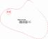
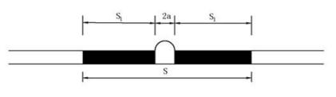
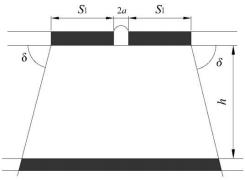
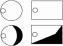
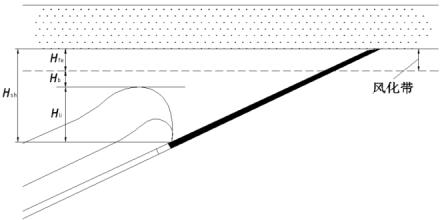

# 《矿山隐蔽致灾因素普查规范第1部分：总则》等3项矿山安全行业标准——国家矿山安全监察局公告2024年第2号

时效性：    现行有效

发文机关：  国家矿山安全监察局

文号：      国家矿山安全监察局公告2024年第2号

发文日期：  2024年10月12日

施行日期：  2024年11月01日

效力级别：  部门规范性文件

附件：

1.　KA/T 22.1—2024 矿山隐蔽致灾因素普查规范第1部分：总则

2.　KA/T 22.2—2024 矿山隐蔽致灾因素普查规范 第2部分：煤矿

3.　KA/T 22.3—2024 矿山隐蔽致灾因素普查规范 第3部分：金属非金属矿山及尾矿库

# 第 1 部分 : 总则

目       次

[前言  	   Ⅱ](#bookmark2)

[1    范围  	  1](#bookmark3)

[2    规范性引用文件  	  1](#bookmark4)

[3    术语和定义  	  1](#bookmark5)

[4    普查原则及基本要求  	  2](#bookmark6)

[5    普查准备  	  3](#bookmark1)

[6    普查实施  	  3](#bookmark1)

[7    普查成果编制及上报  	  4](#bookmark7)

[附录 A(资料性)    矿山隐蔽致灾因素普查工作方案编制提纲    	  5](#bookmark8)

[附录 B(资料性)    矿山隐蔽致灾因素普查报告编制提纲    	  6](#bookmark9)

[附录 C(规范性)    矿山隐蔽致灾因素普查成果文件编码    	  9](#bookmark10)

[参考文献  	  12](#bookmark11)

KA/T 22. 1—2024

前       言

本文件按照 GB/T 1 . 1—2020《标准化工作导则    第 1 部分:标准化文件的结构和起草规则》的规 定起草 。

KA/T 22—2024《矿山隐蔽致灾因素普查规范》包括如下部分:

— 矿山隐蔽致灾因素普查规范    第 1 部分:总则 ;

— 矿山隐蔽致灾因素普查规范    第 2 部分:煤矿 ;

— 矿山隐蔽致灾因素普查规范   第 3 部分:金属非金属矿山及尾矿库 。

本文件是 KA/T 22—2024《矿山隐蔽致灾因素普查规范》的第 1 部分 。

请注意本文件的某些内容可能涉及专利 。本文件的发布机构不承担识别专利的责任 。

本文件由国家矿山安全监察局安全基础司提出 。

本文件由矿山安全行业标准化技术委员会地质勘探分技术委员会归口 。

本文件起草单位:煤炭科学技术研究院有限公司 、矿冶科技集团有限公司 、中煤科工西安研究院(集 团)有限公司 、中煤科工集团重庆研究院有限公司 、中煤科工集团沈阳研究院有限公司 、中煤科工开采研 究院有限公司 、国家能源集团煤炭运输部 、中国中煤能源集团有限公司 、华电煤业集团有限公司 、华能煤 炭技术研究有限公司 、应急管理部研究中心 、中国矿山安全学会 、江西钨业控股集团有限公司 。

本文件主要起草人:霍中刚 、张俊英 、李宏艳 、李宏杰 、邓志刚 、杨小聪 、李健 、牟义 、管新邦 、李彬刚 、 徐华龙 、赵旭生 、王刚 、缪海宾 、吴拥政 、王勇 、李新华 、丛利 、范文亮 、胡兵 、申宝宏 、郑行周 、孙庆国 、陈何 、 于世波 、马西员 。

本文件为首次发布 。

矿山隐蔽致灾因素普查规范

第 1 部分:总则

1    范围

本文件规定了矿山隐蔽致灾因素普查(简称普查)的术语和定义 、普查原则及基本要求 、普查准备 、 普查实施 、普查成果编制及上报等内容 。

本文件适用于矿山企业对所属矿山(含尾矿库,下同)开展的矿山隐蔽致灾因素普查工作以及地方 政府组织的区域性矿山隐蔽致灾因素普查工作 。

2    规范性引用文件

下列文件中的内容通过文中的规范性引用而构成本文件必不可少的条款 。其中,注 日期的引用文 件,仅该日期对应的版本适用于本文件;不注日期的引用文件,其最新版本(包括所有的修改单)适用于 本文件 。

本文件没有规范性引用文件 。

3    术语和定义

下列术语和定义适用于本文件 。

3 . 1

矿山企业    mining enterprises

从事矿山生产与建设且具有法人资格的企业,是矿山的上级公司 。

3 . 2

矿山    mine

直接从事矿产资源生产或矿山建设的业务单元 。

3 .  3

矿山隐蔽致灾因素    hidden disaster-causing factors in mines

隐伏在矿体 、围岩 、坝(堆)体及其地基内,在矿山建设 、生产过程中可能诱发水 、火 、瓦斯 、冲击地压 、 滑坡及溃坝等重大灾害的致灾因素 。

注 1 :  煤矿隐蔽致灾因素包括采空区 、废弃井筒 、火区,封闭不良钻孔 、水源井 、油气井 、煤层气井,断层 、褶曲,地表水 体 、水利工程 、松散含水层 、基岩含水层 、陷落柱 、烧变岩 、离层水 、风氧化带 、古河床冲刷带 、剥离回填体 、隔水 层缺失区 、垮落带 、导水裂缝带 、底板采动导水破坏带,突出煤层 、突出危险区 、高瓦斯含量区(或高瓦斯压力 区) 、邻近煤(岩)层含瓦斯情况 、应力集中区 、煤层厚度异常变化区,厚硬顶板 、冲击倾向性 、上覆(下伏)遗留煤 柱 、孤岛煤柱 、地应力 、矿山压力,边坡软弱夹层 、古隆起 、古滑坡 、隐蔽火区 、排弃物基底等 。

注 2 :  金属非金属矿山隐蔽致灾因素包括采空区 、废弃井巷,褶皱 、断层 、节理 、层理,地表水体 、含水层 、导水构造带 、 强岩溶带 、垮落带 、封闭不良钻孔,原岩应力 、岩爆倾向性,高含硫矿岩 、自燃倾向性 、有毒有害气体,边坡岩体 ,   排土场地基 、排弃物料 、地下水等 。

注 3 :  尾矿库隐蔽致灾因素包括断层破碎带 、地表水体 、潜在不稳定岸坡 、泥石流 、溶洞 、土洞 、采空区 、特殊性岩土 、 尾矿堆积坝软弱层 、地下排洪构筑物缺陷等 。

3 .  4

生产区    production area

已完成井巷工程的回采和备采区域 , 以及正在进行掘进或采剥作业的区域 。

正在进行尾矿库堆存(或利用) 、排土作业的区域 。

3 . 5

规划区    planning area

矿山未来 3~5 年规划采掘/采剥作业的区域 。

尾矿库 、排土场未来 3~5 年规划堆存(或利用) 、排土作业的区域 。

3 .  6

其他区域    other area

除生产区和规划区之外的矿山所属区域 。

3 .  7

矿山隐蔽致灾因素普查工作    general survey of Hidden disaster-causing factors in mines

通过开展资料收集 、现场调查 、探查 、测试与试验等 , 查明矿山隐蔽致灾因素 , 确定影响矿山安全生 产的主要灾害风险 , 形成普查报告 , 以及普查结果数字化存储和信息化管理的全过程 。

3 .  8

地球物理勘探    geophysical exploration

以岩石或地层与其围岩的物理性质(如密度 、波速 、电阻率 、极化率 、磁性 、放射性等)差异为基础 , 用 专用的仪器观测和研究地球物理场的变化规律 , 进而查明地下一定空间内的介质结构 、物质组成的间接 性勘探方法 , 简称物探 。在地面开展的地球物理勘探 , 简称地面物探;在井下开展的地球物理勘探 , 简称 矿井物探;在钻孔内或钻孔间开展的地球物理勘探 , 简称钻孔物探 。

4    普查原则及基本要求

4 . 1    普查工作应坚持全面普查 , 周期实施 , 分区施策 , 常态补充的原则 。

a )    全面普查:应普查矿山范围内所有隐蔽致灾因素 ;

b )    周期实施:矿山应每 3 年开展一次隐蔽致灾因素普查工作 ;

c )    分区施策:根据生产区 、规划区和其他区域的条件及不同要求 , 开展普查工作 ;

d )    常态补充:根据矿山采掘(剥)工程的进展 , 相关区域性质发生的变化 , 矿山应按相关要求 , 开 展常态化探查及观测工作 , 补充和修正原有普查成果 。

4 . 2    矿山是隐蔽致灾因素普查的最小单元 。矿山及其上级企业具体责任分工如下:

a )    矿山及矿山企业是矿山隐蔽致灾因素普查的责任主体 , 应建立健全普查制度 , 负责普查报告 的审查 ;

b )    矿山是普查工作的实施主体 , 负责普查工作具体内容的落实和过程管控 ;

c )    矿山及矿山企业主要负责人(含法定代表人 、实际控制人 、实际负责人)是普查工作的第一责 任人 , 负责保障普查工作所需资金 、物资和人员 , 明确相关部门和人员的责任 ;

d )    矿山企业技术负责人是普查工作的技术责任人 , 负责技术指导与审核 ;

e )    矿山总工程师(技术负责人)是普查工作的技术责任人 , 负责具体组织实施和技术管理;矿山 的分管负责人 、各相关职能部门负责人在其职责范围内对普查工作负责 。

4 . 3    存在以下情况之一的 , 应重新开展普查工作:

a )    矿山生产规划发生重大改变或隐蔽致灾因素发生重大变化时 , 原有普查成果难以满足生产需 要的 ;

b )    矿山隐蔽致灾因素普查不清导致矿山一般及以上事故发生的 。

4 . 4    矿山可自行开展普查工作,也可整体或部分委托技术服务机构开展。

a )    自行开展普查的矿山应配备所普查灾害类型的技术人员,且各主要灾害的技术负责人应具备 相关专业的中级及以上职称 ;

b )    接受委托开展普查工作的技术服务机构,应具备开展普查工作的能力,拥有涵盖所普查灾害 类型的技术人员,且各主要灾害的技术负责人应具备相关专业的高级职称 ;

c )    矿山委托开展普查的技术服务机构不应超过 3 家,各服务机构承担委托范围内的技术责任。

4 . 5    宜应用新技术 、新装备 、新工艺开展矿山隐蔽致灾因素普查工作,提升矿山隐蔽致灾因素普查工作 的科技水平。

4 . 6    矿山隐蔽致灾因素普查应按照普查准备 、普查实施 、普查成果编制及上报的程序实施。

5    普查准备

5 . 1    收集矿山以往勘查 、开采历史 、生产现状,以及生产区 、规划区的相关报告 、图纸 、台账等资料,掌握 矿山的基本情况 、生产建设现状 、以往灾害(事故)情况 、地质概况等。

5 . 2    应按照以下要求开展现场调查 :

a )    地面调查应选用观测 、测绘 、填图 、采样等手段,调查矿山及其井(境)界外一定范围内的隐蔽 致灾因素相关内容 ;

b )    井下调查应选用观测 、素描 、采样等手段,调查井下隐蔽致灾因素相关内容。

5 . 3    根据现场调查成果,分析以往地质勘查 、隐蔽致灾因素普查资料的完整性及可靠性,确定本次普查 目标 、普查内容和普查方法,编制普查工作方案。

5 . 4    普查工作方案应包括以下内容(见附录 A) :

a )    矿山概况 ;

b )    普查机构设置 ;

c )    现有隐蔽致灾因素资料分析 ;

d )    普查工作目标及实施方案等。

5 . 5    普查工作方案审查应满足以下要求 :

a )    矿山隐蔽致灾因素普查工作方案应由矿山总工程师(技术负责人)组织审查 ;

b )    地方政府组织的区域性普查工作方案,应由地方政府分管负责人组织审查。

5 . 6    矿山隐蔽致灾因素普查应在资料分析和现场调查成果的基础上,对具有实际工程量支撑的实测资 料以及收集到的隐蔽致灾因素其他资料,评估其完整性和可靠性。 相关资料完整可靠的,可编制相应部 分的隐蔽致灾因素普查报告内容;否则应采用现场探查 、测试与试验等方法开展隐蔽致灾因素普查 工作。

6    普查实施

6 .  1    物探探测

6 . 1 . 1    设计:根据各类隐蔽致灾因素的特征以及地质条件 、人文条件,依据不同区域(生产区 、规划区 、 其他区域等)的探测程度要求,选择适宜的物探方法;确定物探范围 、测网(测线 、测点)布置以及施工参  数;制定实施计划及安全保障措施。

6 . 1 . 2    施工:按照相关规范,开展现场探测工作。

6 . 1 . 3    成果:评价物探采集数据质量,按照相关规范进行处理分析,初步掌握隐蔽致灾因素的几何特征 和属性特征,划定隐蔽致灾因素异常区,汇总物探工作量及成果,提出验证钻孔建议。

6 . 2    钻探探查

6 . 2 . 1    设计:根据探查目的,结合各类隐蔽致灾因素特征,确定适宜的钻探施工方式和钻孔数量;在地 面施工技术可行 、经济合理的情况下,优先选用地面钻孔,井下具备施工条件时,可设计井下钻孔,优先 选用定向钻孔;制定实施计划及安全保障措施。

6 . 2 . 2    施工:按照相关规范要求,开展现场钻探 、测井 、测斜 、取样等工作。

6 . 2 . 3    成果:评价钻探探查质量,按照相关规范进行处理分析,综合确定隐蔽致灾因素的几何特征和属 性特征,汇总钻探工作量及成果。

6 . 3    测试与试验

6 . 3 . 1    设计:根据探测 、探查目的,选择合适的测试与试验方法;制定实施计划及安全保障措施。

6 . 3 . 2    实施:按照相关规范,在现场开展测试与试验工作,并采集岩样 、水样或气样,在实验室进行参数 或成分等测定,获取隐蔽致灾因素的属性特征。

6 . 3 . 3    成果:根据测试与试验工作的成果,形成测试与试验报告。

7    普查成果编制及上报

7 . 1    综合各类隐蔽致灾因素普查成果,描述矿山存在的隐蔽致灾因素,分析矿山存在的灾害风险,编制 矿山隐蔽致灾因素普查报告。

7 . 2    矿山隐蔽致灾因素普查报告应包括以下内容(见附录 B) :

a )    矿山概况 ;

b )    以往与隐蔽致灾因素相关的地质勘查工作及质量评述 ;

c )    隐蔽致灾因素普查工作概述 ;

d )    分因素描述矿山隐蔽致灾因素普查工作及成果 ;

e )    矿山灾害风险评价及风险管控措施 ;

f )    结论与建议。

7 . 3    普查报告审查应满足以下要求 :

a )    矿山组织编制的隐蔽致灾因素普查报告,应由矿山企业技术负责人组织专家审查 ;

b )    地方政府组织的区域性普查,应由地方政府分管负责人组织专家审查 ;

c )    外聘专家专业应涵盖普查灾害类型,且外聘专家数量不少于专家总人数的一半。

7 . 4    矿山应建档留存以下普查资料 :

a )    现场调查 、测绘资料 ;

b )    报告中利用的原始资料及移交记录 ;

c )    分项普查工作的设计方案 、原始数据 、分项结果报告等过程资料 ;

d )    普查报告及其评审意见。

7 . 5    普查成果的信息化管理应符合以下要求 :

a )    矿山应建立矿山隐蔽致灾因素普查数据库或电子档案,根据矿山隐蔽致灾因素普查成果文件 编码(见附录 C),数字化管理矿山隐蔽致灾因素普查全过程涉及的报告 、图纸 、报表和台账等 图档数据 ;

b )    相关图档数据应留存 10 年以上。

7 . 6    矿山应当按照有关文件要求,将隐蔽致灾因素普查报告(含附图 、附表)及评审意见等资料上报至 属地矿山安全监管监察部门。

附    录    A

(资料性)

矿山隐蔽致灾因素普查工作方案编制提纲

A.  1     矿山概况

A. 2    普查机构设置

A. 3    现有隐蔽致灾因素资料分析

A. 3 .  1    采空区

A. 3 . 2    封闭不良钻孔

……

A. 4    矿山隐蔽致灾因素普查工作目标及实施方案 A. 5    附件

附    录    B

(资料性)

矿山隐蔽致灾因素普查报告编制提纲

封 1

矿山企业名称

矿山名称

隐蔽致灾因素普查报告

编码:110109002759A03BG100

| 矿山主要负责人 : | 姓名(签字) |
| ---------------- | ---------- |
| 矿山总工程师 :   | 姓名(签字) |
| 项目负责人 :     | 姓名(签字) |

提交单位:矿山名称

编制单位:编制单位名称

× ×年× ×月

封 2

矿山企业名称

矿山名称

隐蔽致灾因素普查报告

| 姓名 | 职称 | 从事专业 | 职责分工 | 签字 |
| ---- | ---- | -------- | -------- | ---- |
|      |      |          |          |      |
|      |      |          |          |      |
|      |      |          |          |      |
|      |      |          |          |      |
|      |      |          |          |      |

注 :  职责分工是指所负责的水 、瓦斯 、冲击地压/岩爆 , 滑坡 、溃坝等灾害普查内容。

提交单位:矿山名称

编制单位:编制单位名称

× ×年× ×月

0    前言

B. 1     矿山概况

B. 1 .  1     目的任务及编写依据

B. 1 . 2    矿山基本情况

B. 1 . 2 .  1     位置交通及自然地理 B. 1 . 2 . 2    矿权范围及周边关系

B. 1 . 2 . 3    矿山以往地质灾害(事故)情况 B. 1 . 3    矿山地质概况

B. 1 . 4    矿山建设生产情况

B. 1 . 5    未来 3~5 年生产规划

B. 2    以往与隐蔽致灾因素相关的地质勘查工作及质量评述 B. 2 . 1     以往地质勘查工作及质量评述

B. 2 . 2    以往灾害评价 、鉴定(评估)等工作

B. 2 . 3    以往矿山隐蔽致灾因素普查工作及质量评述

B. 3    隐蔽致灾因素普查工作概述

B. 3 . 1     隐蔽致灾因素普查领导机构

B. 3 . 2    各项工作完成单位及组织结构 B. 3 . 3    普查工作方案

B. 3 . 4    普查工作开展情况

B. 4    矿山隐蔽致灾因素普查工作及成果

B. 4 . 1    采空区

B. 4 . 1 . 1    资料分析 B. 4 .  1 . 2     施工方案 B. 4 .  1 . 3    现场工作 B. 4 .  1 . 4     普查成果 … …

B. 5    矿山灾害风险评价及风险管控措施

B. 5 . 1    水害

B. 5 . 2    瓦斯灾害 … …

B. 6    结论与建议 B. 7    附件

B. 7 .  1     普查单位营业执照 、资质 、委托书

B. 7 . 2    资料真实性承诺书 附图

附表

附    录    C

(规范性)

矿山隐蔽致灾因素普查成果文件编码

矿山隐蔽致灾因素普查成果文件编码共 20 位,由矿山或尾矿库编码(12 位)十矿山类别编码(1 位) 十普查阶段编码(2 位)十文件类别编码(2 位)十成果文件编号(3 位)组成 :

(1)矿山或尾矿库编码:代码用 12 位阿拉伯数字表示煤矿 、金属非金属矿山或尾矿库统一编码(见 表 C. 1) 。

(2)矿山类别编码:代码用 1 位大写汉语拼音字母表示(见表 C. 2) 。

(3)普查阶段编码:代码用 2 位阿拉伯数字表示(见表 C. 3) 。

(4)文件类别编码:代码用 2 位大写汉语拼音字母表示(见表 C. 4) 。

(5)成果文件编号:代码用 3 位阿拉伯数字(见表 C. 5 或 C. 6),第 1 位数字代表成果文件类别,第

2 、3 位中 00 代表汇总成果,01 至 99 代表分项成果。 如:封闭不良钻孔类别编码为 3,封闭不良钻孔汇 总表资料编码为 300,油气井普查成果统计表资料编号为 302 。

以某一井工煤矿普查成果报告为例,矿山企业编码为 110109002759,井工煤矿的矿山类别编码为 A,成果的普查阶段编码为 03,报告的文件类别编码为 BG,煤矿普查成果总结报告的普查成果文件编 码为 101,因此,某一井工煤矿普查成果总结报告的编码为:110109002759A03BG101 。

表 C. 1    矿山及尾矿库编码

| 矿山及尾矿库编码 |
| ---------------- |
| 省(2 位)         |

表 C. 2    矿山类别编码

| 编码 | 矿山类别           |
| ---- | ------------------ |
| A    | 井工煤矿           |
| B    | 露天煤矿           |
| C    | 金属非金属地下矿山 |
| D    | 金属非金属露天矿山 |
| E    | 尾矿库             |

表 C. 3    普查阶段编码

| 编码 | 普查阶段 |
| ---- | -------- |
| 01   | 资料收集 |
| 02   | 过程实施 |
| 03   | 成果总结 |

表 C. 4    文件类别编码

| 编码 | 资料类别 |
| ---- | -------- |
| BG   | 报告     |
| TZ   | 图纸     |
| BB   | 报表     |
| QT   | 其他     |

表 C. 5    煤矿普查成果文件编码

| 文件类别 | 文件编号                             | 成果文件资料                   |
| -------- | ------------------------------------ | ------------------------------ |
| 报告(BG) | 100                                  | 普查成果报告                   |
| 200      | 普查成果报告评审意见                 |                                |
| 300      | 普查工作方案                         |                                |
|          | ……                                   |                                |
| 图纸(TZ) | 100                                  | 隐蔽致灾因素普查综合成果图     |
| 200      | 采空区普查成果图                     |                                |
| 300      | 封闭不良钻孔普查成果图               |                                |
| 400      | 地质构造普查成果图                   |                                |
| 500      | 水源与通道普查成果图                 |                                |
| 600      | 瓦斯普查成果图                       |                                |
| 700      | 冲击地压普查成果图                   |                                |
| 800      | 露天煤矿边坡普查成果图               |                                |
|          | ……                                   |                                |
| 报表(BB) | 100                                  | 煤矿隐蔽致灾因素普查成果汇总表 |
| 110      | 煤矿隐蔽致灾因素普查实际工程量汇总表 |                                |
| 200      | 采空区综合普查成果汇总表             |                                |
| 300      | 封闭不良钻孔汇总表                   |                                |
| 400      | 地质构造普查成果汇总表               |                                |
| 500      | 水源与通道普查成果汇总表             |                                |
| 600      | 瓦斯普查成果汇总表                   |                                |
| 700      | 冲击地压普查成果汇总表               |                                |
| 800      | 露天煤矿边坡普查成果汇总表           |                                |
|          | ……                                   |                                |
| 其他(QT) | 100                                  | 营业执照                       |
| 200      | 安全生产许可证                       |                                |
| 300      | 采矿许可证                           |                                |
|          | ……                                   |                                |

表 C. 6    金属非金属矿山及尾矿库普查成果文件编码

| 类别编码 | 文件编码                                               | 成果文件资料                                     |
| -------- | ------------------------------------------------------ | ------------------------------------------------ |
| 报告(BG) | 100                                                    | 普查成果报告                                     |
| 200      | 普查成果报告评审意见                                   |                                                  |
| 300      | 普查工作方案                                           |                                                  |
|          | ……                                                     |                                                  |
| 图纸(TZ) | 100                                                    | 隐蔽致灾因素普查综合成果图                       |
| 200      | 采空区普查成果图                                       |                                                  |
| 300      | 地下矿山地质构造普查成果图                             |                                                  |
| 400      | 地下矿山水源与通道普查成果图                           |                                                  |
| 500      | 地下矿山地压活动区域普查成果图                         |                                                  |
| 600      | 地下矿山火区/高温异常区普查成果图                      |                                                  |
| 700      | 露天边坡普查成果图                                     |                                                  |
| 800      | 排土场普查成果图                                       |                                                  |
| 900      | 尾矿库普查成果图                                       |                                                  |
|          | ……                                                     |                                                  |
| 报表(BB) | 100                                                    | 金属非金属矿山及尾矿库隐蔽致灾因素普查成果汇总表 |
| 110      | 金属非金属矿山及尾矿库隐蔽致灾因素普查实际工程量汇总表 |                                                  |
| 200      | 采空区普查成果统计表                                   |                                                  |
| 210      | 废弃井巷普查成果统计表                                 |                                                  |
| 300      | 地下矿山地质构造普查成果统计表                         |                                                  |
| 400      | 地下矿山充水水源普查成果统计表                         |                                                  |
| 410      | 地下矿山充水通道普查成果统计表                         |                                                  |
| 500      | 地下矿山地压活动区域普查成果统计表                     |                                                  |
| 600      | 地下矿山火区/高温异常区普查成果统计表                  |                                                  |
| 700      | 露天边坡普查成果统计表                                 |                                                  |
| 800      | 排土场普查成果统计表                                   |                                                  |
| 900      | 尾矿库普查成果汇总表                                   |                                                  |
|          | ……                                                     |                                                  |
| 其他(QT) | 100                                                    | 矿山营业执照                                     |
| 200      | 矿山安全生产许可证                                     |                                                  |
| 300      | 矿山采矿许可证                                         |                                                  |
| …        | …                                                      |                                                  |

参    考    文    献

[1]    GB 16423—2020    金属非金属矿山安全规程

[2]    GB39496—2020    尾矿库安全规程

[3]  《国务院办公厅关于进一步加强煤矿安全生产工作的意见》(国办发〔2013〕99 号)

[4]  《中共中央办公厅 、国务院办公厅关于进一步加强矿山安全生产工作的意见》(国务院公报 2023 年第 26 号)

[5]    国务院安全生产委员会印发《关于防范遏制矿山领域重特大生产安全事故的硬措施》的通知 (安委〔2024〕1 号)

[6]  《国家矿山安全监察局关于全面开展煤矿隐蔽致灾因素普查治理工作的通知》(矿安〔2021〕 121 号)

[7]  《国家矿山安全监察局关于开展非煤地下矿山隐蔽致灾因素普查治理工作的通知》(矿安 〔2022〕76 号)

[8]  《国家矿山安全监察局关于加强煤矿隐蔽致灾因素普查治理工作的通知》(矿安〔2022〕132 号)

[9]  《国家矿山安全监察局综合司关于认真做好矿山隐蔽致灾因素普查工作的通知》(矿安综 〔2023〕37 号)

[10]  《煤矿安全规程》(应急管理部令第 8 号)

# 第 2 部分 : 煤矿

目       次

[前言  	   Ⅱ](#bookmark1)

[1    范围  	  1](#bookmark2)

[2    规范性引用文件  	  1](#bookmark3)

[3    术语和定义  	  2](#bookmark4)

[4    资料收集与分析  	  2](#bookmark5)

[5    采空区  	  2](#bookmark6)

[6    封闭不良钻孔  	  6](#bookmark7)

[7    地质构造  	  7](#bookmark8)

[8    水源与通道  	  9](#bookmark9)

[9    瓦斯 	  15](#bookmark10)

[10    冲击地压  	  18](#bookmark11)

[11    露天煤矿边坡  	  20](#bookmark12)

[12    成果提交  	  23](#bookmark13)

[附录 A(资料性)    煤矿隐蔽致灾因素普查资料收集清单  	  24](#bookmark14)

[附录 B(资料性)    煤矿隐蔽致灾因素普查主要物探方法现场布置  	  27](#bookmark15)

[附录 C(资料性)    煤矿隐蔽致灾因素普查成果表  	  31](#bookmark16)

[附录 D(资料性)    煤矿隐蔽致灾因素普查成果附图  	  60](#bookmark17)

[附录 E(规范性)    煤矿隐蔽致灾因素普查成果附图图例  	  63](#bookmark18)

[参考文献  	  67](#bookmark19)

KA/T 22. 2—2024

前       言

本文件按照 GB/T 1 . 1—2020《标准化工作导则    第 1 部分:标准化文件的结构和起草规则》的规 定起草 。

KA/T 22—2024《矿山隐蔽致灾因素普查规范》包括如下部分:

**— **矿山隐蔽致灾因素普查规范    第 1 部分:总则 ;

**— **矿山隐蔽致灾因素普查规范    第 2 部分:煤矿 ;

**— **矿山隐蔽致灾因素普查规范   第 3 部分:金属非金属矿山及尾矿库 。

本文件是 KA/T 22—2024《矿山隐蔽致灾因素普查规范》的第 2 部分 。

请注意本文件的某些内容可能涉及专利 。本文件的发布机构不承担识别专利的责任 。

本文件由国家矿山安全监察局安全基础司提出 。

本文件由矿山安全行业标准化技术委员会地质勘探分技术委员会归口 。

本文件起草单位:煤炭科学技术研究院有限公司 、中煤科工西安研究院(集团)有限公司 、中煤科工 集团重庆研究院有限公司 、中煤科工集团沈阳研究院有限公司 、中煤科工开采研究院有限公司 、陕西彬 长矿业集团有限公司 、国家能源集团宁夏煤业有限责任公司 、国能准能集团有限责任公司 、晋能控股装 备制造集团有限公司 、中煤资源发展集团有限公司 、中国矿山安全学会 。

本文件主要起草人:霍中刚 、李健 、牟义 、管新邦 、张俊英 、李宏艳 、李宏杰 、邓志刚 、刘善德 、王勇 、 吕贵春、唐辉、李明、徐刚、李彬刚、徐华龙、赵旭生、王刚、缪海宾、张震、刘学、贺海鸿、王占银、徐昆、贺光会、 赵忠证 、任鹏 、李阳 、马延崖 、杜明泽 、涂琦 、申宝宏 、郑行周 、舒龙勇 、赵善坤 、李文 、李建功 、李江华 。

本文件为首次发布 。

矿山隐蔽致灾因素普查规范

第 2 部分:煤矿

1    范围

本文件规定了煤矿隐蔽致灾因素普查的术语和定义 , 资料收集与分析 , 采空区 、封闭不良钻孔 、地质 构造 、水源与通道 、瓦斯 、冲击地压 、露天煤矿边坡等隐蔽致灾因素普查工作以及成果提交等内容。

本文件适用于煤矿隐蔽致灾因素普查工作以及地方政府组织的区域性煤矿隐蔽致灾因素普查 工作。

2    规范性引用文件

下列文件中的内容通过文中的规范性引用而构成本文件必不可少的条款。 其中 , 注 日期的引用文 件 , 仅该日期对应的版本适用于本文件;不注日期的引用文件 , 其最新版本(包括所有的修改单)适用于 本文件。

GB/T 212    煤的工业分析方法

GB/T 12719    矿区水文地质工程地质勘查规范

GB/T 23249    地勘时期煤层瓦斯含量测定方法

GB/T 23250    煤层瓦斯含量井下直接测定方法

GB/T 23561 . 1 ~ . 16    煤和岩石物理力学性质测定方法

GB/T 25216    煤与瓦斯突出危险性区域预测方法

GB/T 35056    煤矿巷道锚杆支护技术规范

GB/T 37807    露天煤矿井采采空区勘查技术规范

GB/T40130    煤矿专门水文地质勘查规范

GB40880    煤矿瓦斯等级鉴定规范

GB/T 50123    土工试验方法标准

GB/T 50266    工程岩体试验方法标准

MT/T 142    煤矿井下气体采样方法

MT/T 1090    煤炭资源勘查煤质评价规范

AQ 1080    煤的瓦斯放散初速度指标(△P)测定方法

KA/T 1    井下探放水技术规范

KA/T4    煤层底板采动破裂深度压水试验测试方法

KA/T 7    煤矿水化学分析方法

KA/T 9    煤矿地下水连通示踪试验方法

KA/T 1047    煤矿井下煤层瓦斯压力的直接测定方法

KA/T 22. 1    矿山隐蔽致灾因素普查规范    第 1 部分:总则

DZ/T0080    煤炭地球物理测井规范

DB/T 14    原地应力测量水压致裂法和套芯解除法技术规范

NB/T 35104    水电工程钻孔注水试验规程

《煤矿安全规程》

《建筑物 、水体 、铁路及主要井巷煤柱留设与压煤开采规范》

《防治煤矿冲击地压细则》

《煤矿防治水细则》

《防治煤与瓦斯突出细则》

《煤矿防灭火细则》

《煤矿地质工作细则》

《冲击地压矿井鉴定暂行办法》

3    术语和定义

KA/T 22. 1 界定的以及下列术语和定义适用于本文件 。

3 . 1

煤矿    coal mine

直接从事煤炭资源生产或建设的业务单元 , 包含井工煤矿和露天煤矿 。

3 . 2

物探测区    geophysical exploration area

地面物探圈定的连续封闭的探测区域 。

3 .  3

采空区极限安全厚度    goaf ultimate safe thickness

保证上部露天采矿作业设备和人员安全所需的井采采空区最小上覆岩体厚度 。

3 .  4

高瓦斯含量区    High gas content area

煤层瓦斯含量大于 6 m3 /t , 或大于区域平均煤层瓦斯含量 2 倍的区域 。

3 . 5

高瓦斯压力区    High gas pressure area

煤层瓦斯压力大于 0. 5  Mpa , 或大于区域平均煤层瓦斯压力 2 倍的区域 。

4    资料收集与分析

4 . 1    收集煤矿以往勘查 、开采历史 、生产现状 , 以及相关报告 、图纸 、台账等资料 , 掌握煤矿的基本情况 、 生产建设现状 、以往灾害(事故)情况 、地质概况等 , 资料收集清单参见附录 A。

4 . 2    通过调查走访 , 掌握煤矿的开采历史 、开采工艺 、地面及井下现状等情况 , 对收集的资料进行补充 完善 。

4 . 3    结合煤矿 3~5 年生产规划 , 分析以往地质勘查 、隐蔽致灾因素普查资料的完整性及可靠性 , 确定 隐蔽致灾因素普查的内容 、目标和方法 , 按照 KA/T 22. 1 编制隐蔽致灾因素普查工作方案 。

5    采空区

5 .  1     一般规定

5 . 1 . 1    普查范围包括可能引发煤矿灾害事故的煤矿井(境)界内的本矿开采形成的采空区 、历史遗留的 采空区(简称老窑) 、废弃井筒以及相邻矿井开采形成的采空区(巷道)等 。

5 .  1 . 2    主要普查内容如下:

a )    采空区形成的时间 、埋深 、位置 、面积 、采厚 、范围 、开采煤层等 , 开采方式 、采出率 、顶板控制方 式 、煤柱留设情况等 ;

b )    废弃井筒形式 、井口位置 、井口标高 、井筒结构 、断面尺寸 、井深/延伸方向 、封闭方法 、封闭材 料 、封闭质量等 ;

c )    采空区内积水面积 、水位标高 、水质 、积水量等 ;

d )    采空区内火区位置 、范围 、温度 、气体成分等 ;

e )    采空区内瓦斯及有毒有害气体成分等 ;

f )    采空区内顶板垮落情况等 ;

g )    采空区地表塌陷裂缝位置 、深度 、长度 、宽度 、延展方向 、导水漏风情况 、裂缝内温度 、气体成 分等 ;

h)    采空区密闭位置 、规格 、构建材料 、密闭方式 , 观测孔 、措施孔和放水孔情况 , 密闭墙内积水情 况 , 密闭墙体受压变形情况 , 密闭墙内外压差 , 密闭墙漏风情况等 。

5 . 1 . 3    应收集煤矿井(境)界内及井(境)界外 200 m范围内采空区资料 , 主要分析内容如下:

a )    采空区形成的时间 、埋深 、位置 、面积 、采厚 、范围 、开采煤层 、开采方式 、采出率 、顶板控制方 式 、积水情况 、自燃情况 、瓦斯及有毒有害气体情况 、顶板垮落情况 、地表塌陷裂缝情况 、地表 建(构)筑物情况 、采空区密闭 、露天采剥情况等 ;

b )    废弃井筒类型 、井口位置 、井口标高 、井筒结构 、断面尺寸 、井深/延展情况 、封闭方法 、封闭材 料 、积水积气情况等 。

5 . 1 . 4    采空区现场调查的主要内容如下:

a )    掌握地形地貌情况 , 标识地表建(构)筑物 、废弃井筒井口的位置等 ;

b )    掌握采煤塌陷裂缝的分布位置 、展布情况 , 调查地表浅层温度 、气体异常 , 辅助判断疑似采空 区火区位置 ;

c )    掌握井下采空区密闭 、探放水孔等流量 、水压 、温度 、瓦斯等参数 , 辅助判断采空区积水范围 、 瓦斯积聚等情况 ;

d )    结合《煤矿安全规程》、《煤矿防灭火细则》等规定 , 校对自然发火束管监测 、温度传感器 、采空 区密闭观测数据等资料 , 掌握自然发火指标性气体 、温度异常等情况 , 判断采空区自燃情况 。

5 . 1 . 5    应结合资料分析 、现场调查成果 , 按照 KA/T 1 规定划定采空区积水线 、探水线 、警戒线 。 资料 分析和现场调查未查明的采空区 , 应采用以下方法进行现场探查:

a )    采用地面物探探测 , 并对对异常区井下地面钻探验证 , 按照 KA/T 1 规定修订采空区积水线 、 探水线 、警戒线 ;

b )    地面探查未查明或不具备地面探查条件的 , 采用矿井物探及井下钻探进行探查 。

5 . 1 . 6    采空区普查应在资料分析和现场调查成果的基础上 , 评估具有实际工程量支撑的实测资料以及 收集到的采空区其他相关要素资料的完整性和可靠性 。相关资料完整可靠的 , 可编制采空区普查章节 报告;否则应开展物探 、钻探 、测试与试验等工作 。

5 . 2    地面物探探测

5 . 2 . 1    生产区和规划区及其影响范围内的未查明采空区 , 应采用地面物探方法查明几何特征 、属性特 征;其他区域应采用地面物探查明采空区位置 、范围 。

5 . 2 . 2    地面物探范围应包含初步推断的采空区和外延区 , 外延区为初步推断的采空区边界向外延展的 范围 , 外延范围应不少于 100 m 。

5 . 2 . 3    地面物探方法应结合地质 、地形地貌条件 、采空区和地层物性特征 、干扰源特征等信息综合 确定:

a )    探测深度小于或等于 150 m 的采空区可选用探地雷达法 、高密度电阻率法 、直流电测深法(电

剖面法) 、瞬变电磁法或地震勘探等 ;

b )    探测深度大于 150 m 的采空区可选用瞬变电磁法 、直流电测深法(电剖面法) 、可控源音频大 地电磁法 、大地电磁法或地震勘探等 。

5 . 2 . 4    地面物探应根据地质任务 、探测方法等确定测网密度:

a )    生产区和规划区及其影响范围内的采空区地面物探方法测网密度可参照附录 B 中表 B. 1 ;

b )    废弃井筒地面物探方法测网密度可参照附录 B 中表 B. 2 ;

c )    其他区域的采空区地面物探方法测网密度可参照附录 B 中表 B. 3 。

5 . 3    矿井物探探测

5 . 3 . 1    矿井物探探测工作应符合《煤矿防治水细则》要求 。

5 . 3 . 2    矿井物探方法应结合施工位置 、探测 目标 、采空区和地层物性特征 、干扰源特征等信息综合 确定:

a )    掘进工作面超前物探可选用瞬变电磁法 、直流电法 、地震勘探(含槽波地震勘探)或探地雷达 法等 ;

b )    巷道侧帮和回采工作面区域物探可选用瞬变电磁法 、无线电波透视法 、地震勘探(含槽波地震 勘探)或直流电法等 。

5 . 3 . 3    矿井物探工作应根据地质任务 、探测方法等确定测线测点布置 , 可参照附录 B 中表 B. 4 。

5 . 4    井工煤矿地面钻探探查

5 . 4 . 1    地面钻探钻孔数量根据物探测区及物探圈定的异常区数量 、面积综合确定 , 终孔深度应进入 目 标采空区或穿过目标煤层底板至少 5 m 。

5 . 4 . 2    地面钻探应进行编录 、测斜等工作 , 通过分析岩芯采取率 、掉钻 、卡钻 、埋钻 、吸风 、漏水量 、水位 深度 、起火(冒烟 、冒气)及埋深数据 , 判断采空区位置 、积水 、火区及有毒有害气体等情况 。

5 . 5    露天煤矿钻探探查

5 . 5 . 1    采空区钻探验证工作应结合物探测区 、物探圈定的异常区及采剥计划开展 。

5 . 5 . 2    对于物探圈定的异常区 , 每个物探测区应布置不少于 3 个验证钻孔 。

5 . 5 . 3    发现多处采空区空间关系不明确 、有外延扩大趋势或剥采过程中发生地表局部塌陷 、地层不连 续等现象 , 验证钻孔应不少于 5 个 。

5 . 5 . 4    采空区钻探应进行编录 、测斜等工作 , 通过分析岩芯采取率 、掉钻 、卡钻 、埋钻 、吸风 、漏水量 、水 位深度 、起火(冒烟 、冒气)及埋深数据 , 验证采空区位置 、范围及积水 、火区及有毒有害气体等情况 。

5 . 5 . 5    上覆岩层厚度达到已知采空区极限安全厚度前 , 应开展顶板安全探查工作 , 编制钻探方案 , 主要 内容如下:

a )    采空区极限安全厚度应按照 GB/T 37807 估算 ;

b )    应设计不少于 2 条跨越采空区勘探线 , 钻探孔间距应满足孔间测试的需要 , 且不少于 6 个 钻孔 ;

c )    应采用钻孔电视探查采空区顶板垮落裂隙情况 ;

d )    应采用钻孔三维激光扫描探查悬顶采空区范围 、空腔体积 、边界等情况 ;

e )    应采用声呐探查含水区情况 。

5 . 6    井下钻探探查

5 . 6 . 1    井下验证钻孔组数 、个数应能验证物探圈定的异常区 , 钻孔布设 、孔径 、方位 、倾角 、深度等技术 要求 , 应按照《煤矿防治水细则》井下探放水要求执行 。

5 . 6 . 2    井下钻探应通过分析卡钻 、夹钻 、吸风 、漏水量 、水位深度 、起火(冒烟 、冒气)情况及埋深数据 , 分 析和验证采空区位置 、范围 、积水 、火区 、瓦斯及有毒有害气体情况 。

5 . 6 . 3    井下钻探应根据探查目的 , 综合确定观测方法:

a )    探查采空区火区温度时 , 可采用钻孔测温法 ;

b )    探查采空区顶板局部垮落 、悬顶区域 、充填体状态时 , 可采用钻孔窥视方法 ;

c )    探查采空区密闭厚度 、保护煤柱宽度时 , 可采用钻孔窥视方法 。

5 . 7    测试与试验

5 . 7 . 1    通过钻孔 、密闭孔等现场实测采空区气体成分和温度等 。

5 . 7 . 2    通过地面钻孔简易水文观测现场实测采空区积水情况等 。

5 . 7 . 3    通过井下钻孔 、密闭孔等现场实测采空积水区的水压 、水温等 。

5 . 7 . 4    通过钻孔 、密闭孔等采集采空区积水 、气体等样品 , 测定采空区积水水质 、气体成分等相关属性 要素 。 当不具备抽取气样条件时 , 视为采空区 、废弃井筒 、密闭巷道内有瓦斯及有毒有害气体 。

5 . 7 . 5    采空区气体采样应按照 MT/T 142 执行 。

5 . 7 . 6    采空区积水应开展水化学分析 , 具体化学检测指标 、水样采集处理 、测定方法 、测定结果的整理 和校核等按照 KA/T 7 执行 。

5 . 7 . 7    应采用气相色谱仪或鉴定管等对收集的气样进行以下测定工作:

a )    测定 O2   浓度 , CO、烷烃 、烯烃和炔烃等自然发火标志性气体成分 ;

b )    测定 H2 S、NO2 、SO2 、NH3  、H2 、CH4  、CO2 、CO等有毒有害气体成分 。

5 . 8    普查程度及危险性分析

5 . 8 . 1    对于生产区和规划区及其影响范围内的采空区 , 应查明以下要素 , 并分析其危险性:

a )    查明采空区开采煤层 、开采方式 、采深 、采厚 、范围 , 掌握采空区的基本情况 ;

b )    查明采空区积水面积 、水位标高 、积水量及水质 , 确定积水线 、探水线和警戒线 , 分析透水 、淹 井风险 ;

c )    查明采空区内火区位置 、温度 、标志性气体成分 , 煤自然发火状态 、采空区 自然发火危险区域 , 分析采空区遗煤自燃 、火区爆炸等风险 ;

d )    查明采空区内瓦斯及有毒有害气体成分 、积聚情况 , 分析有毒有害气体泄漏 、瓦斯爆炸等 风险 ;

e )    查明采空区悬顶及垮落情况 , 分析瓦斯异常涌出 、工作面压架 、离层突水 、冲击地压等风险 ;

f )    查明采空区地表塌陷裂缝导水 、漏风情况 , 分析地表水体对采空区的补给情况 , 分析淹井 、溃 水 、边坡失稳 、滑坡等风险 ;

g )    查明采空区密闭分布位置 、规格情况 、墙体及周边完整程度 、漏风返水情况 , 分析采空区密闭 的防灾能力 ;

h)    查明废弃井筒类型及尺寸 、井口位置及标高 、封闭方法及质量 、导水漏风等情况 , 分析废弃井 筒可能存在的安全风险 。

5 . 8 . 2    其他区域的采空区 , 应查明其位置 、范围等情况 , 并分析其是否对生产区和规划区产生影响 。

5 . 9    普查结论

5 . 9 . 1    采空区普查结论应包括资料收集分析 、现场探查 、测试与试验等工作量 , 普查成果 、普查程度 、危 险性分析及防治措施等内容 , 并在附录 C 中表 C. 1 和表 C. 2 体现 。

5 . 9 . 2    应编制采空区综合普查成果汇总表 、采空区普查成果统计表和废弃井筒普查成果统计表(见附 录 C 中表 C. 3 、C. 3. 1 、C. 3. 2) 。

5 . 9 . 3    应按照附录 D及附录 E 的要求,绘制采空区普查成果图 。

6    封闭不良钻孔

6 .  1     一般规定

6 . 1 . 1    普查范围包括煤矿井田边界内可能引发煤矿灾害事故的地质勘查 、开发与利用过程中形成的未 封闭 、位置不清 、封孔情况不明 、封孔质量不合格 、遗留钻具的钻孔,水源井 、油气井 、煤层气井等封闭不 良钻孔分布情况 。

6 .  1 . 2    主要普查内容如下 :

a )    封闭不良钻孔类型 、施工时间 、钻孔坐标 、钻孔深度 、终孔层位 、钻遇煤层 、钻孔孔斜 、揭露情况 及与采场的空间关系 ;

b )    封闭不良钻孔的孔身及套管与固井情况,包括钻孔孔身结构 、套管及固井深度 、固井材料等 ;

c )    封闭不良钻孔的封孔情况,包括封闭层段 、封闭层位 、封孔材料 ;

d )    地质勘查遗留钻具钻孔中遗留钻具类型 、规格 、长度及遗留层段;遗留套管钻孔中套管规格 、 长度及遗留层段 ;

e )    封闭不良钻孔可能导通的含水层 、采空区或含气层情况等 ;

f )    油气井 、煤层气井和水源井的在用情况 。

6 . 1 . 3    应收集煤矿井田边界内封闭不良钻孔资料,主要分析内容如下 :

a )    封闭不良钻孔类型 、施工时间 、钻孔坐标 、钻孔深度 、终孔层位 、钻遇煤层 、钻孔孔斜 、揭露情 况 、孔身及套管与固井情况 、封孔情况,钻孔周边富水性,封闭不良钻孔与采场的空间关系,可 能导通的含水层 、采空区或含气层情况 ;

b )    地质勘查遗留钻具 、套管情况 ;

c )    油气井 、煤层气井和水源井的在用情况 。

6 . 1 . 4    封闭不良钻孔现场调查的主要内容如下 :

a )    具有自主权的封闭不良钻孔,确定资料完整性 ;

b )    煤矿井(境)界内的油气井 、煤层气井,应与油气井 、煤层气井相关方核对资料准确性 ;

c )    调查 、实测水源井孔深 、含水层层位 、在用情况等 。

6 . 1 . 5    应参照《煤矿地质工作细则》,对煤矿井田边界内的全部钻孔按照钻孔类型划分封闭良好钻孔和 封闭不良钻孔,建立封闭不良钻孔汇总表(见附录 C 中表 C. 4);应根据封闭不良钻孔类型(具有 自主权 的封闭不良钻孔 、油气井 、煤层气井 、水源井),分类建立统计表(见附录 C 中表 C. 4. 1~表 C. 4. 3) 。

6 . 1 . 6    对于煤矿井田边界内的封闭不良钻孔,应开展以下工作 :

a )    钻孔坐标清楚的,应在采掘工程平面图 、矿井充水性图和矿井瓦斯地质图等图中标注 ;

b )    钻孔坐标不清的,应预测封闭不良钻孔的疑似靶区,标出警戒范围 ;

c )    生产区 、规划区及其影响范围内资料不清的封闭不良钻孔,应采用以下方法进行现场探查 :

**— **采用矿井物探方法探测封闭不良钻孔的富水性 ;

**— **采用井下钻探方法探查封闭不良钻孔的含(导)水或积气情况 。

6 . 1 . 7    封闭不良钻孔普查应在分析已有资料和现场调查成果的基础上,对具有实际工程量支撑的实测 资料以及收集到的封闭不良钻孔其他相关要素资料,评估其完整性和可靠性 。相关资料完整可靠的,可 编制封闭不良钻孔普查章节内容;否则应开展物探 、钻探 、测试与试验等工作 。

6 . 2    矿井物探探测

6 . 2 . 1    矿井物探方法应结合施工位置 、钻孔属性和地层物性特征 、干扰源特征等信息综合确定,可选用 矿井瞬变电磁法 、直流电法或钻孔物探等探测封闭不良钻孔富水性 。

6 . 2 . 2    矿井物探工作应根据地质任务 、探测方法等确定测线测点布置 , 可参照附录 B 中表 B. 4 、B. 5 。

6 . 3    井下钻探探查

对封闭不良钻孔的富水范围异常区 , 应开展井下超前钻探验证 , 验证钻孔的布设及数量应根据封闭 不良钻孔的特点确定。

6 . 4    测试与试验

对物探异常区实施的井下探查验证钻孔 , 孔内出水时应观测水压和涌水量 , 采集水样并分析水源 ; 孔内出气时应采集气样 , 测定气体成分 , 水/气样测定应按照本文件 5. 7 执行。

6 . 5    普查程度及危险性分析

对于煤矿井田范围内的封闭不良钻孔 , 应查明以下要素 , 并分析其对开采的影响及危险性:

a )    查明封闭不良钻孔类型 、施工时间 、钻孔坐标 、钻孔深度 、终孔层位 、钻遇煤层 、钻孔孔斜 、孔身 及套管与固井情况 、封孔情况 , 钻孔周边富水性 , 封闭不良钻孔与采场的空间关系 , 可能导通 的含水层 、采空区或含气层情况以及生产揭露情况 , 分析封闭不良钻孔透水 、漏气可能性 ;

b )    查明地质勘查钻孔遗留钻具 、套管情况的层位 , 分析与开采煤层的空间关系 , 提出避免当掘进 机或割煤机误切割遗留钻具 、套管 , 产生火花 、弹射伤人或导致瓦斯爆炸等事故的安全措施 ;

c )    查明油气井 、煤层气井和水源井的在用情况 , 分析其漏气 、透水的可能性。

6 . 6    普查结论

6 . 6 . 1    封闭不良钻孔普查结论应包括资料收集分析 、现场探查 、测试与试验等工作量 , 普查成果 、普查 程度 、危险性分析及防治措施等内容 , 并在附录 C 中表 C. 1 和表 C. 2 体现。

6 . 6 . 2    应根据普查成果 , 补充完善封闭不良钻孔汇总表 、具有自主权的封闭不良钻孔普查成果统计表 、 油气井普查成果统计表以及水源井普查成果统计表(见附录 C 中表 C. 4 、C. 4. 1~C. 4. 3) 。

6 . 6 . 3    应按照附录 D及附录 E 的要求 , 绘制封闭不良钻孔普查成果图。

7    地质构造

7 .  1     一般规定

7 . 1 . 1    普查范围包括煤矿井(境)界内可能引发水 、瓦斯 、顶板 、冲击地压 、滑坡等煤矿灾害事故的断层 、 褶曲赋存情况。

7 .  1 . 2    主要普查内容如下 :

a )    落差大于 5  m 的断层的性质 、产状 、发育规模 、含(导)水性 、断层两侧含(隔)水层对接情况及 水力联系等 ;

b )    主要褶曲的类型 、产状 、展布范围等。

7 . 1 . 3    应收集煤矿井(境)界内地质构造资料 , 主要分析内容如下:

a )    断层的性质 、产状 、发育规模 、含(导)水性等情况 ;

b )    主要褶曲的位置 、类型 、延展范围等情况。

7 . 1 . 4    采剥揭露或井巷穿过的 、具备观测条件的地质构造 , 现场调查的主要内容如下:

a )    断裂构造产状 、断距 、断层带宽度 , 观测断裂带充填物成分 、胶结程度及导水性等 ;

b )    褶曲的形态 、产状及破碎情况等。

7 . 1 . 5    资料分析 、现场调查未查明的地质构造 , 应采用以下方法进行现场探查:

a )    影响生产区安全开采的地质构造探测以矿井物探为主 ;

b )    影响规划区安全开采的地质构造探测以地面物探为主;不具备地面物探条件或地面物探未查 明的 , 应采用矿井物探方法进行探测 ;

c )    对于物探发现的地质构造异常区 , 应根据异常区特征以及现场条件 , 选择合理的钻探方式进 行验证 。

7 . 1 . 6    地质构造普查应在分析已有资料和现场调研成果的基础上 , 对具有实际工程量支撑的实测资料 以及收集到的地质构造其他相关要素资料 , 评估其完整性和可靠性 。相关资料完整可靠的 , 可编制地质 构造普查章节内容;否则应开展物探 、钻探 、测试与试验等工作 。

7 . 2    地面物探探测

7 . 2 . 1    地面物探方法应结合地质 、地形地貌条件 、地质构造和地层物性特征 、干扰源特征等信息综合 确定:

a )    埋深小于或等于 150 m 的地质构造可选用电磁法 、电阻率法或地震勘探等 ;

b )    埋深大于 150  m 的地质构造可选用地震勘探或电磁法等 。

7 . 2 . 2    地面物探应根据地质构造特点和探查 目 的合理选择测网密度 , 具体测网密度可参照附录 B 中 表 B. 6 , 需确定目标体的边界或任务要求较高等特殊情况时应加密控制 。

7 . 3    矿井物探探测

7 . 3 . 1    矿井物探方法应结合施工位置 、探测 目标 、地质构造和地层物性特征 、干扰源特征等信息综合 确定:

a )    掘进工作面构造探测可选用地震勘探 、电法或钻孔物探等方法 ;

b )    回采工作面构造探测应采用槽波地震勘探或无线电波透视法等方法 , 对富水构造应采用直流 电法 、音频电透视法或瞬变电磁法等方法探测 , 应采用至少 2 种方法 。

7 . 3 . 2    矿井物探工作应根据地质任务 、探测方法等确定测线测点布置 , 可参照附录 B 中表 B. 4 、B. 5 。

7 . 4    地面钻探探查

对于生产区 、规划区内有富水异常且落差大于 30 m 的断层 , 宜采用地面钻探验证 , 并编制专项探 查设计 。

7 . 5    井下钻探探查

对物探圈定的构造富水异常区应开展井下钻探验证 , 探水钻孔沿掘进方向的正前方及含水体方向 呈扇形布置 , 钻孔不得少于 3 个 , 其中含水体方向的钻孔不得少于 2 个 。

7 . 6    测试与试验

7 . 6 . 1    地质构造钻探探查应开展以下现场试验:

a )    地面验证钻探应开展钻孔取芯 、地质编录 、测井 、分析测试 , 验证含(导)水性时 , 应开展水文地 质抽(注)水等试验工作 ;

b )    井下验证钻探应进行钻孔测斜 、探放水观测 、岩屑编录 、水头压力测试等 。

7 . 6 . 2    确定断层构造的导(含)水性 , 必要时应利用地面或井下钻孔开展抽(放)水连通(示踪)试验:

a )    抽(放)水试验应按照 GB/T 40130 进行 ;

b )    连通(示踪)试验应按照 KA/T 9 进行 。

7 . 6 . 3    含(导)水地质构造钻探探查应采集构造水样 , 并进行水质测定 , 水样测定内容见 5. 7. 6 。

7 . 7    普查程度及危险性分析

7 . 7 . 1    对于生产区 、规划区内的地质构造 , 应查明以下要素 , 并分析其危险性:

a )    查明规划区内的主要向 、背斜褶曲构造,落差大于 5  m 的断层,分析其对采区开拓布置的 影响 ;

b )    查明生产区域内回采工作面落差大于 5  m 的断层,地质构造与采掘工作面的空间关系,分析 其突水危险性 、瓦斯异常涌出以及对工作面布置和回采的影响 。

7 . 7 . 2    对于其他区域的地质构造,应查明以下要素,并分析其对安全生产的影响 :

a )    查明煤矿边界断层情况,边界断层与本矿的位置关系及延展情况,分析其对开拓准备的影响 ;

b )    查明煤矿井(境)界内的断层 、褶曲情况,分析其对生产区 、规划区安全生产的影响 。

7 . 8    普查结论

7 . 8 . 1    地质构造普查结论应包括资料收集分析 、现场探查 、测试与试验等工作量,普查成果 、普查程度 、 危险性分析及防治措施等内容,并在附录 C 中表 C. 1 和表 C. 2 体现 。

7 . 8 . 2    应编制地质构造普查成果汇总表(见附录 C 中表 C. 5) 。

7 . 8 . 3    应按照附录 D及附录 E 的要求,绘制地质构造普查成果图 。

8    水源与通道

8 .  1     一般规定

8 . 1 . 1    普查范围包括煤矿井(境)界内及周边影响煤矿安全生产的河流 、湖泊 、水库 、池塘 、冲沟 、融雪等 地表水体及水利工程,可能引发煤矿突(透)水的松散含水层 、基岩含水层 、烧变岩 、离层水 、风氧化带 、古 河床冲刷带 、剥离回填体 、采空区积水以及废弃井筒积水等地下含水体,以及可能引发煤矿水害的垮落 带 、导水裂缝带 、底板采动导水破坏带 、陷落柱 、地质构造 、封闭不良钻孔等导水通道情况 。

8 .  1 . 2    主要普查内容如下 :

a )    地表水体及水利工程主要普查内容 :

**— **河流 、湖泊 、水库 、池塘 、冲沟 、露天采坑等地表水体的位置 、流量 、水位 、水量 、水质 ;

**— **当地历年降水量和最高洪水位 ;

**— **地表防排水设施 、堤坝 、沟渠 、排水沟的位置 、汇水 、疏水情况,上游水库及其集中放水 情况 ;

**— **河流 、泄洪道的阻塞情况 ;

**— **塌陷区 、积水区 、地裂缝区分布情况及地表汇水情况 ;

**— **地表水体与地下水的补给关系,及其与煤矿连通通道 。

b )    地下含水体主要普查内容 :

**— **含水层的岩性 、厚度 、分布范围 、埋藏条件,含水层的渗透性 、水位 、水质类型及富水性分 区,地下水的补给 、径流 、排泄条件 ;

**— **隔水层的分布情况 、稳定性 、隔水性 ;

**— **富水性中等及以上的半固结或较松散砂砾含水层的厚度 、胶结程度等 ;

**— **底板高承压灰岩含水层的岩溶(裂隙)分布 、径流特征 、富水性 、水压 、隔水层厚度 、补给的 途径,以及与导水断裂构造 、陷落柱的关系 ;

**— **烧变岩的分布范围 、结构特征 、孔隙裂隙发育程度 ;

**— **顶板离层发育条件 、层位,及其与含水层 、导水构造的补给关系 ;

**— **风氧化带的发育深度 、风化特征,及其与各含水层 、地表水的连通情况 ;

**— **古河床冲刷带的位置 、深度以及富水性 ;

**— **回填区的围岩界限及底界面标高层位 ;

**— **采空区以及废弃井筒积水普查内容见本文件第 5 章 。

c )    导水通道主要普查内容 :

**— **垮落带 、导水裂缝带的发育高度 ;

**— **底板采动导水破坏带的发育深度 ;

**— **陷落柱的发育位置 、空间形态 、充填物性质 、含(导)水性等 ;

**— **地质构造普查内容见本文件第 7 章 ;

**— **封闭不良钻孔普查内容见本文件第 6 章 。

8 . 1 . 3    水源与通道普查应收集相关资料,主要分析内容如下 :

a )    地表水体及水利工程普查应通过资料收集,主要分析内容 :

**— **地表水体的历史最高洪水位 、最大流量 、积水量 、最大洪水淹没范围 ;

**— **历年降水量 ;

**— **煤矿井口和工业场地内建筑物的地面标高 ;

**— **上游水库集中放水情况 ;

**— **井(境)界内及周边江 、河 、湖 、水库等大型地表水体动态变化规律 。

b )    地下含水体普查应通过资料收集,主要分析内容 :

**— **煤矿及相邻煤矿的水文地质勘查成果,煤矿含(隔)水层的厚度 、分布范围 、岩性等情况, 含水层水位 、单位涌水量 、渗透系数等水文地质参数 ;

**— **煤矿近 3 年正常 、最大涌水量,煤矿及周边煤矿突(透)水情况 、水文观测等情况 ;

**— **煤矿及邻近煤矿历史发生的离层水害事故及相关涉险事件,生产区 、规划区内的煤层覆 岩岩性 、岩体强度及变形参数 ;

**— **相邻煤矿 200 m 范围内采掘工程情况 。

c )    导水通道普查应通过资料收集,主要分析内容 :

**— **煤层埋深 、倾角 、层间距 、开采方式 、采厚等参数 ;

**— **煤层上覆 、下伏岩层的岩性 、厚度 、单轴抗压强度等参数 ;

**— **垮落带 、导水裂缝带或底板采动导水破坏带实测成果 ;

**— **陷落柱的勘探及揭露情况 ;

**— **地质构造资料收集应掌握的内容见本文件第 7 章 ;

**— **封闭不良钻孔资料收集应掌握的内容见本文件第 6 章 。

8 . 1 . 4    水源与通道地表现场调查的主要内容及要求如下 :

a )    地表水体及水利工程地表现场调查的主要内容 :

**— **调查地表水体的位置 、范围 ;

**— **河流 、泄洪道的阻塞情况 ;

**— **塌陷区 、积水区 、地裂缝区分布及地表汇水 、疏水情况 。

b )    地表水体地表现场调查应符合以下要求 :

**— **合理选用航测遥感 、全球定位导航系统(GNSS) 、载波相位差分技术(RTK) 、无人机 、流量 仪 、流速仪等仪器设备开展现场调查与测量工作 ;

**— **地表水体调查应填写地表水体综合调查表(见附录 C 中表 C. 6. 1) 。

c )    地下含水体地表调查的主要内容 :

**— **由开采或地下水活动诱发的地貌变化及岩溶塌陷的形态 、分布范围 ;

**— **煤矿井(境)界及周边影响范围内的地下含水体的出水点分布范围 ;

**— **松散覆盖层的分布范围 、性质 ;

**— **回填区松散体的分布范围 ;

**— **水文观测孔的孔位 、观测层位 、水位 、水温 。

8 . 1 . 5    水源与通道井下现场调查的主要内容如下 :

a )    井巷穿过的 、具备观测条件的地下含水体 , 井下调查的主要内容:

**— **出水含水层岩性 、构造 、裂隙或岩溶的发育与充填情况 , 揭露点的位置及标高 、出水形式 、 涌水量和水温等 , 并采取水样进行水质分析 ;

**— **裂隙产状 、长度 、宽度 、数量 、形状 、尖灭情况 、充填物等 ;

**— **地质构造现场调查内容见本文件第 7 章 ;

**— **陷落柱内外地层岩性与产状 、裂隙与岩溶发育程度及涌水等 ;

**— **井下主要涌/出水点的位置 、水量 、水温 、水质 、出水形式 , 出水点层位 、岩性及围岩破坏情 况等 。

b )    井巷穿过的 、具备观测条件的陷落柱 , 主要调查其岩溶形态 、发育情况 、分布状况 、充填物成分 及充水状况等 。

8 . 1 . 6    存在与充水含水层有直接水力联系的地表水体连通通道的 , 应采用测试与试验的方法开展地表 水体及水利工程现场探查工作 。

8 . 1 . 7    生产区 、规划区内存在以下情形之一的 , 应开展地下含水体现场探查工作:

a )    影响煤矿生产的主要含水体未开展过水文地质勘探工作的 ;

b )    原勘探工作量不足 , 水文地质条件未查清或未查明相对富水区的 ;

c )    采掘揭露煤岩层后 , 水文地质条件比原勘探报告复杂的 ;

d )    水文地质条件发生较大变化 , 原有勘探成果难以满足生产建设需要的 ;

e )    开拓延深 、开采新煤系(组)或扩大井田范围设计需要的 ;

f )    采掘工程位于特殊地质条件部位 , 强富水松散含水层下提高煤层开采上限或强富水含水层上 带压开采 , 专门防治水工程设计 、施工需要的 ;

g )    井巷工程穿过强含水层或地质构造异常带 , 防治水工程设计 、施工需要的 。

8 . 1 . 8    地下含水体现场探查应根据探查目的及现场条件等情况 , 合理选择探查方法:

a )    含(隔)水层的水文地质参数不清的 , 应以钻探为主 , 并配合抽(放)水试验 、水质化验进行 普查 ;

b )    生产区 、规划区内含水层富水区分布不清的 , 应以电(磁)法勘探为主 , 并进行钻探验证 ;

c )    生产区 、规划区内古河床冲刷带等不清的 , 应以电(磁)法勘探和地震勘探为主 , 并进行钻探 验证 ;

d )    含水层之间或含水层与导水构造之间水力联系不清的 , 应以抽(放)水试验 、连通(示踪)试验 为主进行普查 。

8 . 1 . 9    导水通道普查应符合以下要求:

a )    垮落带 、导水裂缝带发育高度可按照《建筑物 、水体 、铁路及主要井巷煤柱留设与压煤开采规 范》中的公式计算 , 或根据实测 、类似地质条件下的经验数据 , 结合力学分析 、数值模拟 、物理 模拟等多种方法综合确定 。 生产区 、规划区内存在以下情形之一的 , 应开展导水裂缝带和 (或)垮落带实测工作:

**— **导水裂缝带可能沟通地表水体 、上覆富水性中等及以上含水体以及采空区水淹区域的 ; **— **缩小防隔水煤(岩)柱 , 提高开采上限的 。

b )    受底板水害威胁的带压开采煤层 , 底板采动导水破坏带发育深度应根据本矿区类似地质条件 的实测资料等多种方法综合确定 。底板采动导水破坏带可能沟通底板富水性中等及以上承 压含水层时 , 应实测本矿井底板采动导水破坏带发育深度 ;

c )    垮落带 、导水裂缝带及底板采动导水破坏带实测方法应以冲洗液漏失量 、钻孔压水试验 、地面 钻孔电视或井下钻孔窥视为主 , 可配合钻孔电阻率法 、测井或其他物探方法综合探查 ;

d )    生产区 、规划区内陷落柱不清的 , 应以电(磁)法勘探和地震勘探为主 , 并进行钻探验证 ;

e )    断层的现场探查应以探地雷达法 、地震勘探(含槽波地震勘探) 、电阻率法 、电磁法 、无线电波

透视法或钻孔物探为主 , 并配合钻探以及抽(放)水连通(示踪)试验 ;

f )    封闭不良钻孔现场应以矿井瞬变电磁法 、直流电法或钻孔物探等方法为主 , 并配合井下钻探 以及测试与试验 。

8 . 1 . 10    水源与通道普查应在资料分析和现场调查成果的基础上 , 对具有实际工程量支撑的实测资料 以及收集到的水源与通道其他相关要素资料 , 评估其完整性和可靠性 。相关资料完整可靠的 , 可编制水 源与通道普查章节内容;否则应开展物探 、钻探 、测试与试验等工作 。

8 . 2    地面物探探测

8 . 2 . 1    地面物探应根据探测区域的水文地质条件 、目标体的地球物理特征等信息综合确定:

a )    探测松散层 、回填体的分布范围 、深度时应采用探地雷达法或地震勘探等 ;

b )    探测烧变岩的分布范围应采用磁法或瞬变电磁法等 ;

c )    探测含水体的富水异常区应采用直流电测深法(电剖面法) 、高密度电阻率法或瞬变电磁 法等 ;

d )    探测陷落柱 、古河床冲刷带等分布及赋存形态时 , 埋深小于或等于 150  m 的应采用电磁法 、直 流电测深法(电剖面法) 、高密度电阻率法或地震勘探等;埋深大于 150 m 的采用地震勘探或 电磁法等 ;

e )    探测陷落柱 、古河床冲刷带富水性时 , 应采用电磁法 、直流电测深法(电剖面法)或高密度电阻 率法等 ;

f )    地质构造的地面物探方法选择 、测网密度及布置参数应按照本文件第 7 章要求执行 。

8 . 2 . 2    地面物探应根据目标体特点和探测 目的合理选择测网密度 , 施工参数可参照附录 B 中表 B. 3 。

8 . 3    矿井物探探测

8 . 3 . 1    不具备地面物探条件或地面物探未查明的 , 应预估地下含水体水位 、水压等 , 按照《煤矿防治水 细则》附录六以及 KA/T 1  的要求以及物探仪器能力 , 综合确定探水线 、警戒线 。在采掘工程邻近地下 含水体富水异常区时 , 开展矿井物探探测 。

8 . 3 . 2    采用矿井物探探测松散含水层 、基岩含水层 、风氧化带等层状地下含水体富水异常区时 , 应根据 现场施工条件 、探测 目标层的地球物理特征和探测 目的 , 选用瞬变电磁法或直流电法等进行探测 。

8 . 3 . 3    采用矿井物探探测陷落柱 、古河床冲刷带等富水性时 , 应根据探测位置 , 采用不同的矿井物探方 法组合确定其相关要素 、特征及富水性:

a )    掘进工作面应选用瞬变电磁法 、直流电法 、地震勘探或地质雷达等 , 探测陷落柱 、古河床冲刷 带的分布位置及富水性 , 可利用钻孔开展钻孔物探 , 应采用至少 2 种方法 ;

b )    回采工作面陷落柱 、古河床冲刷带等分布探测应选用槽波地震勘探或无线电波透视法等 , 对 陷落柱 、古河床冲刷带等含(导)水性探测应选用直流电法 、音频电透视法或瞬变电磁法等 , 应 采用至少 2 种方法 。

8 . 3 . 4    地质构造的矿井物探探测应按照本文件第 7 章要求执行 。

8 . 3 . 5    封闭不良钻孔的矿井物探探测应按照本文件第 6 章要求执行 。

8 . 3 . 6    矿井物探工作应根据地质任务 、探测方法等确定测线测点布置 , 可参照附录 B 中表 B. 4 。

8 . 4    地面钻探探查

8 . 4 . 1    地下含水体的地面钻探布设应结合勘探目的 、任务及要求等综合确定 , 以满足相应的勘查程度 要求为原则 , 按照 GB/T 12719 要求执行 , 可综合利用普查区域附近水文地质条件相似的资料及水源井 资料 。

8 . 4 . 2    地下含水体地面钻探应满足以下要求:

a )    钻孔终孔深度应穿过目标含水层 , 以煤层底板水害为主的矿井 , 其钻孔终孔深度以揭露下伏 主要含水层段为原则 ;

b )    钻孔孔径根据钻孔目的确定 , 钻孔应当取芯钻进 , 并进行岩芯描述 , 采取岩样 、水样 , 进行物理 力学性质及水质测试 。 当采用水文地球物理测井 , 能够正确划分地层和含(隔)水层位置及厚 度时 , 可以适当减少取芯 ;

c )    确定地下含水体水文地质参数时 , 应开展抽(注)水试验 , 按照 GB/T40130 执行 ;

d )    对于生产区 、规划区内有富水异常古河床冲刷带等 , 宜采用地面钻探验证 , 并编制专项探查 设计 ;

e )    除留作长期观测的钻孔以外 , 其余钻孔均应采用高标 号 水 泥 封 孔 , 其 抗 压 强 度 不 应 低 于 10 Mpa 。

8 . 4 . 3    垮落带 、导水裂缝带的地面探查钻孔应符合以下要求:

a )    实测覆岩破坏高度时 , 应至少布设 2 个钻孔 ;

b )    钻孔应进入煤层底板 , 若施工难度大 , 可进入垮落带时终孔 ;

c )    钻孔应全岩取芯 , 观测段取芯率不得低于 75% , 准确判断岩层层位 、岩性 、倾角 、破碎状态 ;

d )    施工 、观测完成后 , 应对钻孔进行封孔 。

8 . 4 . 4    对于生产区 、规划区内有富水异常的疑似陷落柱宜采用地面钻探验证 , 并编制专项探查设计 。

8 . 4 . 5    地质构造的地面钻探探查应按照本文件第 7 章要求执行 。

8 . 5    井下钻探探查

8 . 5 . 1    地下含水体井下钻探探查应符合以下要求:

a )    存在以下情形之一的 , 应进行井下钻探探查 , 并进行放水试验:

**— **采用地面水文地质勘探难以查清问题 , 需要在井下进行放水试验或连通(示踪)试验的 ; **— **受地表水体 、地形限制或开采塌陷影响 , 地面不具备施工条件的 ;

**— **孔深或地下水位埋深过大 , 地面不易进行水文地质试验的 。

b )    井下钻探的施工参数 、技术要求应参照 GB/T40130 标准执行 , 并采取岩样 、水样 。

c )    对物探圈定的古河床冲刷带等异常区开展井下钻探验证时 , 应根据其预测规模布孔 , 有异常 的应加密布孔 。

8 . 5 . 2    垮落带 、导水裂缝带井下钻探探查应符合以下要求:

a )    地面施工难度大 、不具备施工条件的 , 或埋藏深度大 , 施工经济不合理的 , 应进行井下钻探 探查 ;

b )    井下实测钻孔应至少布设 1 组 , 每组 3 个钻孔 , 每组钻孔轨迹的水平投影呈扇形分布 ;

c )    按照探查目的设计钻孔 , 终孔高度不应小于预计的垮落带 、导水裂缝带发育高度 。

8 . 5 . 3    底板采动导水破坏带井下实测钻孔应布置在可观测底板岩层充分破坏的巷道中 , 数量应不少于 3 个 , 每个钻孔水平投影呈扇形布置 , 终孔深度应大于预计的工作面底板破坏深度 。

8 . 5 . 4    对物探圈定的陷落柱异常区开展井下钻探验证时 , 应根据其预测规模布孔 , 有异常的应加密布 孔 , 底板方向钻孔不得少于 3 个 。

8 . 5 . 5    地质构造的井下钻探应按照本文件第 7 章要求执行 。

8 . 5 . 6    封闭不良钻孔的井下钻探应按照本文件第 6 章要求执行 。

8 . 6    测试与试验

8 . 6 . 1    对与充水含水层有直接水力联系的地表水体 , 应选用井上下抽(放)水试验 、示踪试验或水质对 比分析等方法 , 分析研究地表水与地下水的水力联系 , 掌握其补给 、排泄规律 , 测算补给 、排泄量 。

8 . 6 . 2    存在以下情形之一的 , 应开展地下含水体测试与试验工作:

a )    确定地下含水体水文地质参数时 , 应开展抽(放)水试验 ;

b )    存在以下情形之一的 , 应采用稳定流注水试验 , 确定含水层渗透系数:

**— **目标含水层透水性较强 、抽水试验无法获得有效降深的区域 ;

**— **目标含水层水位埋深较大 , 抽水试验难以进行的 ;

**— **目标含水层富水性弱或为透水层 、无法进行抽水试验的 。

c )    存在以下情形之一的 , 应采用连通(示踪)试验 , 查明含水体水力联系:

**— **利用抽(放)水试验资料 , 无法查明地下水 、地表水及不同含水层(组)之间水力联系的 ;

**— **利用抽(放)水试验 、水质分析 , 无法查明断层 、陷落柱等构造连通含水层情况的 ;

**— **井下存在长期不明出水点 , 现场调查分析以及水质测试无法查明出水水源的 。

8 . 6 . 3    地下含水体测试与试验应符合以下要求:

a )    抽(放)水试验应按照 GB/T 40130 进行 ;

b )    注水试验技术要求可参照 NB/T 35104 进行 。

c )    连通(示踪)试验应按照 KA/T 9 进行 ;

d )    水化学分析应按照 KA/T 7 进行 。

8 . 6 . 4    地下含水体钻探岩芯应按照 GB/T 23561 要求 , 开展以下测试和试验工作:

a )    松散层的颗粒成分 、矿物成分 、密度 、天然含水率 、孔隙度 、液塑性 ;

b )    烧变岩的结构特征 、孔隙度 ;

c )    风氧化带的发育深度 、风化特征 ;

d )    主要隔水层的厚度 、隔水性 、岩石成分 、软化系数 、膨胀性等 。

8 . 6 . 5    采用冲洗液漏失量观测 、钻孔电视以及测井等方法开展垮落带 、导水裂缝带地面测试时 , 应符合 以下要求:

a )    详细记录冲洗液漏失量 、钻孔水位以及孔深 、时间的相关信息 ;

b )    垮落带 、导水裂缝带观测结束后 , 应编制观测成果报告 , 绘制冲洗液漏失量与孔深关系曲线 图 、钻孔水位与孔深关系曲线图 、水位变化速度与孔深关系曲线图 、循环中断时注水漏失量随 时间变化关系曲线图 ;

c )    采用钻孔电视 、测井等方法时 , 可参照 DZ/T0080 规定进行 。

8 . 6 . 6    采用压水试验以及钻孔窥视方法开展垮落带 、导水裂缝带井下测试时 , 应符合以下要求:

a )    详细记录注水压力值 、流量 , 应参照 KA/T4 进行 ;

b )    采用钻孔窥视时 , 可参照 DZ/T0080 进行 。

8 . 6 . 7    采用压水试验开展底板采动导水破坏带发育深度井下测试时 , 应按照 KA/T 4 进行 , 可配合物 探方法综合探查 。

8 . 7    普查程度及危险性分析

8 . 7 . 1    对于煤矿范围内的地表水体及水利工程 , 应查明以下要素 , 并分析其危险性:

a )    查明地表水体类型 、位置 、流量 、水位 、水质 、水量等 , 掌握历年降水量和最高洪水位 , 评价地表 水体与地下水的补给关系 , 分析涌水 、地表水倒灌 、溃水溃砂的可能性 ;

b )    查明地表防排水设施 、堤坝 、沟渠 , 排水沟位置 、汇水 、疏水情况 , 上游水库及其集中放水情况 , 调查河流 、泄洪道的阻塞情况 , 分析地表排水设施对煤矿充水的影响程度 ;

c )    查明塌陷区 、积水区 、地裂缝区分布情况及地表汇水情况 , 掌握地表水体与地下水的补给关系 以及与矿井的连通通道 , 分析地表塌陷区积水对煤矿的充水影响 。

8 . 7 . 2    对于煤矿范围内的地下含水体 , 应查明以下要素 , 并分析其危险性:

a )    查明含水层的分布范围 、水文地质条件 、富水区 , 分析其对生产区 、规划区的充水强度 ;

b )    查明隔水层的稳定性 、隔水性 , 分析隔水效果 ;

c )    查明松散含水层的分布 、岩性 、厚度 、结构 、粒度 、水位及其变化,分析溃水 、溃砂的可能性 ;

d )    查明烧变岩 、古河床冲刷带等分布范围 、富水性 、富水区域,分析突水可能性 ;

e )    查明离层空间发育情况,预计离层带发育的层位,分析充水可能性和突水离层带上 、下位岩层 协同变形破断的风险 ;

f )    采空区积水 、废弃井筒积水的普查程度及危险性分析,见本文件第 5 章 。

8 . 7 . 3    对于生产区 、规划区的导水通道普查,应查明以下要素,并分析其危险性 :

a )    查明导水裂缝带的发育高度 、裂采比,分析与上覆富水性中等及以上含水体的空间关系,分析 提高开采上限的风险以及突(透)水的可能性 ;

b )    查明垮落带的发育高度 、垮采比,分析提高开采上限的风险 ;

c )   查明底板采动导水破坏带的发育深度,分析与底板富水性中等及以上承压含水层的空间 关系 ;

d )    查明直径大于 20  m 的陷落柱的分布范围 、富水性 、富水区域,分析突水可能性 ;

e )    地质构造的普查程度及危险性分析,见本文件第 7 章 ;

f )    封闭不良钻孔的普查程度及危险性分析,本文件第 6 章 。

8 . 8    普查结论

8 . 8 . 1    水源与通道普查结论应包括资料收集分析 、现场探查 、测试与试验等工作量,普查成果 、普查程 度 、危险性分析及防治措施等内容,并在附录 C 中表 C. 1 和表 C. 2 体现。

8 . 8 . 2    应编制水源与通道普查成果汇总表(见附录 C 中表 C. 6) 、地表水体普查成果统计表 、地下含水  体普查成果统计表 、近 3 年煤矿涌水量统计表 、煤矿突水点统计表 、导水通道普查成果统计表(见附录 C 中表 C. 6 、C. 6. 2~C. 6. 6) 。

8 . 8 . 3    应按照附录 D及附录 E 的要求,绘制水源与通道普查成果图。

9    瓦斯

9 .  1     一般规定

9 . 1 . 1    普查范围包括生产区 、规划区内易造成瓦斯事故的突出煤层 、突出危险区 、高瓦斯含量区(或高 瓦斯压力区) 、邻近煤(岩)层含瓦斯情况 、地质构造 、应力集中区及煤层厚度异常变化区。

9 .  1 . 2    主要普查内容如下 :

a )    煤层瓦斯含量及梯度 、瓦斯压力及梯度 、瓦斯成分 、煤的坚固性系数 、瓦斯放散初速度 、煤的工 业分析 、煤的破坏类型及突出预测敏感指标等瓦斯相关参数 ;

b )    煤层突出危险性评估 、鉴定情况及相关指标 ;

c )    开采煤层及邻近煤层的突出危险区范围 ;

d )    非突出矿井开采煤层 、突出矿井开采非突出煤层及突出煤层无突出危险区的高瓦斯含量区 (或高瓦斯压力区)位置 、范围及相关参数 ;

e )    邻近煤(岩)层的瓦斯含量情况 ;

f )    断层 、主要褶曲等地质构造及陷落柱的位置 、类型 、规模 、性质等 ;

g )    遗留煤柱 、孤岛煤柱等应力易集中区域的位置 、尺寸 ;

h)    煤层厚度 、产状等发生变化的范围,以及煤层合层 、分叉 、尖灭 、岩浆岩侵入区的范围 ;

i  )    采掘工作面瓦斯来源及成分构成。

9 . 1 . 3    瓦斯普查应收集以下资料 :

a )    地质勘探报告 、建井(矿)地质报告 、生产地质报告,煤矿(采区)开采设计 、安全专篇 、工作面采 掘作业规程,煤矿地质剖面图 、勘探钻孔柱状图 、煤厚等值线图 、井上下对照图 、采掘工程平面

图(巷道布置图) 、可采煤层底板等高线图等资料 ;

b )    矿井以及相邻矿井的煤层突出危险性评估报告 , 矿井(煤层)突出危险性鉴定报告(或认定结 果) 、区域突出危险性预测报告 、防突专项设计 、突出预测敏感指标及临界值考察报告 、防突预 测图 、突出预兆记录 、打钻喷孔与卡钻记录 、瓦斯动力现象记录 、煤与瓦斯突出记录等突出危 险相关资料 ;

c )    矿井瓦斯等级鉴定报告 、矿井瓦斯涌出量预测报告 、瓦斯参数测定报告(或记录) 、抽采(排放) 半径测定报告 、瓦斯地质图 、瓦斯抽采设计 、邻近煤(岩)层的瓦斯数据等煤矿瓦斯防治相关 资料 ;

d )    工作面生产统计台账等生产相关资料 。

9 . 1 . 4    应根据收集到的资料 , 按照 GB40880 、GB/T 25216 及《防治煤与瓦斯突出细则》等规定分析矿 井开展煤与瓦斯突出评估 、煤与瓦斯突出鉴定 、煤与瓦斯突出危险性区域预测的必要性及完成情况 。

9 . 1 . 5    瓦斯普查应在分析已有资料和现场调研成果的基础上 , 对具有实际工程量支撑的实测资料以及 收集到的瓦斯其他相关要素资料 , 评估其完整性和可靠性 。相关资料完整可靠的 , 可编制瓦斯普查章节 内容;否则应开展物探 、钻探 、测试与试验等工作 。

9 . 2    地面物探探测

对于规划区未查明的断层 、主要褶曲等地质构造及陷落柱 、岩浆岩侵入 , 应以电磁法 、电阻率法或地 震勘探等地面物探方法为主 。地面物探探测的方法选择 、测网密度及布置参数应按照本文件第 7 章 、第 8 章要求执行 。不具备地面物探条件的 , 应在采掘前采用矿井物探 、钻探等方法查明 。

9 . 3    矿井物探探测

9 . 3 . 1    对于生产区内未查明的断层 、主要褶曲等地质构造及陷落柱 、岩浆岩侵入 , 应以地震勘探(含槽 波地震勘探) 、无线电波透视法 、直流电法(含音频电透视法) 、瞬变电磁法等矿井物探方法或钻孔物探方 法为主 。方法选择 、工作量及布置参数应按照本文件第 7 章 、第 8 章要求执行 。

9 . 3 . 2    对于非突出矿井的高瓦斯含量区(或高瓦斯压力区)和突出矿井 , 根据收集的钻孔柱状图 、煤厚  等值线图等资料 , 将开采煤层厚度变化达到正常平均煤厚的 1/2(或 1 m及以上)的区域以及煤层合层 、 分叉 、尖灭 、岩浆岩侵入区划为煤层厚度异常变化区 。对划定的煤层厚度异常变化区范围采用矿井物探  方法进一步圈定:

a )    可采用钻孔探地雷达等对掘进工作面前方及巷道侧帮的煤层厚度进行探测 ;

b )    可采用透射波法槽波地震勘探等对回采工作面的煤层厚度进行探测 。

9 . 3 . 3    矿井物探工作应根据地质任务 、探测方法等确定测线测点布置 , 可参照附录 B 中表 B. 4 、B. 5 。

9 . 4    钻探探查

9 . 4 . 1    存在以下情形之一的 , 应开展现场钻探探查工作:

a )    生产区各可采煤层的瓦斯含量 、瓦斯压力 、煤的坚固性系数 、瓦斯放散初速度 、煤的工业分析 等瓦斯相关参数中 , 任意一个参数的有效测点数量少于 3 个的 ;

b )    规划区各可采煤层的瓦斯含量 、瓦斯压力 、煤的坚固性系数 、瓦斯放散初速度 、煤的工业分析 等瓦斯相关参数中 , 任意一个参数的有效测点数量少于 1 个的 ;

c )    生产区内厚度大于 0. 3  m 的邻近煤层和含瓦斯岩层的瓦斯含量有效测点数量少于 1 个的 ;

d )    突出煤层瓦斯含量 、瓦斯压力的有效测点数量及测点位置分布等 , 与 GB/T25216 等要求不一 致的 ;

e )    对于划定的煤层厚度异常变化区 , 采用物探方法未查明的 ;

f )    地质构造及陷落柱 、岩浆岩侵入 , 采用物探方法未查明的 。

9 . 4 . 2    采用钻探方式采集煤样测试瓦斯相关参数的 , 应符合以下要求:

a )    采用地面钻探时 , 应按照 GB/T 23249 、MT/T 1090 等相关标准采集煤样 ;

b )    采用井下钻探时 , 应按照 GB/T 23250 、GB/T 23561 . 1 等相关标准采集煤样 。

9 . 4 . 3    采用穿层钻孔预抽工作面煤层瓦斯的 , 可利用穿层钻孔施工时的钻孔轨迹与见煤(岩)相关数据 探查工作面煤层厚度异常变化区 。

9 . 4 . 4    地质构造及陷落柱的钻探布置及施工要求 , 应按照本文件第 7 章 、第 8 章要求执行 。

9 . 4 . 5    岩浆岩侵入的钻探布置及施工 , 应根据其预测规模布孔 , 有异常的应加密布孔 。

9 . 5    测试与试验

9 . 5 . 1    煤的坚固性系数 、煤的瓦斯放散初速度 、煤的工业分析及煤的破坏类型等瓦斯相关参数测试煤 样以井下采集为主 , 应按照 GB/T 23561 . 1 、AQ 1080 等标准执行 。不具备井下采集条件的 , 可通过钻 探方式采集瓦斯相关参数测试煤样 。

9 . 5 . 2    瓦斯相关参数测试应满足以下要求:

a )    地勘煤层瓦斯含量的瓦斯解吸量现场试验测试及瓦斯损失量 、粉碎前后脱气量 、脱出气样采 集 、气体组分分析等实验室测定应按照 GB/T 23249 进行 ;

b )    井下煤层瓦斯含量的 自然解吸瓦斯量现场试验测试及瓦斯损失量 、粉碎前后 自然解吸瓦斯 量 、解吸气样采集 、脱出气样采集 、气体组分分析等实验室测定应按照 GB/T 23250 进行 ;

c )    煤层瓦斯压力现场试验测试应按照 KA/T 1047 进行 ;

d )    煤的坚固性系数实验室测定应按照 GB/T 23561 . 12 进行 ;

e )    煤的瓦斯放散初速度实验室测定应按照 AQ 1080 进行 ;

f )    煤的工业分析实验室测定应按照 GB/T 212 进行 ;

g )    煤的破坏类型现场试验测试应按照 GB40880 进行 。

9 . 6    普查程度及危险性分析

对于瓦斯隐蔽致灾因素应查明以下要素 , 并结合采场布局 、采掘接替及产量计划等分析其危险性:

a )    查明煤层瓦斯含量及梯度 、瓦斯压力及梯度 、瓦斯成分 、煤的坚固性系数 、瓦斯放散初速度 、煤 的工业分析等瓦斯相关参数 , 分析煤层瓦斯赋存规律及瓦斯灾害的危险性 ;

b )    查明矿井煤层突出危险性评估 、鉴定情况及相关指标 , 分析突出评估 、突出鉴定结论的可 靠性 ;

c )    查明开采的突出煤层及与其间距小于 10 m 邻近突出煤层的突出危险区范围 , 分析煤层突出 危险性及其影响 ;

d )    查明非突出矿井开采煤层 、突出矿井开采非突出煤层及突出煤层无突出危险区的高瓦斯含量 区(或高瓦斯压力区) , 分析采掘期间瓦斯异常涌出的风险 ;

e )    查明断层 、主要褶曲及陷落柱 、岩浆岩侵入的影响范围 , 结合现场实测瓦斯含量 、瓦斯压力及 煤的坚固性系数等指标 , 分析划定断层 、主要褶曲及陷落柱 、岩浆岩侵入对煤与瓦斯突出 、瓦 斯异常涌出的影响范围 , 至少应将断层及其两侧 、褶曲轴部及其两翼各至少 50 m 区域圈定为 影响范围 , 分析断层 、主要褶曲及陷落柱 、岩浆岩侵入对煤与瓦斯突出 、瓦斯异常涌出的风险 及影响 ;

f )    查明开采煤层及上覆(下伏)遗留煤柱 、孤岛煤柱的位置和尺寸 , 按照《防治煤与瓦斯突出细 则》划定遗留煤柱 、孤岛煤柱造成的应力集中区影响范围 , 分析遗留煤柱 、孤岛煤柱的应力集 中区对煤与瓦斯突出 、瓦斯异常涌出的风险及影响 ;

g )    查明高瓦斯矿井 、突出矿井开采煤层厚度异常变化区 , 分析煤厚异常变化对煤与瓦斯突出 、瓦 斯异常涌出的风险及影响 ;

h)    查明采掘工作面开采层 、邻近层及采空区的瓦斯涌出量及主要来源,分析顶板垮落对瓦斯涌 出的影响,分析瓦斯异常涌出的风险 。

9 . 7    普查结论

9 . 7 . 1    瓦斯普查结论应包括资料收集分析 、物探 、钻探 、测试与试验等工作量,普查成果 、普查程度 、危 险性分析及防治措施建议等内容,并在附录 C 中表 C. 1 和表 C. 2 体现 。

9 . 7 . 2    应编制瓦斯普查主要成果汇总表 、煤层瓦斯相关参数表 、近 5 年煤矿瓦斯等级鉴定和瓦斯(二氧 化碳)涌出参数汇总表 、近 3 年煤矿瓦斯异常现象汇总表(见附录 C 中表 C. 7 、C. 7. 1~C. 7. 3) 。

9 . 7 . 3    应按附录 D及附录 E 的要求,绘制瓦斯普查成果图 。

10    冲击地压

10 .  1     一般规定

10 . 1 . 1    普查范围包括煤矿井田边界内易导致应力集中或能量积聚造成冲击地压事故发生的厚硬顶 板 、冲击倾向性 、地质构造 、煤层厚度异常变化区 、上覆(下伏)遗留煤柱 、孤岛煤柱 、地应力 、矿山压力等 情况 。

10 .  1 . 2    主要普查内容如下 :

a )    开采煤层上方 100 m范围内的厚硬顶板岩性 、厚度 、物理力学参数 、工程地质类型及分布,开 采工作面悬顶状态 ;

b )    可采煤层及其顶底板岩层冲击倾向性鉴定情况及相关指标 ;

c )    开采煤层厚度 、产状等发生变化的范围,以及煤层合层 、分叉 、尖灭 、岩浆岩侵入区的范围 ;

d )    开采煤层上覆(下伏)遗留煤柱 、孤岛煤柱的位置 、尺寸 ;

e )    断层 、主要褶曲赋存情况,以及其与采场 、巷道的空间位置关系 ;

f )    地应力的大小及方向 ;

g )    巷道矿压显现特点和变形情况,锚杆 、锚索及支架支柱等支护体受力和失效情况 ;

h)    开采煤层工作面顶板初次来压 、周期来压步距等矿压显现特征 ;

i  )    煤矿及周边煤矿以往冲击地压事故发生的时间 、地点 、类型等 。

10 . 1 . 3    冲击地压普查应收集以下资料 :

a )    本矿开采历史 、现状 、规划 ;

b )    煤矿勘探及补充地质勘探资料 、煤矿(采区)开采设计 、工作面采掘作业规程 、工作面矿压分析 报告 、勘探钻孔柱状图 、煤厚等值线图 、采掘工程平面图 、可采煤层底板等高线图 、巷道布置图 及剖面图等资料 ;

c )    冲击倾向性鉴定 、冲击危险性评价 、防冲设计 、冲击地压矿井灾害防治设计方案 、冲击地压防 治中长期规划 、地应力测试报告等 ;

d )    矿井及相邻矿井以往冲击地压(矿震)等动力现象发生的时间 、地点 、原因的相关记录等 。

10 . 1 . 4    应根据收集到的资料,按照《防治煤矿冲击地压细则》《冲击地压矿井鉴定暂行办法》等规定,分 析矿井开展开采煤层及其顶底板岩层冲击倾向性鉴定的必要性及完成情况 。

10 . 1 . 5    根据收集到的矿井或相邻矿井同煤层已采工作面矿压观测数据,分析矿压显现特征 。未开展 过相关工作的矿井,应至少开展一个工作面全过程的矿压观测 。

10 . 1 . 6    冲击地压普查应在分析已有资料和现场调研成果的基础上,对具有实际工程量支撑的实测资 料以及收集到的冲击地压其他普查相关要素资料,评估其完整性和可靠性 。相关资料完整可靠的,可编 制冲击地压普查章节内容;否则应开展物探 、钻探 、测试与试验等工作 。

10 . 2    地面物探探测

具有冲击倾向性的煤层(或其顶底板岩层) , 对于规划区未查明的断层 、主要褶曲等地质构造 , 应以 电磁法 、电阻率法或地震勘探等地面物探方法为主 。方法选择 、测网密度及布置参数按照本文件第 7 章 要求执行 。不具备地面物探条件的 , 应在采掘前采用矿井物探 、钻探等方法查明采掘工作面及其周围的 地质构造 。

10 . 3    矿井物探探测

10 . 3 . 1    具有冲击倾向性的煤层(或其顶底板岩层) , 对于生产区内未查明的断层 、主要褶曲等地质构 造 , 应以地震勘探(含槽波地震勘探) 、无线电波透视法 、直流电法(含音频电透视法) 、瞬变电磁法等矿井 物探方法或钻孔物探方法为主 。方法选择 、工作量及布置参数按照本文件第 7 章要求执行 。

10 . 3 . 2    具有冲击倾向性的煤层(或其顶底板岩层) , 应根据收集的钻孔柱状图 、煤厚等值线图等资料 , 将开采煤层厚度变化达到正常平均煤厚的 1/2(或 1  m 及以上)的区域以及煤层合层 、分叉 、尖灭 、岩浆 岩侵入区划为煤层厚度异常变化区 。对划定的煤层厚度异常变化区采用物探方法进一步圈定:

a )    可采用钻孔探地雷达等对掘进工作面前方及巷道侧帮的煤层厚度进行探测 ;

b )    可采用透射波法槽波地震勘探等对回采工作面的煤层厚度进行探测 。

10 . 3 . 3    矿井物探工作应根据地质任务 、探测方法等确定测线测点布置 , 可参照附录 B 中表 B. 4 、B. 5 。

10 . 4    钻探探查

10 . 4 . 1    根据现有资料未查明厚硬顶板情况的 , 应采用钻探探查厚硬顶板的岩性 、厚度 、分布及物理力 学性质:

a )    规划区内厚硬顶板普查以地面钻探为主 , 深度应达到煤层底板 5 m , 并采取岩芯测试岩石物理 力学参数 ;

b )    生产区内厚硬顶板普查以井下钻探为主 , 每个工作面应有不少于 3 个钻孔的资料 , 钻孔应穿 过探查目标层 , 并取岩芯进行物理力学参数测试 , 必要时可采用钻孔窥视探查厚硬岩层的分 层情况等 , 钻孔窥视可参照 DZ/T0080 执行 ;

c )    岩样采集应按照 GB/T 23561 . 1 执行 。

10 . 4 . 2    冲击地压矿井未查明地应力情况的 , 应采用井下原位测试方法获取生产区地应力的大小及方 向 、煤岩体原位强度 、变形模量和结构特征 , 根据煤矿现有巷道及碉室等生产地质条件 , 选择合理测点位 置 , 测点(孔 、段)数量应不少于 3 个 。

10 . 4 . 3    对于划定的煤层厚度异常变化区 , 采用物探方法未查明的 , 应开展现场钻探探查工作 。

10 . 4 . 4    地质构造的钻探布置及施工要求 , 应按照本文件第 7 章要求执行 。

10 . 5    测试与试验

10 . 5 . 1    地应力 、煤岩体原位强度和结构特征测试应参照 DB/T 14 、GB/T 35056 等相关标准进行 。

10 . 5 . 2    岩石(煤)物理力学参数测定应按照 GB/T 23561 进行 。

10 . 6    普查程度及危险性分析

对于生产区 、规划区内的冲击地压普查 , 应查明以下要素 , 并分析其危险性:

a )    查明开采煤层及其顶底板岩层冲击倾向性鉴定情况及相关指标 , 分析鉴定结论的可靠性 ;

b )    查明开采煤层上方 100  m 范围内的厚硬顶板工程地质类型 、岩性 、层位 、厚度 、物理力学参数 及分布 , 开采工作面顶板垮落状态 , 将具有冲击倾向性的煤层(或者其顶底板岩层)上方 100 m 范围内单层厚度大于 10 m 、单轴抗压强度大于 60 Mpa 的岩层分布区域划定为易诱发冲击地

压厚硬顶板区,垮落带内厚度大于 4 m 、单轴抗压强度大于 60 Mpa 的岩层分布区域划定为易 导致大面积悬顶厚硬顶板区,分析厚硬顶板对冲击地压的影响程度 ;

c )    查明具有冲击倾向性煤层的侵蚀 、尖灭 、分岔 、合层或者厚度变化带等煤层厚度异常变化区, 分析煤层厚度变化对工作面回采期间冲击地压的影响程度 ;

d )    查明开采煤层上覆(下伏)遗留煤柱 、孤岛煤柱的位置 、尺寸,按照卸压角划定生产区和规划区 内具有冲击倾向性煤层(或者其顶底板岩层)的上覆(下伏)遗留煤柱 、孤岛煤柱造成的应力集 中区,分析上覆(下伏)遗留煤柱 、孤岛煤柱对巷道掘进和工作面回采期间冲击地压的影响 程度 ;

e )    查明开采煤层落差超过 5 m 的断层 、主要褶曲轴部的位置,将具有冲击倾向性煤层(或者其顶  底板岩层)的断层及其两侧 、褶曲轴部及其两翼各至少 20 m 区域圈定为影响范围,分析断层 、 主要褶曲对巷道掘进和工作面回采期冲击地压的影响程度 ;

f )    查明冲击地压矿井地应力最大水平应力 、垂直应力 、最小水平应力的方向及大小,划定主应力 大小 、方向及其与巷道的位置关系,分析地应力对巷道掘进和工作面回采期间冲击地压的影 响程度 ;

g )    查明不同采掘状态巷道矿压显现特点和变形情况,锚杆 、锚索及支架支柱等支护体受力和失 效情况,分析矿山压力对巷道掘进和工作面回采期间冲击地压的影响程度 ;

h)    查明开采煤层工作面基本顶初次来压 、周期来压的步距及强度 、一次见方 、二次见方等矿压显 现特征,分析工作面来压对工作面回采期间冲击地压的影响程度 。

10 . 7    普查结论

10 . 7 . 1    冲击地压隐蔽致灾因素普查结论应包括资料收集分析 、现场探查 、测试与试验等工作量,普查 成果 、普查程度 、危险性分析及防治措施等内容,并在附录 C 中表 C. 1 和表 C. 2 体现 。

10 . 7 . 2    应编制冲击地压普查成果汇总表 、顶底板岩层的物理力学参数测试结果表 、地应力测试结果  表 、煤层冲击倾向性鉴定结果表 、顶(底)板岩层弯曲能量指数表以及煤岩层发育特征统计表(见附录 C 中表 C. 8 、C. 8. 1~C. 8. 5) 。

10 . 7 . 3    应按照附录 D及附录 E 的要求,绘制冲击地压普查成果图 。

1 1     露天煤矿边坡

1 1 . 1      一般规定

1 1 . 1 . 1    普查范围包括易导致露天煤矿边坡失稳 、滑坡的软弱夹层 、地质构造 、地表水体 、地下含水体 、 隐蔽火区 、采空区等,并符合以下要求 :

a )    露天煤矿采场边坡普查范围包括煤矿地表境界内及地表境界外等同开采深度但不小于 200 m 范围内边坡相关要素 ;

b )    露天煤矿外排土场边坡普查范围包括煤矿所属排土场边坡坡底线以外 1 . 5 倍排高范围 ;

c )    露天煤矿内排土场边坡普查范围包括内排土场边坡及周边 200  m 范围 。

1 1 . 1 . 2    露天煤矿采场边坡主要普查内容如下 :

a )    采场边坡岩层的岩性 、厚度 、产状 、物理力学性质,水理性质,软弱夹层的层位 、厚度 、分布 、物 理力学性质,软弱结构面与边坡坡面的组合关系等 ;

b )    主要褶曲形态 、类型 、构造成因,褶曲与边坡的空间关系;断层性质 、倾向 、倾角 、断距 、断层带  宽度及岩性,断层两盘伴生裂隙发育程度,断层导(含)水性等;岩体节理裂隙产状 、发育程度 、 力学性质等;地质构造沟通各含水层和地表水情况 ;

c )    地表水体中河流水系的分布 、流域面积 、多年平均径流量及特征值 、水位等;湖泊 、水塘的位

置 、面积 、容量 、水位等;水库的位置 、面积 、库容 、调蓄水位等;水利工程设施的类型 、位置 、渗 漏情况等;当地历年降水量 、最高洪水位,地形地貌 、土壤 、植被情况等;堤坝 、沟渠 、排(截)水 沟 、暗涵 、盲沟等防排水设施情况 ;

d )    含水层与含水岩组的岩性 、厚度 、产状 、分布范围 、埋藏深度,含水层与含水岩组的富水性 、水 位及渗透系数 、导水系数等水文地质参数,各含水层与含水岩组之间的关系 、水力联系等;烧 变岩含水体的空间赋存 、边界 、富水性 、水位及渗透系数 、导水系数等水文地质参数 ;

e )    古河床冲刷带 、古隆起 、天窗 、陷落柱 、古滑坡等不良地质体分布范围 、发育状况;岩浆岩侵入 体产状 、形态 、厚度 、侵入层位和分布范围 ;

f )    已有滑坡区范围 、规模 、滑坡类型 、滑坡地貌 、地质构造 、地层特征,滑坡边界特征 、表部特征与 变形活动特征,滑坡及周边地下水特征;滑坡及周边人类工程活动情况 ;

g )    煤层露头及隐伏煤层火区的范围 、面积 、深度和温度 ;

h)    采空区普查内容见本文件第 5 章 。

1 1 .  1 . 3    正在使用的露天煤矿外排土场边坡主要普查内容如下 :

a )    排土场基底以下至少 30  m深度范围内地质条件,排弃方式和程序 、排弃物料构成 、排弃物料 及基底岩土物理力学性质等 ;

b )    当地历年降水量 、最高洪水位,原始地表地形地貌 、地表径流情况 、地表堤坝 、沟渠 、排(截)水 沟等防排水设施情况 ;

c )    已有滑坡区范围 、规模 、滑坡类型 、滑坡地貌;滑坡边界特征 、表部特征与变形活动特征;滑坡 及周边地下水特征;滑坡及周边人类工程活动情况 ;

d )    外排土场火区的范围 、面积 、深度和温度 。

1 1 . 1 . 4    露天煤矿内排土场边坡主要普查内容如下 :

a )    排土场基底以下至少 30  m深度范围内地质条件,排弃方式和程序 、排弃物料构成 、排弃物料 及基底岩土物理力学性质等 ;

b )    排土基底形态,内排周边排(截)水沟等防排水设施情况 ;

c )    已有滑坡区范围 、规模 、滑坡类型 、滑坡地貌,滑坡边界特征 、表部特征与变形活动特征,滑坡 及周边地下水特征,滑坡及周边人类工程活动情况 ;

d )    内排土场火区的范围 、面积 、深度和温度 。

1 1 . 1 . 5    露天煤矿边坡普查应在资料分析和现场调查成果的基础上,对具有实际工程量支撑的实测资 料以及收集到的露天煤矿边坡其他相关要素资料,评估其完整性和可靠性 。相关资料完整可靠的,可编 制露天煤矿边坡普查章节内容;否则应开展物探 、钻探 、测试与试验等工作 。

1 1 . 2     调查与测绘

1 1 . 2 . 1    应现场调查 、测绘露天煤矿采场及内外排土场各边帮的平盘宽度 、台阶高度 、坡面角 、整体边坡 角等参数,核实是否满足设计要求 。

1 1 . 2 . 2    应现场调查露天煤矿采剥揭露的岩层岩性 、产状 、地质构造 、节理裂隙发育情况及出水点分布, 地表裂缝 、前缘隆起或剪出口等发育特征,并做好工程地质测绘 。

1 1 . 2 . 3    地表水体普查可通过野外实地测绘 、航测遥感 、实时动态测量等技术手段确定其位置 、范围 、水 位等相关信息 。

1 1 . 3    物探探测

1 1 . 3 .  1    露天煤矿现状边坡已揭露并对整体边坡稳定性有影响的断层探查应采用工程地质测绘 、物探 和钻探相结合的方式进行 。物探方法应选用地震勘探 、探地雷达法 、高密度电阻率法 、瞬变电磁法等 一 种或多种方法的优化组合,边坡物探测线间距不大于 50 m,根据物探异常点的数量确定验证钻孔数量,

钻孔数量应不少于 2 个 。

1 1 . 3 . 2    露天煤矿生产区 、规划区内可能存在的断层探查应采用物探和钻探相结合的方式 。 物探方法 应选用地震勘探 、高密度电阻率法 、瞬变电磁法等一种或多种方法的优化组合 , 边坡物探测线间距不大 于 100 m , 验证钻孔不少于 2 个 。

1 1 . 3 . 3    露天煤矿现状边坡已揭露并对边坡稳定有影响的陷落柱探测应采用物探方法探测其形态及深 度 , 应采用探地雷达法和跨孔透视法相结合的方式进行 。探地雷达法测线不少于 3 条;跨孔透视法钻孔 不少于 2 组 。

1 1 . 3 . 4    露天煤矿应选用红外热成像法 、同位素测氡法 、磁法或遥感物探法等探测排土场 、采场边坡火 区温度和范围 。

1 1 . 4     钻探探查

1 1 . 4 .  1    露天煤矿边坡软弱夹层探查应采用钻探 、井探或槽探的方式进行 。勘探线应垂直于边坡走向 布置 , 勘探线间距不大于 200 m , 每条勘探线上不少于 3 个勘探孔 , 钻孔深度应超过最下一个可采煤层 底板或潜在滑动面以下至少 30 m 。钻探与取芯应符合以下规定:

a )    钻进深度 、岩土分层深度的测量误差范围应为 $\pm$0 . 05  m ;

b )    所有钻孔应全孔取芯 ;

c )    当钻探方法难以准确查明软弱夹层情况且边坡上有软弱夹层出露或软弱夹层埋藏较浅时 , 可 采用井探或槽探进行勘探 。

1 1 . 4 . 2    当缺少褶曲地质资料 , 但现场有明显褶曲出露或褶曲构造发育导致边坡工程地质条件复杂 , 原 有资料覆盖精度不足时 , 应采用钻探的方式对褶曲进行探查 。勘探线应垂直于边坡走向布置 , 勘探线间 距不大于 200 m , 每条勘探线上不少于 3 个勘探孔 , 且勘探孔间距不大于 100 m 。

1 1 . 4 . 3    露天煤矿地下含水体普查以资料搜集为主 , 但存在以下情况之一的 , 应进行水文地质补充勘 探 , 勘探工程的布置原则和工程量按照 GB/T 12719 规定执行:

a )    矿区主要勘探目的层未开展过水文地质勘探工作的 ;

b )    矿区原勘探工程量不足 , 水文地质条件未查清的 ;

c )    经采剥揭露 , 水文地质条件比原勘探报告复杂的 ;

d )    矿区水文地质条件已发生较大变化 , 原勘探报告不能满足安全生产要求的 ;

e )    矿坑开拓延伸或扩大矿权范围设计需要的 ;

f )    边坡岩体存在强富水性含水层 , 采剥工程设计 、施工需要的 。

1 1 . 5     测试与试验

1 1 . 5 .  1    采场边坡岩土体物理力学性质 、水理性质测定主要包括:

a )    岩土密度 、孔隙度和含水率等 ;

b )    岩土的极限抗压 、抗拉 、抗剪强度 , 弹性模量 , 泊松比等 ;

c )    软弱夹层抗剪强度指标(黏聚力 、内摩擦角) ;

d )    岩石的膨胀性及崩解性 。

1 1 . 5 . 2    排土场边坡岩土体物理力学性质 、水理性质测定主要包括:

a )    排土场基底岩土密度 、孔隙度和含水率等 ;

b )    排土场基底岩土的极限抗压 、抗拉 、抗剪强度 , 弹性模量 , 泊松比等 ;

c )    松散排弃物料抗剪强度指标(黏聚力 、内摩擦角) 。

1 1 . 5 . 3    露天煤矿边坡岩土体物理力学性质 、水理性质的测定方法应按照 GB/T 50123 、GB/T 50266 、 GB/T 23561 等执行 。

1 1 . 6    普查程度及危险性分析

1 1 . 6 .  1    对于露天煤矿地表境界内及地表境界以外等同开采深度但不小于 200  m 范围内 , 应查明采场 边坡岩性特征 、地质构造 、地表水体 、地下含水体 、不良地质体 、老滑体范围及破坏特征 、隐蔽火区及对本 矿可能造成影响的其他工程活动 , 分别分析其对边坡稳定性或露天开采的影响。

1 1 . 6 . 2    露天煤矿外排土场边坡普查范围包括煤矿所属排土场边坡坡底线以外 1 . 5 倍排高范围 , 应查 明排土场排弃物料及基底岩性特征 、排弃方式和程序 , 排土场原始地表地形地貌 、地表径流情况 、地表堤 坝 、沟渠 、排(截)水沟等防排水设施情况 , 老滑体范围及破坏特征 , 隐蔽火区及对本矿可能造成影响的其 他工程活动等 , 分别分析其对边坡稳定性或排土工作的影响。

1 1 . 6 . 3    露天煤矿内排土场边坡普查范围包括内排土场及周边 200  m 范围 , 应查明内排土场排弃物料 及基底岩性特征 、排弃方式和程序 , 内排土场周边排(截)水沟等防排水设施情况 , 老滑体范围及破坏特 征 , 隐蔽火区等 , 分别分析其对边坡稳定性或排土工作的影响。

1 1 . 7    普查结论

1 1 . 7 . 1    露天煤矿边坡普查结论应包括资料收集分析 、调查与测绘 、现场探查 、测试与试验等工作量 , 普 查成果 、普查程度 、危险性分析及防治措施等内容 , 并在附录 C 中表 C. 1 和表 C. 2 体现。

1 1 . 7 . 2    应编制露天煤矿边坡隐蔽致灾因素普查成果汇总表(见附录 C 中表 C. 9) 。

1 1 . 7 . 3    应按照附录 D及附录 E 的要求 , 绘制露天煤矿边坡普查成果图。

12    成果提交

12 .  1     一般规定

12 . 1 . 1    煤矿隐蔽致因素普查成果包括:报告 、附图和附表。

12 . 1 . 2    报告应结合煤矿隐蔽致灾因素特点编写 , 分析煤矿存在的灾害风险 , 文字简明扼要 、依据充分 、 措施可行 , 结论明确。

12 . 2    报告

12 . 2 . 1    成果报告应在各隐蔽致灾因素普查成果的基础上 , 经过综合分析 , 编制成稿。

12 . 2 . 2    成果报告章节应按 KA/T 22. 1 进行编制。

12 . 3    附图

12 . 3 . 1    附图主要包含煤矿各隐蔽致灾因素普查结果在内的隐蔽致灾因素普查综合成果图 , 以及分项 的采空区普查成果图 、封闭不良钻孔普查成果图 、地质构造普查成果图 、水源与通道普查成果图 、瓦斯普 查成果图 、冲击地压普查成果图以及露天边坡普查成果图。

12 . 3 . 2    图件内容 、图例应根据附录 D、附录 E 的相关规定绘制。

12 . 4    附表

按照附录 C编制煤矿隐蔽致灾因素普查成果汇总表 、煤矿隐蔽致灾因素普查实际工程量汇总表以 及分章的普查成果表。

附    录    A

(资料性)

煤矿隐蔽致灾因素普查资料收集清单

表 A. 1 列出了煤矿隐蔽致灾因素普查时需要收集的资料 , 内容可不局限于此。

表 A. 1    煤矿资料收集表

| 序号 | 类别                                                     | 名称                       |
| ---- | -------------------------------------------------------- | -------------------------- |
| 1    | 报告                                                     | 煤矿勘探及补充地质勘探报告 |
| 2    | 建矿地质报告                                             |                            |
| 3    | 生产地质报告                                             |                            |
| 4    | 地质类型划分报告                                         |                            |
| 5    | 水文地质类型划分报告                                     |                            |
| 6    | 煤矿开采设计                                             |                            |
| 7    | 安全专篇                                                 |                            |
| 8    | 采区(盘区)或水平延深设计                                 |                            |
| 9    | 煤矿 3~5 年生产规划                                      |                            |
| 10   | 作业规程                                                 |                            |
| 11   | 煤矿水害防治相关资料                                     |                            |
| 12   | 煤矿防灭火相关资料                                       |                            |
| 13   | 煤矿瓦斯防治相关资料                                     |                            |
| 14   | 顶板及冲击地压防治相关资料                               |                            |
| 15   | 边坡灾害防治相关材料(露天煤矿)                           |                            |
| 16   | 采空区调查和地球物理探测报告                             |                            |
| 17   | 地表岩移观测总结报告                                     |                            |
| 18   | 以往煤矿隐蔽致灾因素普查报告                             |                            |
| 19   | 图纸                                                     | 地层综合柱状图             |
| 20   | 地形地质图                                               |                            |
| 21   | 综合水文地质图                                           |                            |
| 22   | 综合水文地质柱状图                                       |                            |
| 23   | 煤岩层对比图                                             |                            |
| 24   | 矿区地质构造纲要图                                       |                            |
| 25   | 地质剖面图/水平地质切面图(煤层倾角大于 25。的多煤层煤矿) |                            |
| 26   | 水文地质剖面图                                           |                            |
| 27   | 资源量估算图                                             |                            |
| 28   | 钻孔柱状图                                               |                            |
| 29   | 可采煤层底板等高线图                                     |                            |

表 A.  1  (续)

| 序号 | 类别                                      | 名称                         |
| ---- | ----------------------------------------- | ---------------------------- |
| 30   | 图纸                                      | 上覆剥离物等厚线图(露天煤矿) |
| 31   | 钻孔剥采比等值线图(露天煤矿)              |                              |
| 32   | 工程地质平面图(露天煤矿)                  |                              |
| 33   | 工程地质断面图(露天煤矿)                  |                              |
| 34   | 采掘(剥)工程(综合)平面图                  |                              |
| 35   | 排土工程平面图(露天煤矿)                  |                              |
| 36   | 井上下对照图                              |                              |
| 37   | 巷道素描图                                |                              |
| 38   | 3~5 年生产规划图                          |                              |
| 39   | 矿井充水性图                              |                              |
| 40   | 矿井涌水量与相关因素动态曲线图            |                              |
| 41   | 矿井瓦斯地质图                            |                              |
| 42   | 台账                                      | 地质构造台账                 |
| 43   | 煤质资料台账                              |                              |
| 44   | 井筒 、石门见煤点台账                     |                              |
| 45   | 工程地质资料台账                          |                              |
| 46   | 资源储量台账                              |                              |
| 47   | 抽(放)水试验成果台账                      |                              |
| 48   | 矿井地质钻孔综合成果台账                  |                              |
| 49   | 井下水文地质钻孔成果台账                  |                              |
| 50   | 岩石力学试验成果台账                      |                              |
| 51   | 土样分析成果表                            |                              |
| 52   | 测量控制点台账                            |                              |
| 53   | 井(矿)田及周边采空区 、老窑地质资料台账   |                              |
| 54   | 矿井涌水量观测成果台账                    |                              |
| 55   | 地表水文观测成果台账                      |                              |
| 56   | 钻孔水位 、井泉动态观测成果及河流渗漏台账 |                              |
| 57   | 矿井突水点台账                            |                              |
| 58   | 抽水试验成果表                            |                              |
| 59   | 水质分析成果台账                          |                              |
| 60   | 水源水质受污染观测资料台账                |                              |
| 61   | 水源井(孔)资料台账                        |                              |
| 62   | 封孔不良钻孔资料台账                      |                              |
| 63   | 防水闸门(墙)观测资料台账                  |                              |

表 A.  1  (续)

| 序号 | 类别                       | 名称             |
| ---- | -------------------------- | ---------------- |
| 64   | 台账                       | 物探成果验证台账 |
| 65   | 地表裂缝观测台账           |                  |
| 66   | 瓦斯参数测定成果表         |                  |
| 67   | 瓦斯等级鉴定成果台账       |                  |
| 68   | 自然发火倾向性鉴定成果台账 |                  |
| 69   | 自然发火标志性气体成果台账 |                  |
| 70   | 营业执照                   |                  |
| 71   | 采矿许可证                 |                  |
| 72   | 安全生产许可证             |                  |
| 73   | 气象资料台账               |                  |
| 74   | 煤岩 、煤质化验成果台账    |                  |

注 :  根据各煤矿实际资料进行收集,不涉及的可不收集。

附    录    B

(资料性)

煤矿隐蔽致灾因素普查主要物探方法现场布置

表 B. 1 给出了条款中主要地面物探方法加密测网密度的资料 , 用于煤矿隐蔽致灾因素普查地面物 探加密测网使用 , 内容可不局限于此。

表 B. 1    地面物探方法加密测网密度表

| 采空区埋深 物探方法     | 极浅(<50 m) 线距 ×点距 | 浅(50~150 m) 线距 ×点距 | 中(150~400 m) 线距 ×点距 | 深(>400 m) 线距 ×点距 |
| ----------------------- | ---------------------- | ----------------------- | ------------------------ | --------------------- |
| 探地雷达法              | ≤30 m× 3 m             |                         |                          |                       |
| 直流电法/高密度电阻率法 | ≤30 m× 5 m             | ≤30 m× 10 m             | ≤30 m× 10 m              |                       |
| 二维地震勘探            | ≤30 m× 5 m             | ≤30 m× 10 m             |                          |                       |
| 瞬变电磁法              | ≤30 m× 5 m             | ≤30 m× 10 m             | ≤30 m× 20 m              | ≤30 m× 20 m           |
| 三维地震勘探            |                        |                         |                          |                       |
| (CDP网格)               |                        | ≤10 m× 5 m              | ≤10 m× 5 m               | ≤10 m× 5 m            |
| 大地电磁法              |                        |                         | ≤30 m× 20 m              | ≤30 m× 20 m           |
| 可控源音频大地电磁法    |                        |                         | ≤30 m× 20 m              | ≤30 m× 20 m           |
| 磁法                    | ≤20 m× 5 m             | ≤20 m× 5 m              |                          |                       |
| 同位素测氡法            | ≤10 m× 10 m            | ≤10 m× 10 m             |                          |                       |

表 B. 2 列出了条款中主要地面物探方法精细测网密度的资料 , 用于煤矿隐蔽致灾因素普查地面物 探精细测网使用 , 内容可不局限于此。

表 B. 2    地面物探方法精细测网密度表

| 采空区埋深 物探方法     | 极浅(<50 m) 线距 ×点距 | 浅(50~150 m) 线距 ×点距 | 中(150~400 m) 线距 ×点距 | 深(>400 m) 线距 ×点距 |
| ----------------------- | ---------------------- | ----------------------- | ------------------------ | --------------------- |
| 探地雷达法              | ≤20 m× 2 m             |                         |                          |                       |
| 直流电法/高密度电阻率法 | ≤20 m× 3 m             | ≤20 m× 5 m              | ≤20 m× 10 m              |                       |
| 二维地震勘探            | ≤20 m× 5 m             | ≤20 m× 5 m              |                          |                       |
| 瞬变电磁法              | ≤20 m× 5 m             | ≤20 m× 10 m             | ≤20 m× 10 m              | ≤20 m× 20 m           |
| 三维地震勘探            |                        |                         |                          |                       |
| (CDP网格)               |                        | ≤5 m× 5 m               | ≤5 m× 5 m                | ≤5 m× 5 m             |
| 磁法                    | ≤10 m× 3 m             | ≤10 m× 3 m              |                          |                       |
| 同位素测氡法            | ≤10 m× 5 m             | ≤10 m× 5 m              |                          |                       |

表 B. 3 列出了条款中主要地面物探方法一般测网密度的资料 , 用于煤矿隐蔽致灾因素普查地面物 探一般测网使用 , 内容可不局限于此 。

表 B. 3    地面物探方法一般测网密度表

| 采空区埋深 物探方法     | 极浅(<50 m) 线距 ×点距 | 浅(50~150 m) 线距 ×点距 | 中(150~400 m) 线距 ×点距 | 深(>400 m) 线距 ×点距 |
| ----------------------- | ---------------------- | ----------------------- | ------------------------ | --------------------- |
| 探地雷达法              | ≤50 m× 5 m             |                         |                          |                       |
| 直流电法/高密度电阻率法 | ≤50 m× 10 m            | ≤50 m× 10 m             | ≤50 m× 20 m              |                       |
| 二维地震勘探            | ≤50 m× 10 m            | ≤50 m× 10 m             |                          |                       |
| 瞬变电磁法              | ≤50 m× 10 m            | ≤50 m× 20 m             | ≤50 m× 20 m              | ≤50 m× 30 m           |
| 三维地震勘探            |                        |                         |                          |                       |
| (CDP网格)               |                        | ≤10 m× 10 m             | ≤10 m× 10 m              | ≤10 m× 10 m           |
| 大地电磁法              |                        |                         | ≤50 m× 20 m              | ≤50 m× 30 m           |
| 可控源音频大地电磁法    |                        |                         | ≤50 m× 20 m              | ≤50 m× 30 m           |
| 磁法                    | ≤30 m× 5 m             | ≤30 m× 5 m              |                          |                       |
| 同位素测氡法            | ≤20 m× 20 m            | ≤20 m× 20 m             |                          |                       |

表 B. 4 列出了条款中主要矿井物探方法测线测点布置的资料 , 用于煤矿隐蔽致灾因素普查矿井物 探使用 , 内容可不局限于此 。

表 B. 4    矿井物探方法测线测点布置表

| 探测位置 物探方法 | 掘进工作面超前探查                                           | 巷道侧帮探查                                                 | 回采工作面探查                                               |
| ----------------- | ------------------------------------------------------------ | ------------------------------------------------------------ | ------------------------------------------------------------ |
| 探地雷达法        | 可采用连 续 测 量 方 式 , 迎 头 不 少于 3 条 测 线 , 点 距 不 大 于 2 m 。 | 可采用单 点 测 量 或 连 续 测 量 , 单巷不少 于 4 条 测 线 , 点 距 不 大于 2 m |                                                              |
| 直流电法          | 可采用单极 偶极装置 , 供电电 极不少于 3 个 , 供 电 极 距 不 大 于 5 m , 测量极距不大于 5 m | 高密度电阻率法可采用温纳装 置 、偶极装置 、微分 装 置 等 , 点 距不大 于 10 m ; 电 测 深 时 , 可 采用对称 四 极 装 置 , 点 距 不 大 于 10 m | 高密度电阻率法可采用温纳装 置 、偶 极 装 置 、微 分 装 置 等 , 点 距不大于 10 m;电测深时 , 可采 用对称 四 极 装 置 , 点 距 不 大 于 10 m |
| 瞬变电磁法        | 可采用极 坐 标 系 布 置 测 线 , 迎 头超前 探 测 断 面 不 少 于 4 条 , 断面夹角不大于 45 o , 每个断面 上测点应 近 180 o 布 设 , 测 点 间 方向夹角不大于 15 o | 单巷单侧探测测线不少于 3 条 (即沿巷道走向断 面 3 条) , 断 面夹角不大于 45 o , 测点点距不 大于 10 m | 双巷探测测线不少于 6 条(即 沿巷道走向断面 6 条) , 单巷断 面夹角不大于 45 o , 测点点距不 大于 10 m |

表 B. 4  (续)

| 探测位置 物探方法              | 掘进工作面超前探查                                           | 巷道侧帮探查                                                 | 回采工作面探查                                               |
| ------------------------------ | ------------------------------------------------------------ | ------------------------------------------------------------ | ------------------------------------------------------------ |
| 槽波地震勘探                   |                                                              | 可采 用 炸 药 震 源 或 非 炸 药 震 源,震源 间 距 不 大 于 30 m,检 波距不大于 10 m,检波器可孔 内布设,孔深不小于 1 . 5 m,炮 孔孔深 不 小 于 1 . 5 m,药 量 不 少于 200g, 炮 泥 封 孔 不 小 于 1 m | 可采 用 炸 药 震 源 或 非 炸 药 震 源,震源间距不大于 50 m,检波 距不大于 10 m,检波器可孔内 布设,孔深不小于 1 . 5 m,炮孔 孔深不小于 1 . 5 m,药量不少于 200g,炮泥封孔不小于 1 m |
| 反射波法 地震勘探              | 宜采用多 点 激 发 和 多 道 接 收 , 震源可采 用 锤 击 、机 械 震 源 或 炸药;震源间距不大于 5 m,道 间距 不 大 于 5 m;激 发 次 数 不 少于 6 次 , 接 收 道 数 不 少 于 12 道 | 反射共偏移法可采用锤击或机 械震源 , 固 定 偏 移 距 不 小 于 2 m,固定道间距不大于 5 m,移 动步距不大于 5 m |                                                              |
| 无线电波透视法 (又称电磁波 CT) |                                                              |                                                              | 发射点距不大于 50 m,接收点 距不大于 10 m,覆盖次数不少 于 3 次 |
| 地震波 CT                      |                                                              |                                                              | 可采 用 炸 药 震 源 或 非 炸 药 震 源,震源间距不大于 40 m,检波 距不大于 10 m,检波孔可孔内 布设,覆盖次数不少于 3 次 |
| 音频电透视法 (又称电阻率 CT)   |                                                              |                                                              | 供电点距不大于 50 m,测量点 距不大于 10 m,覆盖次数不少 于 3 次 |

表 B. 5 列出了条款中主要钻孔物探方法测点布置的资料,用于煤矿隐蔽致灾因素普查钻孔物探使 用,内容可不局限于此 。

表 B. 5    钻孔物探方法测点点距表

| 物探方法       | 点距 |
| -------------- | ---- |
| 钻孔探地雷达法 | ≤2 m |
| 钻孔瞬变电磁法 | ≤5 m |
| 钻孔激发极化法 | ≤5 m |
| 孔间电磁波 CT  | ≤5 m |
| 孔间电阻率 CT  | ≤5 m |
| 孔间地震波 CT  | ≤5 m |

表 B. 6 列出了条款中常见地质构造地面物探测网密度的资料,用于煤矿隐蔽致灾因素普查地质构 造地面物探使用,内容可不局限于此。

表 B. 6    地质构造常见地面物探测网密度表

| 物探方法     | 测线间距(m)            | 点距(m) |
| ------------ | ---------------------- | ------- |
| 电磁法       | 20~100                 | 10~30   |
| 电阻率法     | 20~100                 | 5~20    |
| 三维地震勘探 | CDP网格(5~10) × (5~10) |         |

附    录    C

(资料性)

煤矿隐蔽致灾因素普查成果表

表 C. 1 给出了条款中煤矿隐蔽致灾因素普查成果内容 , 用于普查成果汇总 , 内容可不局限于此 。

表 C. 1    煤矿隐蔽致灾因素普查成果汇总表

煤矿名称 :                                                      煤矿生产能力 :       Mt/a                                                          开采方式 :                                                      煤矿状态 :

31

KA/T 2 2  ■       2 — 2  0  2  4

| 序 号      | 隐蔽致灾因素  | 普查成果数据  | 基本情况概述                                                 | 位置关系 | 危险性评价结论                                               | 补充探查及防治规划                                        |
| ---------- | ------------- | ------------- | ------------------------------------------------------------ | -------- | ------------------------------------------------------------ | --------------------------------------------------------- |
| 种类       | 对象          | 普查成果      | 单位                                                         |          |                                                              |                                                           |
| 1          | 采空区        | 本矿采空区    |                                                              | m2       | 概述采空区分布层位 、开采方 式 , 对影 响 3 ~ 5 年 规 划 的 采 空区情况进行概述 | 重点 描 述 致 灾 性 采 空 区 与生产区 、规划区的位置 关系 |
| 老窑采空区 |               | m2            |                                                              |          |                                                              |                                                           |
| 废弃井筒   |               | 处            | 概述废弃井筒连通煤层 、封闭 情况 , 对 影 响 3 ~ 5 年 规 划 的 废弃井筒情况进行概述 |          |                                                              |                                                           |
| 2          | 封闭不 良钻孔 | 封闭不良 钻孔 |                                                              | 个       | 概述各 封 闭 不 良 钻 孔 的 封 闭 方式 、属性信息 、揭露情况 |                                                           |
| 油气井     |               | 个            | 概述各油气井的固井方式 、属 性信息 、在用情况                |          |                                                              |                                                           |
| 水源井     |               | 个            | 概述生产区 、规划区范围内各 水源井的井深及积水情况           |          |                                                              |                                                           |

32

KA/T 2 2  ■       2 — 2  0  2  4

表 C.  1  (续)

| 序 号               | 隐蔽致灾因素  | 普查成果数据 | 基本情况概述 | 位置关系                                     | 危险性评价结论                                        | 补充探查及防治规划 |
| ------------------- | ------------- | ------------ | ------------ | -------------------------------------------- | ----------------------------------------------------- | ------------------ |
| 种类                | 对象          | 普查成果     | 单位         |                                              |                                                       |                    |
| 3                   | 地质 构造     | 断层         |              | 条                                           | 概述断层 、褶曲的含/导水性 、 揭露情况                |                    |
| 褶曲                |               | 条           |              |                                              |                                                       |                    |
| 4                   | 地表 水体     | 江河 、河流  |              | 条                                           | 概述地表水体的位置 、水位高 度 、流量 、流速 、库容等 |                    |
| 湖泊 、池塘         |               | 个           |              |                                              |                                                       |                    |
| 水库 、水坝         |               | 处           |              |                                              |                                                       |                    |
| 地下含 水体         | 松散层 孔隙水 |              | L/( S ● m)   | 概述含水体富水性 , 物探相对 富水区等基础信息 |                                                       |                    |
| 基岩孔裂隙水        |               | L/( S ● m)   |              |                                              |                                                       |                    |
| 灰岩岩溶 裂隙水     |               | L/( S ● m)   |              |                                              |                                                       |                    |
| 烧变岩孔 隙裂隙水   |               | L/( S ● m)   |              |                                              |                                                       |                    |
| 离层水              |               | /            |              |                                              |                                                       |                    |
| 陷落柱              |               | 个           |              |                                              |                                                       |                    |
| 古河床冲刷带        |               | 条           |              |                                              |                                                       |                    |
| 导水 通道           | 导水裂缝带    |              | m            | 概述连 通 含 水 体 或 地 表 水 体 等情况     |                                                       |                    |
| 垮落带              |               | m            |              |                                              |                                                       |                    |
| 底板采动导 水破坏带 |               | m            |              |                                              |                                                       |                    |
| 离层带              |               | /            |              |                                              |                                                       |                    |

表 C.  1  (续)

| 序 号      | 隐蔽致灾因素  | 普查成果数据 | 基本情况概述 | 位置关系                                                     | 危险性评价结论                           | 补充探查及防治规划 |
| ---------- | ------------- | ------------ | ------------ | ------------------------------------------------------------ | ---------------------------------------- | ------------------ |
| 种类       | 对象          | 普查成果     | 单位         |                                                              |                                          |                    |
| 5          | 瓦斯          |              | 处           | 概述煤矿瓦斯等级 、瓦斯相关 参数 、突 出 危 险 区 、高 瓦 斯 含 量区(或高瓦斯压力区) 、煤厚 异常变 化 区 及 邻 近 煤(岩)层 含瓦斯情况 |                                          |                    |
| 6          | 冲击 地压     | 厚硬顶板     |              | /                                                            | 概述致灾性煤岩体的厚度 、岩 石力学性质等 |                    |
| 冲击地压   |               | /            |              |                                                              |                                          |                    |
| 地应力     |               | Mpa          |              |                                                              |                                          |                    |
| 岩浆岩侵入 |               | m2           |              |                                                              |                                          |                    |
| 10         | 露天煤 矿边坡 | 采场边坡     |              | /                                                            | 概述边坡现状参数                         |                    |
| 内排边坡   |               | /            |              |                                                              |                                          |                    |
| 外排边坡   |               | /            |              |                                                              |                                          |                    |

责任单位:                                                                责任人:                                                                填表人:                                                                统计时间:        年       月

KA/T 2 2  ■       2 — 2  0  2

注 :  1 .  无相关致灾因素时 , 填“/”, 存在相关隐蔽致灾因素 , 但普查成果数据不易以数据形式表现时 , 普查数据栏查“有”, 如:致灾性煤岩体厚硬顶板 , 代表存在相应隐蔽致灾因 素;边坡类普查成果查“有”, 代表存在滑坡可能性 。

2 .  开采方式为:地下开采 、露天开采或露天地下开采;煤矿状态为:正常 、建设 、停工停产等 。

3 .  如煤矿存在本规范未涉及的 、其他需要普查的因素 , 按照本表格式 , 在后面添加 。

4 .  责任单位为煤矿 , 责任人为煤矿总工程师(技术负责人) 。

33

KA/T 2 2  ■       2 — 2  0  2  4

表 C. 2 给出了条款中煤矿隐蔽致灾因素普查实际工作量汇总 , 用于普查实际工作量汇总 , 内容可不局限于此。

34

表 C. 2    煤矿隐蔽致灾因素普查实际工程量汇总表

| 序号       | 隐蔽致灾因素 | 普查手段 | 普查 目 的 | 方法名称         | 工程量 | 单位 | 普查单位名称 | 备注 |
| ---------- | ------------ | -------- | ---------- | ---------------- | ------ | ---- | ------------ | ---- |
| 1          | 采空区       | 地面物探 |            |                  |        | km2  |              |      |
| 矿井物探   |              |          |            | km               |        |      |              |      |
| 地面钻探   |              |          |            | 孔/m             |        |      |              |      |
| 井下钻探   |              |          |            | 孔/m             |        |      |              |      |
| 现场测试   |              |          |            | 根据实际工作确定 |        |      |              |      |
| 实验室测定 |              |          |            | 组               |        |      |              |      |
| 其他       |              |          |            | 根据实际工作确定 |        |      |              |      |
| 2          | 封闭不良钻孔 | 矿井物探 |            |                  |        | km   |              |      |
| 井下钻探   |              |          |            | 孔/m             |        |      |              |      |
| 现场测试   |              |          |            | 根据实际工作确定 |        |      |              |      |
| 实验室测定 |              |          |            | 组               |        |      |              |      |
| 其他       |              |          |            | 根据实际工作确定 |        |      |              |      |
| 3          | 地质构造     | 地面物探 |            |                  |        | km2  |              |      |
| 矿井物探   |              |          |            | km               |        |      |              |      |
| 地面钻探   |              |          |            | 孔/m             |        |      |              |      |
| 井下钻探   |              |          |            | 孔/m             |        |      |              |      |
| 现场测试   |              |          |            | 根据实际工作确定 |        |      |              |      |
| 实验室测定 |              |          |            | 组               |        |      |              |      |
| 其他       |              |          |            | 根据实际工作确定 |        |      |              |      |

表 C. 2  (续)

KA/T 2 2  ■       2 — 2  0  2

| 序号       | 隐蔽致灾因素 | 普查手段 | 普查 目 的 | 方法名称         | 工程量 | 单位 | 普查单位名称 | 备注 |
| ---------- | ------------ | -------- | ---------- | ---------------- | ------ | ---- | ------------ | ---- |
| 4          | 水源及通道   | 地面物探 |            |                  |        | km2  |              |      |
| 矿井物探   |              |          |            | km               |        |      |              |      |
| 地面钻探   |              |          |            | 孔/m             |        |      |              |      |
| 井下钻探   |              |          |            | 孔/m             |        |      |              |      |
| 现场测试   |              |          |            | 根据实际工作确定 |        |      |              |      |
| 实验室测定 |              |          |            | 组               |        |      |              |      |
| 其他       |              |          |            | 根据实际工作确定 |        |      |              |      |
| 5          | 瓦斯         | 地面物探 |            |                  |        | km2  |              |      |
| 矿井物探   |              |          |            | km               |        |      |              |      |
| 地面钻探   |              |          |            | 孔/m             |        |      |              |      |
| 井下钻探   |              |          |            | 孔/m             |        |      |              |      |
| 现场测试   |              |          |            | 根据实际工作确定 |        |      |              |      |
| 实验室测定 |              |          |            | 组               |        |      |              |      |
| 其他       |              |          |            | 根据实际工作确定 |        |      |              |      |

35

36

KA/T 2 2  ■       2 — 2  0  2  4

表 C. 2  (续)

| 序号       | 隐蔽致灾因素 | 普查手段     | 普查 目 的 | 方法名称         | 工程量 | 单位             | 普查单位名称 | 备注 |
| ---------- | ------------ | ------------ | ---------- | ---------------- | ------ | ---------------- | ------------ | ---- |
| 6          | 冲击地压     | 地面物探     |            |                  |        | 根据实际工作确定 |              |      |
| 矿井物探   |              |              |            | 孔/m             |        |                  |              |      |
| 地面钻探   |              |              |            |                  |        |                  |              |      |
| 井下钻探   |              |              |            | 孔/m             |        |                  |              |      |
| 现场测试   |              |              |            | 根据实际工作确定 |        |                  |              |      |
| 实验室测定 |              |              |            | 组               |        |                  |              |      |
| 其他       |              |              |            | 根据实际工作确定 |        |                  |              |      |
| 7          | 露天煤矿边坡 | 现场调查测绘 |            |                  |        | 根据实际工作确定 |              |      |
| 地面物探   |              |              |            | km2              |        |                  |              |      |
| 地面钻探   |              |              |            | 孔/m             |        |                  |              |      |
| 现场测试   |              |              |            | 根据实际工作确定 |        |                  |              |      |
| 实验室测定 |              |              |            | 组               |        |                  |              |      |
| 其他       |              |              |            | 根据实际工作确定 |        |                  |              |      |

责任单位:                                                                责任人:                                                                填表人:                                                                统计时间:        年       月

注 :  1 .  无相关致灾因素或未采取实物普查工作时 , 填“/”。

2 .  现场测试主要指煤矿地面或生产现场开展的测试工作 , 如:抽水试验 、示踪试验 、气体采样 、温度测试等 。

3 .  实验室测试主要指在实验室进行的测试工作 , 如:水质化验 、气体成分分析 、岩土体物理力学试验等 。

4.  其他主要指数值模拟 、相似模拟等前述未包含的普查方法 。

5 .  如煤矿存在本规范未涉及的 、其他需要普查的因素 , 按照本表格式 , 在后面添加 。

6 .  责任单位为煤矿 , 责任人为煤矿总工程师 。

表 C. 3 给出了条款中采空区综合普查成果内容 , 用于采空区综合普查成果汇总 , 内容可不局限于此。

表 C. 3    采空区综合普查成果汇总表

| 序号     | 采空区基本信息 | 废弃井筒基本信息 |
| -------- | -------------- | ---------------- |
| 开采煤层 | 开采方式       | 面积/m2          |
| 1        |                |                  |
| 2        |                |                  |
| 3        |                |                  |
| 4        |                |                  |
| 5        |                |                  |

责任单位/部门:                                                                                                  责任人:                                                                                                  统计时间:        年       月

注 :  1 .  无相关致灾因素时 , 填“/”。

KA/T 2 2  ■       2 — 2  0  2

2 .  开采方式分为长壁式 、房柱式 、巷柱式 、条带式 、充填式 、露天剥离等。

3 .  各开采煤层的采空区以开采方式进行分类统计。

4 .  废弃井筒类型分为平碉 、斜井 、立井。

5 .  封闭状态分为良好 、破损 、未封闭。

6 .  责任单位/部门为煤矿相关隐蔽致灾因素归属管理单位或部门 , 责任人为煤矿相关隐蔽致灾因素归属管理人。

37

KA/T 2 2  ■       2 — 2  0  2  4

表 C. 3. 1 给出了条款中采空区普查成果内容 , 用于采空区普查成果统计 , 内容可不局限于此。

38

表 C. 3 . 1    采空区普查成果统计表

| 序号       | 采空区基本信息 | 积水      | 瓦斯及有毒 有害气体 | 火区/高温异常区 | 悬顶      |
| ---------- | -------------- | --------- | ------------------- | --------------- | --------- |
| 名称/ 位置 | 面积/ m2       | 开采 煤层 | 采厚/ m             | 埋深/ m         | 开采 方式 |
| 1          |                |           |                     |                 |           |
| 2          |                |           |                     |                 |           |
| 3          |                |           |                     |                 |           |
| 4          |                |           |                     |                 |           |
| 5          |                |           |                     |                 |           |

责任单位/部门:                                                                                                  责任人:                                                                                                  统计时间:        年       月

注 :  1 .  无相关致灾因素时 , 填“/”。

2.  采空区基本信息一般以工作面为单位进行填写 , 当煤矿面积大 、开采层数多或采空区数量多时 , 对不影响生产区和规划区安全开采的采空区可分煤层按照采区或盘区 或开采方式进行统计 , 对影响生产区和规划区安全开采的采空区应当分工作面或开采方式进行统计。

3.  开采方式分为长壁式 、房柱式 、巷柱式 、条带式 、充填式 、露天剥离等。

4.  未采样测试而被视为存在瓦斯及有毒有害气体的采空区 , 其气体成分填“未实测”。

5 .   自然发火指标性气体成分表格栏填写检测出的 自然发火标志性气体。

6.  地面塌陷 、裂缝情况表格栏填写煤矿隐蔽致灾因素普查时 , 实测的塌陷 、裂缝的数量 、长度 、宽度 、延展方向等。

7.  责任单位/部门为煤矿相关隐蔽致灾因素归属管理单位或部门 , 责任人为煤矿相关隐蔽致灾因素归属管理人。

表 C. 3 . 2 给出了条款中废弃井筒普查成果内容 , 用于废弃井筒普查成果统计 , 内容可不局限于此。

表 C. 3 . 2    废弃井筒普查成果统计表

| 序号       | 废弃井筒基本信息 | 积水     | 瓦斯及有 毒有害气体 | 火区      | 地面塌陷 、 裂缝情况 |
| ---------- | ---------------- | -------- | ------------------- | --------- | -------------------- |
| 名称/ 位置 | 类型             | 井口坐标 | 连通 煤层           | 封闭 方法 | 封闭 时间            |
| X          | Y                | H        |                     |           |                      |
| 1          |                  |          |                     |           |                      |
| 2          |                  |          |                     |           |                      |
| 3          |                  |          |                     |           |                      |
| 4          |                  |          |                     |           |                      |
| 5          |                  |          |                     |           |                      |
| 6          |                  |          |                     |           |                      |
| 7          |                  |          |                     |           |                      |

责任单位/部门:                                                                                                  责任人:                                                                                                  统计时间:        年       月

KA/T 2 2  ■       2 — 2  0  2  4

注 :  1 .  无相关致灾因素时 , 填“/”。

2 .  类型分为平碉 、斜井 、立井。

3 .  井口坐标填写 2000 国家大地坐标 , 高程填写 1985 国家高程。

4.   自然发火指标性气体成分表格栏填写检测出的 自然发火标志性气体。

5 .  地面塌陷 、裂缝情况表格栏填写煤矿隐蔽致灾因素普查时 , 实测的塌陷 、裂缝的数量 、长度 、宽度 、延展方向等。

39

6 .  责任单位/部门为煤矿相关隐蔽致灾因素归属管理单位或部门 , 责任人为煤矿相关隐蔽致灾因素归属管理人。

KA/T 2 2  ■       2 — 2  0  2  4

表 C. 4 给出了条款中煤矿封闭不良钻孔汇总内容 , 用于封闭不良钻孔汇总 , 内容可不局限于此 。

40

表 C. 4    封闭不良钻孔汇总表

| 序号 | 钻孔(井) 编号 | 类型 | 施工时间 | 钻孔位置 (原测坐标) | 钻孔(井) 深度/m | 终孔层位 | 钻(井) 遇煤层 | 是否有孔斜 数据 | 与采掘的空间关系 (所在采掘工作面) | 是否揭露 | 备注 |
| ---- | ------------- | ---- | -------- | ------------------- | --------------- | -------- | ------------- | --------------- | --------------------------------- | -------- | ---- |
| X    | Y             | H    |          |                     |                 |          |               |                 |                                   |          |      |
| 1    |               |      |          |                     |                 |          |               |                 |                                   |          |      |
| 2    |               |      |          |                     |                 |          |               |                 |                                   |          |      |
| 3    |               |      |          |                     |                 |          |               |                 |                                   |          |      |
| 4    |               |      |          |                     |                 |          |               |                 |                                   |          |      |
| 5    |               |      |          |                     |                 |          |               |                 |                                   |          |      |
| 6    |               |      |          |                     |                 |          |               |                 |                                   |          |      |
| 7    |               |      |          |                     |                 |          |               |                 |                                   |          |      |
| 8    |               |      |          |                     |                 |          |               |                 |                                   |          |      |
| 9    |               |      |          |                     |                 |          |               |                 |                                   |          |      |

责任单位/部门:                                                                                                  责任人:                                                                                                  统计时间:        年       月

注 :  1 .  无相关致灾因素时 , 填“/”。

2 .  钻孔坐标填写 2000  国家大地坐标 , 高程填写 1985 国家高程 。

3 .  责任单位/部门为煤矿相关隐蔽致灾因素归属管理单位或部门 , 责任人为煤矿相关隐蔽致灾因素归属管理人 。

表 C. 4. 1 给出了条款中煤矿具有自主权的封闭不良钻孔普查成果内容 , 用于具有自主权的封闭不良钻孔普查成果统计 , 内容可不局限于此。

表 C. 4 . 1    具有自主权的封闭不良钻孔普查成果统计表

KA/T 2 2  ■       2 — 2  0  2

| 序 号 | 钻孔 编号 | 施工 时间 | 钻孔位置 (原测坐标) | 钻孔 深度   | 终孔 层位 | 孔身结构及 套管与固井 | 钻孔与采掘的空间关系 | 封闭情况    | 遗留钻具情况 | 可能导通 的含水层/ 采空区 | 备注      |
| ----- | --------- | --------- | ------------------- | ----------- | --------- | --------------------- | -------------------- | ----------- | ------------ | ------------------------- | --------- |
| X     | Y         | H         | 孔身 结构           | 套管及 固井 | 开采 煤层 | 煤层 埋深             | 煤层 厚度            | 采掘工 作面 | 封闭 层段/ m | 封闭 层位                 | 封闭 材料 |
| 1     |           |           |                     |             |           |                       |                      |             |              |                           |           |
| 2     |           |           |                     |             |           |                       |                      |             |              |                           |           |
| 3     |           |           |                     |             |           |                       |                      |             |              |                           |           |
| 4     |           |           |                     |             |           |                       |                      |             |              |                           |           |
| 5     |           |           |                     |             |           |                       |                      |             |              |                           |           |
| 6     |           |           |                     |             |           |                       |                      |             |              |                           |           |

责任单位/部门:                                                                                                  责任人:                                                                                                  统计时间:        年       月

注 :  1 .  无相关致灾因素时 , 填“/”。

2 .  具有自主权的封闭不良钻孔意指煤矿自行组织施工的钻孔。

3 .  钻孔坐标填写 2000  国家大地坐标 , 高程填写 1985 国家高程。

4 .  责任单位/部门为煤矿相关隐蔽致灾因素归属管理单位或部门 , 责任人为煤矿相关隐蔽致灾因素归属管理人。

41

KA/T 2 2  ■       2 — 2  0  2  4

表 C. 4. 2 给出了条款中油气井普查成果内容 , 用于油气井普查成果统计 , 内容可不局限于此 。

42

表 C. 4 . 2    油气井普查成果统计表

| 序号 | 油气井 编号 | 施工 时间 | 油气井位置 (原测坐标) | 油气井 深度/m | 终孔 层位 | 孔身 结构   | 套管及固井情况 | 井遇煤层 | 油气井所处 采掘工作面 | 可能波及的 含水层 及其他地层 | 在用 情况 | 备注 |
| ---- | ----------- | --------- | --------------------- | ------------- | --------- | ----------- | -------------- | -------- | --------------------- | ---------------------------- | --------- | ---- |
| X    | Y           | H         | 套管及固井 深度/m     | 固井 材料     | 开采 煤层 | 煤层埋 深/m | 煤层厚 度/m    |          |                       |                              |           |      |
| 1    |             |           |                       |               |           |             |                | 一开     |                       |                              |           |      |
| 二开 |             |           |                       |               |           |             |                |          |                       |                              |           |      |
| 2    |             |           |                       |               |           |             |                |          |                       |                              |           |      |
| 3    |             |           |                       |               |           |             |                |          |                       |                              |           |      |
| 4    |             |           |                       |               |           |             |                |          |                       |                              |           |      |
| 5    |             |           |                       |               |           |             |                |          |                       |                              |           |      |
| 6    |             |           |                       |               |           |             |                |          |                       |                              |           |      |
| 7    |             |           |                       |               |           |             |                |          |                       |                              |           |      |

责任单位/部门:                                                                                                  责任人:                                                                                                  统计时间:        年       月

注 :  1 .  无相关致灾因素时 , 填“/”。

2 .  钻孔坐标填写 2000  国家大地坐标 , 高程填写 1985 国家高程 。

3 .  责任单位/部门为煤矿相关隐蔽致灾因素归属管理单位或部门 , 责任人为煤矿相关隐蔽致灾因素归属管理人 。

表 C. 4. 3 给出了条款中水源井普查成果内容 , 用于水源井普查成果统计 , 内容可不局限于此。

表 C. 4 . 3    水源井普查成果统计表

KA/T 2 2  ■       2 — 2  0  2

| 序号 | 水源井编号 | 施工时间 | 水源井位置 (原测坐标) | 水源井深度/m | 含水层层位 | 水源井所处采掘工作面 | 导水裂缝带是否波及水源井 | 在用情况 | 备注 |
| ---- | ---------- | -------- | --------------------- | ------------ | ---------- | -------------------- | ------------------------ | -------- | ---- |
| X    | Y          | H        |                       |              |            |                      |                          |          |      |
| 1    |            |          |                       |              |            |                      |                          |          |      |
| 2    |            |          |                       |              |            |                      |                          |          |      |
| 3    |            |          |                       |              |            |                      |                          |          |      |
| 4    |            |          |                       |              |            |                      |                          |          |      |
| 5    |            |          |                       |              |            |                      |                          |          |      |
| 6    |            |          |                       |              |            |                      |                          |          |      |
| 7    |            |          |                       |              |            |                      |                          |          |      |
| 8    |            |          |                       |              |            |                      |                          |          |      |
| 9    |            |          |                       |              |            |                      |                          |          |      |

责任单位/部门:                                                                                                  责任人:                                                                                                  统计时间:        年       月

注 :  1 .  无相关致灾因素时 , 填“/”。

2 .  对于煤矿范围内已知的水源井和生产区 、规划区范围内的水源井进行描述。

3 .  水源井井口坐标填写 2000  国家大地坐标 , 高程填写 1985 国家高程。

43

4 .  责任单位/部门为煤矿相关隐蔽致灾因素归属管理单位或部门 , 责任人为煤矿相关隐蔽致灾因素归属管理人。

KA/T 2 2  ■       2 — 2  0  2  4

表 C. 5 给出了条款中地质构造普查成果内容 , 用于地质构造普查成果汇总 , 内容可不局限于此 。

44

表 C. 5    地质构造普查成果汇总表

| 序号 | 断层 | 褶曲 | 备注 |
| ---- | ---- | ---- | ---- |
| 名称 | 性质 | 走向 | 倾向 |
| 1    |      |      |      |
| 2    |      |      |      |
| 3    |      |      |      |
| 4    |      |      |      |
| 5    |      |      |      |
| 6    |      |      |      |
| 7    |      |      |      |

责任单位/部门:                                                                                                  责任人:                                                                                                  统计时间:        年       月

注 :  1 .  无相关致灾因素时 , 填“/”。

2 .  统计地质勘探及补勘阶段发现的落差 5  m 以上的断层(不含经生产揭露核实不存在的断层) , 以及生产过程中揭露的落差小于 5  m 的断层 。

3 .  责任单位/部门为煤矿相关隐蔽致灾因素归属管理单位或部门 , 责任人为煤矿相关隐蔽致灾因素归属管理人 。

表 C. 6 给出了条款中水源与通道普查成果内容 , 用于水源与通道普查成果统计 , 内容可不局限于此。

表 C. 6    水源与通道普查成果汇总表

KA/T 2 2  ■       2 — 2  0  2

| 序号 | 地表水体 | 地下含水体 | 陷落柱      | 导水通道        |
| ---- | -------- | ---------- | ----------- | --------------- |
| 名称 | 类型     | 位置       | 含水层 名称 | 含水层分布 范围 |
| 1    |          |            |             |                 |
| 2    |          |            |             |                 |
| 3    |          |            |             |                 |
| 4    |          |            |             |                 |
| 5    |          |            |             |                 |
| 6    |          |            |             |                 |

责任单位/部门:                                                                                                  责任人:                                                                                                  统计时间:        年       月

注 :  1 .  无相关致灾因素时 , 填“/”。

2 .  分布范围栏填写全区分布 、大部分分布 、局部分布 , 局部分布时 , 填写具体分布位置。

3 .  底板采动导水破坏带表格栏数据 , 由带压开采煤矿提供;离层带表格栏数据 , 由受离层威胁煤矿提供;无相关致灾因素时 , 填“/”。

4 .  责任单位/部门为煤矿相关隐蔽致灾因素归属管理单位或部门 , 责任人为煤矿相关隐蔽致灾因素归属管理人。

45

KA/T 22 . 2—2024

表 C. 6. 1 给出了条款中地表水体综合调查内容 , 用于地表水体综合调查统计 , 内容可不局限于此。

表 C. 6 . 1    地表水体综合调查表

| 编号                 | 地表水点 统一编号   |            | 地表水点名称 |          |
| -------------------- | ------------------- | ---------- | ------------ | -------- |
| 地表水点 野外编号    |                     | 图幅名称   |              |          |
| 经度                 |                     | 纬度       |              | 水面高程 |
| 地理位置             | 省 市(县) 镇(乡) 村 |            |              |          |
| 所属水系             |                     | 地表水类型 |              |          |
| 水体特征             | 样品类型            |            | 色           |          |
| PH值                 |                     | 味         |              |          |
| 气温/℃               |                     | 嗅         |              |          |
| 水温/℃               |                     | 浊度       |              |          |
| 流速/(m ● s—1 )      |                     | 透明度     |              |          |
| 流量/(m3 ● h—1 )     |                     |            |              |          |
| 流量季节变化特征     |                     |            |              |          |
| 取样情况             |                     |            |              |          |
| 调查点平面位置示意图 |                     |            |              |          |

责任单位/部门 :                                                      责任人 :                                                      统计时间 :        年       月

注 :  1 .  无相关致灾因素时 , 填“/”。

2.  责任单位/部门为煤矿相关隐蔽致灾因素归属管理单位或部门 , 责任人为煤矿相关隐蔽致灾因素归属管理人。

表 C. 6 . 2 给出了条款中地表水体普查成果内容 , 用于地表水体普查成果统计 , 内容可不局限于此。

表 C. 6 . 2    地表水体普查成果统计表

KA/T 2 2           2 — 2  0  2

| 编号    | 名称    | 类型             | 位置             | 河流 、沟谷       | 湖泊 、池塘 | 水库/水坝   | 备注     |
| ------- | ------- | ---------------- | ---------------- | ----------------- | ----------- | ----------- | -------- |
| 宽度/ m | 深度/ m | 流速/ (m ● S—1 ) | 流量 (m3 ● h—1 ) | 历史最高洪 水位/m | 面积/ m2    | 水位深 度/m | 水量/ m3 |
| 1       |         |                  |                  |                   |             |             |          |
| 2       |         |                  |                  |                   |             |             |          |
| 3       |         |                  |                  |                   |             |             |          |
| 4       |         |                  |                  |                   |             |             |          |
| 5       |         |                  |                  |                   |             |             |          |
| 6       |         |                  |                  |                   |             |             |          |
| 7       |         |                  |                  |                   |             |             |          |

责任单位/部门:                                                                                                  责任人:                                                                                                  统计时间:        年       月

注 :  1 .  无相关致灾因素时 , 填“/”。

47

2 .  责任单位/部门为煤矿相关隐蔽致灾因素归属管理单位或部门 , 责任人为煤矿相关隐蔽致灾因素归属管理人。

KA/T 2 2           2 — 2  0  2  4

表 C. 6 . 3 给出了条款中地下含水体普查成果内容 , 用于地下含水体普查成果统计 , 内容可不局限于此。

48

表 C. 6 . 3    地下含水体普查成果统计表

| 序号                          | 含水层名称           | 含水层分布 范围 | 含水层厚 度/m | 水文地质参数 | 富水异常区 | 松散含水体 厚度/m | 离层水体    |
| ----------------------------- | -------------------- | --------------- | ------------- | ------------ | ---------- | ----------------- | ----------- |
| 单位涌水量/ (L ● s— 1 ● m—1 ) | 渗透系数/ (m ● d—1 ) | 水位            | 水质类型      | 编号         | 面积/m2    | 发育层位          | 充水可 能性 |
| 1                             |                      |                 |               |              |            |                   |             |
| 2                             |                      |                 |               |              |            |                   |             |
| 3                             |                      |                 |               |              |            |                   |             |
| 4                             |                      |                 |               |              |            |                   |             |
| 5                             |                      |                 |               |              |            |                   |             |
| 6                             |                      |                 |               |              |            |                   |             |

责任单位/部门:                                                                                                  责任人:                                                                                                  统计时间:        年       月

注 :  1 .  无相关致灾因素时 , 填“/”。

2 .  分布范围栏填写全区分布 、大部分分布 、局部分布 , 局部分布时 , 填写具体分布位置。

3 .  富水异常区栏主要填写生产区 、规划区影响范围内的富水区域。

4.  责任单位/部门为煤矿相关隐蔽致灾因素归属管理单位或部门 , 责任人为煤矿相关隐蔽致灾因素归属管理人。

表 C. 6 . 4 给出了条款中煤矿涌水量普查成果内容 , 用于煤矿涌水量普查成果统计 , 内容可不局限于此 。

表 C. 6 . 4    近 3 年煤矿涌水量统计表

| 年度                   | 1 月 | 2 月                  | 3 月 | 4 月 | 5 月 | 6 月 | 7 月 | 8 月 | 9 月 | 10 月 | 11 月 | 12 月 | 年度正常涌水量 (m3 /h) |
| ---------------------- | ---- | --------------------- | ---- | ---- | ---- | ---- | ---- | ---- | ---- | ----- | ----- | ----- | ---------------------- |
|                        |      |                       |      |      |      |      |      |      |      |       |       |       |                        |
|                        |      |                       |      |      |      |      |      |      |      |       |       |       |                        |
|                        |      |                       |      |      |      |      |      |      |      |       |       |       |                        |
| 月度正常涌水量 (m3 /h) |      |                       |      |      |      |      |      |      |      |       |       |       | /                      |
| 煤矿正常涌水量 (m3 /h) |      | 煤矿最大涌水量(m3 /h) |      | /    |      |      |      |      |      |       |       |       |                        |

责任单位/部门:                                                                                                  责任人:                                                                                                  统计时间:        年       月

注 :  1 .  本处煤矿正常涌水量是指煤矿开采期间 , 单位时间内流入矿井或矿坑的平均水量 。一般以年度作为统计区间 , 以“m3 /h”为计量单位 。

2 .  本处的煤矿最大涌水量 , 是指煤矿开采期间 , 正常情况下煤矿涌水量的高峰值 。 主要与采动影响和降水量有关 , 不包括矿井灾害水量 。一般以年度作为统计区间 , 以 “ m3 /h”为计量单位 。

KA/T 2 2           2 — 2  0  2

3 .  责任单位/部门为煤矿相关隐蔽致灾因素归属管理单位或部门 , 责任人为煤矿相关隐蔽致灾因素归属管理人 。

49

KA/T 2 2           2 — 2  0  2  4

表 C. 6 . 5 给出了条款中煤矿突水点普查成果内容 , 用于煤矿突水点普查成果统计 , 内容可不局限于此。

50

表 C. 6 . 5    煤矿突水点统计表

| 序号 | 突水位置 (含层位) | 突水时间 | 突水地点 (国家 2000) | 突水水源 | 突水通道 | 最大突水量/ (m3 ● h—1 ) | 稳定突水量/ (m3 ● h—1 ) | 持续时长/h | 突水过程描述 |
| ---- | ----------------- | -------- | -------------------- | -------- | -------- | ----------------------- | ----------------------- | ---------- | ------------ |
| X    | Y                 |          |                      |          |          |                         |                         |            |              |
| 1    |                   |          |                      |          |          |                         |                         |            |              |
| 2    |                   |          |                      |          |          |                         |                         |            |              |
| 3    |                   |          |                      |          |          |                         |                         |            |              |
| 4    |                   |          |                      |          |          |                         |                         |            |              |
| 5    |                   |          |                      |          |          |                         |                         |            |              |
| 6    |                   |          |                      |          |          |                         |                         |            |              |
| 7    |                   |          |                      |          |          |                         |                         |            |              |

责任单位/部门:                                                                                                  责任人:                                                                                                  统计时间:        年       月

注 :  1 .  无相关致灾因素时 , 填“/”。

2 .  主要统计突水量 $\geq$30  m3 /h 的突水点 , 不含疏放水量。

3 .  责任单位/部门为煤矿相关隐蔽致灾因素归属管理单位或部门 , 责任人为煤矿相关隐蔽致灾因素归属管理人。

表 C. 6 . 6 给出了条款中导水通道普查成果内容 , 用于导水通道普查成果统计 , 内容可不局限于此 。

表 C. 6 . 6    导水通道普查成果统计表

KA/T 2 2           2 — 2  0  2

| 序号   | 开采 煤层 | 采区/工作面/ 钻孔名称 | 采厚/ 煤厚/m | 垮落带发育高度/m | 导水裂缝带发育高度/m | 底板采动导水 破坏带/m | 陷落柱 |
| ------ | --------- | --------------------- | ------------ | ---------------- | -------------------- | --------------------- | ------ |
| 经验值 | 实测值    | 裂采比                | 经验值       | 实测值           | 垮采比               | 经验值                | 实测值 |
| 1      |           |                       |              |                  |                      |                       |        |
| 2      |           |                       |              |                  |                      |                       |        |
| 3      |           |                       |              |                  |                      |                       |        |
| 4      |           |                       |              |                  |                      |                       |        |
| 5      |           |                       |              |                  |                      |                       |        |
| 6      |           |                       |              |                  |                      |                       |        |

责任单位/部门:                                                                                                  责任人:                                                                                                  统计时间:        年       月

注 :  1 .  底板采动导水破坏带表格栏数据 , 由带压开采煤矿提供;离层带表格栏数据 , 由受离层威胁煤矿提供;无相关致灾因素时 , 填“/”。

5          2 .  责任单位/部门为煤矿相关隐蔽致灾因素归属管理单位或部门 , 责任人为煤矿相关隐蔽致灾因素归属管理人 。

1

KA/T 2 2           2 — 2  0  2  4

表 C. 7 给出了条款中煤矿瓦斯普查内容 , 用于煤矿瓦斯普查成果汇总 , 内容可不局限于此。

52

表 C. 7    瓦斯普查成果汇总表

| 序号     | 煤矿瓦斯等级  | 煤层编号 | 突出危险区范围 | 高瓦斯含量区(或高瓦斯压力区)范围 | 高瓦斯矿井 、突出矿井的 厚度异常变化区范围 | 备注 |
| -------- | ------------- | -------- | -------------- | -------------------------------- | ------------------------------------------ | ---- |
| 位置描述 | 面积大小(m2 ) | 最低标高 | 位置描述       | 面积大小(m2 )                    | 最低标高                                   |      |
| 1        |               |          |                |                                  |                                            |      |
| 2        |               |          |                |                                  |                                            |      |
| 3        |               |          |                |                                  |                                            |      |

责任单位/部门:                                                                                                  责任人:                                                                                                  统计时间:        年       月

注 :  1 .  露天煤矿不填写该表 , 井工煤矿无相关致灾因素时 , 填“/”。

2 .  责任单位/部门为煤矿相关隐蔽致灾因素归属管理单位或部门 , 责任人为煤矿相关隐蔽致灾因素归属管理人。

表 C. 7. 1 给出了条款中煤层瓦斯相关参数内容 , 用于煤层瓦斯相关参数统计 , 内容可不局限于此。

表 C. 7 . 1    煤层瓦斯相关参数表

| 序 号 | 煤 层 | 测 点 位 置 | 孔 号 | 标高/ m | 埋深/ m | 瓦斯含量/ (m3 ● t—1 ) | 瓦斯含量 梯度/ (m3 ● t— 1 ● m—1 ) | 瓦斯 压力/ Mpa | 瓦斯压力 梯度/ (Mpa ● m—1 ) | 煤的 坚固 性系 数 f | 瓦斯 放散 初速 度 △P | 瓦斯吸 附常数 (a、b值) | 水分 Mad / % | 灰分 Ad / % | 挥发分 vdaf / % | 真密度 TRD/ (t ● m—3 ) | 视密度 ARD/ (t ● m—3 ) | 孔隙率 F/% | 煤的 破坏 类型 | 突出 预测 敏感 指标 |
| ----- | ----- | ----------- | ----- | ------- | ------- | --------------------- | --------------------------------- | -------------- | --------------------------- | ------------------- | -------------------- | ---------------------- | ------------ | ----------- | --------------- | ---------------------- | ---------------------- | ---------- | -------------- | ------------------- |
| 1     |       |             |       |         |         |                       |                                   |                |                             |                     |                      |                        |              |             |                 |                        |                        |            |                |                     |
| 2     |       |             |       |         |         |                       |                                   |                |                             |                     |                      |                        |              |             |                 |                        |                        |            |                |                     |
| 3     |       |             |       |         |         |                       |                                   |                |                             |                     |                      |                        |              |             |                 |                        |                        |            |                |                     |
| 4     |       |             |       |         |         |                       |                                   |                |                             |                     |                      |                        |              |             |                 |                        |                        |            |                |                     |
| 5     |       |             |       |         |         |                       |                                   |                |                             |                     |                      |                        |              |             |                 |                        |                        |            |                |                     |

责任单位/部门 :                                                                                                  责任人 :                                                                                                  统计时间 :        年       月

注 :  1 .  露天煤矿不填写该表。

KA/T 2 2          2 — 2  0 2

2.  责任单位/部门为煤矿相关隐蔽致灾因素归属管理单位或部门 , 责任人为煤矿相关隐蔽致灾因素归属管理人。

53

KA/T 2 2           2 — 2  0  2  4

表 C. 7 . 2 给出了条款中近 5 年煤矿瓦斯等级鉴定和瓦斯(二氧化碳)涌出参数内容 , 用于近 5 年瓦斯(二氧化碳)涌出参数统计 , 内容可不局限 于此 。

54

表 C. 7 . 2    近 5 年煤矿瓦斯等级鉴定和瓦斯(二氧化碳)涌出参数统计表

| 序号 | 年度 | 煤矿瓦斯 绝对涌出量/ (m3 ● min—1 ) | 煤矿瓦斯相对 涌出量/ (m3 ● t—1 ) | 采煤工作面最大 瓦斯绝对涌出量/ (m3 ● min—1 ) | 掘进工作面最大 瓦斯绝对涌出量/ (m3 ● min—1 ) | 煤矿二氧化碳 绝对涌出量/ (m3 ● min—1 ) | 煤矿二氧化碳 相对涌出量/ (m3 ● t—1 ) | 瓦斯等级 鉴定结果 | 瓦斯喷出 情况 | 鉴定或测定月 煤矿生产状况 |
| ---- | ---- | ---------------------------------- | -------------------------------- | -------------------------------------------- | -------------------------------------------- | -------------------------------------- | ------------------------------------ | ----------------- | ------------- | ------------------------- |
|      |      |                                    |                                  |                                              |                                              |                                        |                                      |                   |               |                           |
|      |      |                                    |                                  |                                              |                                              |                                        |                                      |                   |               |                           |
|      |      |                                    |                                  |                                              |                                              |                                        |                                      |                   |               |                           |
|      |      |                                    |                                  |                                              |                                              |                                        |                                      |                   |               |                           |
|      |      |                                    |                                  |                                              |                                              |                                        |                                      |                   |               |                           |
|      |      |                                    |                                  |                                              |                                              |                                        |                                      |                   |               |                           |
|      |      |                                    |                                  |                                              |                                              |                                        |                                      |                   |               |                           |
|      |      |                                    |                                  |                                              |                                              |                                        |                                      |                   |               |                           |

责任单位/部门:                                                                                                  责任人:                                                                                                  统计时间:        年       月

注 :  1 .  露天煤矿不填写该表 , 井工煤矿无相关致灾因素时 , 填“/”。

2 .  建矿不足 5 年的井工煤矿 , 根据实际情况填写 。

3 .  责任单位/部门为煤矿相关隐蔽致灾因素归属管理单位或部门 , 责任人为煤矿相关隐蔽致灾因素归属管理人 。

表 C. 7. 3 给出了条款中近 3 年煤矿瓦斯异常现象内容 , 用于煤矿瓦斯异常现象统计 , 内容可不局限于此 。

表 C. 7 . 3    近 3 年煤矿瓦斯异常现象统计表

KA/T 2 2           2 — 2  0  2  4

| 序号 | 现象 类型 | 发生 时间 | 发生 地点 | 煤层 编号 | 埋深/ m | 标高/ m | 瓦斯涌 出量/ m3 | 最高瓦 斯浓度/ % | 瓦斯超 限持续 时间/ min | 抛出煤 岩量/ t | 煤岩抛 出距离/ m | 煤岩堆 积角度/ ( o ) | 抛出煤 的粒度 及分选 情况 | 瓦斯涌 出波及 范围 | 煤层特 征及顶 底板 岩性 | 其他特 征描述 | 发生 原因 | 是否有 记录卡 | 是否有 调查 报告 |
| ---- | --------- | --------- | --------- | --------- | ------- | ------- | --------------- | ---------------- | ----------------------- | -------------- | ---------------- | -------------------- | ------------------------- | ------------------ | ----------------------- | ------------- | --------- | ------------- | ---------------- |
|      |           |           |           |           |         |         |                 |                  |                         |                |                  |                      |                           |                    |                         |               |           |               |                  |
|      |           |           |           |           |         |         |                 |                  |                         |                |                  |                      |                           |                    |                         |               |           |               |                  |
|      |           |           |           |           |         |         |                 |                  |                         |                |                  |                      |                           |                    |                         |               |           |               |                  |
|      |           |           |           |           |         |         |                 |                  |                         |                |                  |                      |                           |                    |                         |               |           |               |                  |
|      |           |           |           |           |         |         |                 |                  |                         |                |                  |                      |                           |                    |                         |               |           |               |                  |
|      |           |           |           |           |         |         |                 |                  |                         |                |                  |                      |                           |                    |                         |               |           |               |                  |
|      |           |           |           |           |         |         |                 |                  |                         |                |                  |                      |                           |                    |                         |               |           |               |                  |
|      |           |           |           |           |         |         |                 |                  |                         |                |                  |                      |                           |                    |                         |               |           |               |                  |

责任单位/部门:                                                                                                  责任人:                                                                                                  统计时间:        年       月

注 :  1 .  露天煤矿不填写该表 , 井工煤矿无相关致灾因素时 , 填“/”。

55

2.  责任单位/部门为煤矿相关隐蔽致灾因素归属管理单位或部门 , 责任人为煤矿相关隐蔽致灾因素归属管理人 。

KA/T 2 2           2 — 2  0  2  4

表 C. 8 给出了条款中冲击地压普查内容 , 用于煤矿冲击地压普查成果汇总统计 , 内容可不局限于此 。

56

表 C. 8    冲击地压普查成果汇总表

| 序号              | 开采 煤层              | 采深/ m                | 采厚/ 煤厚/ m | 冲击倾向性 | 厚硬顶板       | 原岩应力            | 矿压显现特征 | 煤层厚度变化 | 上覆遗留煤柱           |
| ----------------- | ---------------------- | ---------------------- | ------------- | ---------- | -------------- | ------------------- | ------------ | ------------ | ---------------------- |
| 煤层 冲击 倾向 性 | 顶板 岩层 冲击 倾向 性 | 底板 岩层 冲击 倾向 性 | 岩性          | 厚度/ m    | 距煤 层距 离/m | 单轴 抗压 强度/ Mpa | 最大 主应 力 | 应力 值/ Mpa | 方向 分布 范围/ ( ) 。 |
| 1                 |                        |                        |               |            |                |                     |              |              |                        |
| 2                 |                        |                        |               |            |                |                     |              |              |                        |
| 3                 |                        |                        |               |            |                |                     |              |              |                        |
| … …               |                        |                        |               |            |                |                     |              |              |                        |

责任单位/部门:                                                                                                  责任人:                                                                                                  统计时间:        年       月

注 :  1 .  露天煤矿不填写该表 , 井工煤矿无致灾因素时 , 填“/”。

2.  责任单位/部门为煤矿相关隐蔽致灾因素归属管理单位或部门 , 责任人为煤矿相关隐蔽致灾因素归属管理人 。

KA/T 22 . 2—2024

表 C. 8. 1 给出了条款中顶底板岩层的物理力学参数测试内容 , 用于顶底板岩层的物理力学参数测 试成果汇总统计 , 内容可不局限于此。

表 C. 8 . 1    顶底板岩层的物理力学参数测试结果表

| 编号 | 煤层 编号 | 岩性 | 距煤层 距离/m | 厚度/ m | 块体密度/ (kg ● m—3 ) | 单轴抗压强度/ Mpa | 弹性模量/ Gpa | 泊松比 | 抗拉强度/ Mpa |
| ---- | --------- | ---- | ------------- | ------- | --------------------- | ----------------- | ------------- | ------ | ------------- |
| 1    |           |      |               |         |                       |                   |               |        |               |
| 2    |           |      |               |         |                       |                   |               |        |               |
| 3    |           |      |               |         |                       |                   |               |        |               |
| 4    |           |      |               |         |                       |                   |               |        |               |

责任单位/部门 :                                                      责任人 :                                                      统计时间 :        年       月

注 :  1 .  露天煤矿不填写该表。

2.  责任单位/部门为煤矿相关隐蔽致灾因素归属管理单位或部门 , 责任人为煤矿相关隐蔽致灾因素归属管理人。

表 C. 8. 2 给出了条款中地应力测试内容 , 用于地应力测试成果汇总统计 , 内容可不局限于此。 表 C. 8 . 2    地应力测试结果表

| 测点 (钻孔) | 测点位置与深度 | 应力类型 | 应力值/Mpa | 方向角/( o ) | 倾角/( o ) |
| ----------- | -------------- | -------- | ---------- | ------------ | ---------- |
| 1           |                |          |            |              |            |
|             |                |          |            |              |            |
|             |                |          |            |              |            |
| 2           |                |          |            |              |            |
|             |                |          |            |              |            |
|             |                |          |            |              |            |
| 3           |                |          |            |              |            |
|             |                |          |            |              |            |
|             |                |          |            |              |            |
| …           |                |          |            |              |            |
|             |                |          |            |              |            |
|             |                |          |            |              |            |

责任单位/部门 :                                                      责任人 :                                                      统计时间 :        年       月

注 :  1 .  露天煤矿 、非冲击地压井工煤矿不填写该表。

2.  责任单位/部门为煤矿相关隐蔽致灾因素归属管理单位或部门 , 责任人为煤矿相关隐蔽致灾因素归属管理人。

表 C. 8. 3 给出了条款中煤层冲击倾向性鉴定结果内容 , 用于煤层冲击倾向性鉴定结果汇总统计 , 内容可不局限于此。

KA/T 22 . 2—2024

表 C. 8 . 3    煤层冲击倾向性鉴定结果表

| 煤层         | 冲击倾向性指标 | 动态破坏时间 | 弹性能量指数 | 冲击能量指数 | 单轴抗压强度 |
| ------------ | -------------- | ------------ | ------------ | ------------ | ------------ |
|              | 单项指标判别   |              |              |              |              |
| 综合评判结果 |                |              |              |              |              |
| … …          |                |              |              |              |              |

表 C. 8. 4 给出了条款中顶(底)板岩层弯曲能量指数内容 , 用于顶(底)板岩层弯曲能量指数汇总统 计 , 内容可不局限于此 。

表 C. 8 . 4    顶(底)板岩层弯曲能量指数表

| 岩层             | 岩性 | 层厚/ m      | 上覆岩层载荷/ Mpa | 弹性模量/ Gpa | 密度/ (Kg ● m—3 ) | 单轴抗拉强度/ Mpa | 弯曲能量指数/ KJ |
| ---------------- | ---- | ------------ | ----------------- | ------------- | ----------------- | ----------------- | ---------------- |
|                  |      |              |                   |               |                   |                   |                  |
| … …              |      |              |                   |               |                   |                   |                  |
| 合计弯曲能量指数 |      | 综合评判结果 |                   |               |                   |                   |                  |

责任单位/部门 :                                                      责任人 :                                                      统计时间 :        年       月

注 :  1 .  露天煤矿 、非冲击地压井工煤矿不填写该表 。

2.  责任单位/部门为煤矿相关隐蔽致灾因素归属管理单位或部门 , 责任人为煤矿相关隐蔽致灾因素归属管理人 。

表 C. 8. 5 给出了条款中煤岩层发育特征内容 , 用于煤岩层发育特征汇总统计 , 内容可不局限于此 。

表 C. 8 . 5    煤岩层发育特征统计表

| 煤层编号             |      |      |      |      |
| -------------------- | ---- | ---- | ---- | ---- |
| 最小厚度 ~最大厚度/m |      |      |      |      |
| 走向                 |      |      |      |      |
| 倾角/( o )           |      |      |      |      |
| 变异系数/%           |      |      |      |      |
| 直接顶板             | 岩性 |      |      |      |
| 厚度/m               |      |      |      |      |
| 夹矸                 | 层数 |      |      |      |
| 厚度/m               |      |      |      |      |
| 岩性                 |      |      |      |      |
| 直接底板             | 岩性 |      |      |      |
| 厚度/m               |      |      |      |      |
| 垂深/m               | 最小 |      |      |      |
| 最大                 |      |      |      |      |
| 底板高程/m           | 最低 |      |      |      |
| 最高                 |      |      |      |      |

表 C. 8 . 5  (续)

| 煤层结构     |      |      |      |      |
| ------------ | ---- | ---- | ---- | ---- |
| 厚度变化情况 |      |      |      |      |
| 煤层稳定程度 |      |      |      |      |

责任单位/部门 :                                                      责任人 :                                                      统计时间 :        年       月

注 :  1 .  露天煤矿不填写该表 。

2.  对象为参与煤炭资源量估算的煤层 。

3.  责任单位/部门为煤矿相关隐蔽致灾因素归属管理单位或部门 , 责任人为煤矿相关隐蔽致灾因素归属管理人 。

表 C. 9 给出了条款中露天煤矿边坡普查成果内容 , 用于露天煤矿边坡普查成果汇总统计 , 内容可 不局限于此 。

表 C. 9    露天煤矿边坡普查成果汇总表

| 序号 | 位置 | 岩性 | 厚度/ m | 产状 | 软弱夹层 发育情况 | 出水点 分布 | 地表裂隙 发育情况 | 平盘宽度/ m | 段高/ m | 坡面角/ ( o ) | 边坡角/ ( o ) |
| ---- | ---- | ---- | ------- | ---- | ----------------- | ----------- | ----------------- | ----------- | ------- | ------------- | ------------- |
| 1    |      |      |         |      |                   |             |                   |             |         |               |               |
| 2    |      |      |         |      |                   |             |                   |             |         |               |               |
| 3    |      |      |         |      |                   |             |                   |             |         |               |               |
| 4    |      |      |         |      |                   |             |                   |             |         |               |               |
| 5    |      |      |         |      |                   |             |                   |             |         |               |               |
| 6    |      |      |         |      |                   |             |                   |             |         |               |               |
| 7    |      |      |         |      |                   |             |                   |             |         |               |               |
| 8    |      |      |         |      |                   |             |                   |             |         |               |               |

责任单位/部门 :                                                      责任人 :                                                      统计时间 :        年       月

注 :  1 .  井工煤矿不填写该表 , 无致灾因素时 , 填“/”。

2.  影响边坡稳定性的采空区 、地质构造 、地表水体 、地下含水体 、火区等因素在相应附表中体现 。

3.  责任单位/部门为煤矿相关隐蔽致灾因素归属管理单位或部门 , 责任人为煤矿相关隐蔽致灾因素归属管理人 。

附    录    D

(资料性)

煤矿隐蔽致灾因素普查成果附图

D. 1     隐蔽致灾因素普查综合成果图

隐蔽致灾因素普查综合成果图是以采掘工程平面图作底图,反映煤矿隐蔽致灾因素综合普查成果 的图件 。缓倾斜和倾斜薄煤层或中厚煤层的隐蔽致灾因素普查综合成果图,应按自然分层绘制;厚煤层 分层开采时可分层绘制隐蔽致灾因素普查综合成果图 。 图中绘制的主要内容应包含采空区 、封闭不良 钻孔 、地质构造 、水源与通道 、瓦斯 、冲击地压以及露天煤矿边坡等隐蔽致灾因素普查成果信息以及未来 3~5 年规划开采区范围 。

D. 2    采空区普查成果图

采空区普查成果图是以采掘工程平面图为底图,反映煤矿范围内各煤层采空区普查成果的综合性 图件 。缓倾斜和倾斜薄煤层或中厚煤层的采空区普查成果图,应按自然分层绘制;厚煤层分层开采时可 分层绘制采空区普查成果图 。急倾斜煤层除绘制平面图外,还应加绘竖直面投影图和沿煤层倾斜方向 的断面图 。 图中应绘制的主要隐蔽致灾因素内容有 :

a )    煤层的采空区编号 、类型 、开采时间 、采高 、边界 、面积 、悬顶位置及面积 、地表塌陷范围及面 积等 ;

b )    连通煤层的废弃井筒编号 、类型 、尺寸 、开拓时间 、井口坐标 、井口标高 、延伸方向,封闭时间 、 封闭方法 、封闭质量等 ;

c )    采空区积水范围和积水量 、水位(水压) 、水温 、防(隔)水煤(岩)柱 、积水线 、探水线 、警戒线,涌 (突)水点编号 、涌(突)水量及日期等 ;

d )    采空区火区位置 、范围等信息 ;

e )    采空区瓦斯及有毒有害气体成分等 ;

f )    采空区密闭位置 、规格等信息 。

D. 3    封闭不良钻孔普查成果图

封闭不良钻孔普查成果图是以采掘工程平面图或开采规划图为底图,反映封闭不良钻孔与开采煤 层或规划开采煤层的综合性图件 。缓倾斜和倾斜薄煤层或中厚煤层的封闭不良钻孔普查成果图,应按 自然分层绘制;厚煤层分层开采时可分层绘制隐蔽致灾因素普查综合成果图 。 图中应绘制的主要隐蔽 致灾因素内容有 :

a )    封闭不良钻孔编号 、类型 、钻孔深度 、终孔层位 、孔口标高 、钻遇煤层厚度等 ;

b )    封闭不良钻孔的物探富水区范围,积水线 、探水线 、警戒线等信息 ;

c )    地质勘查遗留钻具钻孔中遗留钻具 、套管的遗留层段及遗留长度等 ;

d )    油气井的位置 、井口标高,在用情况等信息 ;

e )    水源井的位置 、井口标高 、井深 、水深,取水层位等信息 。

D. 4    地质构造普查成果图

地质构造普查成果图是以采掘工程平面图或开采规划图为底图,反映地质构造分布情况及属性与 开采煤层或规划开采煤层的综合性图件 。 图中应绘制的主要隐蔽致灾因素内容有 :

a )    断层名称 、性质 、产状 、长度 、落差及断层带宽度,富水性等 ;

b )    褶曲名称 、类型 、产状 、展布范围 ;

c )    开采煤层或规划开采煤层的底板等高线 。

D. 5    水源与通道普查成果图

水源与通道普查成果图是以采掘工程平面图作底图 , 反映充水水源及充水通道的综合性平面图件 。 缓倾斜和倾斜薄煤层或中厚煤层的水源与通道普查成果图 , 应按自然分层绘制;厚煤层分层开采时可分  层绘制隐蔽致灾因素普查综合成果图 。 图中应绘制的主要隐蔽致灾因素内容有:

a )    地表水体的名称 、范围 , 河流 、沟谷的性质 、流向 、平均流量 , 长流水体的历史最高洪水位淹没 线 , 静水体的水位标高等 ;

b )    充水水源的类型 ;

c )    开采影响范围内的含水层/体的富水异常区等 ;

d )    采空区及废弃老窑的积水范围和积水量 、水位(水压) 、积水线 、探水线 、警戒线 ;

e )    陷落柱编号 、形态等 ;

f )    突水点以及长期稳定的涌水点的编号 、涌(突)水量及突水日期等 ;

g )    烧变岩 、松散含水体 、底板承压开采区 、顶板承压水的隔水层缺失区分布范围 。 D. 6    瓦斯普查成果图

瓦斯普查成果图是以采掘工程平面图作底图 , 是揭示瓦斯地质规律 , 表达瓦斯压力 、瓦斯含量 、煤与 瓦斯突出危险性 、瓦斯涌出预测和瓦斯(煤层气)资源量评价结果 , 反映瓦斯 、地质和采掘工程信息的综 合性图件 。缓倾斜和倾斜薄煤层或中厚煤层的瓦斯普查成果图 , 应按自然分层绘制 。 图中应绘制的主 要隐蔽致灾因素内容有:

a )    突出危险区和高瓦斯含量区(或高瓦斯压力区) 、煤层厚度异常变化区范围 ;

b )    瓦斯含量 、瓦斯压力 、瓦斯涌出量 、煤层厚度 、煤层底板标高等值线 ;

c )    瓦斯含量 、瓦斯压力 、瓦斯放散初速度 、煤的坚固性系数等瓦斯参数的测点(取样点)位置及测 定数值等 ;

d )    明显突出预兆点 、瓦斯异常涌出点 、突出点等的位置 、类型及主要特征信息 。 D. 6    冲击地压普查成果图

冲击地压普查成果图是以采掘工程平面图作底图 , 反映冲击地压的综合性图件 。 图中应绘制的主 要隐蔽致灾因素内容有:

a )    开采煤层及顶底板岩层的冲击倾向性 ;

b )    开采煤层上方 100  m范围内的厚硬顶板分布区域 ;

c )    煤层厚度异常变化区的位置 、范围 ;

d )     断层名称 、性质 、产状 、长度 、落差 , 褶曲名称 、类型 、产状 、展布范围 ;

e )    岩浆侵入体 、古河床冲刷带的位置 、范围等 ;

f )    影响开采的上覆(下伏)遗留煤柱的位置 、尺寸 、影响范围 ;

g )    冲击地压矿井的地应力测点位置及地应力大小 、方向 。

h)    以往冲击地压事故发生的时间 、地点 、类型 。

i  )    冲击地压危险区 。

D. 7    露天煤矿边坡普查成果图

露天煤矿边坡普查成果图是以采剥工程综合平面图为底图 , 反映露天矿所有台阶采剥工程 、地质和 测量信息的综合性平面图件 。 图中应绘制的主要隐蔽致灾因素内容有:

a )    采场边坡软弱夹层层位 、厚度 、分布等 ;

b )    采场内部褶曲形态 、两翼产状 、褶曲走向 、倾伏向 、倾伏角等 ;

c )    采场及排土场周边断层产状 、岩性 、断层导(含)水性等 ;

d )    采场边坡不良地质体位置 、面积等 ;

e )    地表水体位置 、范围 、水位等 ;

f )    含水层与含水岩组岩性 、厚度 、产状 、分布范围 、埋藏深度等 ;

g )    采场 、排土场火区范围 、面积 、数量和温度等 ;

h)    采场边坡工程地质分区,不同分区边坡潜在破坏模式和失稳机制 ;

i  )    采场边坡的采空区分布位置 、范围等 ;

j  )    排土场的水位 、水压等 。

附    录    E

(规范性)

煤矿隐蔽致灾因素普查成果附图图例

表 E. 1 给出了条款中煤矿隐蔽致灾因素普查成果附图图例内容 , 用于煤矿隐蔽致灾因素普查成果 附图图例使用 , 内容可不局限于此 。

表 E. 1    煤矿隐蔽致灾因素普查成果附图图例

| 序号 | 名称                          | 图例                          | 备注                              |
| ---- | ----------------------------- | ----------------------------- | --------------------------------- |
| 1    | 积水区                        |  |                                   |
| 2    | 悬顶区                        |  |                                   |
| 3    | 地表塌陷区                    |  |                                   |
| 4    | 火区                          |  | 实线表示实测部分 虚线表示推测部分 |
| 5    | 高温异常区                    |  | 实线表示实测部分 虚线表示推测部分 |
| 6    | 瓦斯突出危险区                |  | 三角指向煤与瓦斯突出危险区        |
| 7    | 煤层瓦斯压力预测等值线        |  | 单位: Mpa                         |
| 8    | 瓦斯涌出量小于 5 m3 /min 区域 |                               |                                   |

表 E.  1  (续)

| 序号 | 名称                           | 图例                          | 备注 |
| ---- | ------------------------------ | ----------------------------- | ---- |
| 9    | 瓦斯涌出量 5~10 m3 /min 区域   |                               |      |
| 10   | 瓦斯涌出量 10~15 m3 /min 区域  |                               |      |
| 11   | 瓦斯涌出量大于 15 m3 /min 区域 |                               |      |
| 12   | 废弃井口                       |  |      |
| 13   | 废弃斜井                       |  |      |
| 14   | 废弃平碉                       |  |      |
| 15   | 废弃立井                       |  |      |
| 16   | 封闭不良钻孔                   |  |      |
| 17   | 油气井                         |  |      |
| 18   | 水源井                         |  |      |

表 E.  1  (续)

| 序号 | 名称             | 图例                          | 备注 |
| ---- | ---------------- | ----------------------------- | ---- |
| 19   | 正断层           |  |      |
| 20   | 逆断层           |  |      |
| 21   | 背斜             |  |      |
| 22   | 向斜             |  |      |
| 23   | 陷落柱           |  |      |
| 24   | 湖泊 、池塘      |  |      |
| 25   | 河流 、沟谷      |  |      |
| 26   | 河床漏水区       |                               |      |
| 27   | 含水层相对富水区 |  |      |
| 28   | 烧变岩边界线     |  |      |

表 E.  1  (续)

| 序号 | 名称             | 图例                          | 备注             |
| ---- | ---------------- | ----------------------------- | ---------------- |
| 29   | 古河床冲刷       |                               |                  |
| 30   | 岩浆岩侵入       |  |                  |
| 31   | 煤层露头风氧化带 |  | 粗实线为煤层露头 |
| 32   | 厚硬顶板分布区   |  |                  |
| 33   | 地应力测试成果   |  |                  |
| 34   | 滑坡平面区       |                               |                  |

参    考    文    献

[1]    GB/T 14912     1  :  500     1  :  1000    1  :  2000 外业数字测图规程

[2]    GB/T 20257. 1     国家基本比例尺地图图式第 1  部分 : 1  :  500     1  :  1000     1  :  2000  地形图 图示

[3]    GB/T 50593    煤炭矿井制图标准

[4]  《煤矿地质测量图例》   中华人民共和国能源部 , 煤炭工业出版社

# 第 3 部分 : 金属非金属矿山及尾矿库

目       次

[前言  	   Ⅱ](#bookmark1)

[1    范围  	  1](#bookmark2)

[2    规范性引用文件  	  1](#bookmark3)

[3    术语和定义  	  1](#bookmark4)

[4    资料收集与分析  	  2](#bookmark5)

[5    采空区  	  2](#bookmark6)

[6    地下矿山地质构造  	  5](#bookmark7)

[7    地下矿山水源与通道  	  6](#bookmark8)

[8    地下矿山地压活动区域  	  9](#bookmark9)

[9    地下矿山火区/高温异常区  	  11](#bookmark10)

[10    露天边坡  	  12](#bookmark11)

[11    排土场  	  14](#bookmark12)

[12    尾矿库  	  16](#bookmark13)

[13    成果提交  	  21](#bookmark14)

[附录 A(资料性)    金属非金属矿山及尾矿库隐蔽致灾因素普查资料收集清单  	  22](#bookmark15)

[附录 B(资料性)    金属非金属矿山及尾矿库隐蔽致灾因素普查成果表  	  26](#bookmark16)

[附录 C(资料性)    金属非金属矿山及尾矿库隐蔽致灾因素普查成果附图  	  51](#bookmark17)

[附录 D(规范性)    矿山隐蔽致灾因素普查成果附图图例  	  54](#bookmark18)

[参考文献  	  58](#bookmark19)

KA/T 22. 3—2024

前       言

本文件按照 GB/T 1 . 1—2020《标准化工作导则第 1 部分:标准化文件的结构和起草规则》的规定 起草 。

KA/T 22—2024《矿山隐蔽致灾因素普查规范》包括如下部分:

**— **矿山隐蔽致灾因素普查规范    第 1 部分:总则 ;

**— **矿山隐蔽致灾因素普查规范    第 2 部分:煤矿 ;

**— **矿山隐蔽致灾因素普查规范   第 3 部分:金属非金属矿山及尾矿库 。

本文件是 KA/T 22—2024《矿山隐蔽致灾因素普查规范》的第 3 部分 。

请注意本文件的某些内容可能涉及专利 。本文件的发布机构不承担识别专利的责任 。

本文件由国家矿山安全监察局安全基础司提出 。

本文件由矿山安全行业标准化技术委员会地质勘探分技术委员会归口 。

本文件起草单位:矿冶科技集团有限公司 、煤炭科学技术研究院有限公司 、华北有色工程勘察院有 限公司 、中国安全生产科学研究院 、江西钨业控股集团有限公司 。

本文件主要起草人:杨小聪 、于世波 、李宏艳 、韩贵雷 、付士根 、陈何 、马西员 、王莎 、秦秀山 、何斌斌 、 史建松、李健、王中伟、申宝宏、刘大金、牟义、王辉、刘强、陈璐、霍天宏、孙文杰、蒋鹏飞、原野、王贺、付搏涛、 袁胜超 、李宏杰 、甄智鑫 、刘光义 。

本文件为首次发布 。

矿山隐蔽致灾因素普查规范

第 3 部分:金属非金属矿山及尾矿库

1    范围

本文件规定了金属非金属矿山及尾矿库隐蔽致灾因素普查的术语和定义 , 资料收集与分析 , 采空 区 、地下矿山地质构造 、地下矿山水源与通道 、地下矿山地压活动区域 、地下矿山火区/高温异常区 、露天 边坡 、排土场 、尾矿库等隐蔽致灾因素普查工作以及成果提交等内容 。

本文件适用于金属非金属矿山及尾矿库隐蔽致灾因素普查工作以及地方政府组织的区域性金属非 金属矿山及尾矿库隐蔽致灾因素普查工作 。

本文件普查的矿山类型不包括:小型露天采石场;水文地质条件和工程地质条件均为简单型的小型 金属非金属露天矿山;地热 、温泉 、卤水 、砖瓦用粘土等非金属矿山;矿泉水等其他水气矿山 。

2    规范性引用文件

下列文件中的内容通过文中的规范性引用而构成本文件必不可少的条款 。其中 , 注 日期的引用文 件 , 仅该日期对应的版本适用于本文件;不注日期的引用文件 , 其最新版本(包括所有的修改单)适用于 本文件 。

GB50021    岩土工程勘察规范

GB51060    有色金属矿山水文地质勘探规范

GB/T 12719    矿区水文地质工程地质勘查规范

GB/T 2462    硫铁矿和硫精矿中有效硫含量的测定    燃烧中和法

GB/T 32864    滑坡防治工程勘查规范

GB/T 50123    土工试验方法标准

GB/T 50218    工程岩体分级标准

GB/T 50266    工程岩体试验方法标准

GB/T 50547    尾矿堆积坝岩土工程技术标准

GB/T 6730. 61    铁矿石    碳和硫含量的测定    高频燃烧红外吸收法

AQ 2061    金属非金属地下矿山防治水安全技术规范

DB/T 14    原地应力测量水压致裂法和套芯解除法技术规范

3    术语和定义

KA/T 22. 1 界定的以及下列术语和定义适用于本文件 。

3 . 1

金属非金属矿山    metal  &  nonmetal m,nes

直接从事金属非金属矿产资源生产或建设的业务单元 , 包含金属非金属地下矿山和金属非金属露 天矿山 。

3 . 2

尾矿库    ta,l,ngs pond

用以贮存金属 、非金属矿山进行矿石选别后排出尾矿的场所。 3 .  3

采空区顶板极限安全厚度    l,m,t safety th,ckness of goaf roof

保证上部露天采剥作业设备和人员安全所需的地下采空区最小上覆岩体厚度。 3 .  4

高寒地区    alp,ne reg,on

单月出现 10 天以上日最低气温低于 —25 ℃的地区。 3 . 5

尾矿库库区    ta,l,ngs reservo,r area

设计最终状态时坝顶标高水平面与尾矿坝体外坡面以下 、库底面以上所围成的空间区域(不含非尾 矿构筑的坝体) 。

3 .  6

尾矿堆积坝软弱层    weak layer ,n ta,l,ngs embankment

尾矿堆积坝内部的较大范围低强度堆积层 、软弱夹层或冰夹层。

4    资料收集与分析

4 . 1    收集金属非金属矿山及尾矿库以往勘查资料 、开采历史 、现状 , 以及生产区 、规划区的相关报告 、图 纸 、台账等资料 , 掌握金属非金属矿山及尾矿库的基本情况 、生产建设现状 、以往灾害(事故)情况等 , 资 料收集清单参见附录 A。

4 . 2    通过调查走访 , 掌握金属非金属矿山的开采历史 、开采工艺 、地面及井下现状等情况 , 以及尾矿库 的建设历史 、堆存工艺 、日常运行等情况 , 对收集的资料进行补充完善。

4 . 3    结合金属非金属矿山及尾矿库 3~5 年生产规划 , 分析以往地质勘查 、隐蔽致灾因素普查资料的完 整性及可靠性 , 确定隐蔽致灾因素普查的内容 、目标和方法 , 按照 KA/T22. 1 编制隐蔽致灾因素普查工 作方案。

5    采空区

5 .  1    一般规定

5 . 1 . 1    普查范围主要包括矿山采矿权范围内可能引发坍塌 、透水等灾害事故的本矿山开采形成的采空 区(空场法开采的遗留采空区 、崩落法开采的悬顶采空区 、充填法开采未接顶的采空区) 、历史开采遗留 的采空区(老空区) 、废弃的井巷等。

5 .  1 . 2    主要普查内容如下:

a )    采空区形成的时间 、原因 、位置 、空间形态及处理方式(封堵 、崩落 、充填或者隔离)等 ;

b )    废弃井巷的位置 、范围 、周边水体分布情况等 ;

c )    采空区内的积水面积 、积水量等 ;

d )    采空区周边岩土体和构造分布等 ;

e )    采空区地表的沉降变形 、塌陷范围和裂缝分布等。

5 . 1 . 3    采空区普查应收集矿山采矿权范围内及采矿权范围外 50 m 范围内的采空区资料 , 并掌握以下 主要内容:

a )    矿山开采历史 、现状 、规划等 ;

b )    采空区的大致位置 、处理方式 、积水情况 、周边岩土体和构造分布 、采空区周边岩土体和内部 填充物物理力学性质 、地表沉降和塌陷情况 、地表建(构)筑物位置及其变形破坏情况 、采空区 内部充填情况等 ;

c )    废弃井巷的大致位置 、可能分布范围 、周边水体情况等 ;

d )    历史遗留松散物堆场(排土场 、废石堆场 、尾砂堆场等) 、滑坡 、泥石流 、历史洪水等资料 。

5 . 1 . 4    采空区现场调查测绘的主要内容 :

a )    矿山地形地貌等地表特征 、地表沉降和塌陷分布范围 、裂缝位置及分布 、地表建(构)筑物位 置等 ;

b )    可安全靠近的采空区以及废弃井巷的位置 、岩性和构造大致分布情况 、出水情况 、处理方 式等 ;

c )    已实施的采空区专项治理工程的接顶情况等 。

5 . 1 . 5    采空区普查应在分析已有资料和现场调查测绘的基础上,针对实际工程量支撑的实测资料以及 收集到的采空区相关要素资料,评估其完整性和可靠性 。相关资料完整可靠的,可编制采空区普查章节 报告;否则应开展现场探查 、测试与试验等工作 。

5 . 2    现场探查

5 . 2 . 1    对生产区和规划区安全生产有影响的采空区,应采用物探 、钻探的方式进行探查 。

5 . 2 . 2    采空区探查采用物探方法时,物探范围应包含初步推断的采空区和外延区 。初步推断的采空区 根据收集的资料和现场调查结果综合圈定,外延区的范围为初步推断的采空区边界基础上向外延展不 少于 100 m 。物探方法的数量应符合下列要求 :

a )    对于影响生产区的分布不明的采空区,应采用不少于 2 种物探方法探测;对于影响生产区的 位置已知但要素掌握不全的采空区,应采用不少于 1 种物探方法探测 。

b )    对于规划区内的不明采空区,应采用不少于 1 种物探方法探测 。

5 . 2 . 3    具备地面物探条件的,应结合地质 、地形地貌条件 、采空区和地层物性特征 、干扰源特征等信息 综合确定物探方法 :

a )    埋深小于或者等于 50 m 的采空区,应选用探地雷达法 、地震勘探法 、微动法 、高密度电阻率 法 、瞬变电磁法或者微重力法等物探方法 ;

b )    埋深大于 50  m且小于或者等于 150 m 的采空区,应选用微动法 、地震勘探法 、瞬变电磁法或 者高密度电阻率法等物探方法 ;

c )    埋深大于 150  m 的采空区,应选用微动法 、地震勘探法 、瞬变电磁法 、可控源音频大地电磁法 或者直流电法等物探方法 。

5 . 2 . 4    具备矿井物探条件的,应根据探测 目的 、探测距离和地质条件等综合确定物探方法,并应符合以 下要求 :

a )    矿井物探应选用瞬变电磁法 、直流电法 、探地雷达法 、弹性波法(单点地震反射波法 、地震波反 射共偏移法 、瑞利面波法)或者超声波探测法等物探方法 ;

b )    矿井物探应对地面物探解译的物探异常区进行重点跟踪 。

5 . 2 . 5    物探测网布置及其测网密度应符合以下要求 :

a )    物探测线应垂直或者大角度相交于初步推断的采空区,测线长度应覆盖外延区 。

b )    地面物探方法的测网线距在初步推断的采空区范围内应不大于 10  m,在外延区应不大于 20 m;测网的点距在初步推断的采空区范围内应不大于基于采空区稳定性经验方法分析获得 的采空区极限暴露尺寸,原则上不大于 10 m,对于可能存在的窄小采空区应适当缩小测网的 线距和点距 。

c )    矿井物探方法的测网密度一般应符合下列要求 :

**— **探地雷达法:应进行高精度连续测量,巷道探测应不少于 3 条测线,点距应不大于 2 m;掘 进迎头工作面应不少于 2 条测线,角度应不大于 45。。

**— **直流电法 、瞬变电磁法:巷道探测应不少于 3 条测线,点距应不大于 10 m;在进行直流电 法电测深时,点距应不大于 5 m,应选用单极—偶极 、温纳装置或者偶极装置等,无穷远应 不小于 300 m,供电极距应不大于 200 m 。

**— **单点地震反射波法:应选用锤击或者机械震源,炮间距应小于 20cm,每炮应不少于 2 道 接收,超前探应不少于 3 炮 。

**— **地震波反射共偏移法:采用锤击震源时,应不少于 2 道,应不少于 12 炮,炮间距 、道间距 和炮检距应不小于 1 m;采用炸药震源时,应不少于 2 炮,应不少于 12 道,源间距和道间 距应不小于 1 m,炮检距应不小于 2 m 。

**— **瑞利面波法:应选用锤击或者机械震源,应不小于 6 道,应不小于 5 次叠加,道间距应不 小于 20cm,炮间距应不小于 50cm 。

5 . 2 . 6    物探圈定的疑似采空区应通过地面钻探 、井下钻探等方式进行验证,根据钻探或者采掘揭露情 况对物探成果进行验证 。验证钻孔应符合以下要求 :

a )    验证钻孔的布设应根据已有资料及物探成果综合确定,验证钻孔应布置在初步推断的采空区 范围之内 。

b )    验证钻孔的数量应根据疑似采空区的范围 、地质条件 、矿体产状和立体空间分布综合确定,每 个典型的疑似采空区应布置不少于 1 个验证钻孔,对于上部有建(构)筑物的物探异常区,应 增加验证钻孔数量 。

c )    验证钻孔应钻进至采空区或者穿过疑似采空区不少于 5 m 。

d )    采用井下钻探验证时,应在掘进巷道朝向疑似采空区方向布置验证钻孔,钻孔还应满足 AQ 2061 关于超前探放水的安全规定和要求 。

e )    露天矿山采空区验证钻孔的施工平台,应在疑似采空区上部不少于 2 个露天台阶设计高度, 且应大于 2 倍的采空区顶板极限安全厚度 。

5 . 2 . 7    采空区验证钻孔的钻探以及通过钻探发现的采空区,应符合以下要求 :

a )    应通过分析钻进深度 、岩芯采取率 、掉钻 、卡钻 、埋钻 、吸风 、漏水量 、水位变化 、起火(冒烟 、冒 气)等数据,验证采空区边界 、悬顶或者垮落等情况 ;

b )    应选用钻孔三维激光扫描 、声呐 、钻孔地震波 CT、钻孔电磁波 CT、钻孔地质雷达或者钻孔电 视等方法探测采空区边界及形状 ;

c )    应选用钻孔水文观测 、钻孔电阻率 CT、钻孔瞬变电磁法或者钻孔激发极化法等方法探测采空 区积水情况 ;

d )    对于有稳定性分析需求的采空区,应开展取芯 、测斜 、钻探编录 、RQD、结构面粗糙和风化程度 统计等工作 。

5 . 3    普查程度及危险性分析

5 . 3 . 1    对于影响生产区安全生产的采空区,应查明以下要素,并分析其危险性 :

a )    采空区形成的时间 、原因 、位置 、空间形态 、处理方式,掌握采空区的基本情况 ;

b )    废弃井巷的位置 、范围 、周边水体分布,掌握废弃井巷的基本情况 ;

c )    采空区内的积水面积 、积水量,分析采空区透水的可能性 ;

d )    采空区周边岩性和构造分布,分析采空区 自 身的稳定性及采空区坍塌 、边坡失稳 、滑坡等 风险 ;

e )    采空区地表的沉降变形 、塌陷范围和裂缝分布,分析地表水体对采空区的补给情况以及采空 区自身坍塌 、淹井 、边坡失稳 、滑坡等风险 。

5 . 3 . 2    对于影响规划区安全生产的采空区,应基本查明以下要素,并分析其危险性 :

a )    采空区的位置 、大致空间状态,掌握采空区的基础情况 ;

b )    废弃井巷的位置 、范围 、可能存在的周边水体,掌握废弃井巷的基础情况 ;

c )    采空区内是否存在积水,分析其对规划区安全生产的影响。

5 . 4    普查结论

5 . 4 . 1    采空区普查结论应包括资料收集分析 、现场探查等工作量,普查成果 、普查程度 、危险性分析及 防治措施建议等内容,并在附录 B 中表 B. 1 和表 B. 2 体现。

5 . 4 . 2    编制采空区普查成果统计表和废弃井巷普查成果统计表(见附录 B 中表 B. 3 、B. 4) 。

5 . 4 . 3    应按附录 C及附录 D 的要求,绘制采空区普查成果图。

6    地下矿山地质构造

6 .  1     一般规定

6 . 1 . 1    普查范围主要包括地下矿山采矿权范围内可能引发突水 、透水 、坍塌 、岩爆或矿震等灾害事故的 褶皱 、断层 、主要节理和层理等。

6 .  1 . 2    主要普查内容如下 :

a )    褶皱的位置 、类型 、两翼产状 、空间形态 、轴部破碎情况及富水性 、导水性等 ;

b )    断层的位置 、类型 、宽度 、产状 、空间形态 、充填及胶结情况 、富水性 、导水性等 ;

c )    主要节理和层理的产状 、发育密度 、粗糙度 、张开度 、充填及胶结情况等。

6 . 1 . 3    地质构造普查应收集资料,并掌握以下主要内容 :

a )    以往勘查报告等 ;

b )    区域地质构造与地震灾害等 ;

c )    地质构造出水 、治水记录等 ;

d )    因地质构造引发的采掘空间变形 、坍塌等相关资料 ;

e )    相邻矿区的上述资料。

6 . 1 . 4    地质构造地表现场调查测绘的主要内容包括 :

a )    褶皱的地表出露情况 、平面分布 、类型 、产状 、地层岩性等 ;

b )    断层的地表出露情况 、类型 、产状 、地层岩性及破碎程度等 ;

c )    主要节理和层理的地表出露情况及相关要素。

6 . 1 . 5    地质构造井下调查测绘的主要内容包括 :

a )    断层的类型 、产状 、宽度 、充填物成分 、胶结程度以及断层出水点的位置 、流量等 ;

b )    对采掘工程稳定性有影响的主要节理和层理及其相关要素。

6 . 1 . 6    地下矿山地质构造应在分析已有资料和现场调查测绘的基础上,针对实际工程量支撑的实测资 料以及收集到的地质构造相关要素资料,评估其完整性和可靠性。 相关资料完整可靠的,可编制地下矿 山地质构造章节内容;否则应开展现场探查 、测试与试验等工作。

6 . 2    现场探查

6 . 2 . 1    对地下矿山生产区和规划区安全生产可能产生影响的地质构造,应采用物探 、钻探 、测试与试验 的方式进行探查。

6 . 2 . 2    采用物探与钻探相结合的方式探查地质构造时,应符合下列要求 :

a )    对于影响生产区的地质构造,应选用不少于 2 种物探方法;对于影响规划区的地质构造,应选 用不少于 1 种物探方法 ;

b )    地面物探应选用直流电法 、瞬变电磁或者可控源音频大地电磁等方法 , 测线间距应不大于 200 m , 点距应不大于 50 m ;

c )    矿井物探应选用反射波法 、槽波法或者瞬变电磁法等方法 ;

d )    物探推断的疑似褶皱或者断层应布设验证钻孔 , 钻孔应穿过疑似褶皱或者断层不少于 5  m ;

e )    钻孔施工技术要求应参照 GB/T 12719 、GB51060 和 AQ 2061  的相关规定执行 。

6 . 2 . 3    采用钻探的方式探查地质构造时 , 应符合下列要求:

a )    钻孔布置应控制推测褶皱或者断层的空间分布 , 控制性钻孔应不少于 3 个 ;

b )    钻孔方位应垂直或者大角度斜交推测褶皱或者断层的延伸方向 , 深度应穿过推测褶皱或者断 层不少于 5 m ;

c )    钻孔施工技术要求应参照 GB/T 12719 、GB51060 和 AQ 2061  的相关规定执行 。

6 . 2 . 4    褶皱和断层的含水特征 、破碎程度以及富水性 、导水性的现场测试 , 应符合下列要求:

a )    褶皱和断层的含水特征探查应选用视电阻率或者自然电位等测试方法 ;

b )    褶皱和断层的破碎程度探查应采用波速测试等测试方法 ;

c )    褶皱和断层的富水性 、导水性探查应采用抽(压)水试验等方法 。

6 . 3    普查程度与危险性分析

6 . 3 . 1    对于影响生产区安全生产的地质构造 , 应查明以下要素 , 并分析其危险性:

a )    褶皱的位置 、类型 、两翼产状 、空间形态 、轴部破碎情况及富水性 、导水性 , 分析引发突水等的 风险 ;

b )    断层的位置 、类型 、宽度 、产状 、空间形态 、充填及胶结情况 、富水性 、导水性 , 分析引发突水 、透 水 、坍塌 、岩爆或矿震等的风险 ;

c )    主要节理和层理的产状 、发育密度 、粗糙度 、张开度 、充填及胶结情况 , 分析对采掘工程稳定性 的影响 。

6 . 3 . 2    对于影响规划区安全生产的褶皱和断层 , 应基本查明褶皱和断层的位置 、类型 、空间形态 , 掌握 褶皱和断层的基础情况并分析对规划区安全生产的影响 。

6 . 4    普查结论

6 . 4 . 1    地下矿山地质构造普查结论应包括资料收集分析 、现场探查等工作量 , 普查成果 、普查程度 、危 险性分析及防治措施建议等内容 , 并在附录 B 中表 B. 1 和表 B. 2 体现 。

6 . 4 . 2    编制地下矿山地质构造普查成果统计表(见附录 B 中表 B. 5) 。

6 . 4 . 3    应按附录 C及附录 D 的要求 , 绘制地下矿山地质构造普查成果图 。

7    地下矿山水源与通道

7 .  1     一般规定

7 . 1 . 1    普查范围主要包括地下矿山采矿权范围内及周边影响矿山安全生产的地表水体 , 以及可能引发 突水 、透水等灾害事故的含水层(含流砂层) 、积水采空区 、导水构造带 、强岩溶带(含暗河) 、垮落带 、封闭 不良钻孔 、地表塌陷区等 。

7 .  1 . 2    主要普查内容如下 :

a )    地表水体名称 、类型 、水位 、流量(水量)及季节变化规律 , 以及地表水体的渗漏地段和充水方 式等 ;

b )    采空区内的积水面积 、积水量等(见第 5 章) ;

c )    主要充水含水层位置 、厚度 、岩性 、富水性 、导水性等 ;

d )    直接顶(底)板隔水层的岩性 、厚度 、分布 、连续性等 ;

e )    导水构造带或者强岩溶带的发育位置 、空间形态 、富水性 、导水性等 ;

f )    邻近地表水体或者强含水层的垮落带位置 、高度以及沟通水源的情况等 ;

g )    封闭不良钻孔孔口坐标 、孔深 、揭露矿体和含水层情况等 ;

h)    地表塌陷区的位置 、面积 、积水情况 、裂缝发育情况 、防排水措施等 。

7 . 1 . 3    水源与通道普查应收集资料,并掌握以下主要内容 :

a )    区域气象 、地表水体动态观测资料等 ;

b )    矿区历年排水量 、突水 、透水 、突泥溃砂记录等 ;

c )    矿区地下水动态观测资料,包括观测孔的地下水水位 、水压及出水点的位置 、流量等 ;

d )    含(隔)水层的类型 、渗透系数 、导水系数 、钻孔单位涌水量等水文地质参数 ;

e )    导水构造带 、强岩溶带 、垮落带等相关资料 ;

f )    已实施的防治水工程的位置 、方法与治水效果评估等资料 ;

g )    矿山以往钻孔资料 ;

h)    地表塌陷区位置 、分布范围 、积水情况 、裂缝发育情况及防排水措施等资料 。

7 . 1 . 4    水源与通道地表现场调查测绘的主要内容包括 :

a )    矿区地形地貌 、第四系松散层分布 、基岩出露及岩溶发育情况 ;

b )    井 、泉的水量及季节变化规律 ;

c )    地表水体的分布 、水位 、水深 、流量(容量) 、最大洪水淹没范围及其与地下水的水力联系 ;

d )    地表塌陷区位置 、分布范围 、积水深度 、裂缝发育情况及防排水措施 。

7 . 1 . 5    水源与通道井下调查的主要内容包括 :

a )    含水层产状 、厚度 、岩性等 ;

b )    出水裂隙的产状 、宽度 、密度 、充填程度及充填物 、地下水活动痕迹等 ;

c )    岩溶形态 、分布 、充填状态 、充填物成分 、充水状况等 ;

d )    出水点的位置及标高 、出水时间 、出水层位 、出水形式 、初始和稳定涌水量及水头压力 、含泥 (砂)量 、围岩破坏情况等 。

7 . 1 . 6    地下矿山水源与通道普查应在分析已有资料和现场调查测绘的基础上,针对实际工程量支撑的 实测资料以及收集到的水源与通道相关要素资料,评估其完整性和可靠性 。相关资料完整可靠的,可编 制地下矿山水源与通道章节内容;否则应开展现场探查 、测试与试验等工作 。

7 . 2    现场探查

7 . 2 . 1    对地下矿山生产区和规划区安全生产可能产生影响的水源与通道,应采用物探 、钻探 、测试与试 验的方式进行探查 。

7 . 2 . 2    地表水体渗漏地段的探查,应符合以下要求 :

a )    采用物探与钻探相结合的方式进行探查时,主要要求包括 :

**— **物探应选用直流电法 、电磁法或者地震法等方法,物探范围应涵盖可能的渗漏区域,测线 数量应不少于 3 条,测线方向应垂直于推断的渗漏方向 ;

**— **物探推断的疑似渗漏地段应布设验证钻孔,钻孔应穿过物探异常的下限不少于 5  m 。

b )    采用钻探的方式进行探查时,主要要求包括 :

**— **钻孔布置应构成剖面,剖面应能控制推测的渗漏地段且总数不应少于 2 条 ;

**— **每条剖面应布设不少于 2 个钻孔,钻孔深度应能查明推测渗漏地段的水文地质特征 。

c )    渗漏地段地表水体与矿井水水力联系 、渗漏地段水文地质参数的现场测试,主要要求包括 :

**— **应选用示踪试验或者同位素测试等方法探查渗漏地段地表水体与矿井水的水力联系 ;

**— **应采用抽(压)水试验等方法探查渗漏地段的水文地质参数 。

7 . 2 . 3    主要充水含水层或者直接顶(底)板隔水层的探查 , 应符合以下要求:

a )    采用物探与钻探相结合的方式进行探查时 , 主要要求包括:

**— **物探应选用瞬变电磁法 、高密度电法或者激发极化法等方法 , 物探范围应涵盖可能对生 产区和规划区安全生产有影响的主要充水含水层及直接顶(底)板隔水层 , 测线应垂直于 推测的含(隔)水层主要走向 ;

**— **物探推断的主要充水含水层及直接顶(底)板隔水层应布设验证钻孔 , 钻孔应穿过推断主 要充水含水层 、进入推断直接底板隔水层不少于 10 m 。

b )    采用钻探的方式进行探查时 , 主要要求包括:

**— **钻孔布设应能控制推测的主要充水含水层及直接顶(底)板隔水层 ;

**— **钻孔数量应不少于 3 个 , 钻孔应穿过推断主要充水含水层 、进入推断直接底板隔水层不 少于 10 m 。

c )    主要充水含水层及直接顶(底)板隔水层水文地质参数的现场测试 , 主要要求包括:

**— **应采用抽(压)水试验等方法探查主要充水含水层及直接顶(底)板隔水层的水文地质 参数 ;

**— **揭露多个含(隔)水层时 , 可采用分层试验查明各含(隔)水层的水文地质参数 。

7 . 2 . 4    导水构造带或者强岩溶带的探查 , 应符合以下要求:

a )    采用物探与钻探相结合的方式进行探查时 , 主要要求包括:

**— **物探应选用直流电法类 、电磁类或者地震类等方法 , 物探范围应能控制可能对生产区和 规划区安全生产有影响的导水构造带或者强岩溶带 , 推测的导水构造带或者强岩溶带内 应不少于 3 个有效物探点 。

**— **物探推断的疑似导水构造带或者强岩溶带应布设验证钻孔 , 每处疑似导水构造带或者强 岩溶带的钻孔数量应不少于 1 个 , 钻孔应穿过疑似导水构造带不少于 5  m 、应钻进至强岩 溶带或者穿过疑似强岩溶带不少于 5 m 。

b )    采用钻探的方式进行探查时 , 主要要求包括:

**— **钻孔布置应能控制推测的导水构造带或者强岩溶带 。

**— **推测的单个导水构造带或者强岩溶带应布置不少于 2 个钻孔 , 钻孔应穿过疑似导水构造 带不少于 5 m 、应钻进至强岩溶带或者穿过疑似强岩溶带不少于 5 m 。

c )    导水构造带或者强岩溶带水文地质参数和补给强度的现场测试 , 主要要求包括:

**— **应采用抽(放)水试验等方法探查导水构造带或者强岩溶带的水文地质参数和补给强度 。 **— **补给源不清的 , 应选用示踪试验或者环境同位素等测试方法进行测试 。

7 . 2 . 5    邻近地表水体或者强含水层的垮落带探查 , 应符合以下要求:

a )    物探应选用直流电法类 、电磁类或者地震类等方法 , 物探范围应涵盖可能的垮落带边界 , 推测 垮落带边界内应不少于 3 个有效物探点 ;

b )    应在具备安全作业条件的位置布设验证钻孔 , 钻孔应钻进至垮落带边界或者穿过疑似垮落带 不少于 5 m ;

c )    应采用抽水试验和示踪试验等方法探查垮落带与邻近地表水体或者强含水层的联系 。

7 . 2 . 6    钻孔施工技术要求应参照 GB/T 12719 、GB51060 和 AQ 2061  的相关规定执行 。

7 . 3    普查程度与危险性分析

7 . 3 . 1    对于影响生产区安全生产的水源与通道 , 应查明以下要素 , 并分析其危险性:

a )    地表水体名称 、类型 、水位 、流量(水量)及季节变化规律 、渗漏地段 , 掌握地表水体基本情况并 分析发生透水的可能性 ;

b )    主要充水含水层位置 、厚度 、富水性 、导水性及直接顶(底)板隔水层特征 , 掌握主要充水含水

层的基本情况 ;

c )    导水构造带或者强岩溶带的发育位置 、空间形态 、富水性 、导水性,分析可能的突水风险 ;

d )    邻近地表水体或者强含水层的垮落带位置 、高度 、导水性 、沟通水源的程度,分析引发透水的 风险 ;

e )    封闭不良钻孔孔口坐标 、孔深及其揭露矿体和强含水层状态,分析引发的透水风险 ;

f )    地表塌陷区的位置 、面积 、积水情况 、裂缝发育程度 、防排水措施,分析发生透水的可能性。

7 . 3 . 2    对于影响规划区安全生产的水源与通道,应基本查明以下要素,并分析其危险性 :

a )    地表水体名称 、类型 、渗漏地段,掌握地表水体基础情况并分析对规划区安全生产的影响 ;

b )    主要充水含水层位置 、岩性 、富水性及直接顶(底)板隔水层的特征,掌握主要充水含水层基础 情况 ;

c )    导水构造带或者强岩溶带的发育位置 、空间形态,分析导水构造带或者强岩溶带对规划区安 全生产的影响 ;

d )    封闭不良钻孔的分布情况,分析封闭不良钻孔对规划区安全生产的影响 ;

e )    地表塌陷区的位置 、面积及防排水措施,分析地表塌陷区对规划区安全生产的影响。

7 . 4    普查结论

7 . 4 . 1    地下矿山水源与通道普查结论应包括资料收集分析 、现场探查等工作量,普查成果 、普查程度 、 危险性分析及防治措施建议等内容,并在附录 B 中表 B. 1 和表 B. 2 体现。

7 . 4 . 2    编制地下矿山充水水源普查成果统计表和地下矿山充水通道普查成果统计表(见附录 B 中表 B. 6 、B. 7) 。

7 . 4 . 3    应按附录 C及附录 D 的要求,绘制地下矿山水源与通道普查成果图。

8    地下矿山地压活动区域

8 .  1     一般规定

8 . 1 . 1    普查范围主要包括地下矿山采矿权范围内可能引发生产区和规划区发生坍塌 、岩爆 、矿震等灾 害事故的原岩应力 、岩爆倾向性 、地质构造等。

8 .  1 . 2    主要普查内容如下 :

a )    矿山原岩应力的大小 、方向及分布规律 ;

b )    矿体和围岩的岩爆倾向性 ;

c )    地质构造分布特征(见第 6 章)与岩体质量 ;

d )    因采掘引起的地压活动影响范围。

8 . 1 . 3    地压活动区域普查应收集资料,并掌握以下主要内容 :

a )    矿山工程地质与水文地质资料,以及矿体的大小 、数量 、位置 、空间形态等 ;

b )    原岩应力测试数据 、矿体和围岩岩爆倾向性测试数据等 ;

c )    采掘工程设计资料 、采掘过程记录 、日常充填记录等 ;

d )    地压活动的历史记录 、地压监测数据(微震 、应力 、变形等) 、地表沉降变形监测数据等 ;

e )    采矿方法与采场布置 、回采顺序 、矿柱留设 、采空区分布情况等 ;

f )    充填类型 、充填灰砂比 、充填体强度 、充填接顶程度等 ;

g )    井巷和采场支护等资料。

8 . 1 . 4    地压活动区域现场调查测绘的主要内容 :

a )    矿体 、上盘和下盘岩体以及其他地压显现区域的岩体结构面特征与岩体质量等 ;

b )    巷道 、采场 、矿柱变形的破坏方式 、程度 、范围等 ;

c )    巷道和采场的支护方式 、支护破坏类型 、破坏程度和破坏范围等 ;

d )    地表沉降变形 、开裂 、塌陷范围及程度等 。

8 . 1 . 5    地下矿山地压活动区域普查应在分析已有资料和现场调查测绘的基础上 , 针对实际工程量支撑 的实测资料以及收集到的地压活动区域相关要素资料 , 评估其完整性和可靠性 。相关资料完整可靠时 , 可编制地下矿山地压活动区域章节内容;否则应开展现场探查 、测试与试验等工作 。

8 . 2    现场探查

8 . 2 . 1    矿山原岩应力的现场测试 , 应符合下列要求:

a )    矿山的原岩应力可根据 GB/T 50218  中的附录 C进行初步评估 。

b )    存在以下情况之一的 , 应采用原岩应力现场测量方法查明矿山原岩应力的分布规律:

**— **工程地质条件复杂的矿山 ;

**— **开采深度超过 800 m(井巷工程最高标高至最低开采中段运输水平标高间的垂直距离)的 矿山 ;

**— **设计生产能力 300 万吨/年以上矿山 ;

**— **露天转地下的矿山以及露天和地下同时生产的矿山 。

c )    矿山原岩应力现场测量方法可采用 GB/T 50266 和 DB/T 14 推荐方法 。

d )    矿山原岩应力现场测量的测点数量应不少于 3 个 , 且各个测点应处于不同标高 。

8 . 2 . 2    矿山岩爆倾向性的测试 , 应符合下列要求:

a )    存在以下情况之一的 , 应查明矿岩的岩爆倾向性:

**— **有强烈震动 、瞬间底鼓 、矿岩弹射等现象 ;

**— **相邻矿山开采同一深度发生过岩爆 ;

**— **开采深度超过 1000 m(井巷工程最高标高至最低开采中段运输水平标高间的垂直距离) 。

b )    应在矿体 、上盘和下盘岩体分别采取岩样 , 取样方法应符合 GB 50021  的相关规定;应进行单 轴压缩变形试验或者循环加卸载试验 , 每种岩性有效试件数量不少于 3 个 , 试验方法可参照 GB/T 50266 等的相关规定执行 。

8 . 2 . 3    因采掘活动已导致明显的地压显现现象(矿柱折损与开裂 、巷道持续变形 、岩爆 、矿震等)时 , 应 采用钻孔应力监测或者微震监测等方法查明地压活动影响范围 。

8 . 3    普查程度及危险性分析

8 . 3 . 1    对于生产区内的地压活动区域 , 应查明以下要素 , 并分析其危险性:

a )    矿山原岩应力大小 、方向以及分布规律 , 掌握矿山原岩应力的基本情况 ;

b )    矿体和围岩的岩爆倾向性 , 分析生产区受到岩爆动力灾害的影响程度 ;

c )    地质构造分布特征与岩体质量 , 分析可能造成的灾害类型及其危险性 ;

d )    因采掘活动引起的地压活动影响范围 , 分析生产区地压显现的危险性 。

8 . 3 . 2    对于规划区内的潜在地压活动区域 , 应基本查明以下要素 , 并分析其危险性:

a )    矿山原岩应力大小 、方向以及分布规律 , 掌握矿山原岩应力的基本情况 ;

b )    矿岩的岩爆倾向性 , 分析规划区受到岩爆动力灾害的潜在影响程度 ;

c )    地质构造分布特征 , 分析可能造成的灾害类型及其对规划区安全生产的潜在影响 。

8 . 4    普查结论

8 . 4 . 1    地下矿山地压活动区域普查结论应包括资料收集分析 、现场探查等工作量 , 普查成果 、普查程 度 、危险性分析及防治措施建议等内容 , 并在附录 B 中表 B. 1 和表 B. 2 体现 。

8 . 4 . 2    编制地下矿山地压活动区域普查成果统计表(见附录 B 中表 B. 8) 。

8 . 4 . 3    应按附录 C及附录 D 的要求 , 绘制地压活动区域普查成果图。

9    地下矿山火区/高温异常区

9 .  1    一般规定

9 . 1 . 1    普查范围主要包括地下矿山采矿权范围内可能引发火灾 、中毒窒息等灾害事故的高含硫矿岩 、 自燃倾向性 、有毒有害气体等。

9 .  1 . 2    主要普查内容如下 :

a )    矿石及相邻围岩的硫含量 ;

b )    矿石及相邻围岩的自燃倾向性 、最短自然发火期 ;

c )    高温异常区和未封闭火区的位置 、分布范围 、温度 、有毒有害气体成分和含量以及实施的防火 措施等 ;

d )    已封闭火区的位置 、发火时间 、封闭时间 、密闭墙参数 、相邻中段防火矿柱的预留情况以及实 施的防火措施等。

9 . 1 . 3    火区/高温异常区普查应收集资料 , 并掌握以下主要内容:

a )    矿石及相邻围岩的硫含量 ;

b )    硫含量大于 15%矿石及相邻围岩的自燃倾向性和最短自然发火期 ;

c )    矿山通风系统等相关资料 ;

d )    火区/高温异常区等相关统计资料 ;

e )    防火工程设计及施工等资料。

9 . 1 . 4    火区/高温异常区现场调查测绘的主要内容:

a )    未封闭火区/高温异常区的位置 、范围 、温度等 ;

b )    已封闭火区的位置 、范围 、密闭墙参数以及相邻中段防火矿柱的位置 、形态和完好程度。

9 . 1 . 5    地下矿山火区/高温异常区普查应在分析已有资料和现场调研的基础上 , 针对实际工程量支撑 的实测资料以及收集到的火区/高温异常区相关要素资料 , 评估其完整性和可靠性。 相关资料完整可靠 的 , 可编制地下矿山火区/高温异常区普查章节内容;否则应开展现场探查 、测试与试验等工作。

9 . 2    现场探查

9 . 2 . 1    矿石及相邻围岩硫含量的测试 , 应符合以下要求:

a )    对揭露的矿体和相邻围岩分别取样 ;

b )    应选用刻槽法 、刻线法 、打眼法 、方格法 、拣块法 、剥层法或者全巷法等方法进行取样 ;

c )    硫含量测试应选用红外吸收法 、发射光谱分析法 、原子吸收光谱分析法 、滴定法或者硫酸钡重 量法等方法。 具体测试方法可参照 GB/T 2462 、GB/T 6730. 61 等的相关规定执行。

9 . 2 . 2     自燃倾向性 、最短自然发火期的测试 , 应符合以下要求:

a )    对于硫含量大于 15%的矿岩 , 应开展自燃倾向性和最短自然发火期的测定 ;

b )    自燃倾向性的测定应选用吸氧速度常数法或者程序升温氧化法等方法 ;

c )    最短自然发火期的测定应采用低温氧化实验法等方法。

9 . 2 . 3    有毒有害气体的采样与成分测试 , 应符合以下要求:

a )    有毒有害气体应至少采集 3 次 , 每次采集应至少间隔一天 ;

b )    气样采集应选用化学吸收采样法或者气袋采样法等方法 ;

c )    采样前应确保通风设施保持正常状态 , 避免炮烟或者其他因素对气体试样浓度的影响 , 并检 查采样袋的气密性 , 然后将采样袋原有气体全部挤出 , 被采样的气体充满采样袋 , 再压挤 、排 尽 , 反复三次 ;

d )    有毒有害气体的成分测试应选用气相色谱法或者化学吸收法等方法 。

9 . 3    普查程度与危险性分析

9 . 3 . 1    对于影响生产区的火区/高温异常区 , 应查明以下要素 , 并分析其危险性:

a )    矿石及相邻围岩的硫含量 , 分析潜在自燃发火风险的区域分布 ;

b )    对于硫含量大于 15%的矿岩 , 应查明矿石及相邻围岩的自燃倾向性 、最短自然发火期 , 分析发 生火灾的可能性及危险程度 ;

c )    高温异常区和未封闭火区的位置 、分布范围 、温度 、有毒有害气体成分和含量 , 分析高温异常 区和未封闭火区的影响范围及其对通风系统的影响 ;

d )    已封闭火区的位置 、范围 、发火时间 、封闭时间 、密闭墙参数以及相邻中段防火矿柱的位置 、形 态和完好程度 , 分析封闭火区的安全程度 。

9 . 3 . 2    对于影响规划区的高温异常区 , 应基本查明高温异常区的位置 、范围 , 分析高温异常区的可能影 响范围 。

9 . 4    普查结论

9 . 4 . 1    地下矿山火区/高温异常区普查结论应包括资料收集分析 、现场探查等工作量 , 普查成果 、普查 程度 、危险性分析及防治措施建议等内容 , 并在附录 B 中表 B. 1  和表 B. 2 体现 。

9 . 4 . 2    编制地下矿山火区/高温异常区普查成果统计表(见附录 B 中表 B. 9) 。

9 . 4 . 3    应按附录 C及附录 D 的要求 , 绘制地下矿山火区/高温异常区普查成果图 。

10    露天边坡

10.  1    一般规定

10.  1 . 1    普查范围主要包括可能导致露天矿山采矿权范围内发生滑坡 、坍塌等灾害事故的地质构造 、边 坡岩体 、水文地质特征 、采空区(含溶洞)等 。

10.  1 . 2    主要普查内容如下 :

a )    地质构造 , 包括断层 、破碎带 、节理的类型 、产状及其分布等 ;

b )    边坡岩体 , 包括地层 、岩性 、岩土物理力学性质 、结构面抗剪强度指标 、高寒地区岩体冻融深度 和岩石的冻融系数等 ;

c )    水文地质特征 , 包括含(隔)水层分布 、地下水位 、岩土体渗透性以及补给 、径流 、排泄条件等 ;

d )    采空区(见第 5 章) 。

10. 1 . 3    露天边坡普查应收集露天矿山采矿权范围内及采矿权范围外宽 1/2~2/3 边坡高度范围内的 露天边坡资料 , 并掌握以下主要内容:

a )    矿山工程地质资料 , 包括地质构造 、地层和岩性分布 、岩体结构面调查与岩体质量评价数据 , 岩石物理力学性质 、结构面抗剪强度指标 、高寒地区岩体冻融深度和岩石冻融系数等 ;

b )    水文地质资料 , 包括地表水体分布 、含(隔)水层的类型 、渗透系数 、钻孔单位涌水量等 ;

c )    露天采场设计及采剥工程现状等资料 ;

d )    边坡稳定性研究等相关资料 ;

e )    边坡监测等相关资料 ;

f )    边坡以往滑坡 、专项治理工程等资料 ;

g )    采空区(溶洞)等相关资料 ;

h)    松散物堆场(排土场 、废石堆场 、尾砂堆场等)的相关资料 。

10. 1 . 4    露天边坡现场调查测绘的主要内容:

a )    断层的地表出露情况 、平面分布 、类型 、产状 、地层岩性 、构造破碎带特征等 ;

b )    主要节理和层理的地表出露情况与相关要素等 ;

c )    矿区地形地貌 、第四系松散层的分布及岩溶发育情况等 ;

d )    边坡出水点的水量及其变化特征等 。

10. 1 . 5    露天边坡普查应在分析已有资料和现场调查测绘的基础上 , 针对实际工程量支撑的实测资料 以及收集到的露天边坡相关要素资料 , 评估其完整性和可靠性 。相关资料完整可靠时 , 可编制露天边坡 章节内容;否则应开展现场探查 、测试与试验等工作 。

10. 2    现场探查

10. 2 . 1    露天边坡地质构造 、地层 、岩性探查 , 应符合以下要求:

a )    露天采场生产区和规划区内对露天边坡稳定性可能产生影响的地质构造 、地层 、岩性 、高寒地 区岩体冻融深度应采用物探 、钻探等方式进行探查 。

b )    采用物探与钻探相结合的方式进行探查时 , 物探应选用地震勘探法 、探地雷达法 、高密度电阻 率法或者瞬变电磁法等方法 , 物探测线间距应不大于 50 m , 并布设物探的验证钻孔 , 钻孔数量 应不少于 2 个 。

c )    采用钻探方式时 , 钻探的勘探线应垂直边坡走向布置 , 勘探线和勘探孔的布置应根据勘探对 象预估规模 、空间位置确定 , 勘探孔应穿过潜在滑动面并深入稳定地层不少于 5 m 。

d )    主要岩土层 、软弱层(断层 、破碎带 、高寒地区冻融岩体)应采取试样 , 单个土层应不少于 6 件 、 单个主要岩层应不少于 9 件 。取样设备 、取样方法和取样间距应符合 GB50021  的相关规定 。

10. 2 . 2    露天边坡岩土体物理力学性质测试主要包括:

a )    土的容重试验 、含水率试验 、直接剪切试验等 。

b )    岩石的块体密度试验 、(天然/饱和)单轴抗压强度试验 、单轴压缩变形试验 、抗拉强度试验 、三 轴压缩强度试验等 。

c )    露天边坡分布有特殊力学性质的岩石时 , 应开展相关试验:

**— **膨胀特性岩石的膨胀性试验 ;

**— **高寒地区岩石的冻融试验 ;

**— **蠕变特性岩石的蠕变试验 。

d )    岩体结构面应开展结构面直剪试验 。

e )    对控制边坡稳定的断层破碎带应开展直接剪切试验 。

f )    土的物理力学性质测试应按照 GB/T 50123  的相关规定执行 , 岩石和岩体结构面的物理力学 性质测试应按照 GB/T50266 的相关规定执行 , 断层破碎带的直接剪切试验应按照 GB50021 的相关规定执行 。

10. 2 . 3    露天边坡水文地质特征的探查 , 应符合以下要求:

a )    应选用钻孔 、探井或者测压管等方法测试露天边坡地下水位 , 测试方法应按照 GB50021  的规 定执行 。

b )    应选用抽水试验 、注水试验 、压水试验或者室内渗透试验等方法测试岩层渗透系数 , 试验方法 应按照 GB50021  的相关规定执行 。

c )    存在以下情况之一的 , 应进行水文地质补充勘探 。水文地质补充勘探的布置原则和工程量参 照 GB/T 12719  的相关规定执行 。

**— **矿山主要勘探目的层未开展过水文地质勘探工作 ;

**— **矿山原勘探工程量不足 , 水文地质条件未查清 ;

**— **经采剥揭露 , 水文地质条件比原勘探报告复杂 ;

**— **矿山水文地质条件因长期开采已发生较大变化 , 原勘探报告不能满足安全生产要求 。

10. 3    普查程度与危险性分析

10. 3 . 1    对于生产区内的露天边坡,应查明以下要素,并分析其危险性 :

a )    地质构造特征,包括断层 、破碎带 、节理的类型 、产状 、分布等,分析地质构造对露天边坡稳定 性的影响。

b )    边坡岩体结构和力学特征,包括地层 、岩性的分布和结构状态,岩土物理力学性质和结构面抗 剪强度指标,以及高寒地区边坡的冻融深度和岩石的冻融系数等,分析边坡岩体对露天边坡 稳定性的影响。

c )    水文地质特征,包括地表水体 、含(隔)水层 、地下水位 、岩土渗透性及补给 、径流 、排泄条件等, 分析水文地质特征对露天边坡稳定性的影响。

d )    采空区,掌握采空区的基本情况并分析采空区对露天边坡稳定性的影响。

10. 3 . 2    对于规划区内的露天边坡,应基本查明以下要素,并分析其危险性 :

a )    地质构造特征,包括断层 、破碎带的类型和分布等,分析地质构造对规划区边坡稳定性的潜在 影响。

b )    边坡岩体结构和力学特征,包括地层 、岩性分布以及主要岩土体的物理力学性质等,分析边坡 岩体对规划区边坡稳定性的潜在影响。

c )    水文地质特征,包括含(隔)水层 、地下水位等,分析水文地质特征对规划区边坡稳定性的潜在 影响。

d )    采空区,掌握采空区的基础情况并分析采空区对规划区边坡稳定性的潜在影响。

10. 4    普查结论

10. 4 . 1    露天边坡普查结论应包括资料收集分析 、现场探查等工作量,普查成果 、普查程度 、危险性分析 及防治措施建议等内容,并在附录 B 中表 B. 1 和表 B. 2 体现。

10. 4 . 2    编制露天边坡普查成果统计表(见附录 B 中表 B. 10) 。

10. 4 . 3    应按附录 C及附录 D 的要求,绘制露天边坡普查成果图。

1 1    排土场

1 1 . 1    一般规定

1 1 .  1 . 1    普查范围主要包括可能导致排土场设计边界范围内发生滑坡 、泥石流等灾害事故的排土场地 基 、排弃物料 、地表水体 、地下水等。

1 1 .  1 . 2     主要普查内容如下 :

a )    排土场地基参数,包括断层发育特征和持力层及以上岩土分布范围 、岩土物理力学性质 、地基 承载力等 ;

b )    排弃物料的岩性组成 、颗粒级配及抗剪强度指标等 ;

c )    地表水体的类型及其与排土场的位置关系 ;

d )    排土场地下水的补给 、径流 、排泄条件等。

1 1 .  1 . 3    排土场普查应收集资料,并掌握以下主要内容 :

a )    以往勘察报告 、排土场稳定性分析报告等资料 ;

b )    排土场区域气象 、地表水体 、地下水等相关资料 ;

c )    排土场设计及现状等资料 ;

d )    排土场监测等资料 ;

e )    排土场总堆置高度 2 倍范围内的人员密集场所以及滑坡 、泥石流 、历史洪水等资料 ;

f )    排土场以往滑坡记录及专项治理工程等资料 。

1 1 . 1 . 4    排土场现场调查测绘的主要内容:

a )    具备观测条件的排土场地基断层发育特征和排弃物料的主要岩性组成 ;

b )    排土场周边地表水体的类型 、水量和水位季节变化情况 、汇水区面积等信息 。

1 1 . 1 . 5    排土场普查应在分析已有资料和现场调查测绘的基础上 , 针对实际工程量支撑的实测资料以 及收集到的排土场相关要素资料 , 评估其完整性和可靠性 。相关资料完整可靠时 , 可编制排土场章节内 容;否则应开展现场探查 、测试与试验等工作 。

1 1 . 2    现场探查

1 1 . 2 .  1    排土场地基断层发育特征的探查 , 应符合以下要求:

a )    排土场地基断层发育特征应采用物探或者钻探等方式进行探查 ;

b )    物探应选用直流电法 、电磁法或者弹性波法等方法 , 根据场地条件 、地形条件 、勘探深度 、地球 物理特征等因素 , 参考 GB/T 32864 的相关规定执行 , 物探测线间距应不大于 50  m ;

c )    通过物探方法初步判断排土场地基内的疑似断层 , 并在未压覆区域布置验证钻孔 , 验证钻孔 数量应不少于 2 个 。

1 1 . 2 . 2    排土场地基持力层及以上岩土分布的探查 , 应符合以下要求:

a )    排土场地基持力层及以上岩土分布应采用物探与钻探相结合的方式进行探查 ;

b )    物探应选用直流电法 、电磁法或者弹性波法等方法 , 根据场地条件 、地形条件 、勘探深度 、地球 物理特征等因素 , 参考 GB/T 32864 的相关规定执行 , 物探测线间距应不大于 50  m ;

c )    通过物探方法初步判断排土场地基持力层及以上岩土分布 , 并在未压覆区域布设验证钻孔 , 钻孔数量应不少于 2 个 , 钻孔应控制坚硬土层或者进入基岩层不小于 5  m ;

d )    钻探取样时 , 单个土层取样数量应不少于 6 件 , 单个岩层取样数量应不少于 9 件 , 取样设备 、 取样方法和取样间距应符合 GB50021 的相关规定 。

1 1 . 2 . 3    排土场地基岩土体物理力学性质测试主要包括:

a )    土的容重试验 、含水率试验 、直接剪切试验等 。

b )    岩石的块体密度试验 、(天然/饱和)单轴抗压强度试验 、单轴压缩变形试验 、抗拉强度试验 、三 轴压缩强度试验等 。

c )    地基岩土层载荷试验等 。

d )    土的物理力学性质测试应按照 GB/T 50123  的相关规定执行 , 岩石的物理力学性质测试应按 照 GB/T 50266  的相关规定执行 , 地基岩土层载荷试验应按照 GB50021  的相关规定执行 。

1 1 . 2 . 4    排土场排弃物料的物理力学性质测试主要包括:

a )    应采用筛分试验等方法测试排弃物料的颗粒级配 ;

b )    应采用直剪试验等方法测试排弃物料的抗剪强度指标 ;

c )    排弃物料的物理力学性质测试应参照 GB/T 50123 、GB/T 50266 等的相关规定执行 。

1 1 . 2 . 5    排土场地下水的探查 , 应符合以下要求:

a )    应选用钻孔 、探井或者测压管等方法测试地下水位 , 测试方法应按照 GB50021  的规定执行 。

b )    应选用抽水试验 、注水试验 、压水试验或者室内渗透试验等方法测试岩层渗透系数 , 试验方法 应按照 GB50021  的相关规定执行 。

1 1 . 3    普查程度与危险性分析

对于正常排土阶段的排土场 , 应查明以下要素 , 分析其危险性:

a )    排土场地基参数 , 包括断层发育特征和持力层及以上岩土分布范围 、岩土物理力学性质 、地基 承载力等 , 分析排土场地基对排土场稳定性的影响 ;

b )    排弃物料的岩性组成 、颗粒级配及抗剪强度指标等,分析排弃物料对排土场边坡稳定性的 影响 ;

c )    排土场地下水的补给 、径流 、排泄条件等,分析地下水对排土场稳定性的影响。

1 1 . 4    普查结论

1 1 . 4 .  1    排土场普查结论应包括资料收集分析 、现场探查等工作量,普查成果 、普查程度 、危险性分析及 防治措施建议等内容,并在附录 B 中表 B. 1 和表 B. 2 体现。

1 1 . 4 . 2    编制排土场普查成果统计表(见附录 B 中表 B. 11) 。

1 1 . 4 . 3    应按附录 C及附录 D 的要求,绘制排土场普查成果图。

12    尾矿库

12.  1    一般规定

12.  1 . 1    普查范围包括引发尾矿库溃坝 、漫顶 、漏砂等灾害事故的断层破碎带 、地表水体 、潜在不稳定岸 坡 、泥石流 、溶洞(含土洞) 、采空区 、特殊性岩土 、尾矿堆积坝软弱层 、地下排洪构筑物缺陷等。

12.  1 . 2    主要普查内容如下 :

a )    坝基 、尾矿库库区及周边对尾矿库有影响的断层破碎带,包括断层破碎带的位置 、性质 、产状 、 规模 、充填和胶结状态 、渗透性及物理力学性质等。

b )    尾矿库库区上游及周边对尾矿库有影响的河流 、湖泊 、水库等地表水系和有关水利工程的汇 水 、疏水 、渗漏情况。

c )    坝肩 、尾矿库库区及周边 200  m 范围内的潜在不稳定岸坡,包括潜在不稳定岸坡的类型 、形 态 、分布范围 、地层岩性 、物理力学性质 、地下水特征等。

d )    坝脚上游流域内的泥石流,包括泥石流的水源及汇水条件 、可能形成泥石流的固体物质组成 、 分布范围 、储量及地形地貌特征等。

e )    坝基 、尾矿库库区及周边 200 m 、深度不少于总坝高范围内的溶洞(土洞),包括溶洞(土洞)的 位置 、类型 、规模 、充填情况 、已有塌陷发育特征 、地下水特征 、形成的地质环境条件等。

f )    坝基 、尾矿库库区及周边 200  m 、深度不少于总坝高范围内的采空区,包括采空区的位置 、形 态 、规模 、形成时间等。

g )    尾矿坝坝基 、排洪设施基础的特殊性岩土类型 、成因 、位置 、分布 、构造特性 、物理力学性质等。

h)    湿式尾矿库正常生产水位水边线至坝脚范围内(或者影响坝体稳定的区域) 、干式尾矿库设计 确定的影响堆积坝最终外边坡稳定的区域内的尾矿堆积坝软弱层,包括尾矿堆积坝软弱层的 深度 、厚度 、分布情况 、渗透性及物理力学性质,以及高寒地区冰夹层的融沉性和冻胀特性等。

i  )    排水井 、斜槽 、排水管 、竖井 、排水隧洞等地下排洪构筑物的缺陷类型 、位置 、尺寸等信息。

12. 1 . 3    尾矿库普查应收集资料,并掌握以下主要内容 :

a )    尾矿的原矿类别 、尾矿的矿物成分和化学成分 、尾矿的颗粒组成 、物理力学参数等。

b )    尾矿库设计参数,初期坝 、尾矿堆积坝 、排洪设施的结构形式,尾矿排放堆积方式 、逐年堆积高 度 、排洪设施运行情况等。

c )    尾矿堆积坝 、排洪设施分布情况,以及 3~5 年内计划堆积范围及排洪设施封闭计划等。

d )    尾矿库的工程地质 、水文地质和地震资料,水文气象资料,前期勘察等资料。

e )    尾矿坝的变形 、浸润线 、排渗及排洪的监测设施的设置情况及观测数据等。

f )    尾矿库的历史险情及治理情况等。

g )    尾矿库安全评价报告 、稳定性分析报告 、年度调洪演算报告 、溃坝或者三维渗流分析报告等相 关资料。

12. 1 . 4    尾矿库现场调查的主要内容:

a )    坝体 、地基及库岸的纵 、横向裂缝和滑坡迹象 , 坝体外坡及下游 、坝肩有无渗漏出逸点 , 出逸点 的位置 、形态 、流量及含砂量情况 , 坝体的轮廓尺寸 、变形 、裂缝 、滑坡和渗漏情况等 。

b )    排洪构筑物有无裂缝 、坍塌 、损毁 、淤堵 、变形等情况 , 排洪系统封堵位置及封堵情况等 。

c )    尾矿库两侧山体滑坡 、塌方和泥石流等情况 , 山体有无开裂 、下沉和松动情况等 。

d )    尾矿库上游区域的排土场 、尾矿库或者其他废弃物堆场 、水库等工程设施情况等 。

12. 1 . 5    尾矿库的现场测绘工作 , 应符合以下要求:

a )    地表水体 、潜在不稳定岸坡 、泥石流的调查测绘可利用地面摄影或者航空(卫星)摄影相片进 行解译 , 并在相片上选择若干点和路线 , 实地校对修正 。 当实地校对存在困难时 , 可采用无人 机倾斜摄影等辅助手段进行现场校对 。

b )    地表水体 、坝肩和坝基地质构造破碎带的渗水量可采用流量计等进行现场测量 , 水深等可采 用压力表等进行现场测量 。

c )    断层破碎带 、潜在不稳定岸坡 、泥石流物料区 、特殊性岩土的地表出露范围 、产状等可采用罗 盘仪 、测距测高仪等测量仪器现场测量 。

12. 1 . 6    尾矿库普查应在分析已有资料和现场调研的基础上 , 针对实际工程量支撑的实测资料以及收 集到的尾矿库相关要素资料 , 评估其完整性和可靠性 。相关资料完整可靠时 , 可编制尾矿库章节内容 ; 否则应开展现场探查 、测试与试验等工作 。

12. 2    现场探查

12. 2 . 1    断层破碎带的探查 , 应符合以下要求:

a )    断层破碎带应采用物探 、钻探 、测试与试验的方式进行探查 。

b )    采用物探与钻探相结合的方式进行探查时 , 主要要求包括:

**— **物探应选用直流电法(高密度电阻率法 、电阻率测深法 、电阻率剖面法)或者地震波法等 , 当断层破碎带中富集地下水时 , 可采用激发极化法 。 物探成果应结合已有钻探成果或者 其他勘探手段综合解译 。

**— **应垂直断层走向布置多条物探测线 , 线距应不大于 50 m , 点距应不大于 20 m 。

**— **通过物探方法初步判断的疑似断层 , 应布置验证钻孔 , 钻孔的数量应根据疑似断层的宽

度 、产状综合确定 , 且钻孔数量不少于 2 个 , 钻孔应穿过疑似断层不少于 5 m 。

c )    采用钻探方式进行探查时 , 主要要求包括:

**— **勘探线及钻孔布设应能查明断层破碎带的分布 、规模;每条勘探线上的钻孔数量应不少 于 3 个 , 钻孔间距应不大于 100 m;对于新建工程 , 排水管 、排水井及排水管转弯等位置处 应布设勘探钻孔 , 并适当加密 。

**— **钻孔应穿过推断的断层破碎带不少于 5 m;当其上部存在防渗层或者其他设施时 , 应在邻 近区域选择合适位置进行钻进;回次进尺应不大于 0. 5  m , 断层破碎带应连续取芯 , 钻孔 直径应符合岩芯鉴定的要求 。

d )    断层破碎带的测试与试验 , 主要要求包括:

**— **断层破碎带的取样应在探井中刻取或者采用双重管 、三重管取样器;当取样代表性差时 , 应考虑采用原位试验与室内试验相结合的方式 , 并以原位测试为主 , 取样数量应不少于 6 件 。

**— **断层破碎带的承载能力和变形系数测试应选用固结试验或者载荷试验等方法 。

**— **固结试验 、载荷试验的方法应符合 GB/T 50123  的相关规定 。

12. 2 . 2    潜在不稳定岸坡 、泥石流的探查 , 应符合以下要求:

a )    潜在不稳定岸坡 、泥石流应采用物探 、钻探 、测试与试验的方式进行探查 。

b )    采用物探与钻探相结合的方式进行探查时 , 主要要求包括:

**— **潜在不稳定岸坡 、泥石流物料区的物探应选用充电法 、自然电场法 、电磁法(瞬变电磁法 、 可控源音频大地电磁法) 、探地雷达或者瑞利波法等方法 。 物探成果应结合已有钻探成  果或者其他勘探手段综合解译 。

**— **物探应沿潜在主滑方向布置一条主纵测线 , 并在主测线两侧布置多条纵测线和横测线 ,

测线应延伸至潜在滑坡体外一定范围 , 线距应不大于 50 m , 点距应不大于 20 m 。

**— **物探的验证钻孔应不少于 2 个 , 钻孔应穿过预计滑动面不少于 3  m 。

c )    采用钻探方式进行探查时 , 主要要求包括:

**— **应布置沿主滑方向的勘探线 , 勘探线间距应不大于 40 m , 每条勘探线应不少于 3 个勘探 孔 , 在潜在滑坡体转折处和拟采取工程措施的地段 , 也应布设勘探孔 , 勘探孔间距应不大 于 50 m 。

**— **钻孔应穿过预计滑动面不少于 3  m 。 回次进尺应不大于 1  m , 且应满足鉴别厚度不大于 20cm土层的要求;第四系边坡钻孔直径不得小于 36  mm , 岩质边坡钻孔直径不得小于 59 mm 。

**— **钻进方法应选用干钻 、双层岩芯钻或者无泵孔底反循环等方法 。钻进过程中应随时注意 地层的破碎 、密度和湿度变化情况 , 当钻进至预计滑动面附近时 , 回次进尺应不大于 0. 30  m 。

d )    潜在不稳定岸坡 、泥石流的测试与试验 , 主要要求包括:

**— **潜在不稳定岸坡 、泥石流物料区的滑动带 、软弱夹层及滑动面上下土层应逐层取样 , 每层 取样数量应不少于 6 件 。取土试样的数量和孔内原位测试的竖向间距 , 应按地层特点和 土的均匀程度确定 。

**— **潜在不稳定岸坡岩土体 、泥石流固体物质的抗剪强度指标应选用室内直接剪切试验 、三 轴试验或者原位直剪试验等方法 。

**— **室内直剪试验的剪切速率 、固结条件 、垂向应力应与隐蔽致灾因素普查现场条件符合 , 试 验方法应符合 GB/T 50123 的相关规定;三轴剪切试验应根据固结和排水条件选定试验 类型 , 并应符合 GB/T 50123 的相关规定;原位直剪试验方法应符合 GB/T 50123  的相关 规定 。

12. 2 . 3    溶洞(土洞) 、采空区的探查 , 应符合以下要求:

a )    溶洞(土洞) 、采空区应采用物探 、钻探的方式进行探查 。

b )    采用物探与钻探相结合的方式进行探查时 , 主要要求包括:

**— **物探应选用自然电场法或者瞬变电磁法等方法 。

**— **物探测点应布置成测网 , 物探线距 、点距及物探的验证钻孔等的要求参考第 5 章采空区 部分 。

c )    采用钻探方式进行探查时 , 主要要求包括:

**— **勘探孔应在推断的溶洞(土洞) 、采空区中线外侧 6 m~8 m交叉布置 , 勘探孔间距应不大 于 50 m 。

**— **钻孔应钻进至溶洞(土洞) 、采空区或者穿过推断的溶洞(土洞) 、采空区不少于 5  m , 并满 足稳定性评价的要求;当其上部存在防渗层 、其他排渗设施或者钻孔产生库区渗漏时 , 应 在邻近区域选择其他位置进行钻进;采样和原位测试勘探孔总数应不少于勘探孔总数的 2/3 , 岩样钻孔直径应不小于 75 mm 。

**— **溶洞(土洞) 、采空区的钻探可采用下导向管或者接长岩芯管等方法 。钻进过程应采用低 压慢速旋转 , 钻进过程中需注意掉钻 、漏水或者倾斜等情况 。

12. 2 . 4    特殊性岩土的探查 , 应符合以下要求:

a )    特殊性岩土应采用物探 、钻探 、测试与试验的方式进行探查 。

b )    采用物探与钻探相结合的方式进行探查时 , 主要要求包括:

**— **物探应选用直流电法(高密度电阻率法 、电阻率测深法 、电阻率剖面法) 、电磁法(瞬变电 磁法 、可控源音频大地电磁法) 、探地雷达法或者地震勘探法等方法 。

**— **物探成果应结合已有钻探或者其他勘探手段综合解译 。

**— **物探线距应不大于 50 m , 点距应不大于 10 m 。

**— **物探的验证钻孔应不少于 2 个 , 钻孔能穿透特殊性岩土地层 。

c )    采用钻探方式进行探查时 , 主要要求包括:

**— **钻孔间距应按相关规范的一般规定取小值 , 分布不均匀的区域应加密 。分布均匀区域钻 孔间距应不大于 24 m , 不均匀区域应不大于 12 m 。

**— **钻孔应能穿透特殊性岩土地层;特殊性岩土之上存在防渗层或者其他设施时 , 应在邻近 区域选择其他位置进行钻进;当在规定深度内遇见稳定的弱透水坚实土层或者基岩时 , 可在进入该层不小于 5 m后终孔;回次进尺应不大于 0. 5  m;I 、Ⅱ级土样取样钻孔直径应 不小于 91 mm , 冻土地层中应不小于 130 mm , 湿陷性黄土地层中应不小于 150 mm 。

**— **在软塑或者流动状态的红黏土 、软土层钻进 , 可使用低角度的长螺旋钻 , 或者采用带阀管 钻进冲击;湿陷性土应选用回转钻进或者冲击钻进;多年冻土应采用大口径低速钻进 , 必 要时可采用低温泥浆 , 并避免在钻孔周围造成人工融区或者孔内冻结 。

d )    特殊性岩土的现场取样 , 主要要求包括:

**— **特殊性岩土的取样可根据土样特征选用薄壁取土器 、双管单动取土器 、取砂器或者三重 管回转取土器等方式 , 其中湿陷性土和软土试样应采用快速静力连续压入法 , 其他土可 采用快速静力连续压入法进行取样 。

**— **每层土均应采取土试样 , 数量应不少于 6 件 。

**— **对可能产生滑动的夹层及软弱夹层 , 应进行不扰动试样取样 。

e )    特殊性岩土的物理力学性质试验 , 主要要求包括:

**— **湿陷性土的湿陷系数应采用湿陷试验等方法测定 , 湿陷试验方法应符合 GB/T 50123 的 相关规定 。

**— **红黏土 、膨胀性土的膨胀 、收缩率应根据承载情况应选用有荷载膨胀率试验或者有荷载 收缩试验等方法测定 , 有荷载膨胀率试验 、有荷载收缩的荷载条件应与现场条件一致 , 且 试验方法应符合 GB/T 50123  的相关规定 。

**— **软土的压缩系数应选用固结试验等方法测定 , 固结试验方法应符合 GB/T 50123  的相关 规定 。

**— **冻土及坝内冰夹层的融化压缩变形系数应选用冻土室内融化压缩试验或者原位冻土融 化压缩试验等方法测定 , 冻土及坝内冰夹层的膨胀变形系数应采用原位冻胀率试验等方 法测定 , 冻土室内融化压缩试验 、原位融化压缩试验 、原位冻胀率试验的试验方法应符合 GB/T 50123 的相关规定 。

**— **特殊性岩土抗剪强度指标应选用室内直剪试验 、三轴剪切试验 、原位直剪试验或者十字 板剪切试验等方法测定 , 试验方法应符合 GB/T 50123 的相关规定 。

12. 2 . 5    尾矿堆积坝软弱层的探查 , 应符合以下要求:

a )    尾矿堆积坝软弱层应采用物探 、钻探 、测试与试验的方式进行探查 。

b )    采用物探与钻探相结合的方式进行探查时 , 主要要求包括:

**— **尾矿堆积坝软弱层的物探应选用地震反射波法或者地球物理测井法等方法 。

**— **物探成果应结合已有钻探或者其他勘查手段综合解译 。

**— **物探的验证钻孔应不少于 2 个 , 钻孔深度应能查明尾矿堆积坝软弱层的分布 。

c )    采用钻探方式进行探查时 , 主要要求包括:

**— **对于 I ~Ⅲ等尾矿库 , 粉性 、黏性堆积坝钻孔勘探线间距应不大于 200 m , 砂性堆积坝勘 探线间距应不大于 250 m , 勘探孔间距应不大于 60 m;对于 Ⅳ 、V等尾矿库 , 粉性 、黏性堆 积坝勘探线间距应不大于 100 m , 砂性堆积坝勘探线间距应不大于 150 m , 勘探孔间距应 不大于 50 m , 软弱层附近应适当加密 。

**— **勘探线范围及数量应符合 GB/T 50547 的相关要求 。

**— **在坝体上钻孔时 , 钻孔深度应进入天然地面下不小于 3. 0 m(无防渗层时) , 控制性钻孔深 度应符合 GB/T 50547 的相关规定 。在尾矿和土层中回次进尺应不大于 1 . 0  m , 在软弱 层地段回次进尺应不大于 0. 5  m 。坝体沉陷与变形部位 、滑动面 、渗漏带应连续取芯 。

**— **当坝基和尾矿库库区设有防渗层时 , 钻孔深度不应穿透防渗层 , 宜采用物探方法或者收 集已有资料查明防渗层以下的地层分布 。

d )    坝体的钻进方法和钻进工艺应符合 GB/T 50547  的相关规定 , 主要要求包括:

**— **钻进过程中 , 不应对尾矿库的防渗层 、反滤层 、排水棱体 、排水褥垫 、水平排渗管沟 、垂直 排渗井等设施和自然环境造成破坏 。

**— **水上钻进时 , 应根据现场地形 、水情和现有水上设备能力 , 制定专门的施工措施 。

**— **钻孔应进行取样及原位测试 , 取样及原位测试应符合相关规范要求;钻芯应进行编录 , 厚 度超过 300 mm 的软弱层应单独编录;应详细描述孔内温度 、取芯完整性情况 、钻孔初见 水位和稳定水位等 。

e )    尾矿堆积坝软弱层的测试与试验 , 主要要求包括:

**— **尾矿堆积坝软弱层 、尾砂的取样可根据土样特征选用薄壁取土器 、双管单动取土器 、取砂 器或者三重管回转取土器等方式 。每层土均应采取土试样 , 其数量应不少于 6 件 。对可 能产生滑动的夹层及软弱夹层 , 应进行不扰动试样取样或者进行原位测试 。

**— **尾矿堆积坝软弱层 、尾砂的测试与试验应符合 GB/T 50547 、GB/T 50123 及其他相关规 范的要求 。

12. 2 . 6    地下排洪构筑物缺陷的探查 , 应符合以下要求:

a )    地下排洪构筑物缺陷应采用物探方法进行现场探查 , 物探测线应沿构筑物轴向平行布置 , 且 应不少于 3 条 , 对异常段应加密布置测线或者增加环向测线 , 天线的测线间距应不大于 5 m 。

b )    地下排洪构筑物裂缝深度采用物探方式进行探查时 , 主要要求包括:

**— **地下排洪构筑物裂缝深度的探查应选用表面声波法 、穿透声波法 、超声横波反射三维成 像法 、钻孔全景数字成像或者超声成像法等方法 。

**— **物探测线 、测点布置应根据裂缝尺寸 、预估深度 、探查方法等因素综合确定 。

c )    地下排洪构筑物内部空洞 、不密实 、低强区域或者破坏区域采用物探方式进行探查时 , 主要要 求包括:

**— **物探应选用探地雷达法 、超声横波反射三维成像法 、脉冲回波法 、单孔声波法 、穿透声波 法或者声波 CT法等方法 。

**— **物探测线 、测点布置应根据缺陷类型 、缺陷区域预估尺寸 、探查方法 、仪器精度等因素综 合确定 , 存在缺陷的部分应适当加密测点 。

d )    地下排洪构筑物缺陷探查时 , 如不具备人员进入条件 , 可借助机器人等进行探查;当排洪构筑 物位于水下时 , 应选用水下摄像或者声呐等方法 。

12. 3    普查程度及危险性分析

对于尾矿库 , 应查明以下要素 , 并分析其危险性:

a )    断层破碎带的位置 、产状 、破碎带宽度 、充填物类型 、性质 、强度和变形参数 , 分析断层破碎带

对坝基 、库岸边坡 、排洪构筑物安全的影响 ;

b )    地表水体的位置 、水量 、渗漏量 , 分析地表水体对尾矿库防洪库容的影响以及尾矿库漫顶溃坝 风险 ;

c )    潜在不稳定岸坡 、泥石流固体物质的分布范围 、深度 、规模 、强度 、变形参数 , 分析潜在不稳定 岸坡 、泥石流对尾矿库库区 、坝体 、排洪构筑物安全的影响 ;

d )    地下溶洞(土洞) 、采空区的平面位置 、深度 、范围 、地表塌陷范围 , 分析溶洞(土洞) 、采空区对 坝体 、库岸边坡 、排洪构筑物安全的影响 ;

e )    特殊性岩土的位置 、类型 、分布范围 、力学强度和变形参数 , 分析特殊性岩土对坝体 、排洪构筑 物安全的影响 ;

f )    尾矿堆积坝软弱层的类型 、成分 、分布 、物理力学参数等情况 , 分析尾矿堆积坝软弱层对坝体 安全的影响 ;

g )    地下排洪构筑物缺陷的类型 、位置 、尺寸 、变形 、强度等情况 , 分析缺陷对排洪构筑物结构安全 的影响 。

12. 4    普查结论

12. 4 . 1    尾矿库普查结论应包括资料收集分析 、现场探查等工作量 , 普查成果 、普查程度 、危险性分析及 防治措施建议等内容 , 并在附录 B 中表 B. 1  和表 B. 2 体现 。

12. 4 . 2    编制尾矿库普查成果汇总表(见附录 B 中表 B. 12) 、尾矿库相关的普查成果统计表(见附录 B 中表 B. 12. 1~B. 12. 7) 。

12. 4 . 3    应按附录 C及附录 D 的要求 , 绘制尾矿库普查成果图 。

13    成果提交

13.  1   一般规定

13.  1 . 1    金属非金属矿山及尾矿库隐蔽致因素普查成果包括:报告 、附图和附表 。

13.  1 . 2    报告应结合金属非金属矿山及尾矿库隐蔽致灾因素特点编写 , 分析金属非金属矿山及尾矿库 存在的灾害风险 , 文字简明扼要 、依据充分 、措施可行 , 结论明确 。

13.  2    报告

13.  2 . 1    成果报告应在各隐蔽致灾因素普查成果的基础上 , 经过综合分析 , 编制成稿 。

13.  2 . 2    成果报告章节应按 KA/T 22. 1 进行编制 。

13.  3    附图

13.  3 . 1    附图主要包含金属非金属地下矿山和露天矿山各隐蔽致灾因素普查结果在内的隐蔽致灾因素 普查综合成果图 , 以及分项的采空区普查成果图 、地下矿山地质构造普查成果图 、地下矿山水源与通道 普查成果图 、地下矿山地压活动区域普查成果图 、地下矿山火区/高温异常区普查成果图 、露天边坡普查 成果图 、排土场普查成果图;另外包括尾矿库各隐蔽致灾因素普查结果在内的尾矿库普查成果图 。

13.  3 . 2    图件内容 、图例应根据附录 C、附录 D 的相关规定绘制 。

13.  4    附表

13.  4 . 1    按照附录 B 编制金属非金属矿山及尾矿库隐蔽致灾因素普查成果汇总表 、金属非金属矿山及 尾矿库隐蔽致灾因素普查实际工程量汇总表以及分章的普查成果表 。

13.  4 . 2    附表应内容全面 、数据真实可靠 。

附    录    A

(资料性)

金属非金属矿山及尾矿库隐蔽致灾因素普查资料收集清单

表 A. 1 列出了金属非金属矿山及尾矿库隐蔽致灾因素普查时需要收集的资料 , 内容可不局限 于此 。

表 A. 1    金属非金属矿山及尾矿库资料收集表

| 序号 | 类别                                        | 类型                 | 名称                 |
| ---- | ------------------------------------------- | -------------------- | -------------------- |
| 1    | 报告                                        | 金属非金属地下矿山   | 隐蔽致灾因素普查报告 |
| 2    | 地质勘探报告                                |                      |                      |
| 3    | 储量核实报告                                |                      |                      |
| 4    | 初步设计报告                                |                      |                      |
| 5    | 安全设施设计(含重大变更设计)报告            |                      |                      |
| 6    | 安全评价报告(含预评价 、现状评价及验收评价) |                      |                      |
| 7    | 矿山水文地质工程地质勘探报告                |                      |                      |
| 8    | 矿山专项水文地质补勘报告                    |                      |                      |
| 9    | 地表岩移观测成果报告                        |                      |                      |
| 10   | 地压监测报告                                |                      |                      |
| 11   | 地压专项研究报告                            |                      |                      |
| 12   | 防治水勘查及施工总结报告                    |                      |                      |
| 13   | 火区/高温异常区专项研究报告                 |                      |                      |
| 14   | 岩石力学专项研究报告                        |                      |                      |
| 15   | 物探报告                                    |                      |                      |
| 16   | 金属非金属露天矿山                          | 隐蔽致灾因素普查报告 |                      |
| 17   | 边坡稳定性研究报告                          |                      |                      |
| 18   | 地质勘探报告                                |                      |                      |
| 19   | 储量核实报告                                |                      |                      |
| 20   | 初步设计报告                                |                      |                      |
| 21   | 安全设施设计(含重大变更设计)报告            |                      |                      |
| 22   | 安全评价报告(含预评价 、现状评价及验收评价) |                      |                      |
| 23   | 矿山水文地质工程地质勘探报告                |                      |                      |
| 24   | 矿山防治水勘查报告                          |                      |                      |
| 25   | 矿山防治水施工总结报告                      |                      |                      |
| 26   | 排土场工程勘察报告                          |                      |                      |
| 27   | 排弃物料物理力学性质试验报告                |                      |                      |
| 28   | 排土场设计报告                              |                      |                      |

表 A.  1  (续)

| 序号 | 类别                                        | 类型               | 名称                                                       |
| ---- | ------------------------------------------- | ------------------ | ---------------------------------------------------------- |
| 29   |                                             | 金属非金属露天矿山 | 排土场稳定性分析报告                                       |
| 30   | 报告                                        | 尾矿库             | 隐蔽致灾因素普查报告                                       |
| 31   | 初步设计报告                                |                    |                                                            |
| 32   | 安全设施设计(含重大变更设计)报告            |                    |                                                            |
| 33   | 各个阶段的岩土工程勘察报告                  |                    |                                                            |
| 34   | 安全评价报告(含预评价 、现状评价及验收评价) |                    |                                                            |
| 35   | 排洪系统质量检测报告                        |                    |                                                            |
| 36   | 尾矿库地质灾害评估报告                      |                    |                                                            |
| 37   | 调洪演算报告(近 3 年)                       |                    |                                                            |
| 38   | 其他专项报告                                |                    |                                                            |
| 39   | 图纸                                        | 金属非金属地下矿山 | 矿山开拓系统纵投影图(应包含相邻矿山与本矿山的空间位置关系) |
| 40   | 井上井下对照图                              |                    |                                                            |
| 41   | 采掘工程中段平面图                          |                    |                                                            |
| 42   | 地形地质图                                  |                    |                                                            |
| 43   | 矿山和区域综合水文地质平面图                |                    |                                                            |
| 44   | 中段水文地质平面图                          |                    |                                                            |
| 45   | 勘探线水文地质剖面图                        |                    |                                                            |
| 46   | 矿坑涌水量与各种相关因素动态曲线图          |                    |                                                            |
| 47   | 不同时期地下水等水位线图                    |                    |                                                            |
| 48   | 钻孔综合水文地质柱状图                      |                    |                                                            |
| 49   | 防治水工程实施图                            |                    |                                                            |
| 50   | 今后 3~5 年生产规划图纸                     |                    |                                                            |
| 51   | 金属非金属露天矿山                          | 采剥工程现状平面图 |                                                            |
| 52   | 采剥工程年末图                              |                    |                                                            |
| 53   | 典型边坡剖面图                              |                    |                                                            |
| 54   | 矿山和区域综合水文地质平面图                |                    |                                                            |
| 55   | 工程地质平面图                              |                    |                                                            |
| 56   | 工程地质剖面图                              |                    |                                                            |
| 57   | 各勘探线水文地质剖面图                      |                    |                                                            |
| 58   | 防治水工程实施图                            |                    |                                                            |
| 59   | 不同时期地下水等水位线图                    |                    |                                                            |
| 60   | 钻孔综合水文地质柱状图                      |                    |                                                            |
| 61   | 露天边坡专项治理图纸                        |                    |                                                            |
| 62   | 排土场现状平面图                            |                    |                                                            |

表 A.  1  (续)

| 序号 | 类别                                     | 类型                                  | 名称                               |
| ---- | ---------------------------------------- | ------------------------------------- | ---------------------------------- |
| 63   | 图纸                                     | 金属非金属露天矿山                    | 排土场现状纵剖面图                 |
| 64   | 尾矿库                                   | 施工图 、竣工图(含平面布置图和剖面图) |                                    |
| 65   | 工程地质及水文地质图                     |                                       |                                    |
| 66   | 现状地形图                               |                                       |                                    |
| 67   | 其他相关图纸                             |                                       |                                    |
| 68   | 台账                                     | 金属非金属地下矿山                    | 矿体 、地层 、构造等的三维地质模型 |
| 69   | 采空区专项探查 、评价及治理工程资料      |                                       |                                    |
| 70   | 矿坑涌水量和排水量资料                   |                                       |                                    |
| 71   | 降雨量资料                               |                                       |                                    |
| 72   | 地表变形沉降发展趋势观测资料             |                                       |                                    |
| 73   | 地表塌陷 、裂缝观测资料                  |                                       |                                    |
| 74   | 地表水文观测成果                         |                                       |                                    |
| 75   | 水文地质钻孔(含探放水孔)抽(放)水试验成果 |                                       |                                    |
| 76   | 钻孔封孔资料                             |                                       |                                    |
| 77   | 突水点台账                               |                                       |                                    |
| 78   | 注浆堵水记录和有关资料                   |                                       |                                    |
| 79   | 工程地质资料                             |                                       |                                    |
| 80   | 地质钻孔综合成果                         |                                       |                                    |
| 81   | 地压日常管理台账                         |                                       |                                    |
| 82   | 采掘工程记录                             |                                       |                                    |
| 83   | 充填试验及充填过程记录                   |                                       |                                    |
| 84   | 金属非金属露天矿山                       | 矿体 、地层 、构造等三维地质模型      |                                    |
| 85   | 边坡日常监测记录                         |                                       |                                    |
| 86   | 滑坡 、崩塌 、泥石流观测资料             |                                       |                                    |
| 87   | 边坡塌陷 、裂缝观测资料                  |                                       |                                    |
| 88   | 采空区专项探查 、评价及治理工程资料      |                                       |                                    |
| 89   | 降雨量资料                               |                                       |                                    |
| 90   | 矿坑涌水量和排水量统计                   |                                       |                                    |
| 91   | 钻孔封孔资料                             |                                       |                                    |
| 92   | 地表水体统计资料                         |                                       |                                    |
| 93   | 水文地质钻孔(含探放水孔)抽(放)水试验成果 |                                       |                                    |
| 94   | 专项防治水工程资料                       |                                       |                                    |
| 95   | 排土场日常监测资料                       |                                       |                                    |
| 96   | 尾矿库                                   | 历史排尾记录                          |                                    |

表 A.  1  (续)

| 序号 | 类别                       | 类型   | 名称                                 |
| ---- | -------------------------- | ------ | ------------------------------------ |
| 97   | 台账                       | 尾矿库 | 尾矿库隐患(含重大隐患)排查及整改台账 |
| 98   | 风险分析资料               |        |                                      |
| 99   | 隐蔽工程施工记录           |        |                                      |
| 100  | 安全检查记录               |        |                                      |
| 101  | 尾矿库事故(事件)及处理记录 |        |                                      |
| 102  | 尾矿库安全监测及分析资料   |        |                                      |

KA/T 2 2           3 — 2  0  2  4

2

6

附    录    B

(资料性)

金属非金属矿山及尾矿库隐蔽致灾因素普查成果表

表 B. 1 给出了金属非金属矿山及尾矿库条款中隐蔽致灾因素普查成果内容 , 用于普查成果汇总 , 内容可不局限于此 。

表 B. 1    金属非金属矿山及尾矿库隐蔽致灾因素普查成果汇总表

矿山名称 :                                                      生产能力 :        Mt/a                                                          开采方式 :                                                      矿山状态 :

| 序 号                                              | 隐蔽致灾因素      | 普查成果数据            | 基本情况描述                                                 | 位置关系 | 危险性评价结论                                               | 补充探查及防治规划                                       |
| -------------------------------------------------- | ----------------- | ----------------------- | ------------------------------------------------------------ | -------- | ------------------------------------------------------------ | -------------------------------------------------------- |
| 种类                                               | 对象              | 普查成果                | 单位                                                         |          |                                                              |                                                          |
| 1                                                  | 采空区            | 本矿山开采形成的 采空区 |                                                              | m3       | 采空区 形 成 的 时 间 、原 因 、位 置 、暴 露 面 积 、体 积 、处 理 方 式等 | 重点 描 述 致 灾 性 采 空 区与生产区 、规划区的 位置关系 |
| 历史开采遗留采空区 (包括邻近矿山开采 形成的采空区) |                   | m3                      | 采空区 形 成 的 时 间 、原 因 、位 置 、暴 露 面 积 、体 积 、处 理 方 式等 |          |                                                              |                                                          |
| 废弃井巷                                           |                   | 处                      | 废弃井 筒 和 废 弃 巷 道 的 形 成 时间 、连通中段 、处理方式等 |          |                                                              |                                                          |
| 2                                                  | 地下矿山 地质构造 | 褶皱                    | 主要褶皱                                                     | 条       | 描述构 造 的 位 置 、产 状 、富 水 性 、导水性等             |                                                          |
| 断层                                               |                   | 条                      |                                                              |          |                                                              |                                                          |

表 B. 1  (续)

27

KA/T 2 2           3 — 2  0  2  4

| 序 号                   | 隐蔽致灾因素               | 普查成果数据 | 基本情况描述                               | 位置关系 | 危险性评价结论                                               | 补充探查及防治规划 |
| ----------------------- | -------------------------- | ------------ | ------------------------------------------ | -------- | ------------------------------------------------------------ | ------------------ |
| 种类                    | 对象                       | 普查成果     | 单位                                       |          |                                                              |                    |
| 3                       | 地下矿山 水源与 通道       | 地表水体     |                                            | 个       | 充水水源的类型 、富水性及补 给来源 、充 水 方 式 等 , 描 述 充 水通道的类型 、导水性及沟通 水源情况 |                    |
| 含水层(含流砂层)        |                            | 个           |                                            |          |                                                              |                    |
| 导水构造带              |                            | 条           |                                            |          |                                                              |                    |
| 强岩溶带(含暗河)        |                            | 条           |                                            |          |                                                              |                    |
| 垮落带                  |                            | 处           |                                            |          |                                                              |                    |
| 封闭不良钻孔            |                            | 个           |                                            |          |                                                              |                    |
| 地表塌陷区              |                            | 处           |                                            |          |                                                              |                    |
| 4                       | 地下矿山 地压活动 区域     | 原岩应力     |                                            | 点       | 矿山原岩应力大小 、方向以及 分布规律                         |                    |
| 岩爆倾向性              |                            | 个           | 矿 岩 的 岩 爆 倾 向 性 及 分 布 区域      |          |                                                              |                    |
| 明显的地压活动 影响范围 |                            | 处           | 采 掘 活 动 引 起 的 地 压 显 现 情况      |          |                                                              |                    |
| 5                       | 地下矿山 火区/ 高温异 常区 | 高含硫矿岩   |                                            | 类       | 矿山高 含 硫 矿 岩 位 置 、数 量 、 含量等                   |                    |
| 自燃倾向性              |                            | 项           | 矿石及围岩的 自燃倾向性                    |          |                                                              |                    |
| 有毒有害气体            |                            | 种           | 火区/高温异常区有毒有害气 体的成分和含量等 |          |                                                              |                    |

28

KA/T 2 2           3 — 2  0  2  4

表 B. 1  (续)

| 序 号              | 隐蔽致灾因素               | 普查成果数据 | 基本情况描述                                                 | 位置关系                               | 危险性评价结论                                               | 补充探查及防治规划                       |
| ------------------ | -------------------------- | ------------ | ------------------------------------------------------------ | -------------------------------------- | ------------------------------------------------------------ | ---------------------------------------- |
| 种类               | 对象                       | 普查成果     | 单位                                                         |                                        |                                                              |                                          |
| 5                  | 地下矿山 火区/ 高温异 常区 | 火区         |                                                              | km2                                    | 矿岩硫 含 量 、自 燃 倾 向 性 , 火 区现状 , 已 封 闭 火 区 的 位 置 、 发火时 间 、封 闭时 间 , 未 封 闭 火区的 位 置 、分 布 范 围 、有 毒 有害气体成分和含量等 |                                          |
| 高温异常区         |                            | km2          | 高温异 常 区 位 置 、分 布 范 围 、 温度 、实 施 的 防 火 措 施 、有 毒 有害气体成分和含量等 |                                        |                                                              |                                          |
| 6                  | 露天边坡                   | 断层破碎带   |                                                              | 条                                     | 露天边坡断层产状 、主要岩性 类型 、岩 层 渗 透 系 数 , 局 部 滑 坡规模和影响 |                                          |
| 主要岩性数量       |                            | 种           |                                                              |                                        |                                                              |                                          |
| 地下水位标高       |                            | m            |                                                              |                                        |                                                              |                                          |
| 7                  | 排土场                     | 断层         |                                                              | 条                                     | 排土场主要持力层断层 、岩土 类型和 排 弃 物 料 岩 性 组 成 与 颗粒级配 、地下水补径排条件 |                                          |
| 持力层以上岩土类型 |                            | 种           |                                                              |                                        |                                                              |                                          |
| 排弃物料岩性       |                            | 种           |                                                              |                                        |                                                              |                                          |
| 地下水位标高       |                            | m            |                                                              |                                        |                                                              |                                          |
| 8                  | 尾矿库                     | 断层破碎带   |                                                              | 条                                     | 长度 、宽度 、走向 、倾向 、倾角                             | 重点描述与初期坝 、排 洪构筑物的位置关系 |
| 地表水体           |                            | 个           | 地 表 水 体 位 置 、面 积 、体 积 情况                       | 重点 描 述 与 尾 矿 库 库 区的位置关系 |                                                              |                                          |

表 B. 1  (续)

| 序 号               | 隐蔽致灾因素 | 普查成果数据   | 基本情况描述                                           | 位置关系                                           | 危险性评价结论                     | 补充探查及防治规划                                   |
| ------------------- | ------------ | -------------- | ------------------------------------------------------ | -------------------------------------------------- | ---------------------------------- | ---------------------------------------------------- |
| 种类                | 对象         | 普查成果       | 单位                                                   |                                                    |                                    |                                                      |
| 8                   | 尾矿库       | 潜在不稳定岸坡 |                                                        | m3                                                 | 潜在不稳定岸坡的类型 、范围 和规模 | 重点描述与坝基 、尾矿 库库区 、排洪构筑物的 位置关系 |
| 泥石流              |              | m3             | 泥石流 、可能形成泥石流的固 体物质的组成 、范围 、储量 | 重点描述与坝体 、排洪 构筑物的位置关系             |                                    |                                                      |
| 溶洞(土洞) 、采空区 |              | m3             | 位置 、类型 、规模                                     | 重点描述与坝体 、库岸 边坡 、排洪构筑物的位 置关系 |                                    |                                                      |
| 特殊性岩土          |              | m3             | 特 殊 性 岩 土 的 类 型 、范 围 、 深度                | 重点描述与坝体 、排洪 构筑物的位置关系             |                                    |                                                      |
| 尾矿堆积坝软弱层    |              | m2             | 尾矿堆积坝软弱层的类型 、位 置 、深度                  |                                                    |                                    |                                                      |
| 地下排洪构筑物缺陷  |              | 个             | 地下排洪构筑物缺陷的类型 、 位置                       |                                                    |                                    |                                                      |

责任单位:                                                                                                       责任人:                                                                                                       统计时间:        年       月

注 :  1 .  本表中的隐蔽致灾因素普查成果指普查实物工作获得的成果 , 不包含通过资料获得的已知信息 。

KA/T 2 2           3 — 2  0  2

2 .  无相关致灾因素时 , 填“/”。

3 .  开采方式为:地下开采 、露天开采或者露天地下开采;矿山状态为:正常 、建设 、停工停产等 。

4 .  如矿山存在本规范未涉及的 、其他需要普查的因素 , 按照本表格式 , 在后面添加 。

5 .  责任单位为矿山 , 责任人为矿山总工程师(技术负责人) 。

2

9

KA/T 2 2           3 — 2  0  2  4

表 B. 2 给出了条款中金属非金属矿山及尾矿库隐蔽致灾因素普查实际工作量汇总 , 用于普查实际工作量汇总 , 内容可不局限于此。

30

表 B. 2    金属非金属矿山及尾矿库隐蔽致灾因素普查实际工程量汇总表

| 序号       | 隐蔽致灾因素       | 普查手段     | 普查 目 的 | 方法名称         | 工程量 | 单位             | 普查单位名称 | 备注 |
| ---------- | ------------------ | ------------ | ---------- | ---------------- | ------ | ---------------- | ------------ | ---- |
| 1          | 采空区             | 现场调查测绘 |            |                  |        | 根据实际工作确定 |              |      |
| 地面物探   |                    |              |            | km2              |        |                  |              |      |
| 矿井物探   |                    |              |            | 点               |        |                  |              |      |
| 地面钻探   |                    |              |            | 孔/m             |        |                  |              |      |
| 井下钻探   |                    |              |            | 孔/m             |        |                  |              |      |
| 现场测试   |                    |              |            | 根据实际工作确定 |        |                  |              |      |
| 实验室测试 |                    |              |            | 组               |        |                  |              |      |
| 其他       |                    |              |            | 根据实际工作确定 |        |                  |              |      |
| 2          | 地下矿山地质构造   | 现场调查测绘 |            |                  |        | 根据实际工作确定 |              |      |
| 地面物探   |                    |              |            | km2              |        |                  |              |      |
| 矿井物探   |                    |              |            | 点               |        |                  |              |      |
| 地面钻探   |                    |              |            | 孔/m             |        |                  |              |      |
| 井下钻探   |                    |              |            | 孔/m             |        |                  |              |      |
| 现场测试   |                    |              |            | 根据实际工作确定 |        |                  |              |      |
| 实验室测试 |                    |              |            | 组               |        |                  |              |      |
| 其他       |                    |              |            | 根据实际工作确定 |        |                  |              |      |
| 3          | 地下矿山水源与通道 | 现场调查测绘 |            |                  |        | 根据实际工作确定 |              |      |

表 B. 2  (续)

31

KA/T 2 2           3 — 2  0  2  4

| 序号       | 隐蔽致灾因素             | 普查手段     | 普查 目 的 | 方法名称         | 工程量 | 单位             | 普查单位名称 | 备注 |
| ---------- | ------------------------ | ------------ | ---------- | ---------------- | ------ | ---------------- | ------------ | ---- |
| 3          | 地下矿山水源与通道       | 地面物探     |            |                  |        | km2              |              |      |
| 矿井物探   |                          |              |            | 点               |        |                  |              |      |
| 地面钻探   |                          |              |            | 孔/m             |        |                  |              |      |
| 井下钻探   |                          |              |            | 孔/m             |        |                  |              |      |
| 现场测试   |                          |              |            | 根据实际工作确定 |        |                  |              |      |
| 实验室测试 |                          |              |            | 组               |        |                  |              |      |
| 其他       |                          |              |            | 根据实际工作确定 |        |                  |              |      |
| 4          | 地下矿山地压 活动区域    | 现场调查测绘 |            |                  |        | 根据实际工作确定 |              |      |
| 地面物探   |                          |              |            | km2              |        |                  |              |      |
| 矿井物探   |                          |              |            | 点               |        |                  |              |      |
| 地面钻探   |                          |              |            | 孔/m             |        |                  |              |      |
| 井下钻探   |                          |              |            | 孔/m             |        |                  |              |      |
| 现场测试   |                          |              |            | 根据实际工作确定 |        |                  |              |      |
| 实验室测试 |                          |              |            | 组               |        |                  |              |      |
| 其他       |                          |              |            | 根据实际工作确定 |        |                  |              |      |
| 5          | 地下矿山火区/ 高温异常区 | 现场调查测绘 |            |                  |        | 根据实际工作确定 |              |      |
| 地面物探   |                          |              |            | km2              |        |                  |              |      |
| 矿井物探   |                          |              |            | 点               |        |                  |              |      |

32

KA/T 2 2           3 — 2  0  2  4

表 B. 2  (续)

| 序号       | 隐蔽致灾因素             | 普查手段     | 普查 目 的 | 方法名称         | 工程量 | 单位             | 普查单位名称 | 备注 |
| ---------- | ------------------------ | ------------ | ---------- | ---------------- | ------ | ---------------- | ------------ | ---- |
| 5          | 地下矿山火区/ 高温异常区 | 地面钻探     |            |                  |        | 孔/m             |              |      |
| 井下钻探   |                          |              |            | 孔/m             |        |                  |              |      |
| 现场测试   |                          |              |            | 根据实际工作确定 |        |                  |              |      |
| 实验室测试 |                          |              |            | 组               |        |                  |              |      |
| 其他       |                          |              |            | 根据实际工作确定 |        |                  |              |      |
| 6          | 露天边坡                 | 现场调查测绘 |            |                  |        | 根据实际工作确定 |              |      |
| 地面物探   |                          |              |            | km2              |        |                  |              |      |
| 矿井物探   |                          |              |            | 点               |        |                  |              |      |
| 地面钻探   |                          |              |            | 孔/m             |        |                  |              |      |
| 井下钻探   |                          |              |            | 孔/m             |        |                  |              |      |
| 现场测试   |                          |              |            | 根据实际工作确定 |        |                  |              |      |
| 实验室测试 |                          |              |            | 组               |        |                  |              |      |
| 其他       |                          |              |            | 根据实际工作确定 |        |                  |              |      |
| 7          | 排土场                   | 现场调查测绘 |            |                  |        | 根据实际工作确定 |              |      |
| 地面物探   |                          |              |            | km2              |        |                  |              |      |
| 矿井物探   |                          |              |            | 点               |        |                  |              |      |
| 地面钻探   |                          |              |            | 孔/m             |        |                  |              |      |
| 井下钻探   |                          |              |            | 孔/m             |        |                  |              |      |

表 B. 2  (续)

| 序号       | 隐蔽致灾因素 | 普查手段     | 普查 目 的 | 方法名称         | 工程量 | 单位             | 普查单位名称 | 备注 |
| ---------- | ------------ | ------------ | ---------- | ---------------- | ------ | ---------------- | ------------ | ---- |
| 7          | 排土场       | 现场测试     |            |                  |        | 根据实际工作确定 |              |      |
| 实验室测试 |              |              |            | 组               |        |                  |              |      |
| 其他       |              |              |            | 根据实际工作确定 |        |                  |              |      |
| 8          | 尾矿库       | 现场调查测绘 |            |                  |        | 根据实际工作确定 |              |      |
| 地面物探   |              |              |            | km2              |        |                  |              |      |
| 矿井物探   |              |              |            | 点               |        |                  |              |      |
| 地面钻探   |              |              |            | 孔/m             |        |                  |              |      |
| 井下钻探   |              |              |            | 孔/m             |        |                  |              |      |
| 现场测试   |              |              |            | 根据实际工作确定 |        |                  |              |      |
| 实验室测试 |              |              |            | 组               |        |                  |              |      |
| 其他       |              |              |            | 根据实际工作确定 |        |                  |              |      |

责任单位:                                                                                                       责任人:                                                                                                       统计时间:        年       月

注 :  1 .  无相关致灾因素或者未采取实物普查工作时 , 填“/”。

2 .  现场测试主要指金属非金属矿山及尾矿库地面或者生产现场开展的测试工作 , 如:抽水试验 、示踪试验 、气体采样 、温度测试等 。

3 .  实验室测试主要指在实验室进行的测试工作 , 如:水质化验 、气体成分分析 、岩土体物理力学性质试验等 。

4.  其他主要指数值模拟 、相似模拟等前述未包含的普查方法 。

5 .  如金属非金属矿山及尾矿库存在本规范未涉及的 、其他需要普查的因素 , 按照本表格式 , 在后面添加 。

KA/T 2 2           3 — 2  0  2

6 .  责任单位为矿山 , 责任人为矿山总工程师(技术负责人) 。

33

KA/T 2 2           3 — 2  0  2  4

表 B. 3 给出了条款中采空区普查成果内容 , 用于采空区普查成果统计 , 内容可不局限于此。

34

表 B. 3    采空区普查成果统计表

| 编号       | 所处 位置 | 体积/ m3    | 形成时间     | 采矿 方法 | 垮塌情况 | 积水情况 | 处理方式及情况 | 地表沉降 、 塌陷 、裂缝情况 | 备注                        |
| ---------- | --------- | ----------- | ------------ | --------- | -------- | -------- | -------------- | --------------------------- | --------------------------- |
| 垮落高度/m | 体积/m3   | 积水面积/m2 | 积水量/m3    |           |          |          |                |                             |                             |
|            |           |             | 至少具体到年 |           |          |          |                |                             | 封堵 、崩落 、 充填或者隔离 |
|            |           |             |              |           |          |          |                |                             |                             |
|            |           |             |              |           |          |          |                |                             |                             |
|            |           |             |              |           |          |          |                |                             |                             |

责任单位:                                                                                                       责任人:                                                                                                       统计时间:        年       月

注 :  1 .  无相关致灾因素时 , 填“/”。

2 .  采矿方法分为空场法 、崩落法 、充填法。

3 .  责任单位/部门为矿山相关隐蔽致灾因素归属管理单位或者部门 , 责任人为矿山相关隐蔽致灾因素归属管理人。

表 B. 4 给出了条款中废弃井巷隐蔽致灾因素普查成果内容 , 用于废弃井巷隐蔽致灾因素普查成果统计 , 内容可不局限于此。

表 B. 4    废弃井巷普查成果统计表

KA/T 2 2           3 — 2  0  2  4

| 编号 | 井巷开口坐标 | 井巷延伸方向 | 位置     | 尺寸/m         | 支护方式 | 废弃井巷处理情况 | 积水状况 | 周边水体情况及 补给关系 | 备注                        |
| ---- | ------------ | ------------ | -------- | -------------- | -------- | ---------------- | -------- | ----------------------- | --------------------------- |
| X    | Y            | Z            | 处理时间 | 处理方式及状态 |          |                  |          |                         |                             |
|      |              |              |          |                |          |                  |          |                         | 封堵 、崩落 、 充填或者隔离 |
|      |              |              |          |                |          |                  |          |                         |                             |
|      |              |              |          |                |          |                  |          |                         |                             |
|      |              |              |          |                |          |                  |          |                         |                             |
|      |              |              |          |                |          |                  |          |                         |                             |
|      |              |              |          |                |          |                  |          |                         |                             |
|      |              |              |          |                |          |                  |          |                         |                             |
|      |              |              |          |                |          |                  |          |                         |                             |

责任单位:                                                                                                       责任人:                                                                                                       统计时间:        年       月

注 :  1 .  无相关致灾因素时 , 填“/”。

2 .  类型分为平碉 、斜井 、竖井 、巷道。

3 .  井口坐标填写 2000  国家大地坐标 , 高程填写 1985 国家高程。

35

4 .  责任单位/部门为矿山相关隐蔽致灾因素归属管理单位或者部门 , 责任人为矿山相关隐蔽致灾因素归属管理人。

KA/T 2 2           3 — 2  0  2  4

表 B. 5 给出了条款中地下矿山地质构造普查成果内容 , 用于地下矿山地质构造普查成果统计 , 内容可不局限于此。

36

表 B. 5    地下矿山地质构造普查成果统计表

| 序号 | 褶皱     | 断层     | 主要节理与层理 | 备注             |
| ---- | -------- | -------- | -------------- | ---------------- |
| 名称 | 位置     | 空间形态 | 名称           | 位置             |
|      | 主要褶皱 |          |                | Ⅲ级及以上 结构面 |
|      |          |          |                |                  |
|      |          |          |                |                  |
|      |          |          |                |                  |
|      |          |          |                |                  |
|      |          |          |                |                  |

责任单位:                                                                                                       责任人:                                                                                                       统计时间:        年       月

注 :  1 .  无相关致灾因素时 , 填“/”。

2 .  主要节理及层理是指对采掘工程稳定性有影响的节理和层理。

3 .  责任单位/部门为矿山相关隐蔽致灾因素归属管理单位或者部门 , 责任人为矿山相关隐蔽致灾因素归属管理人。

表 B. 6 给出了条款中地下矿山充水水源隐蔽致灾因素普查成果内容 , 用于地下矿山充水水源隐蔽致灾因素普查成果统计 , 内容可不局限于此。

表 B. 6    地下矿山充水水源普查成果统计表

KA/T 2 2           3 — 2  0  2

| 序号 | 名称 | 类型 | 位置 | 补给来源 | 出水量/(m3 ● d—1 ) | 单位涌水量/ (L ● s— 1 ● m—1 ) | 对应的充水通道 | 备注 |
| ---- | ---- | ---- | ---- | -------- | ------------------ | ----------------------------- | -------------- | ---- |
|      |      |      |      |          |                    |                               |                |      |
|      |      |      |      |          |                    |                               |                |      |
|      |      |      |      |          |                    |                               |                |      |
|      |      |      |      |          |                    |                               |                |      |
|      |      |      |      |          |                    |                               |                |      |
|      |      |      |      |          |                    |                               |                |      |
|      |      |      |      |          |                    |                               |                |      |

责任单位:                                                                                                       责任人:                                                                                                       统计时间:        年       月

注 :  1 .  无相关致灾因素时 , 填“/”。

2 .  责任单位/部门为矿山相关隐蔽致灾因素归属管理单位或者部门 , 责任人为矿山相关隐蔽致灾因素归属管理人。

37

KA/T 2 2           3 — 2  0  2  4

表 B. 7 给出了条款中地下矿山充水通道隐蔽致灾因素普查成果内容 , 用于地下矿山充水通道隐蔽致灾因素普查成果统计 , 内容可不局限于此。

38

表 B. 7    地下矿山充水通道普查成果统计表

| 序号 | 名称 | 类型 | 位置 | 宽度/m | 产状 | 补给来源 | 渗透系数/ (m ● S—1 ) | 出水量及变化 | 以往水害情况 | 防治水工程情况 | 备注 |
| ---- | ---- | ---- | ---- | ------ | ---- | -------- | -------------------- | ------------ | ------------ | -------------- | ---- |
|      |      |      |      |        |      |          |                      |              |              |                |      |
|      |      |      |      |        |      |          |                      |              |              |                |      |
|      |      |      |      |        |      |          |                      |              |              |                |      |
|      |      |      |      |        |      |          |                      |              |              |                |      |
|      |      |      |      |        |      |          |                      |              |              |                |      |
|      |      |      |      |        |      |          |                      |              |              |                |      |
|      |      |      |      |        |      |          |                      |              |              |                |      |

责任单位:                                                                                                       责任人:                                                                                                       统计时间:        年       月

注 :  1 .  无相关致灾因素时 , 填“/”。

2 .  责任单位/部门为矿山相关隐蔽致灾因素归属管理单位或者部门 , 责任人为矿山相关隐蔽致灾因素归属管理人。

表 B. 8 给出了条款中地下矿山地压活动区域普查成果内容 , 用于地压活动区域普查成果统计 , 内容可不局限于此。

表 B. 8    地下矿山地压活动区域普查成果统计表

KA/T 2 2           3 — 2  0  2

| 编号        | 原岩应力状态    | 岩爆倾向性特征 | 岩体质量 | 明显地压显现情况 | 备注     |
| ----------- | --------------- | -------------- | -------- | ---------------- | -------- |
| 垂直深度/ m | 主应力大小/ Mpa | 方向           | 矿体     | 上盘岩体         | 下盘岩体 |
|             |                 |                |          |                  |          |
|             |                 |                |          |                  |          |
|             |                 |                |          |                  |          |
|             |                 |                |          |                  |          |
|             |                 |                |          |                  |          |

责任单位:                                                                                                       责任人:                                                                                                       统计时间:        年       月

注 :  1 .  无相关致灾因素时 , 填“/”。

2 .  责任单位/部门为矿山相关隐蔽致灾因素归属管理单位或者部门 , 责任人为矿山相关隐蔽致灾因素归属管理人。

3

9

KA/T 2 2           3 — 2  0  2  4

表 B. 9 给出了条款中地下矿山火区/高温异常区普查成果内容 , 用于地下矿山火区/高温异常区普查成果统计 , 内容可不局限于此 。

40

表 B. 9    地下矿山火区/高温异常区普查成果统计表

| 序 号   | 矿石及围岩的 自燃特性 | 未封闭火区/高温异常区基本信息 | 已封闭火区基本信息 |
| ------- | --------------------- | ----------------------------- | ------------------ |
| 位置    | 矿石硫含 量/%         | 自燃倾向 性/自然 发火期       | 围岩硫 含量/ %     |
| 厚度/ m | X                     | Y                             | H                  |
| 1       |                       |                               |                    |
| 2       |                       |                               |                    |
| 3       |                       |                               |                    |
| 4       |                       |                               |                    |
| 5       |                       |                               |                    |

责任单位:                                                                                                       责任人:                                                                                                       统计时间:        年       月

注 :  1 .  无相关致灾因素时 , 填“/”。

2.  主要成分和含量填两种及以上的有毒有害气体成分和含量 。

3.  责任单位/部门为矿山相关隐蔽致灾因素归属管理单位或者部门 , 责任人为矿山相关隐蔽致灾因素归属管理人 。

表 B. 10 给出了条款中露天边坡普查成果内容 , 用于露天边坡普查成果统计 , 内容可不局限于此。

表 B. 10    露天边坡普查成果统计表

KA/T 2 2           3 — 2  0  2

| 编号       | 地质构造        | 边坡岩体          | 水文地质特征         |
| ---------- | --------------- | ----------------- | -------------------- |
| 断层名称   | 断层产状        | 主要岩性          | 岩石主要物理力学参数 |
| 倾向/( o ) | 倾角/( o )      | 密度/ (g ● cm—3 ) | 单轴抗压 强度/Mpa    |
|            | Ⅲ级及以上结构面 |                   |                      |
|            |                 |                   |                      |
|            |                 |                   |                      |
|            |                 |                   |                      |
|            |                 |                   |                      |
|            |                 |                   |                      |

责任单位:                                                                                                       责任人:                                                                                                       统计时间:        年       月

注 :  1 .  无相关致灾因素时 , 填“/”。

2.  责任单位/部门为矿山相关隐蔽致灾因素归属管理单位或者部门 , 责任人为矿山相关隐蔽致灾因素归属管理人。

41

KA/T 2 2           3 — 2  0  2  4

表 B. 11 给出了条款中排土场普查成果内容 , 用于排土场普查成果统计 , 内容可不局限于此 。

42

表 B. 1 1    排土场普查成果统计表

| 编号       | 排土场地基参数 | 排弃物料           | 地下水         |
| ---------- | -------------- | ------------------ | -------------- |
| 断层名称   | 断层产状       | 持力层及以上岩土层 | 岩性组成       |
| 倾向/( 0 ) | 倾角/( 0 )     | 岩性               | 地基承载力/kpa |
|            |                |                    |                |
|            |                |                    |                |
|            |                |                    |                |
|            |                |                    |                |
|            |                |                    |                |
|            |                |                    |                |
|            |                |                    |                |

责任单位:                                                                                                       责任人:                                                                                                       统计时间:        年       月

注 :  1 .  无相关致灾因素时 , 填“/”。

2 .  责任单位/部门为矿山相关隐蔽致灾因素归属管理单位或者部门 , 责任人为矿山相关隐蔽致灾因素归属管理人 。

表 B. 12 给出了条款中尾矿库普查成果内容 , 用于尾矿库普查成果统计 , 内容可不局限于此 。

表 B. 12    尾矿库普查成果汇总表

KA/T 2 2           3 — 2  0  2

| 序号 | 隐蔽致灾因素       | 数量 | 位置 | 规模 | 探查手段 | 备注 |
| ---- | ------------------ | ---- | ---- | ---- | -------- | ---- |
| 1    | 断层破碎带         |      |      |      |          |      |
| 2    | 地表水体           |      |      |      |          |      |
| 3    | 潜在不稳定岸坡     |      |      |      |          |      |
| 4    | 泥石流             |      |      |      |          |      |
| 5    | 溶洞(土洞)         |      |      |      |          |      |
| 6    | 采空区             |      |      |      |          |      |
| 7    | 特殊性岩土         |      |      |      |          |      |
| 8    | 尾矿堆积坝软弱层   |      |      |      |          |      |
| 9    | 地下排洪构筑物缺陷 |      |      |      |          |      |

责任单位:                                                                                                       责任人:                                                                                                       统计时间:        年       月

注 :  1 .  无相关致灾因素时 , 填“/”。

2 .  责任单位/部门为尾矿库相关隐蔽致灾因素归属管理单位或者部门 , 责任人为尾矿库相关隐蔽致灾因素归属管理人 。

43

KA/T 2 2           3 — 2  0  2  4

表 B● 12● 1 给出了条款中尾矿库断层破碎带隐蔽致灾因素普查成果内容 , 用于尾矿库断层破碎带隐蔽致灾因素普查成果统计 , 内容可不局限 于此。

44

表 B. 12. 1    尾矿库断层破碎带统计表

| 序号 | 断层类型 | 位置 | 走向 | 倾向/倾角 | 破碎带宽度/m | 胶结状态 | 充填体类型 | 威胁对象 | 备注 |
| ---- | -------- | ---- | ---- | --------- | ------------ | -------- | ---------- | -------- | ---- |
|      |          |      |      |           |              |          |            |          |      |
|      |          |      |      |           |              |          |            |          |      |
|      |          |      |      |           |              |          |            |          |      |
|      |          |      |      |           |              |          |            |          |      |
|      |          |      |      |           |              |          |            |          |      |
|      |          |      |      |           |              |          |            |          |      |
|      |          |      |      |           |              |          |            |          |      |

责任单位:                                                                                                       责任人:                                                                                                       统计时间:        年       月

注 :  1●  无相关致灾因素时 , 填“/”。

2●  责任单位/部门为尾矿库相关隐蔽致灾因素归属管理单位或者部门 , 责任人为尾矿库相关隐蔽致灾因素归属管理人。

KA/T 22 . 3—2024

表 B. 12. 2 给出了条款中尾矿库地表水体隐蔽致灾因素普查成果内容 , 用于尾矿库地表水体隐蔽致灾因素普查成果 统计 , 内容可不局限于此。

表 B. 12 . 2    尾矿库地表水体统计表

| 编号                     | 地表水点 统一编号                      |                              | 地表水点名称 |          |
| ------------------------ | -------------------------------------- | ---------------------------- | ------------ | -------- |
| 地表水点 野外编号        |                                        | 图幅名称                     |              |          |
| 经度                     |                                        | 纬度                         |              | 水面高程 |
| 地理位置                 | 省 市(县) 镇(乡) 村                    |                              |              |          |
| 所属水系                 |                                        | 地表水类型                   |              |          |
| 水体特征                 | 样品类型                               |                              | 色           |          |
| PH值                     |                                        | 味                           |              |          |
| 气温/℃                   |                                        | 嗅                           |              |          |
| 水温/℃                   |                                        | 浊度                         |              |          |
| 流速/(m ● s—1 )          |                                        | 透明度                       |              |          |
| 流量/(m3 ● h—1 )         |                                        | 地表水对建筑材料的腐蚀性等级 |              |          |
| 历史最高洪水位           |                                        |                              |              |          |
| 补给条件                 |                                        |                              |              |          |
| 流量季节变化特征         |                                        |                              |              |          |
| 取样情况                 |                                        |                              |              |          |
| 地质地貌含水层剖面素描图 | 调查点平面位置示意图(1 : 500~1 : 1000) |                              |              |          |

责任单位 :                                                        责任人 :                                                        统计时间 :        年       月

注 :  1 .  无相关致灾因素时 , 填“/”。

2.  责任单位/部门为尾矿库相关隐蔽致灾因素归属管理单位或者部门 , 责任人为尾矿库的相关隐蔽致灾因素归属管 理人。

KA/T 2 2           3 — 2  0  2  4

表 B. 12 . 3 给出了条款中尾矿库潜在不稳定岸坡 、泥石流隐蔽致灾因素普查成果内容 , 用于尾矿库潜在不稳定岸坡 、泥石流隐蔽致灾因素普查成 果统计 , 内容可不局限于此。

46

表 B. 12. 3    尾矿库潜在不稳定岸坡 、泥石流统计表

| 序号 | 类型                   | 位置 | 深度/m | 土方量/m3 | 岩土类型 | 威胁对象 | 防治情况 | 备注 |
| ---- | ---------------------- | ---- | ------ | --------- | -------- | -------- | -------- | ---- |
|      | 潜在不稳定岸坡/ 泥石流 |      |        |           |          |          |          |      |
|      |                        |      |        |           |          |          |          |      |
|      |                        |      |        |           |          |          |          |      |
|      |                        |      |        |           |          |          |          |      |
|      |                        |      |        |           |          |          |          |      |
|      |                        |      |        |           |          |          |          |      |
|      |                        |      |        |           |          |          |          |      |
|      |                        |      |        |           |          |          |          |      |

责任单位:                                                                                                       责任人:                                                                                                       统计时间:        年       月

注 :  1 .  无相关致灾因素时 , 填“/”。

2 .  责任单位/部门为尾矿库相关隐蔽致灾因素归属管理单位或者部门 , 责任人为尾矿库相关隐蔽致灾因素归属管理人。

表 B. 12 . 4 给出了条款中尾矿库溶洞(土洞) 、采空区普查成果内容 , 用于尾矿库溶洞(土洞) 、采空区普查成果统计 , 内容可不局限于此 。

表 B. 12. 4    尾矿库溶洞(土洞) 、采空区统计表

KA/T 2 2           3 — 2  0  2

| 序号 | 类型 | 位置 | 范围面积/m2 | 形成时间 | 岩性特征 | 地表塌陷范围 | 充填情况 | 积水高程/m | 威胁对象 | 备注 |
| ---- | ---- | ---- | ----------- | -------- | -------- | ------------ | -------- | ---------- | -------- | ---- |
|      |      |      |             |          |          |              |          |            |          |      |
|      |      |      |             |          |          |              |          |            |          |      |
|      |      |      |             |          |          |              |          |            |          |      |
|      |      |      |             |          |          |              |          |            |          |      |
|      |      |      |             |          |          |              |          |            |          |      |
|      |      |      |             |          |          |              |          |            |          |      |
|      |      |      |             |          |          |              |          |            |          |      |

责任单位:                                                                                                       责任人:                                                                                                       统计时间:        年       月

注 :  1 .  无相关致灾因素时 , 填“/”。

2 .  责任单位/部门为尾矿库相关隐蔽致灾因素归属管理单位或者部门 , 责任人为尾矿库相关隐蔽致灾因素归属管理人 。

47

KA/T 2 2           3 — 2  0  2  4

表 B. 12. 5 给出了条款中尾矿库特殊性岩土隐蔽致灾因素普查成果内容 , 用于尾矿库特殊性岩土隐蔽致灾因素普查成果统计 , 内容可不局限 于此 。

48

表 B. 12. 5    尾矿库特殊性岩土统计表

| 序号 | 类型 | 分布范围 | 高程/m | 厚度/m | 湿陷等级 (湿陷性土) | 特殊物理 力学性质 | 承载力/KN | 裂缝发育情况 (膨胀土及 红黏土) | 含水率/% | 威胁对象 | 防治情况 |
| ---- | ---- | -------- | ------ | ------ | ------------------- | ----------------- | --------- | ------------------------------ | -------- | -------- | -------- |
|      |      |          |        |        |                     |                   |           |                                |          |          |          |
|      |      |          |        |        |                     |                   |           |                                |          |          |          |
|      |      |          |        |        |                     |                   |           |                                |          |          |          |
|      |      |          |        |        |                     |                   |           |                                |          |          |          |
|      |      |          |        |        |                     |                   |           |                                |          |          |          |

责任单位:                                                                                                       责任人:                                                                                                       统计时间:        年       月

注 :  1 .  无相关致灾因素时 , 填“/”。

2.  责任单位/部门为尾矿库相关隐蔽致灾因素归属管理单位或者部门 , 责任人为尾矿库相关隐蔽致灾因素归属管理人 。

表 B. 12. 6 给出了条款中尾矿库中尾矿堆积坝软弱层隐蔽致灾因素普查成果内容 , 用于尾矿库中尾矿堆积坝软弱层隐蔽致灾因素普查成果统计 , 内容可不局限于此。

表 B. 12. 6    尾矿堆积坝软弱层统计表

KA/T 2 2           3 — 2  0  2  4

| 序号 | 软弱层类型    | 高程/m | 厚度/m | 黏聚力/ Kpa | 内摩擦角/ ( o ) | 容重/ (KN ● m—3 ) | 粒径范围/ mm | 含水率/% | 渗透系数/ ( cm ● s—1 ) | 备注 |
| ---- | ------------- | ------ | ------ | ----------- | --------------- | ----------------- | ------------ | -------- | ---------------------- | ---- |
|      | 软弱层/冰夹层 |        |        |             |                 |                   |              |          |                        |      |
|      |               |        |        |             |                 |                   |              |          |                        |      |
|      |               |        |        |             |                 |                   |              |          |                        |      |
|      |               |        |        |             |                 |                   |              |          |                        |      |
|      |               |        |        |             |                 |                   |              |          |                        |      |
|      |               |        |        |             |                 |                   |              |          |                        |      |
|      |               |        |        |             |                 |                   |              |          |                        |      |
|      |               |        |        |             |                 |                   |              |          |                        |      |

责任单位:                                                                                                       责任人:                                                                                                       统计时间:        年       月

注 :  1 .  无相关致灾因素时 , 填“/”。

49

2.  责任单位/部门为尾矿库相关隐蔽致灾因素归属管理单位或者部门 , 责任人为尾矿库相关隐蔽致灾因素归属管理人。

KA/T 2 2           3 — 2  0  2  4

表 B. 12 . 7 给出了条款中尾矿库中地下排洪构筑物缺陷隐蔽致灾因素普查成果内容 , 用于尾矿库中地下排洪构筑物缺陷隐蔽致灾因素普查成果 统计 , 内容可不局限于此 。

50

表 B. 12. 7    地下排洪构筑物缺陷统计表

| 序号 | 缺陷类型                    | 平面坐标 | 高程/m | 位置 | 尺寸/m                       | 漏水(尾砂)情况 | 防治情况 | 备注 |
| ---- | --------------------------- | -------- | ------ | ---- | ---------------------------- | -------------- | -------- | ---- |
| X    | Y                           |          |        |      |                              |                |          |      |
|      | 断裂/破碎/坍塌/ 大变形/堵塞 |          |        |      | 斜槽/排水井/ 排水(涵)管/隧洞 |                |          |      |
|      |                             |          |        |      |                              |                |          |      |
|      |                             |          |        |      |                              |                |          |      |
|      |                             |          |        |      |                              |                |          |      |
|      |                             |          |        |      |                              |                |          |      |
|      |                             |          |        |      |                              |                |          |      |
|      |                             |          |        |      |                              |                |          |      |
|      |                             |          |        |      |                              |                |          |      |

责任单位:                                                                                                       责任人:                                                                                                       统计时间:        年       月

注 :  1 .  无相关致灾因素时 , 填“/”。

2 .  平面坐标填写 2000  国家大地坐标 , 高程填写 1985 国家高程 。

3 .  责任单位/部门为尾矿库相关隐蔽致灾因素归属管理单位或者部门 , 责任人为尾矿库相关隐蔽致灾因素归属管理人 。

KA/T 22 . 3—2024

附    录    C

(资料性)

金属非金属矿山及尾矿库隐蔽致灾因素普查成果附图

C. 1     隐蔽致灾因素普查成果图

隐蔽致灾因素普查综合成果图是以地下矿山采掘工程中段平面图 、露天矿山采剥工程平面图以及 典型剖面图作底图 , 反映金属非金属矿山隐蔽致灾因素综合普查成果的图件 。 图中绘制的主要内容应 包含采空区 、地下矿山地质构造 、地下矿山水源与通道 、地下矿山地压活动区域 、地下矿山火区/高温异 常区以及露天边坡等隐蔽致灾因素普查成果信息以及未来 3~5 年规划区范围 。

C. 2    采空区普查成果图

采空区普查成果图是以地下矿山采掘工程中段平面图 、露天矿山采剥工程平面图以及典型剖面图 作为底图 , 反映金属非金属矿山范围内各矿体采空区普查成果的综合性图件 。 图中应绘制的主要隐蔽 致灾因素内容有:

a )    采空区的编号 、类型 、形成时间 、位置 、边界 、顶底板标高等 ;

b )    废弃井巷的编号 、类型 、形成时间 、位置 、尺寸 、开口坐标 、延伸方向 、封闭时间 、封闭方法 、封闭 质量 、周边水体连通情况等 ;

c )    采空区的处理方式(封堵 、崩落 、充填或者隔离)以及内部充填物料 、接顶情况等 ;

d )    采空区内的积水范围 、积水量 、出水状态 、出水量等 ;

e )    采空区周边岩性和构造分布等 ;

f )    采空区地表的沉降变形 、塌陷范围和裂缝分布等 。

C. 3    地下矿山地质构造普查成果图

地下矿山地质构造普查成果图是以采掘工程中段平面图以及典型剖面图作为底图 , 反映地下矿山 地质构造分布情况及其特征的综合性图件 。 图中应绘制的主要隐蔽致灾因素内容有:

a )    褶皱名称 、类型 、两翼产状 ;

b )    断层编号 、性质 、产状 、宽度 ;

c )    主要节理和层理的产状 、发育密度 。

C. 4    地下矿山水源与通道普查成果图

地下矿山水源与通道普查成果图是以地下矿山采掘工程中段平面图以及典型剖面图作为底图 , 反 映地下矿山水源与通道普查成果的综合性图件 。 图中应绘制的主要隐蔽致灾因素内容有:

a )    地表水体名称 、水位 、流量(水量) 、渗漏地段 、渗漏量 ;

b )    采空区编号 、位置 、积水范围及积水量 。

c )    主要充水含水层的位置 、单位涌水量(泉流量) 、水位埋深和标高 、等水位线 ;

d )    直接顶(底)板隔水层的分布 ;

e )    导水构造带 、强岩溶带的发育位置 、宽度 、渗透系数 ;

f )    邻近地表水体或者强含水层的垮落带位置 、高度 ;

g )    封闭不良钻孔孔号 、方位角 、倾角 、孔深 ;

h)    地表塌陷区的边界 、面积 。

KA/T 22 . 3—2024

C. 5    地下矿山地压活动区域普查成果图

地下矿山地压活动区域普查成果图是以地下矿山采掘工程中段平面图以及典型剖面图作为底图 , 反映金属非金属矿山范围内地压活动区域普查成果的综合性图件 。 图中应绘制的主要隐蔽致灾因素内 容有:

a )    原岩应力测试地点的位置 、主应力大小和方向 ;

b )    矿体 、上下盘围岩取样地点位置 、岩性 、岩爆倾向性 ;

c )    断层名称 、性质 、产状 、长度 、规模 ;

d )    矿体 、上盘和下盘岩体的岩体质量 ;

e )    因采掘活动引起明显的地压活动影响范围 、已显现的地压类型与显现程度 ;

f )    以往已造成灾害性事件的岩爆 、矿震等发生的时间 、位置 、类型 、震级 。

C. 6    地下矿山火区/高温异常区普查成果图

地下矿山火区/高温异常区普查成果图是以地下矿山采掘工程中段平面图以及典型剖面图作为底 图 , 反映金属非金属地下矿山火区/高温异常区普查成果的综合性图件 。 图中应绘制的主要隐蔽致灾因 素内容有:

a )    高含硫矿岩的类型 、硫含量 、自然发火期 、自燃倾向性 ;

b )    火区/高温异常区的编号 、边界 、内部温度 ;

c )    火区/高温异常区的密闭墙编号 、材料 、厚度 、完好程度 ;

d )    火区/高温异常区的有毒有害气体成分 ;

e )    火区/高温异常区周边的防火矿柱编号 、形态及完好程度 。

C. 7    露天边坡普查成果图

露天边坡普查成果图是以露天矿山采剥工程平面图以及典型剖面图作为底图 , 反映金属非金属露 天矿山范围内露天边坡隐蔽致灾因素普查成果的综合性图件 。 图中应绘制的主要隐蔽致灾因素内 容有:

a )    断层 、破碎带的产状及其分布 ;

b )    边坡各分区优势节理组数及产状 ;

c )    边坡的地层 、岩性及其分布 ;

d )    采场边坡的采空区(溶洞)分布位置 、范围 ;

e )    地表水体位置 、范围 、水位等 ;

f )    含水层岩性 、厚度 、产状 、分布范围 、埋藏深度等 ;

g )    地下水的水位线 、岩层渗透系数 。

C. 8    排土场普查成果图

排土场普查成果图是以排土场平面图以及典型剖面图作为底图 , 反映排土场各隐蔽致灾因素普查 成果的综合性图件 。 图中应绘制的主要隐蔽致灾因素内容有:

a )    排土场地基断层位置 、产状 、分布范围 , 以及持力层及以上岩土分布范围及特征 ;

b )    典型排弃物料的岩性组成 、颗粒级配 ;

c )    补充勘探钻孔 、测试和试验钻孔的位置 、水位等信息 ;

d )    排土场周边地表水体的类型 、水量和汇水区面积等信息 。

C. 9    尾矿库普查成果图

尾矿库普查成果图是以尾矿库平面布置图 、典型剖面图和排洪构筑物竣工图(平面图或者剖面图)

等作为底图,反映尾矿库各隐蔽致灾因素普查成果的综合性图件。 图中应绘制的主要隐蔽致灾因素内 容有 :

a )    断层破碎带的位置 、产状 、分布范围 、充填物名称等信息 ;

b )    地表水体的类型 、位置 、范围 、水量 、渗漏量 、渗漏位置等信息 ;

c )    潜在不稳定岸坡 、泥石流物料区的平面位置 、范围 、边坡形态 、地层岩性 、地下水位线等信息 ;

d )    溶洞(土洞) 、采空区的类型 、位置 、形态 、范围 、积水水位线 、充填物名称等信息 ;

e )    特殊性岩土的类型 、位置 、范围 、厚度 、地下水位线等信息 ;

f )    尾矿堆积坝软弱层的名称 、类型 、位置 、范围 、概化分区等信息 ;

g )    地下排洪构筑物缺陷的类型 、位置 、尺寸等信息。

附    录    D

(规范性)

矿山隐蔽致灾因素普查成果附图图例

表 D. 1 给出了条款中金属非金属矿山及尾矿库隐蔽致灾因素普查成果附图图例内容,用于金属非 金属矿山及尾矿库隐蔽致灾因素普查成果附图图例使用,内容可不局限于此。

表 D. 1    矿山隐蔽致灾因素普查成果附图图例

| 序号 | 名称             | 图例                          | 备注 |
| ---- | ---------------- | ----------------------------- | ---- |
| 1    | 空场采空区       |  |      |
| 2    | 崩落悬顶采空区   |  |      |
| 3    | 充填未接顶采空区 |  |      |
| 4    | 采空积水区       |  |      |
| 5    | 废弃竖井         |  |      |
| 6    | 废弃斜井         |  |      |
| 7    | 废弃斜坡道       |  |      |
| 8    | 废弃平碉和巷道   |  |      |
| 9    | 封闭不良钻孔     |  |      |

表 D.  1  (续)

| 序号 | 名称                  | 图例                          | 备注                          |
| ---- | --------------------- | ----------------------------- | ----------------------------- |
| 10   | 地表塌陷区            |  |                               |
| 11   | 地表裂缝              |  |                               |
| 12   | 尾砂 、水砂充填料     |  |                               |
| 13   | 干式充填料            |  |                               |
| 14   | 胶结充填料            |  |                               |
| 15   | 充填井                |  | 上图两个为下口 下图两个为上口 |
| 16   | 正断层                |  |                               |
| 17   | 逆断层                |  |                               |
| 18   | 背斜                  |  |                               |
| 19   | 向斜                  |  |                               |
| 20   | 导水构造带 、强岩溶带 |  |                               |

表 D.  1  (续)

| 序号 | 名称             | 图例                          | 备注                              |
| ---- | ---------------- | ----------------------------- | --------------------------------- |
| 21   | 导水断层         |  |                                   |
| 22   | 阻水断层         |  |                                   |
| 23   | 河床渗漏段       |  |                                   |
| 24   | 地应力测试成果   |  |                                   |
| 25   | 矿柱折损与开裂区 |  |                                   |
| 26   | 巷道变形区       |  |                                   |
| 27   | 岩爆/矿震位置    |  |                                   |
| 28   | 密闭墙           |  |                                   |
| 29   | 火区             |  | 实线表示实测部分 虚线表示推测部分 |
| 30   | 高温异常区       |  | 实线表示实测部分 虚线表示推测部分 |
| 31   | 滑坡平面区       |                               |                                   |

表 D.  1  (续)

| 序号 | 名称             | 图例                          | 备注                     |
| ---- | ---------------- | ----------------------------- | ------------------------ |
| 32   | 河流             |  |                          |
| 33   | 湖泊 、水库      |  |                          |
| 34   | 溶洞             |  |                          |
| 35   | 土洞             |  |                          |
| 36   | 滑坡             |  |                          |
| 37   | 不稳定岸坡       |  |                          |
| 38   | 泥石流           |  |                          |
| 39   | 尾矿堆积坝软弱层 |  |                          |
| 40   | 排洪构筑物缺陷   |  | 包括断裂 、破损 、坍塌等 |

参    考    文    献

[1]    GB/T 14912     1  :  500     1  :  1000    1  :  2000 外业数字测图规程

[2]    GB/T 20257. 1      国家基本比例尺地图图式第 1 部分 : 1  :  500     1  :  1000     1  :  2000  地形图 图示

[3]    GB/T 50564    金属非金属矿山采矿制图标准