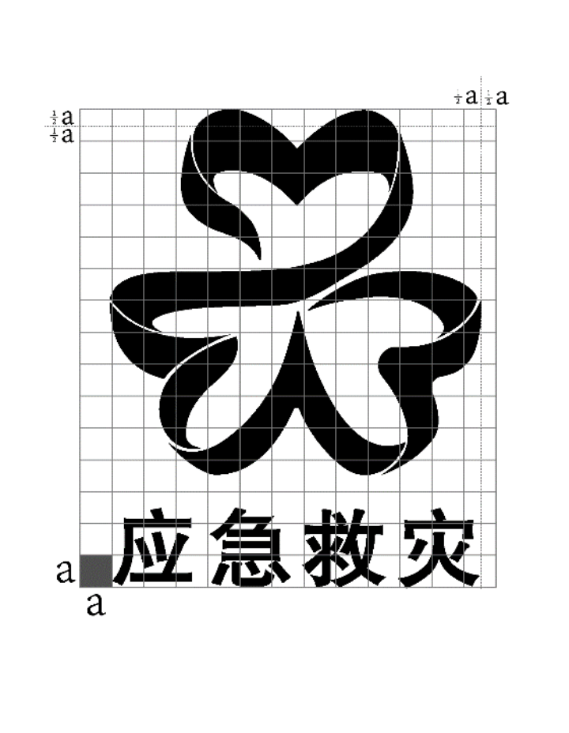
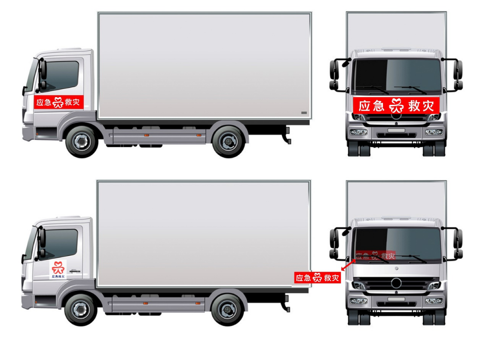

# 国家防灾减灾救灾委员会办公室、应急管理部关于印发《应急救灾物资标识推广使用指南》的通知

时效性：    现行有效

发文机关：  国家防灾减灾救灾委员会办公室,应急管理部

文号：      国防减救办发〔2024〕12号

发文日期：  2024年08月13日

施行日期：  2024年08月13日

效力级别：  部门规范性文件

各省、自治区、直辖市防灾减灾救灾议事协调机构、应急管理厅（局），新疆生产建设兵团减灾委员会、应急管理局：

为进一步加强各级应急救灾物资管理，规范应急救灾物资标识，国家防灾减灾救灾委员会办公室、应急管理部组织设计了应急救灾物资标识，并经国家版权局审核登记。现将标识推广使用指南印发你们，请结合实际推广使用。

# 应急救灾物资标识推广使用指南

第一条　为进一步加强各级应急救灾物资管理，规范应急救灾物资标识，制定本指南。

第二条　本指南所称应急救灾物资，是指为有效应对自然灾害所必需的受灾人员基本生活保障物资。

第三条　应急救灾物资标识（以下简称标识），融合了红色飘带意象和应急管理部英文首字母缩写“MEM”，造型为“MEM”三个字母的变体，同时内嵌三个心形，寓意党和政府与受灾群众万众一心、众志成城、同甘共苦、顽强拼搏的团结救灾精神。标识以中国红为主基调，寓意关爱、祥瑞、希望，整体如三叶草造型，象征蓬勃的生命力、幸运和吉祥，底部呈“人”字形，寓意应急救灾工作坚持人民至上、生命至上，“应急救灾”字体颜色为“应急蓝”，象征保障人民群众生命财产安全的坚强意志和决心。

第四条　标识颜色分为彩色和白色两个版本，根据场景需要选择使用，也可视情进行反白处理等特殊印刷工艺。

第五条　标识图案可单独使用，在特定面积内，设其高度为1，则标识高度比例为0.6；搭配“应急救灾”字样使用时，标识高度比例为0.8。实际使用时，应协调布局，给标识留出足够空间，根据场景不同，尺寸、字号匹配调整。

第六条　标识可用于以下场景：

1.印制于各级采购的应急救灾物资及包装箱表面醒目位置；

2.印制于各级应急物资调运车辆标识；

3.各级应急物资储备库（点）印制、悬挂、张贴；

4.各地应急避难场所应急物资存放点；

5.灾区受灾群众集中安置点；

6.各级应急物资保障队伍标识；

7.其他适宜统一标识形象场景。

第七条　全国各级应急管理部门为该标识的受权使用人，各级应急管理部门组织实施本行政区域以及本级机关标识使用的授权、监督、管理。标识相关使用人未按规定受权使用的，由授权单位责令整改直至停止其标识使用资格。

第八条　本指南自发布之日起实施。

应急救灾物资标识及应用场景示例

图1-1 应急救灾物资标识（彩色）

图1-2 应急救灾物资标识（白色蓝底）

图1-3 应急救灾物资徽章

图2-1 应急救灾物资标识基准规范

图2-2 应急救灾物资标识应用比例

图3-1 应急救灾物资标识应用场景示例（取暖炉）

图3-2 应急救灾物资标识应用场景示例（折叠床）

图3-3 应急救灾物资标识应用场景示例（家庭应急灯）

图3-4 应急救灾物资产品包装箱示例

图4 应急救灾物资调运车辆标识示例

图5 各级应急物资储备库悬挂标识示例

附件.应急救灾物资标识推广使用指南.doc